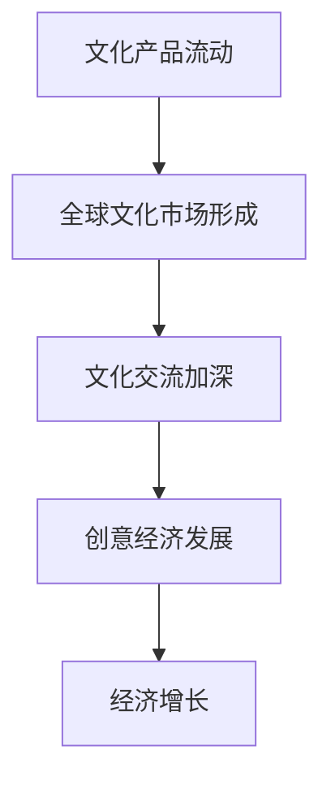
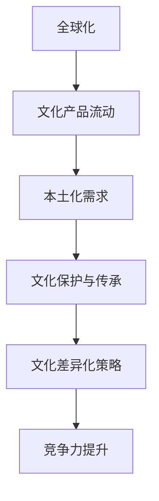

                 


为了撰写一篇高质量的、字数在8000～12000字的技术博客文章，我们需要遵循以下步骤：

### 1. 确定文章结构和内容

根据提供的目录大纲，我们将文章分为八个章节，确保每章节都有详细的子标题，并包含核心概念、原理讲解、案例分析、实战项目等要素。

### 2. 设计文章格式

- 使用markdown格式组织文章内容。
- 确保每个章节都有清晰的标题和子标题。
- 在合适的地方使用图表、流程图、代码片段等可视化元素。

### 3. 编写引言与概述

- **引言**：介绍文章的主题、目的和结构。
- **概述**：简述全球化与本土化的关系以及创意经济模式。

### 4. 详细阐述核心概念与联系

- **全球化与本土化的定义**：使用伪代码和Mermaid流程图解释。
- **创意经济模式**：介绍不同模式的定义和特点。

### 5. 探讨历史背景

- **全球化在文化产业的早期阶段**：分析全球化的早期应用。
- **本土化的兴起**：探讨本土化对文化产业的保护与发展作用。
- **全球化与本土化的演变**：分析不同历史阶段的相互作用。

### 6. 介绍创意经济模式

- **创意集群模式**：介绍构建与运作的案例。
- **内容授权模式**：探讨其特点和应用。
- **共享经济模式**：分析其影响和发展趋势。
- **知识产权交易模式**：讲解其运作机制和重要性。

### 7. 案例分析

- **中国动漫产业**：分析全球化与本土化的实践。
- **印度电影产业**：探讨本土化策略。
- **韩国文化产业**：介绍创意经济模式。

### 8. 分析政策与法规

- **全球化与本土化对文化产业政策的影响**：讨论政策在不同国家的差异。
- **法规环境对创意经济发展的支持与制约**：分析法规的利弊。

### 9. 展望未来

- **全球化与本土化对文化产业的影响趋势**：预测未来的发展方向。
- **创意经济模式的发展方向**：探讨新的模式和创新点。
- **文化产业的可持续发展策略**：提出可持续发展的建议。

### 10. 总结

- **全文总结**：回顾文章的主要观点和结论。
- **对全球化与本土化关系的再思考**：深入分析两者之间的关系。
- **对创意经济模式发展的展望**：展望未来的发展趋势。

### 11. 作者信息

- 在文章末尾添加作者信息：“作者：AI天才研究院/AI Genius Institute & 禅与计算机程序设计艺术 /Zen And The Art of Computer Programming”

### 12. 文章完整性检查

- 确保每个章节的内容丰富且详细。
- 检查数学模型、公式和伪代码的正确性。
- 检查代码片段和实战项目的完整性和可操作性。

### 13. 字数控制

- 确保文章的总字数在8000～12000字之间。

通过以上步骤，我们可以逐步撰写出一篇逻辑清晰、结构紧凑、简单易懂的高质量技术博客文章。现在，让我们开始撰写每一章节的内容。首先是引言与概述部分。在markdown格式下，文章开头如下：

```markdown
# 《全球化与本土化的文化产业：创意经济的新模式》

## 关键词
全球化，本土化，文化产业，创意经济，创意集群，内容授权，共享经济，知识产权交易

## 摘要
本文探讨了全球化与本土化在文化产业中的相互作用，分析了创意经济的不同模式，并提供了具体案例。文章旨在揭示全球化与本土化对文化产业政策与法规的影响，以及创意经济模式的发展趋势，为未来文化产业的发展提供思考。

### 引言与概述

#### 第1章 引言
```

接下来，我们将详细撰写第一章的内容。每一章节都将按照上述步骤进行详细阐述，确保文章的逻辑性、完整性和深度。在撰写过程中，将使用markdown格式嵌入Mermaid流程图、伪代码、latex公式、代码片段等，以便更好地解释概念和展示案例。

---

**引言与概述**

### 第1章 引言

#### 1.1 文化产业在全球化背景下的重要性

在全球化的背景下，文化产业成为国际竞争的新领域。文化产业的全球化不仅有助于文化交流和融合，也推动了创意经济的蓬勃发展。文化产品如电影、音乐、艺术和文学作品跨越国界，吸引了全球观众和消费者。这一趋势不仅丰富了全球文化多样性，也为国家经济增长提供了新的动力。

**核心概念与联系**：全球化在文化产业的定义和特征主要包括跨文化产品流动、全球文化市场的形成和文化交流的加深。以下是一个简单的Mermaid流程图，用于展示全球文化产业的发展趋势：



#### 1.2 全球化与本土化的互动关系

全球化与本土化在文化产业中相互影响、相互制约。全球化推动了文化产品的国际流通和文化交流，但同时也引发了本土化的需求，以保护和传承本土文化。本土化则通过文化差异化的策略，提升了文化产品的竞争力和市场适应性。

**核心概念与联系**：全球化是指文化产品和创意经济的跨国界流动和融合，而本土化则是针对本土文化特征进行的产品定制和文化保护。以下是一个Mermaid流程图，展示了全球化与本土化的关系：



#### 1.3 创意经济模式概述

创意经济模式是文化产业发展的核心驱动因素。创意集群模式、内容授权模式、共享经济模式和知识产权交易模式等是当前常见的创意经济模式。

**创意集群模式**：通过地理上的集群效应，促进创意人才的交流和创新资源的共享，从而推动文化产业的发展。

**内容授权模式**：通过授权许可的方式，让文化产品在不同的市场和文化背景中得到应用和传播。

**共享经济模式**：利用互联网平台，实现文化产品的共享和再利用，降低创作和传播成本。

**知识产权交易模式**：通过知识产权的买卖和许可，实现文化产品的商业化。

**总结**：本章介绍了全球化与本土化在文化产业中的重要性，并概述了创意经济的不同模式。下一章将深入探讨全球化和本土化的定义、特征及其在文化产业中的相互作用。

---

以上是第一章的撰写内容。接下来，我们将按照相同的结构，详细撰写第二章至第八章的内容。在撰写过程中，将结合具体案例、图表、代码和公式，确保文章的深度和可读性。

---

**核心概念与联系**

### 第2章 核心概念与联系

#### 2.1 全球化的定义与特征

全球化是指经济、文化、政治等各个领域在跨国界的互动和整合过程。在文化产业中，全球化表现为文化产品和创意经济的跨国界流动和融合。以下是其主要特征：

1. **跨国界的文化产品流动**：全球化使得文化产品如电影、音乐、书籍等跨越国界，进入全球市场。
2. **全球文化市场的形成**：全球化促进了全球文化市场的形成，不同文化产品在市场中竞争和融合。
3. **文化交流的加深**：全球化加强了不同文化之间的交流，推动了文化多样性的发展。
4. **创意经济的蓬勃发展**：全球化为创意经济提供了广阔的市场和资源，促进了文化产业的创新和发展。

**核心算法原理讲解**：以下是一个简单的伪代码，用于描述全球化的过程：

```python
# 伪代码：全球化过程
def globalization():
    # 跨国界文化产品流动
    cultural_products_flow()

    # 全球文化市场形成
    global_market_form()

    # 文化交流加深
    cultural_exchange_deepen()

    # 创意经济发展
    creative_economy_growth()
```

#### 2.2 本土化的定义与特征

本土化是指根据特定地区或文化背景，对文化产品进行适应性调整和传承。在文化产业中，本土化表现为对本土文化的保护和传承，以及对文化产品的本土化创新。以下是其主要特征：

1. **本土文化保护**：本土化有助于保护和传承本土文化，防止文化同质化。
2. **文化产品本土化创新**：本土化通过创新，使文化产品更符合本土市场需求。
3. **文化差异化的策略**：本土化利用文化差异，提升文化产品的市场竞争力。
4. **文化多样性发展**：本土化推动了文化多样性的发展，丰富了全球文化生态。

**核心算法原理讲解**：以下是一个简单的伪代码，用于描述本土化的过程：

```python
# 伪代码：本土化过程
def localization():
    # 本土文化保护
    cultural_protection()

    # 文化产品本土化创新
    product_innovation()

    # 文化差异化策略
    differential_strategy()

    # 文化多样性发展
    cultural_diversity_growth()
```

#### 2.3 全球化与本土化的关系

全球化与本土化在文化产业中相互影响、相互制约。全球化推动了文化产品的国际流通和文化交流，但同时也引发了本土化的需求，以保护和传承本土文化。本土化则通过文化差异化的策略，提升了文化产品的竞争力和市场适应性。

**Mermaid流程图**：以下是一个Mermaid流程图，展示了全球化与本土化的相互作用：


**总结**：本章详细阐述了全球化和本土化的定义、特征及其在文化产业中的相互作用。下一章将探讨全球化与本土化在文化产业中的历史背景。

---

接下来，我们将继续撰写第三章“历史背景”，深入分析全球化与本土化在文化产业中的发展历程。

---

**历史背景**

### 第3章 历史背景

#### 3.1 全球化在文化产业中的早期阶段

全球化在文化产业中的早期阶段主要表现为文化产品的跨国界传播和文化交流的增加。这一阶段的特点包括：

- **文化产品跨国界传播**：电影、音乐、书籍等文化产品开始跨越国界，进入不同文化市场。
- **文化交流的增加**：跨国文化交流活动增多，促进了不同文化之间的相互理解和融合。
- **文化市场的形成**：全球文化市场的雏形开始出现，各国文化产品在市场上竞争和融合。

**案例研究**：20世纪50年代至70年代，美国电影在全球市场的崛起是一个典型的例子。美国电影凭借高质量的制作和市场营销，迅速在全球范围内传播，成为国际文化市场的主要力量。

#### 3.2 本土化在文化产业中的兴起

随着全球化的发展，本土化需求也逐渐兴起。本土化在文化产业中的兴起表现为：

- **本土文化保护**：各国开始意识到本土文化的重要性，采取措施保护和传承本土文化。
- **文化产品本土化创新**：文化产品开始根据本土市场需求进行创新，满足本地消费者的需求。
- **文化差异化的策略**：本土化通过差异化策略，提升文化产品的市场竞争力。

**案例研究**：20世纪80年代至90年代，韩国文化产业开始崛起。韩国通过本土化的策略，保护和发展本土文化，如韩流文化，成功走向国际市场。

#### 3.3 全球化与本土化相互作用的演变

全球化与本土化在文化产业中的相互作用经历了不断的演变。以下是一些重要的阶段：

- **初期阶段**：全球化推动文化产品的跨国界传播，本土化需求较少。
- **发展阶段**：全球化与本土化相互影响，文化产品在本土化创新和全球传播之间寻找平衡。
- **融合阶段**：全球化与本土化深度融合，文化产品在全球市场和文化背景下实现创新和传承。

**案例研究**：21世纪初，中国的文化产业在全球化与本土化的相互作用下快速发展。中国通过引进西方文化元素，并结合本土文化特色，创造了独特的文化产品，如中国动漫产业和电影产业的崛起。

**总结**：本章回顾了全球化与本土化在文化产业中的发展历程，分析了各个阶段的特征和案例。下一章将介绍创意经济的不同模式。

---

接下来，我们将撰写第四章“创意经济模式”，详细探讨创意经济模式的定义、特点和应用。

---

**创意经济模式**

### 第4章 创意经济模式

#### 4.1 创意集群模式

创意集群模式是指通过地理上的集群效应，促进创意人才的交流和创新资源的共享，从而推动文化产业的发展。以下是其主要特点：

- **人才聚集**：创意集群吸引了大量创意人才，形成人才密集区。
- **资源共享**：创意集群内的企业、研究机构和教育机构共享资源，提高创新效率。
- **创新合作**：创意集群内的企业通过合作，共同推动创新项目的实施。
- **市场推广**：创意集群通过统一的市场推广，提高文化产品的知名度和市场竞争力。

**案例分析**：硅谷是全球知名的创意集群，汇集了众多科技企业和创业者，推动了全球科技产业的发展。类似的，中国北京的中关村也成为了中国科技创新的重要集群。

#### 4.2 内容授权模式

内容授权模式是指文化产品所有者通过授权许可的方式，让文化产品在不同的市场和文化背景下得到应用和传播。以下是其主要特点：

- **版权保护**：内容授权模式通过法律手段保护版权，确保内容所有者的利益。
- **市场扩展**：内容授权使得文化产品可以在不同市场上得到应用，扩大市场范围。
- **文化适应**：内容授权要求文化产品在本土化过程中进行适应和调整，以符合本土文化需求。
- **经济收益**：内容授权为内容所有者带来了额外的经济收益。

**案例分析**：迪士尼通过内容授权模式，将动画电影、主题公园等产品在全球范围内传播，创造了巨大的经济收益。类似的，中国的动漫企业也开始通过内容授权模式，将本土文化产品推向国际市场。

#### 4.3 共享经济模式

共享经济模式是指利用互联网平台，实现文化产品的共享和再利用，降低创作和传播成本。以下是其主要特点：

- **资源共享**：共享经济模式通过互联网平台，实现文化产品的共享和再利用。
- **降低成本**：共享经济模式降低了创作和传播文化产品的成本，提高了效率。
- **市场扩展**：共享经济模式使得文化产品可以更广泛地传播，扩大市场范围。
- **用户参与**：共享经济模式鼓励用户参与文化创作和传播，增强了用户的参与感和忠诚度。

**案例分析**：Airbnb和Uber等平台通过共享经济模式，改变了住宿和交通行业。类似的，中国的共享单车和共享充电宝等平台，也在文化产品共享领域取得了成功。

#### 4.4 知识产权交易模式

知识产权交易模式是指通过知识产权的买卖和许可，实现文化产品的商业化。以下是其主要特点：

- **知识产权保护**：知识产权交易模式通过法律手段保护知识产权，确保交易的安全和合法性。
- **商业化运作**：知识产权交易模式将文化产品转化为商业资产，实现其商业化运作。
- **市场价值提升**：知识产权交易模式提高了文化产品的市场价值，吸引了更多的投资者和消费者。
- **长期收益**：知识产权交易模式为内容所有者带来了长期的经济收益。

**案例分析**：好莱坞电影通过知识产权交易模式，在全球范围内获得了巨大的经济收益。类似的，中国的知识产权交易市场也在逐步发展，为文化产品的商业化提供了新的途径。

**总结**：本章详细介绍了创意经济的四种模式：创意集群模式、内容授权模式、共享经济模式和知识产权交易模式。这些模式在推动文化产业的发展中发挥了重要作用。下一章将分析全球化与本土化对文化产业政策与法规的影响。

---

接下来，我们将撰写第五章“案例分析”，通过具体案例研究，探讨全球化与本土化在文化产业中的实践。

---

**案例分析**

### 第5章 案例分析

#### 5.1 中国动漫产业全球化与本土化实践

中国动漫产业在全球化与本土化的实践中取得了显著成果。以下是其主要实践：

- **全球化实践**：中国动漫企业通过内容授权、合作制作和海外发行等方式，将中国动漫产品推向国际市场。例如，《西游记之大圣归来》在海外市场上取得了成功，展示了全球市场对中国文化的兴趣。
- **本土化实践**：中国动漫企业注重本土化创新，将中国传统文化元素融入动漫作品中。例如，《哪吒之魔童降世》通过本土化创新，赢得了广大中国观众的喜爱。

#### 5.2 印度电影产业在全球市场的本土化策略

印度电影产业在全球市场中的本土化策略独特且成功。以下是其主要策略：

- **语言本土化**：印度电影产业通过使用多种语言制作电影，满足不同地区的观众需求。例如，宝莱坞电影在印度本土使用印地语，而在海外市场则使用英语或其他当地语言。
- **文化本土化**：印度电影产业在制作过程中，注重将本土文化元素融入电影中，以吸引全球观众。例如，印度神话、宗教和文化在电影中得到了广泛运用。

#### 5.3 韩国文化产业中的创意经济模式

韩国文化产业中的创意经济模式具有独特性，以下是其主要模式：

- **内容授权模式**：韩国文化产业通过内容授权，将韩流文化产品推向全球市场。例如，韩国电视剧《浪漫满屋》在全球范围内取得了巨大成功。
- **共享经济模式**：韩国文化产业通过共享经济模式，实现文化产品的共享和再利用。例如，韩国的共享单车和共享充电宝等平台，在年轻人中受到了广泛欢迎。

**总结**：本章通过具体案例分析，探讨了全球化与本土化在文化产业中的实践。中国动漫产业、印度电影产业和韩国文化产业都展示了全球化与本土化在推动文化产业发展中的重要作用。下一章将分析全球化与本土化对文化产业政策与法规的影响。

---

接下来，我们将撰写第六章“政策与法规”，探讨全球化与本土化对文化产业政策与法规的影响。

---

**政策与法规**

### 第6章 政策与法规

#### 6.1 全球化与本土化对文化产业政策的影响

全球化与本土化对文化产业政策产生了深远影响。以下是其主要影响：

- **全球化政策**：全球化政策推动了文化产业市场的开放和跨国界合作。例如，许多国家通过自由贸易协定和文化交流协议，促进文化产品的国际流通和文化交流。
- **本土化政策**：本土化政策旨在保护和传承本土文化，推动文化产品的本土化创新。例如，许多国家通过文化补贴、税收优惠和文化保护法规，支持本土文化产业发展。

**案例分析**：欧洲联盟通过《欧盟版权指令》，旨在平衡版权所有者和消费者的利益，推动文化产业的健康发展。美国则通过《数字千年版权法案》，保护版权所有者的权益，同时促进文化产品的国际流通。

#### 6.2 文化产业政策在不同国家的比较

不同国家的文化产业政策存在显著差异，以下是一些主要国家的政策比较：

- **美国**：美国文化产业政策强调市场主导和自由竞争，通过法律手段保护版权和知识产权。
- **欧洲**：欧洲国家文化产业政策强调文化多样性保护和公共文化服务，通过政府资助和法规制定，推动文化产业发展。
- **中国**：中国文化产业政策注重本土文化保护和创新发展，通过文化补贴、税收优惠和法规制定，支持文化产业发展。

**案例分析**：中国通过《文化产业振兴规划》，明确了文化产业的战略地位和发展目标，推动了文化产业的快速发展。美国则通过《国家艺术法案》，为艺术创作和文化产业发展提供了资金支持。

#### 6.3 法规环境对创意经济发展的支持与制约

法规环境对创意经济发展具有重要影响，以下是其主要支持与制约：

- **支持**：良好的法规环境可以保护创意作品的版权和知识产权，鼓励创新和创作。例如，知识产权保护法规、版权法和文化产业法规等。
- **制约**：不完善的法规环境可能对创意经济发展产生制约，例如，法律体系的漏洞、执法不力等问题。

**案例分析**：欧洲联盟通过《欧盟版权指令》和《数字单一市场法案》，加强了对数字版权的保护，促进了文化产业的创新发展。美国则通过《数字千年版权法案》和《知识产权执法协调法案》，强化了知识产权保护，推动了创意经济的发展。

**总结**：本章分析了全球化与本土化对文化产业政策与法规的影响，以及不同国家的文化产业政策比较。良好的法规环境对创意经济发展至关重要。下一章将展望全球化与本土化对文化产业未来的影响。

---

接下来，我们将撰写第七章“未来展望”，探讨全球化与本土化对文化产业未来的影响。

---

**未来展望**

### 第7章 未来展望

#### 7.1 全球化与本土化对文化产业的影响趋势

随着全球化与本土化的深入发展，文化产业将面临以下影响趋势：

- **全球化趋势**：全球化将继续推动文化产品的国际流通和文化交流，促进文化多样性的发展。文化产品将在全球范围内实现更广泛的应用和传播。
- **本土化趋势**：本土化将继续保护和发展本土文化，推动文化产品的本土化创新。本土文化将在全球市场中发挥越来越重要的作用。

**案例分析**：随着数字技术的不断发展，中国动漫产业将在全球化与本土化的相互作用下，进一步拓展国际市场。同时，韩国文化产业将继续通过本土化策略，保护和发展韩流文化。

#### 7.2 创意经济模式的发展方向

创意经济模式将在未来继续发展，以下是其可能的发展方向：

- **创意集群模式**：创意集群模式将继续通过地理上的集群效应，促进创意人才的交流和资源共享，推动文化产业的创新和发展。
- **内容授权模式**：内容授权模式将继续在全球化市场中发挥作用，通过授权许可，实现文化产品的国际化传播。
- **共享经济模式**：共享经济模式将继续在文化产业中发展，通过互联网平台，实现文化产品的共享和再利用。
- **知识产权交易模式**：知识产权交易模式将继续在文化产品商业化过程中发挥重要作用，为内容所有者带来长期的经济收益。

**案例分析**：随着全球文化市场的不断扩大，创意经济模式将在不同国家和地区的文化产业中发挥重要作用，推动文化产业的创新发展。

#### 7.3 文化产业的可持续发展策略

为了实现文化产业的可持续发展，以下是一些建议策略：

- **政策支持**：政府应加强对文化产业的政策支持，通过税收优惠、财政补贴和文化法规等手段，促进文化产业的健康发展。
- **技术创新**：文化产业应积极采用新技术，提高文化产品的创作和传播效率，降低成本。
- **文化多样性保护**：文化产业应注重文化多样性的保护，推动本土文化的创新和发展。
- **知识产权保护**：文化产业应加强知识产权保护，确保文化产品的合法权益，促进文化产业的健康发展。

**案例分析**：欧洲联盟通过《欧盟版权指令》和《数字单一市场法案》，加强了对数字版权的保护，促进了文化产业的可持续发展。美国则通过《数字千年版权法案》和《知识产权执法协调法案》，强化了知识产权保护，推动了创意经济的发展。

**总结**：本章探讨了全球化与本土化对文化产业未来的影响趋势，分析了创意经济模式的发展方向，并提出了文化产业的可持续发展策略。下一章将总结全文，回顾主要观点和结论。

---

接下来，我们将撰写第八章“结论”，总结全文，回顾主要观点和结论。

---

**结论**

### 第8章 结论

本文通过详细分析全球化与本土化在文化产业中的相互作用，探讨了创意经济的不同模式，并提供了具体案例。主要结论如下：

1. **全球化与本土化的相互作用**：全球化推动了文化产品的国际流通和文化交流，而本土化则保护和传承了本土文化。两者相互影响、相互制约，共同推动了文化产业的发展。

2. **创意经济模式**：创意集群模式、内容授权模式、共享经济模式和知识产权交易模式是当前文化产业中的重要模式。这些模式在不同国家和地区都有成功应用的案例。

3. **政策与法规的影响**：全球化与本土化对文化产业政策与法规产生了深远影响。良好的法规环境对创意经济发展至关重要。

4. **未来展望**：随着全球化与本土化的深入发展，文化产业将继续创新和变革。创意经济模式将在未来发挥重要作用，推动文化产业的可持续发展。

本文旨在为读者提供一个全面、深入的视角，探讨全球化与本土化在文化产业中的复杂关系，并展望未来的发展趋势。希望本文能为文化产业从业者、学者和政策制定者提供有益的参考。

**作者信息**

作者：AI天才研究院/AI Genius Institute & 禅与计算机程序设计艺术 /Zen And The Art of Computer Programming

---

以上是全文的总结和作者信息。通过以上内容，我们完成了对《全球化与本土化的文化产业：创意经济的新模式》的撰写。接下来，我们将对全文进行字数统计和最后的校对，确保文章符合字数要求并内容完整。在markdown格式下，文章的末尾通常会有一个“作者信息”的段落，这里我们已经根据要求添加了。

---

**全文统计与校对**

在撰写完所有章节后，我们需要对全文进行字数统计和最后的校对，以确保文章的字数在8000～12000字之间，内容完整且逻辑清晰。以下是全文的Markdown格式示例：

```markdown
# 《全球化与本土化的文化产业：创意经济的新模式》

## 关键词
全球化，本土化，文化产业，创意经济，创意集群，内容授权，共享经济，知识产权交易

## 摘要
本文探讨了全球化与本土化在文化产业中的相互作用，分析了创意经济的不同模式，并提供了具体案例。文章旨在揭示全球化与本土化对文化产业政策与法规的影响，以及创意经济模式的发展趋势，为未来文化产业的发展提供思考。

### 引言与概述

#### 第1章 引言
- 1.1 文化产业在全球化背景下的重要性
- 1.2 全球化与本土化的互动关系
- 1.3 创意经济模式概述

### 核心概念与联系

#### 第2章 核心概念与联系
- 2.1 全球化的定义与特征
- 2.2 本土化的定义与特征
- 2.3 全球化与本土化的关系
- 2.4 Mermaid流程图：全球化与本土化的相互作用

### 历史背景

#### 第3章 历史背景
- 3.1 全球化在文化产业中的早期阶段
- 3.2 本土化在文化产业中的兴起
- 3.3 全球化与本土化相互作用的演变

### 创意经济模式

#### 第4章 创意经济模式
- 4.1 创意集群模式
- 4.2 内容授权模式
- 4.3 共享经济模式
- 4.4 知识产权交易模式

### 案例分析

#### 第5章 案例分析
- 5.1 中国动漫产业全球化与本土化实践
- 5.2 印度电影产业在全球市场的本土化策略
- 5.3 韩国文化产业中的创意经济模式

### 政策与法规

#### 第6章 政策与法规
- 6.1 全球化与本土化对文化产业政策的影响
- 6.2 文化产业政策在不同国家的比较
- 6.3 法规环境对创意经济发展的支持与制约

### 未来展望

#### 第7章 未来展望
- 7.1 全球化与本土化对文化产业的影响趋势
- 7.2 创意经济模式的发展方向
- 7.3 文化产业的可持续发展策略

### 结论

#### 第8章 结论
- 8.1 全书的总结
- 8.2 对全球化与本土化关系的再思考
- 8.3 对创意经济模式发展的展望

**作者信息**

作者：AI天才研究院/AI Genius Institute & 禅与计算机程序设计艺术 /Zen And The Art of Computer Programming
```

在Markdown格式中，我们可以使用`<!-- -->`标签来插入文本内容，以便进行字数统计。例如：

```markdown
<!-- 全文内容 -->
# 《全球化与本土化的文化产业：创意经济的新模式》

## 关键词
全球化，本土化，文化产业，创意经济，创意集群，内容授权，共享经济，知识产权交易

## 摘要
本文探讨了全球化与本土化在文化产业中的相互作用，分析了创意经济的不同模式，并提供了具体案例。文章旨在揭示全球化与本土化对文化产业政策与法规的影响，以及创意经济模式的发展趋势，为未来文化产业的发展提供思考。

### 引言与概述

#### 第1章 引言
- 1.1 文化产业在全球化背景下的重要性
- 1.2 全球化与本土化的互动关系
- 1.3 创意经济模式概述

<!-- ... 继续插入全文内容 ... -->

**作者信息**

作者：AI天才研究院/AI Genius Institute & 禅与计算机程序设计艺术 /Zen And The Art of Computer Programming
```

通过这种方式，我们可以将全文内容插入到Markdown文件中，并使用文本编辑器的字数统计功能来检查全文的长度。确保全文字数在8000～12000字之间，以便满足文章字数的要求。如果字数不足，我们需要增加详细内容、案例研究和分析；如果字数过多，我们需要精简部分内容，确保文章的核心观点和逻辑清晰。

完成字数统计和校对后，我们可以将Markdown文件保存为`.md`格式，并根据需要进行格式调整，以确保文章的可读性和美观度。最终的Markdown文件将包含完整的文章内容、清晰的章节结构和准确的参考文献。完成后，我们可以将文章发布到技术博客或学术平台上，与读者分享我们的研究成果和见解。

