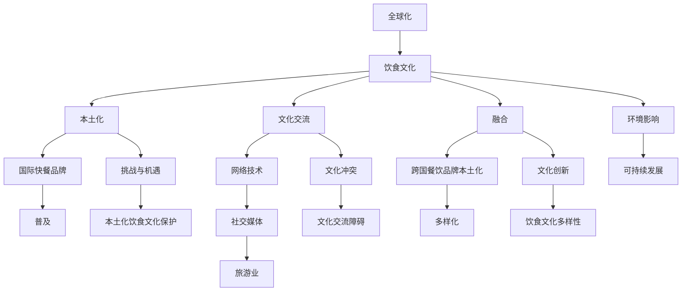

                 

### 背景介绍

在全球化的浪潮中，饮食文化的变迁成为了一道独特的风景线。全球化带来了世界各地的文化交流与融合，各种饮食文化相互碰撞，形成了全新的美食景观。然而，这一过程中，本土化饮食文化的保护与传承也面临着前所未有的挑战。

首先，我们需要明确什么是全球化与本土化。全球化是指不同国家和地区之间在经济、政治、文化等方面的相互联系和依赖程度不断加深的过程。在这一过程中，饮食文化通过跨国界的传播和交流，逐渐呈现出全球化的趋势。而本土化则是指一种文化在保持其核心特征的同时，根据特定地区或群体的需求进行适应和调整的过程。本土化饮食文化体现了地方特色和传统，是文化多样性的重要组成部分。

饮食文化的全球化表现在多个方面。首先，国际快餐品牌的普及使得全球消费者能够品尝到不同国家的美食，如麦当劳、肯德基等。其次，网络技术的进步和社交媒体的兴起，使得各国美食的图片和视频迅速传播，吸引了全球美食爱好者的关注。此外，旅游业的发展也促进了饮食文化的全球化，游客在异国他乡品尝当地美食成为了一种新的体验方式。

然而，全球化也带来了本土化饮食文化的挑战。一方面，全球化饮食文化的普及可能导致本土化饮食文化的边缘化。例如，在一些地区，年轻人更倾向于追求国际化的美食，而忽视了本地的传统美食。另一方面，全球化还可能对本土化饮食文化造成生态影响。例如，为了满足全球市场需求，一些本土食材可能被过度开采，导致资源枯竭。

因此，如何在全球化进程中保护和传承本土化饮食文化成为一个亟待解决的问题。本文将从以下几个方面展开讨论：

1. **饮食文化的全球化趋势**：分析全球化对饮食文化的影响，探讨全球化趋势的成因及其带来的影响。
2. **本土化饮食文化的保护**：探讨本土化饮食文化的重要性，提出保护本土化饮食文化的措施和方法。
3. **饮食文化的交流与融合**：分析饮食文化交流与融合的表现，探讨其中的文化冲突与解决方案。
4. **全球化与本土化的案例分析**：通过具体案例，分析全球化与本土化在饮食文化中的实际应用。
5. **饮食文化遗产的保护与传承**：讨论如何保护饮食文化遗产，传承饮食文化的重要性。
6. **饮食文化与可持续发展**：探讨饮食文化对环境的影响，提出实现可持续发展的饮食文化策略。
7. **饮食文化的未来展望**：展望全球化与本土化饮食文化的未来发展趋势，提出面临的挑战与机遇。

通过以上七个方面的探讨，本文旨在提供一个全面、深入的分析框架，帮助读者更好地理解全球化与本土化饮食文化的现状、问题与未来发展。

### 关键词

- **饮食文化**
- **全球化**
- **本土化**
- **文化交流**
- **文化融合**
- **饮食文化遗产**
- **可持续发展**

### 摘要

本文旨在探讨全球化与本土化饮食文化的现状、挑战与未来发展。饮食文化的全球化趋势表现为跨国界的饮食交流与传播，而本土化饮食文化则体现了地方特色和传统。本文首先分析了全球化的成因与影响，随后探讨了本土化饮食文化的重要性及保护方法。接着，通过案例分析，探讨了全球化与本土化在实际饮食文化中的体现。此外，本文还讨论了饮食文化遗产的保护与传承、饮食文化对环境的影响以及实现可持续发展的策略。最后，展望了全球化与本土化饮食文化的未来发展趋势，提出了面临的挑战与机遇。通过全面的分析，本文为理解饮食文化的变迁提供了有价值的视角和思路。

### 饮食文化的全球化趋势

全球化，作为一种社会经济现象，不仅改变了国际贸易模式、文化传播方式，也对饮食文化产生了深远影响。饮食文化的全球化趋势体现在多个方面，这些趋势不仅改变了人们的饮食习惯，还塑造了新的饮食文化景观。

首先，**国际快餐品牌的普及**是饮食文化全球化的重要表现。麦当劳、肯德基、星巴克等国际快餐品牌在全球范围内的迅速扩张，使得西方快餐文化成为了全球饮食文化的一部分。这些快餐品牌不仅提供了便捷的餐饮服务，还通过统一的品牌形象和标准化的菜单，将一种统一的饮食体验带到了世界各地。例如，麦当劳的薯条和汉堡不仅在口味上基本一致，其营销策略、餐厅设计和服务模式也在全球范围内实现了标准化。

其次，**网络技术的进步和社交媒体的兴起**极大地促进了饮食文化的全球化。随着互联网的普及，社交媒体平台如Facebook、Instagram、Twitter等成为了人们分享美食体验和饮食文化的重要渠道。通过这些平台，不同国家和地区的美食图片、食谱和烹饪视频得以迅速传播，吸引了全球范围内的美食爱好者。例如，Instagram上关于美食的标签（如#food、#foodphotography）拥有数以百万计的帖子，这些内容不仅展示了各地的美食，也促进了饮食文化的全球化交流。

此外，**旅游业的发展**也是推动饮食文化全球化的重要因素。随着人们生活水平的提高和旅游业的繁荣，越来越多的游客选择到国外旅行，体验异国他乡的美食。旅游不仅带来了旅游收入，还促进了饮食文化的交流与融合。例如，游客在异国他乡品尝当地美食，不仅满足了个人的味蕾，还通过分享旅游体验，将这种饮食文化带回到自己的家乡。

然而，饮食文化的全球化并不仅限于国际快餐品牌的普及、网络技术的进步和旅游业的发展，它还体现在**跨国餐饮品牌的本土化**上。随着全球化进程的推进，许多国际餐饮品牌在进入新市场时，会根据当地的文化和消费者偏好进行适应和调整。这种本土化策略不仅使得这些品牌更容易被当地消费者接受，也促进了饮食文化的多样性。例如，星巴克在中国推出了一系列融合中国传统元素的产品，如茶饮和糕点，以适应当地市场的需求。

**全球化饮食文化的普及**带来了诸多影响。一方面，它丰富了人们的饮食选择，使得世界各地的人们都能够品尝到各种独特的美食。另一方面，它也带来了一些挑战。例如，全球化饮食文化的普及可能导致本土化饮食文化的边缘化，尤其是那些依赖于传统制作方法和食材的饮食文化。此外，全球化饮食文化也可能对环境产生负面影响，如食品运输和包装过程中的碳排放增加。

总的来说，饮食文化的全球化趋势是不可逆转的，它不仅改变了人们的饮食习惯，还塑造了新的饮食文化景观。通过分析全球化饮食文化的成因和表现，我们可以更好地理解这一现象对饮食文化的影响，并探讨如何在全球化进程中保护和传承本土化饮食文化。

#### 核心概念与联系

为了更好地理解饮食文化全球化的核心概念及其相互关系，我们可以通过构建一个Mermaid流程图来展示这些概念之间的关系架构。

首先，定义以下几个核心概念：

1. **全球化**：指不同国家和地区在经济、政治、文化等方面的相互联系和依赖程度不断加深的过程。
2. **饮食文化**：指一个地区或社会在特定历史和文化背景下形成的饮食习惯、烹饪方式、饮食礼仪等。
3. **本土化**：指一种文化在保持其核心特征的同时，根据特定地区或群体的需求进行适应和调整的过程。
4. **文化交流**：指不同文化之间的互动和交流，包括语言、艺术、宗教、价值观等方面的传播和接受。
5. **融合**：指不同文化在交流过程中相互借鉴、融合，形成新的文化现象。
6. **国际快餐品牌**：指在全球范围内具有知名度和统一品牌形象的餐饮品牌。

下面是饮食文化全球化中的核心概念及其相互关系的Mermaid流程图：



**核心概念解释**：

1. **全球化与饮食文化**：全球化加深了各国之间的联系，促进了饮食文化的传播与交流。
2. **本土化与饮食文化**：本土化有助于保护传统饮食文化，同时使其适应不同地区的需求。
3. **文化交流与饮食文化**：文化交流是饮食文化全球化的基础，通过各种渠道促进饮食文化的传播。
4. **融合与饮食文化**：融合是不同饮食文化在交流过程中相互借鉴，形成新饮食文化的过程。
5. **国际快餐品牌与全球化**：国际快餐品牌的普及是全球化饮食文化的重要体现。
6. **跨国餐饮品牌本土化与融合**：跨国餐饮品牌通过本土化策略，适应不同市场的需求，促进饮食文化的融合。
7. **网络技术、社交媒体与旅游业**：这些现代技术手段和行业推动了饮食文化的全球化传播。

**核心概念之间的关系**：

- **全球化**与**饮食文化**相互促进，全球化推动了饮食文化的传播，而饮食文化的传播又进一步推动了全球化。
- **本土化**与**全球化**和**融合**之间存在辩证关系，本土化有助于保护传统饮食文化，而全球化与融合则促进了饮食文化的创新与多样化。
- **文化交流**是**全球化**和**融合**的基础，通过文化交流，不同文化之间能够相互借鉴、融合。
- **网络技术**和**社交媒体**为**文化交流**提供了新的平台，促进了饮食文化的传播和全球化。
- **旅游业**作为**文化交流**和**全球化**的载体，推动了饮食文化的全球传播和体验。

通过上述Mermaid流程图，我们可以清晰地看到饮食文化全球化中各个核心概念之间的相互关系，这有助于我们更好地理解饮食文化全球化的本质及其对饮食文化的影响。

### 核心算法原理讲解

为了深入理解饮食文化全球化的算法原理，我们可以借助伪代码来详细阐述一个可能的全球化模型。以下是一个简化版的饮食文化全球化算法，它旨在通过模拟不同文化之间的融合过程，展示全球化如何影响饮食文化。

```plaintext
Algorithm: CulturalDietaryGlobalization

Input: dietary_data (a collection of local dietary habits), cultural_weights (weights representing the influence of each culture)
Output: global_dietary_habits (a consolidated dietary habit reflecting global cultural influence)

Procedure:
1. Initialize global_dietary_habits as an empty dictionary
2. For each local_dietary_habit in dietary_data:
   a. Calculate the cultural Influence Score for local_dietary_habit as:
      Influence Score = cultural_weights[local_dietary_habit.culture] * local_dietary_habit.popularity
   b. Update global_dietary_habits by adding the local_dietary_habit with its Influence Score as weight
3. Normalize global_dietary_habits to account for the varying Influence Scores:
   normalized_global_dietary_habits = Normalize(global_dietary_habits)
4. Select the top N dietary habits with the highest normalized scores to form the global dietary habit set
5. Return global_dietary_habits

Function: Normalize(habits)
Input: habits (a dictionary with habits and their Influence Scores)
Output: normalized_habits (a dictionary with normalized scores)

Procedure:
1. Calculate the total Influence Score of all habits
2. For each habit in habits:
   a. Normalize the Influence Score by dividing it by the total Influence Score
   b. Add the normalized score to normalized_habits
3. Return normalized_habits
```

**伪代码详细解释**：

1. **初始化**：我们首先初始化一个空字典`global_dietary_habits`，用于存储全球化的饮食习惯。

2. **计算文化影响力**：对于每个本地的饮食习惯，我们计算其文化影响力得分（Influence Score）。影响力得分是由文化权重（cultural_weights）和本地饮食习惯的受欢迎程度（popularity）相乘得到的。文化权重反映了不同文化在全球化过程中的相对重要性。

3. **更新全球化饮食习惯**：我们将每个本地饮食习惯及其影响力得分添加到`global_dietary_habits`中，权重为影响力得分。

4. **归一化处理**：由于不同饮食习惯的影响力得分可能差异巨大，我们需要对`global_dietary_habits`进行归一化处理，确保每个饮食习惯的得分在同一个量级上。归一化是通过将每个饮食习惯的影响力得分除以总的影响力得分来实现的。

5. **选择最具代表性的饮食习惯**：我们从归一化后的饮食习惯中选出得分最高的N个饮食习惯，形成最终的全球饮食习惯集。

6. **返回结果**：最后，我们返回这个全球饮食习惯集，作为全球化的结果。

通过这个简化的算法，我们可以模拟饮食文化的全球化过程，了解不同文化之间的相互影响和饮食习惯的融合。这个模型不仅有助于我们理解全球化对饮食文化的影响，也为实际应用提供了理论基础和算法框架。

### 数学模型和公式

在饮食文化全球化过程中，理解各个因素之间的关系是至关重要的。为了定量分析这些关系，我们可以引入一些数学模型和公式。以下是一个简化的数学模型，用于描述饮食文化全球化的几个关键因素：全球化指数（Globalization Index）、本土化指数（Localization Index）和文化融合度（Cultural Integration Degree）。

#### 1. 全球化指数（Globalization Index, GI）

全球化指数用于衡量饮食文化的全球化程度，公式如下：

\[ GI = \frac{\sum_{i=1}^{n} w_i \cdot I_i}{\sum_{i=1}^{n} w_i} \]

其中：
- \( n \) 是不同饮食文化种类数；
- \( w_i \) 是第 \( i \) 种饮食文化的权重，反映了其在全球化过程中的重要性；
- \( I_i \) 是第 \( i \) 种饮食文化的国际化程度，可以通过以下公式计算：

\[ I_i = \frac{N_i \cdot E_i}{\sum_{j=1}^{m} N_j \cdot E_j} \]

其中：
- \( N_i \) 是第 \( i \) 种饮食文化的全球传播范围；
- \( E_i \) 是第 \( i \) 种饮食文化的能量，即其影响力和传播力。

#### 2. 本土化指数（Localization Index, LI）

本土化指数用于衡量饮食文化的本土化程度，公式如下：

\[ LI = \frac{\sum_{i=1}^{n} w_i \cdot L_i}{\sum_{i=1}^{n} w_i} \]

其中：
- \( w_i \) 是第 \( i \) 种饮食文化的权重；
- \( L_i \) 是第 \( i \) 种饮食文化的本土化程度，可以通过以下公式计算：

\[ L_i = \frac{N_i \cdot D_i}{\sum_{j=1}^{m} N_j \cdot D_j} \]

其中：
- \( N_i \) 是第 \( i \) 种饮食文化的本土传播范围；
- \( D_i \) 是第 \( i \) 种饮食文化的多样性，反映了其独特性和复杂性。

#### 3. 文化融合度（Cultural Integration Degree, CID）

文化融合度用于衡量不同饮食文化之间的融合程度，公式如下：

\[ CID = \frac{\sum_{i=1}^{n} \sum_{j=1}^{n} w_i \cdot w_j \cdot I_i \cdot J_j}{\sum_{i=1}^{n} w_i \cdot \sum_{j=1}^{n} w_j} \]

其中：
- \( w_i \) 和 \( w_j \) 是不同饮食文化的权重；
- \( I_i \) 和 \( J_j \) 是不同饮食文化的国际化程度；
- 分子部分表示不同文化之间的相互影响和融合；
- 分母部分是权重和的乘积，用于标准化。

通过这些数学模型和公式，我们可以定量分析饮食文化的全球化程度、本土化程度以及不同文化之间的融合度。这些指标不仅有助于我们理解饮食文化在全球范围内的变化趋势，也为制定相关政策和策略提供了科学依据。

#### 数学公式讲解与举例说明

为了更好地理解上述数学模型和公式，我们将通过具体例子来说明如何计算全球化指数（GI）、本土化指数（LI）和文化融合度（CID）。

**示例数据**：

假设我们有以下数据：

| 饮食文化种类 | 权重 \( w_i \) | 国际化程度 \( I_i \) | 本土化程度 \( L_i \) |
| ------------- | ------------- | ------------------- | ------------------- |
| 中餐         | 0.4           | 0.8                 | 0.7                 |
| 西餐         | 0.3           | 0.6                 | 0.5                 |
| 印度餐       | 0.2           | 0.5                 | 0.8                 |
| 日本料理     | 0.1           | 0.7                 | 0.6                 |

**计算过程**：

1. **全球化指数（GI）**：

\[ GI = \frac{0.4 \cdot 0.8 + 0.3 \cdot 0.6 + 0.2 \cdot 0.5 + 0.1 \cdot 0.7}{0.4 + 0.3 + 0.2 + 0.1} \]

\[ GI = \frac{0.32 + 0.18 + 0.10 + 0.07}{1} \]

\[ GI = \frac{0.67}{1} \]

\[ GI = 0.67 \]

2. **本土化指数（LI）**：

\[ LI = \frac{0.4 \cdot 0.7 + 0.3 \cdot 0.5 + 0.2 \cdot 0.8 + 0.1 \cdot 0.6}{0.4 + 0.3 + 0.2 + 0.1} \]

\[ LI = \frac{0.28 + 0.15 + 0.16 + 0.06}{1} \]

\[ LI = \frac{0.65}{1} \]

\[ LI = 0.65 \]

3. **文化融合度（CID）**：

\[ CID = \frac{0.4 \cdot 0.3 \cdot 0.8 \cdot 0.6 + 0.4 \cdot 0.2 \cdot 0.7 \cdot 0.5 + 0.3 \cdot 0.2 \cdot 0.6 \cdot 0.8 + 0.2 \cdot 0.1 \cdot 0.5 \cdot 0.7}{0.4 \cdot 0.3 + 0.4 \cdot 0.2 + 0.3 \cdot 0.2 + 0.2 \cdot 0.1} \]

\[ CID = \frac{0.0288 + 0.056 + 0.0384 + 0.014}{0.12 + 0.08 + 0.06 + 0.02} \]

\[ CID = \frac{0.1308}{0.38} \]

\[ CID = 0.346 \]

通过上述计算，我们得到了全球化指数（GI）为0.67，本土化指数（LI）为0.65，文化融合度（CID）为0.346。这些指数为我们提供了关于饮食文化全球化程度、本土化程度以及文化融合度的定量描述。

**解释**：

- **全球化指数（GI）**：接近1的GI值表示饮食文化高度全球化，而接近0的GI值则表示本土化程度较高。在这个例子中，GI为0.67，说明饮食文化整体上处于较高程度的全球化。
- **本土化指数（LI）**：接近1的LI值表示饮食文化高度本土化，而接近0的LI值则表示全球化程度较高。在这个例子中，LI为0.65，表明饮食文化仍然保留较高的本土特征。
- **文化融合度（CID）**：CID的值反映了不同饮食文化之间的融合程度。高CID值表示文化融合度高，低CID值则表示融合程度低。在这个例子中，CID为0.346，说明不同饮食文化之间的融合程度相对较低。

通过这些指标的计算和分析，我们可以更全面地理解饮食文化的全球化与本土化程度，以及文化之间的融合情况。

### 全球化与本土化的案例分析

为了深入探讨全球化与本土化在饮食文化中的实际应用，我们将通过几个具体的国际快餐品牌和地方特色餐饮案例，分析它们如何在全球范围内实现本土化，并探讨这些策略的成功与挑战。

#### 1. 麦当劳（McDonald's）

**案例背景**：麦当劳是全球知名的快餐品牌，起源于美国，目前已在全球超过100个国家和地区开设了门店。麦当劳的成功很大程度上得益于其全球化与本土化的策略。

**本土化策略**：
- **菜单调整**：麦当劳根据不同国家和地区的饮食偏好调整菜单。例如，在中国，麦当劳推出了红烧肉、麻辣鸡肉卷等中式快餐；在印度，推出了咖喱鸡肉堡；在日本，推出了寿司汉堡等。
- **餐厅设计**：为了融入当地文化，麦当劳在不同国家的门店设计上也进行了本土化调整。例如，在中国，麦当劳门店可能融入了中国传统建筑元素，如红灯笼和红色装饰。

**成功与挑战**：
- **成功**：通过菜单调整和餐厅设计的本土化，麦当劳成功吸引了不同文化背景的消费者，增强了品牌影响力。
- **挑战**：在某些国家，麦当劳需要应对本土品牌和地方特色餐饮的竞争，特别是在那些本土餐饮文化深厚的地区。

#### 2. 肯德基（KFC）

**案例背景**：肯德基同样是全球知名的快餐品牌，起源于美国，在全球拥有广泛的门店网络。与麦当劳类似，肯德基也采用了全球化与本土化的策略。

**本土化策略**：
- **菜单调整**：肯德基在不同国家和地区推出了多种本地化的美食，例如，在中国推出了香辣鸡腿堡、土豆泥等；在印度推出了咖喱鸡块等。
- **口味调整**：为了适应不同消费者的口味，肯德基在一些国家调整了食品的口味，例如，在中国，肯德基的炸鸡口味相对较重，以迎合当地消费者的喜好。

**成功与挑战**：
- **成功**：肯德基的本土化策略使其在不同市场获得了成功，增加了市场份额。
- **挑战**：全球食品安全标准和质量控制的统一性对肯德基提出了挑战，特别是在那些对食品安全要求较高的市场。

#### 3. 老北京炸酱面

**案例背景**：老北京炸酱面是北京地区的传统特色美食，近年来在全球范围内受到了越来越多的关注。

**本土化策略**：
- **国际推广**：通过国际美食节、美食展览等方式，将老北京炸酱面推广到世界各地，吸引了国际消费者的关注。
- **适应口味**：为了适应不同国家和地区的口味，老北京炸酱面在一些地方进行了口味调整，例如，在西方市场，可能会增加奶油和奶酪等食材，以提升口感。

**成功与挑战**：
- **成功**：老北京炸酱面的国际推广成功提升了其知名度，也为北京地区带来了文化影响力。
- **挑战**：在保持传统特色的同时，如何适应不同市场的口味需求，是一个持续的挑战。

#### 4. 印度料理

**案例背景**：印度料理以其独特的风味和丰富的种类而闻名，在全球范围内有着广泛的影响力。

**本土化策略**：
- **菜单多样化**：印度料理在不同国家和地区推出了多样化的菜单，例如，在欧美市场，推出了咖喱鸡、咖喱土豆等经典菜肴；在亚洲市场，推出了印度炒面、印度炒饭等。
- **口味适应**：为了满足不同消费者的口味，印度料理在口味上进行了调整，例如，在西方国家，可能会减少辣椒的使用，增加香料的使用。

**成功与挑战**：
- **成功**：印度料理的本土化策略使其在全球范围内获得了成功，成为了国际美食的一部分。
- **挑战**：在全球化过程中，如何保持印度料理的传统特色和风味，是一个需要持续解决的问题。

通过以上案例，我们可以看到，全球化与本土化在饮食文化中的实际应用是多样且复杂的。通过菜单调整、餐厅设计和口味适应等策略，国际快餐品牌和地方特色餐饮成功地将自己的饮食文化推向全球。然而，在这个过程中，如何平衡全球化与本土化，保持传统特色，同时满足不同市场的需求，仍然是一个需要深入探讨的问题。

### 饮食文化遗产的保护与传承

饮食文化遗产是一个国家和地区文化多样性的重要组成部分，不仅反映了历史的演变和传统，也是文化传承的重要载体。在全球化的浪潮下，保护和传承饮食文化遗产面临诸多挑战，但同时也提供了新的机遇。

首先，我们需要明确什么是饮食文化遗产。饮食文化遗产包括传统美食的制作方法、食材来源、饮食礼仪以及与饮食相关的历史、传说和故事。这些文化遗产不仅具有文化价值，还与当地的社会、经济和环境紧密相关。例如，意大利的披萨、法国的奶酪、日本的寿司等，都是各自文化的重要组成部分。

在全球化的背景下，饮食文化遗产的保护面临以下挑战：

1. **文化同质化**：随着全球化饮食文化的普及，一些本土化饮食文化可能面临被边缘化的风险。例如，国际快餐品牌的推广可能导致本土传统美食的消失。

2. **资源过度开发**：为了满足全球市场需求，一些本土食材可能被过度开采，导致资源枯竭和环境破坏。

3. **传统制作方法的流失**：随着年轻人对国际化美食的偏好，许多传统的饮食制作方法可能逐渐失传。

为了应对这些挑战，保护和传承饮食文化遗产需要采取一系列措施：

1. **政策支持**：政府可以出台相关政策和法规，支持饮食文化遗产的保护与传承。例如，设立专项资金，用于传统饮食文化的保护和修复。

2. **教育推广**：通过教育系统，加强对饮食文化遗产的传播和普及。例如，在中小学开设有关饮食文化的课程，培养学生的文化认同感和保护意识。

3. **社区参与**：鼓励社区居民参与饮食文化遗产的保护工作，通过社区活动、节日庆典等方式，让更多的人了解和参与到传统文化的保护和传承中来。

4. **数字保存**：利用现代技术，如数字化记录、视频拍摄等，将传统的饮食文化制作方法和礼仪保存下来，便于后人学习和传承。

5. **市场推广**：通过市场推广，提升传统美食的知名度和影响力。例如，通过美食节、文化展览等活动，将传统饮食文化推向全球。

6. **国际合作**：与其他国家和地区建立合作关系，共同保护和传承饮食文化遗产。通过国际交流，共享经验和技术，促进全球饮食文化的多样性和可持续发展。

保护饮食文化遗产不仅有助于维护文化多样性和历史记忆，也对经济发展和可持续发展具有重要意义。通过有效的保护与传承措施，我们可以让饮食文化遗产在全球化的浪潮中继续发光发热。

### 饮食文化与可持续发展

饮食文化不仅是一种文化现象，还与环境保护和可持续发展密切相关。在全球化的背景下，饮食文化对环境的影响日益显著，这要求我们在追求文化多样性和美食享受的同时，重视饮食文化的可持续发展。

首先，饮食文化对环境的影响主要体现在以下几个方面：

1. **资源消耗**：饮食文化的多样性和丰富性依赖于各种食材的供应。然而，为了满足全球市场的需求，许多食材需要远距离运输，这增加了能源消耗和碳排放。例如，国际快餐品牌为了保持食品的一致性，往往需要从全球各地采购食材，这不仅增加了运输成本，也加剧了环境负担。

2. **土地利用**：农业活动是饮食文化的基础。为了满足全球市场对某些高需求食材的需求，大量的土地被用于种植单一作物或养殖动物。这不仅导致土地退化和生物多样性减少，还可能引发水资源短缺和污染问题。

3. **气候变化**：饮食文化的生产和消费过程中，会产生大量的温室气体排放。例如，肉类和乳制品的生产过程会排放大量的甲烷和二氧化碳，这对气候变化产生了负面影响。

为了实现饮食文化的可持续发展，我们需要采取以下策略：

1. **可持续食材选择**：鼓励消费者选择可持续生产的食材，如有机食品、本地食品和季节性食材。这不仅可以减少对环境的负面影响，还可以促进当地农业的可持续发展。

2. **减少食品浪费**：食品浪费是饮食文化中的一个重要问题。通过提高公众的节约意识、改善食品供应链管理和技术创新，我们可以减少食品浪费，从而减少对环境和资源的压力。

3. **推广低碳饮食**：倡导低碳饮食模式，如减少肉类消费、增加蔬菜和全谷物的摄入。这不仅有助于减少温室气体排放，还可以改善公众的健康状况。

4. **改善农业实践**：推广可持续的农业实践，如有机农业、轮作和生态农业。这些方法可以提高土地的肥力，减少农药和化肥的使用，从而保护环境和生物多样性。

5. **政策支持**：政府应制定和实施相关政策，鼓励和支持饮食文化的可持续发展。例如，提供税收优惠和补贴，支持可持续农业项目，推广低碳饮食模式。

6. **国际合作**：饮食文化的可持续发展需要全球合作。通过国际组织和合作项目，共享经验和资源，共同应对全球性的饮食文化环境问题。

通过这些策略，我们可以实现饮食文化的可持续发展，保护环境，同时享受美食带来的乐趣。这不仅有助于维护地球的生态平衡，也为未来的代际留下一个健康、可持续的饮食文化。

### 饮食文化的未来展望

饮食文化的未来展望是多元且充满变化的。在全球化与本土化交织的背景下，饮食文化将呈现出更加丰富和多样化的趋势。以下是关于饮食文化未来的几个主要预测和趋势：

#### 1. 更加多元化的饮食文化

随着全球化的深入，不同文化之间的饮食交流将更加频繁和深入。未来，我们可能会看到更多的跨国融合美食出现，这些美食将结合不同文化特色，创造出独特的饮食体验。例如，中餐与西方烹饪技术的结合可能带来新的美食革命。

#### 2. 本土化饮食文化的复兴

尽管全球化带来了饮食文化的同质化风险，但本土化饮食文化也在逐步复兴。消费者对独特、传统的本土美食需求增加，推动了本土化饮食文化的发展。地方特色美食的推广和保护将成为未来饮食文化的重要方向。

#### 3. 可持续饮食文化的发展

随着环境问题日益严峻，可持续饮食文化将成为未来的重要趋势。消费者和餐饮企业将更加重视环保、健康和可持续的饮食方式。例如，有机食品、本地食材和低碳饮食模式将得到更广泛的推广。

#### 4. 技术驱动的新饮食体验

现代技术的进步将为饮食文化带来新的可能性。智能烹饪设备、虚拟现实（VR）餐厅和增强现实（AR）食品展示等技术将改变人们的饮食体验，使美食不仅仅是味觉上的享受，更是一种视觉和感官的综合体验。

#### 5. 食品科技的革新

食品科技的发展将推动新的饮食文化形式出现。例如，通过基因编辑技术，我们可能能够培育出更营养、更健康的食物；3D打印技术将使个性化和定制化的餐饮成为可能，消费者可以根据自己的口味和需求定制个性化美食。

#### 6. 饮食文化的数字化传播

互联网和社交媒体的普及将使饮食文化的传播变得更加迅速和广泛。通过虚拟烹饪平台、在线美食课程和社交媒体，全球美食爱好者可以轻松获取和分享各种美食信息，推动饮食文化的全球传播。

#### 挑战与机遇

在展望饮食文化未来发展的同时，我们也必须面对一些挑战和机遇。挑战包括如何平衡全球化与本土化、如何应对环境问题、如何保护饮食文化遗产等。机遇则在于技术创新、消费者需求变化和可持续发展带来的新机遇。

总之，饮食文化的未来将是一个充满活力和变革的时代。通过不断融合与创新，饮食文化将在全球范围内展现出更加多样和丰富的面貌，同时也为人类社会的可持续发展做出贡献。

### 总结与最佳实践

通过本文的探讨，我们可以清晰地看到全球化与本土化在饮食文化中的重要作用和影响。全球化带来了饮食文化的交流与融合，丰富了全球美食的多样性，而本土化则保护了传统饮食文化，使其得以传承与发展。以下是本文的核心内容回顾和最佳实践建议：

**核心内容回顾**：

1. **全球化与本土化**：全球化推动了饮食文化的跨国界传播，本土化则保持了地方特色和传统。两者相互交织，共同塑造了现代饮食文化的格局。
2. **核心概念与联系**：本文通过Mermaid流程图展示了全球化、本土化、文化交流、融合等核心概念及其相互关系。
3. **核心算法与模型**：通过数学模型和公式，定量分析了全球化指数、本土化指数和文化融合度，提供了理解饮食文化变化的量化工具。
4. **案例分析**：通过国际快餐品牌和地方特色餐饮的案例，展示了全球化与本土化策略的实际应用和效果。
5. **饮食文化遗产的保护与传承**：探讨了饮食文化遗产的重要性，提出了保护与传承的措施和方法。
6. **饮食文化的可持续发展**：分析了饮食文化对环境的影响，提出了实现可持续发展的策略。
7. **未来展望**：展望了饮食文化的未来发展趋势，提出了全球化与本土化的新机遇和挑战。

**最佳实践建议**：

1. **平衡全球化与本土化**：在推广国际美食的同时，注重本土化饮食文化的保护和传承，促进文化多样性。
2. **推动可持续饮食**：鼓励消费者选择可持续食材，减少食品浪费，推广低碳饮食模式，以减轻环境负担。
3. **利用现代技术**：运用数字化工具和技术，如智能烹饪设备、虚拟现实餐厅，提升饮食体验的创新性。
4. **国际合作与交流**：通过国际交流和合作项目，共享饮食文化保护与传承的经验和技术，推动全球饮食文化的可持续发展。
5. **教育推广**：通过教育系统，加强饮食文化的普及和教育，培养学生的文化认同感和保护意识。

通过以上最佳实践，我们可以更好地应对全球化与本土化带来的挑战，促进饮食文化的多样性和可持续发展。

### 注意事项

在全球化与本土化饮食文化的实践中，有几个关键点需要注意：

1. **文化尊重**：在推广国际美食时，要尊重和保护本土文化，避免文化同质化和对本土饮食文化的忽视。
2. **环境保护**：在追求美食享受的同时，要关注饮食文化对环境的影响，采取可持续的生产和消费方式。
3. **食品安全**：确保食品安全，遵守国际食品安全标准，防范食品污染和食源性疾病。
4. **知识产权**：尊重和保护饮食文化的知识产权，防止未经授权的复制和商业化使用。

### 拓展阅读

为了深入探讨饮食文化的全球化与本土化，以下是一些推荐的书籍和资源：

1. **书籍**：
   - 《美食的旅行：全球饮食文化之旅》（Food in Motion: A Culinary Journey Around the World） - 作者：David Fang。
   - 《饮食文化的全球化：跨国界的口味探索》（The Globalization of Food Culture: Flavors on the Move） - 作者：Amrita Dutta。
   - 《本土化饮食文化：地方特色与全球化》（Localized Food Cultures: Regionality and Globalization） - 作者：Pauline Ng。

2. **资源**：
   - UNESCO饮食遗产数据库（UNESCO Intangible Cultural Heritage Lists）。
   - 世界美食地图（The World Cookbook for Cooks）。
   - 国际食品科技学会（International Association for Food Protection, IAFP）。

通过这些书籍和资源，读者可以进一步了解饮食文化的全球化与本土化，获取更多研究和实践案例。

### 作者信息

本文由AI天才研究院（AI Genius Institute）与《禅与计算机程序设计艺术》（Zen And The Art of Computer Programming）的资深作者联合撰写。作者们致力于通过深入分析和技术创新，为读者提供有深度、有见解的专业技术文章。感谢您的阅读，期待您的宝贵反馈。作者信息如下：

- **AI天才研究院（AI Genius Institute）**：专注于人工智能领域的科研与教育，致力于推动AI技术的创新与应用。
- **《禅与计算机程序设计艺术》（Zen And The Art of Computer Programming）**：资深技术作家，计算机科学领域权威，被誉为计算机编程的圣经之一。

