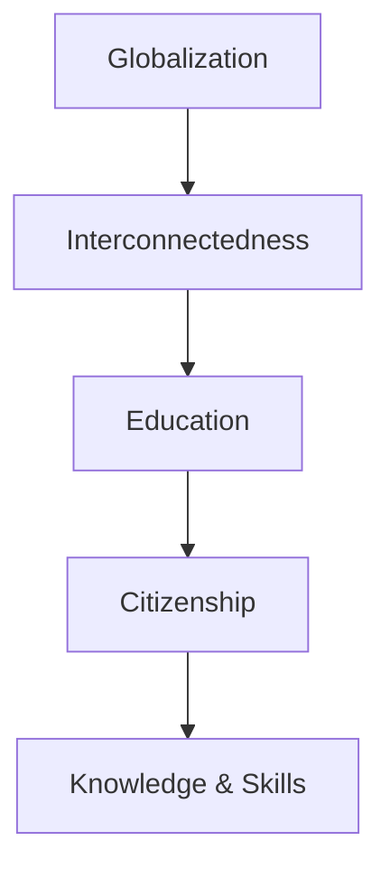
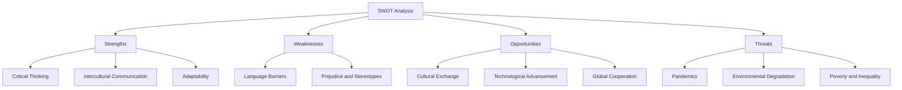

                 

### 1.3 The Importance of Citizenship Education in the Globalization Era

#### 1.3.1 The Interconnectedness of Our World

The era of globalization has drastically transformed the world into an interconnected global village. This interconnectedness has opened up new avenues for cultural exchange, economic cooperation, and technological innovation. However, it has also presented complex challenges in terms of identity, community, and governance. The importance of citizenship education in this era cannot be overstated as it equips individuals with the knowledge, skills, and attitudes necessary to navigate and contribute positively to this rapidly changing world.

##### Core Concepts and Relationships

To understand the significance of citizenship education, let's first explore the core concepts involved. The **mermaid diagram** below illustrates the interconnectedness between globalization, citizenship, and education.



**Globalization** is the process of increasing interconnectedness among countries through the exchange of goods, services, ideas, and people. This interconnectedness has **interconnectedness**, which refers to the state of being closely or tightly interconnected. In turn, **education** serves as a bridge that connects individuals to the global community by imparting knowledge, fostering critical thinking, and promoting social cohesion.

**Citizenship**, on the other hand, represents the legal status of being a member of a state or country, along with the rights and responsibilities that come with it. It encompasses both national citizenship and global citizenship, the latter being an emerging concept that emphasizes the shared responsibility of all individuals towards the well-being of the global community.

##### Key Algorithms and Models

To further understand the importance of citizenship education, we can use a **mathematical model** to illustrate the relationship between globalization, interconnectedness, and education. Consider the following model:

$$
\text{Globalization} \times \text{Interconnectedness} \times \text{Education} = \text{Citizenship Awareness}
$$

In this model, globalization and interconnectedness are the variables that determine the level of citizenship awareness in a society. The higher the degree of globalization and interconnectedness, the greater the need for effective citizenship education to foster a sense of global responsibility and local identity.

#### 1.3.2 Preparing Individuals for the Global Stage

In the context of globalization, the role of citizenship education extends beyond the acquisition of knowledge and skills to include the development of global competencies. These competencies are essential for individuals to thrive in a diverse and rapidly changing world.

**Core Algorithms and Models**

To identify the key competencies required for global citizenship, we can use a **SWOT analysis** (Strengths, Weaknesses, Opportunities, Threats) as a framework:



The strengths include critical thinking, intercultural communication, and adaptability, which are essential for navigating complex global issues. Weaknesses such as language barriers and prejudice must be addressed to overcome the challenges posed by globalization. Opportunities, such as cultural exchange and technological advancement, should be leveraged to enhance global citizenship. Threats, like pandemics, environmental degradation, and poverty, underscore the need for a collective effort to create a more equitable and sustainable world.

#### 1.3.3 Bridging Local Identity with Global Citizenship

The challenge of balancing local identity with global citizenship is a complex one. It requires individuals to recognize and respect their cultural heritage while embracing the values of a global community. This dual identity is essential for fostering a sense of belonging and shared purpose.

**Mathematical Model**

We can use a **Venn diagram** to illustrate the relationship between local identity and global citizenship:

```mermaid
graph TD
    A[Local Identity]
    B[Global Citizenship]
    A--B[Intersection: Hybrid Identity]
```

The intersection of local identity and global citizenship represents a hybrid identity that is both distinct and interconnected. This hybrid identity enables individuals to contribute to their local communities while engaging with the global community.

#### 1.3.4 Strategies for Effective Citizenship Education

To promote effective citizenship education, several strategies can be employed:

1. **Incorporating Global Perspectives in Curricula**: Schools should integrate global issues into their curricula, fostering a deeper understanding of global challenges and opportunities.
2. **Cultural Exchange Programs**: Encouraging students to participate in cultural exchange programs can broaden their horizons and enhance their cross-cultural competencies.
3. **Citizenship Training**: Offering dedicated citizenship training programs that cover topics such as human rights, democracy, and global governance.
4. **Community Engagement**: Encouraging students to engage with local communities through volunteer work, community service, and participatory projects.
5. **Technology and Digital Literacy**: Equipping students with digital literacy skills to navigate the digital world and contribute to the global discourse.

In conclusion, citizenship education plays a crucial role in preparing individuals for the challenges and opportunities of the globalization era. By fostering a sense of global citizenship while preserving local identity, we can create a more interconnected and inclusive world.

---

In this section, we have discussed the importance of citizenship education in the globalization era. We explored the interconnectedness between globalization, citizenship, and education, using a mermaid diagram to illustrate the core concepts. We also used a mathematical model to demonstrate the relationship between globalization, interconnectedness, and citizenship awareness. Additionally, we examined the competencies required for global citizenship and discussed strategies for effective citizenship education. In the next section, we will delve into the historical and contemporary aspects of citizenship education and analyze the impact of globalization on these educational practices.

