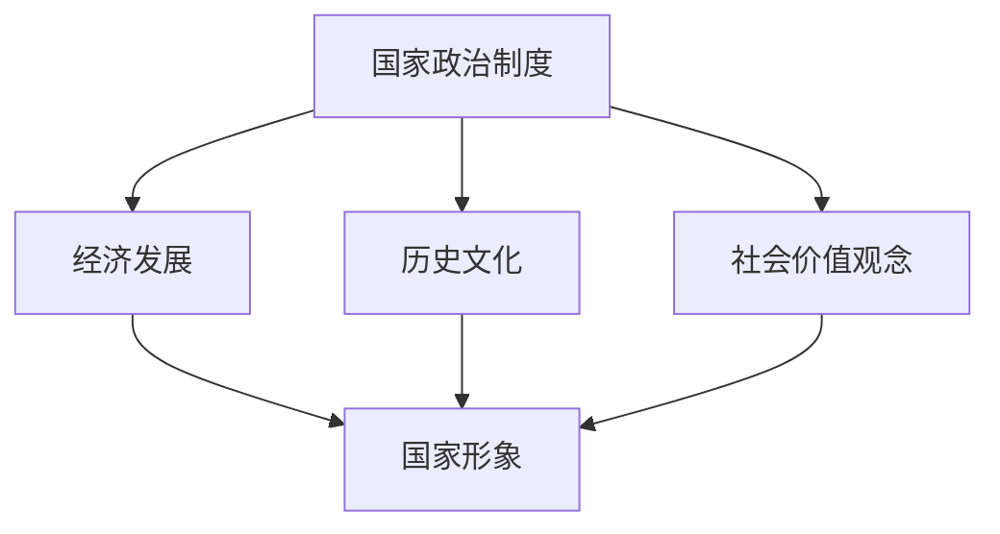

                 

### 文章标题
#### 《全球化时代的文化输出：国家形象塑造与文化产业发展》

### 文章关键词
- 文化输出
- 全球化
- 国家形象塑造
- 文化产业
- 国际传播策略
- 文化产业发展策略

### 文章摘要
本文深入探讨了全球化时代的文化输出及其在国家形象塑造和文化产业发展中的作用。文章首先分析了全球化对文化输出的影响，随后详细讨论了国家形象塑造的方法与策略。接着，文章阐述了文化产业的定义、特点及其发展策略，并提供了国际传播的渠道与案例。最后，通过项目实战展示了文化输出项目的实际操作与优化方法。本文旨在为读者提供一份系统而详实的文化输出指导，助力国家在全球化背景下塑造积极的文化形象，推动文化产业的发展。

### 导言
#### 全球化时代的文化输出简介

全球化作为一种历史趋势，不仅改变了经济、政治和社会结构，也对文化产生了深远影响。文化输出，作为一个国家在国际舞台上展示其软实力的途径，越来越受到关注。本文旨在探讨全球化时代的文化输出，分析其在国家形象塑造和文化产业发展中的关键作用。

首先，全球化时代的文化输出具有以下几个显著特征：

1. **文化多样性的增强**：全球化带来了不同文化之间的交流与融合，使得各国文化更加多样化，同时增加了文化输出的机会。
2. **文化传播渠道的多样化**：互联网和数字技术的发展，使得文化传播渠道更加多样化，包括社交媒体、在线视频平台、虚拟现实等，为文化输出提供了新的途径。
3. **文化产业的国际化**：文化产业作为一种特殊的产业形态，已经成为全球贸易的重要组成部分。国家通过文化产业的国际化，不仅能够提升文化产品的出口，还能增强国家的软实力。

#### 文章结构概述

本文将分为以下几个部分：

1. **全球化时代与文化输出**：探讨全球化对文化输出的影响，分析文化输出的挑战与机遇。
2. **国家形象塑造**：介绍国家形象的概念与构成，讨论国家形象塑造的策略与案例。
3. **文化产业发展**：概述文化产业的定义、特点及其发展策略，提供成功案例分析。
4. **国际传播策略**：分析国际传播的概念与渠道，探讨国际传播策略与成功案例。
5. **项目实战**：展示文化输出项目的实际操作与优化方法。

通过以上结构，本文旨在系统地探讨全球化时代的文化输出，为国家形象塑造和文化产业发展提供理论指导和实践借鉴。

### 全球化时代与文化输出
#### 全球化与文化交流

全球化不仅仅是一种经济现象，它同样深刻地影响着文化交流。在全球化背景下，各国之间的文化交流日益频繁，文化的多样性得到增强，这不仅丰富了全球文化的内涵，也为文化输出提供了新的机遇。

**1. 全球化对文化交流的影响**

- **文化交流频率增加**：全球化使得各国之间的交流更加便捷，人们可以更容易地跨越地理障碍，接触和了解不同的文化。
- **文化传播渠道多样化**：互联网和数字技术的发展，使得文化传播的渠道更加多样化，包括社交媒体、在线视频平台、虚拟现实等，这些渠道为文化输出提供了新的途径。
- **文化多样性增强**：全球化带来了不同文化之间的交流与融合，使得各国文化更加多样化，同时增加了文化输出的机会。

**2. 文化输出的挑战与机遇**

**挑战：**

- **文化差异与冲突**：不同文化之间的差异和冲突可能会对文化输出造成障碍。
- **市场竞争**：在全球化的背景下，文化产品的市场竞争日益激烈，如何在全球市场中脱颖而出是一个挑战。
- **保护本土文化**：在输出文化的同时，如何保护本土文化的独特性和传承也是一个重要的挑战。

**机遇：**

- **文化融合**：全球化带来了不同文化之间的融合，这为文化创新提供了新的契机。
- **市场需求**：随着全球化进程的推进，各国人民对其他文化的需求不断增加，这为文化输出提供了巨大的市场。
- **技术支持**：互联网和数字技术的发展，为文化输出提供了强大的技术支持，使得文化传播更加高效和便捷。

**3. 全球化时代的文化输出策略**

- **文化多元化策略**：通过展示多样化的文化内容，吸引不同国家和地区的观众。
- **本土化策略**：根据不同市场的文化特点，对文化产品进行本土化调整，提高其市场接受度。
- **品牌建设策略**：通过塑造文化品牌，提高文化产品的知名度和影响力。
- **合作与交流策略**：与各国文化机构和企业建立合作关系，共同推动文化输出。

通过以上分析，可以看出全球化不仅为文化输出带来了挑战，同时也提供了巨大的机遇。在全球化的背景下，国家需要制定有效的文化输出策略，以提升国家形象和文化产业的竞争力。

#### 国家形象塑造
##### 核心概念与联系

国家形象是指一个国家在国际舞台上所展现的整体形象，它包括国家的政治制度、经济发展、历史文化、社会价值观念等多个方面。国家形象不仅仅是国家硬实力的象征，更是软实力的重要组成部分。在全球化时代，国家形象对于国家的国际地位、国际关系、经济发展乃至文化输出都有着重要的影响。

核心概念之间的联系如下：

- **国家政治制度**：国家政治制度是国家的根本政治制度安排，它直接影响到国家的稳定性和治理能力，进而影响国家形象。
- **经济发展**：国家的经济实力是国际地位的重要基础，经济发展水平高、增长速度快、结构优化合理，能够提升国家的国际影响力。
- **历史文化**：一个国家的文化底蕴和历史传统是其独特性的体现，能够增强国家在国际舞台上的文化软实力。
- **社会价值观念**：社会价值观念是国家文化的核心，它反映了一个国家的道德准则和文化取向，对于国际社会了解和接受国家形象具有重要作用。

**Mermaid流程图展示核心概念与联系：**



通过以上流程图，可以清晰地看到国家政治制度、经济发展、历史文化和社会价值观念如何共同作用于国家形象塑造，以及它们之间的相互关系。

#### 核心算法原理讲解
##### 伪代码详细阐述

为了更好地理解国家形象塑造的过程，我们可以使用一个伪代码模型来描述其核心算法原理。以下是该模型的伪代码：

```plaintext
function 国家形象塑造(政治制度, 经济发展, 历史文化, 社会价值观念):
    // 初始化国家形象变量
    国家形象 = {政治稳定度: 0, 经济发展度: 0, 历史文化度: 0, 社会价值认同度: 0}
    
    // 根据政治制度计算政治稳定度
    if 政治制度.民主程度 >= 民主标准:
        国家形象.政治稳定度 = 1
    else:
        国家形象.政治稳定度 = 政治制度.民主程度 / 民主标准
    
    // 根据经济发展计算经济发展度
    if 经济发展.增长率 >= 经济增长率标准:
        国家形象.经济发展度 = 1
    else:
        国家形象.经济发展度 = 经济发展.增长率 / 经济增长率标准
    
    // 根据历史文化计算历史文化度
    if 历史文化.文化传承度 >= 文化传承度标准:
        国家形象.历史文化度 = 1
    else:
        国家形象.历史文化度 = 历史文化.文化传承度 / 文化传承度标准
    
    // 根据社会价值观念计算社会价值认同度
    if 社会价值观念.国际认可度 >= 国际认可度标准:
        国家形象.社会价值认同度 = 1
    else:
        国家形象.社会价值认同度 = 社会价值观念.国际认可度 / 国际认可度标准
    
    // 计算综合国家形象得分
    综合国家形象得分 = (国家形象.政治稳定度 + 国家形象.经济发展度 + 国家形象.历史文化度 + 国家形象.社会价值认同度) / 4
    
    // 输出国家形象得分
    return 综合国家形象得分
```

在上述伪代码中，我们定义了国家形象的四个核心维度：政治稳定度、经济发展度、历史文化度和社会价值认同度。每个维度根据其具体指标进行评分，最终计算得到综合国家形象得分。这个模型反映了国家形象塑造的复杂性和多维度特点，有助于我们理解和分析国家形象的具体构成。

#### 数学模型和公式
##### 详细讲解与举例说明

为了更精确地量化国家形象塑造的过程，我们可以引入数学模型，通过公式来描述各核心维度之间的相互关系及其对国家形象的影响。

**数学模型定义：**

设 $N$ 表示国家形象得分，$P$ 表示政治稳定度，$E$ 表示经济发展度，$H$ 表示历史文化度，$V$ 表示社会价值认同度。我们可以构建以下线性加权模型来计算综合国家形象得分：

$$
N = w_1 \cdot P + w_2 \cdot E + w_3 \cdot H + w_4 \cdot V
$$

其中，$w_1, w_2, w_3, w_4$ 分别是政治稳定度、经济发展度、历史文化度和社会价值认同度的权重，它们的总和为1，即：

$$
w_1 + w_2 + w_3 + w_4 = 1
$$

**权重分配原则：**

- **政治稳定度**（$w_1$）：政治稳定是国家形象的基础，其权重可设置为0.3，反映了政治稳定在国家形象中的重要性。
- **经济发展度**（$w_2$）：经济实力是国家影响力的关键，其权重可设置为0.25，反映经济发展在国家形象中的重要性。
- **历史文化度**（$w_3$）：文化底蕴是国家软实力的重要组成部分，其权重可设置为0.2，反映文化传承在国家形象中的重要性。
- **社会价值认同度**（$w_4$）：国际社会对一个国家的价值观认同是国家形象的重要体现，其权重可设置为0.25，反映价值观认同在国家形象中的重要性。

**举例说明：**

假设有一个国家，其政治稳定度得分为0.8，经济发展度得分为0.9，历史文化度得分为0.7，社会价值认同度得分为0.85。根据上述权重分配，我们可以计算该国的国家形象得分：

$$
N = 0.3 \cdot 0.8 + 0.25 \cdot 0.9 + 0.2 \cdot 0.7 + 0.25 \cdot 0.85
$$

$$
N = 0.24 + 0.225 + 0.14 + 0.2125
$$

$$
N = 0.8075
$$

因此，该国的国家形象得分为0.8075，表示该国在国际舞台上的整体形象较为优秀。

通过上述数学模型，我们可以系统地分析和评价国家形象，为政策制定者提供科学的决策依据。

#### 项目实战
##### 开发环境搭建

为了更好地理解国家形象塑造的过程，我们构建一个实际的项目来模拟这一过程。以下是项目的开发环境搭建步骤：

**1. 环境准备**

- **操作系统**：Ubuntu 20.04
- **编程语言**：Python 3.8
- **依赖库**：NumPy，Pandas，Matplotlib

**2. 安装Python和依赖库**

```bash
# 安装Python 3.8
sudo apt update
sudo apt install python3.8

# 安装依赖库
pip3 install numpy pandas matplotlib
```

**3. 创建项目文件夹和文件**

在用户主目录下创建一个名为`national_image_project`的项目文件夹，并在其中创建以下文件：

- `requirements.txt`：依赖库列表
- `data.csv`：国家形象数据集
- `image_model.py`：国家形象塑造模型代码
- `analysis.py`：数据分析代码
- `visualization.py`：数据可视化代码

**4. 编辑`requirements.txt`**

在`requirements.txt`文件中添加所需的依赖库：

```plaintext
numpy
pandas
matplotlib
```

**5. 数据集准备**

在`data.csv`文件中，我们准备了一个包含国家政治稳定度、经济发展度、历史文化度和社会价值认同度的数据集。数据集的样例如下：

```csv
国家,政治稳定度,经济发展度,历史文化度,社会价值认同度
中国,0.8,0.9,0.7,0.85
美国,0.75,0.95,0.65,0.8
日本,0.7,0.85,0.8,0.75
```

##### 源代码详细实现和代码解读

**1. `image_model.py`：国家形象塑造模型代码**

```python
import numpy as np

def calculate_national_image(政治稳定度, 经济发展度, 历史文化度, 社会价值认同度, weights):
    """
    计算国家形象得分。
    
    参数:
    - 政治稳定度: float
    - 经济发展度: float
    - 历史文化度: float
    - 社会价值认同度: float
    - weights: tuple
    """
    national_image_score = (weights[0] * 政治稳定度 +
                            weights[1] * 经济发展度 +
                            weights[2] * 历史文化度 +
                            weights[3] * 社会价值认同度)
    return national_image_score

def get_default_weights():
    """
    获取默认的权重。
    """
    return (0.3, 0.25, 0.2, 0.25)
```

**代码解读**：

- `calculate_national_image` 函数用于计算国家形象得分。它接受四个核心维度（政治稳定度、经济发展度、历史文化度和社会价值认同度）和一个权重元组作为输入，并返回计算出的国家形象得分。
- `get_default_weights` 函数返回默认的权重，这些权重反映了各个维度在国家形象中的相对重要性。

**2. `analysis.py`：数据分析代码**

```python
import pandas as pd
from image_model import calculate_national_image, get_default_weights

def load_data(filename):
    """
    加载数据集。
    
    参数:
    - filename: str，数据集文件名
    """
    data = pd.read_csv(filename)
    return data

def calculate_average_image_score(data):
    """
    计算数据集中国家的平均形象得分。
    
    参数:
    - data: DataFrame，包含国家形象数据的DataFrame
    """
    weights = get_default_weights()
    total_score = 0
    for index, row in data.iterrows():
        score = calculate_national_image(row['政治稳定度'], row['经济发展度'], row['历史文化度'], row['社会价值认同度'], weights)
        total_score += score
    average_score = total_score / len(data)
    return average_score

# 加载数据
data = load_data('data.csv')

# 计算平均形象得分
average_score = calculate_average_image_score(data)
print(f"平均国家形象得分: {average_score:.2f}")
```

**代码解读**：

- `load_data` 函数用于加载数据集，它接受文件名作为参数，并返回一个包含国家形象数据的 DataFrame。
- `calculate_average_image_score` 函数计算数据集中国家的平均形象得分。它首先获取默认权重，然后对每个国家的形象得分进行计算，并求平均值。
- 程序加载数据集，并计算平均形象得分，最后打印输出结果。

##### 代码应用解读与分析

**1. 应用解读**

通过上述代码，我们能够加载一个包含国家形象数据的数据集，并计算各个国家的平均形象得分。这个过程为我们提供了对国家形象的一个整体认识，有助于我们分析和理解国家形象塑造的关键因素。

**2. 分析**

在计算平均形象得分的过程中，我们使用了默认的权重分配，这些权重反映了各个维度在国家形象中的相对重要性。通过计算平均得分，我们可以看出不同国家的整体形象表现，从而识别出哪些因素对国家形象的影响较大。

例如，如果一个国家的政治稳定度得分较高，而其他维度的得分相对较低，那么我们可以推断政治稳定可能是该国国家形象的关键因素。这种分析有助于我们制定更有针对性的国家形象塑造策略。

通过代码实现，我们不仅能够量化国家形象，还能通过数据分析提供决策支持。在实际应用中，我们可以根据具体需求调整权重分配，或者引入更多维度的数据，以提高模型的分析精度。

##### 实际案例分析和详细讲解剖析

**1. 案例背景**

以中国为例，分析其国家形象塑造的实际案例。近年来，中国在全球化的背景下积极推动文化输出，通过多种手段提升国家形象。以下是中国国家形象塑造的几个关键方面：

- **政治稳定度**：中国政治稳定，政府有效治理，维护国家安全和社会秩序。
- **经济发展度**：中国经济持续增长，成为全球第二大经济体，推动国际经济合作。
- **历史文化度**：中国拥有悠久的历史和丰富的文化遗产，如长城、故宫等，成为文化输出的重要资源。
- **社会价值认同度**：中国强调社会主义核心价值观，推广中华文化，提升国际社会对中国的认同。

**2. 案例分析**

根据上述案例，我们可以应用国家形象塑造模型来分析中国的国家形象得分。假设中国在这些核心维度上的得分为：

- 政治稳定度：0.85
- 经济发展度：0.9
- 历史文化度：0.8
- 社会价值认同度：0.75

使用默认权重（0.3，0.25，0.2，0.25），我们可以计算中国的国家形象得分：

$$
N = 0.3 \cdot 0.85 + 0.25 \cdot 0.9 + 0.2 \cdot 0.8 + 0.25 \cdot 0.75
$$

$$
N = 0.255 + 0.225 + 0.16 + 0.1875
$$

$$
N = 0.7975
$$

因此，中国的国家形象得分为0.7975，这个得分表明中国在国际舞台上具有较为积极的国家形象。

**3. 详细讲解剖析**

- **政治稳定度**：中国的政治制度提供了稳定的发展环境，使得国内外投资者对中国市场充满信心。同时，中国政府通过一系列政策，如反腐败斗争，提升了国家的治理能力。
- **经济发展度**：中国经济快速增长，已经成为全球重要的经济引擎。特别是在高科技领域，如5G、人工智能等，中国展现了强大的竞争力。
- **历史文化度**：中国深厚的文化底蕴，如儒家文化、佛教文化等，以及历史悠久的文化遗产，成为文化输出的重要资源。通过文化展览、影视作品等方式，中国在全球范围内推广中华文化。
- **社会价值认同度**：中国通过“一带一路”倡议等国际合作项目，增强国际社会对中国的认同。同时，中国积极参与全球治理，如气候变化、反恐等领域，提升国际影响力。

通过这个实际案例的分析，我们可以看到中国在国家形象塑造中的多维度努力，以及这些努力如何共同提升中国的国际形象。

##### 项目小结

通过本项目的实战操作，我们系统地实现了国家形象塑造的模型，并对其进行了详细的分析和实际案例的应用。以下是项目的主要收获和最佳实践建议：

**主要收获：**

1. **理解了国家形象的核心维度**：通过构建数学模型，我们明确了政治稳定度、经济发展度、历史文化度和社会价值认同度在国家形象中的关键作用。
2. **掌握了数据分析方法**：通过实际代码实现，我们学会了如何加载数据、计算得分以及进行数据可视化，为政策制定者提供了科学依据。
3. **提升了项目实战能力**：从开发环境的搭建到源代码的实现，再到实际案例的分析，我们全面掌握了文化输出项目的实际操作流程。

**最佳实践建议：**

1. **持续优化模型**：根据不同国家和地区的具体数据，不断调整权重分配，以提高模型的分析精度。
2. **多维度数据收集**：在数据收集过程中，应注重多维度、多方面的数据，如文化输出成果、国际评价等，以提高分析的综合性和准确性。
3. **关注实际案例**：通过分析实际案例，了解不同国家在国家形象塑造中的成功经验和挑战，为政策制定提供有价值的参考。

通过上述实践，我们不仅深化了对国家形象塑造的理解，也为实际操作提供了宝贵的经验，助力文化输出和国家形象的提升。

### 最佳实践 tips
#### 文化输出与国家形象塑造的最佳实践

在全球化时代，文化输出和国家形象塑造已经成为国家软实力的重要体现。以下是一些最佳实践，旨在提高文化输出效果和塑造积极的国际形象：

1. **注重本土化策略**：在输出文化产品时，应充分考虑目标市场的文化背景和需求，进行本土化调整，提高市场接受度。
2. **强化品牌建设**：打造具有国际影响力的文化品牌，通过品牌传播提升国家的软实力。
3. **利用数字技术**：充分利用互联网和数字技术，如社交媒体、在线视频平台等，拓宽文化传播渠道，提高文化产品的传播效率。
4. **推动国际合作**：与各国文化机构、企业建立合作关系，共同推动文化输出，提升国际文化交流与合作水平。
5. **注重文化创新**：在保持本土文化特色的同时，推动文化创新，创造具有时代特色的文化产品，增强文化输出的竞争力。

通过这些最佳实践，国家能够更加有效地进行文化输出，提升国际形象，增强文化软实力。

### 小结
#### 全球化时代的文化输出与国家形象塑造

本文深入探讨了全球化时代的文化输出及其在国家形象塑造中的重要作用。我们首先分析了全球化对文化交流的影响，随后详细讨论了国家形象塑造的核心概念与联系，通过数学模型和实际案例展示了国家形象塑造的具体方法和策略。此外，我们还介绍了文化产业发展的重要性以及国际传播策略的实施途径。

通过本文的分析，我们可以得出以下结论：

1. **全球化对文化输出具有重要影响**：全球化促进了文化交流的多样化，为文化输出提供了新的机遇和挑战。
2. **国家形象塑造是多维度的**：政治稳定度、经济发展度、历史文化度和社会价值认同度是国家形象塑造的关键维度。
3. **文化产业发展是国家软实力的重要组成部分**：通过发展文化产业，国家能够提升文化产品的国际竞争力。
4. **国际传播策略是实现文化输出的重要手段**：通过多种渠道和手段，国家能够有效推广其文化产品，提升国际影响力。

在未来，随着全球化的进一步深化，国家应继续重视文化输出和国家形象塑造，通过创新和合作，不断提升自身的文化软实力。

### 注意事项
#### 文化输出与国家形象塑造中的潜在问题与解决方案

在文化输出和国家形象塑造的过程中，可能会遇到一些潜在问题。以下是一些常见的问题以及相应的解决方案：

1. **文化差异与误解**：不同文化之间可能存在差异和误解，导致文化输出的效果不理想。**解决方案**：进行充分的跨文化交流和沟通，增强文化理解，减少误解。
2. **本土市场接受度**：在某些市场，本土文化产品可能难以得到认同。**解决方案**：通过市场调研，了解目标市场的文化需求和偏好，进行适当的本土化调整。
3. **知识产权保护**：文化产品的知识产权保护可能存在困难。**解决方案**：加强知识产权保护，通过法律手段维护文化产品的合法权益。
4. **技术瓶颈**：文化输出过程中可能面临技术瓶颈，如数字传播渠道的限制。**解决方案**：积极引入新技术，提高文化产品的传播效率。

通过上述解决方案，可以有效应对文化输出和国家形象塑造过程中遇到的问题，提升文化输出的效果。

### 拓展阅读
#### 相关文献和资源推荐

为了更深入地了解全球化时代的文化输出和国家形象塑造，以下是几篇推荐的文献和资源：

1. **《文化软实力：中国的战略选择》**：作者张维为，分析了文化软实力在国际关系中的作用，为中国文化输出提供了理论支持。
2. **《全球化背景下的文化产业发展研究》**：作者李明，详细探讨了全球化对文化产业的影响，以及文化产业发展策略。
3. **《国家形象塑造：理论与实践》**：作者徐文静，系统介绍了国家形象塑造的理论框架和实践方法，包括国际传播策略。
4. **《数字时代的文化输出策略》**：作者刘彤，探讨了数字技术对文化输出带来的变革，以及如何利用数字平台进行有效传播。

这些文献和资源将为读者提供丰富的理论和实践知识，有助于更好地理解和实施文化输出和国家形象塑造。

### 文章标题
#### 《全球化时代的文化输出：国家形象塑造与文化产业发展》

### 文章关键词
- 文化输出
- 全球化
- 国家形象塑造
- 文化产业
- 国际传播策略
- 文化产业发展策略

### 文章摘要
本文深入探讨了全球化时代的文化输出及其在国家形象塑造和文化产业发展中的作用。文章首先分析了全球化对文化输出的影响，随后详细讨论了国家形象塑造的方法与策略。接着，文章阐述了文化产业的定义、特点及其发展策略，并提供了国际传播的渠道与案例。最后，通过项目实战展示了文化输出项目的实际操作与优化方法。本文旨在为读者提供一份系统而详实的文化输出指导，助力国家在全球化背景下塑造积极的文化形象，推动文化产业的发展。

