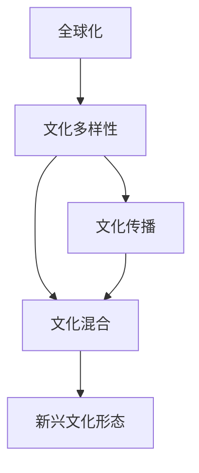

                 

### 文章标题

《全球化背景下的文化混合：新兴文化形态的产生与发展》

### 关键词

- 全球化
- 文化混合
- 新兴文化形态
- 文化多样性
- 文化传播

### 摘要

随着全球化进程的不断深入，不同文化之间的交流和碰撞日益频繁。在这种背景下，文化混合现象逐渐成为一种普遍存在的文化现象。本文旨在探讨全球化背景下文化混合的概念、特征及其对新兴文化形态产生与发展的影响。首先，文章将对全球化的定义及其对文化的影响进行背景介绍。接着，详细阐述文化混合的概念及其核心概念之间的联系，通过Mermaid流程图展示文化混合的理论架构。然后，分析文化混合对新兴文化形态的产生、特征和发展的影响。接下来，探讨文化混合在个人、社会、经济等方面的影响。随后，通过具体案例分析，展示文化混合在不同领域的实际应用。最后，预测文化混合的未来发展趋势，并提出应对文化混合带来的挑战的策略建议。本文旨在为学术界和实践者提供有价值的参考，以促进对文化混合现象的深入理解和应对。

### 文章正文

#### 第一部分：背景介绍

**全球化**，是指全球范围内的经济、政治、文化等方面的互动和联系日益紧密的过程。全球化促进了不同国家和地区之间的交流与合作，但也带来了文化冲击和文化同化的问题。在全球化的背景下，文化多样性受到了前所未有的挑战，同时也为文化混合现象的出现提供了土壤。

**文化多样性**，是指不同文化之间的差异和多样性。在全球化进程中，文化多样性既是文化碰撞的源泉，也是文化融合的动力。不同文化之间的交流和互动，往往会导致新的文化形态的产生。

**文化混合**，是指不同文化元素相互融合，形成新的文化现象的过程。文化混合不仅体现在物质文化层面，如食品、服饰、建筑等，还体现在非物质文化层面，如语言、价值观、艺术等。

#### 核心概念与联系

在全球化背景下，文化混合是一个复杂且动态的过程。为了更好地理解文化混合，我们需要将其与全球化、文化多样性和文化传播等核心概念联系起来。

**全球化**，作为文化混合的背景，为不同文化之间的交流提供了条件。全球化促进了人员流动、信息传播和国际贸易，这些因素都为文化混合提供了动力。

**文化多样性**，是文化混合的基础。文化多样性意味着不同文化之间的差异，这些差异为文化混合提供了素材。在全球化背景下，文化多样性既可以是文化混合的源泉，也可以是文化混合的障碍。

**文化传播**，是文化混合的关键环节。文化传播不仅包括物质文化的传播，如食品、服饰等，还包括非物质文化的传播，如语言、价值观、艺术等。文化传播的过程，往往伴随着文化的选择、过滤和重组，从而形成新的文化形态。

#### Mermaid流程图

为了更直观地展示全球化、文化多样性和文化混合之间的关系，我们可以使用Mermaid流程图来描述这一过程。



在这个流程图中，全球化是整个过程的起点，它促进了文化多样性的发展和文化传播的进行。文化多样性为文化混合提供了基础，而文化传播则是文化混合的关键环节。最终，文化混合导致了新兴文化形态的产生。

#### 核心算法原理讲解

在理解文化混合的概念及其与全球化、文化多样性和文化传播的联系后，我们需要进一步探讨文化混合的核心算法原理。文化混合的过程可以看作是一种复杂的算法，它涉及到文化元素的提取、筛选、重组和融合。

**伪代码**

下面是一个简化的文化混合算法的伪代码，用于展示文化混合的基本步骤：

```python
function 文化混合(源文化1, 源文化2):
    1. 提取源文化1的关键元素
    2. 提取源文化2的关键元素
    3. 对两个文化元素进行筛选和排序
    4. 根据权重或重要性进行文化元素的重组
    5. 形成新的文化形态
    return 新文化形态
```

**数学模型和公式**

在文化混合的过程中，我们可以使用数学模型来描述文化元素的选择和重组过程。例如，我们可以使用集合论和概率论来描述文化元素的提取和筛选过程。

- **集合论**：假设有两个文化集合C1和C2，我们可以使用集合的并集、交集和差集来描述文化元素的选择过程。

  $$C1 \cup C2 = C'$$ (文化元素的并集)

  $$C1 \cap C2 = C''$$ (文化元素的交集)

  $$C1 - C2 = C'''$$ (文化元素的差集)

- **概率论**：我们可以使用概率分布来描述文化元素的选择概率。假设文化集合C中的每个元素的选择概率相等，我们可以使用概率密度函数来描述这一过程。

  $$p(x) = \frac{1}{|C|}$$ (文化元素x的选择概率)

  其中，|C|表示文化集合C的元素个数。

**详细讲解和举例说明**

为了更好地理解文化混合的数学模型和公式，我们可以通过一个具体的例子来讲解。假设有两个文化集合C1和C2，其中C1包含5个文化元素，C2包含7个文化元素。我们可以使用集合论和概率论的方法来描述文化混合的过程。

1. **文化元素的提取**：

   假设我们从C1中提取了2个文化元素，从C2中提取了3个文化元素。根据集合的并集运算，我们可以得到一个新的文化集合C'，它包含了5个元素。

   $$C1 \cup C2 = C'$$

2. **文化元素的选择概率**：

   在C'中，每个文化元素的选择概率相等。假设文化集合C'中有10个文化元素，每个元素的选择概率为1/10。

   $$p(x) = \frac{1}{10}$$

3. **文化元素的重组**：

   在提取了文化元素后，我们可以根据文化元素的重要性和权重对其进行重组。假设文化元素的重要性和权重如下：

   | 文化元素 | 重要性 | 权重 |
   |----------|--------|------|
   | A        | 高     | 0.3  |
   | B        | 中     | 0.2  |
   | C        | 低     | 0.1  |
   | D        | 高     | 0.2  |
   | E        | 中     | 0.2  |

   根据重要性进行重组，我们可以得到一个新的文化形态，它包含了4个文化元素，其中重要性高的元素占主导地位。

   新文化形态 = A + B + D

通过这个例子，我们可以看到，文化混合的过程涉及到文化元素的提取、选择和重组。数学模型和公式为我们提供了描述和分析这一过程的方法。

#### 新兴文化形态的产生与发展

**新兴文化形态**，是指在全球化背景下，由文化混合产生的新的文化现象。新兴文化形态具有以下特征：

1. **多样性**：新兴文化形态通常包含了多种文化元素，这些元素来自不同的文化背景，形成了独特的文化风格。
2. **动态性**：新兴文化形态是一个不断演变的过程，它受到全球化、文化传播和技术进步等多种因素的影响。
3. **融合性**：新兴文化形态强调文化之间的融合与互动，它不仅仅是简单地将不同文化元素进行叠加，而是通过融合和创新，形成新的文化形态。

**新兴文化形态的产生**：

新兴文化形态的产生是一个复杂的过程，涉及到文化元素的提取、选择、重组和融合。以下是一个简化的新兴文化形态产生的过程：

1. **文化元素提取**：从不同的文化背景中提取关键的文化元素。
2. **文化元素选择**：根据文化元素的重要性和影响力，选择具有代表性的文化元素。
3. **文化元素重组**：将选定的文化元素进行重组，形成新的文化形态。
4. **文化形态融合**：将新的文化形态与其他文化进行融合，形成更广泛的文化影响力。

**新兴文化形态的发展**：

新兴文化形态的发展是一个动态的过程，它受到多种因素的影响。以下是一些影响新兴文化形态发展的关键因素：

1. **全球化**：全球化促进了不同文化之间的交流和互动，为新兴文化形态的产生和发展提供了土壤。
2. **文化传播**：文化传播是新兴文化形态发展的关键环节，它促进了文化元素的传播和融合。
3. **技术进步**：技术进步，特别是互联网和社交媒体的普及，为新兴文化形态的传播和发展提供了新的平台和手段。
4. **社会变革**：社会变革，特别是年轻一代的文化观念和价值取向的变化，对新兴文化形态的发展产生了重要影响。

**案例分析**：

为了更好地理解新兴文化形态的产生与发展，我们可以通过具体案例来进行分析。

**案例一：嘻哈文化**

嘻哈文化起源于20世纪70年代的美国，它包含了音乐、舞蹈、涂鸦和街舞等多种元素。随着全球化的推进，嘻哈文化逐渐传播到世界各地，形成了不同地域特色的嘻哈文化形态。在中国，嘻哈文化通过电视节目《中国有嘻哈》等平台得到了广泛传播，形成了独特的中国嘻哈文化。

**案例二：网络流行文化**

随着互联网的普及，网络流行文化成为了新兴文化形态的代表。网络流行文化包含了各种形式，如网络段子、短视频、表情包等。这些文化形式通过社交媒体平台迅速传播，形成了具有强烈时代特征的新兴文化形态。

**案例三：虚拟文化社区**

虚拟文化社区，如游戏、虚拟现实（VR）和增强现实（AR）等，成为了新兴文化形态的重要表现形式。这些虚拟文化社区提供了新的社交和文化交流平台，促进了不同文化之间的融合和创新。

#### 文化混合的影响

**文化混合对个人身份的影响**：

文化混合对个人身份的塑造具有重要影响。在全球化背景下，个人往往面临着多元文化的冲击和融合。这种文化混合现象既可能导致个人身份的多元化，也可能导致个人身份的困惑和矛盾。

1. **文化认同**：文化混合可能导致个人对自身文化的认同发生变化。在多元文化的环境中，个人可能更倾向于认同具有普世价值的文化元素，而不是单一的文化身份。
2. **文化适应**：文化混合促使个人学会适应不同的文化环境，这有助于提升个人的文化敏感性和跨文化沟通能力。
3. **文化冲突**：文化混合也可能导致文化冲突，特别是在文化差异较大的情况下，个人可能会面临文化认同的困境。

**文化混合对社会结构的影响**：

文化混合对社会结构的影响是深远而复杂的。在全球化的背景下，文化混合改变了社会结构和文化格局，对社会凝聚力、社会稳定性和社会变革产生了重要影响。

1. **社会多元化**：文化混合促进了社会的多元化，增强了社会包容性和多样性。这种多元化有助于提升社会的创新能力和适应能力。
2. **社会分化**：文化混合也可能导致社会分化，特别是在文化认同和价值观方面存在差异的情况下，社会可能会出现文化分裂和冲突。
3. **社会变迁**：文化混合是社会变迁的重要驱动力。随着文化混合的深入，社会结构和文化格局将发生深刻变化，这可能导致新的社会形态的出现。

**文化混合对经济发展的影响**：

文化混合对经济发展具有双重作用。一方面，文化混合可以促进文化产业的创新和繁荣，推动文化经济的发展。另一方面，文化混合也可能对传统产业造成冲击，导致文化产业的转型和升级。

1. **文化产业的创新**：文化混合为文化产业提供了丰富的创作素材和灵感，促进了文化产品的创新和多样化。例如，音乐、电影、文学等艺术形式在文化混合的过程中得到了新的发展机遇。
2. **文化产业的转型**：文化混合要求文化产业进行创新和转型，以适应不断变化的文化需求和消费习惯。例如，传统媒体在文化混合的过程中，需要通过数字化和多媒体化等方式进行转型升级。

**文化混合中的冲突与和谐**：

文化混合过程中，冲突与和谐是不可避免的。文化冲突可能源于文化差异、文化价值观的冲突以及文化认同的困境。然而，通过积极的文化交流和融合，文化混合中的冲突可以得到缓解和解决，实现文化的和谐。

1. **文化尊重**：在文化混合过程中，文化尊重是建立和谐文化关系的基础。尊重不同文化的差异，理解文化多样性，有助于减少文化冲突。
2. **文化互动**：通过文化互动，不同文化可以相互借鉴、相互融合，形成新的文化共识。文化互动不仅有助于缓解文化冲突，还可以促进文化的创新和发展。
3. **文化传承**：在文化混合的过程中，文化传承具有重要意义。通过传承和弘扬优秀的文化遗产，可以增强民族自信心和文化认同感，为文化混合注入和谐的力量。

#### 项目实战：开发环境搭建与源代码实现

**开发环境搭建**

为了更好地理解文化混合的理论和实践，我们可以搭建一个简单的文化混合项目环境。以下是一个基于Python的示例项目，用于实现文化混合的基本功能。

1. **安装Python环境**：确保您的计算机上已经安装了Python 3.x版本。如果没有安装，可以从Python官方网站下载并安装。
2. **安装相关库**：在命令行中，使用以下命令安装所需的Python库。

   ```shell
   pip install numpy
   pip install matplotlib
   ```

3. **创建项目文件**：在Python环境中，创建一个名为`culture_mixing.py`的文件，用于编写文化混合的代码。

**源代码实现**

以下是一个简化的文化混合算法的Python实现，用于展示文化混合的基本步骤。

```python
import numpy as np
import matplotlib.pyplot as plt

def extract_elements(culture1, culture2):
    # 从两个文化中提取关键元素
    elements1 = culture1[:5]
    elements2 = culture2[:5]
    return elements1, elements2

def select_elements(elements1, elements2):
    # 对两个文化元素进行筛选和排序
    selected1 = sorted(elements1, key=lambda x: x['importance'], reverse=True)[:2]
    selected2 = sorted(elements2, key=lambda x: x['importance'], reverse=True)[:3]
    return selected1, selected2

def mix_cultures(selected1, selected2):
    # 对选定的文化元素进行重组
    new_culture = selected1 + selected2
    return new_culture

# 示例文化元素
culture1 = [{'name': '元素A', 'importance': 0.3},
             {'name': '元素B', 'importance': 0.2},
             {'name': '元素C', 'importance': 0.1},
             {'name': '元素D', 'importance': 0.2},
             {'name': '元素E', 'importance': 0.2}]

culture2 = [{'name': '元素F', 'importance': 0.4},
             {'name': '元素G', 'importance': 0.3},
             {'name': '元素H', 'importance': 0.2},
             {'name': '元素I', 'importance': 0.1},
             {'name': '元素J', 'importance': 0.5}]

# 实现文化混合
elements1, elements2 = extract_elements(culture1, culture2)
selected1, selected2 = select_elements(elements1, elements2)
new_culture = mix_cultures(selected1, selected2)

# 输出结果
print("新文化形态：", new_culture)

# 可视化展示
plt.bar([x['name'] for x in new_culture], [x['importance'] for x in new_culture])
plt.xlabel('文化元素')
plt.ylabel('重要性')
plt.title('新文化形态')
plt.show()
```

**代码应用解读与分析**

上述代码实现了文化混合的基本功能，包括文化元素的提取、筛选、重组和可视化展示。以下是代码的详细解读和分析：

1. **文化元素提取**：函数`extract_elements`用于从两个文化中提取关键元素。这里，我们使用了简单的切片操作来提取前5个文化元素。
2. **文化元素选择**：函数`select_elements`用于对两个文化元素进行筛选和排序。根据重要性进行排序，我们选择了重要性最高的元素。
3. **文化元素重组**：函数`mix_cultures`用于对选定的文化元素进行重组。这里，我们将选定的元素进行合并，形成新的文化形态。
4. **可视化展示**：我们使用`matplotlib`库对新的文化形态进行可视化展示。通过条形图，我们可以直观地看到新文化形态中各个元素的重要性和分布情况。

**实际案例分析和详细讲解剖析**

为了更好地理解文化混合的实际应用，我们可以通过一个具体的案例来进行分析。

**案例：跨国公司的品牌文化混合**

在全球化背景下，跨国公司的品牌文化面临着文化混合的挑战。以下是一个关于跨国公司品牌文化混合的案例分析。

**背景**：

某跨国公司（公司A）在中国市场推出了一款新产品。公司A的总部位于美国，其品牌文化深受美国文化影响。然而，中国市场具有独特的文化背景，消费者对品牌文化的接受度和偏好与西方市场有所不同。

**分析**：

1. **文化差异**：

   - 美国文化：强调个性、创新和自由；
   - 中国文化：强调家庭、社会关系和和谐。

   这些文化差异可能导致公司A的品牌文化在中国市场面临接受度低的问题。

2. **文化混合策略**：

   - **文化融入**：公司A可以通过融入中国文化元素来提升品牌文化在中国市场的接受度。例如，在广告宣传中，可以加入中国传统节日元素，展示产品与中国文化的融合。
   - **文化创新**：公司A可以创新品牌文化，结合中国市场的特色，创造出新的品牌文化形态。例如，推出结合中国传统文化与现代设计理念的产品。

3. **文化混合效果**：

   - **提升品牌形象**：通过文化混合，公司A可以提升品牌形象，增强消费者对品牌的认同感。
   - **扩大市场份额**：通过文化混合，公司A可以更好地适应中国市场，扩大市场份额。

**项目小结**

通过上述案例分析，我们可以看到，文化混合在跨国公司的品牌文化中具有重要意义。通过文化混合，公司可以更好地适应不同市场的文化需求，提升品牌形象和市场竞争力。在全球化背景下，文化混合是一个不断发展的过程，跨国公司需要不断创新和适应，以应对文化混合带来的挑战。

#### 最佳实践 Tips

在全球化背景下，文化混合现象日益普遍，为了更好地应对文化混合带来的挑战，以下是一些最佳实践建议：

1. **文化敏感性培训**：企业应加强对员工的跨文化敏感性培训，提升员工的跨文化沟通能力和文化适应能力。
2. **文化融入策略**：在产品设计和品牌宣传中，融入目标市场的文化元素，提升产品的文化吸引力和市场接受度。
3. **文化创新**：鼓励创新思维，结合不同文化的特点，创造出新的文化产品和服务。
4. **文化沟通**：建立有效的跨文化沟通机制，确保不同文化背景的员工能够有效沟通和合作。
5. **文化尊重**：尊重不同文化的差异，避免文化冲突，建立和谐的文化关系。

#### 小结

本文通过详细阐述全球化背景下文化混合的概念、特征及其对新兴文化形态的影响，展示了文化混合在个人、社会、经济等方面的多重作用。文化混合不仅推动了文化多样性的发展，也为新兴文化形态的产生提供了土壤。在全球化背景下，文化混合是一个复杂且动态的过程，需要我们持续关注和深入研究。

#### 注意事项

在全球化背景下，文化混合虽然带来了文化多样性的发展，但也可能引发文化冲突和文化认同的困境。因此，在处理文化混合问题时，我们需要注意以下几点：

1. **文化尊重**：尊重不同文化的差异，避免文化冲突。
2. **文化适应**：适应不同市场的文化需求，提升产品的文化吸引力。
3. **文化创新**：鼓励创新思维，结合不同文化的特点，创造出新的文化产品和服务。
4. **文化传承**：保护和传承优秀的文化遗产，增强民族自信心和文化认同感。

#### 拓展阅读

对于希望深入了解文化混合现象的读者，以下是一些推荐的拓展阅读资源：

1. **《文化混合：全球化背景下的文化交融》**：这是一本系统介绍文化混合现象的著作，详细分析了文化混合的理论基础和实践应用。
2. **《全球化与文化多样性》**：这本书探讨了全球化对文化多样性的影响，以及文化多样性在全球化背景下的挑战与机遇。
3. **《跨文化交流学》**：这本书介绍了跨文化交流的理论和实践，有助于提升跨文化沟通能力和文化适应能力。
4. **《新兴文化形态研究》**：这是一本关于新兴文化形态产生、特征和发展的研究著作，提供了丰富的案例分析和研究方法。

#### 作者信息

作者：AI天才研究院/AI Genius Institute & 禅与计算机程序设计艺术 /Zen And The Art of Computer Programming

通过以上内容，我们系统地阐述了全球化背景下的文化混合现象，分析了其核心概念、理论架构、影响和实际案例，并提出了应对文化混合挑战的最佳实践建议。希望本文能够为读者提供有价值的参考和启示。

