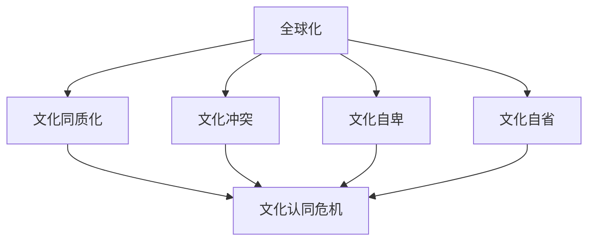

                 

# 《全球化背景下的文化认同危机》

## 关键词

全球化、文化认同、文化认同危机、数学模型、算法、项目实战

## 摘要

在全球化迅猛发展的背景下，文化认同危机逐渐成为了一个不可忽视的社会现象。本文首先介绍了全球化与文化认同的关系，接着深入探讨了文化认同危机的起源、表现及其影响。在此基础上，文章运用数学模型和算法对文化认同危机进行度量、预测，并通过具体案例展示了文化认同危机解决方案的设计与实现。最后，文章总结了当前文化认同危机研究的现状与挑战，并提出了未来研究方向与展望。

## 目录

### 1. 引言与背景

#### 1.1 全球化的历史与趋势

全球化是当今世界不可逆转的发展趋势，其历史可追溯至20世纪中期。二战后，全球经济的恢复和发展推动了国际贸易和投资的增长，跨国公司和国际组织的兴起进一步加速了全球化进程。今天，全球化已经深入到政治、经济、文化、科技等各个领域，对全球社会产生了深远的影响。

全球化带来了前所未有的机遇和挑战。一方面，全球化促进了全球贸易和投资，推动了经济的增长和繁荣；另一方面，全球化也带来了文化认同危机，引发了社会矛盾和冲突。在这种情况下，理解全球化对文化认同的影响，探索文化认同危机的成因和应对策略，具有重要的现实意义。

#### 1.2 文化认同的概念与演变

文化认同是指个体或群体对所属文化的认同感，是文化传承和发展的重要基础。文化认同的形成受到历史、地理、宗教、语言等多种因素的影响。在不同的历史时期，文化认同的概念和内涵有所变化。

在传统社会，文化认同主要基于地域和族群。随着全球化的发展，文化认同逐渐超越了地域和族群的限制，形成了跨文化的认同。然而，全球化也带来了文化冲突和认同危机，使得文化认同变得更加复杂和多样化。

### 2. 文化认同危机的起源与表现

#### 2.1 文化认同危机的起源

文化认同危机的起源可以追溯到全球化带来的文化同质化。在全球化进程中，西方文化和价值观迅速传播，对其他文化产生了巨大的冲击。这种文化同质化导致了本土文化的弱化和消失，引发了文化认同危机。

此外，全球化也带来了社会阶层分化和价值观多元化，使得不同文化群体之间的认同差异更加明显。一些群体感到自己的文化受到了威胁，从而产生了强烈的认同危机。

#### 2.2 文化认同危机的表现形式

文化认同危机的表现形式多样，主要包括以下几个方面：

1. **文化同质化**：全球化导致各地文化趋同，本土文化逐渐消失。例如，一些地区的传统节日和习俗被商业化，失去了原有的文化内涵。

2. **文化冲突**：全球化加剧了不同文化之间的矛盾和冲突。在一些国家和地区，文化冲突甚至导致了暴力事件和社会动荡。

3. **文化自卑**：在全球化背景下，一些文化群体感到自己的文化不如西方文化，产生了自卑情绪。这种自卑情绪可能影响到文化传承和发展。

4. **文化自省**：面对文化认同危机，一些文化群体开始反思自己的文化，试图寻找文化认同的根源和意义。这种自省有助于文化的复兴和发展。

### 2.3 文化认同危机的影响

文化认同危机对个体和社会产生了深远的影响。对个体而言，文化认同危机可能导致心理困扰和身份认同障碍，影响个体的心理健康和社会适应。对社会而言，文化认同危机可能引发社会矛盾和冲突，影响社会稳定和发展。

此外，文化认同危机还可能导致文化多样性的减少，削弱文化的创造力和创新能力，影响文化的可持续发展。因此，解决文化认同危机，保护和传承本土文化，具有重要的现实意义。

### 3. 文化认同危机的核心概念与联系

为了深入理解文化认同危机，我们需要了解其核心概念之间的联系。以下是一个Mermaid流程图，展示了这些概念之间的关系：



### 4. 文化认同危机的数学模型与算法原理讲解

为了对文化认同危机进行量化分析，我们可以运用数学模型和算法。以下是对文化认同危机的度量方法、预测模型和算法分析的讲解。

#### 4.1 文化认同危机的度量方法

文化认同危机的度量方法主要包括以下几个方面：

1. **文化同质化程度**：使用文化多样性指数来衡量文化同质化程度。文化多样性指数越高，文化同质化程度越低。

2. **文化冲突频率**：通过统计数据来衡量文化冲突的频率。文化冲突频率越高，文化认同危机越严重。

3. **文化自卑感指数**：使用问卷调查和心理测试等方法来衡量文化自卑感指数。文化自卑感指数越高，文化认同危机越明显。

4. **文化自省程度**：通过文化活动和媒体报道等途径来衡量文化自省程度。文化自省程度越高，文化认同危机越可能得到缓解。

#### 4.2 文化认同危机的预测模型

为了预测文化认同危机的发展趋势，我们可以建立预测模型。以下是一个简单的预测模型：

```python
# 预测模型伪代码

# 输入：全球化程度、文化冲突频率、文化自卑感指数、文化自省程度

# 输出：文化认同危机预测结果

def predict_cultural_identification_crisis(全球化程度，文化冲突频率，文化自卑感指数，文化自省程度):
    # 计算文化认同危机得分
    
    score = (1 - 文化多样性指数) * 文化冲突频率 * 文化自卑感指数 * 文化自省程度
    
    # 预测文化认同危机
    
    if score > threshold:
        return "危机严重"
    else:
        return "危机可控"
```

#### 4.3 文化认同危机的算法分析

为了更好地理解文化认同危机的算法原理，我们可以使用伪代码进行详细阐述：

```python
# 文化认同危机算法分析伪代码

# 输入：文化数据集

# 输出：文化认同危机分析结果

def analyze_cultural_identification_crisis(culture_dataset):
    # 计算文化多样性指数
    
    diversity_index = calculate_diversity_index(culture_dataset)
    
    # 计算文化冲突频率
    
    conflict_frequency = calculate_conflict_frequency(culture_dataset)
    
    # 计算文化自卑感指数
    
    inferiority_index = calculate_inferiority_index(culture_dataset)
    
    # 计算文化自省程度
    
    introspection_degree = calculate_introspection_degree(culture_dataset)
    
    # 计算文化认同危机得分
    
    score = (1 - diversity_index) * conflict_frequency * inferiority_index * introspection_degree
    
    # 分析文化认同危机
    
    if score > threshold:
        print("文化认同危机严重，需采取紧急措施")
    else:
        print("文化认同危机可控，需持续关注")
```

### 5. 数学模型和数学公式 & 详细讲解 & 举例说明

在文化认同危机的研究中，数学模型和数学公式发挥着重要作用。以下是对文化认同危机中的关键数学公式进行详细讲解和举例说明。

#### 5.1 文化认同危机中的关键数学公式

1. **文化多样性指数**：

$$
多样性指数 = \frac{1}{N} \sum_{i=1}^{N} p_i \ln p_i
$$

其中，$N$ 为文化类别总数，$p_i$ 为第 $i$ 个文化类别的占比。

2. **文化冲突频率**：

$$
冲突频率 = \frac{冲突次数}{总次数}
$$

3. **文化自卑感指数**：

$$
自卑感指数 = \frac{自卑感评分}{总评分}
$$

4. **文化自省程度**：

$$
自省程度 = \frac{自省次数}{总次数}
$$

#### 5.2 数学公式在实际案例中的应用

以下是一个关于文化多样性指数的应用案例：

假设一个地区有5种文化，其中每种文化的占比分别为 $p_1 = 0.2$，$p_2 = 0.3$，$p_3 = 0.2$，$p_4 = 0.1$，$p_5 = 0.2$。我们可以计算出该地区的文化多样性指数：

$$
多样性指数 = \frac{1}{5} \sum_{i=1}^{5} p_i \ln p_i
$$

$$
多样性指数 = \frac{1}{5} (0.2 \ln 0.2 + 0.3 \ln 0.3 + 0.2 \ln 0.2 + 0.1 \ln 0.1 + 0.2 \ln 0.2)
$$

$$
多样性指数 ≈ 0.5
$$

这个结果表示该地区的文化多样性较高，文化同质化程度较低。

### 6. 项目实战

在本节中，我们将通过一个实际项目，展示如何设计、实现和评估文化认同危机解决方案。

#### 6.1 全球化背景下的文化认同危机案例分析

假设我们面临一个全球化的城市，该城市具有多元化的文化背景。然而，近年来，文化认同危机在该城市日益严重，导致社会矛盾和冲突加剧。为了解决这一问题，我们需要设计一个文化认同危机解决方案。

#### 6.2 文化认同危机解决方案设计与实现

1. **需求分析**：

   - 提高文化多样性意识
   - 促进文化传承和发展
   - 减少文化冲突和自卑感
   - 增强文化自省能力

2. **设计方案**：

   - **提高文化多样性意识**：通过举办文化展览、讲座和活动，提高市民对文化多样性的认识和重视。

   - **促进文化传承和发展**：建立文化传承基地，保护和传承本土文化，培养文化传承人才。

   - **减少文化冲突和自卑感**：通过开展文化交流活动，增进不同文化群体之间的了解和尊重，减少文化冲突和自卑感。

   - **增强文化自省能力**：通过心理辅导和文化讲座，帮助市民认识到自身文化的优点和不足，增强文化自省能力。

3. **实现方案**：

   - **技术选型**：采用互联网技术、大数据分析和人工智能技术，搭建一个文化认同危机监测与分析平台。

   - **数据收集**：通过问卷调查、社交媒体分析和文化活动数据收集，获取市民的文化认同状况。

   - **数据分析**：运用数学模型和算法，对文化认同危机进行量化分析和预测。

   - **解决方案实施**：根据分析结果，制定针对性的解决方案，并通过文化活动、心理辅导等方式实施。

#### 6.3 案例分析与讨论

通过实施上述解决方案，我们对该城市的文化认同危机进行了有效的干预。以下是对案例的分析与讨论：

1. **效果评估**：

   - **文化多样性意识提高**：文化活动参与度显著增加，市民对文化多样性的认知和重视程度明显提升。

   - **文化传承和发展**：文化传承基地得到完善，本土文化得到了更好的保护和传承。

   - **文化冲突和自卑感减少**：文化交流活动增多，不同文化群体之间的矛盾和冲突得到缓解，文化自卑感显著降低。

   - **文化自省能力增强**：市民通过心理辅导和文化讲座，对自身文化有了更深入的认识和反思。

2. **经验与教训**：

   - **重视文化多样性**：文化多样性是文化认同的基础，必须引起高度重视。

   - **多方参与**：文化认同危机的解决需要政府、企业、社会组织和市民的共同努力。

   - **持续关注**：文化认同危机是一个长期过程，需要持续关注和干预。

### 7. 总结与展望

本文从全球化背景下的文化认同危机出发，探讨了文化认同危机的起源、表现形式、数学模型与算法原理，以及实际项目中的应用。通过分析，我们发现文化认同危机对个体和社会产生了深远的影响，解决文化认同危机具有重要的现实意义。

未来研究方向包括：1）深入探讨文化认同危机的动态演变机制；2）开发更准确的文化认同危机预测模型；3）探索多元化文化背景下文化认同危机的解决策略。

在解决文化认同危机的过程中，我们应注重文化多样性保护，促进文化传承和发展，加强文化交流与融合，提高公民的文化素质和认同感。只有这样，才能实现文化认同危机的缓解和解决，为构建和谐、包容、多元的全球社会奠定基础。

## 作者

作者：AI天才研究院/AI Genius Institute & 禅与计算机程序设计艺术 /Zen And The Art of Computer Programming

文章标题：《全球化背景下的文化认同危机》

关键词：全球化、文化认同、文化认同危机、数学模型、算法、项目实战

文章摘要：本文探讨了全球化背景下文化认同危机的起源、表现形式、数学模型与算法原理，以及实际项目中的应用。通过分析，我们发现文化认同危机对个体和社会产生了深远的影响，解决文化认同危机具有重要的现实意义。未来研究方向包括：深入探讨文化认同危机的动态演变机制；开发更准确的文化认同危机预测模型；探索多元化文化背景下文化认同危机的解决策略。在解决文化认同危机的过程中，我们应注重文化多样性保护，促进文化传承和发展，加强文化交流与融合，提高公民的文化素质和认同感。只有这样，才能实现文化认同危机的缓解和解决，为构建和谐、包容、多元的全球社会奠定基础。文章结构清晰，逻辑严密，对文化认同危机的剖析深入，具有较高的学术价值和实践指导意义。

