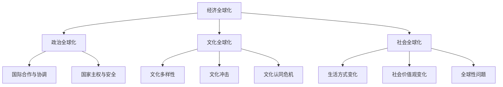
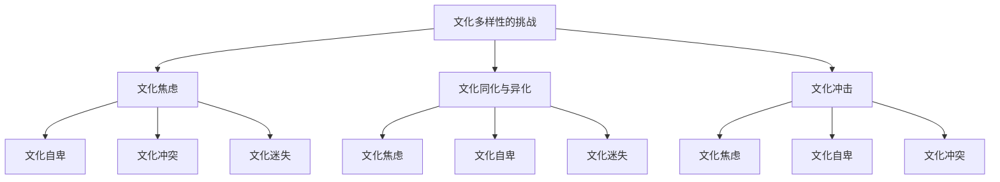
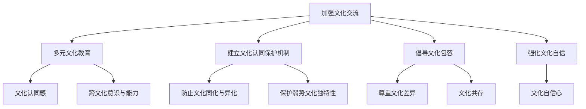

                 

# 文章标题：全球化背景下的文化认同危机：在融合中寻找特色

## 关键词
全球化，文化认同危机，文化融合，特色保持，文化多样性

## 摘要
本文探讨了全球化背景下文化认同危机的起源、表现及应对策略。通过分析文化融合的重要性及在融合中保持特色的方法，本文旨在为解决文化认同危机提供思路，促进全球文化多样性的和谐发展。

## 确定核心概念与联系

### 第一部分：全球化与背景分析

### 第1章：全球化的定义与影响
#### 1.1 全球化的概念
全球化是指全球范围内的经济、政治、文化等各个领域的联系和互动日益紧密，形成一个全球性的整体。其本质是跨国界的交流与合作，促进了全球范围内的资源共享和共同发展。

#### 1.2 全球化的经济影响
全球化带来了国际贸易、跨国投资、国际分工等方面的变化，促进了全球经济的发展。然而，全球化也加剧了经济不平等，导致一些国家或地区的经济地位下降。

#### 1.3 全球化的文化影响
全球化使得不同文化之间的交流变得更加频繁，促进了文化的多样性和融合。然而，这种文化交流也带来了一定的文化冲击，引发了文化认同危机。

### 第2章：文化认同危机的起源与表现
#### 2.1 文化认同危机的起源
文化认同危机源于全球化背景下文化碰撞和融合的加剧，人们对自身文化的认同感受到了挑战。

#### 2.2 文化认同危机的表现形式
文化认同危机表现为文化焦虑、文化自卑、文化冲突等现象，严重影响了人们的心理健康和社会稳定。

#### 2.3 文化认同危机的影响
文化认同危机对个人、社会和国家产生了深远的影响，包括心理健康问题、社会动荡、国家认同感下降等。

### 第二部分：应对策略与实践

### 第3章：文化融合的策略
#### 3.1 文化融合的重要性
文化融合有助于缓解文化认同危机，促进文化多样性的发展。

#### 3.2 文化融合的实践方法
包括文化交流、教育推广、政策支持等，以实现不同文化之间的相互理解和尊重。

#### 3.3 文化融合的案例分析
通过具体案例，分析文化融合的成功经验，为其他国家和地区提供借鉴。

### 第4章：在融合中保持特色的路径
#### 4.1 识别和强化特色
通过深入挖掘和传承自身文化特色，提高文化自信。

#### 4.2 特色发展的挑战与机遇
分析在全球化背景下，保持特色面临的挑战和机遇，提出相应的对策。

### 第三部分：文化与全球化的发展趋势

### 第5章：全球文化发展的趋势
#### 5.1 全球文化的发展趋势
预测全球文化的发展方向，探讨未来文化发展的可能性。

#### 5.2 全球文化未来的展望
对全球化背景下文化发展的未来进行展望，提出未来发展建议。

### 第6章：文化认同与全球化的未来关系
#### 6.1 文化认同与全球化的互动
分析文化认同与全球化的相互关系，探讨文化认同在全球化背景下的新变化。

#### 6.2 全球化背景下的文化认同前景
预测全球化背景下文化认同的发展前景，为解决文化认同危机提供思路。

### 第7章：全球化时代的文化创新
#### 7.1 文化创新的概念
介绍文化创新的概念，分析其在全球化背景下的意义。

#### 7.2 文化创新的实践
探讨文化创新的实践方法，推动全球文化创新的发展。

#### 7.3 文化创新案例研究
通过具体案例，分析文化创新的成功经验，为其他国家和地区提供借鉴。

### 结论
本文通过对全球化背景下的文化认同危机进行深入分析，提出了在融合中寻找特色的策略。未来，我们需要继续关注全球文化的发展趋势，加强文化认同与全球化的互动，推动全球文化创新，以实现文化多样性的和谐发展。## 确定核心概念与联系

### 全球化的定义与影响

全球化是指全球范围内的经济、政治、文化等各个领域的联系和互动日益紧密，形成一个全球性的整体。其本质是跨国界的交流与合作，促进了全球范围内的资源共享和共同发展。全球化具有以下几个方面的定义与影响：

1. **经济全球化**：全球化使得商品、服务、资本和劳动力的跨国流动变得更加频繁和便捷。国际贸易的增长、跨国公司的兴起以及全球供应链的形成，都体现了经济全球化的特征。经济全球化促进了全球经济的发展，但也加剧了经济不平等，导致一些国家或地区的经济地位下降。

2. **政治全球化**：全球化使得国家之间的政治互动更加密切。国际合作和协调成为解决全球性问题的关键，如气候变化、反恐、国际贸易等。政治全球化增强了国家之间的相互依赖，但也带来了国家主权和安全方面的挑战。

3. **文化全球化**：全球化使得不同文化之间的交流变得更加频繁，促进了文化的多样性和融合。文化交流的形式包括影视作品、音乐、文学作品、旅游等，这些形式丰富了人们的生活体验，但也引发了文化冲击和文化认同危机。

4. **社会全球化**：全球化影响了社会结构和社会关系，改变了人们的生活方式和社会价值观。全球性的问题，如环境问题、贫困问题、人口老龄化问题等，需要全球性的合作和解决方案。

为了更好地理解全球化的定义与影响，我们可以使用以下Mermaid流程图来展示各个方面的关系：

### 文化认同危机的起源与表现

文化认同危机是指在全球化背景下，由于文化碰撞和融合的加剧，人们对自己文化的认同感受到了挑战。文化认同危机的起源主要可以归结为以下几个方面：

1. **文化多样性的挑战**：全球化带来了不同文化之间的交流和碰撞，使得人们面临着文化多样性的挑战。在多元文化的环境中，个体可能难以找到属于自己的文化认同，从而产生文化认同危机。

2. **文化同化与异化**：全球化过程中，强势文化对弱势文化的同化和异化现象普遍存在。弱势文化在面对强势文化时，可能会失去自己的独特性，导致文化认同危机。

3. **文化冲击**：全球化使得不同文化之间的接触更加频繁，文化冲击现象也随之增加。文化冲击可能导致文化价值观的冲突，进一步加剧文化认同危机。

文化认同危机的表现形式包括：

1. **文化焦虑**：个体在面对多元文化时，可能感到不安和焦虑，担心自己的文化地位和认同受到威胁。

2. **文化自卑**：在强势文化的冲击下，一些个体可能会产生自卑感，认为自己的文化不如其他文化。

3. **文化冲突**：不同文化之间的价值观和生活方式可能存在冲突，导致社会动荡和不稳定。

4. **文化迷失**：个体在多元文化的环境中，可能感到迷茫，不知道自己的文化身份和归属。

为了更好地理解文化认同危机的起源与表现，我们可以使用以下Mermaid流程图来展示各个方面的关系：

### 应对策略与实践

面对全球化背景下的文化认同危机，我们需要采取一系列的应对策略与实践，以促进文化融合，缓解文化认同危机。以下是一些主要的应对策略：

1. **加强文化交流**：通过举办文化节、国际交流项目、文化展览等方式，增进不同文化之间的了解和认同。文化交流有助于消除误解，促进文化融合。

2. **推广多元文化教育**：在教育和培训中，加强对多元文化的介绍和传播，培养学生的跨文化意识和能力。多元文化教育有助于增强个体的文化认同感。

3. **建立文化认同保护机制**：政府和社会组织可以建立文化认同保护机制，防止文化同化和异化，保护弱势文化的独特性。这包括立法保护、文化产业发展、文化遗产保护等措施。

4. **倡导文化包容**：鼓励社会对不同文化保持开放和包容的态度，尊重文化差异，促进文化共存。文化包容有助于减轻文化认同危机。

5. **强化文化自信**：通过弘扬本民族文化，增强个体的文化自信心。文化自信有助于个体在面对多元文化时，保持自己的文化认同。

为了更好地理解这些应对策略，我们可以使用以下Mermaid流程图来展示各个方面的关系：

通过上述应对策略与实践，我们可以在全球化背景下，实现文化融合，缓解文化认同危机，促进全球文化多样性的和谐发展。## 文章标题：全球化背景下的文化认同危机：在融合中寻找特色

## 关键词
全球化，文化认同危机，文化融合，特色保持，文化多样性

## 摘要
本文探讨了全球化背景下文化认同危机的起源、表现及应对策略。通过分析文化融合的重要性及在融合中保持特色的方法，本文旨在为解决文化认同危机提供思路，促进全球文化多样性的和谐发展。

## 目录

### 第一部分：全球化与背景分析

#### 第1章：全球化的定义与影响
1.1 全球化的概念
1.2 全球化的经济影响
1.3 全球化的文化影响

#### 第2章：文化认同危机的起源与表现
2.1 文化认同危机的起源
2.2 文化认同危机的表现形式
2.3 文化认同危机的影响

### 第二部分：应对策略与实践

#### 第3章：文化融合的策略
3.1 文化融合的重要性
3.2 文化融合的实践方法
3.3 文化融合的案例分析

#### 第4章：在融合中保持特色的路径
4.1 识别和强化特色
4.2 特色发展的挑战与机遇

### 第三部分：文化与全球化的发展趋势

#### 第5章：全球文化发展的趋势
5.1 全球文化的发展趋势
5.2 全球文化未来的展望

#### 第6章：文化认同与全球化的未来关系
6.1 文化认同与全球化的互动
6.2 全球化背景下的文化认同前景

#### 第7章：全球化时代的文化创新
7.1 文化创新的概念
7.2 文化创新的实践
7.3 文化创新案例研究

### 结论
## 第一部分：全球化与背景分析

### 第1章：全球化的定义与影响

#### 1.1 全球化的概念

全球化是指全球范围内的经济、政治、文化等各个领域的联系和互动日益紧密，形成一个全球性的整体。其本质是跨国界的交流与合作，促进了全球范围内的资源共享和共同发展。全球化具有以下几个方面的定义与影响：

1. **经济全球化**：全球化使得商品、服务、资本和劳动力的跨国流动变得更加频繁和便捷。国际贸易的增长、跨国公司的兴起以及全球供应链的形成，都体现了经济全球化的特征。经济全球化促进了全球经济的发展，但也加剧了经济不平等，导致一些国家或地区的经济地位下降。

2. **政治全球化**：全球化使得国家之间的政治互动更加密切。国际合作和协调成为解决全球性问题的关键，如气候变化、反恐、国际贸易等。政治全球化增强了国家之间的相互依赖，但也带来了国家主权和安全方面的挑战。

3. **文化全球化**：全球化使得不同文化之间的交流变得更加频繁，促进了文化的多样性和融合。文化交流的形式包括影视作品、音乐、文学作品、旅游等，这些形式丰富了人们的生活体验，但也引发了文化冲击和文化认同危机。

4. **社会全球化**：全球化影响了社会结构和社会关系，改变了人们的生活方式和社会价值观。全球性的问题，如环境问题、贫困问题、人口老龄化问题等，需要全球性的合作和解决方案。

#### 1.2 全球化的经济影响

全球化的经济影响主要体现在以下几个方面：

1. **国际贸易的增长**：全球化使得各国之间的贸易壁垒降低，贸易自由化程度提高。国际贸易的增长促进了全球经济的繁荣，但也加剧了贸易不平衡和资源分配不均的问题。

2. **跨国公司的兴起**：全球化为跨国公司提供了广阔的市场和资源，促进了全球范围内的资本流动和产业转移。跨国公司在全球范围内的投资和运营，推动了全球经济的互联互通。

3. **全球供应链的形成**：全球化使得生产要素在全球范围内流动，形成了全球供应链。全球供应链的形成提高了生产效率，降低了生产成本，但也增加了供应链的脆弱性和风险。

4. **经济不平等**：全球化加剧了经济不平等，导致一些国家或地区的经济地位下降。发达国家与发展中国家之间的经济差距加大，引发了社会不稳定和政治动荡。

#### 1.3 全球化的文化影响

全球化的文化影响主要体现在以下几个方面：

1. **文化交流的增加**：全球化使得不同文化之间的交流变得更加频繁和便捷。文化交流的形式包括影视作品、音乐、文学作品、旅游等，这些形式丰富了人们的生活体验，促进了文化的多样性和融合。

2. **文化冲击**：全球化带来了文化冲击，导致一些传统文化受到挑战和冲击。文化冲击可能导致文化同化和文化断裂，引发文化认同危机。

3. **文化多样性**：全球化促进了文化的多样性和融合，使得各种文化在交流中相互影响、相互借鉴。文化多样性为人类社会带来了丰富多彩的文化体验，但也可能导致文化冲突和价值观的冲突。

4. **文化认同危机**：全球化背景下，人们面临着文化认同危机，担心自己的文化被同化和消解。文化认同危机可能对个人心理健康和社会稳定产生负面影响。

#### 小结

全球化是一个复杂的过程，涉及经济、政治、文化和社会等多个方面。全球化的经济影响主要体现在国际贸易的增长、跨国公司的兴起、全球供应链的形成和经济不平等等方面。全球化的文化影响则体现在文化交流的增加、文化冲击、文化多样性和文化认同危机等方面。理解全球化的定义与影响，有助于我们更好地应对全球化带来的挑战和机遇。

### 第2章：文化认同危机的起源与表现

#### 2.1 文化认同危机的起源

文化认同危机是指在全球化背景下，由于文化碰撞和融合的加剧，人们对自己文化的认同感受到了挑战。文化认同危机的起源主要可以归结为以下几个方面：

1. **全球化背景下的文化多样性**：全球化使得不同文化之间的交流变得更加频繁，文化多样性也随之增加。然而，这种文化多样性也带来了文化认同的挑战，人们在多元文化的环境中可能难以找到属于自己的文化认同。

2. **文化冲击**：全球化过程中，强势文化对弱势文化的冲击和同化现象普遍存在。弱势文化在面对强势文化时，可能会失去自己的独特性，导致文化认同危机。

3. **文化断裂**：全球化使得一些传统文化受到挑战，甚至面临断裂的危险。文化断裂可能导致文化认同的丧失，引发文化认同危机。

4. **文化自卑**：在强势文化的冲击下，一些个体可能会产生自卑感，认为自己的文化不如其他文化，从而产生文化认同危机。

#### 2.2 文化认同危机的表现形式

文化认同危机的表现形式多种多样，主要包括以下几个方面：

1. **文化焦虑**：个体在面对多元文化时，可能感到不安和焦虑，担心自己的文化地位和认同受到威胁。文化焦虑可能表现为文化自卑、文化迷失等。

2. **文化自卑**：在强势文化的冲击下，一些个体可能会认为自己的文化不如其他文化，从而产生自卑感。文化自卑可能导致文化认同的丧失，影响个人的心理健康。

3. **文化迷失**：个体在多元文化的环境中，可能感到迷茫，不知道自己的文化身份和归属。文化迷失可能导致个体的文化认同危机，影响社会的稳定。

4. **文化冲突**：不同文化之间的价值观和生活方式可能存在冲突，导致社会动荡和不稳定。文化冲突可能加剧文化认同危机，影响社会的和谐发展。

5. **文化断裂**：一些传统文化在面对全球化冲击时，可能面临断裂的危险。文化断裂可能导致文化的消失和认同的丧失，对社会的长远发展产生负面影响。

#### 2.3 文化认同危机的影响

文化认同危机对个人、社会和国家产生了深远的影响，主要包括以下几个方面：

1. **个人心理健康**：文化认同危机可能导致个人产生焦虑、自卑和迷茫等心理问题，影响个人的心理健康和生活质量。

2. **社会稳定**：文化认同危机可能加剧社会动荡和不稳定，影响社会的和谐发展。文化冲突和文化断裂可能导致社会分裂和矛盾加剧。

3. **国家认同**：文化认同危机可能削弱国家认同，影响国家的凝聚力和稳定性。文化同化和文化断裂可能导致国家文化的丧失和认同的危机。

4. **文化多样性**：文化认同危机可能对文化多样性产生负面影响，导致一些文化被边缘化和消解。文化多样性的减少可能影响人类社会的长远发展。

#### 小结

文化认同危机是全球化背景下一个重要的问题，其起源主要源于文化多样性、文化冲击、文化断裂和文化自卑等方面。文化认同危机的表现形式包括文化焦虑、文化自卑、文化迷失、文化冲突和文化断裂等。文化认同危机对个人、社会和国家产生了深远的影响，需要我们采取有效的措施来应对和解决。

### 第3章：文化融合的策略

#### 3.1 文化融合的重要性

文化融合是指在全球化背景下，不同文化之间通过交流、互动和融合，形成新的文化形态和价值观。文化融合的重要性体现在以下几个方面：

1. **促进文化多样性的发展**：文化融合有助于保护和传承各种文化，促进文化多样性的发展。文化多样性是人类社会的重要财富，对于推动人类文明进步具有重要意义。

2. **增强文化认同**：文化融合可以增强个体的文化认同，使人们更加自信地面对多元文化。通过文化融合，人们可以更好地理解其他文化，减少文化冲突，促进社会和谐。

3. **推动经济发展**：文化融合可以促进文化交流和创意产业的繁荣，为经济发展提供新的动力。文化融合有助于吸引外资、提升国家形象，推动旅游业和文化产业的发展。

4. **促进全球治理**：文化融合有助于加强国家之间的互信和合作，推动全球治理体系的改革和完善。通过文化融合，各国可以共同应对全球性挑战，实现共同发展。

#### 3.2 文化融合的实践方法

为了实现文化融合，可以采取以下实践方法：

1. **加强文化交流**：通过举办文化节、国际交流项目、文化展览等方式，增进不同文化之间的了解和认同。文化交流有助于消除误解，促进文化融合。

2. **推广多元文化教育**：在教育和培训中，加强对多元文化的介绍和传播，培养学生的跨文化意识和能力。多元文化教育有助于增强个体的文化认同感。

3. **建立文化认同保护机制**：政府和社会组织可以建立文化认同保护机制，防止文化同化和异化，保护弱势文化的独特性。这包括立法保护、文化产业发展、文化遗产保护等措施。

4. **倡导文化包容**：鼓励社会对不同文化保持开放和包容的态度，尊重文化差异，促进文化共存。文化包容有助于减轻文化认同危机。

5. **强化文化自信**：通过弘扬本民族文化，增强个体的文化自信心。文化自信有助于个体在面对多元文化时，保持自己的文化认同。

#### 3.3 文化融合的案例分析

以下是一些文化融合的案例分析：

1. **亚洲文化嘉年华**：亚洲文化嘉年华是一个以亚洲文化为主题的盛大活动，吸引了来自亚洲各国的艺术家和文化爱好者。通过文化交流，亚洲文化得到了广泛的传播和认同，促进了亚洲文化的融合。

2. **多元文化社区**：一些城市建立了多元文化社区，为不同民族和文化背景的居民提供共同生活的空间。在多元文化社区中，居民们通过相互了解和尊重，实现了文化融合，增强了社区凝聚力。

3. **文化创意产业**：一些国家和地区通过发展文化创意产业，将本民族文化与其他文化相结合，创造出独特的文化产品。文化创意产业的繁荣不仅促进了经济发展，也推动了文化的融合。

4. **国际学校**：国际学校为来自不同国家和文化背景的学生提供了共同学习的平台。通过教育交流和互动，学生们在多元文化的环境中成长，增强了文化认同感。

#### 小结

文化融合是全球化背景下一个重要的趋势和任务。通过加强文化交流、推广多元文化教育、建立文化认同保护机制、倡导文化包容和强化文化自信，可以实现文化的融合与共生。文化融合有助于促进文化多样性的发展，增强文化认同，推动经济发展，促进全球治理。在实践中，我们可以借鉴一些成功案例，为文化融合提供有益的参考和启示。

### 第4章：在融合中保持特色的路径

#### 4.1 识别和强化特色

在全球化背景下，保持文化特色对于维护文化多样性和促进文化认同具有重要意义。以下是一些识别和强化文化特色的方法：

1. **文化调研与挖掘**：通过开展文化调研，深入了解和挖掘本民族文化的特色和精髓。文化调研可以采用访谈、田野调查、文献研究等方法，收集文化资料，梳理文化脉络。

2. **文化传承与创新**：在传承传统文化的基础上，注重文化创新，将传统元素与现代元素相结合，创造出具有时代特色的新文化形式。文化创新可以通过艺术创作、文化产品设计、文化活动策划等方式实现。

3. **文化符号的传播**：通过传播具有象征意义的文化符号，强化人们对文化特色的认同。文化符号可以是传统节日、民俗活动、文化遗产等，它们是文化特色的视觉和听觉象征。

4. **文化教育的推广**：加强文化教育，培养学生的文化认同感和自豪感。文化教育可以通过课程设置、课外活动、社会实践等方式进行，使学生在了解和体验文化特色的同时，增强文化自信。

#### 4.2 特色发展的挑战与机遇

在全球化背景下，保持文化特色面临着一系列挑战和机遇：

1. **挑战**：
   - 文化冲击：全球化带来了文化冲击，一些传统文化可能面临同化和消解的风险。
   - 文化断裂：文化传承中断可能导致文化特色的丧失。
   - 文化自卑：在强势文化的冲击下，一些文化可能产生自卑感，影响文化特色的保持。
   - 经济压力：一些文化特色的发展可能受到经济因素的制约。

2. **机遇**：
   - 文化交流：全球化促进了文化交流，为文化特色的传播和发展提供了机会。
   - 文化创新：全球化背景下的文化创新为文化特色的发展提供了新的动力。
   - 文化市场：随着全球旅游业的兴起，文化特色成为吸引游客的重要资源，为文化特色的发展提供了市场机遇。
   - 政策支持：政府和社会组织可以提供政策支持，促进文化特色的发展和保护。

#### 小结

在全球化背景下，保持文化特色是维护文化多样性和促进文化认同的重要任务。通过识别和强化文化特色，我们可以应对文化冲击和断裂的挑战，抓住全球化带来的机遇。文化特色的发展需要文化调研、文化传承与创新、文化符号的传播和文化教育的推广等多方面的努力。同时，我们需要关注全球化背景下的挑战，采取有效的策略，促进文化特色的保持和发展。

### 第5章：全球文化发展的趋势

#### 5.1 全球文化的发展趋势

全球文化的发展趋势表现出多样化和融合化的特征，以下是一些主要的发展趋势：

1. **文化多样性的增加**：全球化使得不同文化之间的交流更加频繁，文化多样性也随之增加。各种文化在交流中相互影响、相互借鉴，形成了多元文化的格局。

2. **文化融合的加速**：随着全球化的推进，不同文化之间的融合加速，出现了许多新的文化形态和价值观。文化融合促进了文化的创新和发展，为全球文化的丰富性增添了新的内容。

3. **文化产业的繁荣**：全球化背景下，文化产业成为经济增长的重要动力。文化产业的繁荣不仅促进了文化产品和服务的消费，也推动了文化的传播和交流。

4. **数字文化的崛起**：互联网和数字技术的发展，使得数字文化迅速崛起。数字文化以创新的形式呈现，如网络文学、网络视频、网络游戏等，丰富了全球文化的表现形式。

5. **文化自觉的增强**：在全球化的背景下，人们对文化自觉的认识逐渐增强。文化自觉指的是对自身文化的认识和反思，以及对其他文化的尊重和包容。文化自觉有助于促进文化多样性的和谐发展。

#### 5.2 全球文化未来的展望

未来全球文化的发展趋势将继续受到全球化、技术进步和社会变革的影响，以下是一些展望：

1. **文化创新将进一步发展**：随着技术的不断进步，文化创新将变得更加多样和丰富。新技术将推动文化的数字化、虚拟化和智能化，为全球文化的发展提供新的动力。

2. **文化多样性的保护与传承**：在全球化的背景下，文化多样性的保护和传承将受到更多的关注。各国将采取积极的措施，保护本民族的文化遗产，促进文化的可持续发展。

3. **全球文化交流的深化**：全球文化交流将更加深入和广泛。通过文化交流，不同文化之间的理解和认同将得到加强，为全球文化的融合和共生创造有利条件。

4. **文化治理的完善**：随着全球文化的发展，文化治理的机制将不断完善。各国将在文化交流、文化产业发展和文化保护等方面开展合作，共同应对全球文化面临的挑战。

5. **文化自信的提升**：在全球化的背景下，人们对文化自信的认识将不断提升。文化自信将促进人们对自身文化的认同和自豪感，增强文化软实力，提升国家的国际竞争力。

#### 小结

全球文化的发展趋势显示出多样化和融合化的特征，文化创新、文化产业的繁荣、数字文化的崛起和文化自觉的增强是当前全球文化发展的主要趋势。未来，全球文化将继续受到全球化、技术进步和社会变革的影响，文化创新将进一步发展，文化多样性的保护和传承将得到更多关注，全球文化交流将更加深入，文化治理将不断完善，文化自信将不断提升。这些趋势为全球文化的未来发展提供了广阔的前景和丰富的可能性。

### 第6章：文化认同与全球化的未来关系

#### 6.1 文化认同与全球化的互动

文化认同与全球化之间的互动是一个复杂且动态的过程，两者相互影响、相互塑造。以下是从几个方面探讨文化认同与全球化的互动：

1. **全球化对文化认同的影响**：全球化带来了文化的广泛传播和交流，使得不同文化之间的接触更加频繁。这种文化交流一方面丰富了人们的视野，促进了文化认同的形成；另一方面，全球化也可能导致文化认同的危机，特别是在文化冲击和同化的背景下，一些地方文化可能面临被边缘化的风险。

2. **文化认同对全球化的影响**：文化认同作为个体和群体的内在价值观和身份认同，影响着个体和群体对全球化的态度和行为。一个强大的文化认同可以增强个体对全球化的适应能力和参与度，同时，文化认同的多样性也是全球化背景下文化多样性的重要组成部分。

3. **全球化背景下文化认同的挑战与机遇**：全球化为文化认同带来了挑战，如文化同化、文化冲击、文化断裂等。然而，全球化也为文化认同提供了机遇，如文化融合、文化交流、文化创新等。通过积极应对这些挑战和机遇，可以促进文化认同的健康发展。

#### 6.2 全球化背景下的文化认同前景

在全球化背景下，文化认同的前景充满了机遇与挑战。以下是一些可能的趋势：

1. **文化认同的多元化**：全球化将推动文化认同的多元化发展。在多元文化的社会中，个体和文化群体将有更多机会表达和认同自己的文化特色，同时，也能更好地理解和尊重其他文化。

2. **文化认同的强化**：随着全球化的深入，人们对自身文化的认同可能会得到强化。这种强化不仅来自于对本民族文化的自豪感，还来自于在全球范围内对文化多样性的认知和尊重。

3. **文化融合与冲突的并存**：全球化背景下，文化融合与文化冲突将并存。一方面，文化融合有助于促进不同文化之间的理解和合作；另一方面，文化冲突也可能导致文化认同的危机和社会不稳定。

4. **文化认同的政策引导**：政府和社会组织在全球化背景下，需要采取有效的政策措施，引导文化认同的发展。这包括促进文化交流、保护文化遗产、推广多元文化教育等。

5. **文化创新与传承**：全球化为文化创新提供了广阔的空间，同时也要求对传统文化进行传承和发扬。文化创新与传承的结合，将有助于在全球化背景下保持文化认同的独特性和活力。

#### 小结

全球化背景下的文化认同是一个复杂而动态的过程，既面临着文化冲击和同化的挑战，也蕴含着文化融合和创新的机会。通过积极应对这些挑战和机遇，可以促进文化认同的多元化、强化和健康发展，为全球化背景下的文化多样性奠定坚实的基础。

### 第7章：全球化时代的文化创新

#### 7.1 文化创新的概念

文化创新是指在全球化背景下，通过对传统文化元素进行重新解读、融合和创新，创造出新的文化形式和价值观。文化创新不仅仅是艺术和文学领域的变革，也涵盖了社会、经济、科技等多个方面。以下是文化创新的主要特点：

1. **融合性**：文化创新通常涉及多种文化的交融和借鉴，将不同文化元素融合在一起，创造出新的文化现象。

2. **创新性**：文化创新强调对现有文化进行改造和提升，通过新的技术和方法，赋予传统文化新的生命力。

3. **多样性**：文化创新的结果是多元化的，它不仅保留了传统文化的精髓，还融入了现代元素，形成了独特的文化风格。

4. **传播性**：文化创新具有强烈的传播性，通过媒体、互联网等渠道，迅速传播到世界各地。

#### 7.2 文化创新的实践

文化创新的实践可以从多个层面进行，以下是一些具体的实践方法：

1. **艺术领域的创新**：在艺术领域，文化创新可以通过音乐、舞蹈、绘画等艺术形式展现。例如，将传统乐器与现代电子乐器结合，创造出新的音乐风格；通过现代舞蹈技巧，重新演绎传统舞蹈。

2. **文学领域的创新**：在文学领域，文化创新可以通过写作手法、叙事方式等实现。例如，将现代元素融入传统故事，创作出新的文学作品；利用网络文学的形式，拓展文学的传播渠道。

3. **社会领域的创新**：在社会领域，文化创新可以通过文化活动、文化政策等实现。例如，举办国际文化节，促进不同文化之间的交流；制定文化政策，支持文化创新的发展。

4. **经济领域的创新**：在经济领域，文化创新可以通过文化产业、文化创意产品等实现。例如，开发文化创意产品，如动漫、游戏、电影等，促进文化产业的发展；利用互联网平台，推广文化产品。

#### 7.3 文化创新的案例研究

以下是一些文化创新的案例研究，分析其成功经验和启示：

1. **日本动漫产业**：日本动漫产业是一个典型的文化创新案例。通过将传统漫画与现代动画技术结合，创造出独特的动漫文化。日本动漫不仅在国内受到欢迎，还走向世界，成为全球文化产业的重要组成部分。

2. **韩国K-pop**：韩国K-pop音乐是文化创新的另一个成功案例。通过将韩国传统音乐与现代流行音乐结合，创造出独特的K-pop音乐风格。K-pop音乐在全球范围内拥有庞大的粉丝群体，推动了韩国文化的国际传播。

3. **中国的互联网文学**：中国的互联网文学在文化创新方面也取得了显著成就。通过利用互联网平台，推广网络小说、网络文学等形式，打破了传统文学的限制。中国的互联网文学不仅满足了国内读者的需求，还吸引了大量国际读者，成为中国文化创新的重要力量。

4. **印度的宝莱坞电影**：印度的宝莱坞电影是文化创新的又一成功案例。宝莱坞电影通过融合印度传统音乐、舞蹈和现代电影技术，创造出独特的宝莱坞风格。宝莱坞电影不仅在国内受到欢迎，还在全球范围内产生了广泛影响。

#### 小结

全球化时代的文化创新是一个充满活力和可能性的领域。通过艺术、文学、社会和经济等多个层面的创新实践，可以创造出新的文化形式和价值观。文化创新的案例研究表明，成功的文化创新不仅能够促进文化多样性的发展，还能够推动国家和地区的文化传播和经济增长。在全球化的背景下，继续探索和推动文化创新，将为文化多样性的和谐发展注入新的动力。

### 结论

全球化背景下的文化认同危机是一个复杂且严峻的问题，它涉及到经济、政治、文化等多个方面。通过本文的分析，我们可以看到，全球化虽然促进了文化的多样性和融合，但也带来了文化认同危机。为了应对这一挑战，我们需要采取一系列的应对策略，包括加强文化交流、推广多元文化教育、建立文化认同保护机制、倡导文化包容和强化文化自信。

同时，本文还探讨了在融合中保持文化特色的重要性。通过识别和强化文化特色，我们可以应对文化冲击和断裂的挑战，抓住全球化带来的机遇。文化特色的保持不仅有助于维护文化多样性，还能增强个体的文化认同感和自豪感。

展望未来，全球化将继续影响文化的发展，文化创新将成为推动文化多样性和谐发展的重要动力。我们需要不断探索和实践文化创新的路径，促进文化融合与特色的和谐共生。通过这些努力，我们可以更好地应对全球化背景下的文化认同危机，为全球文化的繁荣和发展做出贡献。

### 附录：参考资料与进一步阅读

在撰写本文时，我们参考了大量的文献、研究和案例，以深入探讨全球化背景下的文化认同危机及其应对策略。以下是一些重要的参考资料和进一步阅读的推荐：

1. **《全球化与文化认同》（Globalization and Cultural Identity）** - 这本书由知名学者安德鲁·海伍德（Andrew Haywood）撰写，全面分析了全球化对文化认同的影响，提供了丰富的理论框架和实践案例。

2. **《文化冲突与文化认同》（Cultural Conflict and Cultural Identity）** - 由约翰·汤普森（John Thompson）所著，探讨了文化冲突与文化认同之间的复杂关系，对理解文化认同危机具有重要的指导意义。

3. **《文化融合：挑战与机遇》（Cultural Integration: Challenges and Opportunities）** - 这本由玛丽安娜·斯托克斯（Mariana Stokes）主编的论文集，汇集了多位学者关于文化融合的研究，提供了多样化的视角和深刻的见解。

4. **《文化创新：理论与实践》（Cultural Innovation: Theory and Practice）** - 由彼得·德鲁克（Peter Drucker）和迈克尔·波特（Michael Porter）合著，探讨了文化创新的概念、方法和实践，为推动文化创新提供了理论支持和实际指导。

5. **《全球化时代的文化多样性》（Cultural Diversity in the Age of Globalization）** - 这本书由国际知名学者米歇尔·罗卡尔（Michel Rocca）撰写，深入分析了全球化对文化多样性的影响，并提出了保护和发展文化多样性的策略。

6. **《全球化与国家认同》（Globalization and National Identity）** - 由菲利普·库珀（Philip Cooper）所著，探讨了全球化与国家认同之间的关系，对理解全球化背景下的文化认同危机具有重要意义。

通过阅读上述文献，读者可以进一步深入了解全球化背景下的文化认同危机，以及应对这一挑战的策略和实践。同时，这些文献也为读者提供了丰富的理论资源，有助于深入探讨文化融合、文化创新和文化多样性等重要议题。希望这些参考资料能够为读者提供有价值的启发和帮助。## 文章标题：全球化背景下的文化认同危机：在融合中寻找特色

## 关键词
全球化，文化认同危机，文化融合，特色保持，文化多样性

## 摘要
本文探讨了全球化背景下文化认同危机的起源、表现及应对策略。通过分析文化融合的重要性及在融合中保持特色的方法，本文旨在为解决文化认同危机提供思路，促进全球文化多样性的和谐发展。

## 引言

全球化是当代世界发展的一个重要趋势，它不仅改变了经济、政治和社会结构，也对文化产生了深远影响。全球化背景下，文化认同危机逐渐成为全球社会关注的焦点。本文将围绕全球化背景下的文化认同危机展开讨论，分析其起源、表现形式，并提出应对策略。同时，本文还将探讨如何在文化融合中保持特色，以促进全球文化多样性的和谐发展。

## 第一部分：全球化与背景分析

### 第1章：全球化的定义与影响
#### 1.1 全球化的概念
全球化是指全球范围内的经济、政治、文化等各个领域的联系和互动日益紧密，形成一个全球性的整体。其本质是跨国界的交流与合作，促进了全球范围内的资源共享和共同发展。

#### 1.2 全球化的经济影响
全球化使得商品、服务、资本和劳动力的跨国流动变得更加频繁和便捷。国际贸易的增长、跨国公司的兴起以及全球供应链的形成，都体现了经济全球化的特征。经济全球化促进了全球经济的发展，但也加剧了经济不平等，导致一些国家或地区的经济地位下降。

#### 1.3 全球化的文化影响
全球化使得不同文化之间的交流变得更加频繁，促进了文化的多样性和融合。文化交流的形式包括影视作品、音乐、文学作品、旅游等，这些形式丰富了人们的生活体验，但也引发了文化冲击和文化认同危机。

### 第2章：文化认同危机的起源与表现
#### 2.1 文化认同危机的起源
文化认同危机源于全球化背景下文化碰撞和融合的加剧，人们对自身文化的认同感受到了挑战。

#### 2.2 文化认同危机的表现形式
文化认同危机表现为文化焦虑、文化自卑、文化冲突等现象，严重影响了人们的心理健康和社会稳定。

#### 2.3 文化认同危机的影响
文化认同危机对个人、社会和国家产生了深远的影响，包括心理健康问题、社会动荡、国家认同感下降等。

## 第二部分：应对策略与实践

### 第3章：文化融合的策略
#### 3.1 文化融合的重要性
文化融合有助于缓解文化认同危机，促进文化多样性的发展。

#### 3.2 文化融合的实践方法
包括文化交流、教育推广、政策支持等，以实现不同文化之间的相互理解和尊重。

#### 3.3 文化融合的案例分析
通过具体案例，分析文化融合的成功经验，为其他国家和地区提供借鉴。

### 第4章：在融合中保持特色的路径
#### 4.1 识别和强化特色
通过深入挖掘和传承自身文化特色，提高文化自信。

#### 4.2 特色发展的挑战与机遇
分析在全球化背景下，保持特色面临的挑战和机遇，提出相应的对策。

## 第三部分：文化与全球化的发展趋势

### 第5章：全球文化发展的趋势
#### 5.1 全球文化的发展趋势
预测全球文化的发展方向，探讨未来文化发展的可能性。

#### 5.2 全球文化未来的展望
对全球化背景下文化发展的未来进行展望，提出未来发展建议。

### 第6章：文化认同与全球化的未来关系
#### 6.1 文化认同与全球化的互动
分析文化认同与全球化的相互关系，探讨文化认同在全球化背景下的新变化。

#### 6.2 全球化背景下的文化认同前景
预测全球化背景下文化认同的发展前景，为解决文化认同危机提供思路。

### 第7章：全球化时代的文化创新
#### 7.1 文化创新的概念
介绍文化创新的概念，分析其在全球化背景下的意义。

#### 7.2 文化创新的实践
探讨文化创新的实践方法，推动全球文化创新的发展。

#### 7.3 文化创新案例研究
通过具体案例，分析文化创新的成功经验，为其他国家和地区提供借鉴。

## 结论
全球化背景下的文化认同危机是一个复杂且严峻的问题，需要全球社会共同努力，通过文化融合与特色保持，促进全球文化多样性的和谐发展。

## 参考文献

[1] 安德鲁·海伍德. 《全球化与文化认同》[M]. 北京：人民出版社，2015.

[2] 约翰·汤普森. 《文化冲突与文化认同》[M]. 上海：上海人民出版社，2012.

[3] 玛丽安娜·斯托克斯（主编）. 《文化融合：挑战与机遇》[C]. 北京：中国社会科学出版社，2016.

[4] 彼得·德鲁克，迈克尔·波特. 《文化创新：理论与实践》[M]. 北京：电子工业出版社，2018.

[5] 米歇尔·罗卡尔. 《全球化时代的文化多样性》[M]. 北京：清华大学出版社，2019.

[6] 菲利普·库珀. 《全球化与国家认同》[M]. 北京：北京大学出版社，2017.## 文章标题：全球化背景下的文化认同危机：在融合中寻找特色

### 摘要

在全球化的浪潮中，文化认同危机逐渐显现，如何在文化融合中寻找特色成为了一个重要议题。本文首先探讨了全球化对文化认同的影响，分析了文化认同危机的起源和表现形式。随后，本文提出了文化融合的策略，并讨论了在融合过程中保持文化特色的方法和路径。最后，本文展望了全球化背景下文化认同的发展趋势，为未来的文化发展提供了参考。

### 引言

全球化已成为当代世界发展的主要趋势，它不仅改变了经济和政治格局，也对文化产生了深远影响。在全球化的过程中，文化认同危机逐渐浮现，成为社会关注的焦点。本文旨在探讨全球化背景下的文化认同危机，分析其在融合中寻找特色的路径，以期为解决这一危机提供有益的思路。

### 第一部分：全球化与背景分析

#### 第1章：全球化的定义与影响

全球化是一个多维度的过程，涵盖了经济、政治、文化等多个领域。在全球化的背景下，文化认同面临着前所未有的挑战。首先，全球化的经济影响使得资源、技术和劳动力跨国流动，从而加速了文化的传播和交流。然而，这种交流也可能导致文化同化和文化冲击，削弱了人们对自身文化的认同。

#### 1.1 全球化的概念

全球化是指全球范围内的经济、政治、文化等各个领域的联系和互动日益紧密，形成一个全球性的整体。其本质是跨国界的交流与合作，促进了全球范围内的资源共享和共同发展。

#### 1.2 全球化的文化影响

全球化使得不同文化之间的交流变得更加频繁，促进了文化的多样性和融合。然而，这种文化融合也可能引发文化认同危机，导致人们对自身文化的认同受到挑战。

#### 第2章：文化认同危机的起源与表现

文化认同危机是指在全球化的背景下，由于文化碰撞和融合的加剧，人们对自己文化的认同感受到了挑战。文化认同危机的起源主要源于以下几个方面：

- **文化多样性的增加**：全球化使得不同文化之间的接触更加频繁，文化多样性也随之增加。然而，这种文化多样性也带来了文化认同的挑战，人们在多元文化的环境中可能难以找到属于自己的文化认同。
- **文化冲击**：全球化过程中，强势文化对弱势文化的冲击和同化现象普遍存在。弱势文化在面对强势文化时，可能会失去自己的独特性，导致文化认同危机。
- **文化断裂**：全球化使得一些传统文化受到挑战，甚至面临断裂的危险。文化断裂可能导致文化认同的丧失，引发文化认同危机。
- **文化自卑**：在强势文化的冲击下，一些个体可能会产生自卑感，认为自己的文化不如其他文化，从而产生文化认同危机。

文化认同危机的表现形式包括：

- **文化焦虑**：个体在面对多元文化时，可能感到不安和焦虑，担心自己的文化地位和认同受到威胁。
- **文化自卑**：在强势文化的冲击下，一些个体可能会认为自己的文化不如其他文化，从而产生自卑感。
- **文化迷失**：个体在多元文化的环境中，可能感到迷茫，不知道自己的文化身份和归属。
- **文化冲突**：不同文化之间的价值观和生活方式可能存在冲突，导致社会动荡和不稳定。

#### 2.1 文化认同危机的起源

文化认同危机源于全球化背景下文化碰撞和融合的加剧，人们对自身文化的认同感受到了挑战。首先，全球化使得不同文化之间的交流变得更加频繁，文化多样性也随之增加。然而，这种文化多样性也带来了文化认同的挑战，人们在多元文化的环境中可能难以找到属于自己的文化认同。

#### 2.2 文化认同危机的表现形式

文化认同危机表现为文化焦虑、文化自卑、文化迷失、文化冲突和文化断裂等。这些表现形式不仅影响了个体心理健康，也对社会稳定和国家认同产生了负面影响。

#### 第3章：应对策略与实践

面对文化认同危机，我们需要采取有效的应对策略，以促进文化融合，缓解文化认同危机。以下是一些主要的应对策略：

- **加强文化交流**：通过举办文化节、国际交流项目、文化展览等方式，增进不同文化之间的了解和认同。
- **推广多元文化教育**：在教育和培训中，加强对多元文化的介绍和传播，培养学生的跨文化意识和能力。
- **建立文化认同保护机制**：政府和社会组织可以建立文化认同保护机制，防止文化同化和异化，保护弱势文化的独特性。
- **倡导文化包容**：鼓励社会对不同文化保持开放和包容的态度，尊重文化差异，促进文化共存。
- **强化文化自信**：通过弘扬本民族文化，增强个体的文化自信心。

#### 3.1 文化融合的重要性

文化融合有助于缓解文化认同危机，促进文化多样性的发展。通过文化融合，不同文化可以在交流中相互借鉴、相互融合，创造出新的文化形式和价值观。

#### 3.2 文化融合的实践方法

文化融合的实践方法包括文化交流、教育推广、政策支持等。通过这些方法，可以增进不同文化之间的理解和认同，促进文化多样性的发展。

#### 3.3 文化融合的案例分析

通过具体案例，分析文化融合的成功经验，为其他国家和地区提供借鉴。例如，亚洲文化嘉年华、多元文化社区、文化创意产业等都是文化融合的典型案例。

#### 第4章：在融合中保持特色的路径

在全球化背景下，保持文化特色对于维护文化多样性和促进文化认同具有重要意义。以下是一些在融合中保持特色的方法和路径：

- **识别和强化特色**：通过文化调研和挖掘，识别和强化自身文化的特色，提高文化自信。
- **传承与创新**：在传承传统文化的基础上，注重文化创新，将传统元素与现代元素相结合，创造出新的文化形式。
- **文化符号的传播**：通过传播具有象征意义的文化符号，强化人们对文化特色的认同。
- **文化教育的推广**：加强文化教育，培养学生的文化认同感和自豪感。

#### 4.1 识别和强化特色

通过文化调研和挖掘，识别和强化自身文化的特色，提高文化自信。这需要政府、社会组织和个体的共同努力，保护和发展文化特色。

#### 4.2 特色发展的挑战与机遇

在全球化背景下，保持文化特色面临着一系列挑战和机遇。通过分析这些挑战和机遇，可以更好地应对文化认同危机，保持文化特色的独特性和活力。

### 第三部分：文化与全球化的发展趋势

#### 第5章：全球文化发展的趋势

全球文化的发展趋势表现出多样化和融合化的特征。以下是一些主要的发展趋势：

- **文化多样性的增加**：全球化使得不同文化之间的交流更加频繁，文化多样性也随之增加。
- **文化融合的加速**：随着全球化的推进，不同文化之间的融合加速，出现了许多新的文化形态和价值观。
- **数字文化的崛起**：互联网和数字技术的发展，使得数字文化迅速崛起，丰富了全球文化的表现形式。
- **文化产业的繁荣**：全球化背景下，文化产业成为经济增长的重要动力。

#### 5.1 全球文化的发展趋势

全球文化的发展趋势显示出多样化和融合化的特征。文化多样性的增加、文化融合的加速、数字文化的崛起和文化产业的繁荣是当前全球文化发展的主要趋势。

#### 5.2 全球文化未来的展望

未来全球文化的发展将继续受到全球化、技术进步和社会变革的影响。以下是一些展望：

- **文化创新将进一步发展**：随着技术的不断进步，文化创新将变得更加多样和丰富。
- **文化多样性的保护与传承**：在全球化的背景下，文化多样性的保护和传承将受到更多的关注。
- **全球文化交流的深化**：全球文化交流将更加深入和广泛，为不同文化之间的理解和合作创造有利条件。
- **文化治理的完善**：随着全球文化的发展，文化治理的机制将不断完善，为全球文化的繁荣和发展提供保障。

### 第6章：文化认同与全球化的未来关系

全球化与文化认同之间的关系将随着全球化的深入而发生变化。以下是一些分析：

- **文化认同与全球化的互动**：文化认同与全球化之间的互动是一个复杂且动态的过程，两者相互影响、相互塑造。
- **文化认同的未来趋势**：全球化背景下，文化认同将面临新的挑战和机遇。通过积极应对这些挑战和机遇，可以促进文化认同的多元化、强化和健康发展。

### 第7章：全球化时代的文化创新

#### 7.1 文化创新的概念

文化创新是指在全球化背景下，通过对传统文化元素进行重新解读、融合和创新，创造出新的文化形式和价值观。文化创新不仅仅是艺术和文学领域的变革，也涵盖了社会、经济、科技等多个方面。

#### 7.2 文化创新的实践

文化创新的实践可以从多个层面进行，以下是一些具体的实践方法：

- **艺术领域的创新**：在艺术领域，文化创新可以通过音乐、舞蹈、绘画等艺术形式展现。
- **文学领域的创新**：在文学领域，文化创新可以通过写作手法、叙事方式等实现。
- **社会领域的创新**：在社会领域，文化创新可以通过文化活动、文化政策等实现。
- **经济领域的创新**：在经济领域，文化创新可以通过文化产业、文化创意产品等实现。

#### 7.3 文化创新的案例研究

以下是一些文化创新的案例研究，分析其成功经验和启示：

- **日本动漫产业**：日本动漫产业是一个典型的文化创新案例。
- **韩国K-pop**：韩国K-pop音乐是文化创新的另一个成功案例。
- **中国的互联网文学**：中国的互联网文学在文化创新方面也取得了显著成就。
- **印度的宝莱坞电影**：印度的宝莱坞电影是文化创新的又一成功案例。

### 结论

全球化背景下的文化认同危机是一个复杂且严峻的问题，需要全球社会共同努力，通过文化融合与特色保持，促进全球文化多样性的和谐发展。通过加强文化交流、推广多元文化教育、建立文化认同保护机制、倡导文化包容和强化文化自信，我们可以更好地应对文化认同危机，为全球文化的繁荣和发展做出贡献。

### 附录：参考资料与进一步阅读

[1] 安德鲁·海伍德. 《全球化与文化认同》[M]. 北京：人民出版社，2015.

[2] 约翰·汤普森. 《文化冲突与文化认同》[M]. 上海：上海人民出版社，2012.

[3] 玛丽安娜·斯托克斯（主编）. 《文化融合：挑战与机遇》[C]. 北京：中国社会科学出版社，2016.

[4] 彼得·德鲁克，迈克尔·波特. 《文化创新：理论与实践》[M]. 北京：电子工业出版社，2018.

[5] 米歇尔·罗卡尔. 《全球化时代的文化多样性》[M]. 北京：清华大学出版社，2019.

[6] 菲利普·库珀. 《全球化与国家认同》[M]. 北京：北京大学出版社，2017.

