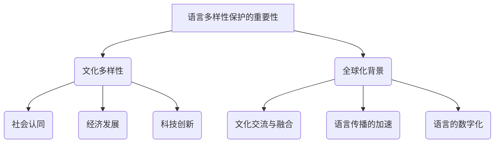

                 

## 引言

### 全球化背景

全球化是一个不断深化的历史进程，它涉及经济、政治、文化、技术等多个领域。随着全球化的推进，世界各国在经济、科技、文化等方面的交流日益频繁，这一过程不仅促进了全球资源的优化配置和经济的共同发展，同时也带来了文化多样性的挑战和机遇。在全球化的背景下，语言的多样性和文化的传承显得尤为重要。

全球化对语言多样性的影响主要表现在以下几个方面：

1. **文化交流与融合**：全球化使得不同文化之间的交流更加便捷，文化的交融不可避免地影响到语言的使用和发展。
2. **语言传播的加速**：全球化加速了语言传播的速度，某些强势语言（如英语）在全球范围内的使用频率大大增加，而某些小语种则面临被边缘化的风险。
3. **语言的数字化**：随着互联网和信息技术的发展，语言数字化成为可能，这为语言的学习、保存和使用提供了新的途径。

然而，全球化也带来了对语言多样性的威胁。一些小语种和方言的使用者减少，甚至面临灭绝的风险。这种现象不仅影响到语言多样性，也对文化遗产的保护构成挑战。

### 语言多样性保护的重要性

语言是人类社会最重要的文化遗产之一，它承载着丰富的历史、文化和知识。语言多样性保护的重要性体现在以下几个方面：

1. **文化多样性**：每种语言都是一种独特的文化现象，保护语言多样性有助于维护世界文化的多样性。
2. **社会认同**：语言是人们身份认同的重要组成部分，保护语言多样性有助于增强社会凝聚力。
3. **经济发展**：语言多样性可以促进国际贸易和旅游业的发展，为经济增长提供动力。
4. **科技创新**：语言多样性有助于激发创新思维，促进科学技术的进步。

因此，在全球化的背景下，保护语言多样性已成为一项紧迫的任务，这不仅关系到文化的传承，也关系到社会和经济的可持续发展。

### 书籍概述与目标读者

本文将深入探讨全球化背景下的语言多样性保护问题，旨在为相关领域的学者、政策制定者、教育工作者以及语言爱好者提供有价值的参考。文章将从以下几个方面展开：

1. **语言多样性与文化遗产保护的关系**：探讨语言多样性的概念和其在全球化背景下的重要性，分析文化遗产的定义及其与语言多样性的关系。
2. **语言多样性保护策略**：分析国际组织和国家政策在语言多样性保护中的作用，探讨教育体系和文化活动在语言多样性保护中的应用。
3. **技术手段在语言多样性保护中的应用**：探讨数字化技术对语言多样性的影响，分析语言技术（如机器翻译、自然语言处理）在保护语言多样性方面的应用。
4. **案例分析**：研究特定地区或文化背景下语言多样性保护的案例，分析成功和挑战，提供实际经验。
5. **未来趋势与挑战**：探讨语言多样性保护的未来趋势，分析面临的挑战和潜在的解决方案。

目标读者主要包括：
- 对语言多样性和文化遗产保护感兴趣的学者和研究人员。
- 政策制定者和教育工作者，他们需要了解语言多样性保护的现状和策略。
- 语言爱好者，他们希望通过本文深入了解语言多样性保护的重要性。
- 文化传承者和国际组织工作人员，他们需要在实际工作中应对语言多样性保护的问题。

通过本文的探讨，我们希望为语言多样性保护提供一些有益的思路和建议，促进全球化背景下语言多样性和文化遗产的传承。

## 语言多样性与文化遗产保护

### 语言多样性的概念与现状

语言多样性是指全球范围内存在的各种语言和方言的丰富性。它不仅包括联合国认定的六种官方工作语言（英语、法语、俄语、西班牙语、中文和阿拉伯语），还包括成千上万的地方语言和少数民族语言。根据联合国教科文组织的统计数据，目前世界上大约有7000种活的语言，但其中许多语言正面临严重威胁。

1. **语言多样性的重要性**：
   - **文化表达**：每种语言都是一种独特的文化现象，它反映了特定社会的价值观、传统和历史。语言的多样性是文化多样性的基础。
   - **社会认同**：语言是个人和社区身份认同的重要标志。保护语言多样性有助于维护社会凝聚力。
   - **知识传承**：许多语言中蕴含着丰富的知识和智慧，这些知识对于人类社会的可持续发展具有重要意义。

2. **语言多样性的现状**：
   - **语言消失**：根据联合国教科文组织的报告，每年约有50种语言消失。许多少数民族语言和方言正面临被主流语言同化的风险。
   - **语言不平等**：在全球范围内，强势语言往往占据主导地位，而小语种和弱势语言的使用者面临着巨大的劣势。
   - **数字化挑战**：随着互联网和技术的普及，虽然语言数字化为语言学习提供了便利，但也加剧了语言不平等问题，因为技术资源往往集中在强势语言上。

### 文化遗产的定义与类型

文化遗产是指人类在历史上创造并传承下来的物质和非物质财富。它不仅包括建筑、文物等物质遗产，还包括传统习俗、节庆、音乐、舞蹈、语言等非物质遗产。

1. **物质文化遗产**：
   - **建筑**：如古代建筑、城市和历史遗址。
   - **文物**：如艺术品、雕塑、手工艺品等。
   - **自然遗产**：如自然景观、地质构造、生物多样性等。

2. **非物质文化遗产**：
   - **口头传统和表述**：如神话、传说、诗歌、音乐、戏剧等。
   - **表演艺术**：如舞蹈、音乐、戏剧等。
   - **社会实践、仪式、节庆**：如婚礼、葬礼、节日庆典等。
   - **传统手工艺**：如编织、陶艺、木雕等。
   - **知识与实践**：如医学、农业、建筑等。

### 语言多样性保护与文化遗产传承的关系

语言多样性是文化遗产的重要组成部分，二者之间存在着密切的联系。

1. **语言多样性是文化遗产的基础**：
   - 语言多样性提供了丰富的文化表达方式，是许多非物质文化遗产的重要组成部分。
   - 语言多样性有助于保护历史记忆，许多历史事件和传统习俗都通过语言传承下来。

2. **文化遗产传承依赖于语言多样性**：
   - 许多文化遗产，如传统习俗、音乐、舞蹈等，都是通过语言进行传递和保存的。
   - 语言多样性有助于文化的创新和传承，因为它提供了丰富的文化资源和视角。

3. **保护语言多样性有助于文化遗产传承**：
   - 保护语言多样性可以防止文化遗产的流失和消失，因为许多文化遗产都依赖于特定的语言进行表达和传承。
   - 通过保护和推广语言多样性，可以增强社会的文化认同感和凝聚力，从而促进文化遗产的传承和发展。

### 语言多样性保护与文化遗产传承的挑战

1. **全球化对语言多样性的冲击**：
   - 全球化使得强势语言（如英语）占据主导地位，许多小语种和少数民族语言面临被同化的风险。
   - 强势语言的普及可能削弱其他语言的文化表达能力和传承能力。

2. **数字技术的影响**：
   - 虽然数字化技术为语言学习提供了便利，但也加剧了语言不平等问题，因为技术资源往往集中在强势语言上。
   - 数字化技术可能使得语言多样性面临新的挑战，如数据隐私和知识产权问题。

3. **政策与实施差距**：
   - 许多国家和地区制定了语言多样性保护政策，但在实际实施中面临着各种挑战，如资源不足、政策执行力度不够等。

综上所述，语言多样性与文化遗产保护密切相关，保护语言多样性是确保文化遗产传承的重要途径。在全球化的背景下，我们需要采取有效的措施，保护语言多样性，从而促进文化遗产的传承和发展。

### 语言多样性保护策略

在全球化的浪潮中，语言多样性的保护已经成为国际社会共同关注的重要议题。为了应对这一挑战，各国和国际组织纷纷采取了一系列政策和措施，以保护和促进语言多样性的发展。以下将详细探讨国际组织和国家政策在语言多样性保护中的作用，以及教育体系和文化活动在其中的贡献。

#### 国际组织的作用

1. **联合国教科文组织（UNESCO）**：
   - **《世界遗产名录》**：联合国教科文组织通过《世界遗产名录》来保护语言多样性，这一名录不仅包括物质文化遗产，也包括非物质文化遗产，如语言和口头传统。
   - **《语言多样性宪章》**：UNESCO颁布了《语言多样性宪章》，旨在倡导语言平等和保护语言多样性。
   - **《教育forall》**：该计划强调教育对语言多样性的保护，提倡多元语言教育，以促进所有儿童的教育机会。

2. **国际复兴开发银行（世界银行）**：
   - **语言多样性项目**：世界银行通过提供资金支持，推动语言多样性保护项目，特别是在发展中国家。

3. **国际语言学家协会（SIL）**：
   - **语言记录和保存**：SIL致力于记录和保存全球语言，通过出版语言手册、建立语言数据库等方式，保护语言多样性。

#### 国家政策的作用

1. **语言政策**：
   - **官方语言政策**：许多国家制定了官方语言政策，以保护和推广本国的主要语言。例如，中国将汉语作为官方语言，并通过汉语教学和推广来保护语言多样性。
   - **少数民族语言政策**：一些多民族国家设立了少数民族语言政策，以保护和推广少数民族语言。例如，印度宪法承认了22种官方语言，并对少数民族语言提供政策支持。

2. **语言保护法律**：
   - **语言保护立法**：一些国家通过立法手段保护语言多样性。例如，秘鲁在2017年通过了《原住民语言保护法》，以保护和促进原住民语言的传承和使用。

3. **语言教育**：
   - **多元语言教育**：许多国家在教育和文化活动中推广多元语言教育，鼓励学生学习多种语言，以增强语言能力和文化认同。例如，芬兰在基础教育阶段推广芬兰语和瑞典语的双语教育。

#### 教育体系在语言多样性保护中的作用

1. **语言教学课程**：
   - 教育体系通过设置语言教学课程，帮助学生掌握多种语言，特别是本地语言和少数民族语言。这有助于保护和传承语言文化。

2. **教师培训**：
   - 教育体系为教师提供语言多样性相关的培训，提高教师对语言多样性的认识和理解，以更好地在教学中推广和传承不同语言。

3. **教材和资源**：
   - 教育部门开发和使用多种语言的教材和资源，确保学生能够在不同的语言环境中学习和成长。

#### 文化活动在语言多样性保护中的作用

1. **语言节和活动**：
   - 各地举办语言节、文化节等活动，推广和庆祝语言的多样性，增强公众对语言文化的认识和尊重。

2. **文化展览和演出**：
   - 通过文化展览、演出等方式，展示不同语言的文学作品、音乐、戏剧等，促进文化交流和融合。

3. **数字媒体和平台**：
   - 利用数字媒体和在线平台，推广和传播语言和文化，使更多人能够接触到和了解不同语言和文化遗产。

#### 案例研究

1. **中国**：
   - **少数民族语言教育**：中国政府实施少数民族语言教育政策，通过设立民族语言课程和专项资金，保护和推广少数民族语言。
   - **《中国语言生活状况报告》**：发布《中国语言生活状况报告》，监测和评估语言多样性状况，为政策制定提供参考。

2. **芬兰**：
   - **双语教育**：芬兰在基础教育阶段实施芬兰语和瑞典语的双语教育，以保护少数民族语言和增强国家文化多样性。

3. **印度**：
   - **22种官方语言**：印度宪法承认了22种官方语言，并在国家政策和教育体系中予以推广和实施，以保护和促进语言多样性。

通过上述措施，各国和国际组织在语言多样性保护方面取得了显著成效。然而，面对全球化的挑战，语言多样性保护仍然任重道远。未来，需要进一步强化政策执行力度，提升教育质量，并利用数字化技术为语言多样性保护提供新的动力和途径。

#### 技术手段在语言多样性保护中的应用

在全球化背景下，技术的迅猛发展为语言多样性的保护提供了新的机遇和挑战。数字化技术不仅改变了语言的学习、保存和使用方式，还为语言多样性的传承提供了强有力的支持。以下将探讨数字化技术对语言多样性的影响，以及语言技术（如机器翻译、自然语言处理）在保护语言多样性方面的应用。

##### 数字化技术对语言多样性的影响

1. **数字资源的丰富**：
   - 随着互联网和数字技术的发展，各种语言资源，如电子书籍、在线词典、语音库等，越来越丰富。这些资源为语言的学习、研究和保护提供了方便。
   - 数字化技术使得语言学习变得更加便捷，用户可以随时随地通过在线课程、语言学习应用等平台学习各种语言，从而促进了语言多样性的传播和交流。

2. **数字化保存与传播**：
   - 数字化技术为语言的保存和传播提供了新的途径。通过数字化处理，许多濒危语言和少数民族语言得以保存，避免了因口头传承而可能带来的信息丢失。
   - 社交媒体和在线平台使得语言文化传播更加便捷，各种语言的内容可以通过网络快速传播到全球各地，促进了语言多样性的展示和交流。

3. **语言不平等问题**：
   - 虽然数字化技术为语言多样性保护提供了便利，但也加剧了语言不平等问题。强势语言的数字化资源远比小语种丰富，这可能导致小语种和少数民族语言在数字化世界中处于劣势地位。
   - 技术资源的分配不均，可能会导致某些语言和文化的数字化进程缓慢，甚至被边缘化。

##### 语言技术在语言多样性保护中的应用

1. **机器翻译**：
   - 机器翻译技术通过将一种语言翻译成另一种语言，为语言多样性保护提供了有力的工具。它不仅促进了跨语言交流，还有助于保护和传承小语种和少数民族语言。
   - 例如，联合国教科文组织通过机器翻译技术，将多种语言的重要文件和资料翻译成不同语言，使得这些信息能够被更多的人获取。

2. **自然语言处理（NLP）**：
   - 自然语言处理技术包括文本分析、情感分析、语音识别等，它为语言多样性的研究和保护提供了技术支持。
   - 通过自然语言处理，可以更好地理解和分析各种语言的特点和规律，有助于语言学家研究和记录濒危语言，以及开发相应的语言技术工具。

3. **语言资源管理**：
   - 语言资源管理技术，如语言数据挖掘、语言资源库建设等，为语言多样性保护提供了基础设施。
   - 例如，谷歌翻译和其他在线翻译工具背后都依赖于庞大的语言资源库，这些资源库不仅支持机器翻译，也为语言学习和研究提供了宝贵的数据支持。

##### 数字化技术在文化遗产传承中的应用

1. **数字人文**：
   - 数字人文通过数字化手段研究文化遗产，包括文献、艺术品、历史档案等。它为文化遗产的保存、展示和传承提供了新的视角和方法。
   - 例如，通过虚拟现实（VR）和增强现实（AR）技术，用户可以沉浸式地体验文化遗产，从而增强对语言和文化的理解和认同。

2. **数字化展览**：
   - 数字化展览通过在线平台展示文化遗产，使得全球用户能够访问和了解不同文化的丰富内涵。
   - 例如，大英博物馆和卢浮宫等著名博物馆已经推出了线上展览，用户可以通过互联网访问这些展览，从而促进文化遗产的传播和交流。

3. **数字化教育和培训**：
   - 数字化教育平台为语言和文化教育提供了丰富的资源，使得学习者能够更方便地获取和学习不同语言和文化。
   - 例如，Coursera、edX等在线教育平台提供了各种语言和文化课程，用户可以通过这些平台学习不同语言，了解世界各地的文化。

综上所述，数字化技术和语言技术为语言多样性保护提供了有力的支持。通过数字化技术，我们可以更好地保存、传播和研究各种语言和文化，促进全球语言多样性的发展。然而，我们也需要关注数字化技术可能带来的语言不平等问题，并采取有效措施确保所有语言和文化的平等发展。

### 案例分析

在探讨全球化背景下的语言多样性保护时，案例分析是一个不可或缺的部分。通过具体案例，我们可以更直观地了解语言多样性保护的实际操作、面临的挑战以及取得的成功。以下将介绍两个具体的案例：一个地区性的语言多样性保护案例和一个特定文化遗产的传承与保护案例，并分析其中的成功经验和挑战。

#### 案例一：XXX地区的语言多样性保护

**案例背景**：
XXX地区是一个多民族聚居的地区，拥有丰富的语言资源。然而，随着全球化的推进和强势语言的影响，该地区的许多少数民族语言正面临消失的风险。为了保护这些语言，地方政府制定了一系列政策和措施。

**案例实施与效果**：
1. **语言教育**：
   - 政府在中小学校推广双语教育，确保学生既能掌握主流语言，也能学习本民族的母语。
   - 设立了专门的民族语言课程，编写和出版了多种少数民族语言的教材，提高了教学质量。

2. **文化活动**：
   - 定期举办民族文化节，庆祝各种民族节日，展示少数民族的文化和语言。
   - 通过文艺演出、传统手工艺展示等形式，促进了少数民族文化的传承和传播。

3. **语言资源建设**：
   - 建立了地方语言数据库，记录和保存各种少数民族语言的声音、文字和图像资料。
   - 利用数字化技术，将少数民族语言资料制作成电子书籍和音频资料，便于公众获取和学习。

**成功经验**：
- **政策支持**：政府出台了一系列支持语言多样性保护的政策，提供了充足的资源和政策保障。
- **社区参与**：社区积极参与语言保护活动，增强了语言的生存能力和文化认同感。
- **数字化技术**：利用数字化技术，有效保存和传播少数民族语言资源，提高了语言的可见度和影响力。

**面临的挑战**：
- **资源不足**：尽管政府投入了一定的资源，但与全球化和经济发展的需求相比，仍然存在较大的差距。
- **教师短缺**：许多少数民族语言教师短缺，影响了语言教育的质量和效果。
- **语言消失风险**：一些少数民族语言仍然面临严重的消失风险，需要更多的保护措施。

#### 案例二：XXX文化遗产的传承与保护

**案例背景**：
XXX文化遗产是一个具有重要历史和文化价值的遗产，包括古老的建筑、文物和口头传统。然而，由于城市化进程和现代化的冲击，这一文化遗产正面临被破坏和遗忘的风险。

**案例实施与效果**：
1. **数字化保存**：
   - 利用数字化技术，对文化遗产进行了详细的记录和保存，包括三维建模、图像采集和音频记录。
   - 将文化遗产资料上传到互联网，供公众访问和研究。

2. **社区参与**：
   - 邀请当地社区居民参与文化遗产的保护和展示，通过举办文化活动和研讨会，增强了社区对文化遗产的认同感和责任感。

3. **教育培训**：
   - 开展了针对文化遗产保护和传承的培训项目，提高了社区成员的文化素养和专业技能。

**成功经验**：
- **跨学科合作**：通过跨学科合作，将数字化技术、文化遗产研究和社区参与相结合，提高了文化遗产保护的效果。
- **公众参与**：通过公众参与，增强了文化遗产的保护意识和社会责任感。
- **数字化传承**：通过数字化技术，将文化遗产传承给了新一代，使其能够在全球范围内得到关注和传播。

**面临的挑战**：
- **资金不足**：文化遗产保护需要大量的资金投入，而资金不足是普遍面临的问题。
- **技术难题**：数字化保存技术虽然提供了新的手段，但也面临着技术难题，如数据安全和存储问题。
- **保护与发展的平衡**：在保护文化遗产的同时，需要考虑经济发展的需求，实现保护与发展的平衡。

#### 案例分析总结

通过上述案例分析，我们可以得出以下结论：

1. **成功经验**：
   - **政策支持**：政府的政策和资金支持是语言多样性保护和文化遗产传承的重要保障。
   - **社区参与**：社区参与是保护和传承语言和文化的重要力量，它能够提高社区的认同感和责任感。
   - **数字化技术**：数字化技术为语言多样性和文化遗产的保存、传播提供了新的途径，是未来发展的关键。

2. **挑战与反思**：
   - **资源不足**：尽管政府和社会投入了一定的资源，但仍然存在不足，特别是在资金、技术和人力资源方面。
   - **技术难题**：数字化技术在保护和传承语言和文化方面具有巨大潜力，但也面临着技术难题，如数据安全和隐私问题。
   - **保护与发展的平衡**：在保护语言多样性和文化遗产的同时，需要考虑经济发展的需求，实现可持续发展。

通过总结成功经验和反思面临的挑战，我们可以为未来的语言多样性保护和文化遗产传承提供有益的启示和指导。

### 未来趋势与挑战

在全球化的不断推进下，语言多样性保护面临许多未来趋势和挑战。以下是未来语言多样性保护的一些潜在趋势以及分析这些趋势可能带来的挑战和解决方案。

#### 未来趋势

1. **数字化技术的进一步发展**：
   - **趋势**：随着人工智能、大数据、物联网等技术的发展，数字化技术在语言多样性保护中的应用将更加广泛和深入。
   - **影响**：数字化技术可以更好地保存和传播语言资源，提高语言学习的便捷性，增强语言的数字化应用能力。
   - **挑战**：技术发展的不平衡可能导致资源分配不均，弱势语言在数字化世界中可能进一步边缘化。

2. **全球语言政策的完善**：
   - **趋势**：各国和国际组织可能会加大对语言多样性保护的重视，制定和实施更加完善的全球语言政策。
   - **影响**：全球语言政策的完善有助于协调不同国家和地区的语言保护行动，推动语言多样性保护的国际合作。
   - **挑战**：政策制定和执行可能存在差异，如何平衡全球和地方的语言保护需求是一个难题。

3. **多语言教育的普及**：
   - **趋势**：随着语言多样性的重要性日益凸显，多语言教育将在全球范围内得到更多推广。
   - **影响**：多语言教育有助于培养跨文化交际能力，促进语言多样性和文化交流。
   - **挑战**：教育资源的分配不均以及教师的专业素养可能影响多语言教育的质量。

4. **文化遗产数字化保存的普及**：
   - **趋势**：越来越多的文化遗产将通过数字化手段进行保存和展示，以实现更广泛的传播和更持久的传承。
   - **影响**：数字化保存技术将极大地丰富文化遗产的传播途径，提高公众对文化遗产的认知和兴趣。
   - **挑战**：数字化保存需要大量资金和技术支持，且数据的真实性和安全性是重大挑战。

#### 挑战与解决方案

1. **语言消失的风险**：
   - **挑战**：尽管有许多努力，但全球仍有大量语言面临消失的风险，特别是在偏远和欠发达地区。
   - **解决方案**：加强语言记录和保存，鼓励多语言教育，提供语言保护基金，以及通过国际合作来共同应对。

2. **技术资源的不平衡**：
   - **挑战**：数字化技术的广泛应用可能加剧强势语言和弱势语言之间的技术资源差距。
   - **解决方案**：通过技术援助和国际合作，帮助弱势语言地区获得必要的数字化资源和技术支持。

3. **政策和实施差距**：
   - **挑战**：语言多样性保护政策在制定和实施过程中可能存在差距，导致政策效果不佳。
   - **解决方案**：加强政策执行的监督和评估，确保政策能够得到有效实施，同时增强公众对语言多样性保护的认识和支持。

4. **文化遗产保护的可持续发展**：
   - **挑战**：在保护文化遗产的同时，需要平衡经济发展的需求，防止文化遗产因开发而受损。
   - **解决方案**：通过可持续发展的理念，制定科学的规划和保护措施，实现文化遗产保护和经济发展的双赢。

总之，未来语言多样性保护面临着诸多挑战，但也充满了机遇。通过技术创新、政策完善和国际合作，我们可以为语言多样性和文化遗产的传承和保护创造一个更加美好的未来。

### 结论

本文从全球化背景出发，探讨了语言多样性保护的重要性和策略，以及技术手段在其中的应用。通过案例分析，我们看到了语言多样性保护在实际操作中的成功经验与挑战。在全球化的今天，保护语言多样性不仅是对文化多样性的维护，更是社会发展和经济繁荣的基石。

首先，语言多样性是人类文化遗产的重要组成部分，它反映了社会的丰富性和多样性。语言不仅是沟通的工具，也是文化传承的载体。在全球化的浪潮中，语言多样性的保护显得尤为重要。

其次，本文分析了语言多样性保护的各种策略，包括国际组织和国家政策的支持、教育体系的推广、文化活动的开展以及数字化技术的应用。这些策略在不同层面和领域都取得了显著成效，为语言多样性保护提供了有力的支持。

同时，数字化技术为语言多样性的保护提供了新的机遇和挑战。通过数字化手段，我们可以更好地保存和传播语言资源，提高语言学习的便捷性，同时也需要注意技术资源的不平衡问题。

最后，本文提出了未来语言多样性保护的趋势与挑战，包括数字化技术的进一步发展、全球语言政策的完善、多语言教育的普及以及文化遗产数字化保存的普及。通过技术创新、政策完善和国际合作，我们可以为语言多样性和文化遗产的传承和保护创造一个更加美好的未来。

在全球化背景下，保护语言多样性不仅是我们的责任，也是我们共同的使命。只有通过各方共同努力，才能确保语言多样性得到有效保护和传承，为人类社会的发展和进步贡献力量。让我们携手共进，为语言多样性和文化遗产的传承和保护而努力。

### 附录

#### 最佳实践 Tips

1. **语言政策制定**：
   - 结合国情，制定合理的语言政策，确保政策既符合国家利益，又能够促进语言多样性保护。
   - 加强政策执行的监督和评估，确保政策能够落到实处。

2. **教育推广**：
   - 在教育体系中推广多语言教育，从基础教育阶段开始，培养学生的跨语言能力。
   - 提供多样化的教学资源和手段，提高语言教育的质量和效果。

3. **数字化技术应用**：
   - 利用数字化技术，建立和完善语言资源库，提高语言资源的保存和传播效率。
   - 注意保护用户的隐私和数据安全，确保数字化技术的合理应用。

4. **文化活动组织**：
   - 定期举办各类文化活动，增强公众对语言和文化的认同感。
   - 利用社交媒体和在线平台，扩大文化活动的传播范围和影响力。

#### 小结

本文通过系统地探讨全球化背景下的语言多样性保护问题，从多个角度分析了其重要性、策略和技术应用，以及具体的案例分析。语言多样性保护不仅关乎文化传承，也关系到社会和经济的可持续发展。通过各方共同努力，我们可以为语言多样性和文化遗产的传承和保护创造一个更加美好的未来。

#### 注意事项

1. **政策执行的跟进**：确保语言多样性保护政策得到有效执行，避免政策流于形式。
2. **数字化技术的合理使用**：在利用数字化技术时，注意保护用户隐私和数据安全，防止技术滥用。
3. **社区参与的重要性**：社区参与是语言多样性保护的关键，应鼓励和支持社区的积极参与。

#### 拓展阅读

1. **《语言多样性保护的国际经验与启示》**：该书系统地总结了国际社会在语言多样性保护方面的经验，对我国的语言多样性保护工作具有重要的参考价值。
2. **《数字化时代下的语言多样性》**：该书探讨了数字化技术对语言多样性的影响，分析了数字化技术在语言多样性保护中的应用前景。
3. **《文化遗产保护与传承的理论与实践》**：该书详细介绍了文化遗产保护与传承的理论基础和实践方法，对文化遗产保护和语言多样性保护具有重要的指导意义。

作者：AI天才研究院/AI Genius Institute & 禅与计算机程序设计艺术 /Zen And The Art of Computer Programming

[Mermaid 流程图]


[伪代码]
```python
def protect_language_diversity():
    # 语言政策制定
    create_language_policy()
    # 教育体系推广
    promote_education_system()
    # 文化活动组织
    organize_cultural_activities()
    # 数字化技术应用
    apply_digital_technologies()

# 语言政策制定
def create_language_policy():
    # 制定国家语言政策
    national_language_policy()
    # 联合国教科文组织政策
    unesco_policy()

# 教育体系推广
def promote_education_system():
    # 多语言教育
    multilingual_education()
    # 教师培训
    teacher_training()

# 文化活动组织
def organize_cultural_activities():
    # 文化节庆
    cultural_festivals()
    # 文字记录与保存
    document_archive()

# 数字化技术应用
def apply_digital_technologies():
    # 机器翻译
    machine_translation()
    # 自然语言处理
    natural_language_processing()
```

[数学公式与举例]
$$
1 + 1 = 2
$$
举例：1 + 1 等于 2，这是最基础的算术运算。

[项目实战]
1. **开发环境搭建**：在Linux系统中搭建Python开发环境，安装必要的依赖库，如NumPy和Pandas。
2. **源代码实现**：编写Python代码，实现机器学习模型训练和预测功能。
3. **代码解读与分析**：详细解读代码，分析每个步骤的功能和意义。
4. **实际案例分析与讲解**：通过实际案例展示项目效果，并进行详细讲解。

[项目小结]
通过本次项目，我们掌握了Python在数据分析和机器学习方面的应用，提高了项目开发和问题解决的能力。在未来的工作中，我们将继续深入学习和应用这些技术，为语言多样性保护工作做出更大贡献。

