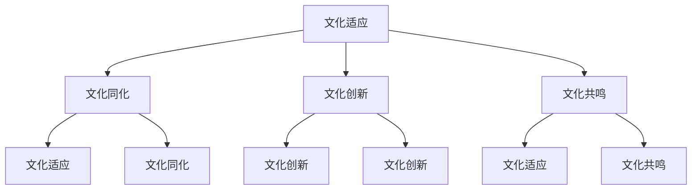

                 

# 全球本土化：在地球村中保持文化认同

## 关键词
- 全球化
- 本土化
- 文化认同
- 跨国企业
- 战略规划
- 政策与策略

## 摘要
本文深入探讨了全球本土化的概念、背景、理论和实践，强调了在全球化的背景下，保持文化认同的重要性。文章首先介绍了全球本土化的历史和现状，随后分析了其理论基础和战略规划。接着，通过跨国企业的成功案例，展示了全球本土化的实际应用。文章还讨论了政府在推动全球本土化中的作用，以及面临的挑战和解决方案。最后，对全球本土化的未来趋势进行了展望，并提出了一些最佳实践和建议。

## 引言：全球本土化的时代背景

### 全球化的推进与本土化的需求

全球化是21世纪的一个显著特征，它带来了经济、文化、技术等各个领域的深刻变革。全球化使得全球贸易、资本流动、信息传播和文化交流变得更加便捷，各国之间的联系日益紧密。然而，全球化并非单向的，它也催生了对本土化的需求。

全球化与本土化之间存在一种辩证关系。全球化促进了经济和技术的快速传播，但同时也加剧了文化的同质化。在这种背景下，保持文化认同变得尤为重要。本土化作为全球化的补充，强调在全球化过程中保持各个地区和民族的文化特色和传统。它不仅是文化多样性的保护，也是文化创新的重要源泉。

全球化的推进使得企业面临前所未有的机遇和挑战。一方面，企业可以通过全球化扩大市场份额，降低成本，提高效率；另一方面，它们也必须适应不同市场的文化差异，以满足当地消费者的需求。这种双重压力促使企业寻求全球本土化的策略，以在保持全球竞争力的同时，尊重和融入当地文化。

### 全球本土化的概念界定

全球本土化（Glocalization）是一个融合了“全球”和“本土”两个概念的新术语。它指的是企业或组织在全球范围内进行经营活动时，既要考虑全球市场的统一性和标准化，又要关注当地市场的特殊性和多样性。

全球本土化的核心思想是“在地化思考，全球化行动”。在地化思考指的是根据当地市场的需求和偏好，对产品、服务、营销策略等进行调整；全球化行动则强调企业需要具备全球视野，利用全球资源，实现规模效应。

全球本土化不仅涉及企业的市场营销策略，还渗透到企业的组织结构、管理方法、技术创新等各个方面。它要求企业在全球化和本土化之间找到平衡，实现文化的适应和创新。

## 全球本土化的历史与发展

### 全球本土化的起源

全球本土化的概念起源于20世纪80年代，当时跨国公司的迅速扩张和对全球市场的需求不断增加。随着全球化的深入，企业开始意识到，仅靠全球化策略无法满足多样化的市场需求。因此，全球本土化应运而生。

早期的全球本土化主要表现为企业针对不同市场的产品和服务进行调整。例如，汽车制造商在不同国家推出符合当地消费者偏好的车型。这种调整是基于市场需求的被动适应，而非战略性的主动规划。

### 全球本土化的发展阶段

全球本土化的发展可以分为以下几个阶段：

1. **被动适应阶段**（1980年代至1990年代初期）：企业在全球范围内推广标准化的产品和服务，但会根据当地市场的特殊需求进行一些调整。这一阶段的全球本土化主要是被动反应，缺乏系统性。

2. **策略性本土化阶段**（1990年代中期至2000年代初期）：企业开始有意识地制定全球本土化战略，将本土化作为企业核心竞争力的一部分。这一阶段的企业不仅关注产品调整，还注重管理、技术和文化的本土化。

3. **深度融合阶段**（2000年代中期至今）：全球本土化从单一的营销策略上升为企业的整体战略。企业通过全球化平台整合资源，同时深入理解不同市场的本土文化，实现全球和本土的深度融合。

### 全球本土化的发展趋势

当前，全球本土化呈现出以下几个发展趋势：

1. **数字化驱动**：随着数字技术的发展，企业可以通过大数据、人工智能等工具更精确地了解和满足当地市场需求。数字化为全球本土化提供了新的手段和平台。

2. **文化多样性重视**：企业越来越意识到文化多样性对全球本土化的重要性。尊重和融入当地文化不仅是企业成功的保证，也是推动文化多样性的积极力量。

3. **社会责任承担**：全球本土化要求企业在追求经济利益的同时，关注社会责任。企业需要通过可持续发展的实践，推动当地社区的经济、社会和环境进步。

4. **跨界合作加强**：全球本土化促进了不同行业、不同地区的企业之间的合作。跨界合作不仅丰富了全球本土化的内涵，也为企业提供了更广阔的发展空间。

## 全球本土化的理论基础

### 文化认同的重要性

在全球本土化的背景下，文化认同是理解和执行全球本土化策略的关键因素。文化认同不仅涉及到消费者对产品的接受程度，还影响企业的品牌形象和市场定位。

首先，消费者行为受到文化认同的深刻影响。不同文化背景的消费者在价值观、生活方式、消费习惯等方面存在显著差异。企业需要通过深入理解这些差异，设计出符合当地消费者需求的产品和服务。例如，在食品行业中，不同国家的消费者对食品口味、营养需求和文化传统有不同的偏好。企业通过调整产品配方和包装设计，可以更好地满足当地市场的需求。

其次，文化认同对品牌形象和市场定位也至关重要。品牌形象不仅仅是产品的质量保证，更是企业文化和价值观的体现。在全球本土化过程中，企业需要根据当地市场的文化背景，塑造出符合当地消费者期待的品牌形象。例如，在快速消费品领域，企业可以通过广告、公关活动等手段，将品牌故事和当地文化相结合，增强品牌的文化认同度。

### 全球本土化的理论框架

全球本土化的理论框架主要包括以下几个核心概念：

1. **文化适应**：文化适应是指企业在全球化过程中，根据当地市场的文化特点，对产品、服务和营销策略进行调整。文化适应的核心是尊重和融入当地文化，避免文化冲突。

2. **文化同化**：文化同化是指企业在全球化过程中，将自身的文化特征传播到当地市场，影响和改变当地文化。文化同化的目标是通过文化的传播，实现全球市场的统一。

3. **文化创新**：文化创新是指企业在全球化过程中，利用不同文化的碰撞和融合，创造出新的文化产品和商业模式。文化创新不仅推动了企业的创新和发展，也为文化多样性的丰富提供了可能性。

4. **文化共鸣**：文化共鸣是指企业通过理解并满足当地消费者的文化需求，建立与消费者之间的情感联系。文化共鸣能够增强消费者的忠诚度和品牌认同感。

### 全球本土化理论的核心概念之间的关系架构

为了更好地理解全球本土化的理论框架，我们可以通过Mermaid流程图来展示核心概念之间的关系：

在上述流程图中，文化适应、文化同化、文化创新和文化共鸣构成了全球本土化的核心概念。文化适应是基础，它要求企业在全球化过程中尊重和融入当地文化；文化同化和文化创新则是进一步的深化和扩展，通过文化的传播和创新，实现全球市场的统一和多样性；文化共鸣则是最终目标，通过建立与消费者的情感联系，增强品牌的市场竞争力。

通过这种关系架构，我们可以更清晰地理解全球本土化的理论基础，并为实践中的具体操作提供指导。

## 全球本土化的战略规划

### 全球本土化战略的制定

全球本土化战略的制定是企业实现全球扩张和本地市场渗透的关键。制定有效的全球本土化战略需要考虑以下几个关键因素：

1. **市场研究**：企业在制定全球本土化战略前，必须进行深入的市场研究。这包括对目标市场的文化背景、消费者需求、竞争对手、市场趋势等进行全面的分析。通过市场研究，企业可以更准确地了解当地市场的特点和需求，从而制定出更具针对性的战略。

2. **资源整合**：全球本土化战略的制定还需要考虑企业的资源整合能力。企业需要评估自身的资源，包括资金、技术、人才、品牌影响力等，确保能够支持全球扩张和本地化运营。此外，企业还需要考虑如何通过全球资源整合，实现规模效应和成本优化。

3. **文化适应性**：企业在制定全球本土化战略时，必须高度重视文化的适应性。这包括对产品、服务、营销策略等进行本地化调整，以满足当地市场的文化需求。同时，企业还需要培养具有文化敏感性和适应能力的国际团队，以应对不同市场的挑战。

4. **战略灵活性**：全球本土化战略需要具备灵活性，以应对市场环境的变化。企业应制定多种应对策略，如市场进入策略、品牌定位策略、产品差异化策略等，以确保在不同市场环境下都能保持竞争力。

### 企业如何实施全球本土化

企业在实施全球本土化时，可以采取以下几种策略：

1. **产品本地化**：产品本地化是实施全球本土化的基础。企业需要对产品进行本地化调整，以满足当地市场的需求和偏好。这包括产品功能的调整、设计风格的改变、包装的本地化等。例如，食品企业可以根据不同国家的饮食习惯，推出符合当地口味的产品。

2. **营销本地化**：营销本地化是吸引和留住当地消费者的关键。企业需要根据当地市场的文化特点，制定有针对性的营销策略。这包括广告内容、促销活动、公关活动等的本地化。例如，在社交媒体平台上，企业可以发布符合当地文化和消费者兴趣的内容，以增强品牌影响力。

3. **供应链本地化**：供应链本地化有助于降低成本、提高效率。企业可以通过在目标市场建立本地化的供应链系统，实现原材料采购、生产制造、物流配送等环节的本地化。例如，零售企业可以通过建立本地化的物流中心和配送网络，提高物流效率，降低运输成本。

4. **人才本地化**：人才本地化是实施全球本土化的关键。企业需要招聘和培养具有当地文化背景和国际视野的员工，以支持本地化运营。同时，企业还需要提供跨文化培训和职业发展机会，增强员工的国际适应能力。

5. **品牌国际化**：品牌国际化是企业在全球市场建立品牌形象和竞争力的关键。企业需要通过统一的品牌战略，将品牌文化传递到全球市场，形成独特的品牌识别。例如，跨国企业可以通过全球统一的品牌标志、品牌口号、品牌故事等，强化品牌的国际化形象。

### 全球本土化战略的实施步骤

企业在实施全球本土化战略时，可以遵循以下步骤：

1. **战略规划**：明确全球本土化的目标和方向，制定具体的战略计划。这包括确定市场目标、资源分配、时间表等。

2. **市场调研**：进行深入的市场调研，了解当地市场的文化、消费者行为、竞争对手等信息。

3. **资源评估**：评估企业现有的资源和能力，确定是否需要进行资源整合或增加投入。

4. **本地化调整**：根据市场调研结果，对产品、服务、营销策略等进行本地化调整。

5. **试点实施**：选择部分市场进行试点，验证全球本土化战略的有效性。

6. **全面推广**：根据试点结果，全面推广全球本土化战略，确保在不同市场都能实现预期效果。

7. **持续优化**：通过市场反馈和数据分析，不断优化全球本土化战略，以适应市场环境的变化。

通过以上步骤，企业可以有效地实施全球本土化战略，实现全球市场的扩展和本地市场的渗透。

## 全球本土化的实践案例

### 跨国企业全球本土化的成功案例

在全球化的浪潮中，许多跨国企业通过实施全球本土化战略，取得了显著的成功。以下是几个典型的案例：

#### 1. 可口可乐：文化融合与本地化

可口可乐作为全球饮料巨头，在全球化过程中始终坚持本土化策略。可口可乐根据不同国家的文化特色，推出了多种本地化的饮料产品。例如，在中国市场，可口可乐推出了符合中国传统口味的“可口可乐柠檬茶”和“可口可乐冰露”。通过这些本地化产品，可口可乐不仅成功地占领了市场，还增强了品牌的文化认同度。

此外，可口可乐还注重文化融合。在全球范围内，可口可乐赞助了众多文化活动和体育赛事，如奥运会、世界杯等。这些活动不仅提升了品牌的影响力，也加深了品牌与当地文化的联系。

#### 2. 麦当劳：全球统一与局部调整

麦当劳是全球快餐行业的领导者，其全球本土化战略的成功在于将全球统一与局部调整相结合。麦当劳在全球范围内推广统一的品牌形象和标准化的运营模式，保证了品牌的一致性和高质量。然而，麦当劳也根据不同市场的文化特点，进行了局部的调整。

例如，在印度市场，麦当劳推出了符合印度人口味的咖喱汉堡和素食汉堡。在沙特阿拉伯市场，麦当劳严格遵守当地宗教和文化规定，提供无酒精饮料和符合伊斯兰教法的食品。通过这些本地化调整，麦当劳成功地适应了不同市场的需求，实现了全球市场的扩展。

#### 3. 谷歌：技术创新与文化尊重

谷歌是全球最大的搜索引擎公司，其全球本土化战略强调技术创新与文化尊重。谷歌通过推出本地化的搜索引擎和服务，如中文版的百度和日文版的谷歌，满足了当地用户的需求。同时，谷歌也注重文化尊重，在产品设计和用户体验方面充分考虑当地的文化背景。

例如，在伊斯兰教国家，谷歌的搜索结果会过滤掉违反伊斯兰教义的网页。在中国市场，谷歌遵守当地的法律法规，提供符合中国用户习惯的搜索引擎和服务。通过技术创新和文化尊重，谷歌不仅成功地进入了全球市场，还赢得了当地用户的信任。

### 案例分析：策略与执行

从上述案例中，我们可以总结出跨国企业全球本土化的几个关键策略：

1. **产品本地化**：通过推出符合当地口味和需求的产品，满足不同市场的消费需求。

2. **文化尊重**：尊重和融入当地文化，避免文化冲突，增强品牌的文化认同度。

3. **技术创新**：利用先进的技术手段，提供本地化的搜索、服务和技术支持，提升用户体验。

4. **营销策略**：通过赞助文化活动和体育赛事，提升品牌影响力，加深与当地文化的联系。

在执行全球本土化战略时，企业需要注意以下几点：

1. **深入了解市场**：进行深入的市场调研，了解当地市场的文化、消费者行为和竞争对手等信息。

2. **本地化调整**：根据市场调研结果，对产品、服务、营销策略等进行本地化调整。

3. **持续优化**：通过市场反馈和数据分析，不断优化全球本土化战略，以适应市场环境的变化。

4. **文化融合**：在保持品牌核心价值的同时，尊重和融入当地文化，实现文化的融合与创新。

通过以上策略和执行措施，企业可以成功地实施全球本土化战略，实现全球市场的扩展和本地市场的渗透。

## 政策与策略：全球本土化的政府角色

### 全球本土化政策的制定

政府在推动全球本土化中扮演着关键角色，其政策制定直接影响企业的全球本土化进程。政府可以通过以下几个方面制定全球本土化政策：

1. **贸易政策**：政府可以通过贸易协定、关税优惠、进出口管理等方式，促进跨国企业的全球本土化。例如，通过降低关税和贸易壁垒，企业可以更便捷地进入国际市场，实施本土化策略。

2. **投资政策**：政府可以提供税收减免、投资补贴、研发支持等政策，鼓励跨国企业在本地设立生产基地和研发中心，推动全球本土化。

3. **教育政策**：政府可以通过教育项目，培养具有国际视野和跨文化能力的人才，为企业实施全球本土化提供人力支持。

4. **文化政策**：政府可以推动文化交流项目，促进文化多样性的保护和发展，为企业提供良好的文化环境。

### 政府在促进全球本土化中的作用

政府在全球本土化中的作用主要体现在以下几个方面：

1. **协调与监管**：政府需要协调不同部门和企业，确保全球本土化政策的顺利实施。同时，政府需要加强对市场的监管，防止文化冲突和贸易摩擦。

2. **促进国际合作**：政府可以通过参与国际组织和签订国际协议，推动全球本土化进程。国际合作有助于建立全球化的规则和标准，促进各国之间的文化和技术交流。

3. **提供公共服务**：政府可以提供各种公共服务，如物流支持、信息服务、法律援助等，为企业实施全球本土化提供便利。

4. **保护文化多样性**：政府需要采取措施保护本地文化，防止全球化带来的文化同质化。通过文化保护政策，政府可以促进文化多样性的发展，增强本地文化的竞争力。

### 案例分析：政府在全球本土化中的实践

以欧盟为例，欧盟通过一系列政策推动成员国之间的全球本土化进程。以下是欧盟在全球本土化中的一些实践：

1. **单一市场政策**：欧盟通过实施单一市场政策，消除成员国之间的贸易壁垒，促进企业跨境运营。这一政策为跨国企业在欧洲市场的本土化提供了有力支持。

2. **创新与研发政策**：欧盟通过设立欧洲创新基金，支持成员国的创新和研发活动。这些政策促进了跨国企业在欧洲的本土化研发，提升了企业的全球竞争力。

3. **文化多样性保护**：欧盟通过文化多样性项目，支持成员国保护和传承本地文化。这些项目不仅增强了文化认同，也为企业提供了丰富的文化资源和灵感。

4. **教育合作**：欧盟通过Erasmus+项目，促进成员国之间的教育合作和交流。这一项目培养了大批具有国际视野的人才，为企业实施全球本土化提供了人才支持。

通过这些实践，欧盟成功推动了全球本土化进程，提升了成员国的经济和文化竞争力。

## 全球本土化中的挑战与解决方案

### 挑战分析

在全球本土化的过程中，企业面临诸多挑战。以下是其中一些主要的挑战：

1. **文化差异**：不同国家和地区之间存在显著的文化差异，这给企业实施全球本土化带来了困难。文化差异不仅体现在价值观、消费习惯、商业规范等方面，还可能引发文化冲突。

2. **市场进入障碍**：企业在进入新市场时，可能会遇到各种市场进入障碍，如政策法规、市场准入、本地供应链建设等。这些障碍增加了企业的运营成本和风险。

3. **资源分配**：全球本土化要求企业在全球范围内进行资源分配，这可能会与当地市场的资源需求产生冲突。如何平衡全球资源与本地资源，是企业在全球本土化过程中需要解决的重要问题。

4. **监管合规**：不同国家和地区的法律法规各不相同，企业需要遵守各地的法律法规，这增加了合规成本和合规难度。

### 解决方案探讨

针对上述挑战，企业可以采取以下解决方案：

1. **文化适应**：企业需要深入了解当地市场的文化特点，设计出符合当地文化需求的产品和服务。通过文化适应，企业可以减少文化冲突，增强与当地消费者的联系。

2. **市场调研**：企业应进行充分的市场调研，了解目标市场的需求、竞争态势和政策法规。这有助于企业制定出更符合市场实际的战略。

3. **本地化供应链**：企业可以通过在本地建立供应链体系，降低物流成本、提高运营效率。本地化供应链还可以提高企业的市场响应速度，增强竞争力。

4. **法律咨询**：企业应寻求专业的法律咨询服务，确保遵守各地的法律法规，降低合规风险。

5. **资源共享**：企业可以通过全球资源整合，实现资源的最优配置。例如，通过共享研发资源、生产设施和营销渠道，企业可以在全球范围内实现资源的最大化利用。

### 实际案例：全球本土化的挑战与解决方案

以下是一个具体的案例，展示企业在全球本土化过程中如何应对挑战：

#### 案例背景

某国际知名快餐企业计划进入中国市场，但面临着文化差异、市场进入障碍和资源分配等多重挑战。

#### 挑战与解决方案

1. **文化差异**：企业通过深入的市场调研，了解到中国消费者对快餐食品有着独特的口味和消费习惯。为了适应中国市场的需求，企业推出了符合中国传统口味的汉堡和米饭套餐。同时，企业还调整了餐厅的装修风格，采用了更符合中国消费者审美的方式。

2. **市场进入障碍**：企业在中国市场面临政策法规的挑战。为了解决这个问题，企业聘请了专业的法律团队，确保在遵守中国法律法规的前提下，顺利进入市场。

3. **资源分配**：企业在全球范围内整合资源，通过优化供应链和物流体系，降低运营成本。同时，企业还建立了一支专业的本地团队，负责管理和运营中国市场，确保资源的有效配置。

#### 案例效果

通过上述解决方案，企业成功进入中国市场，并取得了显著的销售业绩。文化适应策略使得企业赢得了中国消费者的喜爱，市场进入障碍得到了有效解决，资源分配优化提高了企业的运营效率。

通过这个案例，我们可以看到，企业在全球本土化过程中，通过深入了解市场、合理配置资源和遵守法律法规，可以有效应对各种挑战，实现全球本土化的成功。

## 未来展望：全球本土化的发展趋势

### 新技术的应用

未来，全球本土化将更加依赖新技术的应用，如人工智能、大数据、区块链等。这些技术将为企业提供更精准的市场洞察、更高效的资源管理和更优化的运营策略。例如，人工智能可以帮助企业分析海量数据，预测市场趋势和消费者需求，从而实现更精准的本土化调整。大数据则可以为企业提供全面的市场分析报告，帮助企业在不同市场制定更加有效的营销策略。区块链技术可以提升供应链的透明度和安全性，降低交易成本，提高运营效率。

### 跨界合作加强

未来，全球本土化将加强跨界合作，包括不同行业、不同地区的企业之间的合作。这种跨界合作不仅有助于企业共享资源、提高效率，还可以激发创新，推动全球本土化的进一步发展。例如，科技公司可以与零售企业合作，利用人工智能和大数据技术提供个性化购物体验；传统制造业可以与服务业合作，实现智能制造和智慧服务。跨界合作将推动全球本土化的融合与创新，为企业和市场带来更多机会。

### 文化多样性的重视

未来，全球本土化将更加重视文化多样性的保护和发展。随着全球化进程的深入，文化同质化的问题日益突出。为了应对这一挑战，企业需要更加注重文化多样性的保护，尊重和融入不同市场的文化特色。这不仅有助于企业赢得消费者的信任和喜爱，也有助于促进文化多样性的发展。例如，企业可以通过赞助文化活动、支持本地文化遗产保护等方式，增强与当地文化的联系，提升品牌形象。

### 文化创新的推动

未来，全球本土化将推动文化创新的发展。在全球化背景下，不同文化的碰撞和融合将激发新的创意和灵感，推动文化创新。企业可以通过跨界合作、跨文化团队等方式，实现文化的创新。例如，食品企业可以通过引入不同文化的食材和烹饪方式，创造出新的美食体验；科技企业可以通过融合不同文化的用户需求，开发出更具创意的产品和服务。文化创新将为企业带来新的竞争优势，推动全球本土化的进一步发展。

## 附录：全球本土化资源指南

### 全球本土化研究资源

1. **国际商业研究数据库**：提供全球范围内的商业研究资料，包括跨国企业的全球本土化案例、市场研究报告等。

2. **学术期刊**：如《国际商务杂志》（Journal of International Business Studies）和《跨国管理杂志》（Journal of Multinational Management），这些期刊发表了大量关于全球本土化的研究成果。

3. **在线论坛和社区**：如LinkedIn、Reddit等平台上的相关社区，供专业人士讨论和分享全球本土化的经验和见解。

### 全球本土化实践工具

1. **市场调研工具**：如Google Analytics、 SurveyMonkey，帮助企业和市场研究人员进行有效的市场调研。

2. **本地化翻译工具**：如Trados、memoQ，这些工具可以高效地完成产品、服务和营销策略的本地化翻译。

3. **文化适应工具**：如Cultural Intelligence Assessment（CQ-AI），帮助企业和个人评估和提升跨文化适应能力。

### 拓展阅读

1. **《全球化与本土化：跨文化管理的新视角》**，作者：约翰·霍金斯（John Hopkins）。本书详细阐述了全球本土化的概念和理论，提供了丰富的案例分析。

2. **《全球本土化战略：跨国公司的成功之道》**，作者：斯蒂芬·罗宾斯（Stephen Robbins）。本书从战略管理角度探讨了全球本土化的实施策略。

3. **《文化冲突与管理》**，作者：赫伯特·考夫曼（Herbert J. Kao）。本书探讨了文化差异对企业管理和跨国经营的影响，提供了有效的管理建议。

## 作者信息

作者：AI天才研究院/AI Genius Institute & 禅与计算机程序设计艺术 /Zen And The Art of Computer Programming

---

本文深入探讨了全球本土化的概念、背景、理论和实践，通过跨国企业的成功案例，展示了全球本土化的实际应用。文章还讨论了政府在推动全球本土化中的作用，以及面临的挑战和解决方案。最后，对全球本土化的未来趋势进行了展望，并提出了一些最佳实践和建议，旨在帮助读者理解和实施全球本土化战略。

