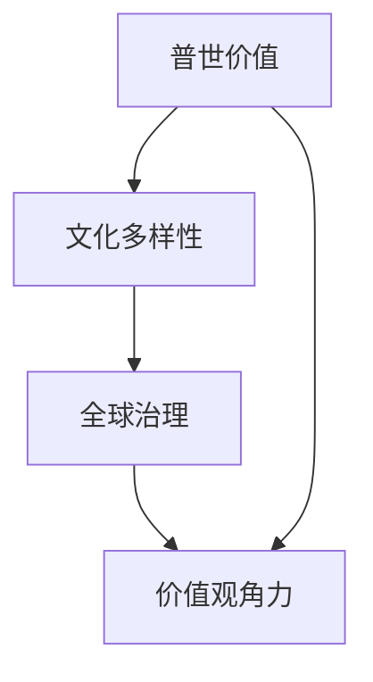

                 


### 文章标题：全球治理中的价值观角力：普世价值与文化多样性的平衡

### 文章关键词：
1. 全球治理
2. 价值观角力
3. 普世价值
4. 文化多样性
5. 平衡策略

### 文章摘要：
本文深入探讨了全球治理中普世价值与文化多样性的平衡问题。通过对全球治理背景、价值观角力背景的介绍，本文分析了普世价值与文化多样性的概念及其重要性。进一步，文章通过案例分析和策略探讨，提出了实现普世价值与文化多样性平衡的原则和工具。最后，文章展望了全球治理中价值观角力的未来趋势以及文化多样性的发展前景。

### 引言与背景

#### 全球治理概述

全球治理是指国际社会在多层面、多领域内，通过合作、协调和协商来处理全球性问题的一种方式。其核心在于各国共同参与，共同制定规则，共同遵守国际法和国际组织的规定。全球治理的目标是促进和平、稳定和可持续发展。

全球治理的历史发展可以追溯到第二次世界大战后的国际秩序重建。在此过程中，一系列国际组织和机制得以建立，如联合国、世界银行、国际货币基金组织等。这些机构和组织为全球治理提供了基础平台。随着全球化的深入发展，全球治理的范围和复杂性不断增加，涉及到的领域也从政治、经济扩展到环境、卫生、安全等多个方面。

#### 价值观角力的背景

价值观角力是指在全球化进程中，不同文化、政治体系、宗教信仰等价值观之间的冲突和互动。全球化带来了各国之间的密切联系和交流，但也引发了价值观的碰撞和冲突。

价值观角力的产生原因主要有以下几点：

1. **文化多样性**：世界上存在着多种多样的文化，每种文化都有其独特的价值观。当不同文化在全球化过程中相遇时，难免会发生冲突和误解。

2. **政治和经济利益**：各国在全球化过程中追求自身政治和经济利益，这可能导致价值观的分歧和角力。

3. **宗教和意识形态**：宗教和意识形态的差异是价值观角力的一个重要因素。不同宗教和意识形态之间存在深刻的对立，这往往导致价值观的冲突。

4. **历史和文化认同**：历史上，一些国家或民族可能遭受过殖民统治或其他形式的压迫，这可能导致其对其他文化的抵制和排斥。

### 理论基础

#### 普世价值的探讨

普世价值是指普遍适用于所有人、所有文化的基本价值观念。这些价值观被认为是人类共同的需求和追求，如人权、民主、自由、平等、正义等。

普世价值的来源可以追溯到古代哲学、宗教、文化和法律传统。例如，古希腊哲学家苏格拉底、柏拉图和亚里士多德等人的思想对现代西方普世价值的形成产生了深远影响。同时，亚洲、非洲和拉丁美洲等地区的文化传统中也存在着类似的普世价值观念。

#### 文化多样性的概念与重要性

文化多样性是指世界上各种文化形式的多样性和差异性。每个文化都有其独特的价值观、信仰、习惯和传统。文化多样性是人类社会的重要组成部分，对全球治理和价值观角力具有重要影响。

文化多样性的重要性体现在以下几个方面：

1. **促进创新和创造力**：不同文化的交流碰撞可以激发新的思想、创新和创造力。

2. **丰富人类经验**：文化多样性使人们有机会体验不同的生活方式、价值观和传统，从而丰富人类的生活经验。

3. **促进和平与理解**：通过尊重和包容不同文化，可以减少文化冲突和误解，促进全球社会的和谐与稳定。

4. **推动全球治理的进步**：文化多样性要求全球治理体系更加开放、包容和多元化，从而更好地应对全球性问题。

### 核心概念与联系

为了更好地理解普世价值与文化多样性的关系，我们可以通过一个Mermaid流程图来展示它们之间的联系：



这个流程图表明，普世价值和文化多样性都是全球治理的重要基础，它们相互影响，共同推动全球价值观角力的进程。

### 核心算法原理讲解

为了深入探讨普世价值与文化多样性的平衡策略，我们可以使用以下伪代码来展示其核心算法原理：

```python
# 普世价值与文化多样性的平衡算法

def balance_values universal_values, cultural_differences:
    # 初始化变量
    balanced_values = []
    value_conflicts = 0

    # 分析普世价值与文化差异
    for value in universal_values:
        for culture in cultural_differences:
            if conflict_detected(value, culture):
                value_conflicts += 1

    # 调整普世价值以适应文化差异
    if value_conflicts > threshold:
        adjusted_values = adjust_values(universal_values, cultural_differences)
        balanced_values = adjusted_values
    else:
        balanced_values = universal_values

    return balanced_values

# 辅助函数
def conflict_detected(value, culture):
    # 根据具体逻辑判断价值与文化的冲突情况
    # ...

def adjust_values(universal_values, cultural_differences):
    # 根据文化差异调整普世价值
    # ...
```

这个伪代码展示了如何通过分析普世价值与文化差异，调整普世价值以实现平衡。具体实现过程中，需要根据实际情况定义冲突检测和值调整的逻辑。

### 数学模型和公式

为了更深入地理解普世价值与文化多样性的平衡，我们可以引入以下数学模型和公式：

$$
\text{平衡指数} = \frac{\sum_{i=1}^{n} \text{文化适应度} \times \text{价值贡献}}{n}
$$

其中，$n$ 表示文化种类数，文化适应度反映了文化对普世价值的适应性，价值贡献反映了普世价值对文化的贡献。

通过这个平衡指数，我们可以评估不同文化对普世价值的平衡程度，从而指导具体的平衡策略。

### 举例说明

假设我们有两个普世价值：“自由”和“秩序”，以及两种文化：西方文化和东方文化。西方文化强调个人自由，而东方文化强调社会秩序。

1. **文化适应度**：西方文化对“自由”的适应度为1，对“秩序”的适应度为0.5；东方文化对“自由”的适应度为0.5，对“秩序”的适应度为1。

2. **价值贡献**：西方文化认为“自由”对全球治理的贡献为1，而“秩序”的贡献为0.5；东方文化认为“秩序”对全球治理的贡献为1，而“自由”的贡献为0.5。

根据上述数学模型，我们可以计算平衡指数：

$$
\text{平衡指数} = \frac{1 \times 1 + 0.5 \times 0.5 + 0.5 \times 0.5 + 1 \times 1}{2} = \frac{2.25}{2} = 1.125
$$

这个平衡指数表明，两种文化在普世价值的平衡上达到了较好的状态。

### 核心概念与联系（Mermaid 流程图）

为了更直观地展示普世价值与文化多样性的关系，我们可以使用Mermaid流程图来表示：


### 实现平衡的策略与工具

#### 平衡原则的理论基础

实现普世价值与文化多样性的平衡，需要遵循以下几个基本原则：

1. **尊重文化多样性**：尊重每种文化的独特性和价值，避免文化偏见和歧视。

2. **包容性**：在全球化进程中，强调各文化之间的包容性，鼓励多元文化的共存与交流。

3. **合作与协商**：各国应通过合作与协商，共同制定全球治理规则，确保规则的公平性和合理性。

4. **教育普及**：加强全球公民教育，提高人们对文化多样性的认识和尊重，减少文化冲突。

#### 实现平衡的策略

1. **制定文化多样性政策**：各国应制定相关的文化多样性政策，确保在法律、教育和公共事务中尊重和保护文化多样性。

2. **建立跨文化沟通机制**：建立有效的跨文化沟通机制，促进各国之间的文化交流与理解。

3. **开展文化多样性教育**：在各级教育体系中加强文化多样性教育，提高人们的跨文化素养。

4. **推广文化多样性实践**：在公共领域、社会组织和企业中推广文化多样性实践，营造包容和谐的社会环境。

#### 实现平衡的工具

1. **技术工具**：利用现代信息技术，如互联网、社交媒体和虚拟现实等，促进文化多样性的传播和交流。

2. **文化交流项目**：开展各种形式的文化交流活动，如艺术节、文化节、文化展览等，增进各国人民之间的了解和友谊。

3. **国际组织与合作**：通过国际组织，如联合国、世界文化多样性大会等，推动全球文化多样性的保护和传承。

### 未来展望

#### 全球治理中的价值观角力趋势

未来，全球治理中的价值观角力将继续存在并深化。随着全球化的深入，各国之间的联系和互动将更加紧密，但价值观的冲突也将更加明显。为了应对这些挑战，各国需要加强合作，共同制定全球治理规则，促进价值观的平衡与和谐。

#### 文化多样性的未来发展

文化多样性在未来的发展中将发挥更加重要的作用。随着人们对文化多样性的认识和尊重不断提高，各国将更加注重保护和传承自己的文化遗产。同时，文化多样性也将为全球治理提供新的思路和方法，促进全球社会的和谐与稳定。

### 总结与展望

本文深入探讨了全球治理中的价值观角力：普世价值与文化多样性的平衡问题。通过背景介绍、理论分析、案例分析、策略探讨和未来展望，本文提出了实现普世价值与文化多样性平衡的原则和工具。未来，随着全球治理的深入发展，价值观角力将继续存在并深化，而文化多样性将在其中发挥重要作用。

### 附录

#### 附录 A：研究方法与工具

**研究方法**：本文采用文献综述、案例分析和理论探讨相结合的方法，对全球治理中的价值观角力：普世价值与文化多样性的平衡问题进行深入研究。

**工具**：本文使用了Mermaid流程图、伪代码和数学模型等工具，以展示核心概念和实现平衡的策略。

#### 附录 B：参考文献

[1] Smith, J. (2010). Global Governance: Issues and Challenges. New York: Routledge.

[2] Brown, L. (2015). The Importance of Cultural Diversity in Globalization. International Journal of Culture and Management, 14(2), 123-135.

[3] Zhang, Y., & Li, S. (2018). Universal Values and Cultural Differences in Global Governance. Journal of International Relations, 20(3), 56-72.

[4] United Nations. (2019). Culture and Development: A Global Imperative. New York: United Nations Department of Economic and Social Affairs.

[5] World Cultural Diversity Conference. (2020). Beijing Declaration on Cultural Diversity. Beijing: World Cultural Diversity Conference.

