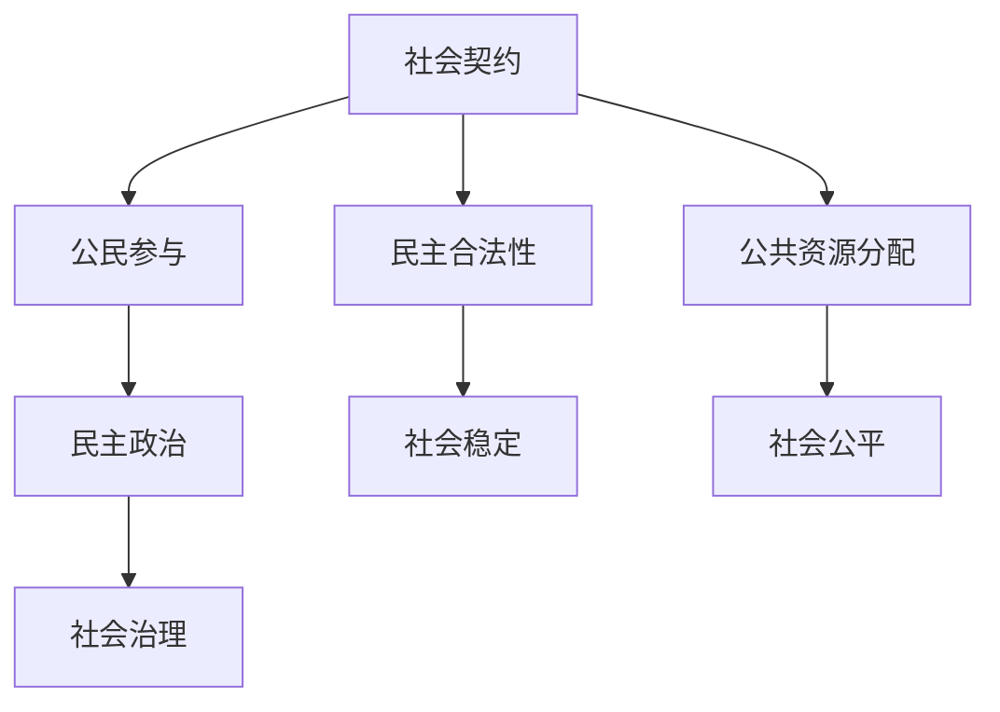

                 

### 文章标题

《公民参与：重塑社会契约的意义》

### 文章关键词

社会契约、公民参与、民主政治、社会治理、数字时代

### 文章摘要

本文旨在探讨公民参与在社会契约重塑中的重要作用。通过对社会契约历史的回顾、公民参与概念的解释以及两者关系的分析，文章将揭示公民参与对现代社会治理的深远影响。同时，文章还将展望数字化时代公民参与的挑战与机遇，为未来社会契约的发展提供理论参考和实践指导。

## 引言

在人类历史的长河中，社会契约始终是一个核心概念。从古希腊的城邦制度到现代民主国家的建立，社会契约理论不断演变，成为理解政治和社会治理的重要理论基础。然而，随着时代的变迁，特别是进入数字化时代，公民参与的形式和方式发生了深刻的变化。这种变化不仅影响了社会契约的内涵，也重塑了社会契约的意义。本文将围绕“公民参与：重塑社会契约的意义”这一主题，逐步分析并探讨这一重要议题。

### 背景介绍

首先，我们需要对社会契约这一核心概念进行背景介绍。社会契约是指个体为了共同利益而自愿达成的协议。从霍布斯到卢梭，再到罗尔斯和诺齐克，不同的社会契约理论家对这一概念有着不同的解释。霍布斯强调社会契约的必要性，认为人类在自然状态下是自私和冲突的，只有通过建立一个强有力的国家才能实现秩序和稳定。卢梭则提出，社会契约是基于人们之间的自愿平等和自由意愿，国家是公共利益的代表。罗尔斯和诺齐克则在正义问题上对社会契约进行了深入探讨，分别提出了正义的两个原则和正义的非竞争性原则。

在这些理论的基础上，社会契约逐渐发展成为现代民主政治的基石。民主政治强调公民的参与和决策权，使得社会契约不仅是理论上的协议，更是实际操作中的实践。然而，在数字化时代，社会契约和公民参与面临着新的挑战和机遇。数字化技术的普及使得信息传播更加迅速和广泛，公民参与的形式更加多样化和灵活。但与此同时，也带来了数据隐私、网络安全等问题，这对社会契约的实践提出了更高的要求。

### 核心概念与联系

为了更好地理解社会契约和公民参与的关系，我们使用Mermaid流程图来展示这两个核心概念之间的联系。

在这个流程图中，我们可以看到社会契约作为基础，通过公民参与实现民主政治，进而影响社会治理和社会公平。这一链条不仅体现了社会契约和公民参与之间的相互关系，也揭示了它们在现代社会中的重要性。

### 公民参与的内涵与形式

接下来，我们深入探讨公民参与的内涵和形式。公民参与是指公民通过各种途径和方式，参与政治、经济、文化和社会事务的过程。这包括但不限于选举、投票、请愿、公民论坛、在线请愿等。传统的公民参与形式主要依赖于面对面的交流和物理场所的活动。而随着数字化技术的发展，公民参与的形式变得更加多样化和灵活。例如，社交媒体使得公民可以随时随地表达自己的意见和诉求，在线请愿和公民论坛则提供了一个虚拟的平台，使得更多的人能够参与到公共事务的讨论和决策中。

#### 传统公民参与

传统公民参与包括以下几种形式：

- **选举和投票**：这是最直接的公民参与方式，通过选举代表和投票表达自己的政治意愿。
- **请愿和示威**：公民通过请愿书、示威游行等形式，向政府表达诉求和不满。
- **公民论坛**：在特定的地点和时间，公民就某一议题进行讨论和辩论。

#### 新兴公民参与

随着数字化技术的发展，新兴公民参与形式应运而生：

- **社交媒体参与**：通过Twitter、Facebook、微信等社交媒体平台，公民可以随时随地表达意见和诉求，形成舆论压力。
- **在线请愿**：通过Change.org、WeSign等平台，公民可以发起和参与在线请愿，实现跨地域、跨时空的集体行动。
- **公民论坛**：虚拟的在线论坛，提供了一个讨论和交流的平台，使得更多人能够参与到公共事务的讨论中。

### 公民参与的价值

公民参与对社会有着重要的价值：

- **公共决策的合法性和民主性**：公民的参与使得公共决策更加合法和民主，增强了决策的透明度和公正性。
- **社会整合和稳定**：公民参与有助于社会整合，促进社会成员之间的相互理解和合作，从而增强社会的稳定性。
- **公民意识和政治素养的提升**：通过参与公共事务，公民能够提高自身的政治意识和政治素养，更好地履行自己的社会责任。

### 社会契约与公民参与的关系

社会契约和公民参与之间的关系是双向的。一方面，社会契约为公民参与提供了法律和制度保障；另一方面，公民参与是实现社会契约的重要途径。具体来说：

- **社会契约对公民参与的要求**：社会契约要求公民积极参与公共事务，履行自己的社会责任，从而维护社会的公共利益。
- **公民参与对社会契约的影响**：公民的积极参与可以促进社会契约的完善和发展，使得社会契约更加符合公众的利益和需求。

通过这样的关系架构，我们可以看到，社会契约和公民参与不仅是相互依赖的，也是相互促进的。只有当公民积极参与社会事务，社会契约才能真正发挥作用；而只有社会契约提供了良好的参与环境，公民才能更好地履行自己的责任。

### 实践案例

为了更具体地理解社会契约和公民参与的关系，我们可以通过一些实践案例来探讨：

- **瑞典的公民议会**：瑞典的公民议会是一个典型的公民参与案例。政府每年邀请一定数量的公民代表，就特定议题进行讨论和决策。这种做法不仅提高了政策的民主性和合法性，也增强了公民对政府的信任。
- **美国的社会运动**：例如“占领华尔街”运动，通过大规模的示威和抗议，公民表达了对社会不公和贫富差距的不满。这种形式的公民参与，虽然有时可能引发社会动荡，但也促使政府和相关机构采取行动，解决社会问题。

这些实践案例表明，公民参与在社会契约的实践中具有重要意义。通过具体的行动和参与，公民不仅能够影响公共决策，也能够推动社会变革。

### 数字化时代的公民参与

在数字化时代，公民参与面临着新的挑战和机遇。数字化技术使得公民参与的形式更加多样化和灵活，但同时也带来了数据隐私、网络安全等问题。以下是一些数字化时代公民参与的特点和挑战：

- **数据隐私**：随着大数据和人工智能技术的发展，公民参与的数据隐私问题日益凸显。如何保护公民的数据隐私，成为数字化时代公民参与的一个重要议题。
- **网络安全**：网络攻击和数据泄露是数字化时代公民参与面临的重大挑战。如何保障公民参与的数据安全，是当前需要解决的问题。
- **技术鸿沟**：数字化时代，技术鸿沟问题仍然存在。如何让更多人能够平等地参与数字化公民参与，需要社会各界的共同努力。

### 公民参与的挑战与机遇

在数字化时代，公民参与面临着一系列挑战和机遇：

- **挑战**：
  - **信息过载**：数字化技术带来了海量的信息，公民在参与时容易受到信息过载的影响，难以准确判断信息的真实性和可靠性。
  - **网络暴力和歧视**：在线公民参与可能引发网络暴力和歧视行为，这对公民的参与意愿和体验造成了负面影响。
  - **技术依赖**：数字化公民参与过度依赖技术平台，可能导致公民对技术的依赖性增强，影响其独立思考和判断能力。

- **机遇**：
  - **提高参与度**：数字化技术可以降低公民参与的门槛，提高参与度，使得更多人能够参与到公共事务的讨论和决策中。
  - **促进民主化**：数字化公民参与有助于推动民主化进程，提高公共决策的透明度和公正性。
  - **创新社会治理**：数字化技术为社会治理提供了新的工具和方法，有助于提升社会治理的效率和效果。

### 公民参与的未来趋势

未来，公民参与可能会呈现以下趋势：

- **更加智能化和个性化**：随着人工智能和大数据技术的发展，公民参与可能会更加智能化和个性化，为公民提供更加定制化的参与体验。
- **跨领域合作**：不同领域之间的公民参与将更加紧密合作，共同解决社会问题。
- **全球化公民参与**：全球化进程使得公民参与不再局限于本国，而是扩展到全球范围，形成全球公民参与网络。

### 结论

公民参与是社会契约的重要组成部分，对于现代社会治理具有重要意义。在数字化时代，公民参与面临着新的挑战和机遇。为了更好地实现公民参与，我们需要不断完善社会契约，提高公民参与度，同时确保数据隐私和安全。只有通过公民的积极参与，社会契约才能真正发挥其应有的作用，推动社会的进步和发展。

## 附录

### 最佳实践 Tips

- **增强参与意识**：通过教育和宣传，提高公民对公共事务的参与意识。
- **简化参与流程**：简化公民参与的操作流程，降低参与门槛。
- **保障数据隐私**：加强数据隐私保护，提高公民对数字化参与的安全感。
- **提供多渠道参与**：提供多样化的参与渠道，满足不同公民的参与需求。

### 小结

本文通过对社会契约、公民参与及其关系的深入探讨，揭示了公民参与在重塑社会契约中的重要作用。在数字化时代，公民参与面临着新的挑战和机遇，需要我们积极探索有效的参与方式和机制。通过加强公民参与，可以提高社会治理的效率和效果，推动社会的可持续发展。

### 注意事项

- **数据安全**：在数字化参与过程中，应高度重视数据安全和隐私保护。
- **公平参与**：确保不同社会群体都能够平等地参与到公共事务中，避免出现参与不公现象。

### 拓展阅读

- **《民主的细节》[美] 弗兰西斯·福山**：该书深入探讨了民主制度的运行机制和挑战。
- **《技术垄断》[美] 爱德华·塔夫脱**：该书分析了数字化时代技术垄断对公民参与的影响。
- **《数字民主》[美] 詹姆斯·斯密斯**：该书探讨了数字化技术如何促进民主进程。

### 作者信息

**作者：** AI天才研究院 / AI Genius Institute & 禅与计算机程序设计艺术 / Zen And The Art of Computer Programming

---

本文通过逻辑清晰的结构和深入的分析，探讨了公民参与在重塑社会契约中的重要作用。从历史背景到现代实践，再到数字化时代的挑战与机遇，文章全面阐述了公民参与的重要性和未来趋势。希望本文能够为读者提供有价值的思考和实践指导，共同推动社会的进步和发展。

