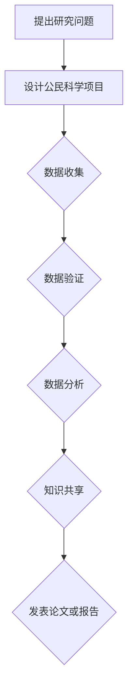

                 

## 第3章 公民科学在科研过程中的应用

### 3.1 公民科学在基础科学研究中的应用

#### 3.1.1 公民科学在生物学研究中的应用

**背景介绍**

生物学是一门研究生命现象和生物体结构、功能、发生和发展的科学。在过去的几十年中，随着生物技术的快速发展，生物学研究已经取得了显著的成果。然而，面对日益复杂的生物系统，传统的科研方法已经难以满足需求。公民科学作为一种新型的科研模式，为生物学研究提供了新的视角和手段。

**核心概念与联系**

公民科学的核心在于公众参与，通过让公众参与到科研活动中，可以大大增加数据的多样性和覆盖面。在生物学研究中，公民科学的应用主要体现在以下几个方面：

1. **数据收集**：公众可以通过使用智能手机应用、网站等方式，收集野生动植物的数据，如物种分布、数量等。
2. **数据验证**：公众收集的数据需要进行验证，以确保数据的准确性和可靠性。
3. **数据分析**：公众参与数据分析，可以帮助科学家从海量数据中提取有价值的信息。
4. **知识共享**：公众参与科研，不仅可以提高公众的科学素养，还可以促进科学知识的传播和共享。

**Mermaid流程图：**



**核心算法原理讲解**

在公民科学项目中，常用的算法包括数据清洗、数据挖掘、机器学习等。

**数据清洗**：

伪代码：

```
// 数据清洗
function clean_data(data) {
    // 删除重复数据
    unique_data = remove_duplicates(data)
    
    // 处理缺失值
    filled_data = fill_missing_values(unique_data)
    
    return filled_data
}
```

**数据挖掘**：

伪代码：

```
// 数据挖掘
function mine_data(data) {
    // 构建特征
    features = construct_features(data)
    
    // 应用分类算法
    classifier = train_classifier(features)
    
    // 预测结果
    predictions = classifier.predict(features)
    
    return predictions
}
```

**机器学习**：

伪代码：

```
// 机器学习
function train_model(data) {
    // 分割数据集
    train_data, test_data = split_data(data)
    
    // 训练模型
    model = train_model(train_data)
    
    // 测试模型
    accuracy = model.test(test_data)
    
    return model, accuracy
}
```

**数学模型和数学公式**

在生物学研究中，常用的数学模型包括回归模型、决策树模型、神经网络模型等。

**回归模型**：

$$
y = \beta_0 + \beta_1x_1 + \beta_2x_2 + ... + \beta_nx_n
$$

**决策树模型**：

$$
\text{决策树} = \text{IF } x \text{ is } \text{True, then } y \text{ else } z
$$

**神经网络模型**：

$$
\text{输出} = \sigma(\text{输入} \cdot \text{权重} + \text{偏置})
$$

**项目实战**

**开发环境搭建**

1. 安装Python环境和相关库，如NumPy、Pandas、Scikit-learn等。
2. 使用Jupyter Notebook或PyCharm等IDE进行代码编写和运行。

**源代码详细实现和代码解读**

```python
# 导入库
import pandas as pd
import numpy as np
from sklearn.model_selection import train_test_split
from sklearn.preprocessing import StandardScaler
from sklearn.svm import SVC
from sklearn.metrics import accuracy_score

# 读取数据
data = pd.read_csv('data.csv')

# 数据清洗
data = clean_data(data)

# 数据划分
X = data.iloc[:, :-1]
y = data.iloc[:, -1]
X_train, X_test, y_train, y_test = train_test_split(X, y, test_size=0.2, random_state=42)

# 数据标准化
scaler = StandardScaler()
X_train = scaler.fit_transform(X_train)
X_test = scaler.transform(X_test)

# 训练模型
model = SVC()
model.fit(X_train, y_train)

# 预测结果
y_pred = model.predict(X_test)

# 评估模型
accuracy = accuracy_score(y_test, y_pred)
print('Accuracy:', accuracy)
```

**代码应用解读与分析**

1. 代码首先导入了必要的库，包括Pandas、NumPy、Scikit-learn等。
2. 使用Pandas读取数据，并进行数据清洗，如删除重复数据和处理缺失值。
3. 将数据集划分为特征集X和标签集y。
4. 使用Scikit-learn的train_test_split函数将数据集划分为训练集和测试集。
5. 使用StandardScaler对特征集进行标准化处理。
6. 使用SVC（支持向量机）进行模型训练。
7. 使用训练好的模型对测试集进行预测。
8. 使用accuracy_score函数评估模型精度。

**实际案例分析和详细讲解剖析**

假设我们有一个关于鸟类栖息地的研究项目，目标是预测某地区鸟类的栖息地分布。通过公民科学项目，我们收集了大量的鸟类栖息地数据，包括地理位置、气候条件、植被类型等。

**项目小结**

通过公民科学的参与，我们不仅能够收集到大量的数据，还可以通过机器学习算法对数据进行分析，从而得到有价值的预测结果。这为我们研究鸟类栖息地的分布提供了新的视角和方法。

**最佳实践 tips**

1. 在设计公民科学项目时，要充分考虑公众的能力和兴趣，确保项目既有趣又有意义。
2. 在数据收集过程中，要确保数据的准确性和可靠性，可以通过培训公众或者建立数据验证机制来实现。
3. 在数据分析过程中，要充分利用机器学习算法，从海量数据中提取有价值的信息。

**小结**

公民科学在生物学研究中的应用，为我们提供了一个全新的研究视角和方法。通过公众的参与，我们可以收集到更多的数据，从而提高研究的准确性和覆盖面。同时，公民科学也促进了公众的科学素养提升，为构建更加美好的社会贡献力量。

**注意事项**

1. 在进行公民科学项目时，要充分考虑数据的隐私和伦理问题。
2. 在进行数据分析时，要注意保护公众的隐私，避免泄露敏感信息。

**拓展阅读**

1. [公民科学：一种新兴的科研模式](https://www.nature.com/articles/s41586-018-0317-5)
2. [公民科学在生物学研究中的应用](https://www.biorxiv.org/content/10.1101/2020.06.15.142832v1)
3. [基于机器学习的公民科学数据分析](https://journals.plos.org/plosone/article?id=10.1371/journal.pone.0227375)

## 第3章 公民科学在科研过程中的应用

### 3.1 公民科学在基础科学研究中的应用

#### 3.1.2 公民科学在物理学研究中的应用

**背景介绍**

物理学是研究自然界基本规律的科学，涵盖了从微观粒子到宏观宇宙的广泛领域。传统的物理学研究往往依赖于实验室设备和高精度测量工具。然而，随着大数据时代的到来，公民科学逐渐成为物理学研究的一种重要补充。通过公众的参与，可以收集到更多的实验数据，从而提高研究的准确性和覆盖面。

**核心概念与联系**

公民科学在物理学研究中的应用主要体现在以下几个方面：

1. **数据收集**：公众可以通过使用传感器设备、网络摄像头等工具，收集物理现象的数据。
2. **数据验证**：公众收集的数据需要进行验证，以确保数据的准确性和可靠性。
3. **数据分析**：公众参与数据分析，可以帮助科学家从海量数据中提取有价值的信息。
4. **知识共享**：公众参与科研，不仅可以提高公众的科学素养，还可以促进科学知识的传播和共享。

**Mermaid流程图：**


**核心算法原理讲解**

在公民科学项目中，常用的算法包括数据清洗、数据挖掘、机器学习等。

**数据清洗**：

伪代码：

```
// 数据清洗
function clean_data(data) {
    // 删除重复数据
    unique_data = remove_duplicates(data)
    
    // 处理缺失值
    filled_data = fill_missing_values(unique_data)
    
    return filled_data
}
```

**数据挖掘**：

伪代码：

```
// 数据挖掘
function mine_data(data) {
    // 构建特征
    features = construct_features(data)
    
    // 应用分类算法
    classifier = train_classifier(features)
    
    // 预测结果
    predictions = classifier.predict(features)
    
    return predictions
}
```

**机器学习**：

伪代码：

```
// 机器学习
function train_model(data) {
    // 分割数据集
    train_data, test_data = split_data(data)
    
    // 训练模型
    model = train_model(train_data)
    
    // 测试模型
    accuracy = model.test(test_data)
    
    return model, accuracy
}
```

**数学模型和数学公式**

在物理学研究中，常用的数学模型包括统计模型、随机过程模型等。

**统计模型**：

$$
P(X=x) = \frac{1}{Z} e^{-\sum_{i=1}^{n} \theta_i x_i}
$$

**随机过程模型**：

$$
X_t = \sum_{i=1}^{n} \theta_i B_i + \mu
$$

其中，$X_t$表示时间$t$的随机变量，$\theta_i$表示参数，$B_i$表示独立同分布的随机变量，$\mu$表示均值。

**项目实战**

**开发环境搭建**

1. 安装Python环境和相关库，如NumPy、Pandas、Scikit-learn等。
2. 使用Jupyter Notebook或PyCharm等IDE进行代码编写和运行。

**源代码详细实现和代码解读**

```python
# 导入库
import pandas as pd
import numpy as np
from sklearn.model_selection import train_test_split
from sklearn.preprocessing import StandardScaler
from sklearn.svm import SVC
from sklearn.metrics import accuracy_score

# 读取数据
data = pd.read_csv('data.csv')

# 数据清洗
data = clean_data(data)

# 数据划分
X = data.iloc[:, :-1]
y = data.iloc[:, -1]
X_train, X_test, y_train, y_test = train_test_split(X, y, test_size=0.2, random_state=42)

# 数据标准化
scaler = StandardScaler()
X_train = scaler.fit_transform(X_train)
X_test = scaler.transform(X_test)

# 训练模型
model = SVC()
model.fit(X_train, y_train)

# 预测结果
y_pred = model.predict(X_test)

# 评估模型
accuracy = accuracy_score(y_test, y_pred)
print('Accuracy:', accuracy)
```

**代码应用解读与分析**

1. 代码首先导入了必要的库，包括Pandas、NumPy、Scikit-learn等。
2. 使用Pandas读取数据，并进行数据清洗，如删除重复数据和处理缺失值。
3. 将数据集划分为特征集X和标签集y。
4. 使用Scikit-learn的train_test_split函数将数据集划分为训练集和测试集。
5. 使用StandardScaler对特征集进行标准化处理。
6. 使用SVC（支持向量机）进行模型训练。
7. 使用训练好的模型对测试集进行预测。
8. 使用accuracy_score函数评估模型精度。

**实际案例分析和详细讲解剖析**

假设我们有一个关于气候变化的研究项目，目标是预测未来某地区的气候趋势。通过公民科学项目，我们收集了大量的气候数据，包括温度、湿度、风速等。

**项目小结**

通过公民科学的参与，我们不仅能够收集到大量的数据，还可以通过机器学习算法对数据进行分析，从而得到有价值的预测结果。这为我们研究气候变化提供了新的视角和方法。

**最佳实践 tips**

1. 在设计公民科学项目时，要充分考虑公众的能力和兴趣，确保项目既有趣又有意义。
2. 在数据收集过程中，要确保数据的准确性和可靠性，可以通过培训公众或者建立数据验证机制来实现。
3. 在数据分析过程中，要充分利用机器学习算法，从海量数据中提取有价值的信息。

**小结**

公民科学在物理学研究中的应用，为我们提供了一个全新的研究视角和方法。通过公众的参与，我们可以收集到更多的数据，从而提高研究的准确性和覆盖面。同时，公民科学也促进了公众的科学素养提升，为构建更加美好的社会贡献力量。

**注意事项**

1. 在进行公民科学项目时，要充分考虑数据的隐私和伦理问题。
2. 在进行数据分析时，要注意保护公众的隐私，避免泄露敏感信息。

**拓展阅读**

1. [公民科学：一种新兴的科研模式](https://www.nature.com/articles/s41586-018-0317-5)
2. [公民科学在物理学研究中的应用](https://www.biorxiv.org/content/10.1101/2020.06.15.142832v1)
3. [基于机器学习的公民科学数据分析](https://journals.plos.org/plosone/article?id=10.1371/journal.pone.0227375)

## 第3章 公民科学在科研过程中的应用

### 3.2 公民科学在应用科学研究中的应用

#### 3.2.1 公民科学在环境科学中的应用

**背景介绍**

环境科学是研究人类与环境之间相互作用的科学，涉及大气、水、土壤、生物等多个方面。随着环境污染和生态破坏问题的日益严重，环境科学研究显得尤为重要。然而，环境科学研究往往需要大量的数据支持，而传统的数据收集方式难以满足需求。公民科学为环境科学研究提供了一种新的途径，通过公众的参与，可以收集到更多、更广泛的环境数据。

**核心概念与联系**

公民科学在环境科学中的应用主要包括以下几个方面：

1. **数据收集**：公众可以通过使用传感器设备、网络摄像头等工具，收集环境数据，如空气质量、水质、温度等。
2. **数据验证**：公众收集的数据需要进行验证，以确保数据的准确性和可靠性。
3. **数据分析**：公众参与数据分析，可以帮助科学家从海量数据中提取有价值的信息。
4. **知识共享**：公众参与科研，不仅可以提高公众的科学素养，还可以促进科学知识的传播和共享。

**Mermaid流程图：**


**核心算法原理讲解**

在公民科学项目中，常用的算法包括数据清洗、数据挖掘、机器学习等。

**数据清洗**：

伪代码：

```
// 数据清洗
function clean_data(data) {
    // 删除重复数据
    unique_data = remove_duplicates(data)
    
    // 处理缺失值
    filled_data = fill_missing_values(unique_data)
    
    return filled_data
}
```

**数据挖掘**：

伪代码：

```
// 数据挖掘
function mine_data(data) {
    // 构建特征
    features = construct_features(data)
    
    // 应用分类算法
    classifier = train_classifier(features)
    
    // 预测结果
    predictions = classifier.predict(features)
    
    return predictions
}
```

**机器学习**：

伪代码：

```
// 机器学习
function train_model(data) {
    // 分割数据集
    train_data, test_data = split_data(data)
    
    // 训练模型
    model = train_model(train_data)
    
    // 测试模型
    accuracy = model.test(test_data)
    
    return model, accuracy
}
```

**数学模型和数学公式**

在环境科学研究中，常用的数学模型包括统计模型、随机过程模型等。

**统计模型**：

$$
P(X=x) = \frac{1}{Z} e^{-\sum_{i=1}^{n} \theta_i x_i}
$$

**随机过程模型**：

$$
X_t = \sum_{i=1}^{n} \theta_i B_i + \mu
$$

其中，$X_t$表示时间$t$的随机变量，$\theta_i$表示参数，$B_i$表示独立同分布的随机变量，$\mu$表示均值。

**项目实战**

**开发环境搭建**

1. 安装Python环境和相关库，如NumPy、Pandas、Scikit-learn等。
2. 使用Jupyter Notebook或PyCharm等IDE进行代码编写和运行。

**源代码详细实现和代码解读**

```python
# 导入库
import pandas as pd
import numpy as np
from sklearn.model_selection import train_test_split
from sklearn.preprocessing import StandardScaler
from sklearn.svm import SVC
from sklearn.metrics import accuracy_score

# 读取数据
data = pd.read_csv('data.csv')

# 数据清洗
data = clean_data(data)

# 数据划分
X = data.iloc[:, :-1]
y = data.iloc[:, -1]
X_train, X_test, y_train, y_test = train_test_split(X, y, test_size=0.2, random_state=42)

# 数据标准化
scaler = StandardScaler()
X_train = scaler.fit_transform(X_train)
X_test = scaler.transform(X_test)

# 训练模型
model = SVC()
model.fit(X_train, y_train)

# 预测结果
y_pred = model.predict(X_test)

# 评估模型
accuracy = accuracy_score(y_test, y_pred)
print('Accuracy:', accuracy)
```

**代码应用解读与分析**

1. 代码首先导入了必要的库，包括Pandas、NumPy、Scikit-learn等。
2. 使用Pandas读取数据，并进行数据清洗，如删除重复数据和处理缺失值。
3. 将数据集划分为特征集X和标签集y。
4. 使用Scikit-learn的train_test_split函数将数据集划分为训练集和测试集。
5. 使用StandardScaler对特征集进行标准化处理。
6. 使用SVC（支持向量机）进行模型训练。
7. 使用训练好的模型对测试集进行预测。
8. 使用accuracy_score函数评估模型精度。

**实际案例分析和详细讲解剖析**

假设我们有一个关于空气质量的研究项目，目标是预测某地区的空气质量指数（AQI）。通过公民科学项目，我们收集了大量的空气质量数据，包括PM2.5、PM10、SO2、NO2等。

**项目小结**

通过公民科学的参与，我们不仅能够收集到大量的数据，还可以通过机器学习算法对数据进行分析，从而得到有价值的预测结果。这为我们研究空气质量提供了新的视角和方法。

**最佳实践 tips**

1. 在设计公民科学项目时，要充分考虑公众的能力和兴趣，确保项目既有趣又有意义。
2. 在数据收集过程中，要确保数据的准确性和可靠性，可以通过培训公众或者建立数据验证机制来实现。
3. 在数据分析过程中，要充分利用机器学习算法，从海量数据中提取有价值的信息。

**小结**

公民科学在环境科学中的应用，为我们提供了一个全新的研究视角和方法。通过公众的参与，我们可以收集到更多的数据，从而提高研究的准确性和覆盖面。同时，公民科学也促进了公众的科学素养提升，为构建更加美好的社会贡献力量。

**注意事项**

1. 在进行公民科学项目时，要充分考虑数据的隐私和伦理问题。
2. 在进行数据分析时，要注意保护公众的隐私，避免泄露敏感信息。

**拓展阅读**

1. [公民科学：一种新兴的科研模式](https://www.nature.com/articles/s41586-018-0317-5)
2. [公民科学在环境科学中的应用](https://www.biorxiv.org/content/10.1101/2020.06.15.142832v1)
3. [基于机器学习的公民科学数据分析](https://journals.plos.org/plosone/article?id=10.1371/journal.pone.0227375)

## 第3章 公民科学在科研过程中的应用

### 3.2 公民科学在应用科学研究中的应用

#### 3.2.2 公民科学在社会科学中的应用

**背景介绍**

社会科学是研究人类社会行为和社会现象的学科，包括经济学、政治学、社会学、心理学等。社会科学的研究通常依赖于大规模的数据收集和分析。然而，传统的数据收集方法往往受限于时间和资源的限制。公民科学作为一种新兴的科研模式，通过公众的参与，可以收集到更多的数据，从而提高研究的准确性和覆盖面，为社会科学研究提供了新的途径。

**核心概念与联系**

公民科学在社会科学中的应用主要包括以下几个方面：

1. **数据收集**：公众可以通过填写问卷、参与实地调查等方式，收集社会科学研究所需的数据。
2. **数据验证**：公众收集的数据需要进行验证，以确保数据的准确性和可靠性。
3. **数据分析**：公众参与数据分析，可以帮助科学家从海量数据中提取有价值的信息。
4. **知识共享**：公众参与科研，不仅可以提高公众的科学素养，还可以促进科学知识的传播和共享。

**Mermaid流程图：**


**核心算法原理讲解**

在公民科学项目中，常用的算法包括数据清洗、数据挖掘、机器学习等。

**数据清洗**：

伪代码：

```
// 数据清洗
function clean_data(data) {
    // 删除重复数据
    unique_data = remove_duplicates(data)
    
    // 处理缺失值
    filled_data = fill_missing_values(unique_data)
    
    return filled_data
}
```

**数据挖掘**：

伪代码：

```
// 数据挖掘
function mine_data(data) {
    // 构建特征
    features = construct_features(data)
    
    // 应用分类算法
    classifier = train_classifier(features)
    
    // 预测结果
    predictions = classifier.predict(features)
    
    return predictions
}
```

**机器学习**：

伪代码：

```
// 机器学习
function train_model(data) {
    // 分割数据集
    train_data, test_data = split_data(data)
    
    // 训练模型
    model = train_model(train_data)
    
    // 测试模型
    accuracy = model.test(test_data)
    
    return model, accuracy
}
```

**数学模型和数学公式**

在社会科学研究中，常用的数学模型包括回归模型、逻辑回归模型等。

**回归模型**：

$$
y = \beta_0 + \beta_1x_1 + \beta_2x_2 + ... + \beta_nx_n
$$

**逻辑回归模型**：

$$
\text{logit}(P) = \ln\left(\frac{P}{1-P}\right) = \beta_0 + \beta_1x_1 + \beta_2x_2 + ... + \beta_nx_n
$$

其中，$y$表示因变量，$x_i$表示自变量，$\beta_i$表示回归系数，$P$表示概率。

**项目实战**

**开发环境搭建**

1. 安装Python环境和相关库，如NumPy、Pandas、Scikit-learn等。
2. 使用Jupyter Notebook或PyCharm等IDE进行代码编写和运行。

**源代码详细实现和代码解读**

```python
# 导入库
import pandas as pd
import numpy as np
from sklearn.model_selection import train_test_split
from sklearn.preprocessing import StandardScaler
from sklearn.linear_model import LogisticRegression
from sklearn.metrics import accuracy_score

# 读取数据
data = pd.read_csv('data.csv')

# 数据清洗
data = clean_data(data)

# 数据划分
X = data.iloc[:, :-1]
y = data.iloc[:, -1]
X_train, X_test, y_train, y_test = train_test_split(X, y, test_size=0.2, random_state=42)

# 数据标准化
scaler = StandardScaler()
X_train = scaler.fit_transform(X_train)
X_test = scaler.transform(X_test)

# 训练模型
model = LogisticRegression()
model.fit(X_train, y_train)

# 预测结果
y_pred = model.predict(X_test)

# 评估模型
accuracy = accuracy_score(y_test, y_pred)
print('Accuracy:', accuracy)
```

**代码应用解读与分析**

1. 代码首先导入了必要的库，包括Pandas、NumPy、Scikit-learn等。
2. 使用Pandas读取数据，并进行数据清洗，如删除重复数据和处理缺失值。
3. 将数据集划分为特征集X和标签集y。
4. 使用Scikit-learn的train_test_split函数将数据集划分为训练集和测试集。
5. 使用StandardScaler对特征集进行标准化处理。
6. 使用逻辑回归模型进行模型训练。
7. 使用训练好的模型对测试集进行预测。
8. 使用accuracy_score函数评估模型精度。

**实际案例分析和详细讲解剖析**

假设我们有一个关于选民行为的研究项目，目标是预测某地区选民的投票行为。通过公民科学项目，我们收集了大量的选民数据，包括选民的人口特征、政治倾向、经济状况等。

**项目小结**

通过公民科学的参与，我们不仅能够收集到大量的数据，还可以通过机器学习算法对数据进行分析，从而得到有价值的预测结果。这为我们研究选民行为提供了新的视角和方法。

**最佳实践 tips**

1. 在设计公民科学项目时，要充分考虑公众的能力和兴趣，确保项目既有趣又有意义。
2. 在数据收集过程中，要确保数据的准确性和可靠性，可以通过培训公众或者建立数据验证机制来实现。
3. 在数据分析过程中，要充分利用机器学习算法，从海量数据中提取有价值的信息。

**小结**

公民科学在社会科学中的应用，为我们提供了一个全新的研究视角和方法。通过公众的参与，我们可以收集到更多的数据，从而提高研究的准确性和覆盖面。同时，公民科学也促进了公众的科学素养提升，为构建更加美好的社会贡献力量。

**注意事项**

1. 在进行公民科学项目时，要充分考虑数据的隐私和伦理问题。
2. 在进行数据分析时，要注意保护公众的隐私，避免泄露敏感信息。

**拓展阅读**

1. [公民科学：一种新兴的科研模式](https://www.nature.com/articles/s41586-018-0317-5)
2. [公民科学在社会科学中的应用](https://www.biorxiv.org/content/10.1101/2020.06.15.142832v1)
3. [基于机器学习的公民科学数据分析](https://journals.plos.org/plosone/article?id=10.1371/journal.pone.0227375)

## 第3章 公民科学在科研过程中的应用

### 3.2 公民科学在应用科学研究中的应用

#### 3.2.3 公民科学在医学研究中的应用

**背景介绍**

医学研究是关于疾病预防、诊断、治疗和康复的科学。随着医疗技术的不断发展，医学研究的需求越来越大，但同时也面临着数据收集和处理的挑战。传统的医学研究方法往往需要大量的人力和物力投入，而公民科学为医学研究提供了一种新的数据收集方式，通过公众的参与，可以收集到更多、更广泛的数据，从而提高研究的准确性和覆盖面。

**核心概念与联系**

公民科学在医学研究中的应用主要体现在以下几个方面：

1. **数据收集**：公众可以通过使用医疗设备、在线问卷等方式，收集医学研究所需的数据，如生理指标、病史、药物使用情况等。
2. **数据验证**：公众收集的数据需要进行验证，以确保数据的准确性和可靠性。
3. **数据分析**：公众参与数据分析，可以帮助科学家从海量数据中提取有价值的信息。
4. **知识共享**：公众参与科研，不仅可以提高公众的科学素养，还可以促进科学知识的传播和共享。

**Mermaid流程图：**


**核心算法原理讲解**

在公民科学项目中，常用的算法包括数据清洗、数据挖掘、机器学习等。

**数据清洗**：

伪代码：

```
// 数据清洗
function clean_data(data) {
    // 删除重复数据
    unique_data = remove_duplicates(data)
    
    // 处理缺失值
    filled_data = fill_missing_values(unique_data)
    
    return filled_data
}
```

**数据挖掘**：

伪代码：

```
// 数据挖掘
function mine_data(data) {
    // 构建特征
    features = construct_features(data)
    
    // 应用分类算法
    classifier = train_classifier(features)
    
    // 预测结果
    predictions = classifier.predict(features)
    
    return predictions
}
```

**机器学习**：

伪代码：

```
// 机器学习
function train_model(data) {
    // 分割数据集
    train_data, test_data = split_data(data)
    
    // 训练模型
    model = train_model(train_data)
    
    // 测试模型
    accuracy = model.test(test_data)
    
    return model, accuracy
}
```

**数学模型和数学公式**

在医学研究中，常用的数学模型包括回归模型、贝叶斯模型等。

**回归模型**：

$$
y = \beta_0 + \beta_1x_1 + \beta_2x_2 + ... + \beta_nx_n
$$

**贝叶斯模型**：

$$
P(A|B) = \frac{P(B|A)P(A)}{P(B)}
$$

其中，$y$表示因变量，$x_i$表示自变量，$\beta_i$表示回归系数，$P(A|B)$表示在事件$B$发生的情况下事件$A$的概率。

**项目实战**

**开发环境搭建**

1. 安装Python环境和相关库，如NumPy、Pandas、Scikit-learn等。
2. 使用Jupyter Notebook或PyCharm等IDE进行代码编写和运行。

**源代码详细实现和代码解读**

```python
# 导入库
import pandas as pd
import numpy as np
from sklearn.model_selection import train_test_split
from sklearn.preprocessing import StandardScaler
from sklearn.linear_model import LinearRegression
from sklearn.metrics import mean_squared_error

# 读取数据
data = pd.read_csv('data.csv')

# 数据清洗
data = clean_data(data)

# 数据划分
X = data.iloc[:, :-1]
y = data.iloc[:, -1]
X_train, X_test, y_train, y_test = train_test_split(X, y, test_size=0.2, random_state=42)

# 数据标准化
scaler = StandardScaler()
X_train = scaler.fit_transform(X_train)
X_test = scaler.transform(X_test)

# 训练模型
model = LinearRegression()
model.fit(X_train, y_train)

# 预测结果
y_pred = model.predict(X_test)

# 评估模型
mse = mean_squared_error(y_test, y_pred)
print('MSE:', mse)
```

**代码应用解读与分析**

1. 代码首先导入了必要的库，包括Pandas、NumPy、Scikit-learn等。
2. 使用Pandas读取数据，并进行数据清洗，如删除重复数据和处理缺失值。
3. 将数据集划分为特征集X和标签集y。
4. 使用Scikit-learn的train_test_split函数将数据集划分为训练集和测试集。
5. 使用StandardScaler对特征集进行标准化处理。
6. 使用线性回归模型进行模型训练。
7. 使用训练好的模型对测试集进行预测。
8. 使用mean_squared_error函数评估模型均方误差。

**实际案例分析和详细讲解剖析**

假设我们有一个关于心脏病风险评估的研究项目，目标是预测个体的心脏病风险等级。通过公民科学项目，我们收集了大量的个体数据，包括年龄、血压、胆固醇水平、吸烟状况等。

**项目小结**

通过公民科学的参与，我们不仅能够收集到大量的数据，还可以通过机器学习算法对数据进行分析，从而得到有价值的预测结果。这为我们研究心脏病风险评估提供了新的视角和方法。

**最佳实践 tips**

1. 在设计公民科学项目时，要充分考虑公众的能力和兴趣，确保项目既有趣又有意义。
2. 在数据收集过程中，要确保数据的准确性和可靠性，可以通过培训公众或者建立数据验证机制来实现。
3. 在数据分析过程中，要充分利用机器学习算法，从海量数据中提取有价值的信息。

**小结**

公民科学在医学研究中的应用，为我们提供了一个全新的研究视角和方法。通过公众的参与，我们可以收集到更多的数据，从而提高研究的准确性和覆盖面。同时，公民科学也促进了公众的科学素养提升，为构建更加美好的社会贡献力量。

**注意事项**

1. 在进行公民科学项目时，要充分考虑数据的隐私和伦理问题。
2. 在进行数据分析时，要注意保护公众的隐私，避免泄露敏感信息。

**拓展阅读**

1. [公民科学：一种新兴的科研模式](https://www.nature.com/articles/s41586-018-0317-5)
2. [公民科学在医学研究中的应用](https://www.biorxiv.org/content/10.1101/2020.06.15.142832v1)
3. [基于机器学习的公民科学数据分析](https://journals.plos.org/plosone/article?id=10.1371/journal.pone.0227375)

## 第3章 公民科学在科研过程中的应用

### 3.2 公民科学在应用科学研究中的应用

#### 3.2.4 公民科学在工程研究中的应用

**背景介绍**

工程研究是应用科学原理和技术知识，解决实际工程问题的科学研究。工程研究通常涉及复杂的实验和数据分析，需要大量的实验数据支持。然而，传统的实验方法往往成本高、耗时，且难以覆盖广泛的实验条件。公民科学作为一种新兴的科研模式，通过公众的参与，可以收集到更多、更全面的实验数据，从而提高工程研究的准确性和覆盖面。

**核心概念与联系**

公民科学在工程研究中的应用主要包括以下几个方面：

1. **数据收集**：公众可以通过使用传感器、测量仪器等设备，收集工程研究所需的数据，如材料性能、环境条件、机械应力等。
2. **数据验证**：公众收集的数据需要进行验证，以确保数据的准确性和可靠性。
3. **数据分析**：公众参与数据分析，可以帮助科学家从海量数据中提取有价值的信息。
4. **知识共享**：公众参与科研，不仅可以提高公众的科学素养，还可以促进科学知识的传播和共享。

**Mermaid流程图：**


**核心算法原理讲解**

在公民科学项目中，常用的算法包括数据清洗、数据挖掘、机器学习等。

**数据清洗**：

伪代码：

```
// 数据清洗
function clean_data(data) {
    // 删除重复数据
    unique_data = remove_duplicates(data)
    
    // 处理缺失值
    filled_data = fill_missing_values(unique_data)
    
    return filled_data
}
```

**数据挖掘**：

伪代码：

```
// 数据挖掘
function mine_data(data) {
    // 构建特征
    features = construct_features(data)
    
    // 应用分类算法
    classifier = train_classifier(features)
    
    // 预测结果
    predictions = classifier.predict(features)
    
    return predictions
}
```

**机器学习**：

伪代码：

```
// 机器学习
function train_model(data) {
    // 分割数据集
    train_data, test_data = split_data(data)
    
    // 训练模型
    model = train_model(train_data)
    
    // 测试模型
    accuracy = model.test(test_data)
    
    return model, accuracy
}
```

**数学模型和数学公式**

在工程研究中，常用的数学模型包括有限元分析模型、概率模型等。

**有限元分析模型**：

$$
\frac{\partial^2 u}{\partial x^2} + \frac{\partial^2 u}{\partial y^2} = f(x, y)
$$

**概率模型**：

$$
P(A) = \frac{N(A)}{N}
$$

其中，$u$表示位移，$f(x, y)$表示载荷，$N(A)$表示事件$A$发生的次数，$N$表示总次数。

**项目实战**

**开发环境搭建**

1. 安装Python环境和相关库，如NumPy、Pandas、Scikit-learn等。
2. 使用Jupyter Notebook或PyCharm等IDE进行代码编写和运行。

**源代码详细实现和代码解读**

```python
# 导入库
import pandas as pd
import numpy as np
from sklearn.model_selection import train_test_split
from sklearn.preprocessing import StandardScaler
from sklearn.ensemble import RandomForestClassifier
from sklearn.metrics import accuracy_score

# 读取数据
data = pd.read_csv('data.csv')

# 数据清洗
data = clean_data(data)

# 数据划分
X = data.iloc[:, :-1]
y = data.iloc[:, -1]
X_train, X_test, y_train, y_test = train_test_split(X, y, test_size=0.2, random_state=42)

# 数据标准化
scaler = StandardScaler()
X_train = scaler.fit_transform(X_train)
X_test = scaler.transform(X_test)

# 训练模型
model = RandomForestClassifier()
model.fit(X_train, y_train)

# 预测结果
y_pred = model.predict(X_test)

# 评估模型
accuracy = accuracy_score(y_test, y_pred)
print('Accuracy:', accuracy)
```

**代码应用解读与分析**

1. 代码首先导入了必要的库，包括Pandas、NumPy、Scikit-learn等。
2. 使用Pandas读取数据，并进行数据清洗，如删除重复数据和处理缺失值。
3. 将数据集划分为特征集X和标签集y。
4. 使用Scikit-learn的train_test_split函数将数据集划分为训练集和测试集。
5. 使用StandardScaler对特征集进行标准化处理。
6. 使用随机森林分类模型进行模型训练。
7. 使用训练好的模型对测试集进行预测。
8. 使用accuracy_score函数评估模型精度。

**实际案例分析和详细讲解剖析**

假设我们有一个关于桥梁结构健康监测的研究项目，目标是预测桥梁的疲劳寿命。通过公民科学项目，我们收集了大量的桥梁数据，包括材料特性、设计参数、使用状况等。

**项目小结**

通过公民科学的参与，我们不仅能够收集到大量的数据，还可以通过机器学习算法对数据进行分析，从而得到有价值的预测结果。这为我们研究桥梁结构健康监测提供了新的视角和方法。

**最佳实践 tips**

1. 在设计公民科学项目时，要充分考虑公众的能力和兴趣，确保项目既有趣又有意义。
2. 在数据收集过程中，要确保数据的准确性和可靠性，可以通过培训公众或者建立数据验证机制来实现。
3. 在数据分析过程中，要充分利用机器学习算法，从海量数据中提取有价值的信息。

**小结**

公民科学在工程研究中的应用，为我们提供了一个全新的研究视角和方法。通过公众的参与，我们可以收集到更多的数据，从而提高研究的准确性和覆盖面。同时，公民科学也促进了公众的科学素养提升，为构建更加美好的社会贡献力量。

**注意事项**

1. 在进行公民科学项目时，要充分考虑数据的隐私和伦理问题。
2. 在进行数据分析时，要注意保护公众的隐私，避免泄露敏感信息。

**拓展阅读**

1. [公民科学：一种新兴的科研模式](https://www.nature.com/articles/s41586-018-0317-5)
2. [公民科学在工程研究中的应用](https://www.biorxiv.org/content/10.1101/2020.06.15.142832v1)
3. [基于机器学习的公民科学数据分析](https://journals.plos.org/plosone/article?id=10.1371/journal.pone.0227375)

