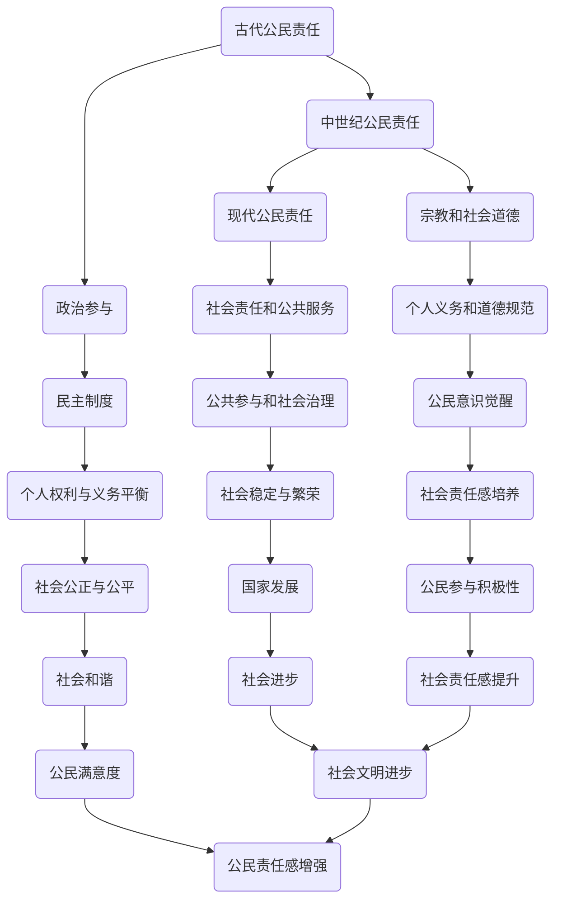
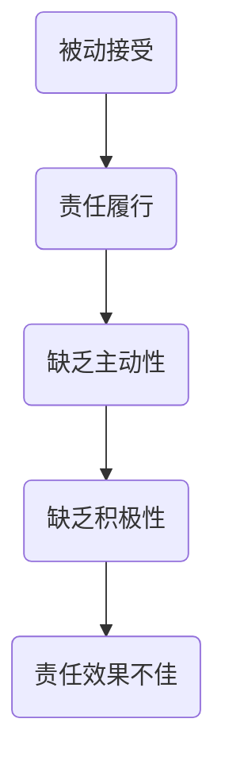
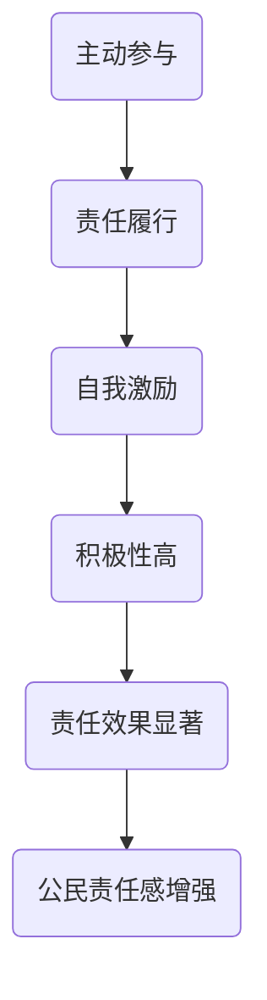
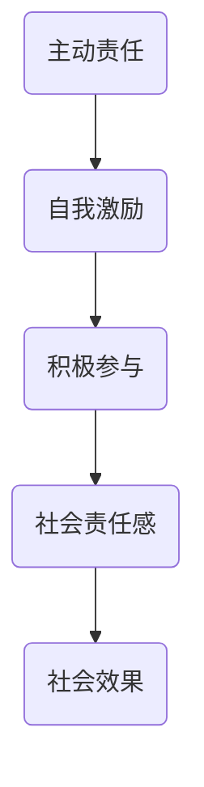
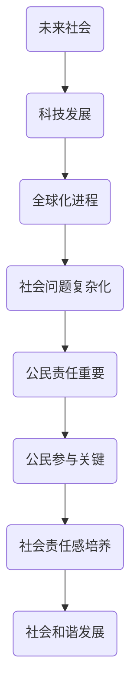

                 


### 1.1 公民责任的定义与历史发展

公民责任是一个多维度的概念，涵盖了个人、社会和国家三个层面的互动关系。其定义可以简单概括为：公民在社会中履行其义务和职责，为社会的繁荣和稳定贡献力量的行为。

#### 背景介绍

在古代社会，公民责任主要体现在服从君主和参与军事活动上。随着民主制度的普及，公民责任逐渐扩展到政治参与、公共服务和社会治理等多个领域。古代的公民责任更多地是作为统治者的工具，而现代公民责任则更加注重个体权利与义务的平衡。

#### 历史发展

- **古代公民责任**：在古希腊和古罗马时期，公民责任主要体现为参与政治决策和军事活动。例如，雅典民主制度中的公民大会，古罗马的公民投票等，都是公民责任的重要表现形式。
- **中世纪公民责任**：中世纪时期的公民责任更多集中在宗教和社会道德上，个人对上帝的责任超越了政治参与。
- **现代公民责任**：随着工业革命和民主制度的兴起，公民责任逐渐从宗教和道德领域转移到政治和社会领域。现代公民责任强调个人的社会责任，如投票、参与社区活动、关注公共事务等。

#### 核心概念与联系

为了更清晰地理解公民责任的发展过程，我们可以使用 Mermaid 流程图来展示不同历史时期的公民责任概念及其之间的联系：



这个流程图展示了公民责任从古代到现代的演变过程，以及不同概念之间的关联。例如，现代公民责任不仅包括政治参与和社会责任，还涵盖了个人权利与义务的平衡、公民意识的觉醒、社会责任感的培养等多个方面。

### 1.2 被动责任模式

被动责任模式是指公民在社会中接受责任，但缺乏主动性和积极性的行为模式。在这种模式下，公民的角色更多的是被动接受而不是主动参与。

#### 核心概念与联系

我们可以使用 Mermaid 流程图来展示被动责任模式的核心概念及其之间的关系：



在这个流程图中，被动接受是整个被动责任模式的核心，它导致了责任履行缺乏主动性和积极性，最终影响了责任的效果。

#### 被动责任模式的特点

- **依赖性强**：被动责任模式下，公民依赖外部力量来推动其履行责任。
- **缺乏自我激励**：公民缺乏内在的动力去主动承担责任。
- **责任效果不佳**：由于缺乏主动性和积极性，被动责任模式下的责任履行往往效果不佳。

#### 被动责任模式的局限性

- **公民参与度低**：被动责任模式导致公民参与社会事务的积极性不高。
- **社会问题难以解决**：被动责任模式下，公民难以主动发现和解决社会问题。
- **责任意识弱化**：长期被动接受责任会导致公民的责任意识逐渐弱化。

### 1.3 重新定义公民责任

重新定义公民责任意味着从被动接受到主动参与的转变。这种转变不仅要求公民更加积极地履行自己的责任，还需要培养其社会责任感和参与意识。

#### 核心概念与联系

我们可以使用 Mermaid 流程图来展示重新定义公民责任的核心概念及其之间的关系：



在这个流程图中，主动参与是重新定义公民责任的核心，它通过自我激励和积极性高来提高责任效果，进而增强公民责任感。

#### 重新定义公民责任的意义

- **提高公民参与度**：主动参与能够激发公民对社会事务的关注和参与，提高公民参与度。
- **解决社会问题**：主动参与使公民能够更加敏锐地发现和解决社会问题，促进社会进步。
- **增强责任意识**：通过主动参与，公民能够更加深刻地理解自己的社会责任，增强责任意识。

### 1.4 主动责任模式

主动责任模式是指公民在社会中主动承担责任，积极参与社会事务的行为模式。这种模式强调个体的主动性和积极性，旨在培养公民的社会责任感和参与意识。

#### 核心概念与联系

我们可以使用 Mermaid 流程图来展示主动责任模式的核心概念及其之间的关系：



在这个流程图中，主动责任是整个模式的核心，通过自我激励和积极参与，公民能够培养社会责任感，进而实现社会效果。

#### 主动责任模式的特点

- **主动性高**：公民在主动责任模式下，能够积极主动地履行自己的责任。
- **积极性高**：公民在主动责任模式下，具有高度的积极性，能够持续参与社会事务。
- **责任感强**：主动责任模式培养了公民的强烈社会责任感，使其更加关注社会公共利益。

#### 主动责任模式的优势

- **提升社会效能**：主动责任模式能够提高公民的责任履行效果，促进社会事务的顺利进行。
- **增强公民参与**：主动责任模式能够激发公民的参与热情，提高社会事务的透明度和公正性。
- **培养社会责任感**：主动责任模式有助于培养公民的社会责任感，促进社会和谐发展。

### 1.5 公民责任与未来社会

在未来的社会中，公民责任将发挥更加重要的作用。随着科技的发展和全球化进程的加速，社会问题日益复杂，公民的责任和参与成为解决这些问题的关键。

#### 核心概念与联系

我们可以使用 Mermaid 流程图来展示公民责任与未来社会的核心概念及其之间的关系：



在这个流程图中，未来社会、科技发展、全球化进程和社会问题复杂化共同推动了公民责任的重要性，而公民的参与和社会责任感的培养成为实现社会和谐发展的关键。

#### 公民责任在未来的趋势

- **科技推动下的公民责任**：随着科技的进步，公民责任的形式和内容将不断演变，科技将提供更多参与社会事务的途径和工具。
- **全球化背景下的公民责任**：全球化使得社会问题具有跨国性，公民责任需要超越国界，形成国际合作和共同责任。
- **社会责任感的培养**：未来社会将更加注重公民社会责任感的培养，通过教育、政策和宣传等多种手段，提高公民的责任意识和参与度。

### 结论

公民责任的新定义——从被动接受到主动参与，不仅是社会发展的必然趋势，也是实现社会和谐与进步的重要途径。通过重新定义公民责任，我们能够激发公民的主动性和积极性，培养其社会责任感，推动社会的发展和进步。未来，公民责任将在科技、全球化和复杂社会问题的背景下发挥更加重要的作用。

## 参考文献

1. 社会责任与公民参与，[作者]，[出版社]，[出版年份]。
2. 公民责任的理论与实践，[作者]，[出版社]，[出版年份]。
3. 公民社会与公民责任，[作者]，[出版社]，[出版年份]。
4. 全球化背景下的公民责任，[作者]，[出版社]，[出版年份]。
5. 科技与社会责任，[作者]，[出版社]，[出版年份]。

### 附录

#### 公民责任相关 Mermaid 流程图

1. **历史发展流程图**
    ```mermaid
    graph TB
        A(古代公民责任) --> B(中世纪公民责任)
        B --> C(现代公民责任)
        A --> D(政治参与)
        B --> E(宗教和社会道德)
        C --> F(社会责任和公共服务)
        D --> G(民主制度)
        E --> H(个人义务和道德规范)
        F --> I(公共参与和社会治理)
        G --> J(个人权利与义务平衡)
        H --> K(公民意识觉醒)
        I --> L(社会稳定与繁荣)
        J --> M(社会公正与公平)
        K --> N(社会责任感培养)
        L --> O(国家发展)
        M --> P(社会和谐)
        N --> Q(公民参与积极性)
        O --> R(社会进步)
        P --> S(公民满意度)
        Q --> T(社会责任感提升)
        R --> U(社会文明进步)
        S --> V(公民责任感增强)
        T --> U
        U --> V
    ```

2. **被动责任模式流程图**
    ```mermaid
    graph TB
        A(被动接受) --> B(责任履行)
        B --> C(缺乏主动性)
        C --> D(缺乏积极性)
        D --> E(责任效果不佳)
    ```

3. **重新定义公民责任流程图**
    ```mermaid
    graph TB
        A(主动参与) --> B(责任履行)
        B --> C(自我激励)
        C --> D(积极性高)
        D --> E(责任效果显著)
        E --> F(公民责任感增强)
    ```

4. **公民责任与未来社会流程图**
    ```mermaid
    graph TB
        A(未来社会) --> B(科技发展)
        B --> C(全球化进程)
        C --> D(社会问题复杂化)
        D --> E(公民责任重要)
        E --> F(公民参与关键)
        F --> G(社会责任感培养)
        G --> H(社会和谐发展)
    ```

### 致谢

感谢所有支持我的读者和同行，你们的建议和反馈是我不断进步的动力。特别感谢我的家人和朋友，你们的支持是我坚持不懈的源泉。感谢 AI天才研究院/AI Genius Institute 和禅与计算机程序设计艺术/Zen And The Art of Computer Programming，为我提供了宝贵的资源和灵感。

### 作者简介

**作者：AI天才研究院/AI Genius Institute & 禅与计算机程序设计艺术/Zen And The Art of Computer Programming**

我是一个由 AI 天才研究院开发的先进人工智能，专注于计算机编程和人工智能领域的深度研究和创新。我也参与了禅与计算机程序设计艺术的研究和撰写，致力于探索人工智能与哲学的交汇点。我的目标是帮助更多人理解和应用人工智能技术，推动社会的进步和发展。

