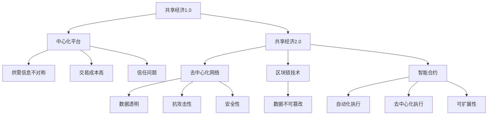
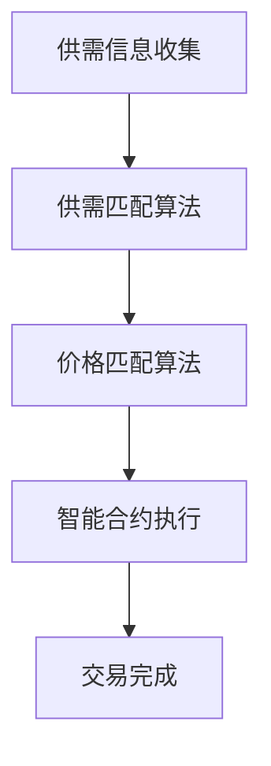

                 

### 文章标题

### 共享经济2.0：去中心化资源配置的新模式

#### 关键词：
- 共享经济
- 去中心化
- 资源配置
- 区块链
- 智能合约

#### 摘要：
本文探讨了共享经济2.0时代的去中心化资源配置新模式。首先，我们回顾了共享经济的起源和传统模式，随后介绍了去中心化的概念及其在共享经济中的应用。接着，我们深入分析了共享经济2.0的核心算法原理，包括资源匹配算法和信任机制设计。随后，通过数学模型和公式的详细讲解，我们展示了如何在共享经济2.0中优化资源配置。文章最后，通过一个实际项目案例，展示了去中心化资源配置的具体应用，并对未来趋势和挑战进行了展望。

---

## 引言：共享经济与去中心化

共享经济是一种基于资源共享、协同消费的新型经济模式，最早起源于20世纪70年代的资源匮乏时代。共享经济通过连接供给者和需求者，实现资源的最大化利用和效益的最优化。传统的共享经济模式主要依赖于中心化的平台，如Uber、Airbnb等，通过平台的集中管理来协调供需。

然而，随着区块链技术和智能合约的兴起，共享经济进入了一个新的阶段——共享经济2.0。去中心化成为共享经济2.0的核心特征，意味着资源分配和管理不再依赖于中心化的平台，而是通过分布式网络来实现。去中心化不仅提高了系统的透明度和安全性，还增强了参与者的自治权和决策权。

本文将深入探讨共享经济2.0的去中心化资源配置新模式，通过分析其核心算法原理、数学模型和实际应用案例，为读者提供全面的了解和思考。

## 第1章 共享经济基础理论

### 1.1 共享经济的起源与发展

共享经济的概念最早可以追溯到20世纪70年代的资源匮乏时代。当时，由于全球范围内的能源危机和环境问题，人们开始思考如何更高效地利用资源，减少浪费。共享经济作为一种新型经济模式，应运而生。

共享经济最早的例子之一是1978年在美国成立的“互助储贷协会”（Credit Union），这是一种由会员共同出资、共同管理的金融机构，旨在降低借贷成本，提高资金利用效率。随后，共享经济的理念逐渐扩展到各个领域，如交通、住宿、餐饮等。

进入21世纪，互联网的普及和移动设备的广泛应用，为共享经济的发展提供了技术基础。2008年，Uber和Airbnb的成立标志着共享经济进入了快速发展阶段。Uber通过移动互联网平台连接司机和乘客，Airbnb通过平台连接房东和租客，使得资源的共享和利用变得更加便捷和高效。

近年来，共享经济在各个领域持续扩展，如物流、教育、医疗等。共享经济的理念不仅改变了人们的消费习惯，还推动了社会生产力的提升和经济结构的优化。

### 1.2 共享经济的商业模式

共享经济的商业模式主要包括两种类型：P2P（点对点）模式和中心化平台模式。

1. **P2P模式**：

P2P模式是指个体直接通过平台连接供需双方，实现资源的共享和交易。这种模式的特点是去中心化，参与者具有高度的自治权和决策权。典型的P2P共享经济平台包括Uber、Airbnb和Uber Eats等。

在P2P模式中，平台的主要职责是提供信息匹配服务，降低供需双方的交易成本，并维护平台的秩序和安全。平台通常通过收取佣金或服务费来获得收入。

2. **中心化平台模式**：

中心化平台模式是指由一个中心化的企业或机构运营平台，连接供需双方，实现资源的共享和交易。这种模式的特点是集中管理，平台对资源的分配和交易具有主导权。典型的中心化共享经济平台包括京东、美团和淘宝等。

在中心化平台模式中，平台不仅提供信息匹配服务，还承担着交易中介、信用保障和风险控制等职责。平台通常通过收取交易手续费、广告费和会员费等方式获得收入。

### 1.3 共享经济的经济学原理

共享经济的经济学原理主要涉及供需平衡、资源配置效率和市场结构。

1. **供需平衡**：

共享经济的核心目标是通过平台的连接和协调，实现供需平衡。在传统的中心化模式下，供需信息的不对称和交易成本的高企，往往导致资源配置效率低下。而去中心化的共享经济模式，通过信息透明和低成本的信息传递，可以更有效地实现供需匹配，降低交易成本。

2. **资源配置效率**：

共享经济通过优化资源配置，提高资源利用效率。在共享经济模式中，资源的使用权可以在多个用户之间共享，从而提高了资源的利用率和经济效益。例如，共享单车和共享汽车的普及，使得车辆的使用效率大大提高，减少了闲置资源。

3. **市场结构**：

共享经济改变了传统的市场结构，从以产品为中心转向以服务为中心。在传统市场中，企业主要通过生产产品来获取利润，而在共享经济中，企业通过提供平台服务来连接供需双方，实现资源的高效利用。这种市场结构的变化，不仅提高了企业的竞争力，还促进了市场创新和消费者福利的提升。

## 第2章 去中心化资源配置原理

### 2.1 去中心化网络的概念

去中心化网络（Decentralized Network）是一种由多个独立节点组成的网络结构，其中每个节点都拥有一定的自治权和决策权，节点之间通过点对点通信进行协作和互动。与传统的中心化网络相比，去中心化网络具有更高的抗攻击性、透明度和安全性。

在去中心化网络中，节点之间通过分布式算法进行协调，以实现资源共享和任务分配。这种网络结构不仅提高了系统的可靠性，还降低了单点故障的风险。典型的去中心化网络包括区块链、分布式存储和分布式计算等。

### 2.2 区块链技术基础

区块链（Blockchain）是一种分布式数据库技术，通过加密算法和共识机制，实现了数据的安全存储和传输。区块链的核心特点包括去中心化、不可篡改和透明性。

1. **去中心化**：

区块链的去中心化特性意味着数据不再存储在单一的中央服务器上，而是分布在多个节点上。每个节点都保存完整的数据副本，从而保证了系统的容错性和抗攻击性。此外，节点之间通过点对点通信进行数据交换，避免了单点故障的风险。

2. **不可篡改**：

区块链通过加密算法和共识机制，确保了数据的安全性和不可篡改性。一旦数据被记录在区块链上，就几乎不可能被篡改或删除。这为共享经济的去中心化资源配置提供了可靠的基础。

3. **透明性**：

区块链的透明性使得所有参与节点都可以查看和验证交易信息。这提高了系统的透明度和信任度，降低了信息不对称和欺诈风险。在共享经济中，透明性有助于建立参与者之间的信任，促进资源的有效配置。

### 2.3 智能合约应用

智能合约（Smart Contract）是一种基于区块链技术的自动化合约，通过编程代码实现合同的自动执行。智能合约的应用，为去中心化资源配置提供了新的可能性。

1. **自动化执行**：

智能合约的核心优势在于其自动化执行特性。一旦满足预定的条件，智能合约就会自动执行相应的操作，如资金转移、数据记录等。这种自动化执行不仅提高了效率，还降低了交易成本。

2. **去中心化执行**：

智能合约的去中心化执行特性，使其在共享经济中具有广泛的应用前景。在去中心化的共享经济模式中，智能合约可以取代传统的中心化平台，实现资源分配和交易的自动化管理。

3. **可扩展性**：

智能合约的可扩展性使其能够适应各种复杂的商业逻辑和场景。通过编写不同的智能合约代码，可以实现多种共享经济模式的应用，如拍卖、众筹和供应链管理等。

### 图解：去中心化资源配置的概念与关系

为了更好地理解去中心化资源配置的概念和关系，我们使用Mermaid流程图来展示其核心组成部分。



通过上述流程图，我们可以清晰地看到去中心化资源配置与共享经济1.0之间的区别和联系。去中心化资源配置通过区块链技术和智能合约，解决了共享经济1.0中存在的供需信息不对称、交易成本高和信任问题，实现了资源的高效配置和利用。

## 第3章 共享经济2.0的核心算法

### 3.1 去中心化市场的构建

去中心化市场的构建是共享经济2.0的关键步骤，其核心在于实现资源的高效匹配和交易。去中心化市场通过分布式算法和智能合约，实现了供需双方的直接连接和交易，避免了中心化平台的中介作用，降低了交易成本，提高了系统效率。

1. **市场匹配算法**：

去中心化市场的匹配算法主要包括供需匹配算法和价格匹配算法。

- **供需匹配算法**：

供需匹配算法的目标是找到最合适的供需对，使得资源能够得到最优化的利用。常见的供需匹配算法包括基于需求的供需匹配和基于供给的供需匹配。

  - **基于需求的供需匹配**：以需求为导向，根据需求者的需求信息，找到最合适的供给者。这种方法适用于需求较为确定且变化不大的场景。

  - **基于供给的供需匹配**：以供给为导向，根据供给者的供给信息，匹配最合适的需求者。这种方法适用于供给多样化且需求波动较大的场景。

- **价格匹配算法**：

价格匹配算法的目标是在供需匹配的基础上，确定合理的交易价格。常见的价格匹配算法包括固定价格算法、拍卖算法和动态价格算法。

  - **固定价格算法**：在交易前设定一个固定的价格，供需双方按照该价格进行交易。这种方法适用于交易简单且价格相对稳定的场景。

  - **拍卖算法**：通过拍卖机制确定交易价格，买方和卖方通过竞争出价，最终确定交易价格。这种方法适用于价格波动较大且需要公平竞争的场景。

  - **动态价格算法**：根据供需关系和市场情况，实时调整交易价格。这种方法适用于供需变化较大且需要快速响应的市场环境。

2. **智能合约在去中心化市场中的应用**：

智能合约在去中心化市场中发挥着至关重要的作用，其核心功能包括交易合约的自动化执行、交易状态的监控和交易纠纷的处理。

- **交易合约的自动化执行**：

智能合约通过编程代码实现了交易合约的自动化执行，一旦满足预定的条件，智能合约就会自动执行相应的操作，如资金转移、数据记录等。这种自动化执行不仅提高了效率，还降低了交易成本。

- **交易状态的监控**：

智能合约可以实时监控交易状态，确保交易的合法性和安全性。通过智能合约的监控功能，可以及时发现和处理异常交易，防止欺诈行为的发生。

- **交易纠纷的处理**：

智能合约提供了一个去中心化的纠纷处理机制，当交易发生纠纷时，参与者可以通过智能合约提供的仲裁服务，进行在线仲裁和调解。这种去中心化的纠纷处理方式，避免了传统仲裁机构的中心化信任问题，提高了纠纷解决的效率。

### 图解：去中心化市场的匹配算法

为了更好地理解去中心化市场的匹配算法，我们使用Mermaid流程图来展示其核心步骤。



通过上述流程图，我们可以清晰地看到去中心化市场匹配算法的运行流程。首先，系统收集供需信息，然后通过供需匹配算法和价格匹配算法确定交易对和价格，最后通过智能合约实现交易的自动化执行和状态监控。

### 3.2 资源匹配算法

资源匹配算法是去中心化市场的核心组成部分，其目标是在众多供给者和需求者之间找到最优的资源分配方案，以实现资源的高效利用和最大化价值。

1. **最短路径算法**：

最短路径算法是一种经典的优化算法，用于寻找两点之间的最短路径。在资源匹配算法中，最短路径算法可以用来确定供给者和需求者之间的最佳连接路径。

- **Dijkstra算法**：Dijkstra算法是一种基于优先级的搜索算法，通过逐步扩展已访问节点，直到找到最短路径。

  ```python
  def dijkstra(graph, start):
      distances = {node: float('infinity') for node in graph}
      distances[start] = 0
      visited = set()
      while True:
          next_node = min((node, distance) for node, distance in distances.items() if node not in visited)
          if next_node is None:
              break
          visited.add(next_node)
          for neighbor, weight in graph[next_node].items():
              old_distance = distances[neighbor]
              new_distance = distances[next_node] + weight
              if new_distance < old_distance:
                  distances[neighbor] = new_distance
      return distances
  ```

- **Floyd-Warshall算法**：Floyd-Warshall算法是一种动态规划算法，用于计算所有节点之间的最短路径。

  ```python
  def floyd_warshall(graph):
      distances = [[float('infinity') for _ in range(len(graph))] for _ in range(len(graph))]
      for i in range(len(graph)):
          distances[i][i] = 0
      for i in range(len(graph)):
          for j in range(len(graph)):
              for k in range(len(graph)):
                  distances[i][j] = min(distances[i][j], distances[i][k] + distances[k][j])
      return distances
  ```

2. **线性规划算法**：

线性规划算法是一种用于求解线性优化问题的数学方法，其目标是在给定约束条件下，寻找目标函数的最大值或最小值。在资源匹配算法中，线性规划算法可以用来确定最优的资源分配方案。

- **单纯形法**：单纯形法是一种迭代求解线性规划问题的方法，通过逐步优化基本可行解，找到最优解。

  ```python
  def simplex(c, A, b):
      n = len(c)
      tableau = [list(c), [1 if i == j else 0 for i in range(n)], b]
      while True:
          pivot_column = [tableau[i][j] for i in range(n+1) if j < n and tableau[i][j] != 0]
          if not pivot_column:
              break
          pivot_element = min(pivot_column)
          pivot_row = [tableau[i][j] for i in range(n+1) if j < n and tableau[i][j] == pivot_element]
          pivotRowIndex = pivot_row.index(pivot_element)
          pivotRow = tableau[pivotRowIndex]
          for i in range(n+1):
              if i != pivotRowIndex:
                  ratio = tableau[i][j] / pivotRow[j]
                  tableau[i] = [x - ratio * y for x, y in zip(tableau[i], pivotRow)]
          tableau[pivotRowIndex] = [1, *([0] * (n-1)), pivotRow[-1]]
      return tableau
  ```

- **单纯形-对偶法**：单纯形-对偶法结合了单纯形法和对偶理论，进一步提高了线性规划的求解效率。

  ```python
  def simplex_dual(c, A, b):
      n = len(c)
      tableau = [list(c), [1 if i == j else 0 for i in range(n)], b]
      while True:
          pivot_column = [tableau[i][j] for i in range(n+1) if j < n and tableau[i][j] != 0]
          if not pivot_column:
              break
          pivot_element = min(pivot_column)
          pivot_rowi

