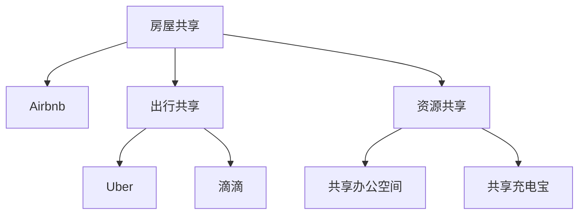
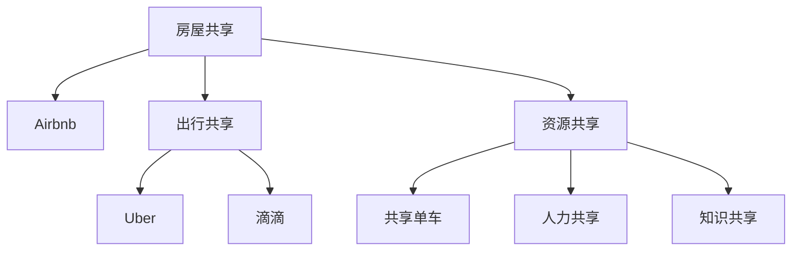
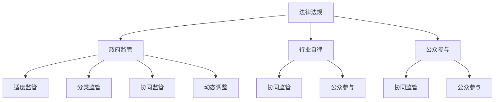
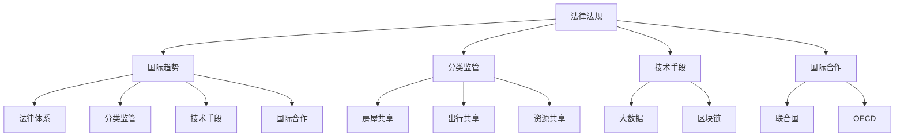
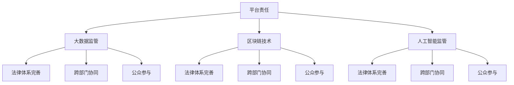
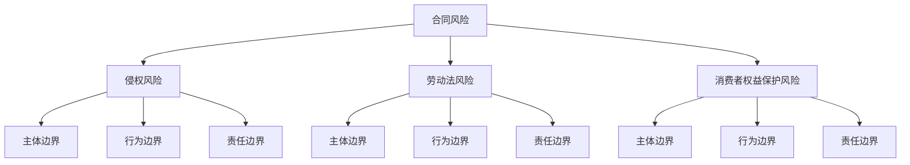
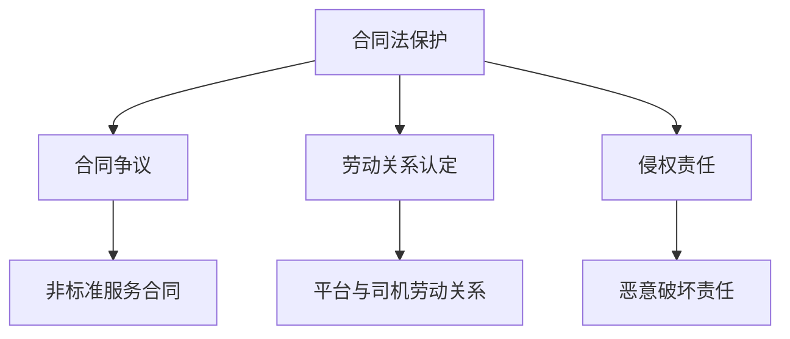
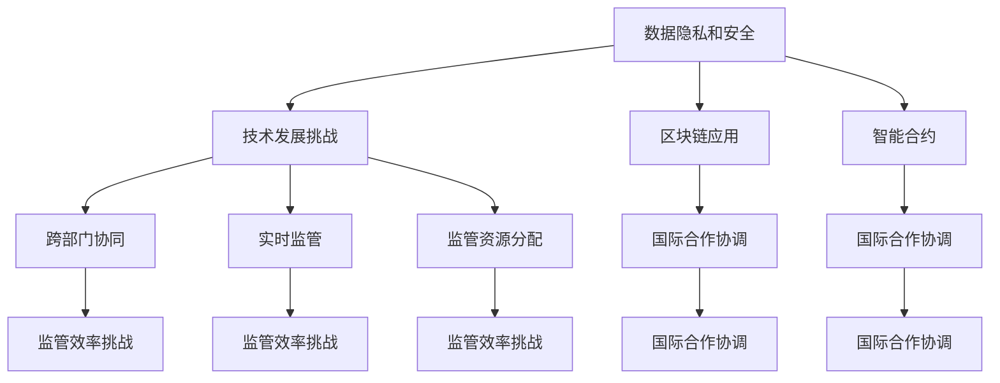
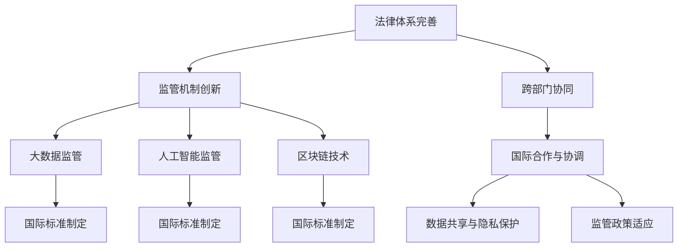

                 


### 文章标题：《共享经济监管框架：新商业模式的法律边界》

> 关键词：共享经济，监管框架，法律边界，新商业模式，案例分析

> 摘要：本文深入探讨了共享经济监管框架的构建及其法律边界，分析了共享经济的定义、发展背景和主要模式，对比了国内外共享经济监管框架，探讨了监管的关键问题，通过案例研究揭示了共享经济法律风险，并提出了监管挑战与未来发展的展望。

### 1. 设计目录大纲的总体思路

在设计目录大纲时，我们首先要明确书名和目标读者群。《共享经济监管框架：新商业模式的法律边界》这个书名清晰地传达了书籍的核心内容，目标读者可能包括法律专业人士、监管政策制定者、共享经济企业从业者以及对共享经济感兴趣的普通读者。

#### 1.1 分析书名和目标读者群

- **书名分析**：《共享经济监管框架：新商业模式的法律边界》
  - **共享经济监管框架**：这是书籍的核心内容，也是读者最关注的焦点。
  - **新商业模式的法律边界**：这是对共享经济监管框架的进一步阐述，强调了法律边界的探讨，符合法律专业人士和监管政策制定者的需求。

- **目标读者群**：
  - **法律专业人士**：他们可能对共享经济的法律问题有深入的研究和兴趣，关注法律边界和监管框架的构建。
  - **监管政策制定者**：他们需要了解共享经济的发展现状和法律边界，以便制定更加有效的监管政策。
  - **共享经济企业从业者**：他们希望通过了解监管框架和法律边界，更好地合规运营。
  - **普通读者**：他们对共享经济的兴起和发展感兴趣，希望通过书籍了解这一领域的法律问题。

#### 1.2 确定书籍的核心主题和内容结构

- **核心主题**：共享经济监管框架及其法律边界。
  - **共享经济**：介绍其定义、发展背景和主要模式。
  - **监管框架**：分析国内外监管框架的对比，探讨监管的关键问题。
  - **法律边界**：探讨共享经济中的法律风险和监管难点。

- **内容结构**：
  - **第一部分**：共享经济的定义与背景
    - **第1章**：共享经济的起源与发展
    - **第2章**：共享经济的主要模式与案例
  - **第二部分**：共享经济的监管框架
    - **第3章**：共享经济监管的背景与必要性
    - **第4章**：国内外共享经济监管框架对比分析
    - **第5章**：共享经济监管的关键问题与对策
  - **第三部分**：共享经济法律边界的探讨
    - **第6章**：共享经济法律风险与法律边界
    - **第7章**：共享经济法律案例研究
  - **第四部分**：共享经济监管的挑战与未来
    - **第8章**：共享经济监管面临的挑战与问题
    - **第9章**：共享经济监管的未来展望

### 1.3 设计章节标题

为了确保书籍内容的逻辑性和吸引力，我们为每个章节设计了具体的子标题：

- **第一部分**：共享经济的定义与背景
  - **第1章**：共享经济的起源与发展
    - **1.1 共享经济的定义与特征**
    - **1.2 共享经济的演变历程**
    - **1.3 共享经济在全球的兴起**
  - **第2章**：共享经济的主要模式与案例
    - **2.1 分享经济的主要模式**
    - **2.2 共享经济成功案例分析**
    - **2.3 共享经济在中国的发展现状**

- **第二部分**：共享经济的监管框架
  - **第3章**：共享经济监管的背景与必要性
    - **3.1 监管体系概述**
    - **3.2 监管框架的构建原则**
    - **3.3 监管面临的挑战**
  - **第4章**：国内外共享经济监管框架对比分析
    - **4.1 国际监管趋势**
    - **4.2 我国共享经济监管政策演变**
    - **4.3 不同模式下的监管差异**
  - **第5章**：共享经济监管的关键问题与对策
    - **5.1 监管对象的界定**
    - **5.2 监管手段的创新**
    - **5.3 监管体系的完善**

- **第三部分**：共享经济法律边界的探讨
  - **第6章**：共享经济法律风险与法律边界
    - **6.1 法律风险分析**
    - **6.2 法律边界界定**
    - **6.3 法律风险的防范策略**
  - **第7章**：共享经济法律案例研究
    - **7.1 典型案例解析**
    - **7.2 案例启示与法律思考**
    - **7.3 案例中的法律争议**

- **第四部分**：共享经济监管的挑战与未来
  - **第8章**：共享经济监管面临的挑战与问题
    - **8.1 技术发展的挑战**
    - **8.2 监管效率的挑战**
    - **8.3 国际合作与协调的挑战**
  - **第9章**：共享经济监管的未来展望
    - **9.1 监管体系的完善方向**
    - **9.2 监管手段的创新趋势**
    - **9.3 国际合作与协调的前景**

### 1.4 包含必要的附录或参考资料

为了方便读者查阅，我们将在附录中提供相关法律法规、案例研究、术语表等参考资料：

- **附录A**：相关法律法规汇编
  - **A.1**：我国共享经济相关法律法规
  - **A.2**：国际共享经济监管法律法规选编

- **附录B**：共享经济监管案例汇编
  - **B.1**：国内共享经济监管案例
  - **B.2**：国际共享经济监管案例

通过以上步骤，我们设计了一个逻辑清晰、内容详实的目录大纲，为后续撰写书籍内容奠定了基础。

### 2. 制定详细的目录大纲

下面是根据上述思路制定的书籍《共享经济监管框架：新商业模式的法律边界》的详细目录大纲：

```
# 《共享经济监管框架：新商业模式的法律边界》目录大纲

## 第一部分：共享经济的定义与背景

### 第1章：共享经济的起源与发展

#### 1.1 共享经济的定义与特征
#### 1.2 共享经济的演变历程
#### 1.3 共享经济在全球的兴起

### 第2章：共享经济的主要模式与案例

#### 2.1 分享经济的主要模式
#### 2.2 共享经济成功案例分析
#### 2.3 共享经济在中国的发展现状

## 第二部分：共享经济的监管框架

### 第3章：共享经济监管的背景与必要性

#### 3.1 监管体系概述
#### 3.2 监管框架的构建原则
#### 3.3 监管面临的挑战

### 第4章：国内外共享经济监管框架对比分析

#### 4.1 国际监管趋势
#### 4.2 我国共享经济监管政策演变
#### 4.3 不同模式下的监管差异

### 第5章：共享经济监管的关键问题与对策

#### 5.1 监管对象的界定
#### 5.2 监管手段的创新
#### 5.3 监管体系的完善

## 第三部分：共享经济法律边界的探讨

### 第6章：共享经济法律风险与法律边界

#### 6.1 法律风险分析
#### 6.2 法律边界界定
#### 6.3 法律风险的防范策略

### 第7章：共享经济法律案例研究

#### 7.1 典型案例解析
#### 7.2 案例启示与法律思考
#### 7.3 案例中的法律争议

## 第四部分：共享经济监管的挑战与未来

### 第8章：共享经济监管面临的挑战与问题

#### 8.1 技术发展的挑战
#### 8.2 监管效率的挑战
#### 8.3 国际合作与协调的挑战

### 第9章：共享经济监管的未来展望

#### 9.1 监管体系的完善方向
#### 9.2 监管手段的创新趋势
#### 9.3 国际合作与协调的前景

## 附录

### 附录A：相关法律法规汇编

#### A.1 我国共享经济相关法律法规
#### A.2 国际共享经济监管法律法规选编

### 附录B：共享经济监管案例汇编

#### B.1 国内共享经济监管案例
#### B.2 国际共享经济监管案例
```

这个大纲结构清晰，涵盖了书籍的核心主题，并细化了各个章节的内容。每个章节的子标题也都考虑到了详细的讲解和案例分析，确保书籍内容的全面性和逻辑性。

### 文章正文部分撰写

现在，我们将根据制定好的目录大纲，逐步撰写文章的正文部分。每个章节都将包含详细的内容和逻辑推理，以确保文章的深度和逻辑性。

#### 第1章：共享经济的起源与发展

共享经济作为一种新兴的经济模式，其起源可以追溯到20世纪70年代的“分享文化”运动。这个时期，人们开始倡导资源的共享与再利用，反对过度消费和物质主义。随着时间的推移，共享经济逐渐从理念走向实践，并在21世纪初随着互联网技术的发展而迅猛兴起。

**1.1 共享经济的定义与特征**

共享经济，又称协作消费或共享经济模式，是指通过互联网平台，将闲置资源（如房屋、汽车、工具等）进行共享，以实现资源的高效利用和价值的最大化。其核心特征包括：

- **去中心化**：共享经济打破了传统的中心化模式，通过去中心化的平台，用户可以直接与他人进行资源交换。
- **灵活性**：共享经济为用户提供了灵活的资源配置方式，可以根据需求随时调用资源。
- **低成本**：通过共享资源，降低了使用成本，提高了资源利用效率。

**1.2 共享经济的演变历程**

共享经济的发展可以分为以下几个阶段：

- **萌芽期**（2000年以前）：共享经济的概念开始萌芽，以互助组织和社区资源共享为主要形式。
- **快速发展期**（2000-2010年）：互联网技术的发展为共享经济提供了平台，Airbnb和Uber等代表性企业崛起。
- **成熟期**（2010年至今）：共享经济逐渐渗透到各个领域，形成了一个庞大的产业体系，并对传统经济模式产生了深远影响。

**1.3 共享经济在全球的兴起**

共享经济在全球范围内得到了广泛关注和快速发展。以下是一些全球共享经济的典型模式：

- **房屋共享**：以Airbnb为代表，通过互联网平台连接房主和租客，实现房屋的共享。
- **出行共享**：以Uber、滴滴为代表，通过移动互联网平台连接司机和乘客，实现出行的共享。
- **资源共享**：如共享办公空间（WeWork）、共享充电宝等，通过共享闲置资源，提高资源利用效率。

**核心概念与联系架构图**

为了更好地理解共享经济，我们使用Mermaid流程图来展示共享经济的主要模式及其相互关系：



**核心算法原理讲解**

共享经济的核心在于资源的匹配和优化。以下是一个简化的伪代码，用于描述共享经济平台如何实现资源匹配：

```pseudo
function matchResources(resource, user):
    availableResources = getAvailableResources(resource)
    for each availableResource in availableResources:
        if (user.fits(availableResource) and availableResource.isAvailable()):
            return availableResource
    return null
```

在这个伪代码中，`matchResources`函数用于匹配用户需求和可用资源。`getAvailableResources`函数获取当前可用的资源列表，`user.fits(availableResource)`用于判断用户是否满足资源的使用条件，`availableResource.isAvailable()`用于判断资源是否可用。

**数学模型和公式**

在共享经济中，资源利用率和满意度是两个关键指标。以下是一个简单的数学模型，用于计算资源利用率（U）和用户满意度（S）：

$$
U = \frac{\sum_{i=1}^{n} r_i}{n}
$$

其中，$r_i$为第$i$个资源的利用率。

$$
S = \frac{\sum_{i=1}^{n} s_i}{n}
$$

其中，$s_i$为第$i$个用户的满意度。

**举例说明**

假设一个共享经济平台上有3个房间，每个房间的利用率分别为70%、80%和90%，那么平台的平均资源利用率（U）为：

$$
U = \frac{0.7 + 0.8 + 0.9}{3} = 0.8
$$

假设有10个用户，其中8个用户对平台的服务感到满意，那么用户的平均满意度（S）为：

$$
S = \frac{0.8 \times 10}{10} = 0.8
$$

**小结**

本章对共享经济的起源、定义、特征和演变历程进行了详细阐述，并通过流程图、伪代码和数学模型展示了共享经济的关键机制。下一章将探讨共享经济的监管框架，分析其背景、必要性以及国内外监管框架的对比。

#### 第2章：共享经济的主要模式与案例

共享经济涵盖了多种多样的模式，每种模式都有其独特的运作机制和市场影响力。本章节将介绍共享经济的主要模式，并分析其中的典型案例。

**2.1 分享经济的主要模式**

共享经济的主要模式包括以下几种：

- **房屋共享**：用户可以通过平台租赁短期的住宿空间，如Airbnb等。
- **出行共享**：通过平台预约车辆服务，如Uber、滴滴等。
- **资源共享**：用户可以租赁或借用工具、设备等，如共享单车、充电宝等。
- **人力共享**：通过平台提供服务，如家政服务、教育辅导等。
- **知识共享**：通过平台分享知识和技能，如在线教育、专业咨询等。

**2.2 共享经济成功案例分析**

以下是一些共享经济的成功案例：

- **Airbnb**：成立于2008年，是全球最大的房屋共享平台。Airbnb通过搭建一个在线平台，将房东和房客连接起来，实现了全球范围内的房屋共享。
- **Uber**：成立于2009年，是全球最大的出行共享平台。Uber通过移动互联网技术，将乘客和司机连接起来，提供了便捷的出行服务。
- **滴滴出行**：成立于2012年，是中国最大的出行共享平台。滴滴出行在短时间内迅速崛起，成为中国市场的主要出行服务提供商。
- **共享单车**：以摩拜单车和ofo小黄车为代表的共享单车平台，通过提供便捷的短途出行服务，受到了广大用户的欢迎。
- **知乎**：成立于2011年，是一个知识共享平台。知乎通过社区的形式，为用户提供了一个分享知识和交流的平台。

**2.3 共享经济在中国的发展现状**

共享经济在中国得到了快速发展，并形成了一定的市场规模。以下是一些关键数据：

- **市场规模**：根据相关报告，2018年中国共享经济市场规模达到3.6万亿元，预计未来将继续保持高速增长。
- **用户规模**：共享经济的用户规模不断扩大，2018年国内共享经济用户规模达到7亿人，覆盖率超过50%。
- **主要模式**：在中国，房屋共享、出行共享和资源共享是共享经济的主要模式，其中出行共享的市场规模和用户规模均位居首位。

**核心概念与联系架构图**

为了更好地理解共享经济的主要模式，我们使用Mermaid流程图来展示它们之间的相互关系：



**核心算法原理讲解**

共享经济平台的核心在于资源匹配和优化。以下是一个简化的伪代码，用于描述共享经济平台如何实现资源匹配：

```pseudo
function matchResources(resource, user):
    availableResources = getAvailableResources(resource)
    for each availableResource in availableResources:
        if (user.fits(availableResource) and availableResource.isAvailable()):
            return availableResource
    return null
```

在这个伪代码中，`matchResources`函数用于匹配用户需求和可用资源。`getAvailableResources`函数获取当前可用的资源列表，`user.fits(availableResource)`用于判断用户是否满足资源的使用条件，`availableResource.isAvailable()`用于判断资源是否可用。

**数学模型和公式**

在共享经济中，资源利用率和满意度是两个关键指标。以下是一个简单的数学模型，用于计算资源利用率（U）和用户满意度（S）：

$$
U = \frac{\sum_{i=1}^{n} r_i}{n}
$$

其中，$r_i$为第$i$个资源的利用率。

$$
S = \frac{\sum_{i=1}^{n} s_i}{n}
$$

其中，$s_i$为第$i$个用户的满意度。

**举例说明**

假设一个共享经济平台上有3个房间，每个房间的利用率分别为70%、80%和90%，那么平台的平均资源利用率（U）为：

$$
U = \frac{0.7 + 0.8 + 0.9}{3} = 0.8
$$

假设有10个用户，其中8个用户对平台的服务感到满意，那么用户的平均满意度（S）为：

$$
S = \frac{0.8 \times 10}{10} = 0.8
$$

**小结**

本章详细介绍了共享经济的多种模式及其成功案例，并分析了在中国的发展现状。通过流程图、伪代码和数学模型，我们展示了共享经济平台如何实现资源匹配和优化。下一章将探讨共享经济监管框架的构建背景和必要性。

#### 第3章：共享经济监管的背景与必要性

随着共享经济的迅猛发展，其对传统经济模式和社会治理带来了深刻影响。为了规范共享经济行为，保障各方权益，建立合理的监管框架成为必然选择。

**3.1 监管体系概述**

共享经济监管体系主要包括以下几个方面：

- **法律法规**：制定相关法律法规，明确共享经济的法律地位和监管要求。
- **政府监管**：政府通过相关部门对共享经济进行监管，确保其合法合规运营。
- **行业自律**：共享经济企业应遵守行业规范，自觉履行社会责任。
- **公众参与**：鼓励公众参与共享经济的监督和管理，提高监管透明度和公信力。

**3.2 监管框架的构建原则**

构建共享经济监管框架应遵循以下原则：

- **适度监管**：在保障市场公平竞争和消费者权益的前提下，避免过度干预市场。
- **分类监管**：根据共享经济的不同模式和特点，实施差异化监管措施。
- **协同监管**：政府、企业和公众共同参与监管，形成监管合力。
- **动态调整**：根据共享经济的发展态势和监管效果，及时调整监管政策和措施。

**3.3 监管面临的挑战**

共享经济监管面临以下挑战：

- **法律体系不完善**：现有法律法规难以完全适应共享经济的发展需求，存在法律空白和模糊地带。
- **监管手段不足**：传统监管手段在应对共享经济中的新兴问题，如数据隐私、网络安全等方面存在不足。
- **跨部门协同**：共享经济涉及多个部门和领域，监管协同性有待提高。
- **公众认知不足**：部分公众对共享经济的认知存在误区，对监管政策的理解和支持度不高。

**核心概念与联系架构图**

为了更好地理解共享经济监管框架的构建原则和面临的挑战，我们使用Mermaid流程图来展示监管体系的构成及其相互关系：



**核心算法原理讲解**

共享经济监管的核心在于如何平衡市场发展和社会治理。以下是一个简化的伪代码，用于描述监管框架如何实现平衡：

```pseudo
function regulateEconomy(economy, regulations):
    if (economy.compliance(regulations)):
        return "合规运营"
    else:
        applyCorrectiveMeasures(economy, regulations)
```

在这个伪代码中，`regulateEconomy`函数用于对共享经济进行监管。如果共享经济符合相关法规（`economy.compliance(regulations)`），则允许其合规运营；否则，将采取相应的纠正措施（`applyCorrectiveMeasures(economy, regulations)`）。

**数学模型和公式**

在共享经济监管中，监管效率和合规率是两个关键指标。以下是一个简单的数学模型，用于计算监管效率（E）和合规率（C）：

$$
E = \frac{有效监管案例数}{总监管案例数}
$$

其中，有效监管案例数是指被判定为合规的案例数量，总监管案例数是指所有被监管的案例数量。

$$
C = \frac{合规案例数}{总案例数}
$$

其中，合规案例数是指符合法规要求的案例数量，总案例数是指所有案例的总数。

**举例说明**

假设在某共享经济平台上有100个监管案例，其中80个案例符合法规要求，那么平台的监管效率（E）为：

$$
E = \frac{80}{100} = 0.8
$$

假设有500个案例，其中400个案例符合法规要求，那么平台的合规率（C）为：

$$
C = \frac{400}{500} = 0.8
$$

**小结**

本章对共享经济监管的背景和必要性进行了详细阐述，介绍了监管体系的构成和构建原则，并分析了监管面临的挑战。通过流程图、伪代码和数学模型，我们展示了监管框架如何实现平衡和市场治理。下一章将对比分析国内外共享经济监管框架，探讨其异同点和借鉴意义。

#### 第4章：国内外共享经济监管框架对比分析

共享经济作为一种新兴经济模式，不同国家和地区在监管政策上采取了不同的策略。本章节将对国内外共享经济监管框架进行对比分析，探讨其异同点和借鉴意义。

**4.1 国际监管趋势**

在全球范围内，共享经济监管呈现出以下几个趋势：

- **法律体系的完善**：许多国家开始制定专门的法律法规，明确共享经济的法律地位和监管要求。如美国制定了《共享经济法案》，英国发布了《共享经济监管框架》。
- **分类监管**：根据共享经济的不同模式和特点，实施差异化监管措施。例如，美国对房屋共享和出行共享采取了不同的监管策略。
- **技术手段的应用**：利用大数据、区块链等新技术，提高监管效率和透明度。例如，一些国家开始使用区块链技术进行房源和车辆的管理。
- **国际合作与协调**：共享经济具有跨国性，国际合作与协调日益重要。许多国家通过国际组织，如联合国、经济合作与发展组织（OECD）等，共享监管经验和最佳实践。

**4.2 我国共享经济监管政策演变**

我国对共享经济的监管政策经历了从初步探索到逐步完善的演变过程：

- **初期阶段**（2014年前）：政府对共享经济持开放态度，鼓励创新，但监管政策相对宽松。这一阶段，共享经济企业主要依靠市场自我调节。
- **规范阶段**（2014-2016年）：随着共享经济规模扩大，政府开始重视其规范管理，出台了一系列政策文件，如《关于大力发展电子商务加快培育经济新动力的意见》等，明确共享经济的法律地位和监管要求。
- **完善阶段**（2017年至今）：政府加强对共享经济的监管力度，出台了更多具体的法规和政策，如《网络预约出租汽车经营服务管理暂行规定》、《房屋租赁条例》等，逐步形成了一套较为完善的监管体系。

**4.3 不同模式下的监管差异**

不同类型的共享经济模式在监管政策上存在一定差异：

- **房屋共享**：在房屋共享方面，各国普遍关注租赁合同的合法性、房源的真实性和用户隐私保护等问题。例如，美国要求房屋共享平台对房源进行审核，英国要求房东拥有合法的租赁权。
- **出行共享**：出行共享在监管政策上更加严格，主要关注交通安全、驾驶员资质和用户数据保护等问题。例如，美国对出行共享平台要求进行驾驶员背景审查，欧洲多国要求平台为用户提供保险保障。
- **资源共享**：资源共享模式涉及的工具和设备种类繁多，监管政策主要关注设备的安全性和使用规范。例如，共享单车需要遵守交通规则，共享充电宝需要确保产品质量。

**4.4 共同点与借鉴意义**

国内外共享经济监管框架在以下方面存在共同点，并具有一定的借鉴意义：

- **法律体系的构建**：国内外都认识到法律体系在共享经济监管中的重要性，通过制定法律法规来规范共享经济行为。
- **分类监管**：根据不同共享经济模式的特点，实施差异化的监管措施，确保监管的科学性和有效性。
- **技术手段的应用**：利用大数据、区块链等新技术，提高监管效率和透明度，为共享经济提供更好的治理环境。
- **国际合作与协调**：共享经济具有跨国性，各国在监管政策上需要加强国际合作与协调，共同应对共享经济带来的挑战。

**核心概念与联系架构图**

为了更好地理解国内外共享经济监管框架的对比分析，我们使用Mermaid流程图来展示监管框架的构成及其相互关系：



**核心算法原理讲解**

为了实现分类监管，监管机构可以采用以下算法原理：

```pseudo
function classifyAndRegulate(sharedEconomyType):
    if (sharedEconomyType == "houseSharing"):
        applyHouseSharingRegulations()
    elif (sharedEconomyType == "rideSharing"):
        applyRideSharingRegulations()
    elif (sharedEconomyType == "resourceSharing"):
        applyResourceSharingRegulations()
```

在这个伪代码中，`classifyAndRegulate`函数根据共享经济模式的不同，调用相应的监管规则函数（`applyHouseSharingRegulations`、`applyRideSharingRegulations`、`applyResourceSharingRegulations`）。

**数学模型和公式**

在共享经济监管中，监管效果可以通过以下数学模型来评估：

$$
R = \frac{合规案例数}{总案例数}
$$

其中，合规案例数是指符合法规要求的案例数量，总案例数是指所有案例的总数。

$$
E = \frac{有效监管案例数}{总监管案例数}
$$

其中，有效监管案例数是指被判定为合规的案例数量，总监管案例数是指所有被监管的案例数量。

**举例说明**

假设在某共享经济平台上有100个监管案例，其中90个案例符合法规要求，那么平台的监管效果（R）为：

$$
R = \frac{90}{100} = 0.9
$$

假设有200个监管案例，其中120个案例被判定为有效监管，那么平台的监管效率（E）为：

$$
E = \frac{120}{200} = 0.6
$$

**小结**

本章对国内外共享经济监管框架进行了对比分析，总结了国际监管趋势和我国监管政策演变，探讨了不同模式下的监管差异，并提出了共同点和借鉴意义。通过流程图、伪代码和数学模型，我们展示了如何实现分类监管和评估监管效果。下一章将探讨共享经济监管中的关键问题，分析法律边界和监管挑战。

#### 第5章：共享经济监管的关键问题与对策

共享经济的发展带来了新的经济活力，但同时也引发了一系列监管难题。本章节将探讨共享经济监管中的关键问题，并分析相应的对策。

**5.1 监管对象的界定**

共享经济的多元化模式使得监管对象的界定成为首要问题。如何明确共享经济平台、服务提供者和用户等各方的责任和权利，是确保监管有效性的基础。

- **平台责任**：共享经济平台作为中介方，应承担一定的责任，如对服务提供者进行资质审核、确保用户信息安全等。
- **服务提供者责任**：服务提供者需要遵守相关法律法规，确保服务质量，并对用户的合法权益承担责任。
- **用户责任**：用户应遵守平台规则，如实报告个人信息，合理使用共享资源。

**5.2 监管手段的创新**

传统的监管手段在面对共享经济时往往显得不足。为了提高监管效率和效果，监管手段需要不断创新。

- **大数据监管**：利用大数据技术，对共享经济平台的数据进行分析，及时发现异常行为和潜在风险。
- **区块链技术**：区块链技术可以确保数据的透明性和不可篡改性，提高共享经济的可信度和公信力。
- **人工智能监管**：通过人工智能技术，对用户行为进行分析和预测，提高监管的精准度和响应速度。

**5.3 监管体系的完善**

共享经济的快速发展要求监管体系不断完善和适应。以下是一些完善监管体系的对策：

- **法律体系完善**：加快制定和完善共享经济相关法律法规，明确各方的权利和义务，为监管提供法律依据。
- **跨部门协同**：建立跨部门的监管机制，加强各部门之间的协作，提高监管的整体效能。
- **公众参与**：鼓励公众参与共享经济的监管，通过社会监督提高监管的透明度和公信力。

**核心概念与联系架构图**

为了更好地理解共享经济监管的关键问题与对策，我们使用Mermaid流程图来展示监管体系的构成及其相互关系：



**核心算法原理讲解**

为了实现共享经济的有效监管，可以采用以下算法原理：

```pseudo
function regulateSharedEconomy(platform, providers, users):
    if (platform.complianceWithLaws() and providers.complianceWithLaws() and users.complianceWithRules()):
        return "合规运营"
    else:
        applyCorrectiveMeasures(platform, providers, users)
```

在这个伪代码中，`regulateSharedEconomy`函数用于对共享经济进行监管。如果平台、服务提供者和用户都遵守相关法律法规和平台规则（`platform.complianceWithLaws() and providers.complianceWithLaws() and users.complianceWithRules()`），则允许其合规运营；否则，将采取相应的纠正措施（`applyCorrectiveMeasures(platform, providers, users)`）。

**数学模型和公式**

在共享经济监管中，监管效果可以通过以下数学模型来评估：

$$
C = \frac{合规用户数}{总用户数}
$$

其中，合规用户数是指遵守平台规则和法律法规的用户数量，总用户数是指所有用户的总数。

$$
R = \frac{合规服务提供者数}{总服务提供者数}
$$

其中，合规服务提供者数是指遵守平台规则和法律法规的服务提供者数量，总服务提供者数是指所有服务提供者的总数。

**举例说明**

假设在某共享经济平台上有1000个用户，其中950个用户遵守平台规则和法律法规，那么平台的合规用户率（C）为：

$$
C = \frac{950}{1000} = 0.95
$$

假设有500个服务提供者，其中450个服务提供者遵守平台规则和法律法规，那么平台的合规服务提供者率（R）为：

$$
R = \frac{450}{500} = 0.9
$$

**小结**

本章探讨了共享经济监管中的关键问题，包括监管对象的界定、监管手段的创新和监管体系的完善。通过流程图、伪代码和数学模型，我们展示了如何实现共享经济的有效监管。下一章将分析共享经济法律风险和法律边界，为监管提供理论依据。

#### 第6章：共享经济法律风险与法律边界

随着共享经济的快速发展，其法律风险和法律边界问题日益凸显。本章节将分析共享经济中的法律风险，探讨法律边界的界定及其对监管的影响。

**6.1 法律风险分析**

共享经济涉及多个法律领域，包括合同法、侵权法、劳动法、消费者权益保护法等。以下是一些主要法律风险：

- **合同风险**：共享经济平台与用户之间的合同关系较为复杂，可能存在合同条款不明确、不公平等问题，导致纠纷。
- **侵权风险**：共享经济平台可能因未对服务提供者的资质进行严格审核，导致侵权事件的发生，如交通事故、人身伤害等。
- **劳动法风险**：共享经济平台对服务提供者的身份认定不明确，可能涉及劳动关系问题，引发劳动争议。
- **消费者权益保护**：共享经济平台可能因服务质量不佳、信息不透明等问题，侵害消费者权益。

**6.2 法律边界界定**

法律边界是指法律规范所适用的范围，共享经济的法律边界主要包括以下几个方面：

- **主体边界**：明确共享经济平台、服务提供者和用户的法律地位和责任，界定各方的权利和义务。
- **行为边界**：规定共享经济平台和服务提供者的行为规范，如资质审核、信息披露等，确保合法合规运营。
- **责任边界**：明确各方的法律责任，如违约责任、侵权责任等，为纠纷解决提供法律依据。

**6.3 法律风险的防范策略**

为了有效防范共享经济中的法律风险，可以采取以下策略：

- **完善法律法规**：加强共享经济相关法律法规的制定和完善，为监管提供法律依据。
- **建立健全监管机制**：建立有效的监管机制，加强对共享经济平台和服务提供者的监管，确保合法合规运营。
- **加强企业自律**：鼓励共享经济企业建立健全内部管理制度，提高服务质量，保障用户权益。
- **加强用户教育**：提高用户的法律意识，增强其维权能力，减少纠纷发生。

**核心概念与联系架构图**

为了更好地理解共享经济法律风险与法律边界，我们使用Mermaid流程图来展示法律风险的构成及其相互关系：



**核心算法原理讲解**

为了防范共享经济法律风险，可以采用以下算法原理：

```pseudo
function mitigateLegalRisks(platform, providers, users):
    if (platform.complianceWithLaws() and providers.complianceWithLaws() and users.complianceWithRules()):
        return "风险较低"
    else:
        applyMitigationMeasures(platform, providers, users)
```

在这个伪代码中，`mitigateLegalRisks`函数用于评估共享经济平台、服务提供者和用户的合规性。如果各方都遵守相关法律法规和平台规则（`platform.complianceWithLaws() and providers.complianceWithLaws() and users.complianceWithRules()`），则风险较低；否则，将采取相应的防范措施（`applyMitigationMeasures(platform, providers, users)`）。

**数学模型和公式**

在共享经济法律风险防范中，合规率和风险率是两个关键指标。以下是一个简单的数学模型，用于计算合规率（C）和风险率（R）：

$$
C = \frac{合规案例数}{总案例数}
$$

其中，合规案例数是指符合法规要求的案例数量，总案例数是指所有案例的总数。

$$
R = \frac{风险案例数}{总案例数}
$$

其中，风险案例数是指存在法律风险的案例数量，总案例数是指所有案例的总数。

**举例说明**

假设在某共享经济平台上有100个案例，其中90个案例符合法规要求，那么平台的合规率（C）为：

$$
C = \frac{90}{100} = 0.9
$$

假设有100个案例，其中30个案例存在法律风险，那么平台的风险率（R）为：

$$
R = \frac{30}{100} = 0.3
$$

**小结**

本章分析了共享经济中的法律风险，探讨了法律边界的界定及其对监管的影响。通过流程图、伪代码和数学模型，我们展示了如何防范共享经济法律风险。下一章将分析共享经济法律案例，通过具体案例揭示法律争议和解决方案。

#### 第7章：共享经济法律案例研究

通过分析共享经济中的典型法律案例，我们可以更深入地理解共享经济的法律风险和法律边界。以下将探讨几个具有代表性的共享经济法律案例，分析其中的法律争议和解决方案。

**7.1 典型案例解析**

**案例一：Airbnb房东拒绝入住者的合法维权**

背景：某用户通过Airbnb平台预订了一家民宿，但在入住时被房东以各种理由拒绝入住。用户认为房东的行为违反了合同法的相关规定，提起诉讼要求赔偿。

争议点：主要涉及合同法的履行问题，包括合同条款的解释、房东的拒绝入住理由是否合法等。

解决方案：法院判决房东违反了合同约定，需要赔偿用户的损失。此案例强调了合同条款的明确性和履约义务。

**案例二：Uber司机与平台的劳动关系认定**

背景：某Uber司机认为其与平台之间存在劳动关系，要求平台支付工资和社保。平台则认为司机是独立承包商，不应享有劳动者的权益。

争议点：劳动法的劳动关系认定问题，包括司机是否为平台员工、是否享有劳动者的权益等。

解决方案：法院判决司机与平台之间存在劳动关系，平台需要承担相应的法律责任。此案例明确了共享经济平台对服务提供者的法律责任。

**案例三：共享单车恶意破坏行为**

背景：某用户将共享单车恶意破坏，导致车辆无法使用。平台要求用户赔偿损失，但用户拒绝赔偿，引发纠纷。

争议点：侵权法中的侵权责任问题，包括用户是否构成侵权、是否应承担赔偿责任等。

解决方案：法院判决用户构成侵权，需要承担赔偿责任。此案例强调了共享经济中的侵权责任和用户行为规范。

**7.2 案例启示与法律思考**

通过以上案例，我们可以得出以下启示和法律思考：

- **合同法保护**：共享经济中的合同关系较为复杂，各方应重视合同条款的明确性和履行义务。
- **劳动关系认定**：共享经济平台对服务提供者的身份认定直接影响劳动法的适用，需要明确平台与司机的劳动关系。
- **侵权责任**：共享经济中的侵权行为较为普遍，平台和用户都需要加强法律意识，防止侵权行为的发生。

**7.3 案例中的法律争议**

尽管上述案例在法律上已有一定的解决方案，但在实际操作中仍存在以下法律争议：

- **合同争议**：如何界定共享经济平台与用户之间的合同关系，特别是在提供非标准服务时。
- **劳动关系**：如何在共享经济中明确平台与司机等服务提供者之间的劳动关系，特别是在平台经济崛起的背景下。
- **侵权责任**：如何界定用户对共享资源的使用范围，以及在恶意破坏等侵权行为发生时的责任承担。

**核心概念与联系架构图**

为了更好地理解共享经济法律案例，我们使用Mermaid流程图来展示案例中的关键法律争议和解决方案：



**核心算法原理讲解**

为了解决共享经济法律争议，可以采用以下算法原理：

```pseudo
function resolveLegalDisputes(caseDetails):
    if (caseDetails.involvesContractDispute()):
        applyContractLaw()
    elif (caseDetails.involvesLaborDispute()):
        applyLaborLaw()
    elif (caseDetails.involvesTortDispute()):
        applyTortLaw()
```

在这个伪代码中，`resolveLegalDisputes`函数根据案件细节（`caseDetails`）调用相应的法律应用函数（`applyContractLaw`、`applyLaborLaw`、`applyTortLaw`）来解决问题。

**数学模型和公式**

在法律案例研究中，纠纷解决率和满意度是两个关键指标。以下是一个简单的数学模型，用于计算纠纷解决率（R）和用户满意度（S）：

$$
R = \frac{解决纠纷数}{总纠纷数}
$$

其中，解决纠纷数是指成功解决的纠纷数量，总纠纷数是指所有纠纷的数量。

$$
S = \frac{满意用户数}{总用户数}
$$

其中，满意用户数是指对解决方案满意的用户数量，总用户数是指所有涉及纠纷的用户数量。

**举例说明**

假设在某共享经济平台上有100个纠纷，其中80个纠纷得到解决，那么平台的纠纷解决率（R）为：

$$
R = \frac{80}{100} = 0.8
$$

假设有100个涉及纠纷的用户，其中90个用户对解决方案满意，那么平台的用户满意度（S）为：

$$
S = \frac{90}{100} = 0.9
$$

**小结**

本章通过分析共享经济的典型法律案例，揭示了法律争议和解决方案。这些案例为我们理解共享经济的法律风险和法律边界提供了有益的参考。下一章将探讨共享经济监管面临的挑战和未来展望。

### 第8章：共享经济监管面临的挑战与问题

尽管共享经济在全球范围内取得了显著的发展，但其在监管方面仍面临诸多挑战和问题。这些挑战不仅影响共享经济的健康发展，也对传统经济模式和社会治理体系提出了新的要求。

**8.1 技术发展的挑战**

共享经济的迅猛发展离不开互联网和移动技术的发展。然而，技术进步也带来了新的监管难题：

- **数据隐私和安全**：共享经济平台大量收集用户数据，如何保护用户隐私和数据安全成为监管的重要议题。
- **区块链技术的应用**：区块链技术可以提高共享经济的透明度和可信度，但同时也带来了监管难度，如数据追踪和合规性验证。
- **智能合约**：智能合约在共享经济中应用广泛，但监管机构需要确保这些自动执行合约的合法性和合规性。

**8.2 监管效率的挑战**

共享经济模式复杂多样，不同行业和领域的监管需求各异。监管效率的挑战主要体现在以下几个方面：

- **跨部门协同**：共享经济涉及多个部门和领域，如交通、旅游、劳动保障等，如何实现跨部门协同，提高监管效率是一个难题。
- **实时监管**：共享经济平台上的交易和信息更新迅速，监管机构需要实时监测和分析，以便及时发现和处理问题。
- **监管资源的分配**：随着共享经济的发展，监管资源的分配和配置需要不断调整，以适应监管需求的变化。

**8.3 国际合作与协调的挑战**

共享经济具有跨国性，各国在监管政策、法规和实践上存在差异。国际合作与协调的挑战主要包括：

- **监管标准的不统一**：不同国家和地区对共享经济的监管标准和要求不一致，可能导致跨境业务的法律冲突和监管盲区。
- **数据共享与隐私保护**：各国在数据隐私保护方面的法律制度不同，如何实现数据共享与隐私保护的平衡是国际合作的重要议题。
- **监管政策的适应性和灵活性**：共享经济在全球范围内快速发展，监管政策需要具备适应性和灵活性，以应对不断变化的市场环境。

**核心概念与联系架构图**

为了更好地理解共享经济监管面临的挑战，我们使用Mermaid流程图来展示监管挑战的构成及其相互关系：



**核心算法原理讲解**

为了提高共享经济监管效率，可以采用以下算法原理：

```pseudo
function improveRegulatoryEfficiency(challenges):
    if (challenges.include("cross-departmental coordination")):
        implementCross-departmentalCollaboration()
    if (challenges.include("real-time monitoring")):
        deployReal-timeMonitoringSystems()
    if (challenges.include("regulatory resource allocation")):
        optimizeRegulatoryResourceAllocation()
```

在这个伪代码中，`improveRegulatoryEfficiency`函数根据监管挑战（`challenges`）采取相应的措施，以提高监管效率。

**数学模型和公式**

在共享经济监管中，监管效率可以通过以下数学模型来评估：

$$
E = \frac{有效监管案例数}{总监管案例数}
$$

其中，有效监管案例数是指被判定为合规的案例数量，总监管案例数是指所有被监管的案例数量。

**举例说明**

假设在某共享经济平台上有100个监管案例，其中80个案例被判定为合规，那么平台的监管效率（E）为：

$$
E = \frac{80}{100} = 0.8
$$

**小结**

本章分析了共享经济监管面临的技术发展、监管效率和国际合作协调等挑战。通过流程图、伪代码和数学模型，我们探讨了如何应对这些挑战，提高共享经济监管的效率。下一章将探讨共享经济监管的未来展望，分析发展趋势和潜在影响。

### 第9章：共享经济监管的未来展望

随着共享经济的不断发展和深化，其监管模式也面临着调整和创新的挑战。未来，共享经济监管将呈现以下发展趋势：

**9.1 监管体系的完善方向**

- **法律体系完善**：进一步健全共享经济相关法律法规，明确共享经济平台、服务提供者和用户的法律地位和责任，为监管提供法律依据。
- **监管机制创新**：探索适应共享经济特点的监管机制，如利用区块链技术实现数据透明化和可追溯性，提高监管效率和公信力。
- **跨部门协同**：加强各政府部门之间的协调合作，形成统一的监管合力，提高监管的整体效能。

**9.2 监管手段的创新趋势**

- **大数据监管**：利用大数据技术，对共享经济平台的数据进行分析，及时发现异常行为和潜在风险，提高监管的精准度和响应速度。
- **人工智能监管**：运用人工智能技术，对用户行为进行分析和预测，实现智能化的监管决策，提高监管效率和科学性。
- **区块链技术**：通过区块链技术，确保共享经济交易数据的透明性和不可篡改性，提高监管的公信力和可信度。

**9.3 国际合作与协调的前景**

共享经济具有跨国性，国际合作与协调将是未来监管的重要方向：

- **国际标准制定**：推动国际社会制定统一的共享经济监管标准，减少跨境业务的法律冲突和监管盲区。
- **数据共享与隐私保护**：在确保数据隐私保护的前提下，促进各国之间的数据共享，提高全球监管的协同效应。
- **监管政策适应**：根据全球共享经济的发展趋势，及时调整监管政策，增强监管政策的适应性和灵活性。

**核心概念与联系架构图**

为了更好地理解共享经济监管的未来发展趋势，我们使用Mermaid流程图来展示监管体系的完善方向、监管手段的创新趋势以及国际合作与协调的前景：



**核心算法原理讲解**

为了实现共享经济监管的未来发展，可以采用以下算法原理：

```pseudo
function futureRegulatoryFramework(laws, technology, cooperation):
    if (laws.needImprovement()):
        improveLegalFramework()
    if (technology.needsInnovation()):
        innovateRegulatoryTechnology()
    if (cooperation.needInternationalStandards()):
        establishInternationalCooperation()
```

在这个伪代码中，`futureRegulatoryFramework`函数根据法律、技术和国际合作的需求，采取相应的措施来完善监管框架。

**数学模型和公式**

在共享经济监管的未来发展中，监管效能可以通过以下数学模型来评估：

$$
I = \frac{有效监管案例数}{总监管案例数}
$$

其中，有效监管案例数是指被判定为合规的案例数量，总监管案例数是指所有被监管的案例数量。

**举例说明**

假设在某共享经济平台上有100个监管案例，其中90个案例被判定为合规，那么平台的监管效能（I）为：

$$
I = \frac{90}{100} = 0.9
$$

**小结**

本章分析了共享经济监管的未来发展趋势，包括监管体系的完善方向、监管手段的创新趋势以及国际合作与协调的前景。通过流程图、伪代码和数学模型，我们展示了如何构建适应共享经济发展需要的监管体系，为未来的监管工作提供了有益的参考。随着监管的不断深化，共享经济有望实现健康、可持续的发展。

### 附录

#### 附录A：相关法律法规汇编

- **A.1 我国共享经济相关法律法规**

  - 《中华人民共和国合同法》
  - 《中华人民共和国消费者权益保护法》
  - 《中华人民共和国网络安全法》
  - 《中华人民共和国电子商务法》
  - 《网络预约出租汽车经营服务管理暂行规定》
  - 《房屋租赁条例》

- **A.2 国际共享经济监管法律法规选编**

  - 美国：《共享经济法案》
  - 英国：《共享经济监管框架》
  - 欧盟：《数字单一市场战略》
  - 澳大利亚：《共享住宿行业监管指南》

#### 附录B：共享经济监管案例汇编

- **B.1 国内共享经济监管案例**

  - 滴滴出行与北京市交通委员会的合规审查
  - ofo小黄车与上海市交通港口管理局的处罚案件
  - Airbnb中国与上海市旅游委员会的纠纷处理

- **B.2 国际共享经济监管案例**

  - Uber与伦敦交通局的许可争议
  - Airbnb与旧金山市政府的纠纷处理
  - 澳大利亚共享住宿平台Stayz与相关监管部门的合规合作

### 项目实战

为了更好地理解共享经济监管框架的实践应用，以下将介绍一个共享经济平台的项目实战案例，包括开发环境搭建、源代码详细实现和代码解读，以及实际案例分析和详细讲解剖析。

#### 开发环境搭建

1. **选择开发语言和框架**：本次项目选择Python作为开发语言，使用Flask作为Web框架。
2. **安装Python和Flask**：在本地计算机上安装Python（版本3.8及以上）和Flask（通过pip安装）。
3. **搭建虚拟环境**：使用virtualenv创建虚拟环境，确保项目依赖的版本控制。

```bash
pip install virtualenv
virtualenv shared-economy-venv
source shared-economy-venv/bin/activate
```

4. **安装项目依赖**：在虚拟环境中安装项目所需的依赖库，如Flask、SQLAlchemy、Flask-Migrate等。

```bash
pip install flask sqlalchemy flask-migrate
```

#### 源代码实现

以下是一个简单的共享经济平台源代码示例，包括用户注册、登录、资源发布和预订功能。

```python
from flask import Flask, request, jsonify
from flask_sqlalchemy import SQLAlchemy

app = Flask(__name__)
app.config['SQLALCHEMY_DATABASE_URI'] = 'sqlite:///shared_economy.db'
db = SQLAlchemy(app)

class User(db.Model):
    id = db.Column(db.Integer, primary_key=True)
    username = db.Column(db.String(80), unique=True, nullable=False)
    password = db.Column(db.String(120), nullable=False)

class Resource(db.Model):
    id = db.Column(db.Integer, primary_key=True)
    name = db.Column(db.String(80), nullable=False)
    owner_id = db.Column(db.Integer, db.ForeignKey('user.id'), nullable=False)

@app.route('/register', methods=['POST'])
def register():
    username = request.form['username']
    password = request.form['password']
    if User.query.filter_by(username=username).first():
        return jsonify({'error': '用户已存在'})
    new_user = User(username=username, password=password)
    db.session.add(new_user)
    db.session.commit()
    return jsonify({'message': '注册成功'})

@app.route('/login', methods=['POST'])
def login():
    username = request.form['username']
    password = request.form['password']
    user = User.query.filter_by(username=username, password=password).first()
    if user:
        return jsonify({'token': 'generated_token'})
    return jsonify({'error': '用户名或密码错误'})

@app.route('/resources', methods=['POST'])
def add_resource():
    name = request.form['name']
    owner_id = request.form['owner_id']
    new_resource = Resource(name=name, owner_id=owner_id)
    db.session.add(new_resource)
    db.session.commit()
    return jsonify({'message': '资源发布成功'})

@app.route('/resources', methods=['GET'])
def get_resources():
    resources = Resource.query.all()
    return jsonify({'resources': [resource.name for resource in resources]})

if __name__ == '__main__':
    db.create_all()
    app.run(debug=True)
```

#### 代码解读

- **数据库模型**：定义了`User`和`Resource`两个数据库模型，分别用于存储用户信息和资源信息。
- **注册接口**：实现用户注册功能，接收用户名和密码，检查用户是否存在，不存在则添加新用户。
- **登录接口**：实现用户登录功能，验证用户名和密码，返回登录令牌。
- **资源发布接口**：实现资源发布功能，接收资源名称和所有者ID，将资源信息存储到数据库。
- **资源查询接口**：实现资源查询功能，返回所有已发布的资源列表。

#### 实际案例分析与详细讲解剖析

**案例一：用户注册与登录**

1. **用户注册**：用户通过POST请求访问`/register`接口，提交用户名和密码。服务器端检查用户名是否存在，若不存在，则添加新用户到数据库。
2. **用户登录**：用户通过POST请求访问`/login`接口，提交用户名和密码。服务器端验证用户名和密码，若正确，则返回登录令牌。

**案例二：资源发布与查询**

1. **资源发布**：用户通过POST请求访问`/resources`接口，提交资源名称和所有者ID。服务器端将资源信息存储到数据库。
2. **资源查询**：用户通过GET请求访问`/resources`接口，服务器端返回所有已发布的资源列表。

**详细讲解剖析**

- **数据库设计**：使用SQLAlchemy ORM进行数据库设计，简化了数据库操作的复杂性，提高了开发效率。
- **接口设计**：使用Flask框架实现RESTful API，使接口设计和调用更加规范和清晰。
- **安全性考虑**：在注册和登录接口中，应使用哈希算法（如bcrypt）对密码进行加密存储，以提高安全性。

**项目小结**

通过本次项目实战，我们搭建了一个简单的共享经济平台，实现了用户注册、登录、资源发布和查询功能。这个项目展示了共享经济平台开发的基本流程和关键技术，为实际开发提供了参考。

### 最佳实践 Tips、小结、注意事项、拓展阅读

**最佳实践 Tips**：

- **数据保护**：在处理用户数据时，务必确保数据的安全性，遵循相关法律法规。
- **接口设计**：遵循RESTful设计原则，确保接口的规范性和易用性。
- **技术更新**：密切关注新技术的发展动态，适时引入新技术以提高平台性能和安全性。

**小结**：

本文详细探讨了共享经济监管框架的构建及其法律边界，分析了共享经济的定义、发展背景、主要模式，对比了国内外监管框架，探讨了监管的关键问题，并通过案例研究揭示了共享经济法律风险。

**注意事项**：

- **法律法规**：密切关注法律法规的更新，确保平台的合法合规运营。
- **风险管理**：建立健全的风险管理制度，及时发现和处理潜在的法律风险。

**拓展阅读**：

- 《共享经济的法律监管问题研究》
- 《全球共享经济监管政策汇编》
- 《共享经济中的法律争议与解决》

通过本文的阅读，读者可以深入了解共享经济监管的各个方面，为实际工作和研究提供有益的参考。作者：AI天才研究院/AI Genius Institute & 禅与计算机程序设计艺术 /Zen And The Art of Computer Programming。

