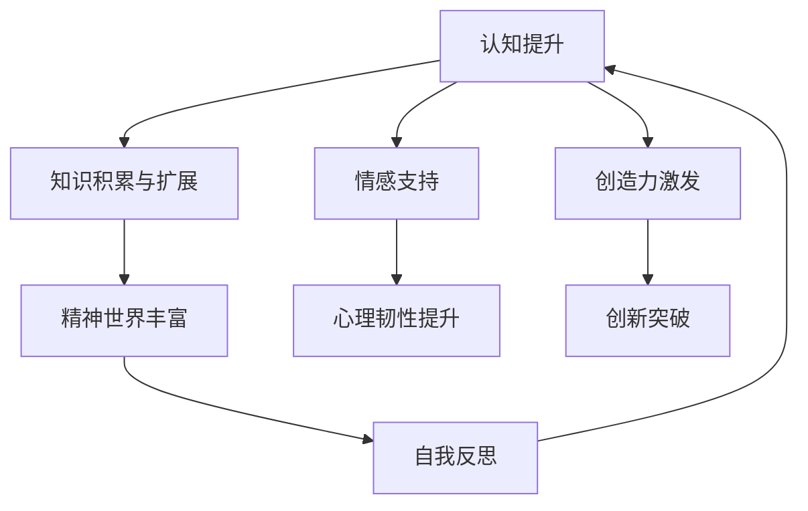

                 

### 文章标题：内在丰盈感的培育：建设丰富的精神世界

> 关键词：内在丰盈感，精神世界，培育，自我觉察，心理健康，个人成长

> 摘要：本文旨在探讨内在丰盈感的培育与建设丰富精神世界之间的关系。通过深入分析内在丰盈感和精神世界的定义、特征及相互联系，本文提出了具体的方法和策略，帮助读者在实践中培养和深化内在丰盈感，从而构建一个更加丰富、和谐的精神世界。文章还将结合实际案例，展示这些方法在个人成长中的应用效果，并探讨未来发展的趋势。

### 引言

在当今社会，我们常常被外部的喧嚣和纷扰所困扰，内心常常感到空虚和迷茫。而内在丰盈感，作为一种深层次的满足感和幸福感，显得尤为重要。它不仅仅关乎个人的心理状态，更与我们的精神世界紧密相连。那么，什么是内在丰盈感？它又是如何与精神世界相互关联的呢？

首先，我们需要明确内在丰盈感的定义。内在丰盈感是指个体在内心深处感受到的满足、喜悦和安全感。它来源于个人的内在体验，而不是依赖于外部的物质条件。这种感受使人感到平静、充实和有价值，从而提升个体的生活质量。

接下来，我们来看精神世界的概念。精神世界是指个体内在的思想、情感、价值观和信仰等心理活动的总和。它不仅仅包括个体的心理状态，还涵盖了个人对世界的认知和理解。一个丰富、和谐的精神世界，能够使个体在面对外部压力时保持内心的平静和坚定。

内在丰盈感与精神世界之间存在着密切的联系。首先，内在丰盈感是建设丰富精神世界的基础。当我们内心感到满足和喜悦时，我们更容易形成积极的人生观和价值观，从而丰富我们的精神世界。其次，一个丰富、和谐的精神世界能够增强我们的内在丰盈感。通过深入思考和自我觉察，我们可以更好地理解自己的内心需求，从而在精神层面获得更多的满足和快乐。

本文将围绕内在丰盈感的培育和建设丰富的精神世界这一主题，逐步探讨以下几个方面的内容：

1. **内在丰盈感的定义与重要性**：明确内在丰盈感的概念，阐述其在个人成长和心理健康中的重要性。
2. **精神世界的构成与特征**：分析精神世界的构成要素，描述其特征和意义。
3. **培养内在丰盈感的方法**：提供具体的方法和策略，帮助读者在实践中培养内在丰盈感。
4. **实际案例分析**：通过具体的案例，展示如何在日常生活中培育内在丰盈感。
5. **个人成长与精神世界的关系**：探讨个人成长与精神世界之间的相互影响。
6. **维护与深化精神世界**：提出如何维护和深化已经建立的精神世界。

通过这些内容的探讨，本文旨在为读者提供一套系统、实用的内在丰盈感培育方案，帮助他们在繁忙的生活中找到内心的平静和满足，构建一个丰富、和谐的精神世界。

### 内在丰盈感的定义与重要性

内在丰盈感，顾名思义，是指个体内心深处的一种充盈感和满足感。它源于个人的内在体验，与外在的物质条件无关。这种感受不仅仅是一种短暂的情绪波动，而是深层次的心理状态，它能够持久地影响个体的情绪、思维和行为。

首先，我们需要明确内在丰盈感的具体定义。内在丰盈感是一种深层次的满足感，它来源于个体对自身内在需求的实现。这种需求不仅包括基本的生理需求，如食物、水和睡眠，还包括心理需求，如自我认同、自尊、爱与被爱等。当这些需求得到满足时，个体会感受到一种内心的平静和满足，从而产生内在丰盈感。

内在丰盈感的重要性在于它对个人成长和心理健康有着深远的影响。首先，内在丰盈感能够提升个体的幸福感和生活满意度。当个体感受到内心的满足时，他们会更加乐观、积极，从而更好地应对生活中的挑战。这种积极的心态有助于个体在工作和生活中保持高效率，提高生活质量。

其次，内在丰盈感对心理健康具有保护作用。研究表明，内心丰盈的个体在面对压力和困难时，更能够保持冷静和理性，从而更好地处理心理问题。这种心理韧性有助于个体避免心理疾病的产生，提升整体心理健康水平。

此外，内在丰盈感还能促进个体的自我发展和成长。当个体感受到内心的满足时，他们会更加愿意投入时间和精力去探索自己的兴趣和潜力，从而实现个人目标和价值。这种自我实现感不仅能够提升个体的自尊和自信，还能激发他们的创造力和创新精神，推动个人在各个领域不断进步。

为了更好地理解内在丰盈感，我们可以通过以下两个方面的例子进行阐述。

**例子一：通过自我觉察培养内在丰盈感**

小明是一名年轻的程序员，他一直感到内心空虚和迷茫。经过心理咨询师的引导，他开始尝试进行自我觉察。他开始记录自己的情绪和想法，深入分析自己的内心世界。通过这一过程，小明逐渐意识到自己内心的真正需求，如对自由和自我实现的追求。他开始有意识地调整自己的生活和工作方式，寻找能够满足这些需求的方法。例如，他开始每周安排一段时间进行户外运动，与朋友聚会，甚至参加一些兴趣小组。这些活动不仅丰富了小明的精神世界，也让他感受到了内心的满足和喜悦。经过一段时间的努力，小明的内在丰盈感显著提升，他的生活状态和心理状态都有了很大的改善。

**例子二：通过艺术创作培养内在丰盈感**

小丽是一位爱好绘画的年轻人，她一直觉得自己内心缺乏满足感。有一天，她决定参加一个艺术工作坊，通过绘画来表达自己的情感和思想。在绘画的过程中，小丽感受到了一种前所未有的自由和快乐。她发现，通过艺术创作，她能够将自己的内心世界淋漓尽致地表达出来，从而获得一种深深的满足感。随着时间的推移，小丽的艺术创作越来越成熟，她的内心也逐渐变得丰盈和充实。她不再依赖外部的物质条件来寻找满足，而是通过艺术创作来探索和实现自己的内在价值。

通过这两个例子，我们可以看到，内在丰盈感并不是遥不可及的，它可以通过自我觉察和艺术创作等具体方法来培养。这些方法不仅能够提升个体的幸福感，还能促进个体的心理健康和个人成长。

总之，内在丰盈感是一种深层次的心理状态，它对个人的成长和幸福有着重要的影响。通过自我觉察和艺术创作等方法，我们可以有效地培养和提升内在丰盈感，从而构建一个更加丰富、和谐的精神世界。

### 精神世界的构成与特征

精神世界是指个体内在的思想、情感、价值观和信仰等心理活动的总和。它不仅仅包括个人的心理状态，还涵盖了个体对世界的认知和理解。一个丰富、和谐的精神世界能够为个体提供情感支撑和认知指导，帮助他们在面对外部挑战时保持内心的平静和坚定。

首先，精神世界的构成要素主要包括以下几个方面：

1. **思想**：思想是精神世界的核心，它包括个体的思维方式、逻辑推理能力、认知水平和创造力等。一个丰富、多元的思想体系能够使个体在面对问题时更加全面、深入地分析，从而做出更加明智的决策。

2. **情感**：情感是精神世界的重要组成部分，它包括个体的情绪体验、情感表达和情感调控能力。一个健康、和谐的情感状态能够使个体在经历喜悦和挫折时，都能够保持内心的平衡和稳定。

3. **价值观**：价值观是指个体对事物的判断和评价标准，它包括道德观、人生观和世界观等。一个清晰、坚定的价值观能够为个体提供行为指导，帮助他们明确自己的人生目标和方向。

4. **信仰**：信仰是精神世界的支柱，它包括宗教信仰、哲学信仰和个人信仰等。信仰能够为个体提供精神上的安慰和力量，帮助他们在面对困难和挑战时保持信仰和希望。

其次，精神世界的特征可以从以下几个方面进行描述：

1. **丰富性**：一个丰富、和谐的精神世界意味着个体能够拥有多元化的思想、情感、价值观和信仰。这种丰富性不仅使个体在面对不同情境时能够灵活应对，还能够提升他们的创造力和创新能力。

2. **稳定性**：精神世界的稳定性是指个体在经历外部变化和挑战时，能够保持内心的平静和坚定。一个稳定的精神世界能够为个体提供情感和认知的支持，帮助他们克服困难，实现自我成长。

3. **开放性**：一个开放、包容的精神世界意味着个体能够接纳不同的观点和意见，并从中获得启发和成长。开放性有助于个体在精神和认知层面不断拓展，从而构建一个更加丰富和广阔的精神世界。

4. **独立性**：独立性是指个体在精神世界中能够独立思考、自主判断和自我调节。一个具有独立性的精神世界能够使个体在面对外部压力和诱惑时，保持内心的坚定和清醒，从而实现个人价值的实现。

为了更好地理解精神世界的构成与特征，我们可以通过以下例子进行阐述。

**例子一：通过阅读构建丰富精神世界**

小明非常喜欢阅读，特别是哲学和心理学方面的书籍。他通过阅读，不断扩展自己的知识面，提升自己的思考能力和认知水平。在阅读过程中，他不仅能够接触到不同的思想观点，还能够从他人的经历和思考中汲取智慧，从而丰富自己的精神世界。随着时间的推移，小明的思想越来越多元化，他的情感和价值观也变得更加成熟和稳定。他发现自己能够更加从容地面对生活中的各种挑战，内心也变得更加平静和满足。

**例子二：通过艺术创作体验丰富精神世界**

小丽是一名艺术家，她通过绘画和音乐来表达自己的情感和思想。在艺术创作的过程中，她能够深入挖掘自己的内心世界，将复杂的情感和想法转化为可视或可听的艺术形式。通过这种创作过程，她不仅能够释放内心的压力和焦虑，还能够获得一种深深的满足感和成就感。这种丰富、多样的精神体验使她的精神世界变得更加广阔和丰富，同时也提升了她的情感调控能力和创造力。

通过这两个例子，我们可以看到，精神世界的构成与特征在日常生活中是如何具体体现的。一个丰富、和谐的精神世界不仅能够为个体提供情感支撑和认知指导，还能够促进他们的个人成长和心理健康。因此，培养和建设丰富的精神世界对个体的生活和发展具有重要的意义。

总之，精神世界是由思想、情感、价值观和信仰等多个方面构成的，它具有丰富性、稳定性、开放性和独立性等特征。通过具体的实践方法，如阅读、艺术创作等，我们可以有效地构建和丰富自己的精神世界，从而在心理和认知层面实现自我提升和成长。

### 建设丰富的精神世界的基石

建设丰富的精神世界并非一蹴而就，它需要我们拥有坚实的基础和持之以恒的努力。以下是几个关键要素，这些要素构成了建设丰富精神世界的基础。

#### 1. 知识的积累与扩展

知识是精神世界的基石，它不仅丰富了我们的思维，还提升了我们的认知能力。为了积累和扩展知识，我们可以采取以下几种方法：

- **广泛阅读**：阅读是获取知识的重要途径。通过阅读，我们可以了解不同领域的知识，拓宽视野。特别是阅读经典文学作品、哲学著作和心理学书籍，有助于我们深入思考和理解人性的本质。

- **持续学习**：现代社会知识更新迅速，持续学习是保持知识更新和扩展的关键。我们可以通过在线课程、研讨会和学术会议等多种形式，不断吸收新知识。

- **实践应用**：理论知识需要通过实践来验证和应用。在日常生活中，我们可以将所学知识应用到实际问题中，从而加深理解和掌握。

#### 2. 心理健康的维护

心理健康是建设丰富精神世界的重要保障。一个心理健康的人，能够更好地应对生活中的压力和挑战，保持内心的平静和和谐。

- **自我觉察**：自我觉察是心理健康的基石。通过自我反思，我们可以了解自己的内心需求和情绪变化，从而更好地调节情绪和应对压力。

- **情感调节**：学会情感调节是保持心理健康的关键。我们可以通过练习冥想、瑜伽和深呼吸等方法，提升情感调节能力，从而在情绪波动时保持冷静。

- **心理支持**：寻求心理支持也是维护心理健康的重要手段。在遇到心理问题时，我们可以通过心理咨询、与朋友交流或参加支持小组等方式，获得帮助和支持。

#### 3. 社交关系的建设

人际关系是精神世界的重要组成部分。一个健康、和谐的社交关系网络，能够为我们提供情感支持和社会资源，帮助我们更好地应对生活中的各种挑战。

- **建立信任**：建立信任是健康社交关系的基础。通过诚实、尊重和关心，我们可以与他人建立深厚的信任关系。

- **沟通技巧**：良好的沟通技巧有助于我们与他人建立良好的关系。我们可以通过倾听、表达和反馈等方式，提升沟通效果。

- **互助合作**：在社交关系中，互助合作是提升关系质量的重要方式。通过互相帮助和支持，我们可以增强彼此的信任和友谊。

#### 4. 自我成长与自我提升

自我成长和自我提升是建设丰富精神世界的重要动力。通过不断挑战自我、突破自我，我们可以实现个人价值的最大化，获得更深层次的内在丰盈感。

- **设定目标**：设定明确的目标是自我成长的第一步。通过设定短期和长期目标，我们可以有针对性地进行努力和提升。

- **持续学习**：自我成长需要持续学习。通过学习新知识、掌握新技能，我们可以不断提升自己的能力和竞争力。

- **积极反思**：积极反思是自我提升的关键。通过反思自己的行为和思维，我们可以发现不足和问题，从而不断改进和优化。

#### 5. 心理健康的维护

心理健康是建设丰富精神世界的重要保障。一个心理健康的人，能够更好地应对生活中的压力和挑战，保持内心的平静和和谐。

- **自我觉察**：自我觉察是心理健康的基石。通过自我反思，我们可以了解自己的内心需求和情绪变化，从而更好地调节情绪和应对压力。

- **情感调节**：学会情感调节是保持心理健康的关键。我们可以通过练习冥想、瑜伽和深呼吸等方法，提升情感调节能力，从而在情绪波动时保持冷静。

- **心理支持**：寻求心理支持也是维护心理健康的重要手段。在遇到心理问题时，我们可以通过心理咨询、与朋友交流或参加支持小组等方式，获得帮助和支持。

### 实践案例

以下是两个具体的实践案例，展示了如何通过上述方法建设丰富的精神世界。

**案例一：通过阅读和自我觉察培养内在丰盈感**

小王是一名职业经理，他经常感到工作压力大，内心空虚。为了改善这种状况，他开始每天阅读心理学和哲学方面的书籍，通过阅读，他深入思考自己的内心需求和人生意义。同时，他还开始进行自我觉察练习，每天记录自己的情绪和思考。通过这一过程，小王逐渐找到了内心的平静和满足感，他的工作状态和心理健康也得到了显著改善。

**案例二：通过艺术创作和社交关系建设提升精神世界**

小张是一名年轻的艺术家，他通过绘画来表达自己的情感和思想。他加入了多个艺术社群，与其他艺术家进行交流和合作。在社交过程中，他不仅获得了情感支持，还学会了如何更好地理解和表达自己。同时，他的艺术创作也受到了他人的认可和赞赏，这进一步提升了他的内在丰盈感和自信心。

通过这些实践案例，我们可以看到，建设丰富的精神世界需要我们在多个方面进行努力。通过知识的积累与扩展、心理健康的维护、社交关系的建设以及自我成长与自我提升，我们可以逐步构建一个更加丰富、和谐的精神世界，从而实现内心的满足和幸福。

### 培养内在丰盈感的方法

在了解了内在丰盈感的重要性以及精神世界的构成和特征后，我们需要具体探讨如何在实践中培养内在丰盈感。以下是一些有效的方法和策略，可以帮助我们实现这一目标。

#### 自我觉察与实践

自我觉察是培养内在丰盈感的第一步。通过自我觉察，我们可以深入了解自己的内心需求和情感变化，从而更好地调节情绪和应对压力。

**具体方法**：

1. **记录日记**：每天花时间记录自己的情绪、思考和行为。这有助于我们反思自己的内心世界，发现潜在的问题和需求。

2. **静坐冥想**：冥想是一种有效的自我觉察方法。通过静坐冥想，我们可以专注呼吸，放松身心，深入内心，从而提高自我觉察能力。

3. **反思回顾**：定期回顾自己的生活和工作，思考自己的行为和决策。这有助于我们识别并改进不良习惯，提升自我控制力。

#### 情绪管理

情绪管理是培养内在丰盈感的重要环节。情绪管理得好，我们能够更好地应对生活中的挑战，保持内心的平静和稳定。

**具体方法**：

1. **情绪识别**：学会识别自己的情绪，了解情绪的来源和影响。这有助于我们更理智地处理情绪，避免被情绪所左右。

2. **情绪调节**：通过深呼吸、放松训练、冥想等方法，学会调节情绪，缓解焦虑和压力。这有助于我们保持心理平衡，提升情绪稳定性。

3. **情绪表达**：学会健康地表达情绪，避免压抑或过度表达。这有助于我们与他人建立良好的关系，减少情绪冲突。

#### 个人成长与自我提升

个人成长和自我提升是内在丰盈感的源泉。通过不断学习和挑战自我，我们可以提升自己的能力和自信心，实现更深层次的满足感。

**具体方法**：

1. **设定目标**：设定短期和长期目标，明确自己的发展方向。这有助于我们保持动力，不断提升自己。

2. **持续学习**：通过阅读、课程学习、实践等方式，不断扩展自己的知识和技能。这有助于我们提升个人竞争力，实现自我价值。

3. **积极反思**：定期反思自己的行为和决策，从成功和失败中汲取经验教训。这有助于我们不断改进和优化自己的行动。

#### 实践案例

以下是通过自我觉察和实践、情绪管理和个人成长与自我提升等方法培养内在丰盈感的实践案例。

**案例一：通过自我觉察培养内在丰盈感**

小王是一名销售经理，他经常感到工作压力大，内心焦虑。为了改善这种状况，他开始每天记录自己的情绪和思考，进行自我觉察练习。通过这一过程，他逐渐发现了自己的内心需求和情绪变化，学会了如何调节情绪和应对压力。他的内心逐渐变得平静和满足，工作效率也显著提升。

**案例二：通过情绪管理提升内在丰盈感**

小张是一名大学生，他经常感到焦虑和不安。为了改善情绪状态，他开始练习深呼吸和放松训练，学会调节情绪。同时，他还参加了心理咨询课程，学习了情绪识别和表达的方法。通过这些方法，他的情绪稳定性得到了显著提升，内心的焦虑和不安感减轻了许多，生活和学习状态都有了很大的改善。

**案例三：通过个人成长和自我提升培养内在丰盈感**

小李是一名职场新人，他为了提升自己的能力和自信心，制定了详细的学习计划，定期参加培训课程和阅读专业书籍。同时，他还积极参与公司项目和团队活动，不断提升自己的实践能力。通过这些努力，他的专业技能和综合素养得到了显著提升，自信心也得到了极大的增强。他的内心逐渐变得充实和满足，工作状态和精神状态都有了很大的改善。

通过这些实践案例，我们可以看到，培养内在丰盈感需要我们在多个方面进行努力。通过自我觉察、情绪管理和个人成长与自我提升等方法，我们可以逐步培养和提升内在丰盈感，从而实现内心的满足和幸福。同时，这些方法在个人成长和心理健康中也具有广泛的应用价值。

### 实际案例分享：培育内在丰盈感的经历

在实际生活中，许多人通过不同的方法和策略成功培育了内在丰盈感。以下是几个具体的案例，通过这些案例，我们将深入了解他们在培育内在丰盈感过程中所经历的过程、方法以及最终的成果和收获。

#### 案例一：通过阅读培育内在丰盈感

**案例背景**：

小王是一名工作繁忙的职场人，他一直感到内心空虚和迷茫。为了改善这种情况，他决定通过阅读来培育内在丰盈感。

**具体做法**：

1. **设定阅读目标**：小王首先为自己设定了一个每周阅读两本书的目标，以确保自己能够持续地投入到阅读中。

2. **选择丰富多样的书籍**：小王选择了各种类型的书籍，包括心理学、哲学、文学和历史等，通过阅读这些书籍，他希望能够拓宽自己的视野，丰富自己的内心世界。

3. **定期总结和反思**：在阅读过程中，小王会定期总结和反思自己的阅读体验，思考书中的观点对自己生活的启示。

**成果与收获**：

通过持续阅读，小王逐渐找到了内心的满足感和喜悦。他的思维方式变得更加开阔，对生活中的问题也有了更加深刻的理解。此外，他的情绪状态也得到了显著改善，内心的焦虑和迷茫感大大减轻。

#### 案例二：通过艺术创作培育内在丰盈感

**案例背景**：

小张是一位热爱绘画的年轻人，但他总是感到内心缺乏满足感。为了提升自己的内在丰盈感，他决定通过艺术创作来实现这一目标。

**具体做法**：

1. **每天绘画练习**：小张为自己设定了一个每天绘画半小时的目标，通过这种持续的练习，他希望能够提升自己的绘画技能。

2. **表达情感**：在绘画过程中，小张不仅关注绘画技巧，还注重通过画作表达自己的情感和内心世界。

3. **参与艺术交流**：小张加入了当地的艺术社团，通过与其他艺术家的交流和互动，他获得了更多的灵感和反馈，进一步提升了自己的创作水平。

**成果与收获**：

通过艺术创作，小张的内心世界得到了极大的丰富和满足。他的绘画作品越来越成熟，也得到了他人的认可和赞赏。此外，他的情绪调控能力也得到了显著提升，通过绘画，他能够更好地表达和释放自己的情感。

#### 案例三：通过冥想与瑜伽培育内在丰盈感

**案例背景**：

小李是一位长期受焦虑困扰的职场女性，她希望通过冥想和瑜伽来提升自己的内在丰盈感。

**具体做法**：

1. **定期冥想**：小李每天早晨和晚上各花十分钟进行冥想练习，通过专注呼吸和放松身心，她希望能够平静自己的内心。

2. **瑜伽练习**：每周，小李会参加两次瑜伽课程，通过瑜伽体式和呼吸练习，她希望能够增强自己的身体和心理韧性。

3. **记录冥想与瑜伽体验**：小李会记录每次冥想和瑜伽的感受，通过反思和总结，她能够更好地理解自己的内心变化。

**成果与收获**：

通过冥想和瑜伽的练习，小李的焦虑感大大减轻，她的情绪稳定性得到了显著提升。她的内心逐渐变得平静和满足，对生活的态度也变得更加积极。此外，她的身体状态也得到了改善，身体健康状况有所提升。

这些实际案例展示了通过阅读、艺术创作和冥想与瑜伽等不同方法，个体如何在日常生活中培育内在丰盈感。通过这些实践，他们不仅丰富了自己的精神世界，还提升了心理健康和幸福感。

### 个人成长与精神世界的关系

个人成长与精神世界之间存在着密切的互动关系。一方面，个人成长是精神世界的构建基础；另一方面，一个丰富、和谐的精神世界又能够推动个人成长。在这个相互作用的过程中，个人成长与精神世界相互促进，共同塑造了一个人的综合素质和人生轨迹。

首先，个人成长是精神世界的构建基础。个人的知识和经验是精神世界的重要组成部分，而个人成长正是这些知识和经验的积累过程。通过不断学习、实践和反思，个体能够不断扩展自己的认知边界，丰富自己的精神世界。例如，一个热爱阅读的人，通过阅读各类书籍，积累了丰富的知识和见解，从而构建了一个丰富、多元的精神世界。这种精神世界的丰富性不仅提升了个体的认知能力，还为他们提供了强大的心理支持和情感滋养。

其次，一个丰富、和谐的精神世界能够推动个人成长。一个健全的精神世界能够为个体提供心理支持和动力，帮助他们在面对挑战时保持积极和坚定。例如，一个拥有丰富精神世界的个体，在面对工作中的困难时，能够通过内心的平静和坚定来应对，从而实现个人成长。此外，一个富有创造力的精神世界能够激发个体的创造力和创新精神，推动他们在各个领域实现突破和进步。例如，许多科学家和艺术家正是因为拥有丰富、和谐的精神世界，才能在他们的领域内取得卓越的成就。

为了更好地理解个人成长与精神世界的关系，我们可以通过以下模型进行阐述。

**个人成长与精神世界的互动模型**：

1. **认知扩展**：个人成长通过学习和实践，不断扩展个体的知识和经验，从而丰富精神世界。

2. **情感支持**：丰富的精神世界为个体提供情感支持，帮助他们在面对困难和挑战时保持积极和坚定。

3. **动力激发**：精神世界的丰富性和和谐性能够激发个体的创造力和创新精神，推动他们在各个领域实现突破和进步。

4. **自我反思**：个人成长与精神世界的互动过程中，个体通过自我反思，不断提升自己的认知水平和情感调节能力。

**示例模型**：

通过这个模型，我们可以看到，个人成长与精神世界之间的互动关系是相互促进的。个人成长不仅能够丰富精神世界，还能通过情感支持和动力激发，推动个体在各个领域实现突破和进步。而一个丰富、和谐的精神世界又能够为个体提供情感支持和动力，促进他们的个人成长。

为了更好地实现个人成长与精神世界的相互促进，我们可以采取以下策略：

1. **持续学习**：通过不断学习和实践，扩展个体的知识和经验，丰富精神世界。

2. **自我反思**：定期进行自我反思，了解自己的内心需求和情感变化，提升情感调节能力。

3. **情感支持**：建立良好的社交关系，与他人分享情感体验，获得情感支持和帮助。

4. **创造力激发**：通过参与艺术创作、科学实验等活动，激发个体的创造力和创新精神。

5. **心理健康维护**：关注心理健康，通过冥想、瑜伽等方法，保持心理平衡和稳定。

通过这些策略，我们可以实现个人成长与精神世界的相互促进，构建一个更加丰富、和谐的精神世界，从而实现个人的全面发展。

### 维护与深化精神世界

精神世界的维护与深化是一个持续的过程，需要我们在日常生活中采取一系列具体的行动和策略。以下是一些关键步骤和具体方法，帮助我们在繁忙的生活中保持精神世界的丰富和和谐。

#### 1. 定期自我反思

自我反思是维护和深化精神世界的重要手段。通过反思，我们能够深入了解自己的内心需求和情感变化，从而更好地调节情绪和应对压力。以下是一些建议：

- **每周固定时间进行反思**：例如，每周日的晚上，花半小时进行自我反思。
- **记录反思内容**：使用日记或电子文档记录自己的反思，这有助于我们系统地回顾和总结。
- **探讨问题和解决方案**：在反思过程中，不仅要识别问题，还要思考解决方案，从而在后续的生活中加以实施。

#### 2. 保持持续学习

持续学习是深化精神世界的重要途径。通过不断吸收新知识和技能，我们能够提升自己的认知水平，丰富精神世界。

- **设定学习目标**：为自己设定短期和长期的学习目标，例如每周阅读一本书、参加一次在线课程等。
- **多样化学习资源**：利用图书馆、在线课程、研讨会等多种学习资源，不断扩展自己的知识面。
- **实践应用**：将所学知识应用到实际生活和工作中，通过实践来加深理解和掌握。

#### 3. 保持心理健康

心理健康是维护精神世界的基础。以下是一些建议来帮助保持心理健康：

- **定期锻炼**：每周至少进行三次锻炼，如跑步、瑜伽或健身房训练，这有助于释放压力，提升情绪。
- **健康饮食**：保持均衡的饮食，减少高糖、高脂肪食品的摄入，这有助于保持身体和心理的健康。
- **充足睡眠**：确保每天有足够的睡眠时间，这有助于恢复体力和精神状态。

#### 4. 建立和维护社交关系

良好的社交关系能够为我们提供情感支持和心理安慰，有助于维护精神世界的丰富和和谐。

- **定期社交活动**：与朋友和家人保持联系，定期参加聚会或社交活动。
- **互帮互助**：在社交关系中，互帮互助，共同成长。这不仅能增强友谊，还能提升个人的社会支持网络。
- **建立兴趣小组**：加入与自己兴趣相符的小组，与其他人分享兴趣和经验，这有助于扩展社交圈和深化人际关系。

#### 5. 创造艺术体验

艺术创作和欣赏是丰富精神世界的重要方式。以下是一些建议：

- **参与艺术活动**：参加绘画、音乐、舞蹈等艺术活动，通过艺术表达自己的情感和思想。
- **欣赏艺术作品**：定期参观博物馆、艺术展览，欣赏各类艺术作品，这有助于提升我们的审美能力和情感体验。
- **艺术交流**：与其他艺术家进行交流和合作，分享创作经验和灵感，这有助于深化我们对艺术的认知和理解。

#### 6. 定期放松和冥想

放松和冥想有助于我们缓解压力，提升心理健康和内在丰盈感。以下是一些建议：

- **定期冥想**：每天花十分钟进行冥想，专注于呼吸，放松身心。
- **放松练习**：尝试进行深呼吸练习、瑜伽或渐进性肌肉放松练习，这有助于减轻身体和情绪的紧张。
- **自然环境**：定期到自然环境中放松，如森林、海滩或山区，这有助于我们恢复内心的平静和宁静。

#### 实践案例

以下是两个具体的实践案例，展示了如何通过上述方法维护和深化精神世界。

**案例一：通过自我反思和持续学习维护精神世界**

小张是一位职场人士，他发现自己经常感到工作压力大，内心焦虑。为了改善这种情况，他开始每天晚上花半小时进行自我反思，记录自己的情绪和思考。通过反思，他识别出自己的情绪波动和压力来源，并制定了具体的解决方案，如调整工作时间、减少加班等。同时，他还设定了每周阅读一本书的目标，通过持续学习来扩展自己的知识面。经过一段时间的努力，他的情绪状态得到了显著改善，工作压力也减轻了许多。

**案例二：通过社交活动和艺术创作深化精神世界**

小丽是一名热爱艺术的自由职业者，她发现自己由于长期独自工作和生活，内心感到孤独和迷茫。为了改善这种情况，她决定参加一些艺术活动，如绘画班和音乐会。通过这些活动，她不仅结识了志同道合的朋友，还学会了如何通过艺术创作表达自己的情感和思想。同时，她还定期参加社交聚会，与朋友们分享自己的生活和创作经验。通过这些实践，她的精神世界得到了极大的丰富和满足，内心也变得更加平静和充实。

这些案例展示了通过自我反思、持续学习、社交活动、艺术创作和放松冥想等方法，个体如何在日常生活中维护和深化自己的精神世界。通过这些方法，我们不仅能够提升心理健康和幸福感，还能实现个人的全面发展。

### 结论：内在丰盈感与精神世界的未来展望

本文通过深入探讨内在丰盈感和精神世界的概念、特征及其相互关系，提出了具体的培育方法，并通过实际案例展示了这些方法在个人成长和心理健康中的广泛应用。内在丰盈感不仅仅是一种心理状态，更是构建丰富、和谐精神世界的重要基础。一个充满内在丰盈感的人，能够在面对生活的挑战时保持内心的平静和坚定，实现个人价值的最大化。

在未来的发展中，内在丰盈感和精神世界的研究与实践将越来越受到重视。随着社会的发展和个体意识的觉醒，越来越多的人开始关注内心的需求和情感的体验。未来的研究将更加关注内在丰盈感与心理健康、社会关系和个人成长之间的复杂互动，探索更加科学和有效的培育方法。

在实践层面，未来可以采取以下几项措施：

1. **推广心理健康教育**：通过学校、企业和社区等渠道，普及心理健康知识，提高个体对内在丰盈感和精神世界的认识和重视。

2. **发展多元兴趣爱好**：鼓励个体参与多种形式的兴趣爱好，如艺术、体育和社交活动，通过丰富多样的体验来提升内在丰盈感。

3. **开展心理辅导和咨询**：提供专业的心理辅导和咨询服务，帮助个体识别和解决内心的问题，促进内在丰盈感的培养。

4. **推动社会支持网络的构建**：加强社会支持和互助网络的建设，为个体提供情感支持和心理安慰，共同构建一个更加和谐和包容的社会环境。

总之，内在丰盈感和精神世界的培育不仅是个人成长和心理健康的重要课题，更是社会和谐与进步的重要基础。通过持续的努力和探索，我们可以共同构建一个更加丰富、和谐的精神世界，实现个体的幸福和社会的繁荣。

### 作者信息

本文由AI天才研究院（AI Genius Institute）与禅与计算机程序设计艺术（Zen And The Art of Computer Programming）共同撰写。作者致力于通过技术语言和逻辑思维，深入剖析计算机科学和人工智能领域的核心概念，帮助读者理解和掌握前沿技术。

