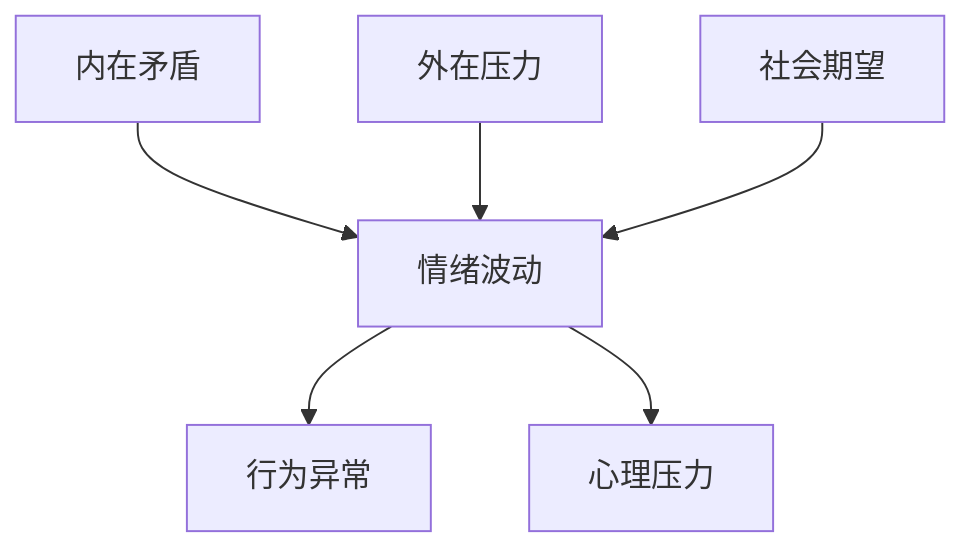
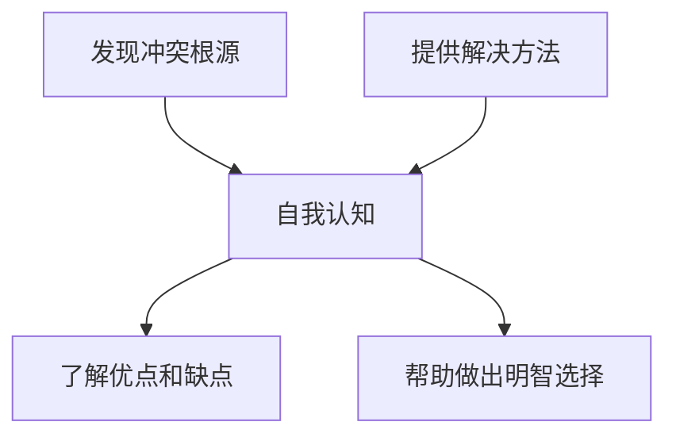
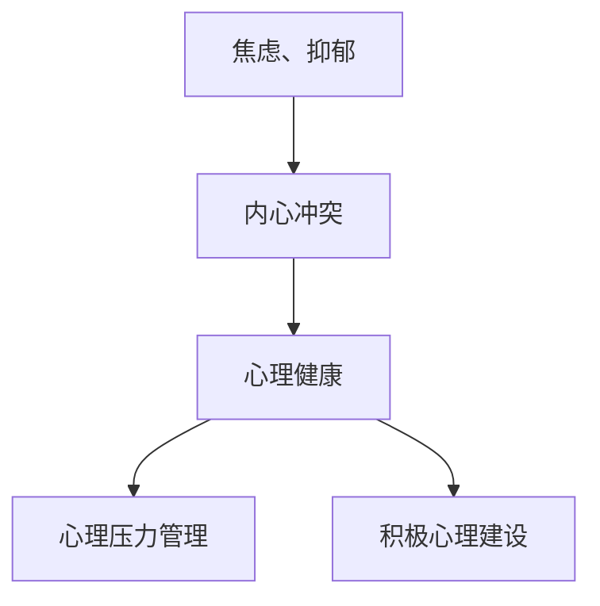
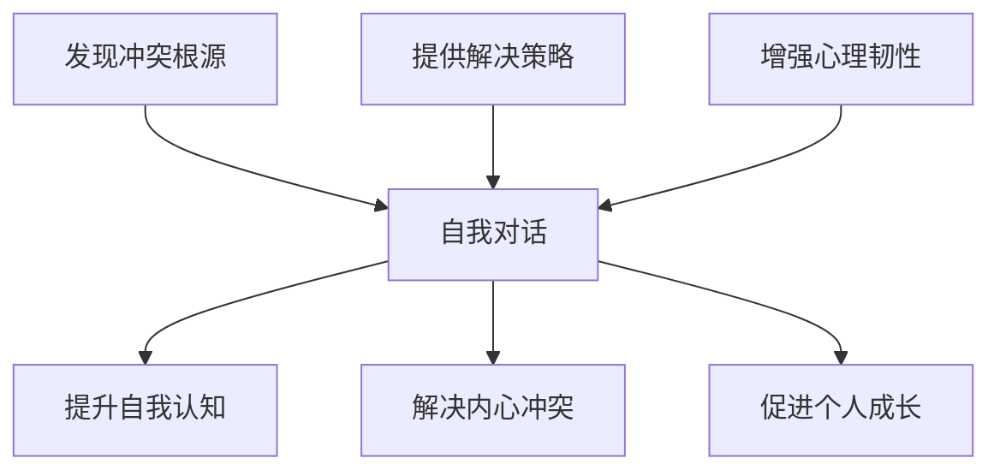
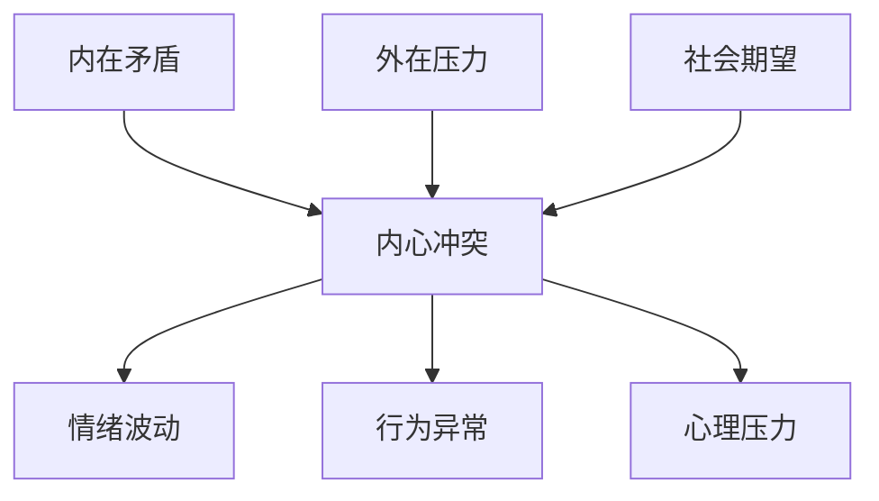

                 

### 引言

在现代信息技术飞速发展的时代，人工智能（AI）逐渐渗透到我们生活的方方面面。然而，随着技术的进步，人们面临的内心冲突也日益显现。这种冲突不仅体现在个人层面，也体现在职场和社会关系中。本文旨在探讨一种有效的自我和解方式，通过自我对话来化解内心冲突，提升个人心理素质和生活质量。

**背景介绍**：内心冲突是一个普遍存在的问题，其表现形式多种多样，如情绪波动、行为异常、心理压力等。这些冲突不仅影响个人的心理健康，还可能对人际关系和工作效率产生负面影响。因此，寻找有效的解决方案变得尤为重要。

**核心概念与联系**：自我对话是一种自我认知和自我调节的过程，通过与自己进行有意义的沟通，发现内心冲突的根源，并寻求解决方案。自我对话不仅有助于个人成长，还能在职场压力和人际关系中发挥积极作用。本文将通过多个章节详细探讨自我对话的概念、技巧和应用场景。

**目的**：本文旨在为读者提供一种系统的自我和解方式，通过自我对话来化解内心冲突。我们希望通过本文的讲解，读者能够掌握自我对话的技巧，并能在日常生活中加以实践，从而提升个人心理素质和生活质量。

**结构**：本文分为三个主要部分。第一部分将深入探讨内心冲突的本质、来源及其影响；第二部分将介绍自我对话的概念、技巧和应用场景；第三部分将通过案例研究展示自我对话在实际生活中的应用，并提供实践和提升的建议。

**核心关键词**：内心冲突、自我对话、心理素质、生活质量、个人成长、职场压力、人际关系。

通过上述结构，我们将逐步引导读者理解内心冲突的本质，掌握自我对话的技巧，并学会将其应用于实际生活中。接下来，让我们开始深入探讨内心冲突的各个方面。

### 第一部分：理解内心冲突

#### 第1章：内心冲突的本质

内心冲突是人们在生活中常常遇到的一种现象，其表现形式多种多样，如情绪波动、行为异常、心理压力等。理解内心冲突的本质，是化解这种冲突的第一步。

##### 1.1 内心冲突的表现形式

内心冲突的表现形式多种多样。最常见的包括以下几种：

1. **情绪波动**：人们常常感到焦虑、愤怒、沮丧等情绪，这些情绪会直接影响生活质量和工作效率。
   
2. **行为异常**：人们在内心冲突的影响下，可能会出现行为异常，如逃避问题、过度消费、暴力行为等。

3. **心理压力**：长期处于内心冲突中，人们会感到巨大的心理压力，这种压力会进一步加剧内心冲突。

##### 1.2 内心冲突的来源

内心冲突的来源复杂多样，主要包括以下几个方面：

1. **内在矛盾**：人们内心存在的矛盾，如理想与现实、自我期望与实际表现等，是导致内心冲突的主要原因。

2. **外在压力**：外部环境带来的压力，如工作压力、人际关系、经济压力等，也会引发内心冲突。

3. **社会期望**：社会对个人的期望往往很高，这种期望与个人实际表现之间的差距，也会导致内心冲突。

##### 1.3 内心冲突的影响

内心冲突对个人有着深远的影响，主要表现在以下几个方面：

1. **心理健康**：内心冲突会直接影响心理健康，导致焦虑、抑郁等心理问题。

2. **社会关系**：内心冲突会影响人际关系，导致人际矛盾和冲突。

3. **工作效率**：内心冲突会降低工作效率，影响职业发展。

为了更好地理解内心冲突，我们可以借助Mermaid流程图来展示其表现形式和来源：



通过上述流程图，我们可以清晰地看到内心冲突的各种表现形式和来源。了解这些信息，有助于我们更好地应对内心冲突。

#### 第2章：自我认知与内心冲突

自我认知是化解内心冲突的重要步骤。通过自我认知，我们可以了解自己的优点和缺点，从而更好地应对内心冲突。

##### 2.1 自我认知的重要性

自我认知对于个人成长和内心冲突的化解至关重要。具体来说，自我认知的重要性体现在以下几个方面：

1. **了解自己的优点和缺点**：通过自我认知，我们可以清楚地了解自己的优点和缺点，这有助于我们更好地发挥自己的优势，同时改进不足。

2. **帮助自己做出更明智的选择**：自我认知可以帮助我们更清晰地认识自己的需求和目标，从而做出更明智的选择，避免因冲动或盲目决策而导致的内心冲突。

##### 2.2 自我认知的方法

自我认知的方法多种多样，以下几种方法是比较常见和有效的：

1. **自我反思**：自我反思是一种通过回顾自己的行为和思考，来了解自己的方法。通过自我反思，我们可以发现自己的行为模式和心理状态，从而更好地了解自己。

2. **日记记录**：通过记录自己的日常生活、思考和感受，我们可以更好地了解自己的内心世界。日记记录可以帮助我们追踪自己的情绪变化和心理状态，从而发现内心的冲突。

3. **第三方反馈**：他人的反馈也是了解自己的重要途径。通过倾听他人的意见和建议，我们可以更全面地了解自己，从而更好地化解内心冲突。

##### 2.3 自我认知与内心冲突的关系

自我认知与内心冲突之间存在密切的关系。具体来说，自我认知可以以下几个方面帮助化解内心冲突：

1. **发现内心冲突的根源**：通过自我认知，我们可以更清晰地了解自己的内心冲突，找到其根源，从而有针对性地进行解决。

2. **提供解决内心冲突的方法**：自我认知可以帮助我们认识到自己的需求和目标，从而采取有效的方法来化解内心冲突，如调整心态、改变行为等。

为了更好地展示自我认知与内心冲突的关系，我们可以借助Mermaid流程图：



通过上述流程图，我们可以清晰地看到自我认知对于化解内心冲突的重要性。接下来，我们将进一步探讨内心冲突的核心问题，以帮助我们更好地理解这一复杂的现象。

#### 第3章：内心冲突的核心问题

内心冲突的核心问题往往是我们无法清晰认识和理解的部分。这些核心问题不仅困扰着我们的日常生活，还影响着我们的心理健康和人际关系。在探讨这些核心问题之前，我们需要先了解其表现形式和根源，然后提出解决思路。

##### 3.1 内心冲突的核心问题分析

内心冲突的核心问题主要包括以下几个方面：

1. **价值观冲突**：价值观冲突是指我们在面对不同价值观时产生的内心矛盾。例如，一个人在追求事业成功的同时，可能会因为家庭责任的负担而感到困惑。这种冲突可能导致情绪波动和行为异常。

2. **人际关系问题**：人际关系问题是指我们在与他人交往中产生的内心冲突。例如，在工作中，我们可能会因为与同事或上级的沟通不畅而产生矛盾。这种冲突会影响我们的工作效率和心理健康。

3. **自我认同问题**：自我认同问题是指我们对自己的认知和评价。例如，一个人可能会因为对自己的能力和价值感到怀疑，而产生内心冲突。这种冲突会影响我们的自信心和自尊心。

##### 3.2 解决内心冲突的思路

解决内心冲突需要从多个角度进行思考和行动。以下是一些常见的解决思路：

1. **接纳自己**：接纳自己是化解内心冲突的第一步。通过自我反思和自我认知，了解自己的优点和缺点，接受自己的不完美，从而减少内心的矛盾。

2. **沟通与理解**：在价值观冲突和人际关系问题中，沟通和理解是解决内心冲突的关键。通过有效的沟通，我们可以理解对方的立场和需求，从而找到解决问题的方法。

3. **寻求专业帮助**：在自我认同问题和严重内心冲突时，寻求专业帮助是必要的。心理咨询师、心理医生等专业人士可以提供专业的指导和帮助，帮助我们更好地应对内心冲突。

##### 3.3 心理健康与内心冲突的关系

心理健康与内心冲突密切相关。内心冲突会直接影响心理健康，导致焦虑、抑郁等心理问题。同时，心理健康问题也会加剧内心冲突。因此，维护心理健康是化解内心冲突的重要环节。

1. **心理压力管理**：学会管理和缓解心理压力，是维护心理健康的重要方法。通过运动、放松技巧、时间管理等方法，我们可以减轻心理压力，从而减少内心冲突。

2. **积极心理建设**：通过培养积极的心态和情绪，我们可以提高心理健康水平。积极心理建设包括自我肯定、目标设定、感恩练习等。

为了更好地展示心理健康与内心冲突的关系，我们可以借助Mermaid流程图：



通过上述流程图，我们可以清晰地看到心理健康与内心冲突之间的相互关系。理解这些关系，有助于我们更好地应对内心冲突，维护心理健康。

#### 总结

内心冲突是我们在生活中不可避免的现象，其核心问题包括价值观冲突、人际关系问题和自我认同问题。解决内心冲突需要我们从多个角度进行思考和行动，包括接纳自己、沟通与理解、寻求专业帮助以及维护心理健康。通过本文的探讨，我们希望读者能够更深入地理解内心冲突的本质，掌握解决内心冲突的思路，从而提升个人心理素质和生活质量。

### 第二部分：自我和解的对话方式

自我对话是一种独特的沟通方式，它通过与自己进行深入的对话，帮助我们更好地理解自己的内心世界，发现并解决内心冲突。自我对话不仅是自我认知的过程，也是自我调节和自我提升的重要手段。在这一部分，我们将详细探讨自我对话的概念、重要性、与内心冲突的解决关系，以及自我对话的基本步骤和技巧。

#### 第4章：自我对话的概念与作用

自我对话，顾名思义，是指与自己进行有意识、有目的的对话。这种对话不同于日常的自我思考，它是一种更加深入、系统、有组织的心理活动。自我对话的定义可以概括为以下几点：

1. **定义**：自我对话是一种通过语言和思维与自己进行深入交流的方式，旨在探索内心世界、理解自己的感受和需求，并寻找解决问题的方法。

2. **目的**：自我对话的主要目的是提升自我认知，解决内心冲突，促进个人成长和发展。

3. **特点**：自我对话具有以下特点：自主性、深入性、系统性、灵活性。

##### 4.1 自我对话的重要性

自我对话在个人成长和内心冲突的解决中扮演着重要角色。以下是自我对话的重要性体现：

1. **提升自我认知**：自我对话可以帮助我们深入了解自己的内心世界，包括情感、需求和价值观。这种自我认知是个人成长和发展的基础。

2. **解决内心冲突**：自我对话提供了一个安全的空间，让我们可以面对和处理内心冲突。通过自我对话，我们可以找出内心冲突的根源，并采取有效的措施进行解决。

3. **促进个人成长**：自我对话不仅帮助我们解决现有的问题，还帮助我们预见未来的挑战，并制定相应的策略。这种持续的自我对话过程，可以促使个人不断成长和进步。

##### 4.2 自我对话与内心冲突的解决关系

自我对话与内心冲突的解决之间存在密切的关系。具体来说，自我对话在以下方面有助于解决内心冲突：

1. **发现内心冲突的根源**：通过自我对话，我们可以深入探索自己的内心，找到内心冲突的根源。这种深入的探索有助于我们更准确地了解问题的本质，从而有针对性地进行解决。

2. **提供解决策略**：自我对话不仅帮助我们识别内心冲突，还为我们提供了解决策略。通过自我对话，我们可以思考并制定适合自己的解决方案，从而有效地缓解和消除内心冲突。

3. **增强心理韧性**：自我对话有助于提高个人的心理韧性，使我们能够更好地应对生活中的挑战和压力。通过自我对话，我们可以学会如何调整心态，保持内心的平衡和稳定。

为了更好地展示自我对话与内心冲突的解决关系，我们可以使用Mermaid流程图：



通过上述流程图，我们可以清晰地看到自我对话在个人成长和内心冲突解决中的作用。接下来，我们将进一步探讨自我对话的具体步骤和技巧。

#### 第5章：自我对话的技巧

自我对话是一种需要学习和实践的能力。以下是一些常见的自我对话技巧，这些技巧有助于我们更好地进行自我对话，提升效果。

##### 5.1 自我对话的基本步骤

自我对话的基本步骤可以概括为三个阶段：回顾过去、反思现在和规划未来。

1. **回顾过去**：在回顾过去的阶段，我们需要反思自己的行为、决策和经历，了解自己的优点和不足。这个过程有助于我们更好地认识自己，为解决内心冲突打下基础。

   ```mermaid
   graph TD
       A[回顾过去]
       B[反思行为]
       C[反思决策]
       D[反思经历]
       A --> B
       A --> C
       A --> D
   ```

2. **反思现在**：在反思现在的阶段，我们需要关注当前的情绪、心理状态和需求。通过自我对话，我们可以了解自己的内心世界，找到内心冲突的根源。

   ```mermaid
   graph TD
       A[反思现在]
       B[关注情绪]
       C[关注心理状态]
       D[关注需求]
       A --> B
       A --> C
       A --> D
   ```

3. **规划未来**：在规划未来的阶段，我们需要思考自己的目标和计划，并制定实现这些目标的具体行动。通过自我对话，我们可以明确自己的方向，减少内心的矛盾和焦虑。

   ```mermaid
   graph TD
       A[规划未来]
       B[思考目标]
       C[制定计划]
       D[制定行动]
       A --> B
       A --> C
       A --> D
   ```

##### 5.2 自我对话的常见问题

在自我对话的过程中，我们可能会遇到一些常见的问题。以下是一些常见的问题及其解决方法：

1. **如何处理负面情绪**：在自我对话中，我们可能会遇到负面情绪，如焦虑、愤怒和沮丧。处理负面情绪的关键在于接受它们，而不是逃避或压抑。以下是一些处理负面情绪的方法：

   - **深呼吸**：通过深呼吸来缓解紧张和焦虑。
   - **正面肯定**：用积极的语言和肯定来鼓励自己。
   - **表达感受**：通过写日记或与他人分享来表达自己的感受。

2. **如何面对内心的恐惧**：内心的恐惧往往源于未知和不确定性。面对内心的恐惧，我们可以采取以下方法：

   - **逐步面对**：从小事做起，逐步面对内心的恐惧。
   - **积极思考**：用积极的思维来克服恐惧。
   - **寻求支持**：与他人分享自己的恐惧，寻求他们的支持和鼓励。

3. **如何建立自我对话的习惯**：建立自我对话的习惯需要时间和毅力。以下是一些建议：

   - **设定固定时间**：每天设定一个固定的时间进行自我对话，如早晨或晚上。
   - **保持持续性**：自我对话是一个持续的过程，需要长期坚持。
   - **记录进展**：记录自我对话的进展和感受，以鼓励自己持续进行。

##### 5.3 自我对话的技巧提升

为了提升自我对话的效果，我们可以采取以下方法：

1. **借助专业工具和方法**：使用专业的工具和方法，如心理学书籍、在线课程和应用程序，可以帮助我们更好地进行自我对话。

2. **学习他人的成功经验**：通过阅读他人分享的自我对话经验和故事，我们可以学到许多有用的技巧和方法。

3. **定期进行自我对话**：定期进行自我对话，可以帮助我们养成自我对话的习惯，提高自我对话的效果。

#### 总结

自我对话是一种强大的自我认知和自我调节工具，它有助于我们解决内心冲突，提升个人成长和发展。通过了解自我对话的概念和作用，掌握自我对话的基本步骤和技巧，我们可以更好地进行自我对话，提升自我认知，化解内心冲突，实现个人成长。接下来，我们将探讨自我对话在不同应用场景中的实际应用，以帮助读者更好地理解并实践自我对话。

#### 第6章：自我对话的应用场景

自我对话作为一种强大的心理工具，可以在多种应用场景中发挥作用，帮助个人应对各种挑战。以下我们将探讨自我对话在个人成长、职场压力和人际关系中的应用，并提供一些实用的技巧。

##### 6.1 个人成长中的应用

自我对话在个人成长中的应用主要体现在以下几个方面：

1. **自我认知提升**：通过自我对话，个人可以深入了解自己的优点和缺点，明确自己的价值观和目标。这种自我认知有助于个人更好地规划自己的成长路径。

2. **情绪管理**：自我对话可以帮助个人识别和处理负面情绪，如焦虑、愤怒和沮丧。通过自我对话，个人可以找到情绪管理的有效方法，如深呼吸、正面肯定等。

3. **目标设定**：自我对话有助于个人设定具体、可衡量的目标，并制定实现这些目标的计划。通过自我对话，个人可以不断调整目标，确保其与自身的发展需求相符合。

4. **持续反思**：自我对话可以帮助个人养成持续反思的习惯，不断检视自己的行为和决策，从中吸取经验教训，为未来的发展做好准备。

##### 6.2 职场压力中的应用

职场压力是许多人在工作中面临的主要挑战之一。自我对话在缓解职场压力方面具有显著作用：

1. **压力管理**：通过自我对话，个人可以识别和评估工作压力的来源，并采取相应的措施进行缓解。例如，通过深呼吸和放松技巧来减轻紧张和焦虑。

2. **决策支持**：自我对话可以帮助个人在工作决策中保持冷静和理性，避免因情绪波动而做出错误的决定。

3. **职场冲突解决**：自我对话有助于个人在处理职场冲突时，采取更加成熟和建设性的方法。通过自我对话，个人可以更好地理解他人的立场和需求，从而找到解决问题的方法。

4. **职业规划**：自我对话可以帮助个人评估自己的职业目标和发展路径，确保自己在职场上的每一步都朝着既定目标迈进。

##### 6.3 人际关系中的应用

人际关系是影响个人生活质量的重要因素。自我对话在改善人际关系方面发挥着关键作用：

1. **沟通能力提升**：自我对话可以帮助个人提高沟通能力，更好地表达自己的情感和需求。通过自我对话，个人可以预见到可能的沟通障碍，并采取相应的策略进行应对。

2. **冲突解决**：在人际关系中，冲突是不可避免的。自我对话可以帮助个人在面对冲突时保持冷静，通过理性思考和有效沟通来解决问题。

3. **建立信任**：自我对话有助于个人建立和维护信任关系。通过自我对话，个人可以更好地理解他人的情感和需求，从而建立更深层次的信任。

4. **情感支持**：在人际关系中，情感支持是不可或缺的。自我对话可以帮助个人在需要支持时，找到合适的方法和途径来寻求帮助，同时也能够为他人提供情感支持。

##### 实用技巧

为了更好地应用自我对话，以下是一些实用的技巧：

1. **设定具体目标**：在自我对话中，设定具体、可衡量的目标是提升自我对话效果的关键。例如，将“提高沟通能力”具体化为“每周进行一次公开演讲练习”。

2. **记录进展**：记录自我对话的进展和感受可以帮助个人追踪自己的成长轨迹，并为未来的自我对话提供参考。

3. **保持一致性**：定期进行自我对话，保持一致性，是养成自我对话习惯的关键。例如，每天晚上睡前花15分钟进行自我对话。

4. **倾听他人**：在自我对话中，不仅要关注自己的内心世界，还要倾听他人的意见和反馈。通过倾听他人，个人可以更全面地了解自己的表现和需求。

5. **积极应对**：在自我对话中，遇到困难和挑战时，要积极应对，不要回避。通过积极的思考和行动，个人可以逐步克服内心的障碍。

#### 总结

自我对话作为一种有效的心理工具，在个人成长、职场压力和人际关系中具有广泛的应用。通过了解自我对话在不同场景中的应用，并掌握一些实用的技巧，个人可以更好地应对各种挑战，提升自我认知，实现个人成长。接下来，我们将通过一些案例研究，进一步展示自我对话在实际生活中的应用和效果。

#### 第7章：自我和解的案例研究

在本章节中，我们将通过几个具体的案例，展示如何通过自我对话来化解内心冲突，实现自我和解。这些案例涵盖了个人成长、职场压力和人际关系等多个方面，通过这些真实的故事，我们将看到自我对话如何在实践中发挥作用。

##### 7.1 案例一：成功化解内心冲突的实例

**背景介绍**：李明是一名年轻的工程师，他在工作中表现出色，但由于工作压力和个人生活的压力，他常常感到焦虑和沮丧。这种情绪波动不仅影响了他自己的生活质量，还影响了他的工作效率和人际关系。

**自我对话的实践**：李明决定通过自我对话来化解内心冲突。他每天晚上都会花30分钟进行自我对话，回顾当天的工作和生活，反思自己的情绪和行为，并设定第二天的目标和计划。

1. **回顾过去**：李明会回顾当天的工作，思考自己哪些方面做得好，哪些方面需要改进。同时，他也会反思自己的情绪波动，理解情绪背后的原因。

   ```mermaid
   graph TD
       A[回顾过去]
       B[工作表现]
       C[情绪波动]
       A --> B
       A --> C
   ```

2. **反思现在**：李明会关注自己当前的情绪和心理状态，通过自我对话来理解这些情绪的来源。他发现，自己的焦虑和沮丧主要是由于对未来的不确定性和工作压力造成的。

   ```mermaid
   graph TD
       A[反思现在]
       B[焦虑来源]
       C[沮丧原因]
       A --> B
       A --> C
   ```

3. **规划未来**：李明会思考自己的职业目标和人生规划，并制定实现这些目标的计划。他决定将工作与个人生活分开，确保有足够的时间来放松和充电。

   ```mermaid
   graph TD
       A[规划未来]
       B[职业目标]
       C[生活规划]
       A --> B
       A --> C
   ```

**结果**：通过几个月的自我对话实践，李明的焦虑和沮丧情绪显著减轻，他的工作效率和生活质量都得到了提升。他学会了更好地管理自己的情绪，同时也与家人和朋友建立了更深厚的关系。

##### 7.2 案例二：通过自我对话实现自我提升的实例

**背景介绍**：张丽是一名职场新晋管理者，她在面对工作中的挑战时，常常感到自己缺乏领导力和决策能力。这种自我怀疑导致她在工作中犹豫不决，影响了团队的士气和绩效。

**自我对话的实践**：张丽决定通过自我对话来提升自己的领导力和决策能力。她每周都会进行一次自我对话，回顾自己的工作和决策，寻找提升的方法。

1. **回顾过去**：张丽会回顾自己的工作表现，思考自己在哪些方面做得好，哪些方面需要改进。她特别关注自己的决策过程，分析决策成功和失败的原因。

   ```mermaid
   graph TD
       A[回顾过去]
       B[工作表现]
       C[决策过程]
       A --> B
       A --> C
   ```

2. **反思现在**：张丽会反思自己的领导风格和决策方法，通过自我对话来识别自己的优势和不足。她意识到自己需要更多地倾听团队成员的意见，并学会做出更有远见的决策。

   ```mermaid
   graph TD
       A[反思现在]
       B[领导风格]
       C[决策方法]
       A --> B
       A --> C
   ```

3. **规划未来**：张丽会制定具体的行动计划，包括提升自己的领导力和决策能力。她决定参加相关的培训课程，并定期与团队成员进行反馈和交流。

   ```mermaid
   graph TD
       A[规划未来]
       B[提升计划]
       C[行动计划]
       A --> B
       A --> C
   ```

**结果**：通过持续的自我对话和实践，张丽的领导力和决策能力得到了显著提升。她变得更加自信和果断，团队的士气和绩效也大幅提升。张丽学会了如何通过自我对话来实现自我提升，并在工作中取得了更好的成果。

##### 7.3 案例三：在人际关系中运用自我对话的实例

**背景介绍**：王强和妻子关系紧张，经常因为生活中的琐事发生争吵。这种争吵不仅影响了他们的感情，也影响了他们的生活质量。

**自我对话的实践**：王强决定通过自我对话来改善与妻子的关系。他开始每天晚上与妻子进行自我对话，分享自己的感受和需求，也倾听妻子的想法。

1. **回顾过去**：王强会回顾当天与妻子的互动，思考哪些地方做得好，哪些地方需要改进。他特别关注自己的情绪反应，分析争吵背后的原因。

   ```mermaid
   graph TD
       A[回顾过去]
       B[互动表现]
       C[情绪反应]
       A --> B
       A --> C
   ```

2. **反思现在**：王强会反思自己的沟通方式，尝试从妻子的角度看问题。他意识到自己需要更多地倾听和理解妻子的需求，而不是一味地表达自己的意见。

   ```mermaid
   graph TD
       A[反思现在]
       B[沟通方式]
       C[理解需求]
       A --> B
       A --> C
   ```

3. **规划未来**：王强和妻子一起制定了一个沟通计划，包括每周一次的深度对话时间，以及一些改进沟通的技巧。他们决定通过自我对话来建立更健康的沟通模式。

   ```mermaid
   graph TD
       A[规划未来]
       B[沟通计划]
       C[改进技巧]
       A --> B
       A --> C
   ```

**结果**：通过自我对话的实践，王强和妻子的关系得到了显著改善。他们学会了更好地沟通和理解对方，争吵减少，感情更加稳定。王强意识到，自我对话不仅有助于个人成长，也有助于改善人际关系。

#### 总结

通过上述案例研究，我们可以看到自我对话在个人成长、职场压力和人际关系中的应用效果。无论是通过自我对话来化解内心冲突，实现自我提升，还是通过自我对话来改善人际关系，自我对话都发挥着重要作用。这些案例证明了自我对话的实用性和有效性，也为读者提供了具体的实践方法和思路。在下一章节中，我们将进一步探讨如何建立自我和解的长期实践，帮助读者持续提升自我和解能力。

### 第8章：自我和解的长期实践

自我和解不仅仅是短期的自我对话实践，而是一个需要长期坚持和不断调整的过程。为了实现真正的自我和解，我们需要建立一系列的长期实践习惯，并在实践中不断反思和调整。以下是一些具体的方法和建议，以帮助读者在日常生活中持续实践自我和解。

#### 8.1 建立自我对话的习惯

建立自我对话的习惯是自我和解的重要基础。以下是一些具体的方法：

1. **设定固定时间**：每天设定一个固定的时间进行自我对话，例如早晨或晚上。这样可以确保自我对话的持续性和一致性。

2. **保持持续性**：自我对话是一个长期的过程，需要持续不断地进行。即使有时感到疲惫或困倦，也要坚持进行自我对话。

3. **记录进展**：记录自我对话的进展和感受，可以帮助你追踪自己的成长轨迹，并为未来的自我对话提供参考。

4. **设定具体目标**：在自我对话中，设定具体、可衡量的目标是提升自我对话效果的关键。例如，将“提高沟通能力”具体化为“每周进行一次公开演讲练习”。

5. **多样化自我对话形式**：除了传统的文字记录，还可以尝试其他形式，如录音、绘画或身体运动等。多样化的自我对话形式可以增加自我对话的趣味性和多样性。

#### 8.2 持续关注内心冲突的变化

内心冲突是一个动态变化的过程，为了实现真正的自我和解，我们需要持续关注内心冲突的变化。以下是一些具体的方法：

1. **定期反思**：定期反思自己的情绪和行为，了解内心冲突的变化。例如，每周进行一次全面的内心反思，总结自己的情绪波动和冲突点。

2. **记录情绪变化**：通过记录自己的情绪变化，可以更好地了解内心冲突的根源。例如，记录每天的的情绪状态和引发情绪波动的事件。

3. **识别触发点**：通过自我对话和反思，识别那些容易引发内心冲突的触发点。一旦发现触发点，可以采取相应的预防措施，避免冲突的发生。

4. **调整心态**：在内心冲突发生时，保持冷静和理性，避免过度情绪化。通过自我对话，调整自己的心态，找到解决问题的方法。

#### 8.3 自我和解的持续提升

自我和解是一个持续提升的过程，需要不断地学习、实践和反思。以下是一些具体的方法：

1. **学习相关知识**：通过阅读相关书籍、观看视频或参加培训课程，了解自我和解的理论和实践方法。

2. **寻求专业帮助**：在自我和解的过程中，如果遇到困难或挑战，可以寻求心理咨询师或心理学专业人士的帮助。他们可以提供专业的指导和帮助。

3. **反思和总结**：定期反思自己的自我和解实践，总结成功和失败的经验，为未来的自我和解提供参考。

4. **培养积极心态**：积极的心态是自我和解的关键。通过自我对话和反思，培养乐观、自信和包容的心态，有助于提升自我和解的效果。

5. **持续实践**：自我和解需要持续不断的实践。通过在日常生活中的小事中进行自我对话，如处理日常事务、应对工作挑战等，可以将自我和解的理念融入到日常生活中。

#### 实践中的注意事项

在自我和解的长期实践中，需要注意以下几点：

1. **不要急于求成**：自我和解是一个长期的过程，需要时间和耐心。不要期望短期内就能看到显著的效果，要给自己足够的时间来调整和适应。

2. **接受自己的不完美**：在自我和解的过程中，要接受自己的不完美，认识到每个人都有优点和缺点。不要对自己过于苛刻，要给自己足够的宽容。

3. **保持开放心态**：自我和解需要保持开放的心态，接受不同的观点和意见。通过自我对话和反思，了解自己的偏见和盲点，并努力改进。

4. **持续学习和成长**：自我和解是一个持续学习和成长的过程。要不断学习新的知识和技能，不断提升自己的认知和能力。

通过上述长期实践方法，我们可以逐步实现自我和解，提升个人心理素质和生活质量。在下一章节中，我们将进一步探讨如何将自我对话与心理治疗相结合，以深化自我和解的过程。

### 第9章：自我和解的深化

自我和解是一个多层次、多维度的过程，不仅涉及个人的内心世界，还涉及到心理健康和整体幸福感。在这一章中，我们将探讨如何将自我对话与心理治疗相结合，深化自我和解的过程，并探讨自我和解在个人成长和组织发展中的深化应用。

#### 9.1 自我对话与心理治疗的结合

自我对话和心理治疗是两种不同的方法，但它们可以相互补充，共同促进个人成长和心理健康。以下是自我对话与心理治疗结合的一些方法：

1. **认知行为疗法（CBT）**：认知行为疗法是一种通过改变思维和行为来改善情绪和心理健康的治疗方法。在CBT中，自我对话是一种重要的工具，帮助患者识别和改变负面思维模式。通过自我对话，患者可以反思自己的信念和假设，并探索这些信念对其情绪和行为的影响。

   ```mermaid
   graph TD
       A[认知行为疗法]
       B[自我对话]
       C[负面思维模式]
       D[情绪和行为]
       A --> B
       B --> C
       B --> D
   ```

2. **存在主义疗法**：存在主义疗法关注个人存在的意义和目的，通过自我对话帮助患者探索自我、生活意义和价值观。在存在主义疗法中，自我对话是一种重要的方法，帮助患者找到内心的平静和方向。

   ```mermaid
   graph TD
       A[存在主义疗法]
       B[自我对话]
       C[生活意义]
       D[价值观]
       A --> B
       B --> C
       B --> D
   ```

3. **精神分析疗法**：精神分析疗法通过挖掘潜意识中的冲突和痛苦，帮助患者理解内心的矛盾和问题的根源。在精神分析疗法中，自我对话可以帮助患者深入探索自己的潜意识，并找到解决问题的方法。

   ```mermaid
   graph TD
       A[精神分析疗法]
       B[自我对话]
       C[潜意识冲突]
       D[问题根源]
       A --> B
       B --> C
       B --> D
   ```

通过将自我对话与心理治疗相结合，患者可以在自我探索和外部治疗的支持下，更全面地了解自己的内心世界，并采取有效的措施来解决内心冲突。

#### 9.2 自我和解在个人成长中的深化

自我和解在个人成长中发挥着重要作用，通过深化自我对话，我们可以实现更深层次的个人成长。以下是几个方面的深化应用：

1. **情感成长**：通过深化自我对话，我们可以更好地理解自己的情感，包括情感的来源、情感的表达和情感的调节。这有助于我们建立更健康的情感关系，提升情感智力。

2. **认知成长**：自我对话可以帮助我们不断地反思和更新自己的认知，包括知识、信念和观念。通过自我对话，我们可以扩展自己的认知边界，提升批判性思维和创造性思维。

3. **精神成长**：自我对话还可以帮助我们探索精神层面的成长，包括对生命意义的理解、对自我价值的认知和对内在力量的发现。这有助于我们建立强大的精神内核，提升心理韧性。

4. **自我效能感提升**：通过深化自我对话，我们可以更好地理解自己的能力，包括自身的优势和不足。这有助于我们提升自我效能感，增强面对挑战的信心和勇气。

#### 9.3 自我和解在组织中的推广

自我和解不仅对个人成长有益，也可以在组织层面发挥作用，提升组织文化和员工幸福感。以下是自我和解在组织中的推广方法：

1. **组织内自我对话工作坊**：通过组织内自我对话工作坊，帮助员工掌握自我对话的技巧，提升自我认知和心理素质。这种工作坊可以定期举办，以持续推动员工自我成长。

2. **建立自我对话文化**：通过鼓励员工在日常工作中进行自我对话，建立一种自我反思和自我提升的文化。这可以促进员工的个人成长，同时提升组织的整体绩效。

3. **领导力培训**：通过领导力培训，帮助领导者掌握自我对话的技巧，提升领导力水平和心理健康。领导者可以通过自我对话来更好地理解员工需求，提升领导效果。

4. **心理辅导服务**：提供心理辅导服务，帮助员工解决内心冲突，提升心理健康水平。这可以包括个人心理辅导、团队心理辅导和在线心理咨询服务等。

通过在组织中的推广，自我和解可以提升员工的幸福感，增强团队凝聚力，促进组织文化的建设。

#### 总结

自我和解是一个多层次、多维度的过程，通过将自我对话与心理治疗相结合，可以在个人成长和组织发展中发挥重要作用。深化自我对话，不仅有助于提升个人心理健康，还可以促进组织文化的建设。通过本文的探讨，我们希望读者能够更好地理解自我和解的重要性，并在个人成长和工作中加以实践。

### 参考文献

1. Berne, E. (1964). 《The Games People Play: The Psychology of Human Relationships as a Manual for Relationships, Games and Society》. Bantam Books.
2. Meier, B. P., & Kirchler, M. E. (2018). 《Feelings of Justice and Fairness at Work: Research on Affective and Distributive Justice》。Springer.
3. Greenberg, J., & Baron, R. A. (2017). 《Behavior in Organizations》。Worth Publishers.
4. Burns, D. D. (1999). 《The Feeling Good Handbook》。Guilford Press.
5. Rogers, C. R. (1959). 《A Theory of Therapy, Personality, and Interpersonal Relationships, as Developed in the Client-Centered Framework》。Nelson-Hall.

### 附录

#### A.1 内心冲突的Mermaid流程图



#### A.2 自我对话的伪代码示例

```python
class SelfDialogue:
    def __init__(self):
        self.current_mood = "Neutral"
        self.conflicts = []

    def reflect_past(self):
        print("Reflecting on past actions and decisions...")
        # Code to analyze past behavior and decisions

    def reflect_now(self):
        print("Reflecting on current mood and needs...")
        # Code to analyze current emotional state and needs

    def plan_future(self):
        print("Planning for future goals and actions...")
        # Code to set goals and plan actions

    def resolve_conflicts(self):
        print("Resolving inner conflicts...")
        # Code to identify and resolve conflicts

    def manage_emotions(self):
        print("Managing negative emotions...")
        # Code to manage negative emotions

    def handle_fears(self):
        print("Handling inner fears...")
        # Code to handle fears

    def improve_communication(self):
        print("Improving communication skills...")
        # Code to improve communication skills

    def build_trust(self):
        print("Building trust in relationships...")
        # Code to build trust in relationships

# Example usage
dialogue = SelfDialogue()
dialogue.reflect_past()
dialogue.reflect_now()
dialogue.plan_future()
dialogue.resolve_conflicts()
dialogue.manage_emotions()
dialogue.handle_fears()
dialogue.improve_communication()
dialogue.build_trust()
```

### 结语

本文探讨了自我和解的重要性，通过自我对话来化解内心冲突，提升个人心理素质和生活质量。我们详细介绍了内心冲突的本质、自我对话的概念与作用，以及自我对话在个人成长、职场压力和人际关系中的应用。通过案例研究和长期实践方法，我们展示了自我对话的实用性和有效性。

自我对话不仅有助于个人成长，还能在组织发展中发挥重要作用，提升组织文化和员工幸福感。在未来的发展中，我们建议读者继续学习和实践自我对话，结合心理治疗的理论和方法，深化自我和解的过程。

在个人层面，我们可以通过定期自我对话、记录情绪变化、设定具体目标等方式，建立自我对话的习惯。在组织层面，可以通过组织内自我对话工作坊、建立自我对话文化、提供心理辅导服务等方式，推广自我对话的理念。

最后，我们鼓励读者持续关注内心冲突的变化，保持积极的心态，不断学习和成长。通过自我对话，我们可以更好地理解自己，化解内心冲突，实现真正的自我和解。希望本文能够为读者提供有益的启示和帮助。作者：AI天才研究院/AI Genius Institute & 禅与计算机程序设计艺术 /Zen And The Art of Computer Programming。

