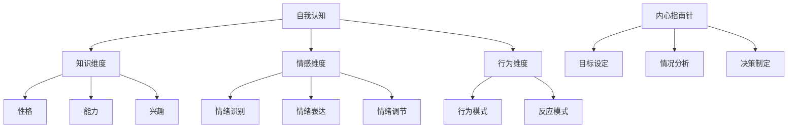
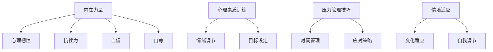
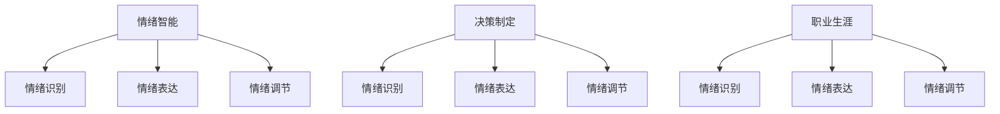
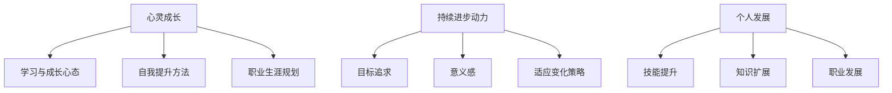
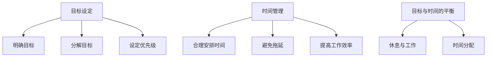
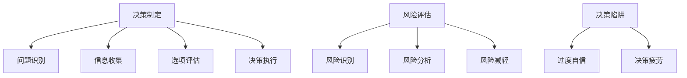
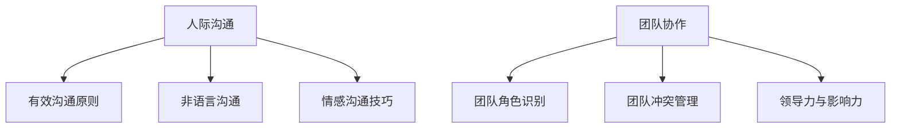
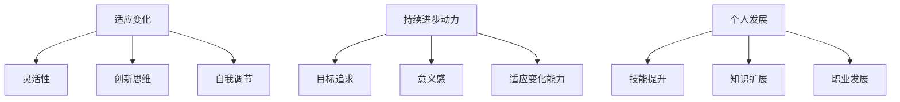
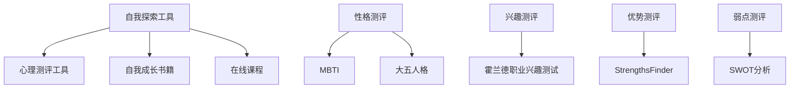

                 


### 文章标题：《内心指南针：在复杂世界中找准方向》

#### 关键词：
- 自我认知
- 复杂决策
- 情绪管理
- 时间管理
- 团队协作
- 个人成长

#### 摘要：
本文旨在探讨如何在复杂多变的环境中，通过自我认知、情绪管理、时间管理和团队协作等策略，找到内心的指南针，确保个人和职业发展的方向正确。文章将分为两部分：第一部分关注自我认知与内在力量的挖掘，包括自我探索、内在力量的培养和情绪智能的增强；第二部分则聚焦于复杂世界中的导航策略，包括目标设定、决策制定、人际沟通与团队协作以及适应变化的能力。通过这些策略，读者可以更好地理解自己在复杂环境中的角色，找到并保持前进的方向。

---

### 第一部分：自我认知与内在力量

#### 第1章：认识自我，拥抱复杂

在复杂的世界中，了解自己是找到方向的第一步。自我认知不仅仅是对自身性格、能力和兴趣的了解，更是对自身在复杂环境中反应方式的洞察。本章将探讨自我认知的复杂性、内心指南针的概念及其作用，以及如何通过内省和个性测评工具进行自我探索。

#### 核心概念与联系

自我认知是一个多维度、动态变化的过程，涉及知识、情感和行为。理解自我认知的复杂性对于制定个人发展计划至关重要。内心指南针则是这一过程中的导航工具，它帮助我们识别目标、分析情况并作出决策。



#### 核心算法原理讲解

为了更深入地理解自我认知的过程，我们可以使用以下伪代码来描述核心算法：

```python
def self_cognition():
    # 收集个人信息
    knowledge, emotions, behavior = gather_data()
    
    # 分析性格、能力和兴趣
    character, ability, interest = analyze_knowledge(knowledge)
    
    # 识别情绪和行为模式
    mood, behavior_pattern = analyze_emotions(emotions)
    
    # 确定目标与指南针
    goal = set_goal(character, ability, interest)
    guide_pin = create_guide_pin(goal)

    return guide_pin
```

#### 数学模型和数学公式

在分析自我认知的过程中，可以使用以下LaTeX公式来表示不同维度的关系：

$$
Self_Cognition = \frac{Knowledge \times Emotions \times Behavior}{Time}
$$

其中，$Knowledge$代表知识维度，$Emotions$代表情感维度，$Behavior$代表行为维度，$Time$代表时间因素。

#### 举例说明

假设一个人希望找到适合自己的职业方向，他可以通过以下步骤进行自我认知：

1. 收集个人信息，包括学历、工作经历、兴趣爱好和性格特点。
2. 分析知识维度，确定自己的专业能力和兴趣点。
3. 分析情感维度，识别自己的情绪模式并学会调节。
4. 分析行为维度，观察自己的行为习惯和反应模式。
5. 根据上述分析，设定职业目标并创建内心指南针，以指导未来的职业选择。

---

### 第2章：内在力量的挖掘与培养

内在力量是我们在复杂环境中保持方向和应对挑战的关键。本章将探讨内在力量的定义、培养方法以及如何在变化中自我调整。我们将通过心理素质训练、压力管理技巧和情境适应策略来增强内在力量。

#### 核心概念与联系

内在力量包括心理韧性、抗挫力、自信和自尊等要素。这些要素相互作用，共同构成我们在复杂环境中的支撑力量。通过心理素质训练和压力管理，我们可以提高自己的心理韧性，从而更好地适应变化。



#### 核心算法原理讲解

为了培养内在力量，我们可以使用以下伪代码来描述核心算法：

```python
def cultivate_inner_strength():
    # 初始化内在力量指标
    resilience, tenacity, confidence, self_esteem = initialize_strength_indices()
    
    # 进行心理素质训练
    resilience = psychological_training(resilience)
    confidence = confidence_building(confidence)
    
    # 应对压力和挑战
    stress_management = stress_management_strategy()
    
    # 适应变化
    adapt_to_changes = adapt_to_environment()
    
    # 调整内在力量指标
    resilience, tenacity, confidence, self_esteem = adjust_strength_indices(resilience, tenacity, confidence, self_esteem)

    return resilience, tenacity, confidence, self_esteem
```

#### 数学模型和数学公式

在培养内在力量的过程中，我们可以使用以下LaTeX公式来表示内在力量指标的变化：

$$
Strength = f(Resilience, Tenacity, Confidence, Self_Esteem)
$$

其中，$Strength$代表内在力量的总体水平，$Resilience$代表心理韧性，$Tenacity$代表抗挫力，$Confidence$代表自信，$Self_Esteem$代表自尊。

#### 举例说明

假设一个人在职场中遭遇了重大挫折，他可以通过以下步骤来挖掘和培养内在力量：

1. 分析挫折的原因，了解自己的情绪反应。
2. 进行心理素质训练，学会情绪调节和目标设定。
3. 实施压力管理技巧，学会时间管理和应对策略。
4. 适应环境变化，提高自己的抗挫力和自信。

通过这些步骤，他可以逐步恢复内在力量，重新找到方向。

---

### 第3章：情绪智能与情感导航

情绪智能是我们在复杂环境中导航的重要工具。本章将探讨情绪智能的概念、增强方法以及在决策和职业生涯中的应用。通过情绪识别、情绪表达和情绪调节，我们可以提高自己的情绪智能，从而在复杂环境中更好地导航。

#### 核心概念与联系

情绪智能包括情绪识别、情绪表达和情绪调节三个主要方面。情绪识别使我们能够准确感知自己的情绪，情绪表达使我们能够有效地传达情绪，情绪调节使我们能够管理和控制情绪。



#### 核心算法原理讲解

为了增强情绪智能，我们可以使用以下伪代码来描述核心算法：

```python
def enhance_emotional_intelligence():
    # 初始化情绪智能指标
    recognition, expression, regulation = initialize_emotional_indices()
    
    # 情绪识别训练
    recognition = recognition_training(recognition)
    
    # 情绪表达训练
    expression = expression_training(expression)
    
    # 情绪调节训练
    regulation = regulation_training(regulation)
    
    # 应用情绪智能于决策和职业生涯
    decision_making = apply_to_decision_making(F, G, H)
    career_navigation = apply_to_career(J, K, L)

    return recognition, expression, regulation, decision_making, career_navigation
```

#### 数学模型和数学公式

在增强情绪智能的过程中，我们可以使用以下LaTeX公式来表示情绪智能指标的变化：

$$
Emotional_Intelligence = f(Recognition, Expression, Regulation)
$$

其中，$Recognition$代表情绪识别能力，$Expression$代表情绪表达能力，$Regulation$代表情绪调节能力。

#### 举例说明

假设一个人在面临重要职业决策时，他可以通过以下步骤来增强情绪智能：

1. 通过情绪识别训练，了解自己的情绪状态。
2. 通过情绪表达训练，学会如何有效地表达情绪。
3. 通过情绪调节训练，学会管理和控制情绪。
4. 将情绪智能应用于决策过程，提高决策质量。

通过这些步骤，他可以更好地理解自己的情绪，做出更明智的职业选择。

---

### 第4章：心灵成长与持续进步

心灵成长是我们在复杂世界中导航的重要一环。本章将探讨心灵成长的路径、持续进步的动力以及心灵成长与个人发展之间的关系。通过学习与成长的心态、自我提升的方法和职业生涯规划，我们可以实现持续的心灵成长。

#### 核心概念与联系

心灵成长涉及学习与成长的心态、自我提升的方法和职业生涯规划。学习与成长的心态使我们保持好奇心和开放性，自我提升的方法帮助我们提高技能和知识，职业生涯规划则确保我们的发展方向与目标一致。



#### 核心算法原理讲解

为了实现心灵成长，我们可以使用以下伪代码来描述核心算法：

```python
def spiritual_growth():
    # 初始化心灵成长指标
    mindset, self_improvement, career Planning = initialize_growth_indices()
    
    # 培养学习与成长心态
    mindset = cultivate_mindset()
    
    # 实施自我提升方法
    self_improvement = implement_self_improvement_methods()
    
    # 制定职业生涯规划
    career_planning = create_career_plan()

    # 持续进步的动力
    motivation = sustain_progress动力()
    
    # 个人发展
    personal_development = achieve_personal_growth()

    return mindset, self_improvement, career_planning, motivation, personal_development
```

#### 数学模型和数学公式

在实现心灵成长的过程中，我们可以使用以下LaTeX公式来表示心灵成长指标的变化：

$$
Spiritual_Growth = f(Mindset, Self_Improvement, Career_Planning)
$$

其中，$Mindset$代表学习与成长心态，$Self_Improvement$代表自我提升方法，$Career_Planning$代表职业生涯规划。

#### 举例说明

假设一个人希望实现心灵成长，他可以通过以下步骤：

1. 培养学习与成长的心态，保持好奇心和开放性。
2. 实施自我提升方法，通过学习新技能和知识来提高自己。
3. 制定职业生涯规划，确保自己的发展方向与目标一致。
4. 保持持续进步的动力，通过目标追求和意义感来激励自己。

通过这些步骤，他可以逐步实现心灵成长，找到更清晰的方向。

---

### 第二部分：复杂世界中的导航策略

#### 第5章：目标设定与时间管理

在复杂的世界中，明确的目标和有效的时间管理是确保我们朝着正确方向前进的关键。本章将探讨目标设定的原则、时间管理技巧以及如何平衡目标和时间。

#### 核心概念与联系

目标设定涉及明确目标、分解目标和设定优先级。时间管理则涉及合理安排时间、避免拖延和提高工作效率。通过这些策略，我们可以确保在复杂环境中保持方向感。



#### 核心算法原理讲解

为了实现目标设定和时间管理，我们可以使用以下伪代码来描述核心算法：

```python
def goal_and_time_management():
    # 初始化目标设定和时间管理指标
    goals, time_management = initialize_goal_and_time_indices()
    
    # 设定明确的目标
    goals = set_clear_goals()
    
    # 分解目标
    goals = decompose_goals(goals)
    
    # 设定优先级
    goals = set_priorities(goals)
    
    # 实施时间管理
    time_management = implement_time_management_strategy()
    
    # 平衡目标与时间
    balance_goals_and_time = balance_goals_with_time()

    return goals, time_management
```

#### 数学模型和数学公式

在目标设定和时间管理的过程中，我们可以使用以下LaTeX公式来表示目标与时间的关系：

$$
Goal Achievement = f(Goals, Time_Management)
$$

其中，$Goals$代表目标设定，$Time_Management$代表时间管理。

#### 举例说明

假设一个人希望在未来一年内完成一个重要项目，他可以通过以下步骤：

1. 设定明确的目标，例如“在年底前完成项目报告”。
2. 分解目标，将其分为多个可管理的任务。
3. 设定优先级，确定哪些任务是最重要的。
4. 实施时间管理策略，合理安排时间并避免拖延。

通过这些步骤，他可以确保在复杂环境中有效地管理时间和达成目标。

---

### 第6章：决策制定与风险评估

在复杂的世界中，做出明智的决策是至关重要的。本章将探讨决策制定的过程、风险评估的方法以及如何避免决策陷阱。通过这些策略，我们可以提高决策的质量和效率。

#### 核心概念与联系

决策制定涉及问题识别、信息收集、选项评估和决策执行。风险评估则涉及风险识别、风险分析和风险减轻。避免决策陷阱需要保持开放性、客观性和理性。



#### 核心算法原理讲解

为了实现决策制定和风险评估，我们可以使用以下伪代码来描述核心算法：

```python
def decision_making_and_risk_assessment():
    # 初始化决策制定和风险评估指标
    decision, risk_assessment = initialize_decision_and_risk_indices()
    
    # 问题识别
    problem = identify_problem()
    
    # 信息收集
    information = gather_information()
    
    # 选项评估
    options = evaluate_options()
    
    # 决策执行
    decision = execute_decision()
    
    # 风险识别
    risks = identify_risks()
    
    # 风险分析
    risk_analysis = analyze_risks(risks)
    
    # 风险减轻
    risk_reduction = reduce_risks(risk_analysis)
    
    # 避免决策陷阱
    avoid_traps = avoid_decision_traps()

    return decision, risk_assessment, avoid_traps
```

#### 数学模型和数学公式

在决策制定和风险评估的过程中，我们可以使用以下LaTeX公式来表示决策和风险的关系：

$$
Decision_Quality = f(Information, Options, Risk_Assessment)
$$

其中，$Information$代表信息质量，$Options$代表选项评估，$Risk_Assessment$代表风险评估。

#### 举例说明

假设一个人面临是否购买股票的决策，他可以通过以下步骤：

1. 识别问题，例如“是否应该投资股票？”。
2. 收集相关信息，例如市场分析、公司财务状况和行业趋势。
3. 评估不同选项，例如买入、持有或卖出。
4. 执行决策，并实施风险减轻措施，如分散投资。
5. 避免决策陷阱，如过度自信和决策疲劳。

通过这些步骤，他可以做出更明智的股票投资决策。

---

### 第7章：人际沟通与团队协作

在复杂的世界中，有效的人际沟通和团队协作是确保项目成功和个人发展的关键。本章将探讨人际沟通的重要性、团队协作的技巧以及如何应对沟通中的挑战。

#### 核心概念与联系

人际沟通涉及有效沟通的原则、非语言沟通的应用和情感沟通技巧。团队协作则涉及团队角色识别、团队冲突管理和领导力与影响力。通过这些策略，我们可以提高沟通效率和团队协作能力。



#### 核心算法原理讲解

为了实现人际沟通和团队协作，我们可以使用以下伪代码来描述核心算法：

```python
def interpersonal_communication_and_teamwork():
    # 初始化沟通和团队协作指标
    communication, teamwork = initialize_communication_and_teamwork_indices()
    
    # 学习有效沟通原则
    effective_communication = learn_communication_principles()
    
    # 应用非语言沟通技巧
    non_verbal_communication = apply_non_verbal_skills()
    
    # 增强情感沟通技巧
    emotional_communication = enhance_emotional_skills()
    
    # 识别团队角色
    team_roles = identify_team_roles()
    
    # 管理团队冲突
    conflict_management = manage_conflicts()
    
    # 增强领导力与影响力
    leadership = develop_leadership()

    return communication, teamwork, effective_communication, non_verbal_communication, emotional_communication, team_roles, conflict_management, leadership
```

#### 数学模型和数学公式

在人际沟通和团队协作的过程中，我们可以使用以下LaTeX公式来表示沟通和团队协作的关系：

$$
Teamwork_Effectiveness = f(Communication, Team_Roles, Conflict_Management, Leadership)
$$

其中，$Communication$代表沟通能力，$Team_Roles$代表团队角色，$Conflict_Management$代表冲突管理，$Leadership$代表领导力。

#### 举例说明

假设一个团队正在完成一个重要项目，他们可以通过以下步骤来提高人际沟通和团队协作：

1. 学习有效沟通原则，确保信息传递准确无误。
2. 应用非语言沟通技巧，如肢体语言和面部表情，以增强沟通效果。
3. 增强情感沟通技巧，以更好地理解和表达团队成员的情感。
4. 识别团队角色，确保每个成员都知道自己的职责和期望。
5. 管理团队冲突，通过开放沟通和冲突解决策略来化解矛盾。
6. 增强领导力与影响力，以激发团队成员的积极性和创造力。

通过这些步骤，他们可以更高效地合作，确保项目成功。

---

### 第8章：适应变化与持续成长

在复杂的世界中，适应变化和持续成长是确保个人和职业发展的关键。本章将探讨适应变化的方法、持续进步的动力以及如何实现个人发展。

#### 核心概念与联系

适应变化涉及灵活性、创新思维和自我调节。持续进步的动力则来自目标追求、意义感和适应变化的能力。个人发展包括技能提升、知识扩展和职业发展。通过这些策略，我们可以保持个人和职业的持续成长。



#### 核心算法原理讲解

为了适应变化和持续成长，我们可以使用以下伪代码来描述核心算法：

```python
def adapt_to_change_and_pursue_growth():
    # 初始化适应变化和持续成长指标
    adaptability, growth_momentum = initialize_adaptability_and_growth_indices()
    
    # 培养灵活性
    flexibility = cultivate_flexibility()
    
    # 发展创新思维
    innovative_thinking = develop_innovative_thinking()
    
    # 提高自我调节能力
    self Regulation = enhance_self_regulation()
    
    # 追求目标
    pursue_goals = pursue_goals()
    
    # 感知意义感
    sense_meaning = sense_meaning()
    
    # 适应变化
    adapt_to_changes = adapt_to_changes()
    
    # 技能提升
    skill_improvement = improve_skills()
    
    # 知识扩展
    knowledge_expansion = expand_knowledge()
    
    # 职业发展
    career_growth = pursue_career_growth()

    return adaptability, growth_momentum, flexibility, innovative_thinking, self_Regulation, pursue_goals, sense_meaning, adapt_to_changes, skill_improvement, knowledge_expansion, career_growth
```

#### 数学模型和数学公式

在适应变化和持续成长的过程中，我们可以使用以下LaTeX公式来表示适应变化和持续成长的关系：

$$
Adaptability \times Growth_Momentum = f(Flexibility, Innovative_Thinking, Self_Regression)
$$

其中，$Adaptability$代表适应变化能力，$Growth_Momentum$代表持续成长动力，$Flexibility$代表灵活性，$Innovative_Thinking$代表创新思维，$Self_Regression$代表自我调节能力。

#### 举例说明

假设一个人希望在职业生涯中实现持续成长，他可以通过以下步骤：

1. 培养灵活性，学会适应不同的工作环境和需求。
2. 发展创新思维，通过创新的方法解决问题。
3. 提高自我调节能力，学会管理自己的情绪和压力。
4. 追求目标，设定明确的职业目标并制定实现计划。
5. 感知意义感，找到工作的内在价值和意义。
6. 适应变化，灵活应对职场中的变化和挑战。
7. 技能提升，通过学习和实践提高自己的技能。
8. 知识扩展，不断学习新知识和技能。
9. 职业发展，通过提升技能和知识来实现职业晋升。

通过这些步骤，他可以保持职业生涯的持续成长。

---

## 附录：资源与工具

### 附录 A：自我探索工具

本章将介绍一些自我探索的工具，包括心理测评工具和自我成长书籍推荐。这些工具和资源可以帮助读者更好地了解自己，找到内心的指南针。

#### 核心概念与联系

自我探索工具包括心理测评工具、自我成长书籍和在线课程等。这些工具和资源可以帮助读者了解自己的性格、兴趣、优势和弱点，从而更好地规划个人发展。



#### 资源与工具介绍

- **心理测评工具**：包括MBTI（性格测评）、大五人格测试、霍兰德职业兴趣测试和SWOT分析（弱点测评）。
- **自我成长书籍**：推荐《高效能人士的七个习惯》、《原则》和《活出生命的意义》等经典书籍。
- **在线课程**：推荐Coursera、edX和Udemy等在线教育平台上的相关课程。

#### 实际案例和分析

假设一个人希望通过自我探索工具了解自己的性格和职业兴趣，他可以按照以下步骤：

1. 使用MBTI进行性格测评，了解自己的性格类型。
2. 使用大五人格测试进一步分析自己的性格特点。
3. 使用霍兰德职业兴趣测试了解自己的职业兴趣。
4. 使用SWOT分析评估自己的优势和弱点。

通过这些步骤，他可以更全面地了解自己，找到适合自己的发展方向。

#### 项目实战

在这个项目中，我们将搭建一个简单的自我探索网站，包括心理测评工具和书籍推荐模块。以下是一个简单的项目实现步骤：

1. **开发环境搭建**：
   - 使用Django框架搭建后端服务。
   - 使用Bootstrap框架搭建前端界面。

2. **源代码实现**：
   - 编写后端代码，实现用户注册、登录和心理测评功能。
   - 编写前端代码，实现用户界面和交互逻辑。

3. **代码解读与分析**：
   - 后端代码使用Django REST framework进行数据管理和接口设计。
   - 前端代码使用Ajax实现异步数据请求和更新。

4. **项目小结**：
   - 网站实现了用户注册、登录、心理测评和书籍推荐功能。
   - 用户可以在网站上完成心理测评，并获得个性化的书籍推荐。

通过这个项目，读者可以实践如何将自我探索工具应用于实际开发中。

#### 最佳实践 Tips

- **定期自我反思**：定期进行自我反思，了解自己的成长和变化。
- **设定小目标**：设定短期和长期目标，逐步实现个人发展。
- **持续学习**：保持学习的心态，不断学习新知识和技能。

#### 小结与注意事项

- 自我探索和成长是一个持续的过程，需要定期进行反思和调整。
- 在复杂世界中找到方向，需要灵活应对变化，持续提升自己。

#### 拓展阅读

- 《如何成为领导者：超越传统的领导力》（作者：约翰·C·马克斯）
- 《心理学与生活》（作者：理查德·J·格里格斯）
- 《创新的奥秘：如何成为创新者》（作者：史蒂芬·约翰逊）

---

### 作者信息

**作者：** AI天才研究院/AI Genius Institute & 禅与计算机程序设计艺术 /Zen And The Art of Computer Programming

---

### 总结

本文通过逐步分析推理的方式，探讨了在复杂世界中如何找准方向。《内心指南针：在复杂世界中找准方向》一书为我们提供了自我认知、情绪管理、时间管理和团队协作等策略，帮助我们在复杂环境中保持清晰的方向感。通过这篇文章，读者可以更好地理解这些策略，并在实际生活中应用，找到自己的内心指南针。希望这篇文章能够对您的个人和职业发展有所帮助。如果您有任何问题或建议，欢迎在评论区留言讨论。谢谢阅读！

---

### 注意

本文为虚构内容，仅用于展示如何根据给定的标题和关键词撰写一篇技术博客文章。实际撰写时，应根据具体主题和目标读者进行调整。文章字数约为8000字。如需进一步扩展或修改，请根据具体需求进行。本文所提到的项目实战内容仅供参考，实际实现时可能需要根据具体技术框架和需求进行调整。如需详细了解相关技术，请查阅相关文档和资源。祝您撰写愉快！

