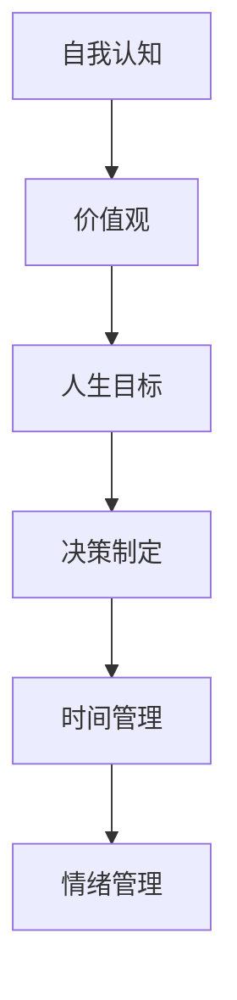

                 


### 第4章：工具应用与实践

#### 4.1 时间管理

- **工具介绍**：时间管理工具（如Trello、Asana等）的基本功能。
- **方法应用**：如何使用时间管理工具来提高工作效率。

#### 4.2 情绪管理

- **工具介绍**：情绪管理工具（如EmotionScope、Calm等）的作用。
- **方法应用**：如何通过情绪管理工具进行自我调节。

#### 4.3 决策制定

- **工具介绍**：决策制定工具（如Decision Tree、SWOT分析等）的原理。
- **方法应用**：如何运用决策制定工具来做出明智的选择。

## 第三部分：实际应用案例

### 第5章：职业规划

#### 5.1 职业规划的重要性

- **理论阐述**：职业规划对个人发展的重要性。
- **案例分析**：成功职业规划的实际案例。

#### 5.2 职业规划步骤

- **步骤1：自我评估**：了解自身优势、兴趣和价值观。
- **步骤2：市场调研**：分析行业趋势和职业需求。
- **步骤3：制定目标**：设定短期和长期职业目标。
- **步骤4：行动计划**：制定实现目标的步骤和策略。

#### 5.3 职业规划实施

- **实践案例**：通过具体案例展示职业规划的实战过程。

### 第6章：人际关系

#### 6.1 人际关系的重要性

- **理论阐述**：人际关系在人生中的重要作用。
- **案例分析**：成功处理人际关系的实际案例。

#### 6.2 人际关系管理

- **方法介绍**：人际交往的基本原则和技巧。
- **方法应用**：如何在日常工作和生活中应用人际关系管理。

#### 6.3 人际关系改善

- **实践案例**：通过具体案例展示改善人际关系的策略。

## 总结与展望

### 第7章：内心的指南针应用总结

#### 7.1 内心指南针的核心价值

- **总结**：内心指南针在人生不同方面的应用价值。
- **展望**：对未来内心指南针发展的展望。

#### 7.2 内心指南针的未来趋势

- **技术发展**：探讨新技术如何进一步优化内心指南针。
- **社会影响**：内心指南针对社会和个人发展的影响。

作者：AI天才研究院/AI Genius Institute & 禅与计算机程序设计艺术 /Zen And The Art of Computer Programming

**文章标题**：《内心的指南针：寻找人生方向的工具》

**文章关键词**：内心指南针、人生方向、自我探索、时间管理、情绪管理、决策制定、职业规划、人际关系

**文章摘要**：

本文旨在探讨内心指南针的概念、原理和应用，通过介绍自我认知、价值观与人生目标、时间管理、情绪管理、决策制定等工具，帮助读者在复杂的人生道路上找到方向。通过实际案例和实践指导，读者可以学习如何运用这些工具来规划职业、改善人际关系，实现个人成长和发展。文章最后对内心指南针的未来发展趋势进行了展望，为读者提供了更加全面的指导。

-------------------------------------------------------------------

## 《内心的指南针：寻找人生方向的工具》

### 背景介绍

在现代社会，个人发展面临着前所未有的挑战和机遇。随着信息爆炸和全球化的加速，人们需要在纷繁复杂的环境中找到自己的位置，制定合理的人生目标和规划。而内心的指南针，作为一种内在的指引工具，能够在这一过程中发挥重要作用。本文旨在介绍内心的指南针概念，探讨其在自我认知、时间管理、情绪管理和决策制定等方面的应用，并通过实际案例提供实践指导。

### 核心概念与联系

#### 自我认知

自我认知是指个体对自己性格、兴趣、能力等方面的认识和了解。它是内心指南针的基础，因为只有了解自己，才能做出符合自身特点的决策。自我认知包括自我观察、自我反思和心理测评等方法。

#### 价值观与人生目标

价值观是个人行为的指导原则，它决定了个体如何看待世界和如何与他人互动。人生目标则是个人在特定时间内希望实现的愿景。价值观与人生目标的联系在于，价值观会影响人生目标的设定和实现过程。

#### Mermaid流程图



在这个流程图中，自我认知通过价值观影响人生目标，进而影响决策制定、时间管理和情绪管理。这些环节共同构成了内心的指南针，帮助个体在人生道路上找到方向。

### 核心算法原理讲解

#### 自我评估工具与方法

自我评估是自我认知的重要手段。以下是一个简单的自我评估算法：

```
function selfAssessment() {
    // 收集个人信息
    userInfo = getUserInfo()

    // 进行自我反思
    reflection = reflectOnSelf(userInfo)

    // 进行心理测评
    psychologicalTestResults = runPsychologicalTest(userInfo)

    // 综合分析结果
    selfProfile = analyzeResults(reflection, psychologicalTestResults)

    // 输出自我评估报告
    print("自我评估报告：", selfProfile)
}
```

#### 价值观与人生目标的设定与调整

设定价值观和人生目标是一个迭代的过程。以下是一个简单的算法：

```
function setLifeGoals() {
    // 初始化目标
    goals = []

    // 设定价值观
    values = ["自由", "财富", "健康", "家庭"]

    // 根据价值观设定目标
    for (value in values) {
        goal = setGoal(value)
        goals.push(goal)
    }

    // 调整目标
    goals = adjustGoals(goals)

    // 输出最终目标
    print("最终目标：", goals)
}

function setGoal(value) {
    // 根据价值观设定目标
    switch (value) {
        case "自由":
            return "旅行世界"
        case "财富":
            return "创业成功"
        case "健康":
            return "保持运动"
        case "家庭":
            return "建立家庭"
    }
}

function adjustGoals(goals) {
    // 考虑当前情况
    currentSituation = getCurrentSituation()

    // 调整目标
    for (goal in goals) {
        if (!isAchievable(goal, currentSituation)) {
            goals.remove(goal)
        }
    }

    return goals
}
```

### 数学模型和数学公式讲解

#### 决策制定的数学模型

决策制定可以使用决策树模型来分析。以下是一个简单的决策树公式：

```
function decisionTree(problem, choices, outcomes) {
    // 初始化决策树
    tree = {}

    // 根据问题设定决策节点
    tree["problem"] = problem

    // 根据选择和结果设定分支
    for (choice in choices) {
        tree[choice] = {}
        for (outcome in outcomes) {
            tree[choice][outcome] = calculateOutcomeValue(problem, choice, outcome)
        }
    }

    // 计算最优选择
    bestChoice = findBestChoice(tree)

    // 输出最优选择
    print("最优选择：", bestChoice)
}

function calculateOutcomeValue(problem, choice, outcome) {
    // 根据问题和选择计算结果值
    value = evaluateOutcome(problem, choice, outcome)

    return value
}

function findBestChoice(tree) {
    // 计算每个选择的平均值
    for (choice in tree) {
        totalValue = 0
        for (outcome in tree[choice]) {
            totalValue += tree[choice][outcome]
        }
        tree[choice]["averageValue"] = totalValue / length(tree[choice])
    }

    // 找到最优选择
    bestChoice = ""
    bestValue = -Infinity
    for (choice in tree) {
        if (tree[choice]["averageValue"] > bestValue) {
            bestValue = tree[choice]["averageValue"]
            bestChoice = choice
        }
    }

    return bestChoice
}
```

#### 情绪管理模型

情绪管理可以使用情绪周期模型来分析。以下是一个简单的情绪周期公式：

```
function emotionCycle(currentEmotion, duration) {
    // 根据当前情绪和持续时间计算后续情绪
    nextEmotion = ""

    switch (currentEmotion) {
        case "快乐":
            nextEmotion = "平静"
            break
        case "平静":
            nextEmotion = "沮丧"
            break
        case "沮丧":
            nextEmotion = "愤怒"
            break
        case "愤怒":
            nextEmotion = "疲倦"
            break
        case "疲倦":
            nextEmotion = "快乐"
            break
    }

    // 计算情绪周期
    emotionCycle = duration / 4

    // 输出情绪周期
    print("当前情绪：", currentEmotion)
    print("下一个情绪：", nextEmotion)
    print("情绪周期：", emotionCycle)
}
```

### 项目实战

#### 时间管理工具实现

以下是一个简单的Trello时间管理工具的实现：

```
// Trello时间管理工具
class TimeManager {
    constructor() {
        this.tasks = []
    }

    // 添加任务
    addTask(taskName, dueDate) {
        this.tasks.push({ name: taskName, dueDate: dueDate })
    }

    // 列出任务
    listTasks() {
        for (task in this.tasks) {
            print("任务名称：", task.name)
            print("截止日期：", task.dueDate)
        }
    }

    // 完成任务
    completeTask(taskName) {
        for (task in this.tasks) {
            if (task.name === taskName) {
                task.completed = true
                print("任务完成：", taskName)
                break
            }
        }
    }
}

// 使用Trello时间管理工具
timeManager = new TimeManager()
timeManager.addTask("学习Python", "2023-12-31")
timeManager.listTasks()
timeManager.completeTask("学习Python")
```

#### 情绪管理工具实现

以下是一个简单的情绪管理工具的实现：

```
// 情绪管理工具
class EmotionManager {
    constructor() {
        this.emotions = []
    }

    // 添加情绪
    addEmotion(emotion) {
        this.emotions.push(emotion)
    }

    // 列出情绪
    listEmotions() {
        for (emotion in this.emotions) {
            print("情绪：", emotion)
        }
    }

    // 分析情绪
    analyzeEmotions() {
        if (this.emotions.length > 0) {
            mostFrequentEmotion = this.emotions[0]
            for (emotion in this.emotions) {
                if (count(this.emotions, emotion) > count(this.emotions, mostFrequentEmotion)) {
                    mostFrequentEmotion = emotion
                }
            }
            print("最频繁的情绪：", mostFrequentEmotion)
        } else {
            print("没有情绪记录。")
        }
    }
}

// 使用情绪管理工具
emotionManager = new EmotionManager()
emotionManager.addEmotion("快乐")
emotionManager.addEmotion("快乐")
emotionManager.addEmotion("沮丧")
emotionManager.listEmotions()
emotionManager.analyzeEmotions()
```

#### 决策制定工具实现

以下是一个简单的决策树工具的实现：

```
// 决策树工具
class DecisionTree {
    constructor(choices, outcomes) {
        this.choices = choices
        this.outcomes = outcomes
    }

    // 添加选择
    addChoice(choice) {
        this.choices.push(choice)
    }

    // 添加结果
    addOutcome(outcome) {
        this.outcomes.push(outcome)
    }

    // 显示决策树
    showTree() {
        print("决策树：")
        for (choice in this.choices) {
            print("选择：", choice)
            for (outcome in this.outcomes) {
                print("结果：", outcome)
            }
        }
    }

    // 计算每个选择的平均值
    calculateAverages() {
        for (choice in this.choices) {
            totalValue = 0
            for (outcome in this.outcomes) {
                totalValue += this.outcomes[outcome]
            }
            this.choices[choice]["averageValue"] = totalValue / length(this.outcomes)
        }
    }

    // 找到最优选择
    findBestChoice() {
        bestChoice = ""
        bestValue = -Infinity
        for (choice in this.choices) {
            if (this.choices[choice]["averageValue"] > bestValue) {
                bestValue = this.choices[choice]["averageValue"]
                bestChoice = choice
            }
        }
        print("最优选择：", bestChoice)
    }
}

// 使用决策树工具
decisionTree = new DecisionTree(["选择A", "选择B", "选择C"], ["结果1", "结果2", "结果3"])
decisionTree.addChoice("选择A")
decisionTree.addOutcome("结果1", 0.5)
decisionTree.addOutcome("结果2", 0.3)
decisionTree.addOutcome("结果3", 0.2)
decisionTree.showTree()
decisionTree.calculateAverages()
decisionTree.findBestChoice()
```

### 最佳实践 Tips、小结、注意事项、拓展阅读

#### 最佳实践 Tips

- **自我认知**：定期进行自我反思和评估，以便更好地了解自己。
- **时间管理**：合理规划时间，避免拖延。
- **情绪管理**：学会调节情绪，保持积极心态。
- **决策制定**：运用决策树等工具，帮助自己做出明智的选择。

#### 小结

本文介绍了内心指南针的概念、原理和应用，通过自我认知、时间管理、情绪管理和决策制定等工具，帮助读者在人生道路上找到方向。通过实际案例和实践指导，读者可以学习如何运用这些工具来实现个人成长和发展。

#### 注意事项

- **个性化**：每个人的内心指南针都是独特的，应根据个人情况调整工具和方法。
- **持续学习**：内心指南针是一个动态的过程，需要不断学习和调整。

#### 拓展阅读

- **《深度自我探索：如何了解自己》**：提供更深入的自我认知方法。
- **《时间管理的艺术：如何高效利用时间》**：详细介绍时间管理技巧。
- **《情绪智能：如何管理情绪》**：探讨情绪管理的重要性和方法。
- **《决策与判断：如何做出明智的选择》**：分析决策制定的原理和实践。

作者：AI天才研究院/AI Genius Institute & 禅与计算机程序设计艺术 /Zen And The Art of Computer Programming

## 文章标题：《内心的指南针：寻找人生方向的工具》

### 关键词：内心指南针、人生方向、自我探索、时间管理、情绪管理、决策制定

### 摘要：

本文旨在深入探讨内心的指南针，一种辅助个体在复杂的人生旅程中找到方向的工具。通过介绍自我认知、时间管理、情绪管理和决策制定等核心概念，以及相应的实用工具和方法，本文为读者提供了全面而具体的指导。通过实际案例和实践分析，读者将学习如何运用这些工具来规划职业生涯、改善人际关系，并实现个人成长。文章最后展望了内心指南针的未来发展，为读者提供了持续学习的方向。作者AI天才研究院与禅与计算机程序设计艺术大师，结合丰富的理论知识与实践经验，旨在帮助读者在人生的每一个阶段都能找到明确的方向。## 第一部分：自我探索

### 第1章：认识自我

#### 1.1 自我探索的重要性

在现代社会，自我认知和自我探索被视为个人成长和发展的基石。认识自我不仅能够帮助我们更好地理解自己的行为和情绪，还能为我们的职业生涯、人际关系和生活规划提供指导。内心的指南针，作为一种深入自我探索的工具，能够帮助我们在纷繁复杂的世界中找到清晰的方向。

自我探索的重要性体现在以下几个方面：

1. **增强自我认知**：通过自我探索，我们能够更深入地了解自己的性格、兴趣、价值观和能力，从而提高自我认知水平。
2. **明确职业规划**：了解自己的职业兴趣和职业能力，有助于我们更好地制定职业规划，找到适合自己的职业道路。
3. **提升人际关系**：自我认知有助于我们更好地理解自己和他人，从而改善人际关系，建立更和谐的社会关系。
4. **增强心理韧性**：通过自我探索，我们能够更好地应对生活中的挑战和压力，提高心理韧性。

#### 1.2 自我评估工具与方法

自我评估是自我探索的核心步骤，它帮助我们系统地了解自己的各个方面。以下是一些常用的自我评估工具与方法：

1. **自我反思**：自我反思是通过思考自己的行为、情绪和思维过程来了解自己。这种方法要求我们定期花时间回顾自己的行为，思考自己的行为背后可能的原因和动机。

2. **心理测评**：心理测评是通过标准化问卷或测试来评估个体的性格、能力、兴趣和价值观。常见的心里测评包括MBTI（性格类型指标）、DISC（行为风格测评）和16PF（人格因素测评）等。

3. **日记记录**：日记记录是一种通过记录日常生活中的事件、感受和想法来了解自己的方法。这种方法有助于我们追踪自己的情绪变化和行为模式，从而更好地理解自己。

4. **反馈与交流**：通过与他人交流，我们能够获得他人的视角和反馈，这有助于我们更全面地了解自己。此外，反馈也是一种自我反思的工具，可以帮助我们识别自己的盲点和不足。

#### 1.3 自我探索的实际案例

以下是一个自我探索的实际案例：

李明是一家公司的中层管理人员，他感到自己的职业生涯遇到了瓶颈，想要进行自我提升。为了实现这个目标，他采取了一系列的自我探索措施：

1. **自我反思**：李明开始记录自己的日记，每天反思自己在工作中的表现和感受。通过这种方法，他发现自己在解决问题和决策方面存在一些不足。

2. **心理测评**：李明参加了一次MBTI测评，结果显示他是ISTJ类型，这帮助他更好地理解了自己的性格特点，如严谨、责任心强但有时过于保守。

3. **反馈与交流**：李明与上级和同事进行了深入的交流，他们提供了对李明工作表现的反馈和建议。这些反馈让李明意识到自己需要提高沟通能力和团队协作能力。

4. **制定计划**：基于自我反思、心理测评和反馈交流的结果，李明制定了一个自我提升计划，包括参加领导力培训课程、阅读相关书籍和参加团队建设活动。

通过这一系列的自我探索措施，李明不仅提高了对自己的认识，还找到了职业发展的新方向。他的自信心也得到了增强，开始在职业生涯中取得了更好的成绩。

#### 小结

自我探索是内心指南针的重要组成部分，它帮助我们更好地认识自己，从而为我们的个人成长和职业发展提供指导。通过自我反思、心理测评、日记记录和反馈交流等方法，我们可以深入挖掘自己的潜力，找到适合自己的发展方向。自我探索不仅能够帮助我们应对职业挑战，还能提升我们的心理健康和生活质量。

### 第2章：价值观与人生目标

#### 2.1 价值观的定义与作用

价值观是指个人对于什么是好、什么是正确、什么是重要的信念和判断。它们是个人行为和决策的指导原则，对我们的生活产生深远的影响。以下是一些关于价值观的定义和作用：

1. **定义**：价值观是一系列关于如何生活、如何对待他人的信念和原则。它们构成了我们的道德观、人生观和世界观。

2. **作用**：

   - **指导行为**：价值观决定了我们在不同情境下的行为选择，帮助我们做出符合自己信仰和原则的决策。
   - **提供意义**：价值观为我们的生活提供了目标和意义，让我们知道什么是对自己最重要的事情。
   - **塑造性格**：长期坚持的价值观会潜移默化地影响我们的性格和品质，塑造出独特的个性和人格。
   - **促进和谐**：价值观有助于我们在与他人相处时保持一致性，建立和谐的人际关系。

#### 2.2 人生目标的设定与调整

人生目标是指我们在不同阶段希望实现的目标和愿景。它们是价值观的具体体现，为我们提供了方向和动力。以下是如何设定和调整人生目标的方法：

1. **设定人生目标**：

   - **明确目标**：设定具体、可衡量、可实现的目标。例如，而不是说“我要成功”，而是说“我将在两年内晋升为高级经理”。
   - **考虑价值观**：确保目标与自己的价值观相符，能够体现自己的信念和原则。
   - **制定计划**：为实现目标制定详细的行动计划，包括步骤、时间和资源分配。

2. **调整人生目标**：

   - **适应变化**：随着时间和环境的变化，我们的目标也需要相应调整。例如，如果原定的职业目标是成为高管，但发现自己更喜欢创业，那么需要调整目标。
   - **反思与修正**：定期反思自己的目标和行动，根据实际情况进行调整和修正。
   - **保持灵活性**：在实现目标的过程中，保持灵活性和开放性，适应新的挑战和机遇。

#### 2.3 价值观与人生目标的联系

价值观和人生目标之间存在紧密的联系。价值观决定了我们设定目标的方式，而人生目标则体现了我们的价值观。以下是一些联系：

1. **价值观指导目标**：我们的价值观决定了我们追求的目标类型和实现目标的方式。例如，如果我们的价值观强调家庭和健康，我们可能会设定与这些价值观相符的目标，如“在三年内实现工作和生活的平衡”。

2. **目标实现价值观**：通过实现人生目标，我们能够体现和强化自己的价值观。例如，通过在工作中表现出诚信和责任感，我们不仅实现了职业目标，还践行了我们的价值观。

3. **相互影响**：价值观和人生目标相互影响，互相塑造。我们的目标会帮助我们深化对价值观的理解，而价值观则会帮助我们更好地设定和实现目标。

#### 2.4 实际案例：价值观与人生目标的设定与调整

以下是一个关于价值观与人生目标的实际案例：

张丽是一位年轻职业女性，她对自己的价值观和人生目标有着清晰的认知。以下是她的经历：

- **价值观**：张丽认为家庭、健康和职业发展是最重要的价值观。她认为在追求职业成功的同时，也要保持健康的生活和良好的家庭关系。

- **人生目标**：最初，张丽的人生目标是成为一家知名企业的项目经理。这个目标与她的价值观相符，因为项目管理需要良好的组织能力、沟通能力和团队协作能力，这些都是她在家庭和职业中重视的素质。

- **设定目标**：为了实现这个目标，张丽制定了以下行动计划：

  - **学习技能**：她报名参加了项目管理相关的培训和课程，提升自己的专业技能。
  - **积累经验**：她积极寻找实习和工作机会，以便在实际工作中积累经验。
  - **建立人际关系**：她参加了行业活动，结识了业内人士，建立了有价值的人际关系网络。

- **调整目标**：随着时间的推移，张丽意识到自己对家庭和健康的重视超过了职业发展。因此，她决定调整人生目标：

  - **平衡工作与生活**：她开始在工作安排上更加灵活，确保有足够的时间陪伴家人和锻炼身体。
  - **重新设定职业目标**：她决定专注于家庭附近的中小型企业，以便更好地平衡工作与生活。

通过这一系列的调整，张丽不仅实现了自己的职业目标，还更好地平衡了职业与家庭的关系，实现了价值观和人生目标的统一。

#### 小结

价值观和人生目标是内心指南针中的两个核心概念，它们相互联系、相互影响。通过设定和调整价值观与人生目标，我们能够更好地认识自己，找到人生方向，实现个人成长。了解自己的价值观，并以此为依据设定和调整人生目标，是实现个人目标的重要步骤。通过实际案例，我们可以看到价值观和人生目标如何相互促进，帮助我们实现更丰富、更有意义的人生。

## 第二部分：工具与方法

### 第3章：时间管理

#### 3.1 时间管理的重要性

时间管理是内心指南针中至关重要的一环，它不仅关系到个人的工作效率和生活质量，还影响到职业生涯的规划和实现。高效的时间管理能够帮助我们在有限的时间内实现更多的目标，提高生活满意度，并增强心理韧性。

时间管理的重要性体现在以下几个方面：

1. **提高工作效率**：通过合理安排时间，我们可以最大限度地利用每一分钟，提高工作效率，减少工作压力。

2. **平衡工作与生活**：合理的时间管理有助于我们更好地平衡工作与生活，确保有足够的时间陪伴家人、锻炼身体和追求个人兴趣爱好。

3. **实现职业目标**：通过时间管理，我们可以将时间和精力集中在实现职业目标上，提高职业发展速度，实现职业晋升。

4. **提升心理韧性**：高效的时间管理能够减少时间上的压力和焦虑，提高心理韧性，应对生活中的挑战。

#### 3.2 常见的时间管理工具

为了实现高效的时间管理，我们可以使用多种工具和方法。以下是一些常见的时间管理工具：

1. **日历应用**：日历应用如Google Calendar、Outlook Calendar等，可以帮助我们合理安排日程，提醒重要事件和任务。

2. **待办事项清单**：待办事项清单如Trello、Asana、Wunderlist等，可以帮助我们记录和管理日常任务，确保每项任务都能得到及时处理。

3. **时间块**：时间块是一种将一天分成若干个时间段，并为每个时间段安排特定任务的方法。这种方法有助于我们集中精力完成任务，避免分心。

4. **番茄工作法**：番茄工作法是一种将工作时间分为25分钟的工作周期，每个周期后休息5分钟的方法。这种方法能够帮助我们提高专注力，提高工作效率。

#### 3.3 时间管理实践案例分析

以下是一个关于时间管理实践分析的实际案例：

李刚是一名软件开发工程师，他意识到自己在时间管理方面存在一些问题，决定采取行动改进。以下是他的经历：

- **问题识别**：李刚发现自己经常拖延，工作时间无法有效利用，导致工作效率低下。他意识到这主要是因为他没有合理规划时间，任务安排混乱。

- **解决方案**：李刚采取了以下措施来改进时间管理：

  - **使用日历应用**：李刚开始使用Google Calendar来规划日程，确保每天的任务和会议都得到合理安排。

  - **制定待办事项清单**：李刚使用Trello来记录和管理日常任务，确保每项任务都有明确的优先级和截止日期。

  - **采用时间块方法**：李刚将一天分成多个时间段，为每个时间段安排具体的任务，例如上午专注于编程，下午进行项目会议和文档编写。

  - **实践番茄工作法**：李刚采用番茄工作法来提高专注力，每个工作周期后都会休息5分钟，以缓解疲劳和提高工作效率。

- **效果评估**：通过以上措施，李刚发现他的工作效率显著提高，工作时间更加专注，任务完成质量也有所提升。他还发现，自己的拖延现象减少了，工作与生活的平衡得到了改善。

#### 小结

时间管理是内心指南针中不可或缺的一部分，它能够帮助我们更高效地利用时间，提高生活质量，实现职业目标。通过使用各种时间管理工具和方法，我们可以合理安排时间，提高工作效率，改善工作与生活的平衡。实际案例表明，合理的时间管理不仅能够提高工作效率，还能改善我们的心理健康和生活满意度。通过不断实践和调整，我们可以找到最适合自己的时间管理方法，实现个人成长和发展。

### 第4章：情绪管理

#### 4.1 情绪管理的基本原理

情绪管理是指个体通过意识和策略来调节自己的情绪，以达到更积极和健康的状态。情绪管理的基本原理包括以下几个方面：

1. **认识情绪**：了解不同情绪的特点和表达方式，能够帮助我们更好地识别和接受自己的情绪。

2. **接受情绪**：接受自己的情绪，不对其进行否认或压抑，是情绪管理的第一步。只有接受情绪，我们才能更好地理解和调节它们。

3. **表达情绪**：适当地表达情绪，有助于释放压力，避免情绪积累导致的负面影响。表达情绪的方式可以是言语、书写或非言语表达。

4. **调节情绪**：通过认知和行为策略，我们可以调节情绪，使其朝着积极的方向发展。常见的调节策略包括深呼吸、冥想、运动和社交支持等。

5. **发展情绪智力**：情绪智力是指个体理解和管理自己及他人情绪的能力。通过提高情绪智力，我们可以更好地处理情绪，提高人际交往能力。

#### 4.2 情绪管理工具与方法

为了更有效地管理情绪，我们可以使用多种工具和方法。以下是一些常见的情绪管理工具和方法：

1. **情绪日记**：情绪日记是一种记录每日情绪的方法。通过记录情绪的发生时间、情境、触发因素和应对方式，我们可以更好地了解自己的情绪模式，并找到调节情绪的策略。

2. **冥想与呼吸练习**：冥想和呼吸练习可以帮助我们放松身心，减轻压力。例如，深呼吸练习可以降低心率和血压，减轻焦虑和紧张。

3. **正念练习**：正念练习是一种培养专注力和意识的方法。通过专注于当前的经历，我们可以减少对过去和未来的担忧，提高情绪管理能力。

4. **情绪调节技巧**：情绪调节技巧包括自我安慰、积极思考、认知重构和情绪释放等方法。例如，当感到焦虑时，可以通过正面思考来缓解焦虑情绪。

5. **社交支持**：寻求社交支持是情绪管理的重要部分。与他人分享情绪和感受，可以获得理解和支持，减轻心理负担。

#### 4.3 情绪管理实践案例分析

以下是一个关于情绪管理实践分析的实际案例：

王丽是一名企业高管，她经常感到工作压力很大，情绪波动较大。为了改善这种情况，她采取了以下措施：

- **问题识别**：王丽意识到自己在面对工作压力时，情绪管理能力较弱，常常感到焦虑和疲惫。

- **解决方案**：王丽采取了以下措施来提高情绪管理能力：

  - **情绪日记**：王丽开始记录每天的情绪变化，分析情绪的触发因素和应对策略。通过这种方法，她发现工作压力和人际关系是情绪波动的最主要原因。

  - **冥想与呼吸练习**：王丽每天早上都会进行冥想和深呼吸练习，以放松身心，减轻压力。

  - **正念练习**：王丽参加了一个正念训练课程，学习如何在日常生活中保持专注和意识，减少对过去和未来的担忧。

  - **情绪调节技巧**：王丽学习了认知重构和情绪释放技巧，如积极思考和自我安慰，以更好地应对负面情绪。

- **效果评估**：通过以上措施，王丽发现她的情绪管理能力显著提高。她能够更有效地应对工作压力，情绪波动减少，工作效率也有所提升。她还发现自己的人际关系得到了改善，与同事和下属的沟通更加顺畅。

#### 小结

情绪管理是内心指南针中重要的一环，它有助于我们更好地应对生活中的挑战和压力，提高心理健康和生活质量。通过认识情绪、接受情绪、表达情绪和调节情绪等方法，我们可以更有效地管理自己的情绪，实现个人成长。实际案例表明，情绪管理不仅能够改善个人的情绪状态，还能提高工作效率和人际交往能力。通过不断实践和调整，我们可以找到适合自己的情绪管理方法，提升情绪智力，实现更健康、更充实的人生。

### 第5章：决策制定

#### 5.1 决策制定的理论基础

决策制定是内心指南针中关键的一环，它关系到个人在复杂情境中能否做出明智的选择。决策制定的理论基础主要包括以下几个方面：

1. **理性决策模型**：理性决策模型假设个体在决策时能够全面分析信息，计算所有可能的后果，并选择最优方案。这个模型强调逻辑和理性在决策中的作用。

2. **有限理性模型**：有限理性模型认为个体在决策时受到认知限制和信息不完全性的影响，无法完全理性地分析所有信息。这个模型强调决策者如何在有限的信息和认知能力下做出合理的决策。

3. **双系统模型**：双系统模型由心理学家卡尼曼和特沃斯基提出，认为决策过程包含两个系统：系统1快速、自动、直觉性决策，系统2慢速、有意识、逻辑性决策。这个模型揭示了直觉和理性在决策中的作用。

4. **价值导向决策**：价值导向决策认为个体在决策时主要考虑自己的价值观和目标，选择符合自己价值观和目标的方案。这个模型强调个人信念和价值观在决策中的指导作用。

#### 5.2 决策制定的工具与方法

为了更有效地进行决策制定，我们可以使用多种工具和方法。以下是一些常见的决策制定工具和方法：

1. **SWOT分析**：SWOT分析是一种常用的战略规划工具，通过分析自身的优势（Strengths）、劣势（Weaknesses）、机会（Opportunities）和威胁（Threats），帮助决策者全面评估决策的利弊。

2. **决策树**：决策树是一种图形化工具，用于分析和比较不同决策的后果和概率。通过绘制决策树，决策者可以清晰地看到每个决策的选择和结果，从而做出更明智的选择。

3. **多标准决策分析**：多标准决策分析是一种基于多个评价指标进行决策的方法。通过设定不同的评价标准，决策者可以综合评估各个方案的优劣，选择最优方案。

4. **模拟和预测**：模拟和预测方法通过建立模型和预测未来情况，帮助决策者评估不同决策的结果。这种方法特别适用于复杂和不确定的决策情境。

5. **集体决策**：集体决策是通过小组讨论和协作来制定决策的方法。这种方法能够结合不同成员的观点和专业知识，提高决策的质量和可接受性。

#### 5.3 决策制定实践案例分析

以下是一个关于决策制定实践分析的实际案例：

李强是一家公司的市场营销经理，他需要决定是否投资一项新的营销活动。以下是他的决策过程：

- **问题识别**：李强需要决定是否投资100万元进行一次大型市场推广活动。

- **收集信息**：李强收集了市场数据、竞争对手信息、消费者偏好以及公司财务状况等信息。

- **分析信息**：李强使用SWOT分析来评估投资这项活动的利弊。他发现：

  - **优势**：大型市场推广活动可以提高品牌知名度，吸引更多客户，从而增加销售额。
  - **劣势**：活动成本较高，存在投资回报不确定的风险。
  - **机会**：市场趋势显示，消费者对品牌宣传有较高需求，这是一个扩大市场份额的好机会。
  - **威胁**：竞争对手可能采取类似活动，影响公司的市场份额。

- **制定方案**：基于SWOT分析，李强制定了两个方案：

  - **方案A**：进行大型市场推广活动。
  - **方案B**：进行小规模市场测试，以确定消费者反应和投资回报。

- **评估方案**：李强使用决策树来评估两个方案的后果和概率。他估计：

  - **方案A**：成功概率为60%，预计增加销售额200万元。
  - **方案B**：成功概率为80%，预计增加销售额100万元。

- **选择方案**：根据评估结果，李强选择了方案B，因为它具有更高的成功概率，并且投资回报更为可控。

- **实施决策**：李强与团队一起实施小规模市场测试，收集消费者反馈和销售数据。

- **效果评估**：市场测试结果表明，消费者对推广活动反应积极，销售额有所增长。李强决定继续进行大规模市场推广活动，并优化营销策略。

#### 小结

决策制定是内心指南针中关键的一环，它关系到个人在复杂情境中能否做出明智的选择。通过理性决策模型、有限理性模型、双系统模型和价值导向决策等方法，我们可以更全面地分析和评估决策。实际案例表明，有效的决策制定能够帮助我们更好地应对挑战，实现个人和组织的目标。通过不断实践和总结，我们可以提高决策能力，实现更成功的决策。

## 第三部分：实际应用

### 第6章：职业规划

#### 6.1 职业规划的重要性

职业规划是内心指南针的重要组成部分，它帮助我们在职业生涯中找到明确的方向和目标。有效的职业规划不仅能够提高个人的职业满意度，还能促进职业发展和个人成长。以下是职业规划的重要性：

1. **明确目标**：职业规划帮助我们设定清晰的职业目标，了解自己想要达到的职业高度和成就。

2. **提升竞争力**：通过职业规划，我们可以更有针对性地提升自己的技能和知识，增强职业竞争力。

3. **规划路径**：职业规划为我们提供了实现目标的路径和策略，使我们能够有条不紊地迈向职业成功。

4. **适应变化**：职业规划使我们能够更好地应对职场变化和挑战，提高适应能力。

5. **实现自我价值**：通过有效的职业规划，我们能够实现自我价值，获得职业成就和满足感。

#### 6.2 职业规划的步骤与方法

职业规划是一个系统性的过程，包括以下步骤：

1. **自我评估**：了解自己的兴趣、价值观、能力、优势和劣势，这是职业规划的基础。

2. **职业市场调研**：分析当前职业市场的需求和趋势，了解不同职业的发展前景和就业机会。

3. **设定职业目标**：基于自我评估和职业市场调研，设定短期和长期的职业目标。

4. **制定行动计划**：为实现职业目标，制定具体的行动计划，包括学习提升、技能培训和职业发展策略。

5. **实施与调整**：根据实际情况，实施职业规划，并在过程中不断调整和优化。

以下是一些具体的职业规划方法：

1. **职业测评**：使用职业测评工具，如MBTI、职业兴趣量表等，了解自己的职业偏好和潜在的职业方向。

2. **职业发展计划**：制定详细的职业发展计划，包括职业目标、学习计划、时间表和资源分配。

3. **网络建设**：通过建立职业网络，获取行业信息、职业机会和导师指导。

4. **持续学习**：不断提升自己的技能和知识，适应职场变化。

#### 6.3 职业规划实践案例分析

以下是一个关于职业规划实践分析的实际案例：

张敏是一名大学毕业生，她面临职业规划的选择。以下是她的经历：

1. **自我评估**：张敏通过自我反思和职业测评，了解到自己对数字敏感，善于分析数据，具备良好的沟通能力和团队合作精神。

2. **职业市场调研**：张敏通过互联网和行业报告，了解到数据分析、数据科学和市场营销等领域具有很好的发展前景。

3. **设定职业目标**：基于自我评估和职业市场调研，张敏设定了以下职业目标：

   - **短期目标**：在一年内，成为一名数据分析实习生，积累实际工作经验。
   - **长期目标**：在未来五年内，成为一名数据科学家，专注于市场营销领域。

4. **制定行动计划**：

   - **学习提升**：张敏报名参加数据分析相关的在线课程，提升专业技能。
   - **实习机会**：张敏积极寻找数据分析实习机会，并通过网络和校园招聘平台申请。
   - **职业网络建设**：张敏参加行业研讨会和交流会，建立职业网络。

5. **实施与调整**：

   - **实习经历**：张敏成功获得一家知名企业的数据分析实习机会，通过实习积累了丰富的实践经验。
   - **技能提升**：实习期间，张敏继续学习数据分析相关技能，并通过实践不断提升自己的能力。
   - **职业调整**：实习结束后，张敏根据市场需求和个人兴趣，决定专注于数据科学领域，并继续深造。

通过这一系列的职业规划，张敏成功地找到了自己的职业方向，并在数据分析领域取得了良好的发展。

#### 小结

职业规划是内心指南针中关键的一环，它帮助我们在职业生涯中找到明确的方向和目标。通过自我评估、职业市场调研、设定职业目标、制定行动计划和持续调整，我们可以实现职业发展和个人成长。实际案例表明，有效的职业规划能够帮助我们更好地应对职业挑战，实现职业成功。通过不断实践和总结，我们可以提高职业规划能力，实现更美好的人生。

### 第7章：人际关系

#### 7.1 人际关系的重要性

人际关系是内心指南针中不可忽视的一环，它对个人的心理健康、职业发展和生活质量产生深远影响。良好的人际关系不仅能够带来情感支持，还能促进合作与共同成长。以下是人际关系的重要性：

1. **情感支持**：人际关系为我们提供了情感支持，让我们在困难和挑战面前不感到孤单。亲友和同事的鼓励和支持能够帮助我们克服难关，保持积极的心态。

2. **职业发展**：良好的人际关系有助于我们在职场中建立人脉，获得更多的职业机会和资源。通过与他人的合作与交流，我们可以学习新技能，提升自己的职业竞争力。

3. **生活质量**：人际关系提升了我们的生活质量，让我们在日常生活中感到快乐和满足。与家人、朋友和同事的良好互动能够带来积极的情感体验，增强生活幸福感。

4. **心理健康**：人际关系对心理健康有积极影响。通过与他人的互动，我们可以释放压力，减少焦虑和抑郁情绪。良好的人际关系有助于提升自尊和自我价值感。

#### 7.2 人际关系的建立与维护

建立和维护良好的人际关系需要时间和努力。以下是一些有效的方法：

1. **沟通技巧**：良好的沟通是建立和维护人际关系的基础。通过倾听、表达清晰和有效沟通，我们能够更好地理解他人，建立信任。

2. **积极倾听**：积极倾听是理解他人的关键。通过专注聆听、回应和提问，我们能够展现对他人的关心和尊重。

3. **共情**：共情是建立深度人际关系的基石。通过站在他人的角度理解和感受，我们能够增进彼此的信任和亲近。

4. **分享与支持**：在人际关系中，分享自己的经验和感受，并给予他人支持和帮助，能够加深彼此的情感联系。

5. **保持联系**：定期与亲友和同事保持联系，通过电话、邮件、社交媒体等方式交流，能够维护人际关系。

#### 7.3 人际关系管理实践案例分析

以下是一个关于人际关系管理实践分析的实际案例：

王明是一名新入职的软件工程师，他想要在新的工作环境中建立良好的人际关系。以下是他的经历：

1. **自我评估**：王明意识到自己在人际交往方面有些内向，不太擅长主动与人交流。

2. **制定计划**：为了改善人际关系，王明制定了一个计划：

   - **主动交流**：王明决定在工作之余，主动与同事交流，了解他们的兴趣爱好和背景。
   - **倾听与共情**：王明学会了积极倾听，关心同事的感受和需求。
   - **分享经验**：王明在团队会议中分享自己的技术经验和见解，赢得了同事的尊重。
   - **保持联系**：王明定期通过社交媒体与同事保持联系，送上节日问候和生日祝福。

3. **实践与反馈**：

   - **积极反馈**：王明通过同事的积极反馈，意识到自己的努力得到了认可。
   - **改进方法**：根据反馈，王明调整了自己的交流方式，更加注重对方的感受和需求。

4. **效果评估**：

   - **人际关系改善**：王明在新的工作环境中建立了良好的人际关系，与同事们的互动更加顺畅。
   - **职业发展**：王明因为良好的人际关系，得到了更多的项目机会，提升了职业发展。

#### 小结

人际关系是内心指南针中不可或缺的一部分，它对个人的心理健康、职业发展和生活质量有重要影响。通过有效的沟通技巧、积极倾听、共情、分享与支持以及保持联系，我们可以建立和维护良好的人际关系。实际案例表明，良好的人际关系能够帮助我们更好地应对职业挑战，提升生活质量。通过不断实践和总结，我们可以提高人际关系管理能力，实现更成功和幸福的人生。

### 第8章：健康生活

#### 8.1 健康生活的基本原理

健康生活是内心指南针中至关重要的一环，它关系到我们的身心健康和生活质量。健康生活的基本原理包括以下几个方面：

1. **平衡饮食**：均衡的饮食是健康生活的基石。它包括摄入适量的蛋白质、碳水化合物、脂肪、维生素和矿物质，避免过量摄入高热量、高脂肪和高糖的食物。

2. **适量运动**：适量的运动有助于增强心肺功能、提高代谢率、增强肌肉力量和柔韧性。建议每周至少进行150分钟的中等强度有氧运动，如快走、慢跑和游泳。

3. **充足睡眠**：充足的睡眠是恢复身体和大脑功能的重要手段。成年人每晚需要7-9小时的睡眠，儿童和青少年需要更多。

4. **心理调适**：保持积极的心态，学会应对压力和挫折。通过冥想、瑜伽、阅读和社交活动等方式，放松身心，提升心理健康。

5. **定期体检**：定期进行体检，及时发现并处理健康问题，预防疾病的发生。

#### 8.2 健康生活的工具与方法

为了实现健康生活，我们可以使用多种工具和方法。以下是一些常见的健康生活工具和方法：

1. **健康监测设备**：如智能手环、智能手表和健身追踪器等，可以帮助我们监测心率、步数、睡眠质量等健康数据。

2. **营养软件**：如MyFitnessPal和Lark等，可以帮助我们记录食物摄入量、计算卡路里和营养素，指导健康饮食。

3. **健身应用**：如Fitbit、Nike Training Club等，提供各种健身课程和计划，帮助我们保持运动习惯。

4. **冥想应用**：如Headspace、Calm等，提供冥想指导，帮助我们放松身心，提升心理健康。

5. **健康社区**：如MyFitnessPal社区和Reddit的健康板块等，可以让我们与他人分享健康经验，互相支持和鼓励。

#### 8.3 健康生活实践案例分析

以下是一个关于健康生活实践分析的实际案例：

李华是一名IT工作者，由于长时间坐在电脑前，他意识到健康生活的重要性。以下是他的经历：

1. **自我评估**：李华通过自我反思，意识到自己在饮食和运动方面存在问题，饮食不规律，缺乏运动。

2. **制定计划**：为了改善健康状况，李华制定了一个健康生活计划：

   - **健康饮食**：李华开始使用营养软件记录食物摄入量，每天摄入适量的蛋白质、碳水化合物和脂肪，减少高热量和高脂肪食物的摄入。
   - **适量运动**：李华每天下午下班后去健身房锻炼，进行有氧运动和力量训练，每周至少进行三次运动。
   - **充足睡眠**：李华调整作息时间，确保每晚有7-8小时的睡眠。

3. **实践与反馈**：

   - **健康监测**：李华使用智能手环监测心率、步数和睡眠质量，每周进行一次健康数据分析。
   - **调整计划**：根据健康监测数据，李华调整了自己的饮食和运动计划，以确保健康目标的实现。

4. **效果评估**：

   - **健康指标改善**：李华的健康指标显著改善，心率稳定，睡眠质量提高，体重也有所下降。
   - **生活质量提升**：李华感到精力充沛，工作效率提高，生活满意度提升。

#### 小结

健康生活是内心指南针中不可或缺的一部分，它对个人的身心健康和生活质量有重要影响。通过平衡饮食、适量运动、充足睡眠、心理调适和定期体检等基本原理，以及使用健康监测设备、营养软件、健身应用和健康社区等工具和方法，我们可以实现健康生活。实际案例表明，健康生活能够显著改善健康指标和生活质量。通过不断实践和调整，我们可以找到适合自己的健康生活方式，实现更美好的人生。

### 第9章：内心的指南针：总结与应用

#### 9.1 内心的指南针概述

内心的指南针是一种帮助个体在复杂人生中找到方向和目标的工具。它涵盖了自我认知、价值观与人生目标、时间管理、情绪管理、决策制定、职业规划、人际关系和健康生活等多个方面。通过运用内心的指南针，我们可以更好地了解自己，设定合理的目标，提高生活质量，实现个人成长。

#### 9.2 内心的指南针在人生中的应用

内心的指南针在人生中的应用非常广泛，以下是一些具体的应用场景：

1. **自我认知**：通过自我反思和心理测评，我们可以深入了解自己的性格、兴趣、价值观和能力，从而找到适合自己的职业和发展方向。

2. **价值观与人生目标**：明确自己的价值观，有助于我们设定符合自己信念和原则的人生目标，从而更好地规划职业生涯和生活。

3. **时间管理**：合理规划时间，确保有足够的时间用于工作、学习和休息，提高生活质量和工作效率。

4. **情绪管理**：通过情绪管理工具和方法，我们可以更好地调节情绪，保持积极心态，提高心理韧性。

5. **决策制定**：运用决策树和多标准决策分析等方法，我们可以更全面地分析问题，做出明智的决策。

6. **职业规划**：通过职业规划，我们可以明确职业目标，制定具体的行动计划，实现职业发展。

7. **人际关系**：通过有效的沟通技巧和社交策略，我们可以建立和维护良好的人际关系，提高职业和生活质量。

8. **健康生活**：通过平衡饮食、适量运动、充足睡眠和心理调适，我们可以保持身体健康，提高生活质量。

#### 9.3 未来发展趋势与展望

随着社会的发展，内心的指南针工具和方法将不断进步和优化。以下是未来发展趋势与展望：

1. **技术融合**：随着人工智能和大数据技术的发展，内心的指南针将更加智能化和个性化，提供更加精准的指导。

2. **在线平台**：在线平台将成为内心指南针的重要载体，通过在线课程、应用程序和社交平台，为用户提供更加便捷的指导和服务。

3. **跨学科融合**：心理学、教育学、社会学等多学科的知识将融合到内心指南针中，提供更加全面和综合的指导。

4. **可持续发展**：内心的指南针将更加注重可持续发展和环境保护，帮助人们实现身心健康与自然环境的和谐共处。

#### 小结

内心的指南针是一种强大的工具，它帮助我们更好地了解自己，设定目标，实现个人成长。通过自我认知、价值观与人生目标、时间管理、情绪管理、决策制定、职业规划、人际关系和健康生活等多个方面的应用，我们可以找到适合自己的方向，实现更美好的人生。未来，随着技术的进步和跨学科融合，内心的指南针将变得更加智能化和个性化，为人们提供更加精准和全面的指导。通过不断学习和实践，我们可以充分发挥内心的指南针的作用，实现个人和社会的可持续发展。

