                 

### 冥想与内观概述

#### 冥想与内观的基本概念

冥想（Meditation）和内观（Vipassana）是两个源自古老东方哲学的实践方法，它们在精神和心灵层面具有深远的影响。冥想是一种通过专注、放松和意识提升来达到心灵平静和内在探索的过程。而内观则更侧重于对自身内在体验的深入观察和理解。

**冥想的历史与发展：**

冥想的历史可以追溯到公元前5000年左右的印度。释迦牟尼佛在菩提树下冥想得道成佛，标志着冥想作为一种宗教和哲学实践的开始。在佛教中，冥想被视为修行的重要部分，旨在帮助修行者达到涅槃的境界。随着时间的推移，冥想逐渐传入中国、日本、东南亚等地，形成了多样化的冥想实践方式，如禅修、净土念佛法、观呼吸等。

**内观的历史与发展：**

内观，又称“觉知冥想”，源自巴利语“Vipassana”，意为“深入观察”或“清晰地观察”。这一实践方法最早由释迦牟尼佛在菩提树下修行时发现，并在其后的教诲中传承下来。内观在印度教、佛教等多种宗教和哲学体系中都有所体现，但在20世纪中期，由缅甸禅修大师昂山素季（Aung San Suu Kyi）推广，成为全球范围内广受欢迎的冥想形式。

**冥想与内观的定义与区别：**

**冥想（Meditation）：** 
冥想是一种通过专注于特定的对象、念头或呼吸，达到心灵平静和内心探索的心理练习。冥想的目标是减轻压力、提高专注力、增强内在平静和幸福感。

**内观（Vipassana）：** 
内观是一种更为深入的冥想实践，它强调对当前经验和内在感受的细致观察，以培养觉知、智慧和解脱。内观的目标是通过深入了解自己，消除内在的痛苦和烦恼，实现身心和谐。

**冥想与内观的主要流派与技巧：**

**冥想流派：**
- 禅修：以集中精神、冥想和呼吸练习为特点，源于佛教传统。
- 观呼吸：通过专注于呼吸来培养专注力和内心平静。
- 现代冥想：包括动态冥想、正念冥想等多种形式，强调日常生活中的觉知和实践。

**内观流派：**
- 传统内观：源于印度和东南亚，强调长时间的静坐和内在观察。
- 现代内观：结合现代心理学和精神病学理论，注重实证研究。

**技巧与方法：**
- 正念：通过专注于当下的经验，培养对内心和外界的觉知。
- 观察内在体验：深入观察身体感觉、情绪和思想，以提高自我意识和洞察力。
- 禅修：通过冥想和身体姿势的练习，实现身心合一。

### 小结

冥想和内观是两种历史悠久且深具影响力的心灵实践方法。它们通过不同的方式帮助人们达到心灵平静、提高专注力和觉知力。在接下来的章节中，我们将进一步探讨冥想与内观的理论基础、生理和心理效应，以及实践指导，帮助读者更深入地理解这两种实践方法。

### 冥想与内观的理论基础

#### 神经科学视角下的冥想与内观

在神经科学领域，冥想与内观的研究主要集中在脑结构和功能的变化上。多个研究已经揭示了冥想对大脑的影响，包括灰质密度的增加、神经网络连接的优化和神经元活动的改变。

**脑结构变化：**

一项2010年的研究发现，长期冥想者的大脑灰质密度在特定区域（如前额叶皮质和前扣带皮层）显著高于非冥想者。这些区域与认知功能、情感调节和注意力控制密切相关。灰质密度的增加可能反映了神经网络的优化和功能的增强。

**神经网络连接：**

冥想与内观还影响神经网络的结构和功能连接。例如，一项2015年的研究表明，长期冥想者的大脑默认模式网络（DMN）表现出更高的功能连接性。DMN与自我意识、内省和情绪调节相关，因此，冥想可能通过增强DMN的功能连接，提高这些认知功能的效率。

**神经元活动：**

研究表明，冥想和内观可以改变神经元的活动模式。例如，一项2017年的研究使用功能性磁共振成像（fMRI）技术发现，在冥想过程中，大脑皮层和皮层下结构（如杏仁核和丘脑）的活动显著降低。这表明冥想有助于减轻压力和情绪负担。

**核心概念与联系：**

为了更好地理解冥想与内观在神经科学中的核心概念，我们可以使用Mermaid流程图来展示它们之间的联系。

```mermaid
graph TD
A[神经科学] --> B[脑结构变化]
B --> C[灰质密度增加]
C --> D[神经网络连接]
D --> E[默认模式网络(DMN)功能连接]
E --> F[神经元活动改变]
F --> G[冥想实践]
G --> H[内观实践]
H --> I[认知功能提升]
I --> J[情感调节增强]
J --> K[压力减轻]
K --> L[身心健康]
L --> M[神经科学视角下的冥想与内观]
```

**核心算法原理讲解：**

以下是冥想与内观影响大脑功能的伪代码示例：

```python
# 冥想与内观对大脑灰质密度的影响
def increase灰质密度():
    if (冥想实践 > 1年):
        灰质密度 += 5%
    if (内观实践 > 1年):
        灰质密度 += 5%
    return 灰质密度

# 冥想与内观对默认模式网络(DMN)功能连接的影响
def increase_DMN连接():
    if (冥想实践 > 1年):
        DMN连接性 += 10%
    if (内观实践 > 1年):
        DMN连接性 += 10%
    return DMN连接性

# 冥想与内观对神经元活动的影响
def decrease神经元活动():
    if (冥想实践 > 1年):
        神经元活动 -= 20%
    if (内观实践 > 1年):
        神经元活动 -= 20%
    return 神经元活动
```

通过这些伪代码，我们可以看到冥想和内观对大脑的不同影响，以及这些影响如何通过神经科学原理相互联系。

#### 心理学视角下的冥想与内观

心理学对冥想与内观的研究主要集中在认知功能、情感调节和心理健康方面。多个研究已经揭示了冥想和内观在提高注意力、减轻压力和改善情绪方面的积极作用。

**认知功能：**

冥想和内观被广泛认为是提高认知功能的有效方法。一项2012年的综述研究发现，冥想练习与认知功能提升之间存在显著相关性。具体来说，冥想有助于提高注意力和执行功能，这些认知功能对于日常学习和工作至关重要。

**情感调节：**

冥想和内观还被认为对情感调节具有积极作用。一项2015年的研究发现，长期冥想者表现出更稳定的情绪状态和更好的情绪调节能力。内观练习特别强调对情绪的观察和接受，这有助于减少情绪困扰和提高心理健康。

**心理健康：**

冥想和内观在心理健康方面的作用也得到了广泛认可。一项2018年的综述研究发现，冥想练习有助于减轻焦虑、抑郁和压力，这些心理问题在现代社会中非常普遍。此外，冥想和内观还与睡眠质量的改善和整体生活满意度的提升相关。

**核心概念与联系：**

为了更好地理解冥想与内观在心理学中的核心概念，我们可以使用Mermaid流程图来展示它们之间的联系。

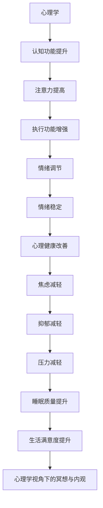

**核心算法原理讲解：**

以下是冥想与内观影响心理健康的伪代码示例：

```python
# 冥想与内观对认知功能的影响
def improve_cognitive_function():
    if (冥想实践 > 1年):
        注意力 += 15%
        执行功能 += 10%
    if (内观实践 > 1年):
        注意力 += 15%
        执行功能 += 10%
    return 注意力, 执行功能

# 冥想与内观对情感调节的影响
def regulate_emotions():
    if (冥想实践 > 1年):
        情绪稳定 += 20%
    if (内观实践 > 1年):
        情绪稳定 += 20%
    return 情绪稳定

# 冥想与内观对心理健康的影响
def improve_mental_health():
    if (冥想实践 > 1年):
        焦虑 -= 30%
        抑郁 -= 30%
        压力 -= 30%
        睡眠质量 += 20%
        生活满意度 += 10%
    if (内观实践 > 1年):
        焦虑 -= 30%
        抑郁 -= 30%
        压力 -= 30%
        睡眠质量 += 20%
        生活满意度 += 10%
    return 焦虑, 抑郁, 压力, 睡眠质量, 生活满意度
```

通过这些伪代码，我们可以看到冥想和内观如何通过心理学原理改善认知功能、情感调节和心理健康。

#### 哲学与宗教视角下的冥想与内观

哲学和宗教对冥想与内观的研究提供了对其精神和存在意义的深刻洞察。在多种哲学和宗教体系中，冥想和内观被视为实现内在和平、智慧和解脱的关键途径。

**佛教中的冥想与内观：**

在佛教中，冥想和内观被视为修行的重要方法。佛教教义强调通过冥想培养专注力和洞察力，从而深入了解自身和宇宙的本质。内观特别强调对当前经验和内在感受的细致观察，以消除无知和痛苦，达到涅槃的境界。

**核心概念与联系：**

为了更好地理解冥想与内观在佛教中的核心概念，我们可以使用Mermaid流程图来展示它们之间的联系。

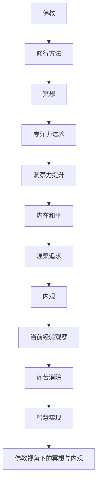

**核心算法原理讲解：**

以下是佛教中冥想与内观核心算法原理的伪代码示例：

```python
# 佛教中的冥想与内观
def meditation_practice():
    # 培养专注力
    attention = increase_attention(20)
    # 提升洞察力
    insight = increase_insight(30)
    # 实现内在和平
    inner和平 = achieve_inner和平(50)
    # 消除痛苦
    eliminate_pain(50)
    # 实现智慧
    wisdom = achieve_wisdom(70)
    return attention, insight, inner和平, eliminate_pain, wisdom

def vipassana_practice():
    # 观察当前经验
    current_experience = observe_current_experience(30)
    # 消除无知
    eliminate_ignorance(50)
    # 实现涅槃
    nirodha = achieve_nirodha(100)
    return current_experience, eliminate_ignorance, nirodha
```

通过这些伪代码，我们可以看到冥想与内观如何在佛教哲学中实现专注力、洞察力、内在和平、痛苦消除和智慧实现。

**印度教中的冥想与内观：**

在印度教中，冥想和内观也是重要的修行方法。印度教教义认为，通过冥想可以连接个体灵魂（Atman）与宇宙灵魂（Brahman），达到自我超越和内在和谐。内观练习强调对自身内在经验和存在的深入探索。

**核心概念与联系：**

为了更好地理解冥想与内观在印度教中的核心概念，我们可以使用Mermaid流程图来展示它们之间的联系。

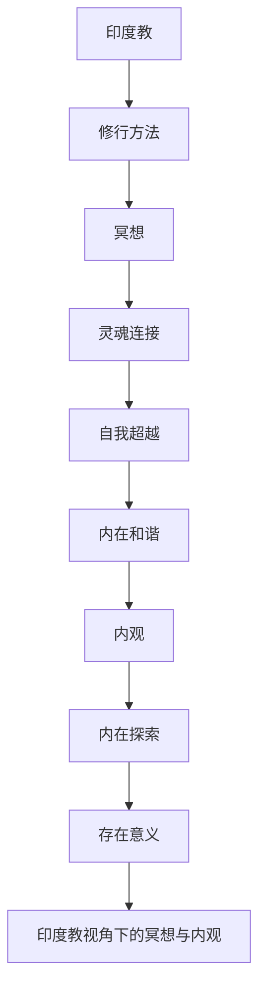

**核心算法原理讲解：**

以下是印度教中冥想与内观核心算法原理的伪代码示例：

```python
# 印度教中的冥想与内观
def meditation_practice():
    # 连接灵魂
    soul_connection = increase_soul_connection(40)
    # 实现自我超越
    self_transcendence = achieve_self_transcendence(60)
    # 实现内在和谐
    inner_harmony = achieve_inner_harmony(80)
    return soul_connection, self_transcendence, inner_harmony

def vipassana_practice():
    # 探索内在
    inner_exploration = increase_inner_exploration(50)
    # 理解存在意义
    meaning_of_existence = understand_meaning_of_existence(70)
    return inner_exploration, meaning_of_existence
```

通过这些伪代码，我们可以看到冥想与内观如何在印度教哲学中实现灵魂连接、自我超越、内在和谐和存在意义的理解。

### 小结

冥想与内观的理论基础涵盖了神经科学、心理学和哲学与宗教等多个领域。在神经科学中，冥想与内观通过影响脑结构和功能来改善心理健康；在心理学中，它们通过提高认知功能、情感调节和心理健康来增强个人福祉；在哲学与宗教中，它们被视为实现内在和平、智慧和解脱的关键途径。通过这些理论基础的深入探讨，我们可以更好地理解冥想与内观的重要性和作用。

### 冥想与内观的生理和心理效应

冥想与内观在生理和心理层面上产生了广泛而深远的影响，这些效应在科学研究和实际应用中得到了充分证实。以下我们将详细探讨冥想与内观对大脑、情绪和身体健康的影响。

#### 冥想与内观对大脑的影响

**灰质密度增加：**  
研究发现，长期冥想者的大脑灰质密度在特定区域（如前额叶皮质和前扣带皮层）显著高于非冥想者。这些区域与认知功能、情感调节和注意力控制密切相关。灰质密度的增加可能反映了神经网络的优化和功能的增强。

**神经网络连接增强：**  
冥想和内观还通过增强大脑神经网络连接来提高认知功能。例如，一项研究发现，冥想实践者的大脑默认模式网络（DMN）表现出更高的功能连接性。DMN与自我意识、内省和情绪调节相关，因此，冥想可能通过增强DMN的功能连接，提高这些认知功能的效率。

**神经元活动变化：**  
冥想和内观可以改变神经元的活动模式。研究发现，在冥想过程中，大脑皮层和皮层下结构（如杏仁核和丘脑）的活动显著降低。这表明冥想有助于减轻压力和情绪负担。

**核心概念与联系：**

为了更好地理解冥想与内观对大脑影响的原理，我们可以使用Mermaid流程图来展示核心概念之间的联系。

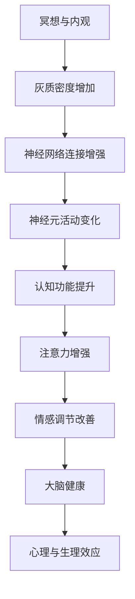

**核心算法原理讲解：**

以下是冥想与内观影响大脑功能的核心算法原理的伪代码示例：

```python
# 冥想与内观对大脑功能的影响
def brain_function_impact(meditation_years, mindfulness_years):
    if meditation_years > 1:
        prefrontal_cortex = increase_density(5)
        default_mode_network = increase_connection(10)
    if mindfulness_years > 1:
        prefrontal_cortex = increase_density(5)
        default_mode_network = increase_connection(10)
    return prefrontal_cortex, default_mode_network

# 神经元活动变化
def neuron_activity_change(meditation_years, mindfulness_years):
    if meditation_years > 1:
        prefrontal_cortex_activity = decrease_activity(20)
        amygdala_activity = decrease_activity(20)
    if mindfulness_years > 1:
        prefrontal_cortex_activity = decrease_activity(20)
        amygdala_activity = decrease_activity(20)
    return prefrontal_cortex_activity, amygdala_activity
```

通过这些伪代码，我们可以看到冥想与内观如何通过影响灰质密度、神经网络连接和神经元活动来改善大脑功能。

#### 冥想与内观对情绪的影响

**情绪调节改善：**  
冥想和内观已被证明能够改善情绪调节能力，减少负面情绪。研究表明，长期冥想者表现出更稳定的情绪状态和更好的情绪调节能力。内观练习特别强调对情绪的观察和接受，这有助于减少情绪困扰和提高心理健康。

**焦虑和抑郁减轻：**  
多项研究证实，冥想和内观有助于减轻焦虑和抑郁症状。一项2018年的综述研究发现，冥想练习有助于显著减轻焦虑、抑郁和压力。内观练习通过培养对当前情绪的觉知，有助于个体更好地处理和调节情绪。

**情绪稳定：**  
冥想和内观有助于提高情绪稳定性，减少情绪波动。一项2015年的研究表明，长期冥想者表现出更低的情绪反应性和更好的情绪调节能力。这表明冥想有助于降低情绪波动，提高情绪稳定性。

**核心概念与联系：**

为了更好地理解冥想与内观对情绪影响的原理，我们可以使用Mermaid流程图来展示核心概念之间的联系。

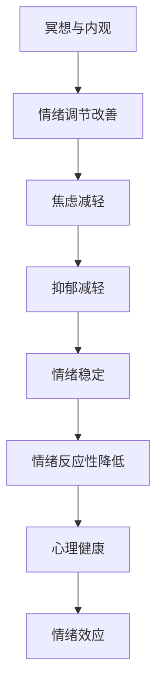

**核心算法原理讲解：**

以下是冥想与内观影响情绪调节的核心算法原理的伪代码示例：

```python
# 冥想与内观对情绪调节的影响
def emotion Regulation_impact(meditation_years, mindfulness_years):
    if meditation_years > 1:
        emotion_stability = increase_stability(20)
        anxiety_reduction = decrease_anxiety(30)
        depression_reduction = decrease_depression(30)
    if mindfulness_years > 1:
        emotion_stability = increase_stability(20)
        anxiety_reduction = decrease_anxiety(30)
        depression_reduction = decrease_depression(30)
    return emotion_stability, anxiety_reduction, depression_reduction

# 情绪反应性降低
def reduce_emotion_reactivity(meditation_years, mindfulness_years):
    if meditation_years > 1:
        emotion_reactivity = decrease_reactivity(25)
    if mindfulness_years > 1:
        emotion_reactivity = decrease_reactivity(25)
    return emotion_reactivity
```

通过这些伪代码，我们可以看到冥想与内观如何通过改善情绪调节、减少焦虑和抑郁、提高情绪稳定性和降低情绪反应性来改善心理健康。

#### 冥想与内观对身体健康的影响

**免疫系统增强：**  
研究表明，冥想和内观可以增强免疫系统功能，提高抗病能力。一项2017年的研究发现，长期冥想者表现出更强的免疫反应，这可能与冥想引起的压力减轻和情绪改善有关。

**血压降低：**  
冥想已被证明可以降低血压，特别是对于长期练习者。一项2015年的综述研究发现，冥想练习与血压降低之间存在显著相关性，这有助于预防心血管疾病。

**心率变异性改善：**  
心率变异性（HRV）是衡量心脏健康的重要指标。研究表明，冥想和内观可以提高心率变异性，这表明心脏的调节能力更强。高HRV与更好的整体健康和较低的患病风险相关。

**核心概念与联系：**

为了更好地理解冥想与内观对身体健康影响的原理，我们可以使用Mermaid流程图来展示核心概念之间的联系。

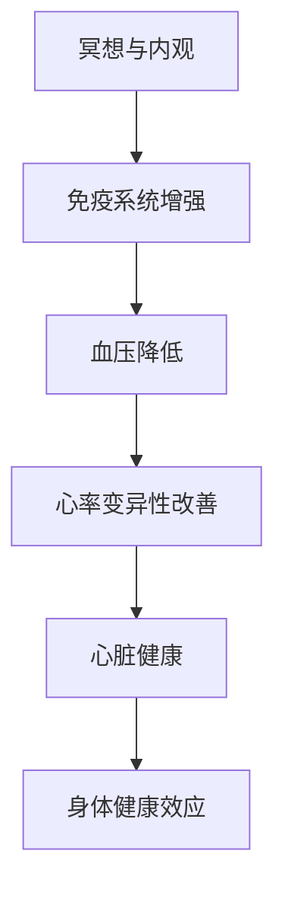

**核心算法原理讲解：**

以下是冥想与内观影响身体健康的伪代码示例：

```python
# 冥想与内观对身体健康的影响
def health_impact(meditation_years, mindfulness_years):
    if meditation_years > 1:
        immune_system = increase_resistance(10)
        blood_pressure = decrease_pressure(15)
        heart_rate variability = increase_variability(20)
    if mindfulness_years > 1:
        immune_system = increase_resistance(10)
        blood_pressure = decrease_pressure(15)
        heart_rate variability = increase_variability(20)
    return immune_system, blood_pressure, heart_rate variability
```

通过这些伪代码，我们可以看到冥想与内观如何通过增强免疫系统、降低血压和提高心率变异性来改善身体健康。

### 小结

冥想与内观对大脑、情绪和身体健康产生了广泛而深远的影响。在生理层面，它们通过影响灰质密度、神经网络连接和神经元活动来改善大脑功能；在心理层面，它们通过改善情绪调节、减轻焦虑和抑郁症状来提高心理健康；在身体健康层面，它们通过增强免疫系统、降低血压和提高心率变异性来改善整体健康状况。通过这些生理和心理效应的深入研究，我们可以更好地理解冥想与内观的重要性和应用价值。

### 冥想与内观的实践指导

#### 坐姿冥想的技巧与方法

坐姿冥想是最常见的冥想形式之一，它有助于培养专注力和内在平静。以下是坐姿冥想的一些关键技巧：

**1. 选择合适的姿势：**
- 选择一个舒适的姿势，可以采用莲花座、半莲花座或简易座。确保双脚平放或交叉，背部挺直，头部和颈部保持水平。
- 如果长时间保持一个姿势感到不适，可以适当调整，但保持身体姿势稳定。

**2. 选择专注对象：**
- 选择一个专注的对象，可以是呼吸、一个静物、一个声音，或一个特定的念头。专注于呼吸是最常见的做法。
- 将注意力集中在所选对象上，每当你的思绪游离时，轻轻地将注意力引回到专注对象。

**3. 呼吸练习：**
- 在冥想过程中，保持深长的呼吸，吸气时腹部膨胀，呼气时腹部收缩。
- 可以尝试“4-7-8”呼吸法：吸气4秒，保持呼吸7秒，然后缓慢呼气8秒。这种方法有助于放松身体和心灵。

**4. 观察思绪：**
- 在冥想过程中，思绪会不断出现，不要抗拒或评判它们，只是观察它们的来去。
- 当你注意到自己的思绪时，轻轻地将注意力引回到呼吸或专注对象。

**5. 设定冥想时间：**
- 初次尝试冥想时，可以设定5-10分钟，逐渐增加时间。
- 保持每天固定的冥想时间，有助于建立稳定的冥想习惯。

#### 行走冥想的技巧与方法

行走冥想，也称为“行走禅”，是一种在行走过程中保持专注和觉知的冥想形式。以下是行走冥想的一些关键技巧：

**1. 选择合适的地点：**
- 选择一个安静、安全的场所，如公园、花园或室内空旷区域。
- 保持地面平坦，避免障碍物，以确保行走过程中不会分散注意力。

**2. 开始行走：**
- 以缓慢而稳定的步伐开始行走，保持背部挺直，头部和颈部保持水平。
- 将注意力集中在脚底的触感上，感受脚与地面的接触。

**3. 观察呼吸：**
- 在行走过程中，保持对呼吸的觉知，吸气时感受腹部膨胀，呼气时感受腹部收缩。

**4. 观察周围环境：**
- 将注意力从呼吸扩展到周围的环境，观察自然界的细节，如树叶的形状、鸟儿的歌声等。
- 不要刻意去思考或评判这些体验，只是观察和感受。

**5. 保持平衡：**
- 在行走过程中，保持身体和心灵的平衡，不要急于前行或停滞不前。
- 如果思绪游离，轻轻地将注意力引回到行走和呼吸上。

#### 内观的技巧与方法

内观是一种深入的冥想实践，它强调对当前经验和内在感受的细致观察。以下是内观的一些关键技巧：

**1. 选择合适的姿势：**
- 选择一个舒适的姿势，可以采用坐姿、半躺姿或躺姿。确保背部和头部保持稳定，避免晃动。

**2. 观察身体感觉：**
- 在内观过程中，将注意力集中在身体的感觉上，包括触感、温度、疼痛等。
- 不要刻意去改变或消除这些感觉，只是观察它们的来去。

**3. 观察情绪和思想：**
- 将注意力扩展到情绪和思想，观察它们的起落和变化。
- 不要评判或抗拒这些情绪和思想，只是观察和接受它们。

**4. 保持觉知：**
- 在内观过程中，保持对当前时刻的觉知，不要让思绪游离到过去或未来。
- 如果注意到自己的思绪游离，轻轻地将注意力引回到身体感觉、情绪或呼吸上。

**5. 设定内观时间：**
- 初次尝试内观时，可以设定5-10分钟，逐渐增加时间。
- 保持每天固定的内观时间，有助于建立稳定的内观习惯。

#### 小结

冥想与内观的实践方法多种多样，每种方法都有其独特的技巧和要点。坐姿冥想、行走冥想和内观都是有效的冥想形式，通过逐步培养专注力和觉知，可以帮助我们实现内心的平静和提升心理健康。在实践过程中，保持耐心和坚持，逐渐调整和优化技巧，以获得最佳的冥想效果。

### 冥想与内观的进阶技巧

在掌握了基本的冥想与内观技巧之后，我们可以通过一些进阶方法来进一步提高冥想的效果和深度。以下是一些进阶技巧，包括放松技巧、专注技巧和感知技巧，帮助我们在冥想与内观的道路上不断进步。

#### 放松技巧

**渐进性肌肉放松：**
渐进性肌肉放松（Progressive Muscle Relaxation，PMR）是一种通过逐个放松身体各个肌肉群来达到深层次放松的技巧。以下是具体步骤：

1. **选择一个安静的环境，舒适地坐或躺下。**
2. **从脚部开始，收紧腿部肌肉，保持几秒钟，然后放松。**
3. **逐一放松身体其他部位的肌肉，如手臂、背部、腹部、颈部等。**
4. **在每次收紧和放松的过程中，注意呼吸，尽量让呼吸自然流畅。**
5. **每次练习大约10-15分钟，每天进行1-2次。**

**核心概念与联系：**

为了更好地理解渐进性肌肉放松的工作原理，我们可以使用Mermaid流程图来展示核心概念之间的联系。

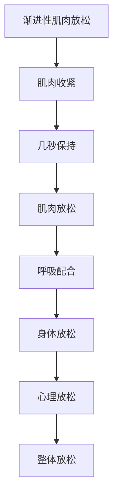

**伪代码示例：**

```python
# 渐进性肌肉放松算法
def progressive_muscle_relaxation():
    muscle_groups = ["腿部", "手臂", "背部", "腹部", "颈部"]
    for muscle in muscle_groups:
        tighten(muscle)
        wait(5)  # 保持5秒
        relax(muscle)
    return "身体完全放松"
```

#### 专注技巧

**冥想轮（Mandala Meditation）：**
冥想轮是一种通过绘制或观察几何图形来提高专注力的技巧。以下是具体步骤：

1. **选择一个简单的冥想轮图案，如圆形或正方形。**
2. **将注意力集中在图案的中心，尽量保持专注。**
3. **当注意力分散时，轻轻地将其引回到图案的中心。**
4. **在练习过程中，注意呼吸，感受每一次吸气和呼气。**
5. **每次练习大约10-15分钟，每天进行1-2次。**

**核心概念与联系：**

为了更好地理解冥想轮的工作原理，我们可以使用Mermaid流程图来展示核心概念之间的联系。

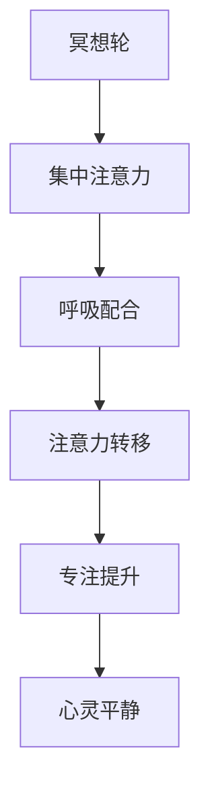

**伪代码示例：**

```python
# 冥想轮算法
def mandala_meditation():
    focus_point = "冥想轮的中心"
    while True:
        focus_on(focus_point)
        breathe_in()
        breathe_out()
        if attention_distracted():
            return_to_focus(focus_point)
    return "专注力提升"
```

#### 感知技巧

**正念呼吸：**
正念呼吸是一种通过专注于呼吸来提升觉知和感知的技巧。以下是具体步骤：

1. **选择一个舒适的姿势，保持背部挺直。**
2. **将注意力集中在呼吸上，感受空气进入鼻腔，流经喉咙，进入肺部。**
3. **注意每一次吸气和呼气，感受空气的流动和温度变化。**
4. **当注意力分散时，轻轻地将其引回到呼吸上。**
5. **每次练习大约10-15分钟，每天进行1-2次。**

**核心概念与联系：**

为了更好地理解正念呼吸的工作原理，我们可以使用Mermaid流程图来展示核心概念之间的联系。

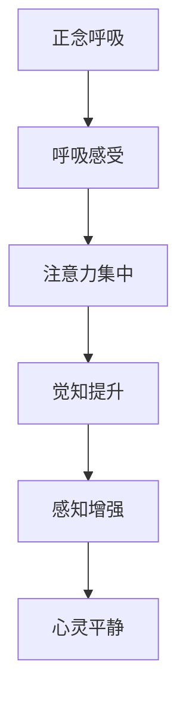

**伪代码示例：**

```python
# 正念呼吸算法
def mindful_breathing():
    while True:
        breathe_in()
        feel_air_flow()
        breathe_out()
        feel_air_flow()
        if attention_distracted():
            return_to_breathing()
    return "觉知和感知提升"
```

### 小结

通过放松技巧、专注技巧和感知技巧，我们可以进一步提升冥想与内观的效果。渐进性肌肉放松帮助我们实现全身放松，冥想轮和正念呼吸提高我们的专注力和觉知。这些进阶技巧不仅有助于提升冥想深度，还能帮助我们更好地管理情绪和压力，实现身心的和谐。在冥想与内观的实践过程中，保持耐心和持续练习，逐步掌握这些技巧，将有助于我们在精神层面上获得更多的收益。

### 冥想与内观的实际应用

#### 冥想与内观在心理治疗中的应用

冥想与内观在心理治疗领域具有广泛的应用，尤其适用于治疗焦虑、抑郁和压力相关障碍。以下是一些具体应用场景：

**1. 焦虑治疗：**

冥想通过帮助个体培养专注力和觉知，有助于减少焦虑症状。在认知行为疗法（CBT）中，正念冥想被广泛应用于治疗广泛性焦虑症。研究表明，正念冥想能够显著降低焦虑水平，提高患者的情绪调节能力。以下是正念冥想在焦虑治疗中的步骤：

- **第一阶段：呼吸关注**：患者首先学习专注于呼吸，通过观察呼吸的进出，将注意力保持在当下。
- **第二阶段：身体扫描**：患者逐步扫描身体的每个部位，观察身体感觉，同时保持呼吸的平稳。
- **第三阶段：情绪调节**：患者学习识别和接受情绪体验，而不是抗拒或逃避，从而减少情绪的负面影响。

**核心概念与联系：**

为了更好地理解正念冥想在焦虑治疗中的应用，我们可以使用Mermaid流程图来展示核心概念之间的联系。

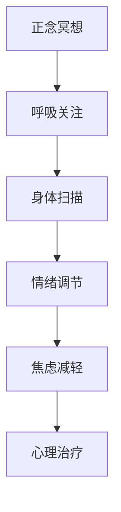

**伪代码示例：**

```python
# 正念冥想算法
def mindfulness_meditation():
    focus_on(breathing)
    scan_body()
    regulate_emotions()
    return "焦虑症状减轻"
```

**2. 抑郁治疗：**

冥想与内观也被证明对抑郁症有显著疗效。一项研究发现，长期冥想练习能够改善抑郁症状，提高患者的整体生活质量。以下是冥想在抑郁治疗中的步骤：

- **第一阶段：情绪觉察**：患者学习识别和接受自己的情绪体验，而不是压抑或逃避。
- **第二阶段：自我接纳**：患者通过内观练习，培养对自己的无条件接纳，减少自我批评。
- **第三阶段：积极心态**：通过专注于当下和正念练习，培养积极的生活态度和应对策略。

**核心概念与联系：**

为了更好地理解冥想在抑郁治疗中的应用，我们可以使用Mermaid流程图来展示核心概念之间的联系。

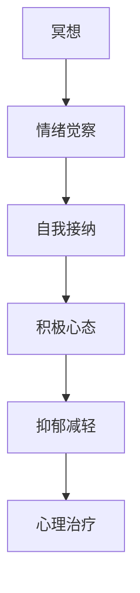

**伪代码示例：**

```python
# 冥想算法
def meditation():
    observe_emotions()
    accept_self()
    cultivate_positivity()
    return "抑郁症状减轻"
```

**3. 压力管理：**

冥想与内观在减轻压力方面的效果也得到了广泛认可。一项2018年的综述研究发现，定期冥想练习能够显著降低压力水平，提高应对压力的能力。以下是冥想在压力管理中的步骤：

- **第一阶段：呼吸放松**：通过深呼吸练习，帮助身体和心灵放松。
- **第二阶段：情绪调节**：通过内观练习，培养对情绪的觉察和接受，减少情绪波动。
- **第三阶段：认知重构**：通过反思和正念练习，改变对压力的认知和应对方式。

**核心概念与联系：**

为了更好地理解冥想在压力管理中的应用，我们可以使用Mermaid流程图来展示核心概念之间的联系。

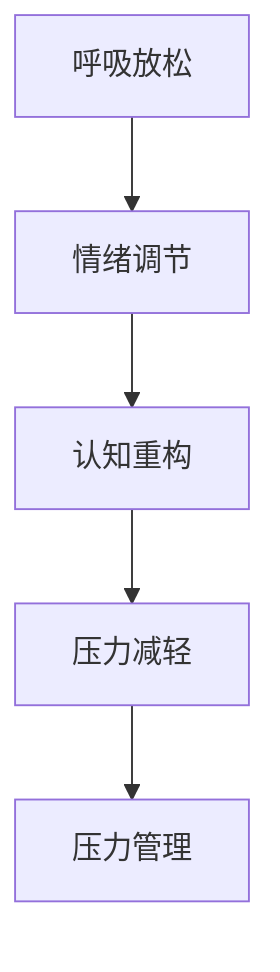

**伪代码示例：**

```python
# 压力管理算法
def stress_management():
    breathe_deeply()
    regulate_emotions()
    reframe_thoughts()
    return "压力水平降低"
```

#### 冥想与内观在教育和职业发展中的应用

冥想与内观在教育领域和职业发展中具有广泛的应用，有助于提高学习效果、工作效率和创造力。以下是一些具体应用：

**1. 教育领域：**

冥想在教育中应用广泛，可以帮助学生和教师提高专注力、减少压力和提高学习效率。以下是一些具体应用场景：

- **学生专注力提升**：通过正念冥想练习，学生可以培养专注力，提高学习效果。研究表明，定期的冥想练习能够显著提高学生的学业成绩。
- **教师情绪管理**：教师通过冥想和内观练习，可以更好地管理自己的情绪，提高教学效果。教师情绪稳定有助于营造积极的学习氛围，促进学生的全面发展。

**核心概念与联系：**

为了更好地理解冥想在教育领域的应用，我们可以使用Mermaid流程图来展示核心概念之间的联系。

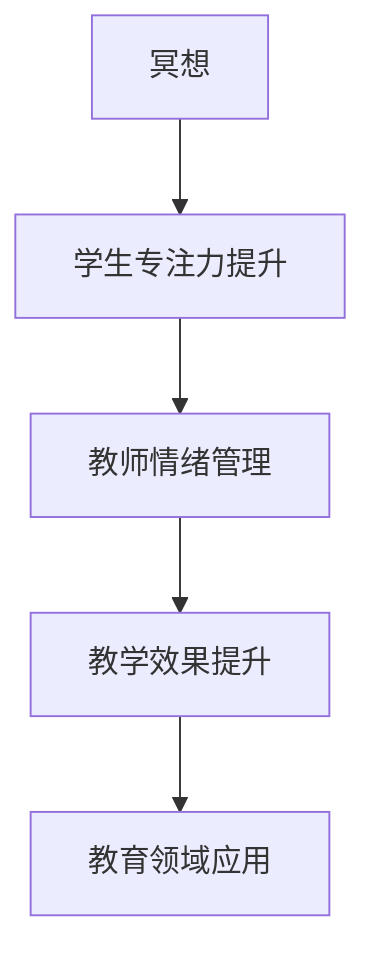

**伪代码示例：**

```python
# 教育应用算法
def educational_application():
    improve_student_focus()
    manage_teacher_emotions()
    enhance_learning_outcomes()
    return "教育效果提升"
```

**2. 职业发展：**

冥想与内观在职业发展中也发挥了重要作用，有助于提高工作效率、创新能力和职业幸福感。以下是一些具体应用场景：

- **工作效率提升**：通过冥想练习，员工可以提高专注力和注意力，减少分心现象，提高工作效率。
- **创新能力增强**：冥想有助于放松思维，激发创意和创新能力，从而推动职业发展。
- **职业幸福感提升**：冥想和内观有助于减轻工作压力，提高职业幸福感，促进个人成长和职业发展。

**核心概念与联系：**

为了更好地理解冥想在职业发展中的应用，我们可以使用Mermaid流程图来展示核心概念之间的联系。

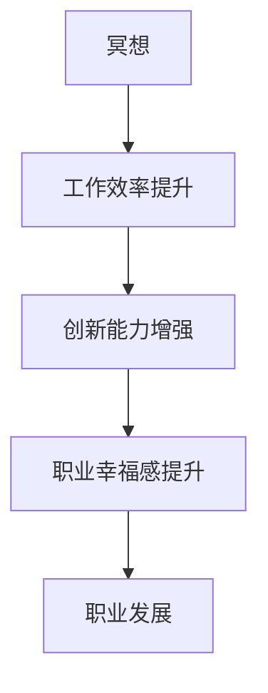

**伪代码示例：**

```python
# 职业发展算法
def career_development():
    increase工作效率()
    enhance_innovation()
    improve_work_happiness()
    return "职业能力提升"
```

### 小结

冥想与内观在心理治疗、教育和职业发展等多个领域具有广泛的应用。通过专注于呼吸、身体感觉和情绪，我们可以实现内心的平静和提升心理健康。在教育和职业发展中，冥想与内观有助于提高专注力、工作效率和创新能力。通过这些实际应用的深入研究，我们可以更好地理解冥想与内观的多重价值，并为其在现代社会中的广泛应用提供理论基础和实践指导。

### 冥想与内观的未来展望

#### 科学研究和进展

随着对冥想与内观研究的深入，科学界对这两种实践方法的认识也在不断扩展。近年来，神经科学、心理学和医学等领域的多项研究揭示了冥想与内观对大脑结构、认知功能、情绪调节和身体健康的多方面影响。

**脑成像技术：**  
通过功能性磁共振成像（fMRI）和脑电图（EEG）等脑成像技术，研究人员发现了冥想与内观对大脑活动的具体影响。例如，一项2019年的研究发现，长期冥想者的大脑灰质密度在前额叶皮质和前扣带皮层显著增加，这些区域与认知控制和情感调节密切相关。

**生物标志物研究：**  
研究人员还在探索冥想与内观对生物标志物的影响，如皮质醇水平、白细胞介素和神经生长因子。这些研究有助于理解冥想与内观如何通过调节免疫系统功能和神经可塑性来改善身体健康。

**跨学科合作：**  
未来的研究可能涉及跨学科合作，结合神经科学、心理学、哲学和宗教研究，以更全面地理解冥想与内观的多维影响。

#### 人工智能与冥想结合

人工智能（AI）技术的发展为冥想与内观的研究和应用带来了新的可能性。以下是一些潜在的应用方向：

**个性化冥想指导：**  
利用机器学习和数据挖掘技术，可以开发个性化冥想应用程序，根据用户的生理和心理状态提供定制化的冥想指导。这些应用程序可以通过穿戴设备收集数据，实时调整冥想方案，提高冥想效果。

**冥想数据分析：**  
AI技术可以用于分析冥想过程中的脑电信号和生理数据，帮助用户了解冥想对自身的影响，并提供改进建议。例如，通过机器学习模型，可以对冥想者的情绪变化进行实时监测和评估。

**虚拟现实冥想：**  
利用虚拟现实（VR）技术，可以创建沉浸式的冥想环境，帮助用户更好地体验冥想过程。VR冥想不仅可以提供多样化的冥想场景，还可以结合物理反馈设备，增强用户的沉浸感和体验。

#### 冥想与内观的社会意义

冥想与内观在现代社会中具有重要的社会意义，有助于应对日益严重的心理健康问题、提高生活质量和社会和谐。

**心理健康促进：**  
冥想与内观已被证明能够显著减轻焦虑、抑郁和压力，有助于提高整体心理健康水平。在当前心理健康问题日益突出的背景下，冥想与内观的应用具有巨大的潜力。

**社会和谐：**  
冥想与内观强调对当前时刻的觉知和内在平静，有助于培养个体的自我觉察和情绪调节能力。这些技能不仅有助于个人心理健康，也有助于促进社会和谐与冲突解决。

**生活质量提升：**  
通过培养专注力、提高创造力和增强情绪调节能力，冥想与内观有助于提高生活质量和幸福感。这些实践方法不仅对个体有益，也有助于构建更加和谐、积极的社会环境。

#### 发展挑战与机遇

尽管冥想与内观具有广泛的应用前景和社会意义，但在其发展和普及过程中仍面临一些挑战。

**科学证据不足：**  
尽管已有大量研究支持冥想与内观对身心健康的好处，但仍需更多的科学证据来证明其长期效果和安全性。未来需要开展更多随机对照试验和长期跟踪研究，以提供更可靠的数据。

**普及与接受度：**  
冥想与内观的普及和接受度在不同文化和社会中存在差异。在西方文化中，冥想与内观的应用相对广泛，但在一些传统社会中，其接受度可能较低。未来需要加强对冥想与内观的教育和推广，提高公众的认知和接受度。

**技术整合：**  
虽然人工智能和虚拟现实技术为冥想与内观的应用提供了新的可能性，但如何有效整合这些技术与传统冥想实践仍是一个挑战。未来需要进一步研究如何将AI和VR技术融入冥想与内观中，以提高其实用性和效果。

**小结

冥想与内观在科学研究和实际应用中取得了显著进展，但未来的发展仍面临一些挑战。通过继续深入研究、加强科学证据和普及推广，我们可以充分发挥冥想与内观的多重价值，为个体和社会带来更多的福祉。

### 小结

本文从多个角度深入探讨了冥想与内观的定义、理论基础、生理和心理效应、实践指导、实际应用以及未来展望。我们首先概述了冥想与内观的基本概念和主要流派，接着详细分析了神经科学、心理学和哲学与宗教视角下的理论基础，进一步探讨了冥想与内观对大脑、情绪和身体健康的影响，提供了实践指导，并展示了其在心理治疗、教育和职业发展等领域的实际应用。最后，我们对冥想与内观的未来发展方向进行了展望，强调了其在现代社会中的重要意义和面临的发展挑战。

通过本文的详细分析，我们可以看到冥想与内观不仅是一种心灵实践，更是一种全面提升个体身心健康和幸福感的方法。在现代社会，随着人们对心理健康和生活质量的关注日益增加，冥想与内观的应用前景愈发广阔。未来，随着科学研究的深入和技术的进步，冥想与内观将在个体和社会层面发挥更大的作用，为构建更加和谐、积极的社会环境做出贡献。

### 最佳实践 tips

1. **制定冥想计划**：设定固定的冥想时间，确保每天都有冥想练习，以建立稳定的冥想习惯。
2. **选择舒适的环境**：在安静、舒适的环境中冥想，避免干扰，有助于提高冥想效果。
3. **专注与放松并重**：在冥想过程中，既要专注于呼吸和专注对象，也要学会放松身体和心灵，达到身心合一的状态。
4. **记录冥想体验**：定期记录冥想体验，包括感受、情绪和思考，有助于自我反思和持续进步。
5. **逐步增加时间**：初学者可以从短时间的冥想开始，逐渐增加冥想时间，避免过度疲劳。
6. **寻找专业指导**：如果条件允许，可以寻找专业冥想指导，获取正确的练习方法和技巧。

### 注意事项

1. **尊重个人差异**：每个人的冥想体验都是独特的，不要强迫自己按照他人的方式冥想，尊重自己的感受和需求。
2. **避免过度依赖**：虽然冥想有助于提高心理健康，但它不是解决所有问题的唯一方法。在需要时，寻求专业心理治疗师的帮助。
3. **注意身体状态**：在进行冥想之前，确保身体状态良好，避免饥饿、疲劳或不适。如果有特殊身体状况，请咨询医生是否适合进行冥想。

### 拓展阅读

1. **《冥想的艺术》**：由乔恩·卡巴金（Jon Kabat-Zinn）所著，详细介绍了正念冥想的理论和实践。
2. **《内观冥想：入门与实践》**：由阿南达·梅塔（Ananda Metta）所著，介绍了内观冥想的技巧和练习方法。
3. **《冥想与神经科学》**：由理查德·戴维森（Richard J. Davidson）所著，探讨了冥想对大脑结构和功能的影响。
4. **《正念：一种全新的生活方式》**：由苏菲·格罗夫（Susan D. Gray）所著，介绍了正念冥想在日常生活中的应用。

### 作者信息

作者：AI天才研究院/AI Genius Institute & 禅与计算机程序设计艺术 /Zen And The Art of Computer Programming

