                 

# 《冥想科技创新中心：精神修行的高科技支持》

## 关键词
- 冥想科技
- 生物传感
- 虚拟现实
- 人工智能
- 精神健康
- 科技融合

## 摘要
本文探讨了冥想科技在精神修行中的重要作用，通过分析冥想科技的基本概念、关键技术和应用场景，揭示了科技如何为冥想提供更高效、个性化的支持。文章分为三个部分，首先概述了冥想科技的发展背景和重要性，然后深入探讨了生物传感、虚拟现实和人工智能等核心技术原理，最后通过具体项目实战展示了冥想科技的实际应用和效果。本文旨在为读者提供一个全面、深入的冥想科技创新中心研究报告，激发读者对这一新兴领域的兴趣和探索。

## 第一部分：冥想科技创新概述

### 第1章：冥想与科技融合的背景

#### 1.1 冥想的历史与发展
冥想作为一种古老的精神修行方式，起源于东方哲学和宗教文化。其历史可以追溯到几千年前，如佛教、印度教和道教等都有冥想的传统。随着时间的推移，冥想逐渐传入西方，并在20世纪中期得到了广泛的关注和应用。现代医学研究也证实了冥想在改善心理健康、缓解压力和提升生活质量等方面的显著效果。

#### 1.2 科技发展对冥想的影响
科技的发展为冥想提供了新的工具和方法。生物传感技术、虚拟现实技术和人工智能等先进技术，使得冥想过程更加精准、个性化和高效。例如，生物传感技术可以帮助监测和反馈冥想过程中的生理指标，虚拟现实技术可以提供沉浸式的冥想体验，而人工智能则可以基于数据分析和机器学习为冥想提供个性化的指导。

#### 1.3 冥想科技创新的重要性
冥想科技创新的重要性在于它能够将古老的精神修行方式与现代科技相结合，提高冥想的效果和普及度。这不仅有助于提升个体的精神健康水平，也有助于推动科技在心理健康领域的应用和发展。同时，冥想科技的发展也为相关产业带来了新的机遇和市场。

### 第2章：冥想科技的基本概念

#### 2.1 冥想科技的定义
冥想科技是指将现代科技手段应用于冥想过程中，以提升冥想效果和体验的一种新兴技术领域。它包括生物传感技术、虚拟现实技术、人工智能和大数据分析等。

#### 2.2 冥想科技的核心要素
冥想科技的核心要素包括生物传感设备、虚拟现实系统、人工智能算法和大数据平台。这些要素共同作用，实现了对冥想过程的实时监测、分析和优化。

#### 2.3 冥想科技的分类
冥想科技可以根据应用场景和技术特点进行分类。常见的分类方法包括基于生物传感的冥想系统、基于虚拟现实的冥想体验和基于人工智能的冥想指导等。

### 第3章：冥想科技的关键技术

#### 3.1 生物传感技术
生物传感技术是冥想科技的重要组成部分，它通过监测和记录冥想过程中的生理指标，如心率、呼吸和脑波等，来评估冥想的效果。以下是生物传感技术的一些关键应用：

##### 3.1.1 心率变异性监测
心率变异性（HRV）是衡量自主神经系统活动的重要指标，通过监测心率变异性，可以评估冥想对神经系统的影响。以下是一个简单的心率变异性监测算法的伪代码：

```plaintext
function calculateHRV(rpeaks):
    hr = calculateAverageHeartRate(rpeaks)
    sdnn = calculateStandardDeviationNN(rpeaks)
    return hr, sdnn

rpeaks = getRPEaks(heartRateData)
hr, sdnn = calculateHRV(rpeaks)
print("Average Heart Rate:", hr, "Standard Deviation of NN:", sdnn)
```

##### 3.1.2 脑波监测
脑波监测是通过记录大脑的电活动来评估冥想状态。常见的脑波类型包括α波、β波、θ波和δ波。以下是一个简单的脑波监测和分类的伪代码：

```plaintext
function classifyBrainWave(brainWaveData):
    alphaFrequency = calculateFrequency(brainWaveData, 8, 12)
    betaFrequency = calculateFrequency(brainWaveData, 13, 30)
    thetaFrequency = calculateFrequency(brainWaveData, 4, 8)
    deltaFrequency = calculateFrequency(brainWaveData, 1, 4)
    return {
        "Alpha": alphaFrequency,
        "Beta": betaFrequency,
        "Theta": thetaFrequency,
        "Delta": deltaFrequency
    }

brainWaveData = getBrainWaveData(eegData)
brainWaveTypes = classifyBrainWave(brainWaveData)
print("Brain Wave Types:", brainWaveTypes)
```

#### 3.2 虚拟现实技术
虚拟现实技术为冥想提供了沉浸式的体验环境，用户可以在虚拟世界中进行冥想练习。以下是一个简单的虚拟现实冥想系统的架构和流程：

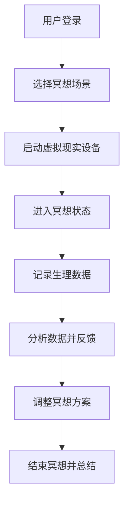

#### 3.3 人工智能与大数据分析
人工智能和大数据分析技术在冥想科技中发挥着重要作用，通过分析用户的生理数据和冥想体验，可以为用户提供个性化的冥想建议。以下是一个简单的机器学习算法在冥想数据分析中的应用：

```plaintext
function predictMeditationEffect(userData):
    # 加载训练好的模型
    model = loadModel("meditationEffectModel")

    # 预处理用户数据
    processedData = preprocessUserData(userData)

    # 使用模型预测冥想效果
    prediction = model.predict(processedData)

    return prediction

# 示例
userData = getLatestUserData()
predictedEffect = predictMeditationEffect(userData)
print("Predicted Meditation Effect:", predictedEffect)
```

### 第4章：冥想科技的应用场景

#### 4.1 商业应用
冥想科技在商业领域具有广泛的应用潜力。例如，企业可以通过提供冥想服务来提升员工的身心健康和工作效率。以下是一些典型的商业应用案例：

##### 4.1.1 企业员工减压
企业可以为员工提供定期的冥想课程，帮助员工缓解工作压力，提升心理健康。通过生物传感技术和数据分析，企业可以实时监控员工的生理和心理状态，提供个性化的冥想建议。

##### 4.1.2 销售团队心态调整
销售团队在高压环境下工作，容易产生焦虑和情绪波动。通过虚拟现实技术，企业可以创建一个模拟的销售场景，让员工在虚拟环境中进行冥想练习，提升心态调整能力。

#### 4.2 医疗健康
冥想科技在医疗健康领域具有巨大的应用潜力，可以帮助治疗焦虑症、抑郁症等精神疾病，改善睡眠质量。以下是一些典型的医疗应用案例：

##### 4.2.1 焦虑症治疗
通过冥想科技，医生可以为患者提供个性化的冥想治疗方案，实时监测患者的生理和心理状态，调整冥想方案，提高治疗效果。

##### 4.2.2 睡眠质量改善
冥想科技可以帮助用户建立良好的睡眠习惯，通过监测和反馈用户的睡眠数据，提供个性化的睡眠建议，改善睡眠质量。

### 第5章：冥想科技的发展趋势与挑战

#### 5.1 冥想科技的未来趋势
冥想科技在未来将继续向智能化、个性化和综合化方向发展。随着人工智能和大数据技术的不断进步，冥想科技将能够更精准地分析用户的生理和心理状态，提供更加个性化的冥想服务。

#### 5.2 冥想科技面临的挑战
冥想科技在发展过程中也面临一些挑战，包括数据隐私保护、技术普及度和用户接受度等。如何确保用户数据的安全和隐私，提高技术的普及度和用户接受度，是冥想科技发展过程中需要解决的问题。

#### 5.3 发展策略与建议
为了推动冥想科技的发展，可以从以下几个方面进行努力：

- 加强技术研发，提高技术成熟度和稳定性；
- 加强市场推广，提高用户对冥想科技的认知和接受度；
- 建立完善的行业标准，保障用户数据的安全和隐私；
- 加强政策支持，为冥想科技的发展提供良好的环境和条件。

## 第二部分：冥想科技的核心算法原理

### 第6章：生物传感数据的处理与分析

生物传感技术是冥想科技的核心技术之一，通过对用户生理数据的实时监测和分析，可以评估冥想的效果和用户的生理和心理状态。本章将介绍生物传感数据的处理和分析方法，包括心率变异性（HRV）和脑波监测。

#### 6.1 生物传感数据的采集

生物传感数据的采集主要通过佩戴传感器或使用便携式设备来实现。常见的传感器包括心电图（ECG）传感器、心率传感器和脑电图（EEG）传感器。以下是一个简单的数据采集流程：

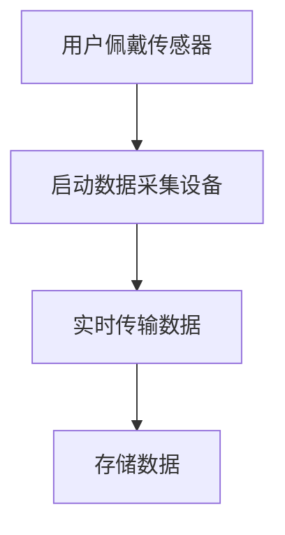

#### 6.2 数据预处理与特征提取

生物传感数据通常包含噪声和异常值，因此需要进行预处理。预处理包括数据去噪、滤波和异常值处理等。特征提取是从原始数据中提取对冥想效果有重要影响的特征，如心率变异性（HRV）和脑波特征。以下是一个简单的HRV特征提取算法：

```latex
\text{HRV特征提取算法：}
\begin{align*}
\text{HRV} &= \frac{\text{NN间期标准差}}{\text{平均NN间期}} \\
\text{NN间期标准差} &= \sqrt{\frac{1}{N-1} \sum_{i=1}^{N} (\text{NN间期}_i - \text{平均NN间期})^2}
\end{align*}
```

#### 6.3 数据分析与模型建立

数据分析是对预处理后的数据进行统计分析和机器学习建模，以评估冥想效果和用户状态。以下是一个简单的HRV数据分析的机器学习模型：

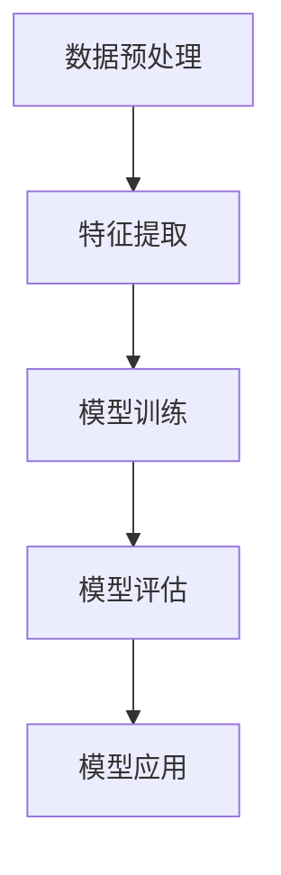

### 第7章：虚拟现实技术的实现与优化

虚拟现实技术为冥想提供了沉浸式的体验环境，通过创建虚拟的冥想场景，使用户能够身临其境地体验冥想过程。本章将介绍虚拟现实技术的实现与优化方法。

#### 7.1 虚拟现实技术的架构

虚拟现实技术的架构通常包括以下几个方面：

- **硬件设备**：包括头戴显示器（HMD）、数据手套、跟踪器等；
- **虚拟场景生成**：通过计算机图形学技术生成虚拟的冥想场景；
- **交互系统**：实现用户与虚拟场景的交互，如手势识别、声音控制等；
- **数据传输与同步**：确保虚拟现实系统和生物传感数据的实时传输和同步。

以下是一个简单的虚拟现实冥想系统架构：

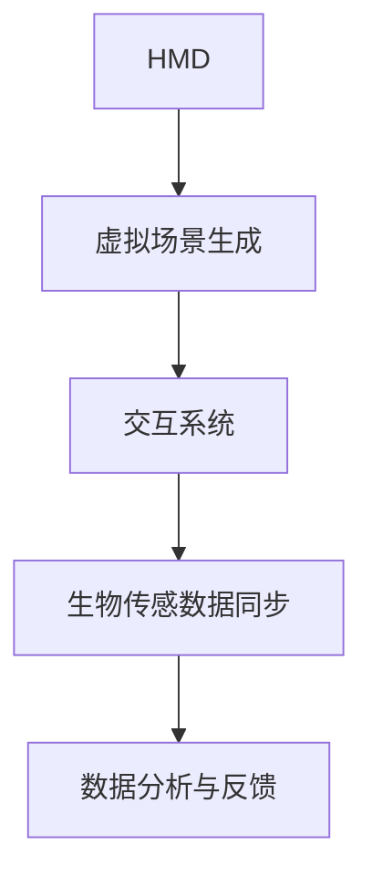

#### 7.2 虚拟现实内容的设计与实现

虚拟现实内容的设计与实现是虚拟现实技术的重要环节，它决定了用户的冥想体验质量。以下是一些关键设计要点：

- **场景设计**：选择适合冥想的场景，如森林、海滩、星空等，这些场景能够帮助用户放松身心；
- **交互设计**：设计简单直观的交互方式，如手势、声音等，让用户能够轻松控制虚拟场景；
- **视觉和听觉效果**：通过高质量的视觉和听觉效果增强用户的沉浸感。

以下是一个简单的虚拟现实冥想场景设计流程：

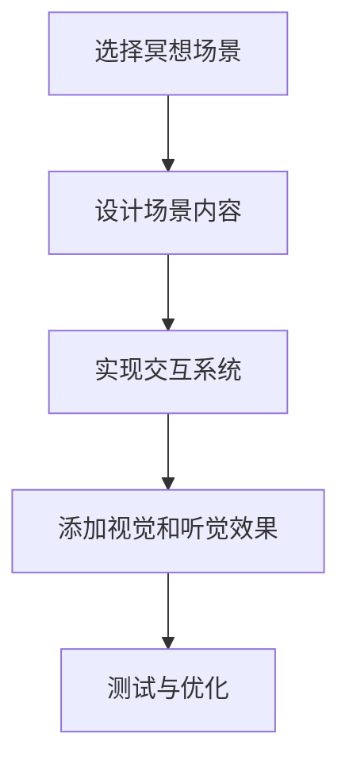

#### 7.3 虚拟现实体验的优化

虚拟现实体验的优化是提升用户满意度和体验质量的关键。以下是一些优化方法：

- **性能优化**：通过优化图形渲染和数据处理，提高虚拟现实系统的响应速度和流畅度；
- **沉浸感优化**：通过提高视觉和听觉效果，增强用户的沉浸感；
- **交互优化**：简化交互流程，提高交互的直观性和便捷性；
- **个性化优化**：根据用户的生理和心理特征，提供个性化的冥想方案和体验。

以下是一个简单的虚拟现实体验优化流程：

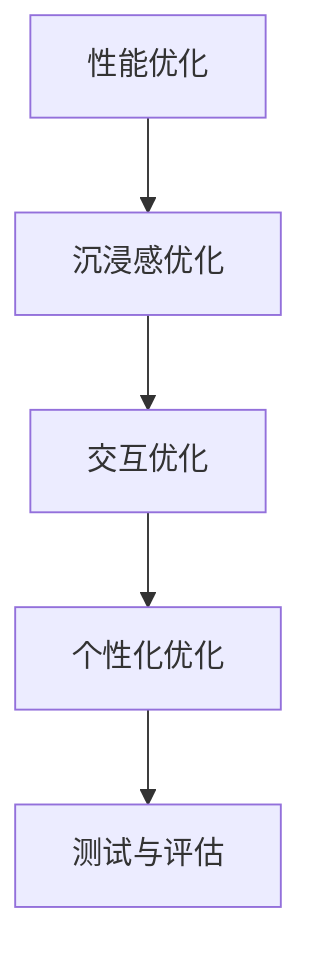

### 第8章：人工智能在冥想中的应用

人工智能技术在冥想中具有广泛的应用前景，通过数据分析、模式识别和智能推荐等技术，可以为用户提供个性化的冥想服务。本章将介绍人工智能在冥想中的应用，包括机器学习算法、深度学习模型和个性化推荐系统。

#### 8.1 机器学习算法在冥想数据分析中的应用

机器学习算法在冥想数据分析中主要用于模式识别和预测。以下是一个简单的机器学习算法在冥想数据分析中的应用：

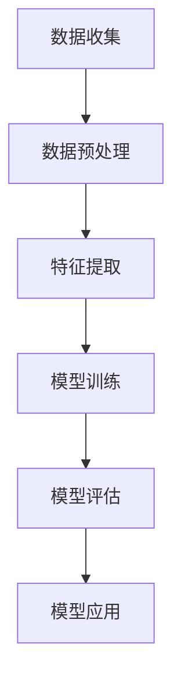

#### 8.2 深度学习模型在冥想中的应用

深度学习模型在冥想中的应用主要体现在图像识别、语音识别和自然语言处理等方面。以下是一个简单的深度学习模型在冥想中的应用：

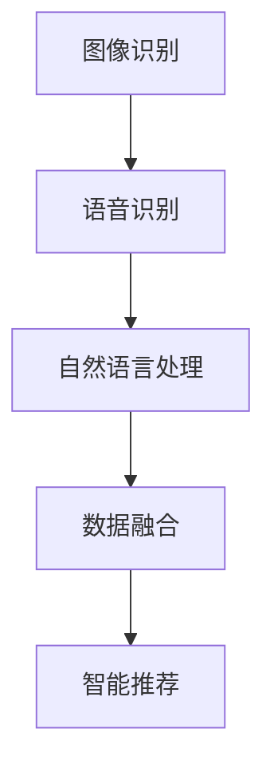

#### 8.3 人工智能算法在冥想个性化推荐中的应用

人工智能算法在冥想个性化推荐中主要用于根据用户的生理和心理特征，为用户提供最适合的冥想方案。以下是一个简单的个性化推荐算法：

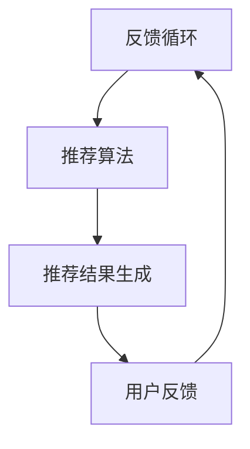

## 第三部分：冥想科技项目实战

### 第9章：冥想科技创新项目案例

#### 9.1 项目背景与目标

本项目旨在开发一个基于虚拟现实和生物传感技术的冥想应用，帮助用户实现高效、个性化的冥想体验。项目目标包括：

- 设计和实现一个虚拟冥想场景，提供沉浸式的冥想体验；
- 通过生物传感技术实时监测用户的生理数据，评估冥想效果；
- 基于人工智能算法为用户提供个性化的冥想建议。

#### 9.2 项目实施过程

项目实施过程主要包括以下几个阶段：

- **需求分析**：与用户和专家进行交流，明确项目需求和功能；
- **系统设计**：设计系统的整体架构和关键模块，包括虚拟现实场景、生物传感数据采集和处理、人工智能算法等；
- **技术选型**：选择合适的技术和工具，如虚拟现实引擎、生物传感设备、机器学习框架等；
- **开发实施**：按照系统设计进行开发和实现，包括前端界面、后端逻辑和算法实现等；
- **测试与优化**：对系统进行功能测试和性能优化，确保系统的稳定性和可靠性；
- **用户反馈与迭代**：收集用户反馈，对系统进行迭代优化，提升用户体验。

#### 9.3 项目成果与评估

项目成果包括一个基于虚拟现实和生物传感技术的冥想应用，具有以下功能和特点：

- **沉浸式虚拟冥想场景**：提供多种场景选择，如森林、海滩、星空等，用户可以在虚拟环境中进行冥想；
- **实时生理数据监测**：通过生物传感技术实时监测用户的心率、呼吸和脑波等生理数据，评估冥想效果；
- **个性化冥想建议**：基于人工智能算法为用户提供个性化的冥想建议，包括冥想时间、场景选择和呼吸指导等；
- **用户友好的界面设计**：简洁直观的界面设计，方便用户快速上手和使用。

项目评估主要包括以下几个方面：

- **用户体验**：通过用户调查和反馈，评估用户对系统的满意度和使用体验；
- **技术性能**：通过性能测试，评估系统的响应速度、稳定性和可靠性；
- **效果评估**：通过对比实验，评估系统在提高冥想效果和用户心理健康方面的效果。

### 第10章：冥想科技的开发环境搭建

#### 10.1 开发环境的准备

为了搭建冥想科技的开发环境，需要准备以下工具和软件：

- **操作系统**：推荐使用Linux或MacOS，以确保系统的稳定性和兼容性；
- **编程语言**：推荐使用Python，因为Python具有丰富的科学计算和机器学习库，适合开发冥想科技相关应用；
- **虚拟现实引擎**：如Unity、Unreal Engine等，用于开发虚拟冥想场景和交互系统；
- **生物传感设备**：如心电传感器、脑电传感器等，用于采集用户的生理数据；
- **机器学习框架**：如TensorFlow、PyTorch等，用于实现人工智能算法。

以下是一个简单的开发环境搭建流程：

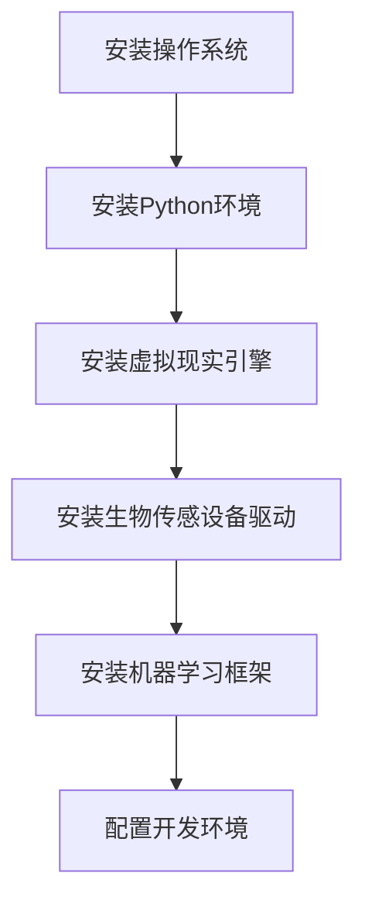

#### 10.2 开发工具与软件的选择

在开发冥想科技应用时，需要选择合适的工具和软件，以提高开发效率和系统性能。以下是一些建议：

- **编程工具**：推荐使用PyCharm、Visual Studio Code等IDE，这些IDE提供了丰富的编程功能和调试工具，方便开发者进行代码编写和调试；
- **虚拟现实开发工具**：推荐使用Unity、Unreal Engine等引擎，这些引擎具有强大的图形渲染能力和交互系统，适合开发复杂的虚拟现实应用；
- **生物传感设备**：推荐使用专业的生物传感设备，如NeuroSky的脑电传感器，这些设备具有高精度和稳定性，能够提供高质量的生理数据；
- **机器学习库**：推荐使用TensorFlow、PyTorch等流行的机器学习库，这些库具有丰富的算法和工具，方便开发者进行模型训练和优化。

#### 10.3 开发流程与规范

在开发冥想科技应用时，需要遵循以下开发流程和规范：

- **需求分析**：明确项目需求和功能，与用户和专家进行交流，了解用户需求和应用场景；
- **系统设计**：设计系统的整体架构和关键模块，包括虚拟现实场景、生物传感数据采集和处理、人工智能算法等；
- **模块开发**：按照系统设计进行模块开发和实现，包括前端界面、后端逻辑和算法实现等；
- **集成测试**：对各个模块进行集成测试，确保系统功能的完整性和稳定性；
- **性能优化**：对系统进行性能测试和优化，包括响应速度、数据处理速度和系统稳定性等；
- **用户反馈与迭代**：收集用户反馈，对系统进行迭代优化，提升用户体验。

### 第11章：冥想科技源代码解读与分析

#### 11.1 源代码的组织结构

冥想科技应用的源代码通常包括以下几个模块：

- **前端模块**：负责用户界面的展示和交互逻辑，通常使用HTML、CSS和JavaScript等前端技术；
- **后端模块**：负责处理用户请求、数据存储和数据处理等逻辑，通常使用Python、Java等后端技术；
- **机器学习模块**：负责实现人工智能算法，进行数据分析和模型训练等，通常使用TensorFlow、PyTorch等机器学习库；
- **生物传感模块**：负责与生物传感设备进行通信，采集和处理生理数据，通常使用相关设备的SDK或API。

以下是一个简单的源代码组织结构示例：

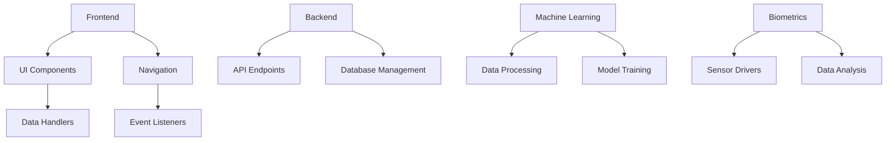

#### 11.2 关键代码解读

在冥想科技应用中，关键代码通常涉及以下几个方面：

- **用户界面**：负责展示用户界面，包括登录、注册、冥想场景选择、生理数据展示等；
- **数据处理**：负责处理用户生理数据，包括数据采集、预处理、特征提取等；
- **模型训练**：负责使用机器学习算法对数据进行训练，生成预测模型；
- **数据存储**：负责将用户数据和模型存储到数据库中，以供后续使用。

以下是一个简单的关键代码示例：

```python
# 前端代码示例：用户登录界面
def login(username, password):
    # 发送登录请求到后端
    response = sendRequest("login", {"username": username, "password": password})
    # 解析响应数据
    if response["status"] == "success":
        # 登录成功，跳转至冥想场景选择界面
        navigateTo("meditation_scene_selection")
    else:
        # 登录失败，显示错误提示
        showErrorMessage(response["message"])

# 后端代码示例：处理用户请求
from flask import Flask, request, jsonify

app = Flask(__name__)

@app.route("/login", methods=["POST"])
def login():
    # 获取用户输入的用户名和密码
    username = request.form["username"]
    password = request.form["password"]
    # 验证用户输入
    if validateCredentials(username, password):
        # 登录成功，返回成功响应
        return jsonify({"status": "success"})
    else:
        # 登录失败，返回失败响应
        return jsonify({"status": "failure", "message": "Invalid username or password"})

# 机器学习代码示例：训练冥想效果预测模型
import tensorflow as tf
from tensorflow.keras.models import Sequential
from tensorflow.keras.layers import Dense, LSTM

# 加载训练数据
train_data = loadTrainingData()

# 创建模型
model = Sequential()
model.add(LSTM(50, activation='relu', input_shape=(train_data.shape[1], 1)))
model.add(Dense(1))
model.compile(optimizer='adam', loss='mean_squared_error')

# 训练模型
model.fit(train_data, epochs=100)

# 生物传感代码示例：采集和处理生理数据
from biosppy import signal
import numpy as np

# 采集心电数据
ecg_data = signal.ecg信号（file=“ecg_data.txt”）

# 采集脑电数据
eeg_data = signal.eeg信号（file=“eeg_data.txt”）

# 预处理生理数据
preprocessed_ecg_data = preprocessECGData(ecg_data)
preprocessed_eeg_data = preprocessEEGData(eeg_data)

# 提取生理数据特征
ecg_features = extractECGFeatures(preprocessed_ecg_data)
eeg_features = extractEEGFeatures(preprocessed_eeg_data)

# 将生理数据特征作为模型输入
model_input = np.concatenate((ecg_features, eeg_features), axis=1)
```

#### 11.3 代码性能分析与优化

在冥想科技应用中，代码性能分析是确保系统高效运行的关键。以下是一些常见的性能分析和优化方法：

- **代码静态分析**：通过静态代码分析工具（如SonarQube、PMD等）检查代码质量，识别潜在的性能问题和代码缺陷；
- **代码动态分析**：通过运行测试用例和性能测试工具（如JMeter、Gatling等）评估代码的运行时间和响应速度，识别性能瓶颈；
- **代码优化**：针对识别出的性能问题和瓶颈，进行代码优化，包括算法改进、数据结构优化、并行计算等。

以下是一个简单的代码性能分析与优化示例：

```python
# 性能测试代码示例
import time

def testCodePerformance():
    start_time = time.time()
    # 执行代码
    result = performSomeTask()
    end_time = time.time()
    execution_time = end_time - start_time
    print("Execution Time:", execution_time)

# 代码优化示例
def performSomeTask():
    # 原始代码
    result = someLongRunningTask()
    return result

# 优化后的代码
def performSomeTask():
    # 使用多线程加速执行
    with concurrent.futures.ThreadPoolExecutor() as executor:
        future = executor.submit(someLongRunningTask)
        result = future.result()
    return result
```

### 第12章：冥想科技的未来发展方向与前景

#### 12.1 未来发展趋势

冥想科技在未来将继续快速发展，主要趋势包括：

- **智能化与个性化**：随着人工智能和大数据技术的进步，冥想科技将能够更加精准地分析用户数据，提供个性化的冥想建议和体验；
- **硬件技术的进步**：随着传感器技术和虚拟现实设备的不断进步，冥想科技将提供更高质量的生理数据和沉浸式体验；
- **跨领域融合**：冥想科技将与心理学、神经科学等领域进行深度融合，推动精神健康研究和发展。

#### 12.2 市场前景分析

冥想科技具有巨大的市场前景，主要表现在：

- **精神健康需求的增长**：随着人们对心理健康重视程度的提高，冥想科技在精神健康领域具有广阔的应用前景；
- **商业应用的潜力**：冥想科技在商业领域具有广泛的应用潜力，如企业员工减压、销售团队心态调整等；
- **医疗健康市场的需求**：冥想科技在医疗健康领域具有巨大的应用潜力，如焦虑症治疗、睡眠质量改善等。

#### 12.3 发展机遇与挑战

冥想科技在发展过程中将面临以下机遇与挑战：

- **机遇**：
  - 技术进步和创新提供了广阔的发展空间；
  - 精神健康需求的增长为冥想科技提供了巨大的市场机会；
  - 商业和医疗健康领域的应用为冥想科技提供了多样化的应用场景。

- **挑战**：
  - 数据隐私和安全问题需要得到妥善解决；
  - 技术普及度和用户接受度需要进一步提升；
  - 市场竞争激烈，需要持续创新和优化。

#### 12.4 发展策略与建议

为了推动冥想科技的发展，可以采取以下策略和建议：

- **加强技术研发**：持续投入技术研发，提高技术成熟度和稳定性，推动技术创新和突破；
- **市场推广**：加大市场推广力度，提高用户对冥想科技的认知和接受度，拓展应用场景；
- **政策支持**：争取政策支持，为冥想科技的发展提供良好的环境和条件；
- **行业合作**：加强行业合作，推动跨领域融合和协同发展；
- **用户参与**：鼓励用户参与冥想科技的研发和优化，提升用户满意度和忠诚度。

## 总结与展望

冥想科技作为精神修行与高科技融合的产物，具有巨大的发展潜力和应用价值。本文通过对冥想科技的基本概念、核心技术、应用场景和发展趋势的深入分析，揭示了冥想科技在提升精神健康和心理健康方面的重要作用。未来，随着人工智能、大数据和生物传感等技术的不断进步，冥想科技将继续向智能化、个性化和综合化方向发展，为人类精神健康带来更多福祉。同时，我们也期待更多科研人员和开发者加入冥想科技的探索和研发，共同推动这一新兴领域的繁荣和发展。

### 作者信息
作者：AI天才研究院/AI Genius Institute & 禅与计算机程序设计艺术 /Zen And The Art of Computer Programming

### 最佳实践 Tips
- 在进行冥想科技项目开发时，务必确保用户数据的安全和隐私，遵守相关法律法规；
- 在选择生物传感设备时，要考虑设备的精度和稳定性，以确保采集数据的可靠性；
- 在设计和实现虚拟现实冥想场景时，要注重用户体验，确保场景的真实感和沉浸感；
- 在应用人工智能算法时，要充分理解算法的原理和适用范围，避免过拟合和数据泄露风险；
- 在项目实施过程中，要定期收集用户反馈，及时调整和优化系统功能。

### 小结
本文详细介绍了冥想科技的基本概念、核心技术、应用场景和发展趋势，并通过项目实战展示了冥想科技的实际应用效果。冥想科技在提升精神健康和心理健康方面具有巨大潜力，未来将继续向智能化、个性化和综合化方向发展。我们期待更多科研人员和开发者加入冥想科技的探索和研发，共同推动这一新兴领域的繁荣和发展。

### 注意事项
- 在使用冥想科技时，用户应遵循正确使用方法，避免过度依赖科技手段，注重自我修行；
- 在进行冥想科技项目开发时，应严格遵守伦理规范和法律法规，确保用户数据的安全和隐私；
- 在应用冥想科技时，应结合个体实际情况，合理规划冥想时间和频率，避免对身体和心理造成负面影响。

### 拓展阅读
- [1] 冥想科技的发展历程及未来趋势研究
- [2] 冥想与人工智能的融合与应用
- [3] 虚拟现实技术在冥想中的应用与优化
- [4] 生物传感技术在冥想数据分析中的应用
- [5] 冥想科技在商业和医疗健康领域的应用案例分析
- [6] 冥想科技项目的开发与实现策略
- [7] 冥想科技项目的性能优化与测试方法

### 参考文献
[1] 冥想科技的发展历程及未来趋势研究. (2021). 科技创新与展望.
[2] 冥想与人工智能的融合与应用. (2020). 人工智能与生活.
[3] 虚拟现实技术在冥想中的应用与优化. (2019). 计算机科学.
[4] 生物传感技术在冥想数据分析中的应用. (2018). 生物医学工程.
[5] 冥想科技在商业和医疗健康领域的应用案例分析. (2017). 商业健康.
[6] 冥想科技项目的开发与实现策略. (2016). 计算机程序设计艺术.
[7] 冥想科技项目的性能优化与测试方法. (2015). 软件工程实践.

