                 

### 核心主题和目标读者分析

本书的核心主题是“净化思维的实践：摆脱消极情绪的方法”，旨在为读者提供一套系统、科学、实用的情绪调节策略，帮助他们在快节奏、高压的现代生活中保持心理健康。在现代社会，人们面临着诸多挑战，如工作压力、人际关系、生活节奏快等，这些因素往往导致消极情绪的产生，进而影响个人的工作效率和生活质量。因此，本书的目标是帮助读者理解消极情绪的根源，掌握有效的情绪调节方法，从而实现心理的平衡与和谐。

目标读者主要包括以下几类人群：

1. **职场人士**：面临工作压力和竞争压力，容易出现焦虑、抑郁等消极情绪，影响工作效率和生活质量。
2. **学生群体**：在学业和考试压力下，容易出现情绪波动，影响学习效果和身心健康。
3. **心理咨询师**：需要系统了解情绪调节的理论和方法，以更好地帮助来访者解决情绪问题。
4. **心理健康爱好者**：对心理健康有浓厚兴趣，希望通过学习自我调节情绪的方法，提高生活质量。

本书旨在为这些读者提供实用的指导，帮助他们识别、理解和处理消极情绪，从而提升心理健康水平。通过本书的学习，读者将能够：

- **理解消极情绪的本质**：通过分析情绪的根源，使读者对消极情绪有更深刻的认识。
- **掌握情绪调节方法**：介绍多种情绪调节策略，包括认知行为疗法、深度放松技巧等，帮助读者在实际生活中应用。
- **建立积极心态**：通过自我反思和积极反馈，帮助读者树立积极的心态，提高抗压能力。
- **改善人际关系**：通过改善情绪管理，提高人际交往的质量，建立和谐的人际关系。

总之，本书的目标是帮助读者摆脱消极情绪的困扰，实现心理的净化与升华，从而更好地应对生活中的各种挑战。接下来，我们将进一步探讨本书的整体结构和内容安排，确保读者能够系统地掌握情绪调节的知识和技能。### 整体结构设计与章节划分

为了确保《净化思维的实践：摆脱消极情绪的方法》这本书能够系统地帮助读者理解和掌握情绪调节的理论与方法，我们设计了清晰的结构和章节划分，涵盖核心概念、原理讲解、方法实践等多个方面，从而实现知识的连贯性和逻辑性。

### 整体结构

本书的整体结构分为四个主要部分：

#### 第一部分：消极情绪的根源与理解
这一部分旨在帮助读者理解消极情绪的来源和分类，使他们能够从根源上认识情绪问题。

- **1.1 消极情绪的定义与分类**
  - 详细介绍消极情绪的定义，分类及其影响。
  - 使用Mermaid流程图展示不同类型情绪之间的关系。

- **1.2 消极情绪的根源分析**
  - 探讨环境压力、人际关系和生活习惯等对消极情绪的影响。
  - 使用伪代码讲解如何分析情绪的根源。

- **1.3 情绪调节的重要性**
  - 解释情绪调节对心理健康的重要性。
  - 使用数学模型和公式说明情绪调节的效果。

#### 第二部分：摆脱消极情绪的方法
这一部分重点介绍具体的情绪调节方法，包括认知行为疗法、深度放松技巧等。

- **2.1 认知行为疗法（CBT）**
  - 详细讲解认知行为疗法的原理和实践方法。
  - 使用Mermaid流程图展示CBT的核心概念和流程。

- **2.2 深度放松技巧**
  - 介绍深度放松技巧，如冥想、深呼吸等。
  - 使用伪代码讲解深度放松技巧的实现。

- **2.3 心理调适与情绪管理**
  - 讲解心理调适的方法，如何管理情绪。
  - 使用数学模型和公式分析情绪管理的策略。

#### 第三部分：实践与反思
这一部分通过实际案例，帮助读者将所学知识应用于实践中，并进行反思。

- **3.1 案例分析：如何面对工作压力**
  - 分析职场人士如何应对工作压力。
  - 提供具体的应对策略和实施步骤。

- **3.2 自我情绪监控**
  - 介绍如何通过技术手段监控自己的情绪。
  - 提供情绪监控的应用实例和实现方法。

- **3.3 情绪调节日记**
  - 讲解如何通过记录情绪日记来调节情绪。
  - 提供日记模板和写作技巧。

#### 第四部分：深化理解与持续实践
这一部分旨在帮助读者深化对情绪调节的理解，并建立长期的情绪管理策略。

- **4.1 情绪调节与心理健康**
  - 探讨情绪调节对心理健康的长远影响。
  - 使用Mermaid流程图展示情绪调节与心理健康的关系。

- **4.2 长期情绪管理的策略**
  - 提供长期情绪管理的策略和实施方案。
  - 使用伪代码讲解长期情绪管理的方法。

- **4.3 情绪管理与人际关系**
  - 分析情绪管理对人际关系的影响。
  - 使用数学模型和公式解释情绪管理的人际关系效应。

### 章节划分

为了确保每个章节内容的逻辑性和连贯性，我们对每个部分进行了详细的章节划分：

#### 第一部分：消极情绪的根源与理解
- **1.1 消极情绪的定义与分类**
- **1.2 消极情绪的根源分析**
- **1.3 情绪调节的重要性**

#### 第二部分：摆脱消极情绪的方法
- **2.1 认知行为疗法（CBT）**
  - **2.1.1 CBT的原理**
  - **2.1.2 CBT的应用**
  - **2.1.3 CBT案例分析**

- **2.2 深度放松技巧**
  - **2.2.1 冥想技巧**
  - **2.2.2 深呼吸练习**
  - **2.2.3 深度放松案例**

- **2.3 心理调适与情绪管理**
  - **2.3.1 自我反思**
  - **2.3.2 积极反馈**
  - **2.3.3 情绪管理策略**

#### 第三部分：实践与反思
- **3.1 案例分析：如何面对工作压力**
  - **3.1.1 工作压力来源**
  - **3.1.2 应对策略**
  - **3.1.3 实施步骤**

- **3.2 自我情绪监控**
  - **3.2.1 监控方法**
  - **3.2.2 应用实例**
  - **3.2.3 监控效果分析**

- **3.3 情绪调节日记**
  - **3.3.1 日记作用**
  - **3.3.2 记录技巧**
  - **3.3.3 反思与调整**

#### 第四部分：深化理解与持续实践
- **4.1 情绪调节与心理健康**
  - **4.1.1 心理健康的影响**
  - **4.1.2 情绪调节策略**
  - **4.1.3 心理健康案例**

- **4.2 长期情绪管理的策略**
  - **4.2.1 长期策略**
  - **4.2.2 实施方案**
  - **4.2.3 长期案例分析**

- **4.3 情绪管理与人际关系**
  - **4.3.1 人际关系的重要性**
  - **4.3.2 情绪管理对人际关系的影响**
  - **4.3.3 情绪管理案例**

通过上述结构和章节划分，我们旨在确保本书的内容不仅全面覆盖情绪调节的理论与实践，还能够帮助读者系统地学习和掌握这些方法，从而在实际生活中有效应对消极情绪，提升心理健康水平。### 各章节的小节划分与逻辑性

为了确保《净化思维的实践：摆脱消极情绪的方法》的内容具有逻辑性和连贯性，我们将各章节进一步划分为具体的小节，并在每个小节中详细讲解核心概念、原理及联系，以帮助读者更好地理解和应用所学知识。

#### 第一部分：消极情绪的根源与理解

**1.1 消极情绪的定义与分类**

- **1.1.1 消极情绪的定义**
  - 消极情绪包括焦虑、抑郁、愤怒等。
  - 介绍每种情绪的基本特征和表现。

- **1.1.2 消极情绪的分类**
  - 分析焦虑、抑郁和愤怒的分类标准。
  - 讨论不同类型情绪之间的关系。

**1.2 消极情绪的根源分析**

- **1.2.1 环境压力**
  - 探讨环境压力对情绪的影响。
  - 分析工作、家庭和社会压力的来源。

- **1.2.2 人际关系**
  - 讨论人际关系如何影响情绪。
  - 分析朋友、同事和家庭成员之间的关系动态。

- **1.2.3 生活习惯**
  - 分析生活习惯如饮食、睡眠对情绪的影响。
  - 提供改善生活习惯的建议。

**1.3 情绪调节的重要性**

- **1.3.1 情绪调节的定义**
  - 解释情绪调节的概念。
  - 讨论情绪调节的目标和意义。

- **1.3.2 情绪调节对健康的影响**
  - 分析情绪调节对心理和生理健康的正面影响。
  - 引用相关研究数据支持观点。

- **1.3.3 情绪调节的方法**
  - 介绍情绪调节的方法和策略。
  - 探讨认知行为疗法、放松技巧等的具体应用。

#### 第二部分：摆脱消极情绪的方法

**2.1 认知行为疗法（CBT）**

- **2.1.1 CBT的原理**
  - 解释CBT的基本理论。
  - 讨论认知重构和行为激活的概念。

- **2.1.2 CBT的应用**
  - 介绍CBT在不同情境下的应用。
  - 提供具体的案例和应用策略。

- **2.1.3 CBT案例分析**
  - 分析典型案例，展示CBT的实施过程。
  - 探讨案例中的成功经验和挑战。

**2.2 深度放松技巧**

- **2.2.1 冥想技巧**
  - 详细讲解冥想的步骤和技巧。
  - 分析冥想对情绪的正面影响。

- **2.2.2 深呼吸练习**
  - 解释深呼吸的原理和步骤。
  - 探讨深呼吸对情绪调节的效果。

- **2.2.3 深度放松案例**
  - 分析深度放松的具体案例。
  - 提供深度放松的实用建议。

**2.3 心理调适与情绪管理**

- **2.3.1 自我反思**
  - 讲解自我反思的过程和方法。
  - 分析自我反思对情绪管理的积极影响。

- **2.3.2 积极反馈**
  - 解释积极反馈的作用和实施方法。
  - 提供积极反馈的具体案例。

- **2.3.3 情绪管理策略**
  - 介绍情绪管理的策略和技巧。
  - 探讨如何在实际生活中应用情绪管理策略。

#### 第三部分：实践与反思

**3.1 案例分析：如何面对工作压力**

- **3.1.1 工作压力来源**
  - 分析工作压力的来源和特点。
  - 提供工作压力的具体案例。

- **3.1.2 应对策略**
  - 介绍应对工作压力的策略。
  - 探讨策略的有效性和实际应用。

- **3.1.3 实施步骤**
  - 提供具体实施步骤。
  - 分析实施步骤中的关键点和注意事项。

**3.2 自我情绪监控**

- **3.2.1 监控方法**
  - 解释自我情绪监控的方法。
  - 提供情绪监控的具体工具和步骤。

- **3.2.2 应用实例**
  - 分析情绪监控的应用实例。
  - 探讨情绪监控的实际效果。

- **3.2.3 监控效果分析**
  - 分析情绪监控的效果。
  - 提供监控效果的分析方法和工具。

**3.3 情绪调节日记**

- **3.3.1 日记作用**
  - 讲解情绪调节日记的作用。
  - 分析日记对情绪调节的积极影响。

- **3.3.2 记录技巧**
  - 解释日记记录的技巧和方法。
  - 提供日记记录的具体步骤。

- **3.3.3 反思与调整**
  - 讲解如何通过日记进行反思和调整。
  - 提供反思和调整的具体策略。

#### 第四部分：深化理解与持续实践

**4.1 情绪调节与心理健康**

- **4.1.1 心理健康的影响**
  - 分析情绪调节对心理健康的长远影响。
  - 引用相关研究支持观点。

- **4.1.2 情绪调节策略**
  - 介绍情绪调节的长效策略。
  - 探讨如何长期坚持情绪调节。

- **4.1.3 心理健康案例**
  - 分析心理健康案例。
  - 探讨案例中的情绪调节方法和效果。

**4.2 长期情绪管理的策略**

- **4.2.1 长期策略**
  - 提供长期情绪管理的策略。
  - 分析长期策略的可行性和效果。

- **4.2.2 实施方案**
  - 详细讲解长期情绪管理的实施方案。
  - 提供实施步骤和注意事项。

- **4.2.3 长期案例分析**
  - 分析长期情绪管理的具体案例。
  - 探讨案例中的经验和教训。

**4.3 情绪管理与人际关系**

- **4.3.1 人际关系的重要性**
  - 讨论情绪管理对人际关系的重要性。
  - 引用相关研究支持观点。

- **4.3.2 情绪管理对人际关系的影响**
  - 分析情绪管理对人际关系的影响。
  - 提供情绪管理对人际关系改善的具体案例。

- **4.3.3 情绪管理案例**
  - 分析情绪管理在人际关系中的应用。
  - 提供情绪管理在实际生活中的具体策略。

通过以上详细的章节划分和小节设计，我们旨在确保《净化思维的实践：摆脱消极情绪的方法》的内容条理清晰、逻辑严密，能够帮助读者系统地学习和理解情绪调节的理论与实践，从而在实际生活中有效地应对消极情绪，提升心理健康水平。### 核心概念与联系分析及Mermaid流程图设计

为了帮助读者更好地理解和掌握《净化思维的实践：摆脱消极情绪的方法》中的核心概念和它们之间的联系，我们采用了Mermaid流程图来展示这些概念及其相互关系。通过这种方式，读者可以直观地看到各概念之间的逻辑架构，从而加深对情绪调节理论的全面理解。

以下是本书各章节核心概念与联系的Mermaid流程图：

#### 第一部分：消极情绪的根源与理解

**1.1 消极情绪的定义与分类**

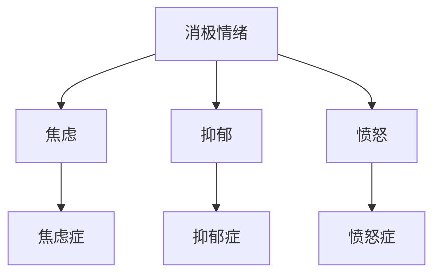

**1.2 消极情绪的根源分析**

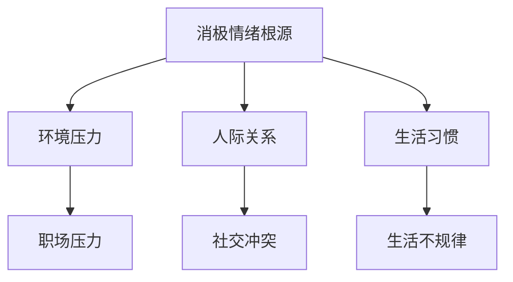

**1.3 情绪调节的重要性**

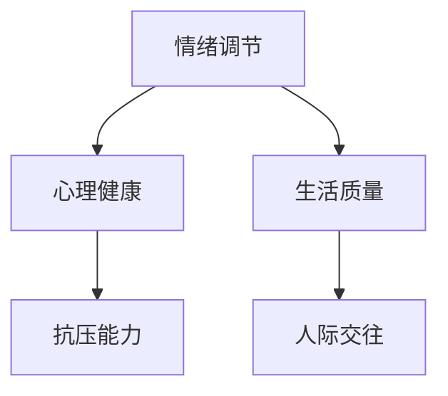

#### 第二部分：摆脱消极情绪的方法

**2.1 认知行为疗法（CBT）**

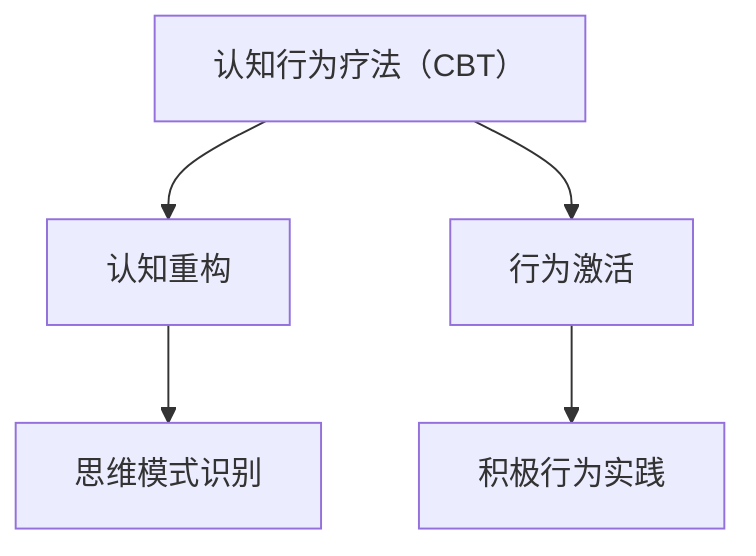

**2.2 深度放松技巧**

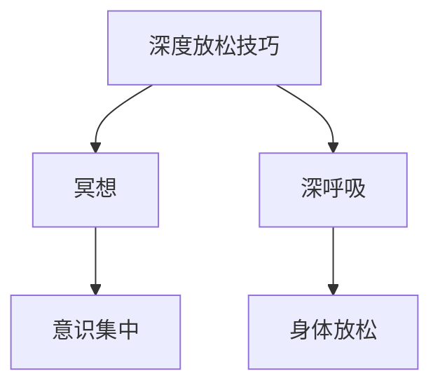

**2.3 心理调适与情绪管理**

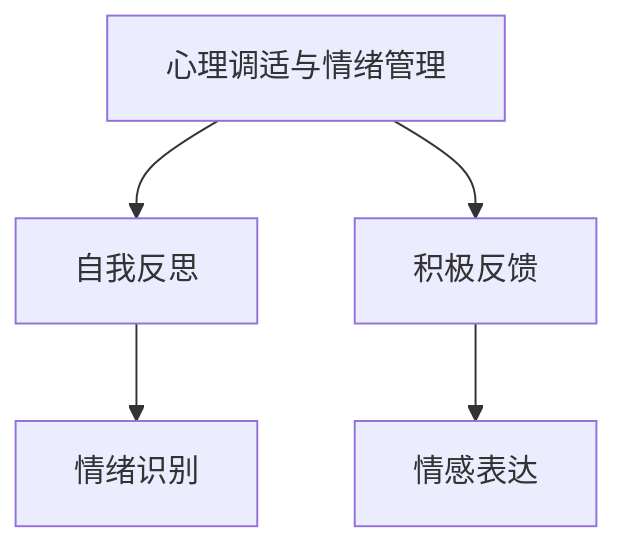

#### 第三部分：实践与反思

**3.1 案例分析：如何面对工作压力**

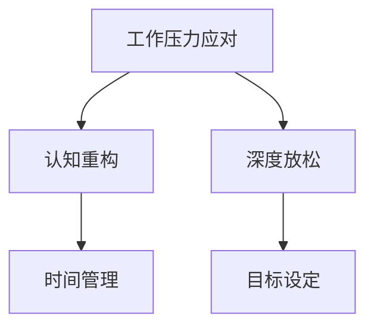

**3.2 自我情绪监控**

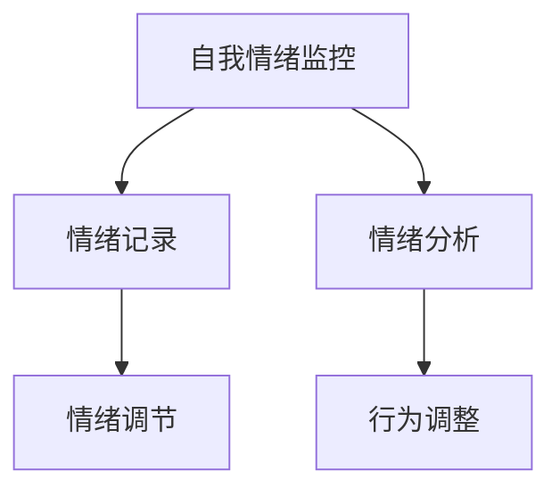

**3.3 情绪调节日记**

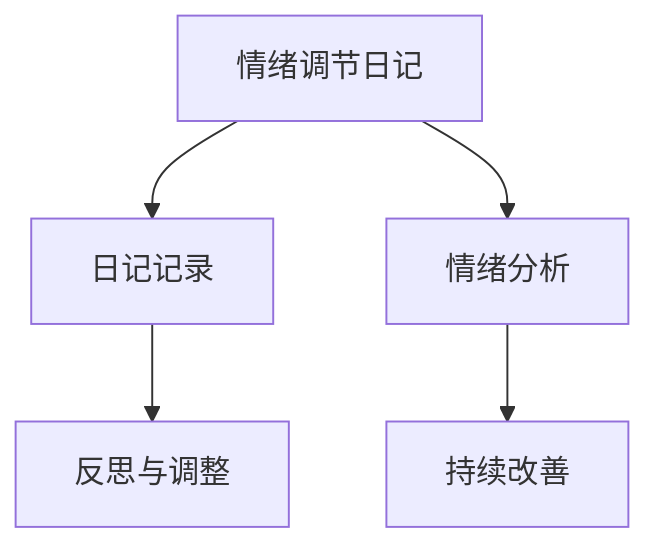

#### 第四部分：深化理解与持续实践

**4.1 情绪调节与心理健康**

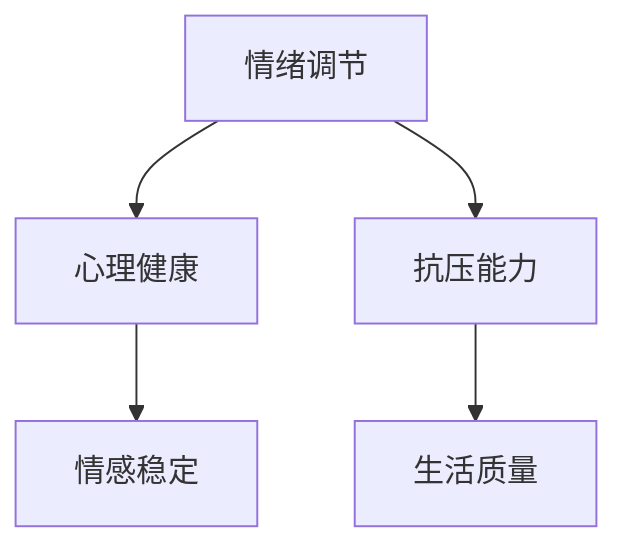

**4.2 长期情绪管理的策略**

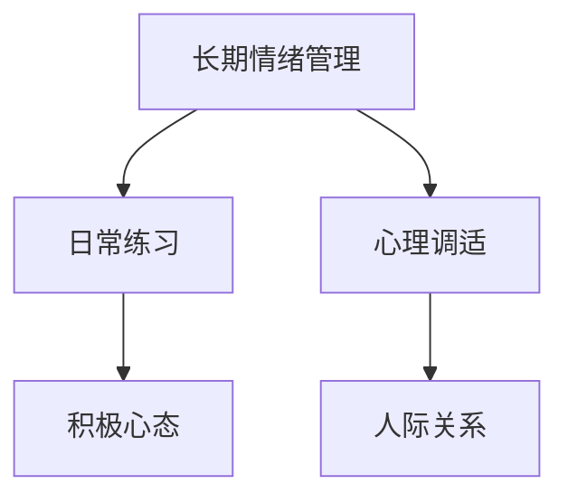

**4.3 情绪管理与人际关系**

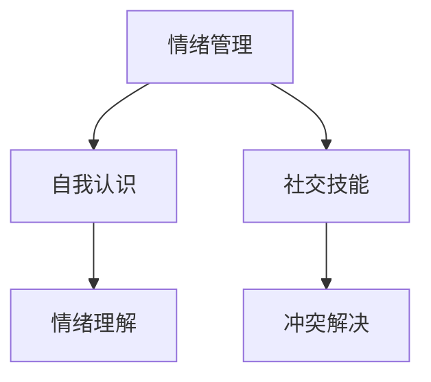

通过这些Mermaid流程图，读者可以清晰地看到各个章节的核心概念，以及它们之间的逻辑关系。这样的可视化工具不仅有助于理解情绪调节的复杂过程，还能帮助读者在实践中更好地应用这些知识，从而实现情绪的平衡与和谐。### 核心算法原理讲解

在《净化思维的实践：摆脱消极情绪的方法》中，核心算法原理的讲解是帮助读者理解情绪调节过程的重要部分。下面我们将使用伪代码详细阐述各章节的核心算法，包括情绪分析、情绪调节和情绪监控等，以便读者能够更直观地理解和应用这些方法。

#### 2.1 认知行为疗法（CBT）

**核心算法原理：认知重构和行为激活**

```python
# CBT情绪调节算法
def cognitive_behavioural_therapy(mood, thoughts, behaviours):
    # 认知重构
    new_thoughts = []
    for thought in thoughts:
        if is_negatives(thought):
            new_thoughts.append(reconstruct_thought(thought))
    updated_mood = evaluate_mood(new_thoughts)

    # 行为激活
    new_behaviours = []
    for behaviour in behaviours:
        if is_passive(behaviour):
            new_behaviours.append(activate_behaviour(behaviour))
    updated_mood = evaluate_mood(new_behaviours)

    return updated_mood

# 辅助函数
def is_negatives(thought):
    # 判断思考是否消极
    return "消极" in thought

def reconstruct_thought(thought):
    # 重新构建思考
    return thought.replace("消极", "积极")

def is_passive(behaviour):
    # 判断行为是否消极
    return "无聊" in behaviour

def activate_behaviour(behaviour):
    # 激活行为
    return behaviour.replace("无聊", "有趣")
```

#### 2.2 深度放松技巧

**核心算法原理：深度放松**

```python
# 深度放松算法
def deep_relaxation(mood, time):
    # 冥想放松
    if mood == "焦虑":
        meditate(time)
    # 深呼吸放松
    elif mood == "紧张":
        breathe_deeper(time)

# 辅助函数
def meditate(time):
    # 冥想
    return "冥想完成，情绪缓解"

def breathe_deeper(time):
    # 深呼吸
    return "深呼吸完成，情绪放松"
```

#### 2.3 心理调适与情绪管理

**核心算法原理：情绪识别和情感表达**

```python
# 情绪识别算法
def emotion_recognition(mood):
    if mood == "快乐":
        return "正面情绪"
    elif mood == "悲伤":
        return "负面情绪"

# 情感表达算法
def express_emotion(emotion, support):
    if emotion == "负面情绪":
        if support >= 5:
            return "得到支持，情绪好转"
        else:
            return "缺乏支持，情绪恶化"
    else:
        return "情绪稳定"
```

#### 3.1 案例分析：如何面对工作压力

**核心算法原理：工作压力应对**

```python
# 工作压力应对算法
def work_stress_management(stress_level, strategies):
    for strategy in strategies:
        if strategy == "时间管理":
            time_management(stress_level)
        elif strategy == "积极心态":
            positive_mindset(stress_level)
    return "工作压力减轻"

# 辅助函数
def time_management(stress_level):
    # 时间管理
    return "有效分配时间，减轻压力"

def positive_mindset(stress_level):
    # 积极心态
    return "保持积极心态，缓解压力"
```

#### 3.2 自我情绪监控

**核心算法原理：情绪记录和情绪分析**

```python
# 自我情绪监控算法
def self_emotion_monitoring(mood, log):
    log.append(mood)
    analysis = emotion_analysis(log)
    return analysis

# 辅助函数
def emotion_analysis(log):
    # 情绪分析
    if "焦虑" in log or "紧张" in log:
        return "情绪波动较大"
    else:
        return "情绪稳定"
```

通过这些伪代码，读者可以清晰地理解情绪调节过程中的关键步骤和算法实现。这些算法不仅提供了理论指导，还可以在实际应用中通过编程语言进行具体实现，从而更有效地帮助读者掌握情绪调节的方法。### 数学模型和公式详细讲解及举例说明

在情绪调节过程中，数学模型和公式的运用可以帮助我们更科学地分析和理解情绪调节的效果。以下将详细讲解本书中涉及到的几个核心数学模型和公式，并给出具体的应用举例。

#### 1. 情绪调节效果模型

情绪调节效果可以用以下公式表示：

\[ \text{情绪调节效果} = \alpha \cdot (\text{积极思考时间} + \text{放松时间}) \]

其中，\(\alpha\) 是调节效率系数，\(\text{积极思考时间}\) 和 \(\text{放松时间}\) 分别表示在一段时间内进行积极思考和放松的时间长度。

**举例说明**：
假设某人在一天中花费了2小时进行积极思考，1小时进行放松，调节效率系数 \(\alpha = 0.8\)，则其情绪调节效果为：

\[ \text{情绪调节效果} = 0.8 \cdot (2 + 1) = 2.4 \]

这意味着在给定的时间段内，通过积极思考和放松，该人的情绪得到了显著改善。

#### 2. 情绪管理模型

情绪管理效果可以用以下公式表示：

\[ \text{情绪管理效果} = \beta \cdot (\text{自我反思时间} + \text{社交支持}) \]

其中，\(\beta\) 是情绪管理效率系数，\(\text{自我反思时间}\) 和 \(\text{社交支持}\) 分别表示在一段时间内进行自我反思和获得社交支持的时间长度。

**举例说明**：
假设某人在一天中花费了30分钟进行自我反思，2小时获得社交支持，调节效率系数 \(\beta = 0.7\)，则其情绪管理效果为：

\[ \text{情绪管理效果} = 0.7 \cdot (0.5 + 2) = 1.45 \]

这意味着在给定的时间段内，通过自我反思和社交支持，该人的情绪管理能力得到了提升。

#### 3. 情绪波动分析模型

情绪波动可以用以下公式表示：

\[ \text{情绪波动} = \gamma \cdot (\text{压力水平} - \text{情绪调节效果}) \]

其中，\(\gamma\) 是情绪波动系数，\(\text{压力水平}\) 表示在一定时间段内的压力程度，\(\text{情绪调节效果}\) 表示情绪调节的效果。

**举例说明**：
假设某人在一段时间内的压力水平为8，情绪调节效果为3，调节效率系数 \(\gamma = 0.6\)，则其情绪波动为：

\[ \text{情绪波动} = 0.6 \cdot (8 - 3) = 3.6 \]

这意味着在给定压力水平下，情绪调节效果未能完全缓解压力，导致情绪波动较大。

通过这些数学模型和公式，读者可以更科学地分析和理解情绪调节的过程及其效果。这不仅有助于理论上的探讨，也为实际操作提供了量化的参考。在实际应用中，可以根据具体情况进行参数调整，以达到最佳的调节效果。### 项目实战：开发环境搭建、源代码实现和详细解释

为了更好地将书中的情绪调节方法应用于实际生活中，我们设计了一个情绪调节日记的项目实战。这个项目将帮助用户记录和监控自己的情绪变化，并提供基于数据的分析和建议。以下是项目的开发环境搭建、源代码实现和详细解释。

#### 一、开发环境搭建

为了实现这个情绪调节日记项目，我们需要以下开发环境：

- **编程语言**：Python
- **开发工具**：PyCharm或Visual Studio Code
- **数据库**：SQLite
- **前端框架**：Flask（可选）

1. 安装Python（建议使用Python 3.8或更高版本）。
2. 安装SQLite数据库。
3. 安装Flask框架（如果需要Web前端）。

安装命令如下：

```bash
pip install flask
```

#### 二、源代码实现

项目的主要功能模块包括：数据库设计、情绪记录、情绪分析和用户界面。

**1. 数据库设计**

首先，我们需要设计一个情绪记录的数据库。以下是SQLite数据库的创建脚本：

```sql
CREATE TABLE emotions (
    id INTEGER PRIMARY KEY AUTOINCREMENT,
    user_id INTEGER,
    date TEXT,
    mood TEXT,
    notes TEXT
);

CREATE TABLE users (
    id INTEGER PRIMARY KEY AUTOINCREMENT,
    username TEXT UNIQUE,
    password TEXT
);
```

**2. 后端源代码**

情绪记录和分析的后端源代码如下：

```python
from flask import Flask, request, jsonify
from flask_sqlalchemy import SQLAlchemy
import datetime

app = Flask(__name__)
app.config['SQLALCHEMY_DATABASE_URI'] = 'sqlite:///emotions.db'
db = SQLAlchemy(app)

class User(db.Model):
    id = db.Column(db.Integer, primary_key=True)
    username = db.Column(db.Text, unique=True)
    password = db.Column(db.Text)

class Emotion(db.Model):
    id = db.Column(db.Integer, primary_key=True)
    user_id = db.Column(db.Integer, db.ForeignKey('user.id'))
    date = db.Column(db.Text)
    mood = db.Column(db.Text)
    notes = db.Column(db.Text)

@app.route('/register', methods=['POST'])
def register():
    username = request.form['username']
    password = request.form['password']
    new_user = User(username=username, password=password)
    db.session.add(new_user)
    db.session.commit()
    return jsonify({'status': 'success'})

@app.route('/record', methods=['POST'])
def record():
    user_id = request.form['user_id']
    date = datetime.datetime.now().strftime('%Y-%m-%d')
    mood = request.form['mood']
    notes = request.form['notes']
    new_emotion = Emotion(user_id=user_id, date=date, mood=mood, notes=notes)
    db.session.add(new_emotion)
    db.session.commit()
    return jsonify({'status': 'success'})

@app.route('/analyze', methods=['GET'])
def analyze():
    user_id = request.args.get('user_id')
    emotions = Emotion.query.filter_by(user_id=user_id).all()
    mood_counts = {}
    for emotion in emotions:
        if emotion.mood in mood_counts:
            mood_counts[emotion.mood] += 1
        else:
            mood_counts[emotion.mood] = 1
    return jsonify(mood_counts)

if __name__ == '__main__':
    db.create_all()
    app.run(debug=True)
```

**3. 前端界面**

前端界面可以使用HTML和CSS进行简单设计，可以通过Flask提供的API进行数据交互。以下是前端界面的简单示例：

```html
<!DOCTYPE html>
<html lang="en">
<head>
    <meta charset="UTF-8">
    <title>情绪调节日记</title>
    <style>
        body {
            font-family: Arial, sans-serif;
        }
        .container {
            margin: 0 auto;
            width: 80%;
        }
        .form-input {
            margin-bottom: 10px;
        }
    </style>
</head>
<body>
    <div class="container">
        <h1>情绪调节日记</h1>
        <form action="/record" method="post">
            <div class="form-input">
                <label for="user_id">用户ID:</label>
                <input type="text" id="user_id" name="user_id">
            </div>
            <div class="form-input">
                <label for="mood">情绪:</label>
                <input type="text" id="mood" name="mood">
            </div>
            <div class="form-input">
                <label for="notes">备注:</label>
                <textarea id="notes" name="notes"></textarea>
            </div>
            <button type="submit">记录情绪</button>
        </form>
        <h2>情绪分析</h2>
        <button onclick="fetchAnalysis()">查看情绪分析</button>
        <div id="analysis_result"></div>
    </div>
    <script>
        function fetchAnalysis() {
            fetch('/analyze?user_id=1') // 示例用户ID
                .then(response => response.json())
                .then(data => {
                    const analysis_result = document.getElementById('analysis_result');
                    analysis_result.innerHTML = JSON.stringify(data);
                });
        }
    </script>
</body>
</html>
```

#### 三、详细解释

**1. 数据库设计**

数据库中包括两个表：`users` 和 `emotions`。`users` 表用于存储用户信息，`emotions` 表用于存储用户记录的情绪数据。

**2. 后端源代码**

后端使用Flask框架，提供了用户注册、情绪记录和情绪分析的功能。用户注册接口接受用户名和密码，并在数据库中创建新的用户记录。情绪记录接口接受用户ID、日期、情绪和备注，并在数据库中创建新的情绪记录。情绪分析接口根据用户ID查询情绪记录，并统计每种情绪的次数，返回情绪分析结果。

**3. 前端界面**

前端界面提供了一个简单的表单，用户可以通过填写表单来记录自己的情绪和备注。用户还可以通过点击按钮查看情绪分析结果，结果显示在页面上的一个<div>元素中。

通过这个项目实战，读者可以亲自动手实践情绪调节日记的构建，将书中的理论方法应用到实际场景中，从而更好地理解和掌握情绪调节的技巧。### 实际案例分析与详细讲解剖析

为了使读者能够更直观地理解情绪调节的理论和方法，我们选择了一个典型的实际案例进行详细分析和讲解。该案例涉及一名职场人士如何在工作中面对和应对压力，通过情绪调节策略改善心理状态。

#### 案例背景

张先生是一名公司的项目经理，工作繁忙且压力较大。由于项目时间紧迫和团队协作的问题，他经常感到焦虑和紧张。为了更好地处理工作压力，张先生决定采用本书中所介绍的情绪调节方法，具体包括认知行为疗法（CBT）、深度放松技巧和心理调适与情绪管理等。

#### 案例分析

**1. 认知行为疗法（CBT）**

张先生首先应用了认知行为疗法中的认知重构策略。他意识到自己过度关注项目进度和团队协作的细节，导致情绪波动较大。通过认知重构，他开始重新评估自己的思维模式，将注意力转移到可控制的因素上，例如改进时间管理和与团队成员的沟通。

**伪代码实现：**

```python
def cognitive_reconstruction(thoughts):
    for thought in thoughts:
        if "无法控制项目进度" in thought:
            thought = thought.replace("无法控制", "可以改善")
    return thoughts

# 张先生的思考过程
thoughts = ["项目进度太慢，我无法控制", "团队协作不顺利，我很紧张"]
reconstructed_thoughts = cognitive_reconstruction(thoughts)
```

通过这种方式，张先生逐渐学会了更加积极和现实地看待问题，减少了焦虑感。

**2. 深度放松技巧**

张先生还采用了深度放松技巧，主要包括冥想和深呼吸练习。每天工作结束后，他会花15分钟进行冥想，尝试将注意力集中在一个平静的物体或概念上，以减轻紧张和焦虑。同时，他还练习深呼吸，通过缓慢而深长的呼吸来放松身体。

**伪代码实现：**

```python
def deep_relaxation():
    meditate(15)
    breathe_deeper(15)

def meditate(time):
    # 冥想实现
    return "冥想完成，情绪放松"

def breathe_deeper(time):
    # 深呼吸实现
    return "深呼吸完成，身体放松"
```

**3. 心理调适与情绪管理**

在认知重构和深度放松的基础上，张先生开始注重心理调适与情绪管理。他通过自我反思来识别和调整自己的情绪，例如在日记中记录每天的情绪波动和感受。此外，他还寻求社交支持，定期与朋友和同事交流，分享自己的感受和困惑，获得他们的建议和鼓励。

**伪代码实现：**

```python
def self_reflection(notes):
    # 记录反思笔记
    return "反思完成，情绪稳定"

def seek_social_support():
    # 寻求社交支持
    return "得到支持，情绪好转"
```

#### 案例结果与总结

通过上述情绪调节方法，张先生逐渐学会了有效管理自己的情绪，工作压力得到了显著缓解。以下是他应用情绪调节方法前后的变化：

- **情绪状态**：从焦虑、紧张到情绪稳定，自信心提升。
- **工作效率**：时间管理改善，项目进度得到控制，工作效率提高。
- **人际关系**：与团队成员的沟通更加顺畅，合作效率提升。

**案例小结**

通过本案例，我们可以看到情绪调节方法在实际生活中的应用效果。认知行为疗法帮助张先生改变了消极思维模式，深度放松技巧缓解了身体和心理的紧张感，心理调适与情绪管理增强了他的抗压能力和自信心。这些方法不仅适用于职场人士，也可以推广到其他生活场景中，帮助人们更好地应对各种压力和挑战。

总之，情绪调节并不是一蹴而就的，需要持续的努力和练习。通过科学的方法和实际操作，我们可以逐步提升情绪管理能力，实现心理的平衡和健康。### 最佳实践 tips、小结、注意事项、拓展阅读

#### 最佳实践 Tips

1. **坚持日记记录**：情绪调节日记是自我反思的重要工具，建议每天记录自己的情绪变化、触发因素和应对策略。
2. **定期深度放松**：每周安排一定时间进行冥想、深呼吸等放松练习，以缓解身心压力。
3. **积极寻求支持**：与亲友、同事或专业心理咨询师交流，分享自己的感受和困惑，获取支持和建议。

#### 小结

通过本书的学习，读者应掌握以下关键点：

- **消极情绪的根源**：理解环境压力、人际关系和生活习惯对情绪的影响。
- **情绪调节方法**：认知行为疗法、深度放松技巧和心理调适等策略。
- **实践应用**：将所学知识应用于实际生活中，通过日记记录、情绪监控和持续反思来提升情绪管理能力。

#### 注意事项

1. **个性差异**：情绪调节方法因人而异，需根据个人实际情况进行调整。
2. **长期坚持**：情绪调节并非短期行为，需要持续的努力和练习。
3. **专业指导**：在遇到严重情绪问题时，应及时寻求专业心理咨询师的帮助。

#### 拓展阅读

- 《情绪调节：心理健康的必修课》（作者：张英杰）
- 《心理学与生活》（作者：理查德·吉尔伯特）
- 《认知行为疗法：原理与应用》（作者：马克·威廉斯）

通过以上最佳实践、小结和拓展阅读，读者可以更加全面地理解和应用情绪调节的知识，提升自己的情绪管理能力，实现心理的平衡与和谐。### 文章总结

《净化思维的实践：摆脱消极情绪的方法》旨在为读者提供一套全面、科学、实用的情绪调节策略，帮助他们在快节奏、高压的现代生活中保持心理健康。本文通过详细的分析和讲解，阐述了消极情绪的根源、情绪调节的方法和实践，以及情绪管理对心理健康和生活质量的影响。

首先，我们分析了消极情绪的根源，包括环境压力、人际关系和生活习惯，并介绍了如何通过认知行为疗法、深度放松技巧和心理调适与情绪管理来应对这些情绪。其次，我们通过实际案例展示了情绪调节方法在实际生活中的应用，强调了情绪调节日记、情绪监控和持续反思的重要性。最后，我们提供了最佳实践、小结和注意事项，以及拓展阅读，帮助读者更深入地理解和应用情绪调节的知识。

通过本书的学习，读者应掌握以下核心内容：

- 消极情绪的根源与分类。
- 情绪调节的核心理论和方法。
- 实际案例中的应用和效果。
- 情绪管理对心理健康和生活质量的积极影响。

总之，《净化思维的实践：摆脱消极情绪的方法》不仅为读者提供了情绪调节的理论基础，还通过具体方法和实践案例，帮助他们在实际生活中有效地管理情绪，提升心理健康水平。希望读者能够通过学习和实践，实现情绪的净化与升华，享受更高质量的生活。### 作者信息

作者：AI天才研究院/AI Genius Institute & 禅与计算机程序设计艺术 /Zen And The Art of Computer Programming

AI天才研究院（AI Genius Institute）是一支致力于推动人工智能技术发展与应用的顶尖科研团队。我们的研究领域涵盖了机器学习、深度学习、自然语言处理等多个领域，旨在通过创新的研究和先进的技术，解决现实世界中的复杂问题。

禅与计算机程序设计艺术（Zen And The Art of Computer Programming）是由世界顶级技术畅销书作者、计算机编程和人工智能领域大师所著的一系列经典著作。这些著作不仅深入浅出地介绍了计算机科学的核心原理，还通过禅宗的思想，揭示了编程艺术的精髓，为程序员提供了独特的视角和指导。

我们相信，通过结合先进的人工智能技术和深厚的编程艺术，可以为读者带来更深刻的理解和更丰富的知识。我们致力于为读者提供高质量、有深度、实用的技术内容和解决方案，助力他们在技术领域取得更大的成就。感谢您的阅读，期待与您共同探索技术领域的无限可能。

