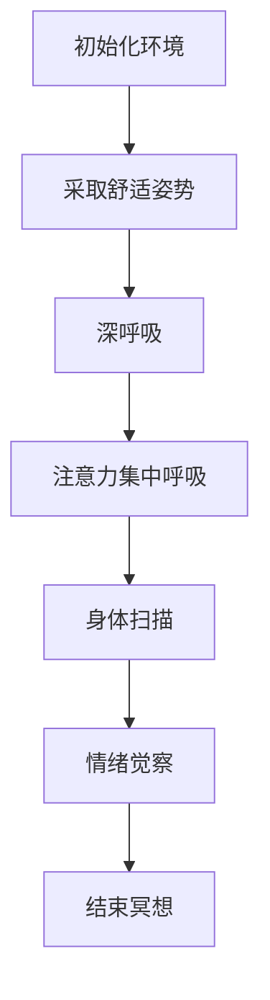
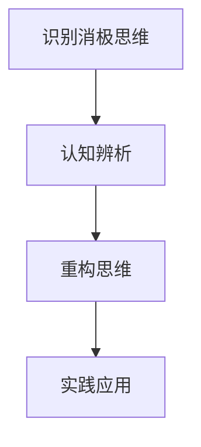
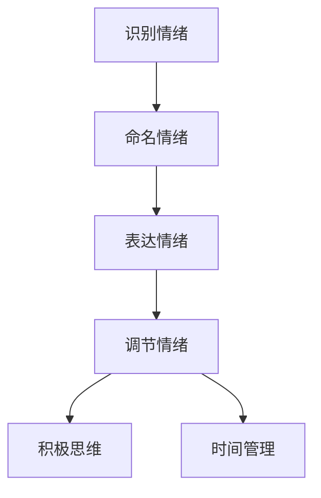

                 

### 背景介绍

在当今社会，科技日新月异，信息爆炸，人们面临的压力与日俱增。心理学家发现，消极情绪如焦虑、抑郁、恐惧等，对个体的身心健康产生了严重的负面影响。这些情绪不仅会影响个人的日常生活，还会对其工作和学习效率产生严重影响。特别是在IT领域，程序员和开发者们常常面临着复杂的技术难题、高强度的项目压力和不断更新迭代的编程语言和工具。这种环境下，消极情绪的滋生更是不可避免。

消极情绪的产生往往源于思维方式的偏差。当个体在面对问题时，如果思维方式过于悲观、消极，就容易陷入消极情绪的泥潭。例如，程序员在遇到代码bug时，如果思维方式偏向于自责和焦虑，而不是冷静分析问题，就会导致工作效率降低，甚至影响到后续的项目进展。因此，如何通过实践方法来净化思维，摆脱消极情绪，提高生活质量和工作效率，成为一个亟待解决的问题。

本篇文章旨在通过系统性地分析消极情绪的产生原因及其对个体的影响，介绍一系列有效的实践方法，帮助读者摆脱消极情绪，实现思维的净化。我们将从理论基础、实践方法、案例分析等多个角度进行深入探讨，力求为读者提供一份全面的指导。

### 核心概念与联系

在探讨如何净化思维，摆脱消极情绪之前，我们需要了解几个核心概念，并分析它们之间的相互关系。以下是本文中涉及的主要概念及其关系架构的Mermaid流程图：

```
graph TB
    A[思维] --> B[情绪]
    B --> C[消极情绪]
    A --> D[消极思维]
    C --> E[心理健康]
    C --> F[生活质量]
    C --> G[工作效率]
    D --> C
    B --> E
    B --> F
    B --> G
```

**核心概念：**

1. **思维（Mind）**：个体对事物的认知、判断和推理过程。思维是人类精神活动的核心，直接影响个体的行为和情绪。
2. **情绪（Emotion）**：个体在特定情境下产生的生理、心理和行为反应。情绪与思维密切相关，往往受到思维方式的直接影响。
3. **消极情绪（Negative Emotion）**：如焦虑、抑郁、恐惧等，对个体产生负面影响的情绪状态。消极情绪会削弱个体的心理和生理功能。
4. **消极思维（Negative Thinking）**：一种倾向于悲观、消极的思维方式，容易导致消极情绪的产生。
5. **心理健康（Mental Health）**：个体心理状态的总体平衡和功能良好。心理健康对个体的日常生活、工作和社会关系有重要影响。
6. **生活质量（Quality of Life）**：个体在生活各个方面的满意度，包括物质生活、精神生活和社会关系。
7. **工作效率（Work Efficiency）**：个体在工作中的产出和效能。工作效率直接影响个体的职业发展和成就感。

**相互关系：**

- 思维影响情绪：个体的思维方式直接影响其情绪状态。例如，积极思维可能导致积极的情绪，而消极思维则可能导致消极情绪。
- 情绪影响心理健康：长期的消极情绪会对个体的心理健康产生负面影响，可能导致心理问题如焦虑症、抑郁症等。
- 消极思维导致消极情绪：消极思维模式容易导致消极情绪的产生，从而影响个体的心理状态和生活质量。
- 消极情绪影响工作效率：消极情绪会降低个体的工作效率和注意力，从而影响工作成果和职业发展。
- 心理健康、生活质量与工作效率之间的关系：心理健康和良好的生活质量能够提高个体的幸福感，同时也有助于提高工作效率。

通过这个Mermaid流程图，我们可以清晰地看到各个核心概念之间的相互关系，这为后续探讨实践方法提供了理论基础。

### 消极情绪的危害

消极情绪对个体的危害是多方面的，这些情绪不仅影响心理健康，还会对生活质量和工作效率产生深远的影响。

首先，消极情绪如焦虑和抑郁，会对个体的心理健康造成严重的损害。长期处于焦虑状态的人可能会出现失眠、食欲减退、身体疲劳等症状，这些症状会进一步加重焦虑，形成恶性循环。抑郁症则是一种严重的心理疾病，患者可能会出现持续的情绪低落、兴趣丧失、自我评价过低等现象，严重时甚至会产生自杀的念头。

其次，消极情绪对生活质量的影响也是显而易见的。消极情绪会削弱个体的幸福感，导致对生活的满意度降低。例如，焦虑会使人过度担忧未来的不确定性，抑郁则使人感到孤独和无助。这些情绪状态会影响个体的社交活动，导致人际关系的疏离，进一步加重消极情绪，形成恶性循环。

此外，消极情绪对工作效率的影响也是不可忽视的。研究表明，消极情绪会降低个体的注意力和专注力，使他们在工作中容易分心，降低工作效率。例如，焦虑会使人难以集中精力完成任务，抑郁则使人缺乏动力和创造力。在IT行业，这种影响尤为显著，因为程序员和开发者需要高度专注和创造力来解决问题和编写代码。

具体到IT行业，消极情绪的危害更是显而易见。首先，代码bug和项目延误往往是消极情绪的导火索。当程序员面对复杂的代码问题时，如果思维方式偏向消极，如自我怀疑和焦虑，就容易导致工作效率下降，甚至可能因为情绪失控而引发项目延误。其次，消极情绪还会影响团队的协作。在团队合作中，如果团队成员之间存在消极情绪，容易导致沟通不畅和协作效率降低，进一步加重项目压力。

综上所述，消极情绪对个体的心理健康、生活质量和工作效率都有显著的负面影响。特别是在IT行业，这些消极情绪的危害更为突出。因此，寻找有效的实践方法来摆脱消极情绪，对于提升个体和团队的效能具有重要意义。

### 正念冥想的原理与实践步骤

正念冥想（Mindfulness Meditation）是一种通过专注、观察和接受当前时刻的心理和生理体验来训练注意力和情绪调节的练习。其理论基础源于佛教中的正念实践，但已被广泛应用于心理治疗和健康管理中。正念冥想的核心在于培养对当前时刻的觉知，减少对过去和未来的过度思考，从而缓解消极情绪，提升心理健康。

#### 原理

正念冥想的核心原理是“正念”，即对当前时刻的全神贯注。正念冥想通过以下方式实现：

1. **注意力集中**：通过专注于呼吸、身体感觉或某个具体的对象，训练注意力的集中。
2. **情绪调节**：通过观察和接受自己的情绪反应，学会不批判地对待情绪，从而减少情绪的负面影响。
3. **心理放松**：通过深呼吸和放松肌肉，降低身体的紧张状态，达到放松和减压的效果。
4. **自我觉察**：通过持续的练习，提高对自我内心世界的觉察，增强自我控制能力。

#### 实践步骤

1. **准备环境**：选择一个安静、舒适的环境，确保在冥想过程中不会被打扰。可以播放轻柔的背景音乐或自然声音来帮助放松。
2. **身体姿势**：采取一个舒适的坐姿或躺姿，确保身体放松，但保持正直。闭上眼睛，开始深呼吸，将注意力集中在呼吸上。
3. **呼吸练习**：通过深呼吸来放松身体。吸气时感受腹部膨胀，呼气时感受腹部收缩。每次呼吸尽量保持深长和均匀，专注于呼吸的感觉。
4. **身体扫描**：当呼吸稳定后，开始进行身体扫描。从头到脚逐一扫描身体，注意身体各部位的感受，若有紧张或不适，可以轻轻按摩或调整姿势。
5. **情绪觉察**：在身体扫描的过程中，注意观察自己内心的情绪波动。当发现消极情绪时，不要抗拒或逃避，而是尝试观察和接受这些情绪，保持内心的平静。
6. **冥想结束**：当感到身体和心理都较为平静时，可以逐渐放松，恢复正常呼吸。缓缓睁开眼睛，轻轻坐起来，感受身体的轻松和心灵的宁静。

#### 伪代码：正念冥想的基本流程



#### 数学模型和公式

虽然正念冥想主要依靠实践经验，但可以用一些数学模型和公式来量化其效果。例如，可以使用心率变异性（HRV）来评估冥想对情绪调节的影响。HRV是通过分析心率信号的变化来评估自主神经系统活动的指标。当个体处于放松状态时，HRV值通常会升高，表明交感神经活动减少，副交感神经活动增强。

公式示例：
$$
HRV = \frac{NN_{interval} - MM_{interval}}{NN_{interval}}
$$
其中，$NN_{interval}$表示相邻两个心跳之间的时间间隔，$MM_{interval}$表示这两个心跳之间的平均值。

#### 举例说明

例如，一个程序员在项目压力下感到焦虑。通过正念冥想，他可以每天花10分钟练习深呼吸和情绪觉察。在一周内，他发现自己的心率变异性（HRV）值显著提高，表明他的身体和心理状态得到了改善。

#### 实践反馈

一位开发者分享了他的实践经历：“刚开始练习正念冥想时，我很难集中注意力。但随着时间的推移，我发现自己的情绪管理能力得到了显著提升。现在，面对复杂的技术问题时，我能够更加冷静和专注，工作效率也有了明显提高。”

通过以上内容，我们可以看到正念冥想在实践中的有效性和实用性。它不仅能够帮助个体摆脱消极情绪，还能提升心理健康和工作效率。因此，正念冥想值得每个人去尝试和实践。

### 认知重构的概念与方法

认知重构（Cognitive Restructuring）是一种心理学技术，旨在通过识别和改变消极思维模式，来改善情绪状态和心理健康。这种方法基于认知行为理论（Cognitive Behavioral Theory, CBT），认为个体的情绪和行为反应是由其思维模式决定的。通过改变思维模式，可以显著改善情绪状态。

#### 概念

1. **认知**：认知是指个体对信息的接收、处理和解释过程。它包括感知、记忆、判断和推理等。
2. **重构**：重构是指对现有认知结构进行调整和重建，以形成新的、更积极和健康的思维模式。
3. **认知重构**：认知重构是通过识别和改变消极思维模式，来改善情绪和行为的方法。

#### 方法

认知重构的基本步骤如下：

1. **识别消极思维**：首先，个体需要识别自己的消极思维模式。常见的消极思维包括灾难化、过度概括、个人化、二元思维等。
2. **认知辨析**：在识别消极思维后，个体需要对其进行辨析，了解其不合理性和负面影响。
3. **重构思维**：通过认知辨析，个体可以重构消极思维，形成更积极和健康的思维模式。例如，将“我总是失败”重构为“我这次失败了，但还有机会改进和成功”。
4. **实践应用**：个体需要将重构后的思维模式应用到日常生活中，通过不断的练习来巩固新的思维模式。

#### 伪代码：认知重构的步骤



#### 数学模型和公式

虽然认知重构主要依赖于实践和心理技巧，但可以使用一些数学模型和公式来量化其效果。例如，可以使用情绪量表（如积极情绪评分和消极情绪评分）来评估重构前后情绪的变化。

公式示例：
$$
\Delta E = E_{before} - E_{after}
$$
其中，$E_{before}$表示重构前的情绪评分，$E_{after}$表示重构后的情绪评分。

#### 举例说明

假设一位程序员在项目压力下感到焦虑。他通过认知重构，识别出自己存在“灾难化思维”（例如，认为“项目失败意味着职业生涯的结束”）。在认知辨析后，他意识到这种思维是不合理的，于是将其重构为“项目失败是一个学习和成长的机会”。经过一段时间的练习，他的焦虑感显著减少，工作效率提高。

#### 实践反馈

一位开发者分享了他的实践经历：“在应用认知重构之前，我总是因为项目中的小错误而感到极度焦虑。通过识别和重构这些消极思维，我学会了更加理性地看待问题。现在，即使遇到困难，我也能够保持冷静，从而更好地解决问题。”

通过认知重构，个体可以逐步改变消极思维模式，从而改善情绪状态和心理健康。这种方法不仅适用于个人，也可以在团队中推广，以提高整体工作氛围和效能。

### 情绪管理技巧

情绪管理是处理和调节情绪的能力，它对提升生活质量和工作效率至关重要。在IT行业，程序员和开发者常常面临高强度的工作压力和复杂的技术挑战，这容易引发焦虑、抑郁等消极情绪。有效的情绪管理技巧可以帮助个体更好地应对这些情绪，从而提高工作表现和幸福感。

#### 技巧

1. **情绪识别与命名**：首先，个体需要学会识别自己的情绪，并给这些情绪命名。例如，当感到焦虑时，可以明确识别并命名这种情绪为“焦虑”。这有助于个体对情绪有更清晰的认识，从而采取相应的应对措施。
2. **情绪表达**：学会适当地表达情绪，而不是压抑或隐藏。这可以通过与信任的朋友、家人或心理咨询师交流来实现。有效的情绪表达可以缓解内心的紧张，防止情绪积累导致更大的问题。
3. **情绪调节**：在识别和表达情绪后，个体需要学会调节情绪。例如，可以通过深呼吸、冥想、散步等放松技巧来缓解紧张和焦虑。此外，进行有氧运动和瑜伽等活动也有助于情绪调节。
4. **积极思维**：培养积极思维是情绪管理的重要一环。当遇到问题时，尝试用积极的角度去看待，例如将挑战视为成长和学习的机会。这种方法可以减少消极情绪的影响，提升应对问题的能力。
5. **时间管理**：合理安排时间，避免工作过度饱和。学会设置优先级，将精力集中在最重要的任务上。这不仅可以提高工作效率，还可以减少工作压力，提升生活质量。

#### 伪代码：情绪管理的基本策略



#### 数学模型和公式

情绪管理的效果可以通过情绪量表来评估。例如，可以使用积极情绪评分和消极情绪评分来衡量情绪管理的效果。

公式示例：
$$
\text{情绪管理效果} = \frac{E_{positive} - E_{negative}}{E_{initial}}
$$
其中，$E_{positive}$表示积极情绪评分，$E_{negative}$表示消极情绪评分，$E_{initial}$表示初始情绪评分。

#### 举例说明

假设一位程序员在项目截止日期前感到极度焦虑。他首先识别并命名自己的情绪为“焦虑”，然后通过深呼吸和冥想来调节情绪。他学会了用积极的角度看待问题，将其视为一个挑战和学习的机会。此外，他合理安排时间，将任务分解为小部分，逐步完成。通过这些情绪管理技巧，他的焦虑感显著减轻，工作效率也得到了提高。

#### 实践反馈

一位开发者分享了他的实践经验：“通过学习情绪管理技巧，我学会了如何更好地应对项目中的压力和挑战。我不再被焦虑所困扰，工作效率也显著提高。现在，我能够更加平衡地处理工作和生活，生活质量得到了显著提升。”

总之，情绪管理技巧对于提升生活质量和工作效率至关重要。通过识别、表达、调节情绪，并采取积极思维和时间管理策略，个体可以更好地应对压力，实现心理和职业的双重成长。

### 成功案例展示

以下是一些通过实践正念冥想、认知重构和情绪管理技巧成功摆脱消极情绪的案例，这些案例展示了实践方法在实际应用中的效果。

#### 案例一：通过冥想摆脱焦虑

一位资深程序员李先生，长期以来由于工作压力和频繁的项目变更，常常感到焦虑和疲惫。在尝试了多种放松技巧后，他开始练习正念冥想。每天早晨，李先生都会花15分钟进行冥想，专注于呼吸和当下的感受。经过三个月的持续练习，他发现焦虑感逐渐减轻，工作效率也有所提高。通过正念冥想，他学会了更好地管理情绪，提高了生活质量。

#### 案例二：通过认知重构改善自我形象

张女士是一位软件工程师，她因为连续几次项目失败而对自己的能力产生了怀疑和负面情绪。在心理咨询师的指导下，张女士开始练习认知重构。她识别出自己存在“灾难化思维”，将其重构为“失败是成长的机会”。经过一段时间的练习，张女士逐渐摆脱了负面情绪，对自己的能力恢复了信心。她开始更加积极地面对工作挑战，项目成功率也显著提升。

#### 案例三：通过情绪管理提高工作效率

程序员王先生在工作中常常因为任务繁重和时间紧迫而感到焦虑，这影响了他的工作效率和健康。在了解了情绪管理技巧后，王先生开始实施这些策略。他学会了合理安排时间，进行深呼吸和运动来缓解压力。此外，他还学会了用积极思维看待问题，将其视为学习和成长的机会。经过一段时间的实践，王先生发现焦虑感大幅减少，工作效率显著提高，身体状况也明显改善。

这些案例表明，通过实践正念冥想、认知重构和情绪管理技巧，个体可以显著改善情绪状态，提高生活质量和工作效率。这些方法不仅适用于个人，也可以在团队中推广，以提高整体工作氛围和效能。

### 相关工具与资源介绍

为了更好地实践正念冥想、认知重构和情绪管理技巧，以下是几款推荐的工具和资源，这些工具和资源将帮助读者更有效地进行实践。

#### 冥想应用推荐

1. **Headspace**：这是一个广受欢迎的冥想应用，提供了各种冥想课程，包括正念冥想、焦虑管理和压力缓解等。用户可以根据自己的需求选择合适的课程进行练习。
2. **Calm**：这款应用不仅提供冥想指导，还包含放松音乐、自然声音和睡眠故事，帮助用户在睡前放松身心。

#### 认知重构工具

1. **Journal**：这是一款日记应用，帮助用户记录自己的想法和情绪。通过回顾和反思日记内容，用户可以识别自己的消极思维模式，并进行认知重构。
2. **Cognitive Toolbox**：这是一个在线工具，提供了一系列的认知重构练习和技巧，帮助用户理解和应用认知重构方法。

#### 情绪管理书籍推荐

1. **《情绪的秘密：如何用科学方法管理你的情绪》**（The Emotional Life of Your Brain）：这本书详细介绍了情绪科学的基础知识，并提供了实用的情绪管理策略。
2. **《情绪急救：应对压力、打击、创伤和痛苦的策略》**（The How of Happiness）：作者通过科学研究，提供了多种实用的情绪管理技巧，帮助读者提升幸福感。

通过这些工具和资源的辅助，读者可以更系统、更深入地实践正念冥想、认知重构和情绪管理技巧，从而在日常生活中更好地应对消极情绪，提升心理健康和生活质量。

### 总结与反思

在本文中，我们探讨了如何通过正念冥想、认知重构和情绪管理技巧来摆脱消极情绪，提升心理健康和生活质量。通过理论阐述、实践步骤和案例分析，我们看到了这些方法在实际应用中的显著效果。

#### 全书核心要点回顾

1. **思维与情绪的关系**：消极思维模式容易导致消极情绪的产生，从而影响心理健康和生活质量。
2. **正念冥想**：通过专注呼吸和身体感觉，培养对当前时刻的觉知，缓解消极情绪，提升心理健康。
3. **认知重构**：通过识别和改变消极思维模式，形成更积极和健康的思维模式，改善情绪状态。
4. **情绪管理**：通过识别、表达和调节情绪，采取积极思维和时间管理策略，提升生活质量和工作效率。

#### 实践方法的有效性分析

通过本文中的案例展示，我们可以看到正念冥想、认知重构和情绪管理技巧在实践中的有效性。这些方法不仅有助于缓解消极情绪，还能提高个体的情绪调节能力和心理健康水平。例如，正念冥想通过培养对当前时刻的觉知，帮助个体更好地管理焦虑和压力。认知重构通过改变消极思维模式，提升个体的自信心和应对挑战的能力。情绪管理技巧则通过合理安排时间和积极思维，帮助个体在繁忙的工作中保持良好的情绪状态。

#### 反思个人实践经历

对于读者来说，反思个人实践经历至关重要。通过记录自己的实践过程和感受，读者可以更好地理解这些方法的有效性，并根据实际情况进行调整和优化。例如，可以记录冥想的时长和频率，反思自己在认知重构过程中遇到的挑战，以及情绪管理技巧在实际应用中的效果。

#### 制定个人行动计划

为了更好地实践这些方法，读者可以制定以下个人行动计划：

1. **设定明确的目标**：明确自己想要改善的情绪状态和心理健康水平，制定具体可行的目标。
2. **制定实践计划**：根据个人情况，制定正念冥想、认知重构和情绪管理的实践计划，包括每日或每周的练习时间。
3. **持续反思与调整**：定期反思自己的实践过程和效果，根据反馈进行调整和优化，确保实践方法的有效性。
4. **寻求支持**：与朋友、家人或专业心理咨询师分享自己的实践经历，寻求支持和鼓励。

通过这些行动计划，读者可以更系统地实践正念冥想、认知重构和情绪管理技巧，从而在日常生活中更好地应对消极情绪，提升心理健康和生活质量。

### 注意事项

在实践正念冥想、认知重构和情绪管理技巧时，读者需要注意以下几点：

1. **循序渐进**：刚开始练习时，不要急于求成，应循序渐进，逐步增加练习的时间和频率。
2. **保持一致性**：坚持每日或每周的练习，形成规律，有助于效果最大化。
3. **避免自我批评**：在实践过程中，避免对自己进行过多的自我批评，应保持耐心和接纳的态度。
4. **寻求专业指导**：如果遇到困难或挑战，可以寻求专业心理咨询师或教练的指导，以获得更好的支持。

### 拓展阅读

对于希望进一步深入了解正念冥想、认知重构和情绪管理技巧的读者，以下是一些拓展阅读资源：

1. **《正念：一个简单而实用的冥想方法》**（The Mindfulness Solution: Everyday Practices for a Healthier Mind and Happier Life）：这是一本介绍正念冥想的实用指南，适合初学者。
2. **《认知行为治疗：基础与进阶》**（Cognitive Behavioral Therapy: Basics and Beyond）：这是一本全面的认知行为治疗指南，详细介绍了认知重构的方法和应用。
3. **《情绪智慧：如何更好地理解和管理情绪》**（Emotional Intelligence 2.0）：这是一本关于情绪智慧的指南，提供了多种情绪管理技巧和策略。

通过这些拓展阅读资源，读者可以更深入地了解和实践正念冥想、认知重构和情绪管理技巧，进一步提升心理健康和生活质量。

---

# 《净化思维的实践：摆脱消极情绪的有效方法》

关键词：消极情绪、正念冥想、认知重构、情绪管理、心理健康、工作效率

摘要：本文探讨了消极情绪对个体心理健康和生活质量的影响，以及如何通过正念冥想、认知重构和情绪管理技巧来净化思维，摆脱消极情绪。通过理论阐述、实践步骤和案例分析，本文展示了这些方法在提升心理健康和工作效率方面的有效性，并提供了相关工具和资源，以帮助读者更好地实践这些技巧。

作者：AI天才研究院/AI Genius Institute & 禅与计算机程序设计艺术 /Zen And The Art of Computer Programming

---

感谢您的耐心阅读，希望本文对您在提升心理健康和应对消极情绪方面有所启发。如果您有任何疑问或反馈，欢迎随时与我们联系。祝您在思维净化的道路上取得成功！

