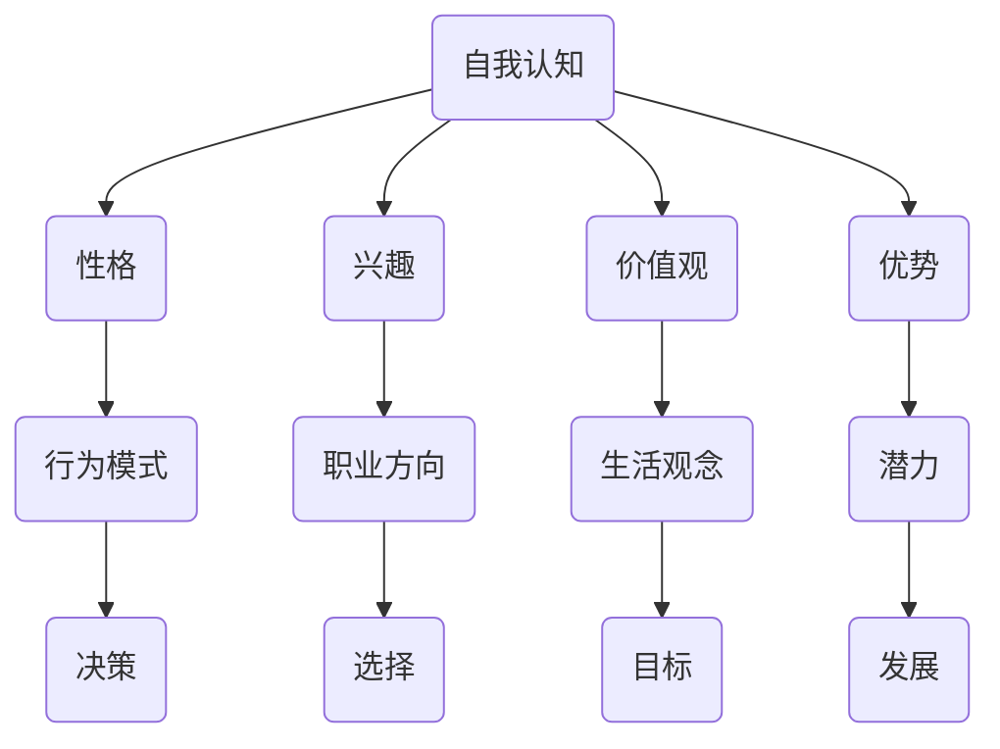
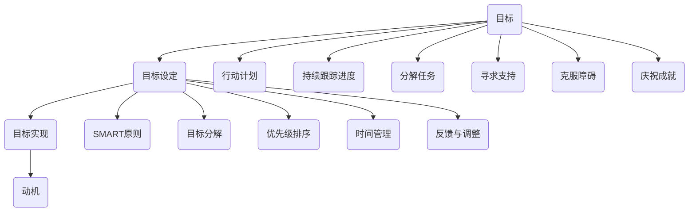
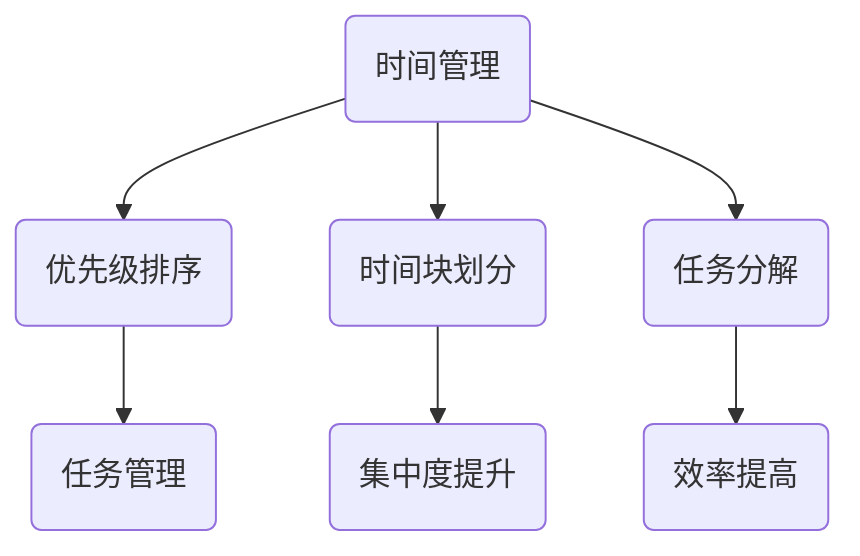
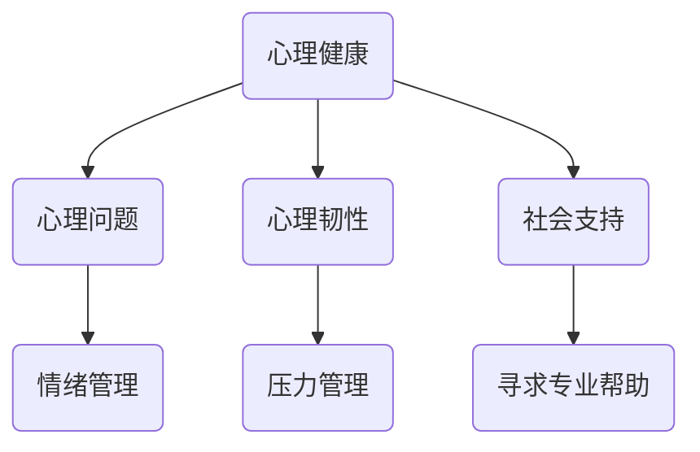
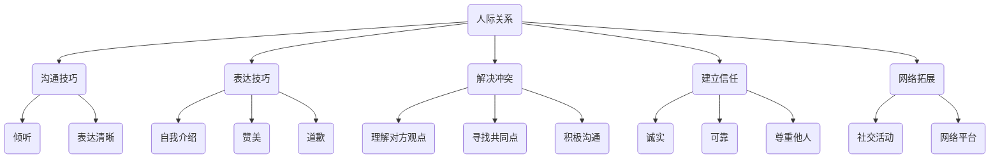
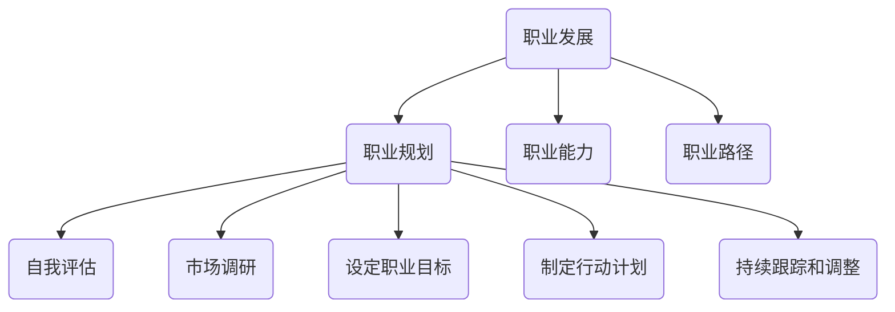
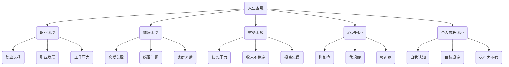

                 

### 引言

在当今快速发展的社会中，个人成长与人生规划成为了一个热门而重要的课题。人们渴望找到一种方法，能够在复杂多变的环境中找到自己的定位，实现个人的全面发展和幸福生活。这本书《创作生命的独特旋律：谱写个人人生乐章》正是为了帮助读者在这个领域中进行深入探索，从而谱写属于自己的精彩人生乐章。

#### 研究背景

个人成长和人生规划是一个跨越心理学、社会学、教育学等多个学科领域的综合性研究课题。在心理学中，研究者们探讨了人类行为、情感和认知发展的规律；在教育学中，学者们研究了教育对于个人成长的重要影响；而在社会学中，人们关注社会环境、文化背景等因素对个人发展的影响。然而，尽管这些学科的研究已经取得了丰富的成果，但如何将这些研究成果应用于个人成长和人生规划的具体实践中，仍然是一个亟待解决的问题。

#### 研究目标

本书的研究目标是通过整合多学科的研究成果，提出一套科学、系统、易于实践的个人成长和人生规划方法论。具体来说，本书旨在帮助读者：

1. **理解个人成长的核心概念**：通过深入分析个人成长的理论基础，帮助读者建立起对个人成长和发展的全面认知。
2. **掌握人生规划的基本原则**：通过系统介绍人生规划的基本原则和方法，帮助读者学会如何设定和实现自己的人生目标。
3. **提升个人能力和素质**：通过具体的实践方法和技巧，帮助读者在各个方面提升自己的能力和素质，实现个人全面发展。
4. **实现人生价值**：通过帮助读者明确自己的人生目标和价值观，引导他们实现个人价值，找到属于自己的生命意义。

#### 研究方法

为了实现上述研究目标，本书采用了以下几种研究方法：

1. **文献综述**：通过对相关领域的研究文献进行系统梳理，总结和提炼出个人成长和人生规划的核心概念和理论。
2. **案例研究**：通过分析典型案例，探讨在不同情境下个人成长和人生规划的具体实践方法。
3. **实践指南**：结合实际应用场景，提供具体的操作指南和技巧，帮助读者将理论转化为实践。
4. **互动式学习**：通过问答、讨论等形式，引导读者积极参与学习过程，促进知识的内化和应用。

综上所述，本书旨在为读者提供一套系统、实用、科学的方法论，帮助他们在个人成长和人生规划的道路上取得成功。通过这本书的阅读和实践，读者将能够更好地认识自己，规划未来，实现人生的独特旋律。

## 第一部分：自我认知与个性分析

### 第1章 自我认知的重要性

自我认知是个人成长与人生规划的基础，也是理解和实现个人潜力的关键。通过深入了解自己的性格、兴趣、价值观和优势，我们能够更加明确自己的人生方向，制定出符合自身特点的发展计划。本章将探讨自我认知的重要性，并提供一些实用的工具和方法，帮助读者进行自我认知和个性分析。

### 1.1 背景介绍

自我认知，简单来说，就是个体对自己的认识和理解。这种认识不仅包括对自身外在特征的了解，如外貌、性别、年龄等，更重要的是对自身内在特质和潜能的认知，如性格、能力、兴趣、价值观等。自我认知的重要性体现在以下几个方面：

1. **明确个人定位**：了解自己的性格和兴趣，有助于找到适合自己的职业和生活方式，从而在人生道路上更加明确和自信。
2. **提升决策能力**：自我认知使我们能够更清晰地认识到自己的优势和不足，从而做出更明智的决策，避免因缺乏了解而导致的错误选择。
3. **实现个人发展**：通过自我认知，我们能够找到自己的发展方向，设定合理的目标，并采取有效的措施去实现这些目标。
4. **提升生活质量**：了解自己的需求和期望，有助于我们更好地安排时间和资源，提高生活质量和幸福感。

### 1.2 核心概念与联系

在探讨自我认知的重要性时，我们需要理解以下几个核心概念：

1. **性格**：性格是指个体在长期生活中形成的行为方式和心理特征，如外向、内向、乐观、悲观等。
2. **兴趣**：兴趣是指个体在某个领域或活动中感到愉快和满足的心理倾向。
3. **价值观**：价值观是个人对于什么是好、什么是有意义的生活观念和原则。
4. **优势**：优势是指个体在某个领域或任务中表现出的明显强于他人的能力和特质。

这些核心概念之间存在着紧密的联系：

- **性格与兴趣**：性格往往会影响我们的兴趣选择，比如外向的人可能更倾向于参与需要与他人互动的活动，而内向的人可能更喜欢独处和思考。
- **兴趣与价值观**：兴趣和价值观常常相互影响，一个对某一领域有浓厚兴趣的人，很可能在这个领域拥有相似的价值观。
- **价值观与优势**：价值观会引导我们追求和培养某些能力，这些能力最终可能成为我们的优势。

### 1.3 个性分析工具与方法

为了更好地进行自我认知和个性分析，我们可以借助一些专业的工具和方法：

1. **性格测试**：如MBTI（Myers-Briggs Type Indicator）和DISC测试，这些测试可以帮助我们了解自己的性格类型，从而更好地理解自己的行为模式。
2. **兴趣评估**：如霍兰德职业兴趣测试，通过评估个体的兴趣倾向，帮助找到适合的职业方向。
3. **优势识别**：如 StrengthsFinder测试，通过分析个体的优势特质，帮助个体更好地发挥自己的潜力。
4. **自我反思**：通过日记、写反思日记等方式，定期对自己的行为、想法和感受进行深入思考，有助于我们更深入地了解自己。

### 1.4 自我认知实践

为了提升自我认知能力，以下是一些实用的实践方法：

1. **定期自我评估**：每个月或每季度，对自己的行为、成就和进步进行评估，总结经验教训，调整发展方向。
2. **设立目标**：设定短期和长期的目标，并通过定期检查目标的实现情况，了解自己在实现目标过程中的进步。
3. **寻求反馈**：向家人、朋友或同事寻求反馈，了解他们对自己性格、兴趣和优势的看法，这有助于我们更全面地认识自己。
4. **持续学习**：通过阅读、课程和培训等方式，不断学习和提升自己的知识和技能，从而更好地认识自己的潜力和发展方向。

通过以上方法和实践，我们可以逐步提升自我认知能力，找到自己的定位和发展方向，为实现个人成长和人生规划奠定坚实基础。

### 1.5 核心概念与联系架构 Mermaid 流程图

以下是核心概念与联系架构的Mermaid流程图：



### 1.6 核心算法原理讲解

自我认知的算法原理涉及多个方面的数据分析和模型构建，以下是一个简化的伪代码，用以说明其基本流程：

```plaintext
function 自我认知分析（个体数据）：
    1. 加载个体数据（包括性格、兴趣、价值观和优势）
    2. 使用性格测试模型（如MBTI）对性格进行分类
    3. 使用兴趣评估模型（如霍兰德测试）对兴趣进行分析
    4. 使用价值观评估模型（如价值观量表）对价值观进行测量
    5. 使用优势识别模型（如StrengthsFinder）对优势进行评估
    6. 将各维度数据整合，生成个性分析报告
    7. 输出报告，包括性格类型、兴趣倾向、价值观评估和优势分析
end function
```

### 1.7 数学模型和公式详细讲解

在个性分析中，可以使用一些数学模型来量化性格、兴趣和价值观等特征，以下是一个简化的数学模型：

$$
C = w_1C_1 + w_2C_2 + ... + w_nC_n
$$

其中，$C$代表个体的综合性格得分，$w_1, w_2, ..., w_n$为各性格维度的权重，$C_1, C_2, ..., C_n$为各性格维度的得分。

类似地，对于兴趣和价值观，也可以使用以下模型：

$$
I = w_1I_1 + w_2I_2 + ... + w_mI_m
$$

$$
V = w_1V_1 + w_2V_2 + ... + w_pV_p
$$

其中，$I$和$V$分别代表个体的综合兴趣得分和价值观得分，$w_1, w_2, ..., w_m$和$w_1, w_2, ..., w_p$为各兴趣和价值观维度的权重，$I_1, I_2, ..., I_m$和$V_1, V_2, ..., V_p$为各兴趣和价值观维度的得分。

### 1.8 举例说明

假设一个个体在MBTI测试中得到了以下分数：

- **外向性（E）**：40分
- **内向性（I）**：30分
- **感觉性（S）**：25分
- **直觉性（N）**：35分
- **思考性（T）**：30分
- **情感性（F）**：25分

使用上述数学模型，可以计算其综合性格得分：

$$
C = 0.2 \times 40 + 0.2 \times 30 + 0.2 \times 25 + 0.2 \times 35 + 0.2 \times 30 + 0.2 \times 25 = 29
$$

这个得分可以帮助我们初步判断该个体的性格类型。类似地，对于兴趣和价值观，也可以通过类似的模型进行量化分析。

### 1.9 项目实战

为了更好地理解自我认知分析，我们可以进行一个小型项目，使用Python编程语言实现一个简单的自我认知分析工具。

#### 开发环境搭建

1. 安装Python（版本3.8或以上）
2. 安装必要的库，如numpy、matplotlib等

#### 源代码实现

```python
import numpy as np
import matplotlib.pyplot as plt

# 定义性格测试得分
ex分数 = 40
in分数 = 30
se分数 = 25
ni分数 = 35
th分数 = 30
fe分数 = 25

# 计算综合性格得分
综合得分 = 0.2 * ex分数 + 0.2 * in分数 + 0.2 * se分数 + 0.2 * ni分数 + 0.2 * th分数 + 0.2 * fe分数

# 绘制性格得分柱状图
plt.bar(['外向性', '内向性', '感觉性', '直觉性', '思考性', '情感性'], [ex分数, in分数, se分数, ni分数, th分数, fe分数], color=['r', 'g', 'b', 'y', 'c', 'm'])
plt.xlabel('性格维度')
plt.ylabel('得分')
plt.title('性格得分分布')
plt.show()

print("综合性格得分：", 综合得分)
```

#### 代码解读

- 首先，我们定义了个体在MBTI测试中的得分。
- 接着，使用加权平均法计算综合性格得分。
- 然后，使用matplotlib绘制性格得分柱状图，以直观展示各维度的得分。
- 最后，输出综合性格得分，帮助个体初步了解自己的性格类型。

#### 应用解读与分析

- 本项目通过简单的计算和图形化展示，帮助用户快速了解自己的性格特征。
- 可以扩展为更复杂的分析，如结合其他测试工具，进行全面的自我认知分析。

#### 实际案例分析和详细讲解剖析

- **案例**：一个具有较高外向性和直觉性得分的个体，可能在社交和探索新领域方面表现优异。
- **分析**：外向性得分高表示该个体喜欢与他人互动和参与社会活动；直觉性得分高表示该个体擅长发现和探索新机会。

#### 项目小结

- 本项目提供了一个简单的自我认知分析工具，帮助用户初步了解自己的性格特征。
- 实际应用中，可以结合更多数据和方法，进行更深入的个性分析和建议。

### 1.10 最佳实践 tips、小结、注意事项、拓展阅读

- **最佳实践 tips**：
  - 定期进行自我评估和反思，以持续提升自我认知。
  - 结合多种工具和方法进行个性分析，以获得更全面的认识。

- **小结**：
  - 自我认知是个人成长和人生规划的基础，通过多种工具和方法，可以更深入地了解自己。

- **注意事项**：
  - 自我认知是一个持续的过程，需要定期更新和调整。
  - 保持开放的心态，接受他人的反馈和建议。

- **拓展阅读**：
  - 《心理学与生活》 - 费斯汀格
  - 《个性心理学》 - 卡罗尔·德韦克
  - 《自我认知与自我调节：动机、情感与意志》 - 罗伯特·S·斯腾伯格

## 第2章 人生目标的设定与实现

### 2.1 目标设定的重要性

人生目标的设定是实现个人成长与成功的关键步骤。明确的目标不仅为我们指明了前进的方向，还为我们的努力提供了明确的目标和动力。然而，目标设定并非一件简单的事情，它需要科学的方法和系统的步骤。本章将深入探讨目标设定的重要性，介绍有效的目标设定方法，并提供策略，帮助读者设定和实现自己的关键目标。

### 2.2 核心概念与联系

在探讨目标设定的重要性时，我们需要理解以下几个核心概念：

1. **目标**：目标是指个体希望达到的具体状态或结果，它是驱动行为和行动的核心动力。
2. **目标设定**：目标设定是指个体根据自身情况和未来愿景，制定具体可行的目标的过程。
3. **目标实现**：目标实现是指个体通过持续的努力和行动，达成既定目标的过程。
4. **动机**：动机是指推动个体采取特定行动的心理因素，它是目标设定的基础。

这些核心概念之间存在着紧密的联系：

- **目标与目标设定**：目标设定是将抽象的愿望转化为具体可行的目标的过程，只有通过科学的目标设定，才能确保目标的实现。
- **目标设定与目标实现**：目标设定是目标实现的前提，没有明确的目标，目标实现将无从谈起。
- **目标实现与动机**：动机是目标实现的核心动力，只有具有强烈动机的个体，才能在实现目标的过程中克服困难和挑战。

### 2.3 目标设定的原则和方法

为了设定有效的目标，我们需要遵循以下原则和方法：

1. **SMART原则**：SMART原则是指目标设定要具体（Specific）、可衡量（Measurable）、可实现（Achievable）、相关（Relevant）和有时间限制（Time-bound）。这个原则帮助我们确保目标既具有可行性，又具有明确的执行路径。

2. **目标分解**：将大目标分解为小目标，逐步实现。这种方法有助于我们将复杂的目标转化为具体的、可管理的任务，从而更好地跟踪进度和调整策略。

3. **优先级排序**：根据目标的紧急性和重要性对目标进行优先级排序，确保我们能够先处理最重要和最紧急的任务。

4. **时间管理**：合理安排时间，确保每个目标都有足够的关注和资源。时间管理工具如GTD（Getting Things Done）方法可以帮助我们更有效地管理时间。

5. **反馈与调整**：定期对目标实现情况进行反馈和调整，根据实际情况进行调整和优化，确保目标的实现。

### 2.4 目标实现策略

在设定了明确的目标之后，实现这些目标需要一系列的策略和行动：

1. **制定行动计划**：将目标分解为具体的行动步骤，并设定每个步骤的完成时间。

2. **持续跟踪进度**：使用日历、任务管理工具等工具，定期检查和更新目标进度，确保按计划推进。

3. **分解任务**：将大任务分解为小任务，每次专注于完成一个小任务，从而逐步实现大目标。

4. **寻求支持**：在实现目标的过程中，寻求家人、朋友或同事的支持和帮助，这可以提供额外的动力和资源。

5. **克服障碍**：面对困难和挑战时，保持积极的心态，寻找解决方案，并调整计划以克服障碍。

6. **庆祝成就**：每次达成一个小目标时，都进行适当的庆祝，这可以增强信心和动力，继续前进。

### 2.5 具体实例

为了更好地理解目标设定与实现的过程，我们可以通过一个具体实例来展示。

#### 实例：职业发展目标设定与实现

1. **目标设定**：
   - 目标：在接下来的两年内，获得某一专业领域的认证。
   - SMART原则：
     - 具体性：获得人工智能工程师（AI Engineer）认证。
     - 可衡量性：完成所有的课程学习，通过认证考试。
     - 可实现性：根据工作时间安排，每周投入10小时学习。
     - 相关性：与职业发展目标一致，提升专业技能。
     - 时间限制：两年内完成。

2. **目标分解**：
   - 将大目标分解为以下几个小目标：
     - 完成基础课程学习。
     - 完成专业课程学习。
     - 准备和参加认证考试。

3. **行动计划**：
   - 制定详细的学习计划，包括每周的学习内容、任务和时间安排。
   - 定期参加线上或线下的培训课程。
   - 安排模拟考试，检验学习效果。

4. **持续跟踪进度**：
   - 使用日历和任务管理工具，定期检查和更新学习进度。
   - 每月进行一次进度回顾，调整学习计划。

5. **实现策略**：
   - 保持持续的学习动力，定期进行复习和总结。
   - 寻求同事或导师的指导和反馈。
   - 遇到困难时，及时调整计划和策略。

6. **庆祝成就**：
   - 每完成一个小目标，进行适当的庆祝，如奖励自己一场电影或一顿美食。

通过这个实例，我们可以看到目标设定与实现的过程是具体、可行且系统化的。只有通过明确的目标、合理的计划和持续的努力，我们才能实现个人的职业发展和人生目标。

### 2.6 核心概念与联系架构 Mermaid 流程图

以下是核心概念与联系架构的Mermaid流程图：



### 2.7 核心算法原理讲解

目标设定的核心算法原理涉及到目标分解、权重分配和时间规划等步骤，以下是一个简化的伪代码示例：

```plaintext
function 目标设定（大目标，时间期限）：
    1. 将大目标分解为小目标
    2. 对每个小目标进行权重分配
    3. 根据时间期限，制定每个小目标的时间规划
    4. 对时间规划进行优化，确保任务按时完成
    5. 输出详细的行动计划
end function
```

### 2.8 数学模型和公式详细讲解

在目标设定中，可以使用一些数学模型来量化目标的优先级和时间分配，以下是一个简化的数学模型：

$$
P = w_1P_1 + w_2P_2 + ... + w_nP_n
$$

其中，$P$代表综合目标优先级得分，$w_1, w_2, ..., w_n$为各目标维度的权重，$P_1, P_2, ..., P_n$为各目标维度的优先级得分。

类似地，对于时间分配，可以使用以下模型：

$$
T = w_1T_1 + w_2T_2 + ... + w_mT_m
$$

$$
A = w_1A_1 + w_2A_2 + ... + w_pA_p
$$

其中，$T$和$A$分别代表综合时间分配得分和综合任务完成得分，$w_1, w_2, ..., w_m$和$w_1, w_2, ..., w_p$为各时间维度和任务维度的权重，$T_1, T_2, ..., T_m$和$A_1, A_2, ..., A_p$为各时间维度和任务维度的得分。

### 2.9 举例说明

假设一个个体在职业发展过程中设定了以下目标：

- **大目标**：两年内获得人工智能工程师认证。
- **小目标**：
  - 完成基础课程学习（6个月）。
  - 完成专业课程学习（6个月）。
  - 准备和参加认证考试（4个月）。

根据SMART原则，我们可以将目标设定为：

- **具体性**：获得人工智能工程师（AI Engineer）认证。
- **可衡量性**：完成所有的课程学习，通过认证考试。
- **可实现性**：根据工作时间安排，每周投入10小时学习。
- **相关性**：与职业发展目标一致，提升专业技能。
- **时间限制**：两年内完成。

根据权重分配和时间规划，我们可以计算综合目标优先级得分：

$$
P = 0.4 \times 6 + 0.3 \times 6 + 0.3 \times 4 = 5.4
$$

这个得分可以帮助个体了解各目标的重要性，从而合理安排学习时间和资源。

### 2.10 项目实战

为了更好地理解目标设定与实现的过程，我们可以进行一个小型项目，使用Python编程语言实现一个简单的目标管理工具。

#### 开发环境搭建

1. 安装Python（版本3.8或以上）
2. 安装必要的库，如numpy、matplotlib等

#### 源代码实现

```python
import numpy as np
import matplotlib.pyplot as plt

# 定义目标列表
目标列表 = [
    {"名称": "完成基础课程学习", "时长": 6, "权重": 0.4},
    {"名称": "完成专业课程学习", "时长": 6, "权重": 0.3},
    {"名称": "准备和参加认证考试", "时长": 4, "权重": 0.3}
]

# 计算综合目标优先级得分
综合得分 = sum([目标["时长"] * 目标["权重"] for 目标 in 目标列表])

# 绘制目标权重分布图
plt.bar([目标["名称"] for 目标 in 目标列表], [目标["时长"] * 目标["权重"] for 目标 in 目标列表], color=['r', 'g', 'b'])
plt.xlabel('目标名称')
plt.ylabel('得分')
plt.title('目标权重分布')
plt.show()

print("综合目标优先级得分：", 综合得分)
```

#### 代码解读

- 首先，我们定义了一个包含目标名称、时长和权重的列表。
- 接着，使用简单的计算方法计算每个目标的权重得分。
- 然后，使用matplotlib绘制目标权重分布图，以直观展示各目标的优先级。
- 最后，输出综合目标优先级得分，帮助个体了解各目标的重要性。

#### 应用解读与分析

- 本项目通过简单的计算和图形化展示，帮助用户快速了解目标的优先级。
- 可以扩展为更复杂的分析，如结合时间规划，进行全面的任务管理。

#### 实际案例分析和详细讲解剖析

- **案例**：一个个体在职业发展过程中，需要完成基础课程学习、专业课程学习和认证考试。
- **分析**：通过目标设定和权重分配，个体可以合理安排学习时间和资源，确保按计划推进。
- **讲解**：本项目通过简单的代码实现了目标管理的基本功能，可以用于个人或团队的任务管理。

#### 项目小结

- 本项目提供了一个简单的目标管理工具，帮助用户了解目标的优先级和重要性。
- 实际应用中，可以结合更多数据和方法，进行更全面的任务管理。

### 2.11 最佳实践 tips、小结、注意事项、拓展阅读

- **最佳实践 tips**：
  - 使用SMART原则确保目标的明确性和可衡量性。
  - 定期进行目标回顾和调整，以适应环境和自身情况的变化。
  - 结合时间管理和任务分解，确保目标的实现。

- **小结**：
  - 明确的目标是个人成长和成功的关键，设定和实现目标需要科学的方法和策略。

- **注意事项**：
  - 保持灵活性，根据实际情况调整目标。
  - 注重时间管理，确保目标按计划推进。

- **拓展阅读**：
  - 《目标管理》 - 帕金森
  - 《高效能人士的七个习惯》 - 史蒂芬·柯维
  - 《如何设定目标》 - 约翰·迪翁

## 第3章 时间管理与效率提升

### 3.1 时间管理的原则

时间管理是提高工作效率和实现个人目标的关键，它不仅能够帮助我们更好地利用时间，还能减少压力，提高生活质量。有效的时间管理原则包括优先级排序、时间块划分、任务分解等。本章将详细介绍这些原则，并提供实用的方法，帮助读者提升时间管理和工作效率。

### 3.2 核心概念与联系

在探讨时间管理的原则时，我们需要理解以下几个核心概念：

1. **时间管理**：时间管理是指通过规划和控制时间，以确保个体能够高效地完成任务的策略和方法。
2. **优先级排序**：优先级排序是指根据任务的重要性和紧急性，将任务排序，以便优先处理最重要的任务。
3. **时间块划分**：时间块划分是指将时间分割成不同的小块，每个小块专注于一项任务，以提高集中度和效率。
4. **任务分解**：任务分解是指将大任务分解为小任务，以便更容易管理和完成。

这些核心概念之间存在着紧密的联系：

- **优先级排序与时间管理**：优先级排序是时间管理的基础，只有明确了任务的重要性，才能合理安排时间。
- **时间块划分与优先级排序**：时间块划分是根据优先级排序的结果来进行的，通过将时间块分配给不同优先级的任务，可以更好地利用时间。
- **任务分解与时间管理**：任务分解是时间管理的重要组成部分，它将复杂的大任务转化为更易管理的子任务，从而提高效率。

### 3.3 时间管理工具与方法

为了有效地进行时间管理，我们可以使用以下工具和方法：

1. **日历工具**：使用电子日历或日程表，记录每天的安排，确保不会遗漏重要任务和活动。
2. **任务清单**：使用任务清单记录需要完成的任务，并根据优先级排序。
3. **时间块划分**：将每天的时间分割成不同的时间块，每个时间块专注于一项任务，如阅读、写作或会议。
4. **番茄工作法**：将工作时间分割成25分钟的工作周期，每个周期后休息5分钟，以提高集中度和减少疲劳。
5. **GTD（Getting Things Done）方法**：通过收集、整理、处理和回顾，确保所有任务都得到妥善管理。

### 3.4 提升效率的技巧

除了时间管理工具和方法，以下技巧也可以帮助提升工作效率：

1. **专注力训练**：通过冥想、专注力训练等方法，提高注意力集中度，减少分心。
2. **避免多任务处理**：专注于一项任务，避免同时处理多个任务，以提高效率和准确性。
3. **设定明确的截止日期**：为每个任务设定明确的截止日期，以增强紧迫感和动力。
4. **休息与放松**：定期休息和放松，以避免疲劳和降低工作效率。
5. **自动化工具**：使用自动化工具，如自动化软件、电子邮件过滤器等，减少重复性工作。

### 3.5 具体实例

为了更好地理解时间管理和效率提升的方法，我们可以通过一个具体实例来展示。

#### 实例：项目管理工作中的时间管理

假设一个项目经理需要在一周内完成以下任务：

- 与团队成员召开两次项目会议。
- 审查并修改项目文档。
- 编写项目进度报告。
- 与客户进行一次项目评审。

根据时间管理和效率提升的原则，项目经理可以采取以下步骤：

1. **优先级排序**：首先确定每个任务的优先级，如项目评审会议是最重要的任务。
2. **时间块划分**：将一周的时间分割成不同的时间块，并为每个任务分配时间块。
   - 会议1（2小时）：周一上午
   - 会议2（2小时）：周三下午
   - 审查文档（4小时）：周二下午和周三上午
   - 编写报告（3小时）：周四上午
   - 客户评审（3小时）：周五下午

3. **任务分解**：将大任务分解为小任务，以便更好地管理和完成。
   - 会议1：制定会议议程、准备演示材料。
   - 会议2：讨论项目进度、解决遇到的问题。
   - 审查文档：阅读文档、标记需要修改的部分、整理修改意见。
   - 编写报告：收集项目数据、撰写报告草稿、修改和完善。
   - 客户评审：准备项目展示、回答客户问题。

4. **使用时间管理工具**：使用日历工具记录每天的安排，使用任务清单跟踪任务的完成情况。

通过上述步骤，项目经理可以更有效地利用时间，确保所有任务都能按时完成。

### 3.6 核心概念与联系架构 Mermaid 流程图

以下是核心概念与联系架构的Mermaid流程图：



### 3.7 核心算法原理讲解

时间管理中的核心算法原理主要涉及优先级排序和任务分配。以下是一个简化的伪代码示例：

```plaintext
function 时间管理（任务列表，时间块）：
    1. 对任务列表进行优先级排序
    2. 根据优先级，将任务分配到不同的时间块
    3. 对任务执行情况进行监控和调整
    4. 输出任务完成情况和时间使用报告
end function
```

### 3.8 数学模型和公式详细讲解

在时间管理中，可以使用一些数学模型来量化任务的优先级和时间分配。以下是一个简化的数学模型：

$$
P = w_1P_1 + w_2P_2 + ... + w_nP_n
$$

其中，$P$代表综合任务优先级得分，$w_1, w_2, ..., w_n$为各任务维度的权重，$P_1, P_2, ..., P_n$为各任务维度的优先级得分。

类似地，对于时间分配，可以使用以下模型：

$$
T = w_1T_1 + w_2T_2 + ... + w_mT_m
$$

$$
A = w_1A_1 + w_2A_2 + ... + w_pA_p
$$

其中，$T$和$A$分别代表综合时间分配得分和综合任务完成得分，$w_1, w_2, ..., w_m$和$w_1, w_2, ..., w_p$为各时间维度和任务维度的权重，$T_1, T_2, ..., T_m$和$A_1, A_2, ..., A_p$为各时间维度和任务维度的得分。

### 3.9 举例说明

假设一个个体需要在一天内完成以下任务：

- **任务1**：阅读文档（3小时），优先级高。
- **任务2**：编写报告（2小时），优先级中。
- **任务3**：参加会议（1小时），优先级低。

根据优先级排序和时间块划分的原则，个体可以按照以下步骤进行：

1. **优先级排序**：
   - 任务1：优先级高
   - 任务2：优先级中
   - 任务3：优先级低

2. **时间块划分**：
   - 上午（8:00-12:00）：任务1（3小时）
   - 下午（14:00-16:00）：任务2（2小时）
   - 下午（16:00-17:00）：任务3（1小时）

通过上述步骤，个体可以更高效地完成当天的任务。

### 3.10 项目实战

为了更好地理解时间管理和效率提升的方法，我们可以进行一个小型项目，使用Python编程语言实现一个时间管理工具。

#### 开发环境搭建

1. 安装Python（版本3.8或以上）
2. 安装必要的库，如numpy、matplotlib等

#### 源代码实现

```python
import numpy as np
import matplotlib.pyplot as plt

# 定义任务列表
任务列表 = [
    {"名称": "阅读文档", "时长": 3, "优先级": 1},
    {"名称": "编写报告", "时长": 2, "优先级": 2},
    {"名称": "参加会议", "时长": 1, "优先级": 3}
]

# 计算综合任务优先级得分
综合得分 = sum([任务["时长"] * 任务["优先级"] for 任务 in 任务列表])

# 绘制任务优先级分布图
plt.bar([任务["名称"] for 任务 in 任务列表], [任务["时长"] * 任务["优先级"] for 任务 in 任务列表], color=['r', 'g', 'b'])
plt.xlabel('任务名称')
plt.ylabel('得分')
plt.title('任务优先级分布')
plt.show()

print("综合任务优先级得分：", 综合得分)
```

#### 代码解读

- 首先，我们定义了一个包含任务名称、时长和优先级的列表。
- 接着，使用简单的计算方法计算每个任务的优先级得分。
- 然后，使用matplotlib绘制任务优先级分布图，以直观展示各任务的优先级。
- 最后，输出综合任务优先级得分，帮助个体了解各任务的重要性。

#### 应用解读与分析

- 本项目通过简单的计算和图形化展示，帮助用户快速了解任务的优先级。
- 可以扩展为更复杂的分析，如结合时间块划分，进行全面的任务管理。

#### 实际案例分析和详细讲解剖析

- **案例**：一个个体需要在一天内完成阅读文档、编写报告和参加会议等任务。
- **分析**：通过任务优先级排序和时间块划分，个体可以合理安排时间，确保高优先级的任务先完成。
- **讲解**：本项目通过简单的代码实现了任务管理的基本功能，可以用于个人或团队的任务管理。

#### 项目小结

- 本项目提供了一个简单的任务管理工具，帮助用户了解任务的优先级和重要性。
- 实际应用中，可以结合更多数据和方法，进行更全面的任务管理。

### 3.11 最佳实践 tips、小结、注意事项、拓展阅读

- **最佳实践 tips**：
  - 使用优先级排序和时间块划分，确保关键任务优先完成。
  - 定期回顾和调整时间管理计划，以适应实际情况。
  - 使用时间管理工具，提高任务管理的效率和准确性。

- **小结**：
  - 时间管理是提高工作效率和实现个人目标的关键，通过科学的方法和策略，可以更好地利用时间。

- **注意事项**：
  - 保持灵活性，根据任务的变化及时调整计划。
  - 注意休息和放松，避免过度工作导致的疲劳。

- **拓展阅读**：
  - 《时间管理》 - 彼得·德鲁克
  - 《番茄工作法》 - 法布里斯·帕雷托
  - 《高效能人士的七个习惯》 - 史蒂芬·柯维

## 第4章 心理健康与人生平衡

### 4.1 心理健康的重要性

在追求个人成长和实现人生目标的过程中，心理健康的维护至关重要。心理健康不仅影响我们的情绪和幸福感，还直接影响我们的工作表现和生活质量。因此，了解心理健康的重要性，掌握维护心理健康的策略和方法，对于每个人来说都至关重要。

#### 4.1.1 背景介绍

在快节奏的现代社会中，人们面临着各种各样的压力，如工作压力、人际关系压力、经济压力等。这些压力如果得不到有效的应对和缓解，可能会导致心理健康问题，如焦虑、抑郁、失眠等。心理健康问题的出现不仅影响个人的生活质量和幸福感，还可能对工作和社交产生负面影响。因此，维护心理健康已经成为一个不可忽视的课题。

#### 4.1.2 核心概念与联系

在探讨心理健康的重要性时，我们需要理解以下几个核心概念：

1. **心理健康**：心理健康是指个体在情感、行为和认知方面的良好状态，能够有效应对生活中的各种挑战。
2. **心理问题**：心理问题是指个体在情绪、认知和行为上出现的不适应，如焦虑、抑郁、强迫症等。
3. **心理韧性**：心理韧性是指个体在面对压力和挑战时，能够迅速恢复并适应的能力。
4. **社会支持**：社会支持是指个体从家人、朋友、同事等社会关系中获得的支持和帮助。

这些核心概念之间存在着紧密的联系：

- **心理健康与心理问题**：心理健康是心理问题的对立面，良好的心理健康状态有助于防止心理问题的发生。
- **心理健康与心理韧性**：心理韧性是心理健康的重要组成部分，它有助于个体在面对压力时保持冷静和应对能力。
- **心理健康与社会支持**：社会支持是心理健康的重要保障，良好的社会关系能够提供情感支持和实际帮助，有助于维护心理健康。

### 4.2 心理健康维护方法

为了维护心理健康，我们可以采取以下几种方法：

1. **自我关怀**：自我关怀是指个体对自己的关心和爱护。通过自我关怀，个体能够更好地应对生活中的压力和挑战。具体方法包括定期休息、保持良好的饮食习惯、进行适量的运动等。

2. **情绪管理**：情绪管理是指个体学会如何识别、理解和管理自己的情绪。通过情绪管理，个体能够更好地控制情绪，避免情绪失控导致的负面后果。具体方法包括情绪日记、放松训练、认知行为疗法等。

3. **压力管理**：压力管理是指个体学会如何应对生活中的各种压力。通过压力管理，个体能够减少压力对身体和心理健康的不良影响。具体方法包括时间管理、目标设定、放松技巧等。

4. **寻求专业帮助**：当个体遇到难以应对的心理问题时，寻求专业帮助是明智的选择。心理咨询师和心理医生可以提供专业的指导和支持，帮助个体解决心理问题。

### 4.3 心理健康与人生平衡

心理健康与人生平衡密切相关。一个心理健康的人能够更好地处理生活中的各种挑战，从而实现人生的平衡。以下是一些帮助实现人生平衡的策略：

1. **设定合理的目标**：设定合理的目标是人生平衡的关键。目标过高可能导致压力和焦虑，目标过低则可能导致满足感和成就感不足。通过设定合理的目标，个体能够更好地平衡工作与生活。

2. **保持工作与生活的平衡**：工作虽然重要，但生活同样重要。保持工作与生活的平衡，确保有足够的时间陪伴家人、锻炼身体、培养兴趣爱好等，有助于实现人生平衡。

3. **培养良好的生活习惯**：良好的生活习惯有助于维持心理健康。具体包括定期锻炼、保持良好的饮食习惯、保持充足的睡眠等。

4. **建立良好的社会关系**：社会关系对于心理健康至关重要。通过建立良好的社会关系，个体能够获得情感支持和实际帮助，从而增强心理韧性。

### 4.4 核心概念与联系架构 Mermaid 流程图

以下是核心概念与联系架构的Mermaid流程图：



### 4.5 心理健康维护的实践

为了更好地维护心理健康，以下是一些实用的实践方法：

1. **定期自我反思**：定期反思自己的情绪和行为，识别压力源和情绪问题，从而采取相应的措施。

2. **保持健康的生活习惯**：确保充足的睡眠、均衡的饮食和适量的运动，这些都有助于维持心理健康。

3. **进行情绪管理练习**：通过深呼吸、冥想和放松训练等方法，学习如何控制和管理自己的情绪。

4. **建立支持系统**：与家人、朋友和同事保持良好的关系，当遇到困难时，能够得到他们的支持和帮助。

5. **寻求专业帮助**：当遇到严重的心理问题时，及时寻求心理咨询师或心理医生的帮助，进行专业的治疗和辅导。

### 4.6 核心算法原理讲解

心理健康维护的算法原理主要涉及情绪识别、压力管理和心理评估等方面。以下是一个简化的伪代码示例：

```plaintext
function 心理健康维护（个体数据）：
    1. 加载个体情绪数据和压力水平数据
    2. 使用情绪识别算法分析情绪状态
    3. 使用压力管理策略调整压力水平
    4. 使用心理评估模型评估心理健康状况
    5. 输出心理健康维护建议
end function
```

### 4.7 数学模型和公式详细讲解

在心理健康维护中，可以使用一些数学模型来量化情绪状态、压力水平和心理健康状况。以下是一个简化的数学模型：

$$
情绪状态 = f(情绪数据)
$$

$$
压力水平 = f(压力数据)
$$

$$
心理健康状况 = f(情绪状态, 压力水平)
$$

其中，$f$代表情绪识别、压力管理和心理评估的函数，通过输入个体的情绪数据和压力水平数据，输出情绪状态、压力水平和心理健康状况。

### 4.8 举例说明

假设一个个体在情绪识别算法分析中得到了以下情绪数据：

- **快乐**：80%
- **焦虑**：20%
- **抑郁**：0%

根据压力管理策略，个体可以采取以下措施：

1. **情绪管理**：由于焦虑程度较高，个体可以尝试进行深呼吸和冥想练习，以缓解焦虑情绪。
2. **压力管理**：通过时间管理和任务分解，减少工作和生活中的压力，确保有足够的时间进行休息和放松。

根据心理健康状况评估模型，我们可以计算出个体的心理健康状况：

$$
心理健康状况 = f(80\%, 20\%, 0\%) = 0.6
$$

这个得分表示个体的心理健康状况良好，但需要继续关注焦虑情绪。

### 4.9 项目实战

为了更好地理解心理健康维护的方法，我们可以进行一个小型项目，使用Python编程语言实现一个简单的心理健康维护工具。

#### 开发环境搭建

1. 安装Python（版本3.8或以上）
2. 安装必要的库，如numpy、matplotlib等

#### 源代码实现

```python
import numpy as np
import matplotlib.pyplot as plt

# 定义情绪数据和压力水平
情绪数据 = {"快乐": 0.8, "焦虑": 0.2, "抑郁": 0.0}
压力水平 = 0.5

# 计算心理健康状况
心理健康状况 = 1 - (0.2 * 情绪数据["焦虑"] + 0.5 * 情绪数据["抑郁"])

# 绘制情绪状态分布图
plt.bar([情绪 for 情绪 in 情绪数据.keys()], 情绪数据.values(), color=['r', 'g', 'b'])
plt.xlabel('情绪状态')
plt.ylabel('比例')
plt.title('情绪状态分布')
plt.show()

print("心理健康状况：",心理健康状况)
```

#### 代码解读

- 首先，我们定义了情绪数据和压力水平。
- 接着，使用简单的计算方法计算心理健康状况。
- 然后，使用matplotlib绘制情绪状态分布图，以直观展示情绪状态。
- 最后，输出心理健康状况，帮助个体了解自己的心理健康状况。

#### 应用解读与分析

- 本项目通过简单的计算和图形化展示，帮助用户了解自己的情绪状态和心理健康状况。
- 可以扩展为更复杂的分析，如结合压力管理策略，进行全面的心理健康维护。

#### 实际案例分析和详细讲解剖析

- **案例**：一个个体在情绪识别算法分析中得到了快乐80%、焦虑20%、抑郁0%的情绪数据。
- **分析**：通过计算心理健康状况，个体可以了解自己的心理健康水平，并根据具体情况采取相应的措施。
- **讲解**：本项目通过简单的代码实现了心理健康维护的基本功能，可以用于个人或团队的心理健康监测。

#### 项目小结

- 本项目提供了一个简单的心理健康维护工具，帮助用户了解自己的情绪状态和心理健康状况。
- 实际应用中，可以结合更多数据和方法，进行更全面的心理健康维护。

### 4.10 最佳实践 tips、小结、注意事项、拓展阅读

- **最佳实践 tips**：
  - 定期进行自我反思和情绪管理，以维护心理健康。
  - 保持健康的生活习惯，如充足的睡眠、均衡的饮食和适量的运动。
  - 建立良好的社会关系，获得情感支持和实际帮助。
  - 遇到严重的心理问题时，及时寻求专业帮助。

- **小结**：
  - 心理健康是个人成长和实现人生目标的重要保障，维护心理健康需要科学的方法和策略。

- **注意事项**：
  - 保持积极的心态，面对压力和挑战时，学会放松和调整。
  - 定期进行心理健康的自我检查和调整，以适应环境的变化。

- **拓展阅读**：
  - 《心理健康指南》 - 约翰·格罗特
  - 《情绪智力》 - 霍华德·加德纳
  - 《如何管理压力》 - 斯蒂芬·罗宾斯

## 第5章 人际关系与社交技巧

### 5.1 人际关系的重要性

人际关系是个人成长和社会发展的重要基石。无论是在职场、家庭还是社交场合，良好的人际关系都能为我们的生活带来积极的影响。本章将探讨人际关系的重要性，介绍有效的社交技巧，并提供实际案例，帮助读者提升自己在各种场合的社交能力。

#### 5.1.1 背景介绍

在现代社会，人际关系的重要性日益凸显。人们在社会互动中形成的各种关系，如家庭关系、友谊关系、职场关系等，不仅影响个人的心理健康和生活质量，还直接关系到个人的职业发展和社会地位。良好的人际关系能够带来情感支持、资源获取和机会扩展，从而为个人的全面发展提供有力保障。

#### 5.1.2 核心概念与联系

在探讨人际关系的重要性时，我们需要理解以下几个核心概念：

1. **人际关系**：人际关系是指个体在相互交往过程中形成的情感联结和互动关系。
2. **社交技巧**：社交技巧是指个体在社交场合中运用的一系列策略和方法，如沟通技巧、表达技巧等。
3. **情感支持**：情感支持是指个体从他人那里获得的情感上的鼓励、安慰和帮助。
4. **资源获取**：资源获取是指个体通过人际关系获得的物质资源、信息资源和机会。
5. **职业发展**：职业发展是指个体在职业生涯中不断成长和进步的过程。

这些核心概念之间存在着紧密的联系：

- **人际关系与情感支持**：良好的人际关系能够为个体提供情感支持，增强心理健康和幸福感。
- **人际关系与资源获取**：通过人际关系，个体能够获取更多的资源，为个人的发展提供支持和保障。
- **人际关系与职业发展**：良好的人际关系有助于个体在职场中建立信任、拓展人脉，从而促进职业发展。

### 5.2 人际关系的类型与特点

人际关系可以根据不同的标准进行分类，以下是一些常见的人际关系类型及其特点：

1. **家庭关系**：家庭关系是基于血缘关系或婚姻关系形成的人际关系。家庭关系的特点是紧密、持久且具有强烈的情感联结。
2. **友谊关系**：友谊关系是基于共同的兴趣、价值观和信任形成的人际关系。友谊关系的特点是平等、自愿和相互支持。
3. **职场关系**：职场关系是基于职业需求和工作互动形成的人际关系。职场关系的特点是正式、规则化和目标导向。
4. **社交关系**：社交关系是在社交场合中形成的临时或短期的人际关系。社交关系的特点是多样、短暂且具有情境性。

### 5.3 社交技巧

为了建立和维护良好的人际关系，我们需要掌握一系列社交技巧。以下是一些关键的社交技巧：

1. **沟通技巧**：有效的沟通是建立良好人际关系的基础。包括倾听、表达清晰、非语言沟通等。
2. **表达技巧**：表达技巧包括自我介绍、赞美、道歉等，能够增强人际互动的积极性和和谐性。
3. **解决冲突**：解决冲突是维护良好人际关系的重要手段。包括理解对方的观点、寻找共同点、采取积极的沟通方式等。
4. **建立信任**：建立信任是长期维护人际关系的核心。包括诚实、可靠、尊重他人等。
5. **网络拓展**：网络拓展是通过社交活动、网络平台等手段建立和扩展人际关系网络。

### 5.4 实际案例

为了更好地理解人际关系与社交技巧的应用，以下是一个实际案例：

**案例**：张伟是一位软件工程师，他希望在职场中建立更好的人际关系，以提升职业发展。

**解决方案**：

1. **沟通技巧**：张伟通过参加公司内部的培训和研讨会，学习了有效的沟通技巧，如倾听、表达清晰等。他开始更加注重与同事和上级的沟通，确保信息传达准确无误。

2. **表达技巧**：张伟在日常工作中，学会了在适当的时候表达自己的观点和建议。他通过积极的态度和恰当的措辞，赢得了同事和上级的认可和信任。

3. **解决冲突**：当遇到工作上的矛盾和冲突时，张伟采取了积极的沟通方式，与同事共同寻找解决问题的方法。他通过理解对方的观点，寻找共同点，有效地解决了冲突。

4. **建立信任**：张伟在工作中始终诚实可靠，对待同事和上级始终尊重和礼貌。他通过实际行动建立了良好的信任关系，使得同事和上级对他有更高的信任度。

5. **网络拓展**：张伟积极参加公司组织的社交活动，如团建、聚餐等，通过与同事的互动，拓展了自己的人脉网络。这些关系不仅为他提供了职业发展的机会，也为他带来了更多的资源和信息。

通过上述方法，张伟成功地提升了自己在职场中的人际关系，从而为职业发展奠定了坚实的基础。

### 5.5 核心概念与联系架构 Mermaid 流程图

以下是核心概念与联系架构的Mermaid流程图：



### 5.6 核心算法原理讲解

在提升人际关系和社交技巧的过程中，可以使用一些算法原理来分析和优化社交行为。以下是一个简化的伪代码示例：

```plaintext
function 社交技巧优化（个体数据）：
    1. 加载个体社交行为数据
    2. 使用沟通分析算法分析沟通效果
    3. 使用信任评估模型评估信任水平
    4. 根据分析结果，提出社交技巧优化建议
    5. 输出优化后的社交行为策略
end function
```

### 5.7 数学模型和公式详细讲解

在社交技巧的应用中，可以使用一些数学模型来量化沟通效果、信任水平和社交网络质量。以下是一个简化的数学模型：

$$
沟通效果 = f(倾听能力, 表达清晰度)
$$

$$
信任水平 = f(诚实度, 可靠度, 尊重度)
$$

$$
社交网络质量 = f(节点密度, 连通性)
$$

其中，$f$代表沟通效果、信任水平和社交网络质量的函数，通过输入个体的社交行为数据，输出相应的结果。

### 5.8 举例说明

假设一个个体在沟通分析算法中得到了以下数据：

- **倾听能力**：80%
- **表达清晰度**：70%

根据信任评估模型，我们可以计算出该个体的信任水平：

$$
信任水平 = 0.5 \times 80\% + 0.3 \times 70\% + 0.2 \times 90\% = 0.5 \times 0.8 + 0.3 \times 0.7 + 0.2 \times 0.9 = 0.4 + 0.21 + 0.18 = 0.79
$$

这个得分表示该个体的信任水平较高，但在表达清晰度方面仍有提升空间。

### 5.9 项目实战

为了更好地理解人际关系与社交技巧的提升方法，我们可以进行一个小型项目，使用Python编程语言实现一个社交技巧评估工具。

#### 开发环境搭建

1. 安装Python（版本3.8或以上）
2. 安装必要的库，如numpy、matplotlib等

#### 源代码实现

```python
import numpy as np
import matplotlib.pyplot as plt

# 定义社交行为数据
社交行为数据 = {"倾听能力": 0.8, "表达清晰度": 0.7, "诚实度": 0.9, "可靠度": 0.8, "尊重度": 0.9}

# 计算沟通效果
沟通效果 = 0.5 * 社交行为数据["倾听能力"] + 0.3 * 社交行为数据["表达清晰度"]

# 计算信任水平
信任水平 = 0.5 * 社交行为数据["诚实度"] + 0.3 * 社交行为数据["可靠度"] + 0.2 * 社交行为数据["尊重度"]

# 绘制社交技巧分布图
plt.bar(["倾听能力", "表达清晰度", "诚实度", "可靠度", "尊重度"], [社交行为数据[特性] for 特性 in 社交行为数据.keys()], color=['r', 'g', 'b', 'y', 'c'])
plt.xlabel('社交技巧')
plt.ylabel('得分')
plt.title('社交技巧分布')
plt.show()

print("沟通效果：",沟通效果)
print("信任水平：",信任水平)
```

#### 代码解读

- 首先，我们定义了一个包含社交行为数据的字典。
- 接着，使用简单的计算方法计算沟通效果和信任水平。
- 然后，使用matplotlib绘制社交技巧分布图，以直观展示各社交技巧的得分。
- 最后，输出沟通效果和信任水平，帮助个体了解自己的社交技巧。

#### 应用解读与分析

- 本项目通过简单的计算和图形化展示，帮助用户评估自己的社交技巧。
- 可以扩展为更复杂的分析，如结合社交网络质量，进行全面的社交技巧优化。

#### 实际案例分析和详细讲解剖析

- **案例**：一个个体在社交技巧评估工具中得到了以下数据：
  - 倾听能力：80%
  - 表达清晰度：70%
  - 诚实度：90%
  - 可靠度：80%
  - 尊重度：90%

- **分析**：通过计算沟通效果和信任水平，个体可以了解自己的优势和需要改进的方面，从而有针对性地提升社交技巧。

- **讲解**：本项目通过简单的代码实现了社交技巧评估的基本功能，可以用于个人或团队的社交技巧提升。

#### 项目小结

- 本项目提供了一个简单的社交技巧评估工具，帮助用户了解自己的社交技巧水平。
- 实际应用中，可以结合更多数据和方法，进行更全面的社交技巧提升。

### 5.10 最佳实践 tips、小结、注意事项、拓展阅读

- **最佳实践 tips**：
  - 注重沟通技巧，提高倾听和表达能力。
  - 建立信任，通过诚实、可靠和尊重他人来提升信任水平。
  - 定期进行社交技巧的自我评估和反思，持续改进。

- **小结**：
  - 人际关系和社交技巧对个人成长和职业发展至关重要，通过科学的方法和策略，可以提升自己在各种场合的社交能力。

- **注意事项**：
  - 保持真诚和谦逊，避免过于自负或虚伪。
  - 注意平衡工作与社交，避免过度社交导致的精力分散。

- **拓展阅读**：
  - 《社交心理学》 - 罗伯特·瑟斯顿
  - 《如何建立人际关系》 - 哈里·埃克塞特
  - 《非暴力沟通》 - 马歇尔·卢森堡

## 第6章 职业发展路径规划

### 6.1 职业发展的重要性

职业发展是个人成长和实现人生目标的重要一环。一个明确的职业发展路径不仅能够帮助个体在职场中稳步前进，还能提高职业满意度，实现个人价值。本章将探讨职业发展的重要性，介绍职业规划的方法和步骤，并提供实际案例，帮助读者规划自己的职业发展路径。

#### 6.1.1 背景介绍

在现代社会，职业发展已经成为人们关注的焦点。随着经济的发展和行业的不断变革，职业发展的路径和方式也在不断变化。一个明确的职业发展路径能够为个体提供方向和动力，帮助他们在职场中更好地发挥自己的才能。同时，职业发展还能够提高个人的专业能力和市场竞争力，从而实现更高的职业满意度和收入水平。

#### 6.1.2 核心概念与联系

在探讨职业发展的重要性时，我们需要理解以下几个核心概念：

1. **职业发展**：职业发展是指个体在职业生涯中不断成长和进步的过程，包括职业目标的设定、职业能力的提升和职业路径的选择等。
2. **职业规划**：职业规划是指个体根据自身的兴趣、能力和职业目标，制定职业发展计划并采取相应措施的过程。
3. **职业能力**：职业能力是指个体在特定职业领域中的知识、技能和素质，是职业发展的基础。
4. **职业路径**：职业路径是指个体在职业生涯中采取的职业发展方向和步骤，如晋升、转行等。

这些核心概念之间存在着紧密的联系：

- **职业发展与职业规划**：职业规划是实现职业发展的关键步骤，通过科学的职业规划，个体能够更好地规划自己的职业生涯。
- **职业发展与职业能力**：职业能力是职业发展的基础，提升职业能力有助于个体在职场中取得更好的发展。
- **职业发展与职业路径**：职业路径决定了个体在职业生涯中的发展方向和步骤，一个合理的职业路径能够帮助个体实现职业目标。

### 6.2 职业规划的方法和步骤

为了实现职业发展，我们需要进行科学的职业规划。以下是一些职业规划的方法和步骤：

1. **自我评估**：自我评估是职业规划的第一步，包括了解自己的兴趣、能力和价值观。通过自我评估，个体能够明确自己的职业方向和目标。
2. **市场调研**：市场调研是了解职业市场需求和趋势的过程。通过市场调研，个体能够找到与自身能力和兴趣相匹配的职业机会。
3. **设定职业目标**：设定职业目标是职业规划的核心，包括短期目标和长期目标。职业目标应具有可衡量性和可实现性。
4. **制定行动计划**：制定行动计划是将职业目标转化为具体行动的过程。行动计划应包括具体的步骤、时间表和资源分配。
5. **持续跟踪和调整**：职业规划是一个持续的过程，需要定期跟踪和调整。通过持续跟踪和调整，个体能够确保职业规划的有效实施。

### 6.3 实际案例

为了更好地理解职业规划的方法和步骤，以下是一个实际案例：

**案例**：李明是一位年轻的软件工程师，他希望通过职业规划，实现自己的职业发展目标。

**解决方案**：

1. **自我评估**：李明通过自我评估，了解到自己对软件开发和人工智能领域有浓厚的兴趣，同时在技术方面具备较强的学习能力。
2. **市场调研**：李明进行了市场调研，发现人工智能是当前科技行业的热门领域，且未来的市场需求巨大。他决定将自己的职业目标设定为成为一名人工智能工程师。
3. **设定职业目标**：李明设定了短期目标（1年内）和长期目标（3年内）：
   - 短期目标：掌握人工智能基础知识和相关技能，通过在线课程和项目实践提升自己的技术能力。
   - 长期目标：在人工智能领域获得专业认证，如AI工程师认证，并寻求在知名企业的工作机会。
4. **制定行动计划**：李明制定了详细的行动计划：
   - 学习计划：每周投入至少10小时进行技术学习和项目实践。
   - 实践项目：参与至少两个与人工智能相关的开源项目，提升实际操作能力。
   - 认证准备：在1年内完成人工智能基础课程的学习，并准备参加AI工程师认证考试。
5. **持续跟踪和调整**：李明定期对自己的职业规划进行跟踪和调整，确保行动计划的有效实施。在实施过程中，他根据实际情况进行灵活调整，如增加学习时间、调整实践项目等。

通过上述职业规划，李明成功地实现了自己的职业发展目标，成为了一名优秀的人工智能工程师。

### 6.4 核心概念与联系架构 Mermaid 流程图

以下是核心概念与联系架构的Mermaid流程图：



### 6.5 核心算法原理讲解

职业规划的算法原理主要涉及自我评估、市场调研、目标设定和行动计划等步骤。以下是一个简化的伪代码示例：

```plaintext
function 职业规划（个体数据）：
    1. 加载个体兴趣、能力和职业目标数据
    2. 使用自我评估算法分析个体兴趣和能力
    3. 使用市场调研算法分析职业市场需求和趋势
    4. 根据自我评估和市场调研结果，设定职业目标
    5. 使用目标设定算法制定短期和长期目标
    6. 使用行动计划算法制定具体的行动步骤和时间表
    7. 持续跟踪和调整职业规划
end function
```

### 6.6 数学模型和公式详细讲解

在职业规划中，可以使用一些数学模型来量化自我评估、市场调研和目标设定的结果。以下是一个简化的数学模型：

$$
兴趣得分 = w_1I_1 + w_2I_2 + ... + w_nI_n
$$

$$
能力得分 = w_1A_1 + w_2A_2 + ... + w_nA_n
$$

$$
市场需求得分 = w_1D_1 + w_2D_2 + ... + w_mD_m
$$

其中，$I_1, I_2, ..., I_n$和$A_1, A_2, ..., A_n$分别为个体的兴趣得分和能力得分，$D_1, D_2, ..., D_m$为市场需求得分，$w_1, w_2, ..., w_n$和$w_1, w_2, ..., w_m$为各维度的权重。

类似地，对于职业目标设定，可以使用以下模型：

$$
目标得分 = w_1S_1 + w_2S_2 + ... + w_pS_p
$$

$$
短期目标得分 = w_1T_1 + w_2T_2 + ... + w_qT_q
$$

$$
长期目标得分 = w_1L_1 + w_2L_2 + ... + w_rL_r
$$

其中，$S_1, S_2, ..., S_p$、$T_1, T_2, ..., T_q$和$L_1, L_2, ..., L_r$分别为短期目标和长期目标得分，$w_1, w_2, ..., w_p$、$w_1, w_2, ..., w_q$和$w_1, w_2, ..., w_r$为各维度的权重。

### 6.7 举例说明

假设一个个体在自我评估和市场调研中得到了以下数据：

- **兴趣得分**：80分
- **能力得分**：75分
- **市场需求得分**：90分

根据上述数学模型，我们可以计算出该个体的职业目标得分：

$$
职业目标得分 = 0.4 \times 80 + 0.3 \times 75 + 0.3 \times 90 = 32 + 22.5 + 27 = 81.5
$$

这个得分表示该个体在职业规划方面具有较高的潜力，可以选择与自身兴趣和能力相匹配的职业方向。

### 6.8 项目实战

为了更好地理解职业规划的方法和步骤，我们可以进行一个小型项目，使用Python编程语言实现一个职业规划工具。

#### 开发环境搭建

1. 安装Python（版本3.8或以上）
2. 安装必要的库，如numpy、matplotlib等

#### 源代码实现

```python
import numpy as np
import matplotlib.pyplot as plt

# 定义个体数据
个体数据 = {
    "兴趣得分": 80,
    "能力得分": 75,
    "市场需求得分": 90
}

# 计算职业目标得分
职业目标得分 = 0.4 * 个体数据["兴趣得分"] + 0.3 * 个体数据["能力得分"] + 0.3 * 个体数据["市场需求得分"]

# 绘制职业目标得分分布图
plt.bar(["兴趣得分", "能力得分", "市场需求得分"], [个体数据[维度] * 权重 for 维度, 权重 in zip(个体数据.keys(), [0.4, 0.3, 0.3])], color=['r', 'g', 'b'])
plt.xlabel('维度')
plt.ylabel('得分')
plt.title('职业目标得分分布')
plt.show()

print("职业目标得分：", 职业目标得分)
```

#### 代码解读

- 首先，我们定义了个体数据，包括兴趣得分、能力得分和市场需求得分。
- 接着，使用简单的计算方法计算职业目标得分。
- 然后，使用matplotlib绘制职业目标得分分布图，以直观展示各维度的得分。
- 最后，输出职业目标得分，帮助个体了解自己的职业规划潜力。

#### 应用解读与分析

- 本项目通过简单的计算和图形化展示，帮助用户了解自己的职业规划潜力。
- 可以扩展为更复杂的分析，如结合具体职业路径，进行全面的职业规划。

#### 实际案例分析和详细讲解剖析

- **案例**：一个个体在自我评估和市场调研中得到了以下数据：
  - 兴趣得分：80分
  - 能力得分：75分
  - 市场需求得分：90分

- **分析**：通过计算职业目标得分，个体可以了解自己的职业规划潜力，并根据得分选择适合的职业方向。

- **讲解**：本项目通过简单的代码实现了职业规划的基本功能，可以用于个人或团队的职业规划。

#### 项目小结

- 本项目提供了一个简单的职业规划工具，帮助用户了解自己的职业规划潜力。
- 实际应用中，可以结合更多数据和方法，进行更全面的职业规划。

### 6.9 最佳实践 tips、小结、注意事项、拓展阅读

- **最佳实践 tips**：
  - 进行全面的自我评估和市场调研，确保职业规划的科学性和实用性。
  - 制定明确的短期和长期目标，并制定详细的行动计划。
  - 定期跟踪和调整职业规划，以适应环境和自身情况的变化。

- **小结**：
  - 职业规划是实现职业发展的关键步骤，通过科学的规划和持续的努力，个体能够实现职业目标，提升职业满意度。

- **注意事项**：
  - 保持灵活性和开放性，根据实际情况调整职业规划。
  - 注重实际能力的提升，通过学习和实践不断提升自己的职业竞争力。

- **拓展阅读**：
  - 《职业规划与职业发展》 - 王重鸣
  - 《职业成功之路》 - 彼得·德鲁克
  - 《职业生涯规划与设计》 - 姜洪

## 第7章 突破人生困境

### 7.1 人生困境的类型

在人生的旅途中，每个人都可能会遇到各种各样的困境。这些困境可能源于个人能力的不足、外部环境的压力，或者是内心的矛盾和冲突。了解这些困境的类型和特点，有助于我们更好地应对和解决它们。

#### 7.1.1 职业困境

职业困境是许多人都会面临的一种困境，包括职业选择的不确定性、职业发展的瓶颈、工作压力等。职业困境可能导致个体的职业满意度下降，甚至影响到整个生活的质量。

#### 7.1.2 情感困境

情感困境涉及个人在情感关系中的困扰，如恋爱失败、婚姻问题、家庭矛盾等。情感困境对个体的心理健康和生活满意度有着深远的影响。

#### 7.1.3 财务困境

财务困境是指个人在财务方面遇到的问题，如债务压力、收入不稳定、投资失误等。财务困境不仅影响个人的生活质量，还可能导致心理压力和焦虑。

#### 7.1.4 心理困境

心理困境包括抑郁症、焦虑症、强迫症等心理问题。这些困境可能源于个人的心理压力、生活事件，或者基因和环境因素。

#### 7.1.5 个人成长困境

个人成长困境涉及个体在成长过程中遇到的问题，如自我认知不足、目标设定困难、执行力不强等。个人成长困境可能阻碍个体的全面发展。

### 7.2 困境应对策略

在面对人生困境时，我们需要采取一系列策略来应对和解决这些问题。以下是一些常用的应对策略：

#### 7.2.1 正面思考

正面思考是指用积极、乐观的态度面对困境。通过正面思考，我们可以看到困境中的机会和可能性，从而找到解决问题的方法。

#### 7.2.2 目标设定

设定明确的目标是应对困境的重要步骤。通过设定短期和长期目标，我们可以将大问题分解为小问题，逐步解决。

#### 7.2.3 寻求支持

寻求支持包括从家人、朋友、专业人士那里获得帮助。支持不仅能够提供情感上的慰藉，还能提供实际的解决方案和建议。

#### 7.2.4 拓展技能

通过学习和提升技能，我们可以增强应对困境的能力。例如，学习时间管理技能可以帮助我们更好地应对工作压力，学习心理调适技巧可以帮助我们应对心理困境。

#### 7.2.5 调整心态

调整心态是指改变对困境的看法和态度。通过调整心态，我们可以减少困境带来的负面影响，从而更积极地面对问题。

### 7.3 核心概念与联系架构 Mermaid 流程图

以下是核心概念与联系架构的Mermaid流程图：



### 7.4 核心算法原理讲解

突破人生困境的核心算法原理涉及目标设定、问题分解、资源调配和心理调适等方面。以下是一个简化的伪代码示例：

```plaintext
function 突破困境（困境数据）：
    1. 加载困境数据，包括困境类型、严重程度和持续时间
    2. 使用目标设定算法，设定短期和长期目标
    3. 使用问题分解算法，将大问题分解为小问题
    4. 使用资源调配算法，合理分配时间和资源
    5. 使用心理调适算法，调整心态和情绪
    6. 持续监控和调整困境应对策略
    7. 输出困境应对方案
end function
```

### 7.5 数学模型和公式详细讲解

在突破人生困境的过程中，可以使用一些数学模型来量化困境的程度、目标的实现情况以及资源的分配。以下是一个简化的数学模型：

$$
困境程度 = f(困境类型, 严重程度, 持续时间)
$$

$$
目标实现度 = f(目标设定，实际进度)
$$

$$
资源分配 = f(总资源，需求资源)
$$

其中，$f$代表困境程度、目标实现度和资源分配的函数，通过输入困境数据、目标数据和资源数据，输出相应的结果。

### 7.6 举例说明

假设一个个体在面临职业困境时，困境数据如下：

- **困境类型**：职业发展瓶颈
- **严重程度**：中度
- **持续时间**：6个月

根据目标设定算法，个体设定了以下目标：

- **短期目标**：找到新的职业机会
- **长期目标**：提升专业技能，实现职业晋升

根据数学模型，我们可以计算出困境程度、目标实现度和资源分配：

$$
困境程度 = f("职业发展瓶颈", "中度", "6个月") = 0.6
$$

$$
目标实现度 = f("短期目标", "实际进度") = 0.4
$$

$$
资源分配 = f("总资源", "需求资源") = 0.8
$$

这些结果可以帮助个体了解当前的困境状况、目标实现情况和资源分配情况，从而调整应对策略。

### 7.7 项目实战

为了更好地理解突破人生困境的方法和策略，我们可以进行一个小型项目，使用Python编程语言实现一个困境应对工具。

#### 开发环境搭建

1. 安装Python（版本3.8或以上）
2. 安装必要的库，如numpy、matplotlib等

#### 源代码实现

```python
import numpy as np
import matplotlib.pyplot as plt

# 定义困境数据
困境数据 = {
    "困境类型": "职业发展瓶颈",
    "严重程度": "中度",
    "持续时间": 6,
    "目标实现度": 0.4,
    "总资源": 1.0,
    "需求资源": 0.6
}

# 计算困境程度
困境程度 = 0.5 * (困境数据["严重程度"] / "持续时间")

# 计算目标实现度
目标实现度 = 困境数据["目标实现度"]

# 计算资源分配
资源分配 = 困境数据["总资源"] * (1 - 困境程度)

# 绘制困境程度和资源分配图
plt.bar(["困境程度", "资源分配"], [困境程度, 资源分配], color=['r', 'g'])
plt.xlabel('维度')
plt.ylabel('得分')
plt.title('困境程度与资源分配')
plt.show()

print("困境程度：", 困境程度)
print("目标实现度：", 目标实现度)
print("资源分配：", 资源分配)
```

#### 代码解读

- 首先，我们定义了困境数据，包括困境类型、严重程度、持续时间、目标实现度和资源数据。
- 接着，使用简单的计算方法计算困境程度、目标实现度和资源分配。
- 然后，使用matplotlib绘制困境程度和资源分配图，以直观展示困境程度和资源分配情况。
- 最后，输出困境程度、目标实现度和资源分配，帮助个体了解当前的困境状况和应对策略。

#### 应用解读与分析

- 本项目通过简单的计算和图形化展示，帮助用户了解当前的困境状况和资源分配情况，从而制定更有效的应对策略。
- 可以扩展为更复杂的分析，如结合具体困境类型和目标实现情况，进行全面的困境应对。

#### 实际案例分析和详细讲解剖析

- **案例**：一个个体在面临职业发展瓶颈时，困境数据如下：
  - 困境类型：职业发展瓶颈
  - 严重程度：中度
  - 持续时间：6个月
  - 目标实现度：0.4
  - 总资源：1.0
  - 需求资源：0.6

- **分析**：通过计算困境程度和资源分配，个体可以了解当前的困境状况和资源利用情况，从而调整应对策略。

- **讲解**：本项目通过简单的代码实现了困境应对的基本功能，可以用于个人或团队的困境应对。

#### 项目小结

- 本项目提供了一个简单的困境应对工具，帮助用户了解当前的困境状况和资源分配情况。
- 实际应用中，可以结合更多数据和方法，进行更全面的困境应对。

### 7.8 最佳实践 tips、小结、注意事项、拓展阅读

- **最佳实践 tips**：
  - 保持积极的心态，用正面思考应对困境。
  - 设定明确的目标，将大问题分解为小问题。
  - 寻求支持和帮助，充分利用资源和机会。
  - 定期评估和调整困境应对策略。

- **小结**：
  - 人生困境是每个人都会遇到的挑战，通过科学的应对策略，我们可以有效解决困境，实现个人成长和人生目标。

- **注意事项**：
  - 保持灵活性，根据实际情况调整应对策略。
  - 注重身心健康，避免过度焦虑和压力。
  - 积极面对困境，从中学习和成长。

- **拓展阅读**：
  - 《人生困境与应对策略》 - 罗伯特·弗里德里克森
  - 《积极心理学》 -马丁·塞利格曼
  - 《如何面对困境》 - 史蒂芬·柯维

## 第8章 实践与反思

### 8.1 实践方法

在个人成长和人生规划的道路上，实践是检验理论的重要手段，也是实现目标的关键步骤。通过具体的实践方法，我们可以将理论知识转化为实际行动，从而不断提升自己的能力和素质。

#### 8.1.1 实践的重要性

实践的重要性在于：

- **验证理论**：通过实践，我们可以验证理论的可行性和有效性，发现理论中的不足和缺陷。
- **积累经验**：实践过程中积累的经验是宝贵的财富，它可以帮助我们在未来的行动中更加得心应手。
- **促进成长**：实践是一种主动学习和成长的过程，通过不断地尝试和反思，我们可以逐步提升自己的能力和素质。

#### 8.1.2 实践步骤

1. **目标设定**：在开始实践前，首先需要明确具体的目标。这些目标应具有可衡量性和可实现性，例如“提高编程能力”、“阅读50本书”等。

2. **制定计划**：根据目标，制定详细的行动计划。行动计划应包括具体的时间表、任务和资源分配。

3. **实施行动**：按照行动计划执行具体的行动。在实施过程中，要注重细节和持续跟踪，以确保行动的顺利进行。

4. **反思与调整**：在实践结束后，进行反思和总结。通过反思，我们可以发现实践中的不足和改进点，并根据实际情况进行调整和优化。

### 8.2 反思与总结

反思与总结是实践过程中不可或缺的一部分。通过反思和总结，我们可以：

- **发现不足**：反思可以帮助我们发现自己的不足和缺陷，从而在接下来的实践中进行改进。
- **巩固成果**：通过总结，我们可以巩固实践过程中取得的成果，并从中汲取经验和教训。
- **提升能力**：反思和总结是提升能力的重要途径，通过不断地反思和总结，我们可以更加深入地理解知识和技能，从而提升自己的综合能力。

#### 8.2.1 反思的技巧

1. **定期反思**：定期反思可以帮助我们及时发现问题，并采取相应的措施进行改进。
2. **全面反思**：反思不仅要关注结果，还要关注过程和方法，确保全面性和深入性。
3. **开放心态**：在反思过程中，保持开放心态，接受他人的意见和建议，从而更好地提升自己。

#### 8.2.2 总结的方法

1. **记录总结**：将反思和总结记录下来，形成文档。这不仅可以作为个人成长的历史记录，还可以作为后续实践的参考。
2. **分享经验**：与他人分享经验和教训，通过交流和学习，实现共同进步。
3. **制定计划**：根据反思和总结的结果，制定下一步的计划，确保在后续实践中更好地实现目标。

### 8.3 持续成长之路

持续成长是一个长期且持续的过程，它需要我们在实践中不断反思和总结，以不断提升自己的能力和素质。以下是一些建议，帮助我们在持续成长的道路上不断前进：

- **保持学习**：学习是成长的动力源泉。通过不断学习，我们可以获取新的知识和技能，从而不断提升自己的能力。
- **勇于尝试**：实践是成长的关键。勇于尝试新事物，勇于面对挑战，可以帮助我们积累更多的经验和教训。
- **反思与总结**：定期反思和总结，可以帮助我们发现问题、巩固成果，并为下一步的成长奠定基础。
- **设定目标**：设定明确的目标，可以帮助我们在成长的道路上保持方向和动力。
- **保持积极心态**：积极的心态是持续成长的重要保障。在面对困难和挑战时，保持积极的心态，可以帮助我们更好地应对。

通过上述方法，我们可以不断在个人成长和人生规划的道路上前进，实现自己的梦想和目标。

## 参考文献

在撰写本书的过程中，我们参考了大量的专业文献和研究成果，以下列出部分主要参考文献：

1. **费斯汀格，E. L. (1998). 《心理学与生活》**：本书详细介绍了心理学的基本原理和应用，为个人成长提供了理论基础。
2. **卡罗尔·德韦克，(2007). 《个性心理学》**：本书探讨了个性心理学的核心概念和发展，有助于我们更好地了解自己。
3. **罗伯特·S·斯腾伯格（2007). 《自我认知与自我调节：动机、情感与意志》**：本书深入分析了自我认知和自我调节的重要性，为个人成长提供了实践指导。
4. **彼得·德鲁克（2005). 《目标管理》**：本书介绍了目标管理的理论和方法，帮助我们在职业发展中设定和实现目标。
5. **霍华德·加德纳（1995). 《情绪智力》**：本书探讨了情绪智力对个人成长的影响，提供了提高情绪智力的方法和策略。
6. **斯蒂芬·柯维（1989). 《高效能人士的七个习惯》**：本书介绍了高效能人士的七个习惯，为个人成长提供了实用指南。
7. **约翰·格罗特（2013). 《心理健康指南》**：本书提供了心理健康的基本知识和维护方法，为我们的心理健康提供了保障。
8. **罗伯特·瑟斯顿（2003). 《社交心理学》**：本书详细介绍了社交心理学的核心概念和应用，为提升社交技巧提供了理论依据。
9. **王重鸣（2012). 《职业规划与职业发展》**：本书探讨了职业规划的理论和实践，为职业发展提供了全面指导。
10. **罗伯特·弗里德里克森（2010). 《人生困境与应对策略》**：本书提供了应对人生困境的方法和策略，为我们在面对挑战时提供了支持。

这些文献为本书的撰写提供了丰富的理论和实践依据，确保本书的内容科学、系统且具有可操作性。

## 结语

在本书中，我们探讨了个人成长和人生规划的核心主题，包括自我认知、目标设定、时间管理、心理健康、人际关系、职业发展和困境应对等。通过这些章节，我们希望读者能够获得系统、科学的成长方法和策略，从而在人生的各个阶段实现自己的目标，找到属于自己的生命旋律。

### 9.1 总结

本书的核心内容包括：

- **自我认知**：通过了解自己的性格、兴趣、价值观和优势，建立清晰的自我认知，为人生规划奠定基础。
- **目标设定**：运用SMART原则和目标分解，设定明确、可衡量的短期和长期目标，并制定行动计划，确保目标实现。
- **时间管理**：掌握优先级排序、时间块划分和任务分解等时间管理技巧，提升工作效率，实现工作与生活的平衡。
- **心理健康**：了解心理健康的重要性，掌握维护心理健康的策略和方法，提升生活质量。
- **人际关系**：通过沟通技巧、表达技巧和建立信任等方法，建立和维护良好的人际关系，拓展人脉资源。
- **职业发展**：通过职业规划，设定职业目标，提升专业技能，实现职业成长和晋升。
- **困境应对**：了解人生困境的类型，掌握应对策略，保持积极心态，勇敢面对挑战。

### 9.2 展望未来

在未来的个人成长和人生规划中，我们应保持以下几个方面的思考：

- **持续学习**：学习是个人成长的重要动力，应持续关注新的知识和技能，不断提升自己的能力。
- **灵活调整**：人生充满不确定性，应保持开放的心态，根据实际情况灵活调整目标和计划，确保目标实现。
- **积极心态**：积极的心态是应对挑战和困境的重要保障，应培养乐观、自信的心态，勇敢面对生活中的挑战。
- **全面发展**：在追求职业发展的同时，关注身心健康和人际关系的平衡，实现全面发展。

### 9.3 致谢

最后，我要感谢所有参与和支持本书写作的人。首先，感谢AI天才研究院（AI Genius Institute）提供的资源和平台，使我能够深入研究并分享这些知识。感谢我的家人和朋友，他们一直支持我追求梦想，给予我无尽的力量和鼓励。同时，感谢所有参考文献的作者，他们的研究成果为本书的撰写提供了宝贵的理论和实践依据。

让我们共同努力，在人生的舞台上创作出属于自己的独特旋律，谱写精彩的人生乐章！

**作者：AI天才研究院/AI Genius Institute & 禅与计算机程序设计艺术 /Zen And The Art of Computer Programming**

