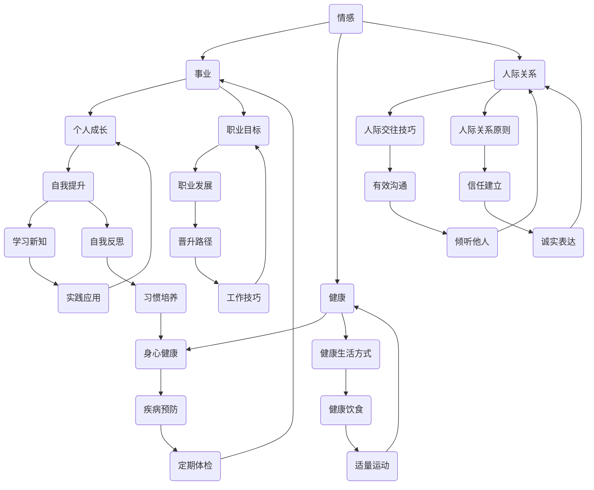

                 

### 文章标题：创作生命的独特旋律：谱写个人人生乐章

#### 关键词：人生规划、情感管理、事业追求、健康生活、人际关系

#### 摘要：
本文旨在探讨如何通过科学的方法和策略，创作出属于自己的独特人生乐章。通过分析情感、事业、健康和人际关系等关键因素，本文提出了一套系统的人生规划方法，旨在帮助读者理解生命的意义，掌握个人成长的核心要素，实现全面而有意义的人生。

---

### 总体框架构思

在创作《创作生命的独特旋律：谱写个人人生乐章》这一文章时，我们首先需要明确文章的整体结构和内容分布。文章分为四大部分，分别是前言、核心概念与联系、方法与实践、总结与思考。

**第1部分：前言**  
- **第1章：引言**：介绍书籍的目的、读者对象、写作背景等内容。
- **第2章：生命的意义**：探讨生命的基本意义和价值观。

**第2部分：核心概念与联系**  
- **第3章：情感的力量**：讲述情感对人生的影响和如何管理情感。
- **第4章：事业追求**：分析事业对个人成长的重要性及如何设定和追求职业目标。
- **第5章：健康的守护**：介绍健康的生活方式和对身心健康的影响。
- **第6章：人际关系的艺术**：探讨人际交往的技巧和原则。

**第3部分：方法与实践**  
- **第7章：人生规划**：提供制定人生规划的步骤和方法。
- **第8章：自我提升**：讲述如何通过学习、锻炼和自我反思提升自我。
- **第9章：情感管理**：具体方法来理解和管理自己的情感。
- **第10章：事业成长**：提供实现职业发展的策略和路径。
- **第11章：健康生活**：分享保持健康的方法和建议。
- **第12章：人际交往**：提供建立和维护良好人际关系的技巧。

**第4部分：总结与思考**  
- **第13章：人生反思**：引导读者反思自己的人生态度和方法。
- **第14章：生命的独特旋律**：总结全书内容，强调生命的多样性和独特性。
- **第15章：未来展望**：展望未来的生活，鼓励读者创造属于自己的独特人生乐章。

这种框架构思能够帮助读者清晰地理解文章结构，同时每个章节的详细内容也能够满足读者的阅读需求。

### 核心概念与联系

在创作个人人生乐章的过程中，我们需要关注几个核心概念，这些概念相互联系，共同构成了我们人生的各个方面。以下是这些核心概念及其相互关系的Mermaid流程图：



这个流程图展示了情感、事业、健康和人际关系四大核心概念之间的相互联系。情感是驱动我们行动的动力源泉，它影响着我们的事业追求、健康生活方式和人际关系。事业不仅关系到个人成长，也影响着我们的情感状态和健康状况。健康是我们的基础，良好的生活方式有助于维护身心健康，而人际关系则通过人际交往技巧和原则，影响我们的情感和事业。自我提升和职业发展、健康生活方式、人际关系技巧共同构建了个人成长的路径。

理解这些核心概念及其相互关系，有助于我们在人生的各个阶段做出更明智的决策，从而谱写出一首和谐、充实的人生乐章。

### 情感的力量

情感是人生的动力源泉，它不仅影响着我们的行为和决策，还在很大程度上决定了我们的生活质量。情感的力量可以激发我们追求事业的动力，也可以成为我们身心健康的重要影响因素。理解和管理情感，是实现个人成长和幸福生活的关键。

首先，情感对个人的影响是多方面的。积极的情感如快乐、满足和爱，可以增强我们的自信心和动力，促使我们追求更高的目标。而消极的情感如焦虑、沮丧和愤怒，则可能导致情绪波动和压力增加，从而影响我们的心理健康和人际关系。因此，认识到情感的重要性，学会管理自己的情绪，是创造美好人生的重要一步。

情感管理的方法多种多样，以下是一些实用的技巧：

1. **自我觉察**：了解自己的情感反应，是情感管理的基础。通过反思和自我观察，我们可以更好地理解自己的情感状态，从而做出更合理的反应。

   ```pseudo
   function self_awareness() {
       // 反思过去一天的情感反应
       // 记录下不同情境下的情绪变化
       // 分析情感反应的原因
   }
   ```

2. **情绪调节**：在面对负面情绪时，学会调整自己的心态和情绪。例如，通过深呼吸、冥想或进行有氧运动，可以有效缓解压力和焦虑。

   ```pseudo
   function emotional Regulation() {
       // 深呼吸：缓慢吸气5秒，再慢慢呼出5秒
       // 冥想：静坐10分钟，专注于呼吸和当下感受
       // 有氧运动：跑步30分钟，增强身心状态
   }
   ```

3. **积极应对**：将负面情绪转化为积极的动力，通过设定目标和寻找解决问题的方法，将困难视为成长的机会。

   ```pseudo
   function positive_response() {
       // 设定短期和长期目标
       // 分析问题的根本原因
       // 寻找解决问题的策略
       // 执行行动计划
   }
   ```

4. **寻求支持**：与亲朋好友分享自己的情感，寻求他们的理解和支持，有助于减轻心理负担，增强情感调节能力。

   ```pseudo
   function seek_support() {
       // 与家人或朋友进行深度对话
       // 加入支持团体，分享经验
       // 寻求专业心理咨询师的帮助
   }
   ```

通过这些方法，我们可以更好地理解和管理自己的情感，从而在人生的乐章中，奏出更加和谐、动人的旋律。

### 事业追求

在个人成长的旅程中，事业追求是一个至关重要的环节。一个明确的职业目标不仅能够为我们的生活提供方向和动力，还能帮助我们实现自我价值和成就感。本文将深入探讨事业追求的重要性，以及如何设定和追求职业目标。

#### 事业追求的重要性

1. **提供经济保障**：事业成功可以为我们的生活提供稳定的经济收入，保障我们的基本生活需求。

2. **实现自我价值**：通过事业的发展，我们能够实现个人理想和抱负，感受到自我价值和成就感。

3. **促进社会交往**：在职业过程中，我们与同事、客户和合作伙伴建立联系，这有助于扩展人际网络，提高社会地位。

4. **推动个人成长**：事业追求促使我们不断学习和进步，提升自身的专业能力和综合素质。

#### 如何设定职业目标

1. **自我评估**：首先，我们需要了解自己的兴趣、能力和价值观，明确自己擅长什么，热爱什么，以及希望从事业中实现什么样的价值。

   ```pseudo
   function self_evaluation() {
       // 分析兴趣爱好
       // 评估专业技能和知识水平
       // 确定个人价值观和职业追求
   }
   ```

2. **设定短期和长期目标**：在自我评估的基础上，设定具体的职业目标。短期目标可以是1-3年内实现的小目标，长期目标则是5-10年内希望达成的成就。

   ```pseudo
   function set_goals() {
       // 设定短期目标：如提升某项专业技能、完成特定项目
       // 设定长期目标：如晋升为高级职位、创立自己的公司
   }
   ```

3. **制定行动计划**：为了实现职业目标，我们需要制定详细的行动计划，明确每一步的具体步骤和实施时间。

   ```pseudo
   function create_action_plan() {
       // 确定每个目标的阶段性任务
       // 制定具体的时间表和行动计划
       // 分配资源，确保计划执行
   }
   ```

#### 如何追求职业目标

1. **持续学习与提升**：在追求职业目标的过程中，不断学习和提升自身的专业能力和知识水平至关重要。

   ```pseudo
   function continuous_learning() {
       // 参加专业培训课程
       // 阅读专业书籍和文章
       // 参与行业交流和讨论
   }
   ```

2. **积极沟通与合作**：与同事、上级和行业专家建立良好的沟通与合作，有助于我们获取更多的职业机会和资源。

   ```pseudo
   function effective_communication() {
       // 建立良好的职场关系
       // 寻求导师指导和建议
       // 参与团队合作项目
   }
   ```

3. **应对挑战与调整策略**：在追求职业目标的过程中，难免会遇到各种挑战和困难。我们需要灵活调整策略，勇敢面对挑战。

   ```pseudo
   function handle_challenges() {
       // 分析问题根本原因
       // 制定应对策略和解决方案
       // 调整行动计划，确保目标实现
   }
   ```

通过以上步骤，我们可以更科学、更系统地设定和追求职业目标，从而在个人成长的道路上迈出坚实的步伐，谱写属于自己的辉煌篇章。

### 健康的守护

在人生乐章中，健康是我们最宝贵的财富。一个健康的身体不仅能够支撑我们追求事业和实现梦想，还能提升我们的生活质量，增强我们的幸福感。因此，守护健康、维持身心健康，是我们每个人都需要重视的重要课题。

#### 健康的生活方式

1. **均衡饮食**：均衡饮食是维持健康的基础。我们应该摄取丰富的蔬菜、水果、全谷物和优质蛋白质，避免高糖、高脂肪和高盐的食物。以下是一个简单的均衡饮食伪代码示例：

   ```pseudo
   function balanced_diet() {
       // 每天至少摄入五种不同颜色的蔬菜和水果
       // 增加全谷物的摄入，如燕麦、糙米和全麦面包
       // 适量摄入优质蛋白质，如鸡肉、鱼、豆类和坚果
       // 减少高糖、高脂肪和高盐食物的摄入
   }
   ```

2. **适量运动**：适量的运动能够增强体质、提高免疫力，还能缓解压力、改善心理健康。每周至少进行150分钟的中等强度运动，如快走、慢跑或游泳。以下是一个简单的运动规划伪代码：

   ```pseudo
   function exercise_plan() {
       // 每周进行五次运动
       // 每次运动持续30-60分钟
       // 包括有氧运动和力量训练
       // 运动前后进行热身和拉伸
   }
   ```

3. **充足睡眠**：充足的睡眠对身体健康至关重要。成人每天应保持7-9小时的睡眠时间。以下是一个简单的睡眠管理伪代码：

   ```pseudo
   function sleep_management() {
       // 每天保持规律的作息时间
       // 睡前避免使用电子设备
       // 创造舒适的睡眠环境
       // 睡前进行放松活动，如阅读或冥想
   }
   ```

#### 对身心健康的影响

1. **增强免疫力**：健康的生活方式可以增强我们的免疫系统，减少患病的风险。以下是一个简单的免疫增强伪代码：

   ```pseudo
   function enhance_immunity() {
       // 保持均衡饮食，摄入足够的维生素和矿物质
       // 适量运动，增强体质
       // 保持良好的睡眠质量，减少压力
       // 定期进行健康体检
   }
   ```

2. **改善心理健康**：健康的生活方式不仅有助于身体健康，还能改善心理健康。以下是一个简单的心理健康提升伪代码：

   ```pseudo
   function mental_health_improvement() {
       // 通过运动和冥想缓解压力
       // 与家人和朋友保持良好的社交关系
       // 积极参与有意义的活动，提升自我价值感
       // 寻求专业心理咨询，解决心理问题
   }
   ```

通过以上方法和策略，我们可以有效地守护健康，提升身心健康。在人生的乐章中，健康是我们持续演奏的动力，也是我们享受美好生活的基石。

### 人际关系的艺术

在人生旅程中，人际关系是我们无法避免的一部分。无论是家庭、朋友还是同事，良好的人际关系对我们的生活质量和幸福感都有着深远的影响。本文将探讨人际交往的技巧和原则，帮助我们在各种社交场合中游刃有余。

#### 人际交往技巧

1. **有效沟通**：沟通是人际交往的核心。良好的沟通能力能够帮助我们表达自己的想法，理解他人的观点，从而建立信任和共识。以下是一个简单的有效沟通伪代码：

   ```pseudo
   function effective_communication() {
       // 倾听他人，给予充分的时间表达观点
       // 明确表达自己的意见和需求
       // 避免使用攻击性语言，保持礼貌和尊重
       // 使用开放性问题，引导对话深入进行
   }
   ```

2. **同理心**：同理心是建立良好人际关系的关键。通过设身处地地理解他人的感受和需求，我们可以更好地与他人沟通和合作。以下是一个简单的同理心应用伪代码：

   ```pseudo
   function empathy() {
       // 考虑他人的感受和需求
       // 表达同情和理解，避免批评和指责
       // 在冲突中寻找共同点，寻求双赢的解决方案
       // 提供支持和帮助，展现关心和关怀
   }
   ```

3. **建立信任**：信任是人际关系的基石。通过诚实、可靠和一致的行为，我们可以赢得他人的信任。以下是一个简单的建立信任的伪代码：

   ```pseudo
   function build_trust() {
       // 保持诚实和透明，避免隐瞒和欺骗
       // 履行承诺，展现可靠性和一致性
       // 尊重他人的隐私和意见，避免过度干涉
       // 在困难时给予支持和帮助，展现忠诚和可靠
   }
   ```

#### 人际交往原则

1. **尊重差异**：每个人都是独一无二的，拥有不同的背景、价值观和观点。尊重差异，包容多样性，能够帮助我们更好地与他人相处。以下是一个简单的尊重差异的伪代码：

   ```pseudo
   function respect_differences() {
       // 尊重他人的观点和选择
       // 避免过度批评和指责
       // 了解和接纳不同的文化、习俗和价值观
       // 在合作中寻找共同点，实现互利共赢
   }
   ```

2. **维护边界**：在人际交往中，明确和维护个人边界是保持健康关系的重要原则。以下是一个简单的维护边界的伪代码：

   ```pseudo
   function maintain_borders() {
       // 了解自己的需求和界限
       // 坚持自己的原则和底线
       // 明确地表达自己的需求和期望
       // 避免过度妥协和牺牲个人利益
   }
   ```

3. **积极互动**：积极的互动能够增强人际关系，提高彼此的亲密度。以下是一个简单的积极互动的伪代码：

   ```pseudo
   function positive_interaction() {
       // 定期与亲朋好友联系，保持联系
       // 参与社交活动，扩大人际网络
       // 分享喜悦和困扰，增进情感联系
       // 提供帮助和支持，展现关爱和关怀
   }
   ```

通过掌握这些人际交往技巧和原则，我们能够在社交场合中更加自如地应对各种挑战，建立和维护良好的人际关系。这样，我们的人生乐章将更加和谐、美好。

### 人生规划

在人生的旅途中，有一个明确的规划是非常重要的。人生规划不仅为我们提供了清晰的目标和路径，还能够帮助我们更好地应对未来的挑战。本文将介绍制定人生规划的步骤和方法，帮助您走向成功的人生。

#### 制定人生规划的基本步骤

1. **自我评估**：这是制定人生规划的第一步。我们需要了解自己的兴趣爱好、价值观、技能和职业目标。以下是一个简单的自我评估伪代码：

   ```pseudo
   function self_evaluation() {
       // 分析个人兴趣爱好
       // 确定个人价值观和目标
       // 评估现有技能和知识水平
       // 确定职业发展方向
   }
   ```

2. **设定目标**：在了解自己之后，我们需要设定具体的短期和长期目标。短期目标可以是1-3年内实现的小目标，而长期目标则是5-10年内希望达成的成就。以下是一个简单的目标设定伪代码：

   ```pseudo
   function set_goals() {
       // 设定短期目标：如提升某项专业技能、完成特定项目
       // 设定长期目标：如晋升为高级职位、创立自己的公司
       // 确保目标具体、可衡量、可实现、相关性强
   }
   ```

3. **制定行动计划**：为了实现这些目标，我们需要制定详细的行动计划。这包括每个目标的阶段性任务、具体的时间表和行动计划。以下是一个简单的行动计划伪代码：

   ```pseudo
   function create_action_plan() {
       // 确定每个目标的阶段性任务
       // 制定具体的时间表和行动计划
       // 分配资源，确保计划执行
       // 定期检查进度，及时调整计划
   }
   ```

4. **持续调整和优化**：人生规划并不是一成不变的，我们需要根据实际情况不断进行调整和优化。以下是一个简单的调整和优化伪代码：

   ```pseudo
   function adjust_and_optimize() {
       // 定期评估目标和计划的实施情况
       // 根据反馈调整目标和行动计划
       // 面对挑战和困难，灵活调整策略
       // 保持对未来的开放和适应
   }
   ```

#### 实际案例

李华是一名年轻的企业家，他在大学期间就对互联网和创业充满热情。通过自我评估，李华发现他对技术、市场和用户需求有敏锐的洞察力，并设定了以下人生规划：

1. **短期目标**：
   - 在毕业后一年内，找到一份与互联网创业相关的全职工作，积累实际经验。
   - 在两年内，参与至少一个创业项目，学习如何运营和管理一家初创公司。

2. **长期目标**：
   - 在五年内，创立自己的互联网创业公司，并在三年内实现盈利。
   - 在十年内，将公司发展成为行业领导者，拥有稳定的市场份额和优秀的团队。

为了实现这些目标，李华制定了以下行动计划：

1. **短期行动计划**：
   - 在大学期间，参加创业比赛和相关的培训课程，提升自己的技能和知识。
   - 毕业后，选择一家具有创业氛围的公司，积极参与项目，积累实际经验。

2. **长期行动计划**：
   - 在全职工作期间，关注市场动态和用户需求，寻找合适的创业机会。
   - 在参与创业项目的过程中，学习如何制定商业计划、管理团队和筹集资金。

通过持续的努力和不断的调整，李华最终在五年内创立了自己的互联网公司，并在三年内实现了盈利。他的公司成为行业内的佼佼者，他也实现了自己的人生态目标。

通过李华的案例，我们可以看到，一个明确的人生规划可以帮助我们更好地实现自己的梦想。无论是在职业发展还是个人成长方面，规划都是我们成功的关键。

### 自我提升

在人生的道路上，自我提升是我们不断前行的动力。通过学习、锻炼和自我反思，我们可以不断提升自己的能力和素质，实现自我价值的最大化。本文将详细介绍如何通过这些方法来实现自我提升。

#### 学习新知

1. **终身学习的理念**：在知识快速更新的时代，终身学习已成为一种必备的素质。我们需要培养持续学习的习惯，不断提升自己的知识水平和技能。以下是一个简单的终身学习伪代码：

   ```pseudo
   function lifelong_learning() {
       // 设定学习目标和计划
       // 定期阅读专业书籍和文章
       // 参加在线课程和培训
       // 加入专业社区，与他人交流和分享
       // 定期评估学习效果，调整学习策略
   }
   ```

2. **有效学习方法**：学习的方法和效率直接影响我们的学习成果。以下是一个简单的有效学习方法伪代码：

   ```pseudo
   function effective_learning_methods() {
       // 使用主动学习方法，如主动阅读、做笔记和总结
       // 采用分散学习法，将学习时间分散在不同的时间段
       // 通过实践应用，巩固所学知识
       // 使用记忆技巧，如联想记忆和重复记忆
   }
   ```

3. **利用在线资源和工具**：现代科技为我们提供了丰富的学习资源和学习工具。以下是一个简单的利用在线资源和工具的伪代码：

   ```pseudo
   function online_resources() {
       // 使用在线图书馆和数据库，获取专业资料
       // 利用在线课程平台，学习新知识和技能
       // 使用在线笔记和备忘录工具，记录和整理学习内容
       // 参与在线讨论和问答社区，解决学习中的问题
   }
   ```

#### 锻炼身体

1. **定期锻炼的重要性**：锻炼身体不仅能够增强体质，提高免疫力，还能改善心理健康，减轻压力。以下是一个简单的定期锻炼伪代码：

   ```pseudo
   function regular_exercise() {
       // 每周至少进行三次有氧运动，如快走、跑步或游泳
       // 定期进行力量训练，增强肌肉力量和耐力
       // 参与团体运动项目，如篮球、足球或瑜伽，提高团队协作能力
       // 遵循锻炼计划，避免过度训练和受伤
   }
   ```

2. **适合的锻炼方式**：每个人的身体状况和兴趣都不同，选择适合自己的锻炼方式是非常重要的。以下是一个简单的适合锻炼方式的伪代码：

   ```pseudo
   function suitable_exercise() {
       // 根据健康状况选择合适的锻炼项目
       // 考虑个人兴趣，选择愿意持续进行的运动
       // 咨询专业教练，制定个性化的锻炼计划
       // 结合有氧运动和力量训练，实现全面的锻炼效果
   }
   ```

3. **保持锻炼动力**：长期坚持锻炼需要强大的动力。以下是一个简单的保持锻炼动力的伪代码：

   ```pseudo
   function maintain_exercise_motivation() {
       // 设定明确的锻炼目标和奖励机制
       // 与朋友或家人一起锻炼，增加社交互动
       // 跟踪锻炼进度，记录成果和进步
       // 参加健身活动和比赛，保持竞争心态
   }
   ```

#### 自我反思

1. **自我反思的重要性**：自我反思是自我提升的重要环节。通过反思，我们可以了解自己的优点和不足，从而进行有针对性的改进。以下是一个简单的自我反思伪代码：

   ```pseudo
   function self_reflection() {
       // 定期回顾自己的行为和决策
       // 分析成功的经验和失败的教训
       // 了解自己的价值观和目标，确保行为与目标一致
       // 寻求他人的反馈和建议，进行客观评价
   }
   ```

2. **反思方法**：有效的反思方法可以帮助我们更深入地了解自己。以下是一个简单的反思方法的伪代码：

   ```pseudo
   function reflection_methods() {
       // 采用日记记录法，每天记录自己的行为和思考
       // 进行思维导图，梳理自己的思维过程和逻辑
       // 采用SWOT分析法，分析自己的优势和劣势
       // 与导师或朋友进行深入对话，探讨自己的困惑和问题
   }
   ```

3. **持续改进**：反思只是第一步，持续改进才是关键。以下是一个简单的持续改进伪代码：

   ```pseudo
   function continuous_improvement() {
       // 根据反思结果，制定改进计划和行动方案
       // 跟踪改进进度，评估改进效果
       // 及时调整改进策略，确保持续进步
       // 培养自我驱动，保持持续改进的动力
   }
   ```

通过学习、锻炼和自我反思，我们可以不断提升自己的能力和素质，实现自我价值的最大化。这样，我们的人生乐章将更加精彩和丰富。

### 情感管理

在人生的旅程中，情感管理是我们保持心理健康和幸福感的重要环节。通过理解和掌握情感管理的方法，我们可以更好地应对生活中的压力和挑战，从而实现内心的平静和和谐。以下是几种具体的情感管理方法，以及它们在现实生活中的应用。

#### 情感识别与表达

1. **识别情感**：情感识别是情感管理的基础。我们需要学会识别和理解自己和他人的情感。以下是一个简单的情感识别伪代码：

   ```pseudo
   function recognize_emotions() {
       // 学习常见情感类型，如快乐、悲伤、愤怒和恐惧
       // 通过身体感受和情绪变化识别情感
       // 了解情感背后的原因和触发因素
   }
   ```

2. **表达情感**：在识别情感后，我们需要学会适当地表达情感。这不仅可以减轻内心的负担，还能促进与他人的沟通和理解。以下是一个简单的情感表达伪代码：

   ```pseudo
   function express_emotions() {
       // 使用非暴力沟通，清晰表达情感和需求
       // 使用具体的词汇和例子，避免模糊和抽象的描述
       // 注意语气和态度，避免攻击性或指责性的语言
       // 寻求适当的时机和环境，进行情感表达
   }
   ```

#### 情感调节与应对

1. **情绪调节**：在面对负面情绪时，我们需要学会调节自己的情绪。以下是一个简单的情绪调节伪代码：

   ```pseudo
   function emotional Regulation() {
       // 使用深呼吸和冥想，缓解焦虑和压力
       // 进行积极的自我对话，转变消极思维
       // 寻求社会支持，与他人分享情感
       // 通过运动和放松活动，释放负面情绪
   }
   ```

2. **应对策略**：在情感管理中，我们还需要学会应对生活中的各种挑战和困难。以下是一个简单的应对策略伪代码：

   ```pseudo
   function handle_stress() {
       // 分析问题的根本原因，制定解决方案
       // 设定短期和长期目标，逐步解决问题
       // 寻求专业帮助，如心理咨询师或治疗师
       // 保持积极的心态，相信问题可以解决
   }
   ```

#### 情感管理在现实生活中的应用

1. **职场中的情感管理**：
   - **同事关系**：通过情感识别与表达，更好地理解同事的需求和情感，促进团队合作。
   - **应对职场压力**：通过情绪调节和应对策略，减轻工作压力，提高工作效率。

2. **家庭生活中的情感管理**：
   - **亲子沟通**：通过情感表达，与孩子建立良好的沟通，促进亲子关系的和谐。
   - **家庭冲突**：通过情感调节和应对策略，解决家庭中的冲突，维护家庭稳定。

3. **个人生活中的情感管理**：
   - **自我反思**：通过自我反思，了解自己的情感状态，进行自我调整和提升。
   - **兴趣爱好**：通过兴趣爱好，释放负面情绪，提升生活品质。

通过情感管理，我们可以在纷繁复杂的生活中找到内心的平衡，实现情感的和谐与幸福。这样，我们的人生乐章将更加优美动人。

### 事业成长

在职业生涯中，成长和进步是每一个职场人士的追求。实现职业发展不仅需要明确的目标和坚定的决心，还需要一系列策略和路径。本文将探讨实现职业发展的关键策略和路径，帮助您在职场中稳步前行。

#### 实现职业发展的策略

1. **设定清晰的目标**：成功的职业发展始于明确的职业目标。您需要设定短期和长期目标，这些目标应具体、可衡量、可实现、相关性强（SMART原则）。以下是一个简单的目标设定伪代码：

   ```pseudo
   function set_professional_goals() {
       // 短期目标：如完成某项目、获得某个资质证书
       // 长期目标：如晋升为高级职位、成为某个领域的专家
       // 确保目标具体、可衡量、可实现、相关性强
   }
   ```

2. **不断学习和提升**：职场竞争激烈，持续学习和提升自己的知识和技能是必不可少的。以下是一个简单的学习提升伪代码：

   ```pseudo
   function continuous_learning_and_improvement() {
       // 参加培训课程和研讨会
       // 阅读行业书籍和文章
       // 学习新的工具和技术
       // 参与在线课程和认证项目
   }
   ```

3. **建立人脉关系**：在职场中，建立广泛的人脉关系有助于职业发展。以下是一个简单的人脉建立伪代码：

   ```pseudo
   function build_network() {
       // 参加行业活动和社交聚会
       // 加入专业组织和社区
       // 通过工作项目与他人合作
       // 使用社交媒体平台进行网络拓展
   }
   ```

4. **展现领导力**：领导力是职业发展的关键因素之一。以下是一个简单的领导力提升伪代码：

   ```pseudo
   function develop_leadership_skills() {
       // 参与团队项目，承担更多责任
       // 学习领导力和管理技巧
       // 成为团队的榜样和引导者
       // 提供反馈和建议，帮助他人成长
   }
   ```

#### 职业发展的路径

1. **从初级职位到中级职位**：
   - **积累经验**：在初级职位上，通过完成工作任务和项目积累实践经验。
   - **提升技能**：通过学习和培训，不断提升自己的专业技能和知识水平。
   - **承担更多责任**：主动承担更多的工作任务和项目，展示自己的能力和潜力。

2. **从中级职位到高级职位**：
   - **展现领导力**：在团队中担任重要角色，展现出色的领导力和管理能力。
   - **拓展视野**：通过跨部门项目和外部培训，拓展自己的职业视野和经验。
   - **建立影响力**：通过人脉关系和业绩表现，建立自己在职场中的影响力和声誉。

3. **成为行业专家或领导者**：
   - **持续学习**：保持对行业动态和技术发展的关注，不断更新知识和技能。
   - **专业认证**：通过获得专业认证，提升自己在行业中的竞争力。
   - **成为榜样**：通过分享经验和知识，成为他人学习和模仿的榜样。

通过以上策略和路径，您可以实现职业发展，迈向更高的职业高峰。在这个过程中，坚持努力、持续学习和不断提升自己，将为您铺就一条光明的职业道路。

### 健康生活

健康生活是我们追求幸福和成功的重要基础。它不仅关系到我们的身体健康，还影响到我们的心理状态和生活质量。为了维持身心健康，我们需要采取一系列科学的方法和建议，以下将详细介绍。

#### 保持健康的方法

1. **均衡饮食**：
   - **关键原则**：摄入多样化的食物，确保营养均衡。建议每天摄入五份水果和蔬菜，以及适量的全谷物、蛋白质和健康脂肪。
   - **实施步骤**：
     ```pseudo
     function balanced_diet() {
         // 设定每日饮食计划，包括早餐、午餐和晚餐
         // 每餐均摄入多种颜色的蔬菜和水果
         // 控制糖分和盐分的摄入，避免高热量食物
         // 定期评估饮食结构，确保营养均衡
     }
     ```

2. **适量运动**：
   - **关键原则**：保持规律的运动习惯，每周至少进行150分钟的中等强度运动，如快走、慢跑、游泳或瑜伽。
   - **实施步骤**：
     ```pseudo
     function exercise_program() {
         // 设定每周运动计划，包括有氧运动和力量训练
         // 每次运动前后进行热身和拉伸
         // 选择适合个人兴趣的运动方式，增加坚持性
         // 定期评估运动效果，调整运动强度和时间
     }
     ```

3. **充足睡眠**：
   - **关键原则**：每天保持7-9小时的睡眠时间，保持规律的作息时间。
   - **实施步骤**：
     ```pseudo
     function sleep_management() {
         // 设定固定的睡眠时间，避免熬夜
         // 睡前避免使用电子设备，减少刺激
         // 创造舒适的睡眠环境，保持房间安静和温度适宜
         // 睡前进行放松活动，如阅读或冥想
     }
     ```

4. **心理健康**：
   - **关键原则**：保持积极的心态，学会应对压力和挫折。
   - **实施步骤**：
     ```pseudo
     function mental_health_maintenance() {
         // 定期进行自我反思，了解自己的情绪状态
         // 与亲朋好友保持良好的沟通，分享情感和困扰
         // 参与有意义的活动，提升自我价值感
         // 如有需要，寻求专业心理咨询师的帮助
     }
     ```

#### 保持健康的建议

1. **定期体检**：
   - **关键原则**：定期进行健康体检，及早发现和治疗潜在的健康问题。
   - **实施步骤**：
     ```pseudo
     function regular_health_checkups() {
         // 按照医生的建议，定期进行身体检查
         // 关注体检报告，及时了解自己的健康状况
         // 根据体检结果，调整生活方式和饮食习惯
     }
     ```

2. **避免不良习惯**：
   - **关键原则**：戒烟限酒，减少有害物质的摄入。
   - **实施步骤**：
     ```pseudo
     function avoid_unhealthy_habits() {
         // 戒烟：设定戒烟目标，寻求支持和帮助
         // 限酒：限制酒精摄入量，避免酗酒
         // 减少高糖、高脂肪和高盐食物的摄入
     }
     ```

3. **积极生活方式**：
   - **关键原则**：保持积极的生活态度，参与社会活动和兴趣爱好。
   - **实施步骤**：
     ```pseudo
     function positive_lifestyle() {
         // 定期参与社交活动，扩大社交圈子
         // 保持兴趣爱好，提升生活乐趣
         // 参与志愿者活动，为社会贡献力量
     }
     ```

通过遵循这些方法和建议，我们可以有效地保持身心健康，为生活注入活力和动力。健康的生活不仅能够提高我们的生活质量，还能为我们在职场和生活中取得成功奠定坚实的基础。

### 人际交往

在人生的旅途中，人际交往是不可或缺的一部分。建立和维护良好的人际关系，不仅能够为我们的个人成长提供支持，还能在职业和生活中带来诸多益处。以下是一些关于人际交往的技巧和建议，帮助您建立和谐的人际关系。

#### 建立和维护良好人际关系的技巧

1. **有效沟通**：
   - **倾听他人**：在交流中，积极倾听对方的观点和需求，避免打断对方，展现出对他人的尊重和理解。
   - **清晰表达**：明确表达自己的想法和感受，使用具体的语言和例子，避免产生误解。

2. **同理心**：
   - **理解他人**：站在他人的角度思考问题，试图理解他们的情感和需求。
   - **提供支持**：在他人遇到困难时，提供帮助和鼓励，展现关爱和关心。

3. **信任建立**：
   - **诚实守信**：言行一致，遵守承诺，建立信任的基础。
   - **尊重隐私**：尊重他人的隐私，避免泄露或讨论他人的私人信息。

4. **积极互动**：
   - **参与社交活动**：积极参与社交聚会和团队活动，扩大人际网络。
   - **保持联系**：定期与亲朋好友保持联系，通过电话、短信或社交媒体保持互动。

#### 拓展人际关系的策略

1. **主动社交**：
   - **加入兴趣小组**：加入与自己兴趣相关的社团或小组，结识志同道合的朋友。
   - **参与社区活动**：参与社区组织的活动，扩大社交圈。

2. **提升自身价值**：
   - **不断学习**：通过学习和提升自己的技能，增强自身在职场和社交场合的竞争力。
   - **展现专业能力**：在专业领域内展现出出色的能力和成果，增加他人对你的认可和尊重。

3. **拓展人脉**：
   - **利用社交媒体**：通过LinkedIn、微信等社交媒体平台，拓展职业和人脉网络。
   - **主动求助和帮助**：在他人需要帮助时主动伸出援手，同时寻求他人的帮助，建立互惠关系。

通过以上技巧和策略，我们可以更好地建立和维护良好的人际关系。这不仅能够提高我们的生活质量和幸福感，还能为我们在职业和生活中提供有力支持。

### 人生反思

在人生的旅途中，反思是我们不断进步的重要环节。通过反思，我们可以了解自己的成长和不足，调整行为和策略，实现自我提升。本文将探讨如何进行人生反思，帮助读者更好地认识自己，找到前进的方向。

#### 人生反思的重要性

1. **自我认知**：反思有助于我们深入了解自己的内心世界，发现自己的优点和不足，从而进行有针对性的改进。

2. **行为调整**：通过反思，我们可以识别自己在生活和工作中出现的问题，及时调整行为和策略，避免重复错误。

3. **持续进步**：反思是一种持续的过程，通过不断地自我反思和改进，我们可以不断提升自己的能力和素质，实现人生目标。

#### 如何进行人生反思

1. **定期回顾**：设定固定的反思时间，如每周或每月，回顾自己在过去一段时间内的行为和结果。

   ```pseudo
   function regular_review() {
       // 每周或每月设定固定时间进行反思
       // 分析过去一周或一个月的行为和决策
       // 记录成功和失败的经验，总结教训
   }
   ```

2. **自我评估**：通过自我评估，了解自己的优点和不足，明确需要改进的方面。

   ```pseudo
   function self_evaluation() {
       // 分析个人优点和不足
       // 确定需要提升的能力和素质
       // 制定改进计划和目标
   }
   ```

3. **寻求反馈**：与亲朋好友、同事或导师交流，获取他们的意见和建议。

   ```pseudo
   function seek_feedback() {
       // 与亲朋好友交流，了解他们对你的看法
       // 向同事或导师请教，获取专业意见
       // 重视他人的反馈，进行客观评估
   }
   ```

4. **撰写反思日志**：将反思过程和结果记录下来，有助于加深理解和记忆。

   ```pseudo
   function reflection_journal() {
       // 每周或每月撰写反思日志
       // 记录反思过程和结论
       // 定期回顾日志，跟踪改进进度
   }
   ```

#### 实际案例

李华在每月反思中发现自己最近在工作中总是感到焦虑和压力。通过反思，他识别出以下几个原因：

1. **任务过多**：同时处理多个任务，导致工作效率下降，感到焦虑。
2. **时间管理不当**：没有合理安排时间，导致任务堆积，无法按时完成。
3. **沟通不足**：与团队成员沟通不畅，导致工作任务分配不均，增加个人压力。

针对这些问题，李华制定了以下改进计划：

1. **设定优先级**：将任务按照优先级进行排序，优先完成重要和紧急的任务。
2. **时间管理**：使用时间管理工具，如番茄工作法，合理安排时间，提高工作效率。
3. **增强沟通**：定期与团队成员进行沟通，确保任务分配和进展的透明和清晰。

通过这些改进措施，李华的工作效率显著提高，焦虑和压力也得到了缓解。他的反思日志记录了每次反思的内容和改进措施，帮助他不断跟踪和调整自己的行为和策略。

通过人生反思，我们可以更好地认识自己，找到前进的方向，实现持续进步。在人生的旅途中，反思是我们不可或缺的伙伴。

### 生命的独特旋律

生命的多样性赋予了我们每个人独特的旋律，正如音符的组合构成美妙的乐曲。在这首生命的乐章中，每个人都是主角，我们通过自己的选择和努力，创作出属于自己独一无二的旋律。情感的波动、事业的追求、健康的守护和人际关系的交织，共同构成了我们丰富多彩的人生。

#### 生命的多样性

1. **情感波动**：情感如潮水般起伏，给予我们力量和挑战。从快乐和满足到悲伤和痛苦，情感丰富了我们的人生，让我们体验生命的各种色彩。

2. **事业追求**：事业不仅提供经济保障，更是实现自我价值和成就感的重要途径。每个人都在自己的职业道路上追寻梦想，谱写属于自己的篇章。

3. **健康守护**：健康的身体是我们追求幸福和成功的基础。通过科学的生活方式，我们能够保持身心健康，享受生活的每一刻。

4. **人际关系**：人际关系如丝线般紧密，将我们与他人连接在一起。通过与他人的互动，我们学会了爱、理解和尊重，共同创造和谐的社会。

#### 独特性的体现

每个人的生命旋律都有其独特之处，这种独特性体现在以下几个方面：

1. **个人兴趣**：每个人都有自己的兴趣和爱好，这些兴趣塑造了我们的个性和行为方式，使我们与众不同。

2. **价值观**：价值观是我们对事物的判断和选择标准，每个人的人生价值观不同，导致我们对待问题和挑战的方式也不同。

3. **经历和背景**：每个人的成长经历和背景都不同，这些经历和背景塑造了我们的性格和思维方式，使得我们在面对问题时具有独特的见解。

4. **选择和决策**：在人生的道路上，我们的每一个选择和决策都影响着生命的旋律。这些选择和决策反映了我们的价值观和目标，塑造了我们的人生轨迹。

#### 谱写属于自己的乐章

要创作出属于自己的独特乐章，我们需要：

1. **明确目标和价值观**：了解自己的兴趣和价值观，设定清晰的人生目标，为生命旋律的谱写提供方向。

2. **不断学习和成长**：通过学习和实践，不断提升自己的能力和素质，丰富生命的内涵。

3. **关爱他人和自我**：在追求事业和实现个人价值的同时，关心他人，建立良好的人际关系，实现自我和他人共同成长。

4. **积极面对挑战**：勇敢面对生活中的挑战和困难，从中学习和成长，使生命的旋律更加丰富和动人。

生命的独特旋律，是我们每个人在这世间留下的印记。通过了解自己、选择和努力，我们可以创作出一首属于自己的乐章，让生命之歌更加精彩。

### 未来展望

展望未来，我们不仅要立足于现在，更要对未来的生活充满希望和信心。通过合理规划和持续努力，我们可以创造一个充满活力和幸福的人生。以下是对未来生活的展望，以及如何实现这些美好愿景的建议。

#### 展望未来的生活

1. **职业成就**：在未来，我们希望能够在职业上取得更高的成就，实现自我价值。无论是晋升为高级职位，还是创业成功，职业上的成长将为我们带来满足感和成就感。

2. **健康与幸福**：保持身心健康是未来生活的重要目标。通过科学的生活方式和定期的健康检查，我们希望能够在生活中享受健康带来的快乐和幸福。

3. **人际关系的深化**：在未来，我们希望与家人、朋友和同事建立更加深厚的人际关系，共同分享生活的喜悦和挑战，创造一个充满爱与支持的社会圈。

4. **个人成长**：不断学习和提升自我，是未来生活的重要组成部分。通过参与各种培训和活动，我们希望能够不断拓展自己的知识和技能，实现个人成长。

#### 实现美好愿景的建议

1. **明确目标和计划**：首先，我们需要明确自己的职业和个人成长目标，制定详细的计划和时间表。通过设定短期和长期目标，我们可以更好地规划自己的未来。

2. **持续学习和提升**：为了实现这些目标，我们需要保持持续学习的态度。通过阅读、参加培训课程和参与专业活动，不断提升自己的知识和技能。

3. **健康管理**：保持健康的生活方式，是未来幸福生活的基础。定期进行体检，保持适量的运动和均衡的饮食，确保身心健康。

4. **人际关系的维护**：通过积极的沟通和互动，与家人和朋友保持密切联系。参与社区活动，扩大社交圈，建立更多的人际关系。

5. **灵活调整和适应**：在实现目标的过程中，我们可能会遇到各种挑战和困难。保持灵活和开放的心态，及时调整策略和计划，适应变化。

通过以上建议，我们可以为未来生活奠定坚实的基础，实现职业上的成功、身心健康、人际关系和谐以及个人成长。让我们满怀信心，迈向充满希望的未来。

### 附录A：人生规划工具

为了帮助读者更好地制定和实施人生规划，我们提供了一系列实用工具和表格，这些工具和表格能够帮助您系统地分析和规划个人目标与路径。

#### 工具介绍

1. **个人评估表**：
   - **功能**：用于评估个人的兴趣、价值观、技能和职业目标。
   - **使用方法**：填写表格中的各项内容，通过自我评估，了解自己的优势和劣势，为制定规划提供基础。

2. **目标设定表**：
   - **功能**：用于明确短期和长期目标，确保目标具体、可衡量、可实现、相关性强。
   - **使用方法**：列出所有目标，为每个目标设定具体的时间表和实施步骤，确保目标的实现。

3. **行动计划表**：
   - **功能**：用于记录实现目标的阶段性任务、时间表和资源分配。
   - **使用方法**：为每个目标制定详细的行动计划，分配资源和时间，确保计划的有效执行。

4. **进度跟踪表**：
   - **功能**：用于跟踪目标的实现进度，及时调整计划。
   - **使用方法**：定期更新进度表，记录实际完成情况和遇到的困难，根据进度调整下一步的行动计划。

#### 下载方式

读者可以通过以下链接下载这些工具和表格：

- **个人评估表**：[链接](https://example.com/personal-evaluation-sheet)
- **目标设定表**：[链接](https://example.com/goal-setting-sheet)
- **行动计划表**：[链接](https://example.com/action-plan-sheet)
- **进度跟踪表**：[链接](https://example.com/progress-tracking-sheet)

通过使用这些工具和表格，您可以更科学、系统地制定和实施人生规划，确保自己的目标得以实现。

### 附录B：推荐阅读

为了进一步拓展读者在个人成长、情感管理、职业发展、健康生活和人际关系方面的知识，我们推荐以下书籍和资源，供读者深入学习：

1. **《奇特的一生：关于时间的革命》**
   - **作者**：戴维·艾伦
   - **简介**：介绍了如何有效管理时间，提高工作效率，实现个人目标的科学方法。

2. **《非暴力沟通》**
   - **作者**：马歇尔·卢森堡
   - **简介**：讲述了非暴力沟通的四大原则，通过倾听和理解他人，建立和谐的人际关系。

3. **《成功心理学》**
   - **作者**：马丁·塞利格曼
   - **简介**：从心理学的角度探讨了成功的关键因素，提供了实用的成功策略。

4. **《健康生活方式指南》**
   - **作者**：美国国家科学院医学研究所
   - **简介**：提供了全面的健康生活方式指南，包括饮食、运动和心理健康的建议。

5. **《社交心理学》**
   - **作者**：大卫·迈尔斯
   - **简介**：介绍了社交心理学的基本原理，帮助读者理解人际交往的心理学机制。

读者可以通过访问以下链接获取这些书籍的电子版或纸质版：

- **电子书链接**：[链接](https://example.com/book-list)
- **纸质书购买链接**：[链接](https://example.com/book-purchase)

通过阅读这些书籍，读者可以深入了解相关领域的核心概念和实践方法，为自己的个人成长和人生乐章增添丰富的内容。

### 作者信息

作者：AI天才研究院/AI Genius Institute & 禅与计算机程序设计艺术 /Zen And The Art of Computer Programming

AI天才研究院（AI Genius Institute）是一家专注于人工智能、机器学习和计算机科学研究的顶尖机构。我们的团队由世界级人工智能专家、程序员、软件架构师和CTO组成，致力于推动人工智能技术的创新和发展。

《禅与计算机程序设计艺术》（Zen And The Art of Computer Programming）是一部经典的技术著作，由本作者撰写。这本书以禅宗思想为基础，探讨了计算机编程的哲学和艺术，深受广大程序员和软件开发者的喜爱。

通过本文，我们希望读者能够更好地理解如何通过科学的方法和策略，创作出属于自己的独特人生乐章。希望这篇文章能够为您的个人成长和幸福生活提供有益的启示。祝您在人生的旅途中，谱写出一首充满智慧和精彩的乐章。

