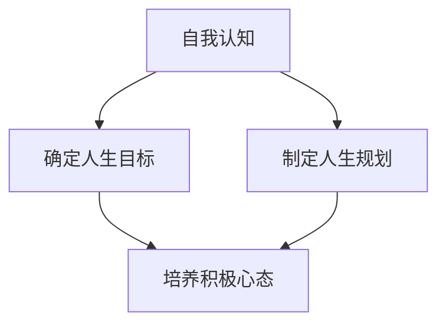
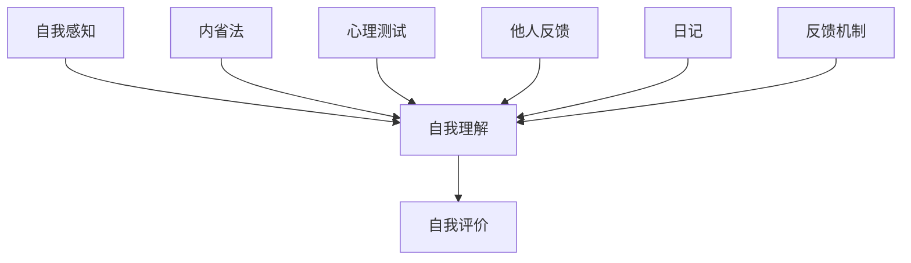
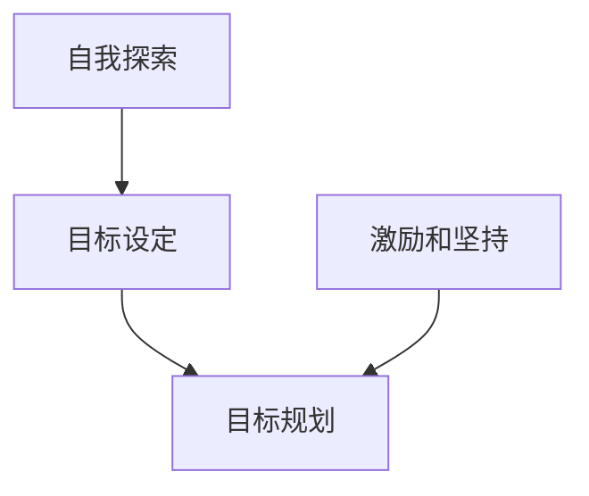
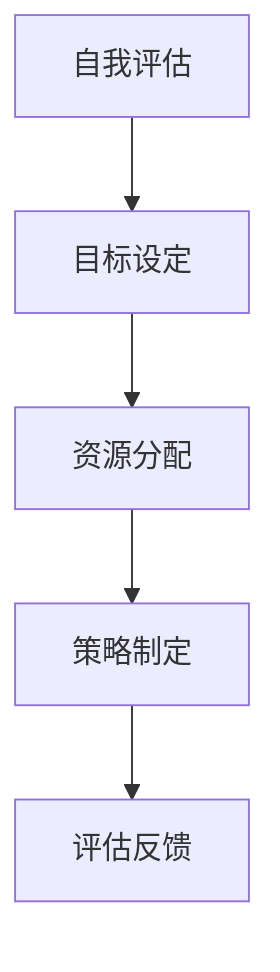
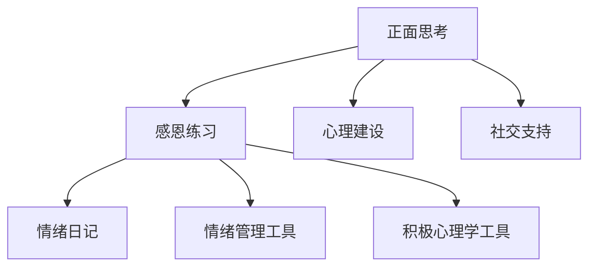

                 

### 文章标题：创作生命的独特旋律：谱写个人的人生乐章

#### 关键词：生命旋律、个人成长、人生规划、积极心态、自我认知

> 摘要：本文以“创作生命的独特旋律”为主题，探讨如何通过自我认知、确定人生目标和制定人生规划，培养积极心态，从而谱写个人的人生乐章。通过深入分析生命旋律的概念、自我认知的重要性以及如何培养积极心态，本文旨在为读者提供一套实用的个人成长方法论，帮助他们在人生道路上找到方向和动力，实现自我价值。

### 引言：什么是生命旋律

#### 1.1 生命的本质与旋律

生命，作为宇宙中最神秘的存在之一，其本质一直以来都是哲学和科学探讨的焦点。生命的定义多种多样，但可以归纳为一种能够自我维持、自我复制的复杂系统。在这种系统中，生命体通过不断地与环境进行物质和能量的交换，实现自我更新和进化。

那么，何为旋律？旋律，即一种有规律的音调组合，可以理解为时间的艺术表现。它通过音符的高低、长短、强弱等变化，表达出不同的情感和意义。将生命与旋律相比，可以理解为生命在时间轴上的一种节奏和韵律，这种韵律反映了生命的动态变化和内在规律。

##### 1.1.1 生命的定义

生命，是指生物体在自然环境下具有的能够自我维持、自我复制和自我调节的基本属性。这一基本属性使生命体能够适应环境变化，并通过遗传机制传递给后代。

##### 1.1.2 旋律的象征意义

旋律在音乐中不仅是一种艺术表现形式，更是一种情感表达。它通过不同的音符组合，传达出欢快、悲伤、激情等不同的情感状态。将旋律比喻为生命的韵律，意味着生命也有着不同的节奏和情感变化，这些变化共同构成了生命的旋律。

#### 1.2 人生乐章的概念

人生，可以看作是一首宏大的交响乐，每个人都是其中的一部分。人生乐章，即指个人在生命中演奏的旋律，它包括个人的成长、经历、成就和挫折等。每个个体的人生乐章都是独特的，因为它反映了每个人的个性、经历和环境。

##### 1.2.1 乐章的组成部分

乐章，通常由引子、主题、展开和尾声等部分组成。对应到人生，引子可以理解为个人的出生和成长环境，主题则是个人的人生目标，展开是个人为实现目标所经历的各种经历和挑战，尾声则是个人的人生结局和遗产。

##### 1.2.2 乐章的象征意义

乐章的象征意义在于，它不仅是一种艺术表现，更是一种生活态度。每个人的人生乐章都是独特的，因为它反映了每个人的价值观、选择和努力。通过谱写自己的人生乐章，我们可以更好地理解生命的意义，实现自我价值。

#### 1.3 谱写个人人生乐章的重要性

谱写个人人生乐章，即为自己的人生设定目标和规划，是一种积极的生活态度。通过明确自己的人生目标和规划，我们可以更清晰地认识到自己的优势和劣势，从而更好地发挥自己的潜力，实现自我价值。

##### 1.3.1 自我认知的重要性

自我认知，即对自己的了解和认识。它是谱写个人人生乐章的基础，因为只有了解自己，才能明确自己的优势和劣势，找到适合自己的发展方向。

##### 1.3.1.1 自我认知的定义

自我认知，是指个体对自己心理状态、行为特征和人际关系等方面的认识和理解。

##### 1.3.1.2 自我认知的重要性

自我认知的重要性在于，它可以帮助我们更好地了解自己，发现自己的优势和劣势，找到适合自己的发展方向，从而实现自我价值。

##### 1.3.1.3 自我认知的方法

自我认知的方法包括内省法、心理测试和他人反馈等。内省法是通过反思自己的行为和思维过程，了解自己的心理状态和行为特征；心理测试则是通过专业的测试工具，评估自己的个性、能力和人际关系等；他人反馈则是通过他人的观察和评价，了解自己在他人眼中的形象和表现。

#### 1.4 如何开始谱写个人人生乐章

##### 1.4.1 初步准备

谱写个人人生乐章，首先需要进行初步准备。这包括：

1. **态度准备**：树立积极的生活态度，勇于面对挑战和困难。
2. **资源准备**：收集有关自我认知、人生规划和积极心态等方面的资料，为后续的学习和实践做好准备。

##### 1.4.1.1 态度准备

态度准备，即树立正确的人生观和价值观，积极面对生活中的挑战和困难。这需要我们：

1. **保持开放的心态**：对新事物保持好奇和接受，勇于尝试和探索。
2. **培养乐观的精神**：面对困难和挫折时，保持积极乐观的态度，相信一切都会变得更好。

##### 1.4.1.2 资源准备

资源准备，即收集和整理有关自我认知、人生规划和积极心态等方面的资料。这包括：

1. **书籍**：阅读有关个人成长、自我认知和人生规划的书籍，获取专业的知识和观点。
2. **课程**：参加相关课程或培训，学习实用的方法和技巧。
3. **网络资源**：利用互联网搜索和获取相关的信息，借鉴他人的经验和教训。

#### 1.5 总结

通过自我认知、确定人生目标和制定人生规划，我们可以更好地理解生命的意义，实现自我价值。谱写个人的人生乐章，不仅是对自己的投资，更是对生命的尊重和热爱。让我们一起，勇敢地踏上人生的征程，创作出属于自己的独特旋律。

### 第2章 了解自我

#### 2.1 自我认知的重要性

自我认知，是指个体对自己心理状态、行为特征和人际关系等方面的认识和理解。它是一个人在成长过程中，通过不断的反思和自我观察，逐渐形成的一种对自己全面的、深刻的认识。

##### 2.1.1 自我认知的定义

自我认知，又称为自我意识或自我反思，是指个体对自己的内在状态和外在行为进行感知、理解和评价的过程。这个过程包括以下几个方面：

1. **自我感知**：个体对自己的身体、心理状态以及周围环境的感知。
2. **自我理解**：个体对自身行为和思维方式的解释和理解。
3. **自我评价**：个体对自身能力和价值的评价。

##### 2.1.2 自我认知的重要性

自我认知在个人成长和发展中扮演着至关重要的角色。以下是自我认知的重要性体现：

1. **促进自我成长**：通过自我认知，个体可以更好地了解自己的优势和不足，从而有针对性地进行自我提升和成长。
2. **指导行为选择**：自我认知有助于个体在面临决策时，更加理性和客观地评估自己的行为选择，避免盲目跟从或冲动行事。
3. **建立良好的人际关系**：了解自己与他人之间的互动模式，有助于个体在人际交往中更加从容和自信，建立良好的人际关系。

#### 2.2 自我认知的方法

自我认知是一个持续和动态的过程，需要个体不断进行反思和自我观察。以下是几种常见的自我认知方法：

##### 2.2.1 内省法

内省法，也称为自我反思，是一种通过思考和反省自己的行为和思想，以达到自我认知的方法。

1. **原理**：内省法的原理是通过对自己行为的反思和总结，了解自己的行为模式、思维方式和心理状态。
2. **实践**：进行内省时，可以采取以下步骤：
   - **记录**：记录自己的日常行为和内心感受，以便后续分析。
   - **反思**：分析自己的行为和感受，找出其中的规律和问题。
   - **总结**：总结反思的结果，形成对自己更深刻的理解。

##### 2.2.2 心理测试

心理测试，是一种通过标准化的测试工具，对个体的心理特征进行评估的方法。

1. **种类**：常见的心理测试包括性格测试、能力测试和心理健康测试等。
2. **应用**：通过心理测试，个体可以了解自己的性格特点、优势和不足，从而有针对性地进行自我提升。

##### 2.2.3 他人反馈

他人反馈，是指通过他人的观察和评价，了解自己在他人眼中的形象和表现。

1. **方法**：获取他人反馈的方法包括：
   - **直接询问**：直接向他人询问对自己的看法和评价。
   - **观察**：通过他人的行为和反应，间接了解自己在他人眼中的形象。
   - **第三方评价**：通过第三方（如心理咨询师、教练等）的评价，获取更客观和全面的反馈。

#### 2.3 自我认知的工具

在自我认知的过程中，可以使用一些工具来帮助个体更好地了解自己。以下是几种常见的自我认知工具：

##### 2.3.1 心理测试

心理测试，是一种通过标准化的测试工具，对个体的心理特征进行评估的方法。

1. **种类**：常见的心理测试包括：
   - **性格测试**：如MBTI、大五人格等。
   - **能力测试**：如智商测试、职业能力测试等。
   - **心理健康测试**：如抑郁自测量表、焦虑自测量表等。
2. **应用**：通过心理测试，个体可以了解自己的性格特点、优势和不足，从而有针对性地进行自我提升。

##### 2.3.2 日记

日记，是一种记录自己日常生活、感受和思考的工具。

1. **原理**：通过记录日记，个体可以反思自己的行为和思维，了解自己的内心世界。
2. **实践**：进行日记记录时，可以采取以下步骤：
   - **每日记录**：每天晚上记录当天的经历、感受和思考。
   - **定期回顾**：每周或每月回顾日记，总结和反思自己的成长和变化。

##### 2.3.3 反馈机制

反馈机制，是指通过他人的评价和反馈，来了解自己在他人眼中的形象和表现。

1. **原理**：反馈机制可以帮助个体获得更客观和全面的自我认知。
2. **实践**：建立反馈机制时，可以采取以下步骤：
   - **定期反馈**：与朋友、家人或同事定期交流，获取他们对你的看法和评价。
   - **反馈总结**：对反馈进行总结和分析，形成对自己更深刻的理解。

#### 2.4 总结

自我认知是谱写个人人生乐章的基础，通过自我认知，个体可以更好地了解自己的优势和不足，找到适合自己的发展方向。了解自我认知的方法和工具，可以帮助个体更有效地进行自我认知，从而实现自我成长和人生目标。

### 第3章 确定人生目标

#### 3.1 人生目标的定义

人生目标，是指个人在人生道路上追求的最终目标和方向。它是个体在成长过程中，通过自我认知和反思，确定自己希望实现的核心价值和目标。人生目标不仅反映了个人对未来的期望和追求，更是个人价值观和人生观的体现。

##### 3.1.1 人生目标的概念

人生目标可以分为以下几个方面：

1. **职业目标**：个体在职业生涯中希望达到的成就和地位，如成为某个领域的专家、创业者或领导者。
2. **个人成长目标**：个体在个人成长方面希望达到的成就，如提升自我认知、掌握新技能或培养良好的人际关系。
3. **生活目标**：个体在生活中希望实现的愿望和目标，如拥有幸福的家庭、实现财务自由或旅行世界。
4. **社会责任目标**：个体在社会层面希望承担的责任和贡献，如参与公益活动、推动社会进步或传播正能量。

##### 3.1.2 人生目标的重要性

人生目标的重要性体现在以下几个方面：

1. **明确方向**：明确的人生目标为个体提供了清晰的方向，使个体在面临选择和决策时更有依据和信心。
2. **激发动力**：人生目标能够激发个体的内在动力，使个体在实现目标的过程中保持积极向上的态度和行动力。
3. **提升幸福感**：实现人生目标能够给个体带来成就感和满足感，从而提升个人的幸福感和生活质量。

#### 3.2 确定人生目标的步骤

确定人生目标是一个系统而复杂的过程，需要个体进行深入的自我反思和规划。以下是确定人生目标的几个关键步骤：

##### 3.2.1 自我探索

自我探索是确定人生目标的第一步，它帮助个体了解自己的兴趣、价值观和优势。

1. **兴趣探索**：通过尝试不同的活动和领域，了解自己对哪些事物感兴趣，从而找到自己的兴趣点。
2. **价值观探索**：反思自己的行为和决策，识别自己认为最重要的价值观，如诚信、家庭、自由等。
3. **优势探索**：通过自我评估和他人反馈，了解自己在哪些方面具有优势，从而确定自己的核心竞争力。

##### 3.2.2 目标设定

目标设定是将自我探索的结果转化为具体的人生目标。

1. **SMART原则**：设定目标时，应遵循SMART原则（具体、可衡量、可实现、相关性强、时限性），确保目标明确和可行。
2. **长期目标**：设定长期目标，如职业发展、财富积累、家庭建设等，为人生提供长远的方向。
3. **短期目标**：设定短期目标，如学习新技能、完成项目、提升人际关系等，为长期目标的实现提供阶段性成果。

##### 3.2.3 目标规划

目标规划是将目标转化为具体的行动计划。

1. **制定计划**：根据目标设定，制定详细的行动计划，包括时间安排、资源分配和责任分工。
2. **评估调整**：在执行计划的过程中，定期评估进展情况，根据实际情况进行调整和优化。
3. **持续跟进**：保持对目标的持续关注和跟进，确保计划顺利执行，并及时应对各种挑战和变化。

##### 3.2.4 激励和坚持

激励和坚持是实现人生目标的关键。

1. **自我激励**：通过设定奖励机制，激励自己在实现目标的过程中保持动力和积极性。
2. **外部激励**：寻求他人的支持和鼓励，如家人、朋友、导师或同事等，共同为实现目标努力。
3. **坚持原则**：在面对困难和挫折时，坚持自己的目标和原则，不轻易放弃，持续努力。

#### 3.3 确定人生目标的方法

确定人生目标的方法多种多样，以下是几种常用的方法：

##### 3.3.1 目标设定法

目标设定法，是一种通过明确目标和制定计划来实现人生目标的方法。

1. **原理**：目标设定法的原理是，通过设定明确的目标和详细的计划，使个体在实现目标的过程中有方向、有依据、有动力。
2. **实践**：
   - **设定目标**：根据自我探索的结果，设定具体、明确、可衡量的人生目标。
   - **制定计划**：根据目标，制定详细的行动计划，包括时间、资源、责任等。
   - **执行计划**：按照计划执行，不断跟进和调整，确保目标实现。

##### 3.3.2 SWOT分析法

SWOT分析法，是一种通过分析自身的优势、劣势、机会和威胁，来制定人生目标的方法。

1. **原理**：SWOT分析法的原理是通过全面分析自身条件和外部环境，找到自身优势和劣势，以及面临的机会和威胁，从而制定合适的人生目标。
2. **实践**：
   - **优势分析**：分析自身在哪些方面具有优势，如技能、经验、人际关系等。
   - **劣势分析**：分析自身在哪些方面存在劣势，如知识、能力、资源等。
   - **机会分析**：分析外部环境中存在的机会，如市场需求、技术发展、社会趋势等。
   - **威胁分析**：分析外部环境中存在的威胁，如竞争压力、市场变化、政策法规等。

##### 3.3.3 生命线法

生命线法，是一种通过回顾自己的人生历程，来确定人生目标的方法。

1. **原理**：生命线法的原理是通过回顾自己的过去经历，总结过去的成功经验和教训，从而找到自己的人生目标和方向。
2. **实践**：
   - **回顾过去**：回顾自己从出生到现在的经历，总结自己在各个阶段的重要事件和感受。
   - **分析经历**：分析这些经历对自己人生目标的影响，找出对自己有启示的经历和事件。
   - **确定目标**：根据分析结果，确定自己的人生目标，如职业发展、个人成长、生活规划等。

#### 3.4 总结

确定人生目标是谱写个人人生乐章的关键步骤，它不仅为个体提供了明确的方向和动力，更反映了个人对生命的理解和追求。通过自我探索、目标设定和目标规划，个体可以更好地了解自己，找到适合自己的发展方向，从而实现自我价值。

### 第4章 制定人生规划

#### 4.1 人生规划的定义

人生规划，是指个人在了解自己的兴趣、优势和价值观的基础上，为自己设定短期和长期目标，并制定实现这些目标的策略和步骤。人生规划不仅是为了实现个人的职业和生活目标，更是为了确保个人在实现目标的过程中，能够有效地分配时间和资源，实现全面发展和自我价值的最大化。

##### 4.1.1 人生规划的概念

人生规划可以分为以下几个关键方面：

1. **目标设定**：明确个人在职业、生活、家庭和社会责任等方面的目标，这些目标应具有明确性、可实现性和时限性。
2. **资源分配**：合理分配时间、金钱、知识和人脉等资源，确保目标实现的可行性。
3. **策略制定**：根据目标和资源情况，制定具体的实施策略，包括行动步骤、时间安排和责任分工。
4. **风险评估**：识别和评估在实现目标过程中可能遇到的风险和挑战，制定应对策略。
5. **持续调整**：在执行过程中，根据实际情况及时调整计划和策略，确保目标的实现。

##### 4.1.2 人生规划的重要性

人生规划的重要性体现在以下几个方面：

1. **明确方向**：人生规划为个人提供了明确的目标和方向，使个人在实现目标的过程中有清晰的目标指引。
2. **提高效率**：通过合理分配时间和资源，个人可以更高效地实现目标，提高工作和生活质量。
3. **应对挑战**：人生规划中的风险评估和应对策略，使个人能够更好地应对实现目标过程中可能遇到的各种挑战和困难。
4. **实现价值**：通过人生规划，个人可以更全面地发展自己的潜力，实现自我价值和人生目标。

#### 4.2 制定人生规划的步骤

制定人生规划是一个系统而全面的过程，需要个人进行深入的自我反思和规划。以下是制定人生规划的几个关键步骤：

##### 4.2.1 自我评估

自我评估是制定人生规划的基础，它帮助个人了解自己的优势、劣势、兴趣和价值观。

1. **优势分析**：分析个人在哪些方面具有优势，如专业技能、人际关系、领导能力等。
2. **劣势分析**：分析个人在哪些方面存在劣势，如知识不足、经验欠缺、资源有限等。
3. **兴趣评估**：评估个人对哪些领域或职业感兴趣，以及自己在这些领域的潜力。
4. **价值观反思**：反思个人的核心价值观和人生观，确定自己在人生规划中的优先事项和目标。

##### 4.2.2 目标设定

目标设定是根据自我评估的结果，明确个人在职业、生活、家庭和社会责任等方面的目标。

1. **短期目标**：设定1-3年内可以实现的短期目标，如学习新技能、完成项目、提升职位等。
2. **长期目标**：设定3-10年内可以实现的长期目标，如职业晋升、财务自由、家庭建设等。
3. **SMART原则**：确保目标具有明确性、可衡量性、可实现性、相关性和时限性。

##### 4.2.3 资源分配

资源分配是根据目标和个人情况，合理分配时间、金钱、知识和人脉等资源。

1. **时间管理**：合理安排工作时间、学习时间和休闲时间，确保目标的实现。
2. **金钱管理**：根据目标制定财务计划，合理安排收入和支出，确保目标的资金支持。
3. **知识管理**：制定学习计划，提升个人知识和技能，为目标的实现提供智力支持。
4. **人脉管理**：建立和维护良好的人际关系，利用人脉资源为目标的实现创造机会。

##### 4.2.4 策略制定

策略制定是根据目标和资源情况，制定具体的实施策略和步骤。

1. **行动规划**：根据目标，制定具体的行动步骤和时间安排，确保目标的实现。
2. **责任分工**：明确各项任务的责任人和时间节点，确保计划的执行。
3. **风险管理**：识别和评估可能遇到的风险和挑战，制定应对策略和预案。
4. **持续跟进**：定期检查计划的执行情况，及时调整和优化策略。

##### 4.2.5 激励和坚持

激励和坚持是实现人生规划的关键，它需要个人保持积极的心态和坚定的决心。

1. **自我激励**：通过设定奖励机制，激励自己在实现目标的过程中保持动力和积极性。
2. **外部激励**：寻求他人的支持和鼓励，如家人、朋友、导师或同事等，共同为实现目标努力。
3. **坚持原则**：在面对困难和挫折时，坚持自己的目标和原则，不轻易放弃，持续努力。

#### 4.3 制定人生规划的方法

制定人生规划的方法多种多样，以下是几种常用的方法：

##### 4.3.1 目标分解法

目标分解法，是将一个大目标分解为若干个小目标，并制定具体的实施步骤。

1. **原理**：目标分解法的原理是将复杂的目标分解为更具体、更易操作的小目标，从而降低实现的难度。
2. **实践**：
   - **分解目标**：将大目标分解为若干个阶段性的小目标，每个小目标应具有明确的时间节点和衡量标准。
   - **制定步骤**：为每个小目标制定具体的行动步骤和责任分工，确保小目标的实现。

##### 4.3.2 时序规划法

时序规划法，是根据目标的实现时间，制定具体的行动时间和顺序。

1. **原理**：时序规划法的原理是根据目标的实现时间，合理安排各项任务的执行顺序和时间节点。
2. **实践**：
   - **制定时序**：根据目标的时间节点，合理安排各项任务的执行时间和顺序，确保目标按时实现。
   - **时间管理**：合理安排时间，确保每个任务都能在规定的时间内完成。

##### 4.3.3 SWOT分析法

SWOT分析法，是通过分析自身的优势、劣势、机会和威胁，制定人生规划。

1. **原理**：SWOT分析法的原理是通过全面分析自身条件和外部环境，找到自身优势和劣势，以及面临的机会和威胁，从而制定合适的人生规划。
2. **实践**：
   - **优势分析**：分析自身在哪些方面具有优势，如何利用这些优势实现目标。
   - **劣势分析**：分析自身在哪些方面存在劣势，如何克服这些劣势。
   - **机会分析**：分析外部环境中存在的机会，如何抓住这些机会。
   - **威胁分析**：分析外部环境中存在的威胁，如何应对这些威胁。

##### 4.3.4 生命周期法

生命周期法，是根据个人在不同生命周期阶段的特点和需求，制定相应的人生规划。

1. **原理**：生命周期法的原理是根据个人在不同生命周期阶段的特点和需求，制定符合当前阶段特点的人生规划。
2. **实践**：
   - **青年阶段**：注重个人成长和职业发展，积累知识和经验。
   - **中年阶段**：注重家庭建设和事业发展，实现财务自由和事业成就。
   - **老年阶段**：注重身心健康和生活质量，享受人生和家庭幸福。

#### 4.4 制定人生规划的工具

在制定人生规划的过程中，可以使用一些工具来帮助个人更有效地进行规划和执行。以下是几种常用的工具：

##### 4.4.1 时序规划工具

时序规划工具，如甘特图、时间轴等，可以帮助个人制定具体的行动计划和时间节点。

1. **甘特图**：通过可视化方式展示任务的进度和时间安排，便于个人和团队监控和调整。
2. **时间轴**：将任务按照时间顺序排列，便于个人了解任务的执行情况和时间节点。

##### 4.4.2 目标管理工具

目标管理工具，如SMART目标设定法、目标分解表等，可以帮助个人明确目标、制定计划和监控进度。

1. **SMART目标设定法**：通过设定具体、可衡量、可实现、相关性强和时限性的目标，确保目标的明确性和可实现性。
2. **目标分解表**：将大目标分解为若干个小目标，并制定具体的行动步骤和责任分工。

##### 4.4.3 评估反馈工具

评估反馈工具，如自我评估表、360度评估等，可以帮助个人了解自己的优势和不足，进行自我提升。

1. **自我评估表**：通过自我评估，了解自己在不同领域的表现和进步，制定提升计划。
2. **360度评估**：通过他人反馈，了解自己在他人眼中的形象和表现，识别自己的优势和不足。

#### 4.5 总结

制定人生规划是谱写个人人生乐章的重要步骤，它为个人提供了明确的目标和方向，使个人在实现目标的过程中能够有效地分配时间和资源，应对挑战和困难。通过自我评估、目标设定、资源分配、策略制定和持续调整，个人可以更好地实现自我价值，创作出属于自己的精彩人生乐章。

### 第5章 培养积极心态

#### 5.1 积极心态的定义

积极心态，是指个体在面对生活中的困难和挑战时，保持乐观、自信和积极的态度。它不仅影响个体的情绪和行为，还对其心理健康、人际关系和生活质量产生深远影响。

##### 5.1.1 积极心态的概念

积极心态，通常包括以下几个方面的特征：

1. **乐观**：对未来保持乐观，相信困难和挫折只是暂时的，自己有能力克服并取得成功。
2. **自信**：对自己的能力和潜力有信心，相信自己能够实现目标，克服挑战。
3. **积极**：在面对困难时，能够积极寻找解决问题的方法和途径，而非被动等待或抱怨。
4. **适应性**：能够灵活应对生活中的变化和挑战，迅速调整自己的心态和行动。
5. **感恩**：对生活中的美好事物和帮助心存感激，积极面对生活中的困难和不幸。

##### 5.1.2 积极心态的重要性

积极心态在个人成长和生活中扮演着重要角色，具体体现在以下几个方面：

1. **心理健康**：积极心态有助于减轻压力和焦虑，提升心理健康水平。
2. **人际关系**：积极心态使个体更易与人建立良好的关系，提升人际关系质量。
3. **生活质量**：积极心态使个体更加享受生活，提升生活质量。
4. **工作表现**：积极心态有助于提高工作效率，提升工作满意度。
5. **长期健康**：积极心态与长寿和健康密切相关，有助于延长寿命。

#### 5.2 培养积极心态的方法

培养积极心态需要个体在日常生活中持续实践和调整。以下是几种常用的方法：

##### 5.2.1 正面思考

正面思考，是指个体在面对问题时，倾向于寻找积极的一面和解决方案，而非消极抱怨和自责。

1. **原理**：正面思考的原理是通过改变思维模式，从问题的负面角度转向积极角度，从而改善情绪和行为。
2. **实践**：
   - **转变思维模式**：在面对问题时，尝试从不同的角度思考，寻找可能的解决方案。
   - **关注解决方案**：将注意力集中在解决问题上，而非问题的困扰上。
   - **积极肯定**：通过积极的自我对话和肯定，提升自信心和积极性。

##### 5.2.2 感恩练习

感恩练习，是指个体通过反思和表达感激之情，培养积极心态和幸福感。

1. **原理**：感恩练习的原理是通过反思和表达感激，提升个体对生活的满意度和幸福感。
2. **实践**：
   - **每天反思**：每天晚上反思当天发生的好事，并写下感激之情。
   - **表达感激**：对家人、朋友和同事表达感激之情，提升人际关系的质量。
   - **感恩日记**：定期记录生活中的美好事物和感激之情，保持积极的心态。

##### 5.2.3 心理建设

心理建设，是指个体通过自我反思和成长，提升心理韧性和抗压能力。

1. **原理**：心理建设的原理是通过自我反思和成长，提升个体的心理素质和应对能力。
2. **实践**：
   - **自我反思**：定期进行自我反思，了解自己的情绪和行为，寻找改进的方向。
   - **学习成长**：通过阅读、学习新技能和参加培训，提升自己的知识和能力。
   - **积极应对**：在面对挑战和困难时，积极寻求解决方案，而非逃避或放弃。

##### 5.2.4 社交支持

社交支持，是指通过家人、朋友和社区的支持，提升个体的积极心态和幸福感。

1. **原理**：社交支持的原理是通过与他人的互动和支持，提升个体的积极情感和幸福感。
2. **实践**：
   - **建立社交网络**：与家人、朋友和同事建立良好的关系，获取支持和帮助。
   - **参加社交活动**：参加各种社交活动，扩大社交圈子，提升社交技能。
   - **寻求专业帮助**：在需要时，寻求心理咨询师或专业人士的帮助，提升心理素质。

#### 5.3 培养积极心态的工具

在培养积极心态的过程中，可以使用一些工具来帮助个体更有效地进行心态调整和情绪管理。以下是几种常用的工具：

##### 5.3.1 情绪日记

情绪日记，是指个体记录自己的情绪变化和触发事件，分析情绪的原因和应对策略。

1. **原理**：情绪日记的原理是通过记录和分析情绪，了解情绪的来源和影响，从而调整心态和情绪。
2. **实践**：
   - **记录情绪**：每天记录自己的情绪变化和触发事件，分析情绪的原因。
   - **情绪分类**：将情绪分为积极情绪和消极情绪，分析积极情绪和消极情绪的影响。
   - **制定策略**：根据情绪日记的分析结果，制定应对情绪的策略和行动。

##### 5.3.2 情绪管理工具

情绪管理工具，如情绪面谱、情绪温度计等，可以帮助个体了解自己的情绪状态，进行情绪调节。

1. **情绪面谱**：通过画图或写作的方式，表达自己的情绪和情感，帮助个体理解自己的情绪。
2. **情绪温度计**：使用温度计式的工具，评估自己的情绪状态，了解情绪的高低变化。

##### 5.3.3 积极心理学工具

积极心理学工具，如正向心理学练习、感恩练习等，可以帮助个体培养积极心态和幸福感。

1. **正向心理学练习**：通过正向思考、积极肯定等练习，提升个体的积极情感和心态。
2. **感恩练习**：通过反思和表达感激，提升个体的感恩感和幸福感。

#### 5.4 总结

培养积极心态是谱写个人人生乐章的重要组成部分，它不仅能够提升个体的心理健康和生活质量，还能帮助个体更好地应对生活中的挑战和困难。通过正面思考、感恩练习、心理建设和社交支持，个体可以逐步培养出积极心态，为自己的人生乐章注入更多的活力和色彩。

### 全文总结

通过本文的探讨，我们了解到生命旋律与个人成长、人生目标和人生规划之间的关系。生命旋律是一种对时间与情感变化的描述，而个人成长、人生目标和人生规划则是对这一旋律的具体实践和演绎。以下是全文的核心内容总结：

1. **自我认知**：自我认知是个体了解自己的心理状态、行为特征和人际关系的关键，是谱写个人人生乐章的基础。通过内省、心理测试和他人反馈，个体可以更全面地认识自己，为后续的人生规划和目标设定提供依据。

2. **确定人生目标**：人生目标是个人在职业生涯、个人成长、生活规划和社会责任等方面的追求，是个人人生的航标。通过自我探索和目标设定，个体可以明确自己的方向，为未来的发展奠定基础。

3. **制定人生规划**：人生规划是将人生目标转化为具体行动和策略的过程。通过自我评估、资源分配、策略制定和持续调整，个体可以更有效地实现目标，应对生活中的各种挑战。

4. **培养积极心态**：积极心态是个体在人生道路上保持乐观、自信和积极态度的关键。通过正面思考、感恩练习、心理建设和社交支持，个体可以培养出积极的心态，更好地应对生活中的困难和挑战。

### 最佳实践 Tips

1. **持续自我反思**：定期进行自我反思，了解自己在不同阶段的成长和变化，为人生规划和目标设定提供反馈。

2. **设定具体目标**：使用SMART原则（具体、可衡量、可实现、相关性强、时限性）设定目标，确保目标的明确性和可实现性。

3. **灵活调整策略**：在实现目标的过程中，根据实际情况及时调整策略和计划，确保目标的顺利实现。

4. **培养积极心态**：通过正面思考和感恩练习，培养积极的心态，提高生活质量和幸福感。

### 小结与注意事项

1. **小结**：生命旋律是个人在时间轴上的韵律，自我认知、人生目标和人生规划是谱写这一旋律的关键，积极心态则是保证旋律和谐的重要因素。

2. **注意事项**：
   - **重视自我认知**：自我认知是个人成长的基础，需要个体投入时间和精力进行。
   - **明确人生目标**：人生目标应具体、可衡量，并具有实现的可能性。
   - **持续规划与调整**：人生规划和目标设定不是一次性的工作，需要个体持续关注和调整。

### 拓展阅读

1. **《高效能人士的七个习惯》**：史蒂芬·柯维著，详细介绍了如何通过良好习惯实现个人成长和目标实现。
2. **《积极心理学》**：马丁·塞利格曼著，探讨了积极心态对个体成长和幸福感的影响。
3. **《人生的智慧》**：叔本华著，通过哲学思考探讨人生的意义和价值观。

### 作者信息

- 作者：AI天才研究院/AI Genius Institute & 禅与计算机程序设计艺术 /Zen And The Art of Computer Programming

通过本文，希望读者能够更好地理解如何通过自我认知、确定人生目标和制定人生规划，以及培养积极心态，创作出属于自己的独特人生乐章。

