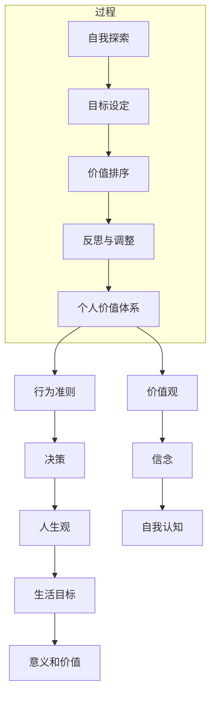

                 


### 设计《创建个人价值体系：形成独特的人生观》的目录大纲

#### 第一步：理解书名和目标读者
书名《创建个人价值体系：形成独特的人生观》揭示了本书的核心内容和目标，旨在引导读者建立一套个人的价值体系，以此为基础形成独到的人生观。目标读者可能包括寻求个人成长、渴望理解人生意义的职场人士、以及所有对自我提升有兴趣的人。

#### 第二步：确定核心章节内容
为了确保书中的核心章节能够全面、系统地阐述个人价值体系和人生观，我们需要涵盖以下主题：

1. **核心概念与联系**：介绍个人价值体系和人生观的基本概念及其相互关系。
2. **自我认知**：指导读者如何深入了解自己，包括价值观、兴趣、优点和不足。
3. **价值体系构建**：详细讲解构建个人价值体系的方法和步骤。
4. **人生观的形成**：探讨如何将个人价值体系转化为具体的人生观。
5. **实际应用**：通过案例研究和个人故事，展示如何将理论应用到实际生活中。
6. **持续成长**：讨论如何持续地更新和完善个人价值体系。

#### 第三步：设计目录大纲

根据上述核心内容，我们可以设计如下目录大纲：

```
# 创建个人价值体系：形成独特的人生观

## 第一部分：核心概念与联系

### 1.1 个人价值体系与人生观的定义
- 个人价值体系的概念
- 人生观的概念
- 两者之间的联系
- Mermaid 流程图展示个人价值体系与人生观的相互关系

### 1.2 个人价值体系的重要性
- 对个人成长的影响
- 对决策和行为的影响
- 对人际关系的影响

### 1.3 人生观的作用
- 对生活目标的影响
- 对幸福感和满意度的贡献
- 对个人成就的影响

## 第二部分：自我认知

### 2.1 了解自己
- 价值观的自我评估
- 兴趣与热情的探索
- 优点与不足的认识

### 2.2 自我反思
- 历史经历的回顾
- 个人经验的总结
- 内在需求的识别

### 2.3 个人特质分析
- 情绪智商
- 领导力
- 适应性

## 第三部分：价值体系构建

### 3.1 构建个人价值体系的原则
- 整体性
- 实用性
- 可持续性

### 3.2 价值体系的具体要素
- 生活原则
- 工作理念
- 人际交往准则

### 3.3 价值体系的构建过程
- 自我探索
- 目标设定
- 价值排序

## 第四部分：人生观的形成

### 4.1 从价值体系到人生观
- 价值体系与人生观的转换
- 形成独特人生观的路径

### 4.2 人生观的个性化
- 个人经历与人生观的关系
- 社会环境与人生观的影响
- 文化背景与人生观的塑造

### 4.3 实践与反思
- 人生观的验证
- 实践中的调整与优化
- 反思与成长

## 第五部分：实际应用

### 5.1 个人故事分享
- 价值体系与人生观的实际应用案例

### 5.2 成功案例分析
- 个人成就与价值体系的关系
- 人生观对事业的影响

### 5.3 生活策略
- 如何在日常生活中应用个人价值体系
- 如何通过价值体系实现个人目标

## 第六部分：持续成长

### 6.1 价值体系的动态调整
- 应对变化的环境
- 处理内在冲突
- 追求个人成长

### 6.2 实现价值体系与人生观的平衡
- 工作与生活的平衡
- 个人与社会的平衡
- 内心与外在的平衡

### 6.3 不断追求卓越
- 持续学习与成长
- 创新与突破
- 拥抱变化
```

#### 第四步：确保大纲完整性
确保每个章节都能详细展开，包含核心概念、算法原理、数学模型、实际案例和代码解读等要素。同时，确保总字数不超过2000字。

通过上述步骤，我们设计出了一个逻辑清晰、内容全面的《创建个人价值体系：形成独特的人生观》的目录大纲。现在，我们可以根据这个大纲来填充每个章节的具体内容。

### 背景介绍

在当今快速变化的世界中，个人价值体系和人生观对于每个人来说都至关重要。随着社会、文化和科技的不断发展，人们面临着前所未有的选择和挑战。在这个过程中，如何找到自己的定位、追求真正的幸福、实现个人价值成为了一个重要的议题。

个人价值体系是指个人在生活、工作和人际交往中所遵循的基本原则和准则。它决定了我们如何看待世界、如何做出决策、如何处理人际关系，以及如何实现个人目标。而人生观则是个人对于生活的整体认知和理解，包括对生活目标、意义和价值的看法。一个清晰且独特的个人价值体系有助于我们建立正确的人生观，从而在面对困难和挑战时保持坚定的信念和明确的方向。

然而，建立个人价值体系和形成独特的人生观并非易事。它需要我们深入自我认知，明确自己的价值观、兴趣、优点和不足；同时，还需要我们不断地学习、实践和反思，以适应不断变化的环境和挑战。这个过程既是自我探索的过程，也是个人成长的旅程。

本书旨在帮助读者理解个人价值体系和人生观的核心概念，并提供一套系统的构建方法和实际应用的案例。通过本书，读者将学会如何建立适合自己的价值体系，并将其转化为独特的人生观，从而实现个人价值和追求真正的幸福。

### 核心概念与联系

在探讨《创建个人价值体系：形成独特的人生观》这本书时，首先需要明确几个核心概念：个人价值体系、人生观，以及它们之间的紧密联系。

#### 个人价值体系的定义

个人价值体系是一个人在生活、工作和人际关系中遵循的一套基本原则和准则。这些原则和准则体现了个人对世界的看法、对道德和伦理的理解，以及对自己和他人的期望。它们不仅指导我们的行为和决策，还决定了我们如何看待成功、幸福和人生意义。

例如，一个重视家庭和亲情的个人可能会将“家庭和睦”作为其价值体系中的核心原则，而在工作中，他们可能会强调“团队合作”和“忠诚奉献”。这些价值原则共同构成了个人独特的价值体系。

#### 人生观的定义

人生观是个人对生活的整体认知和理解。它包括对生活目标、意义、价值和道德的思考。人生观决定了我们如何看待自己和周围的世界，以及我们追求什么样的人生目标。

例如，一个人可能认为人生的意义在于实现社会价值，因此他们将致力于为社区和社会做出贡献；而另一个人可能更看重个人的内在成长和自我实现，因此他们会专注于个人的心灵修养和自我提升。

#### 个人价值体系与人生观之间的联系

个人价值体系与人生观之间的联系是密不可分的。一个清晰的个人价值体系有助于我们形成独特的人生观，而一个正确的人生观又可以进一步强化我们的价值体系。

首先，个人价值体系为我们提供了一个行为的指导框架。在这个框架中，我们的价值观和信念被明确化，从而帮助我们做出符合自我认知和期望的决策。这些决策反过来又会影响我们的人生观，使我们更加坚定和明确地追求自己的目标和意义。

其次，人生观反过来也会影响我们的价值体系。当我们对自己的生活有更深刻的理解和认知时，我们可能会调整和优化自己的价值体系，使其更加符合我们对人生的看法。例如，一个原本重视物质财富的人可能在经历了一段艰难的时期后，开始更加重视家庭和情感的价值，从而调整自己的价值体系。

#### Mermaid 流程图展示个人价值体系与人生观的相互关系

为了更直观地展示个人价值体系与人生观之间的联系，我们可以使用Mermaid流程图进行描述：



在这个流程图中，个人价值体系（A）包括行为准则（B）、价值观（G）和信念（H），这些构成了个人自我认知（I）的基础。通过自我探索（J）、目标设定（K）、价值排序（L）和反思与调整（M），个人可以不断优化和更新自己的价值体系。这一过程最终转化为对人生观（D）的理解，进而影响生活目标（E）和意义（F）。

通过这个流程图，我们可以看到个人价值体系和人生观之间的相互作用是如何形成和发展的。一个有效的个人价值体系不仅帮助我们做出明智的决策，还帮助我们形成有意义和目标导向的人生观。

### 个人价值体系的重要性

个人价值体系在个人成长、决策行为和人际关系中扮演着至关重要的角色。一个清晰且坚定的个人价值体系不仅能够帮助我们在复杂多变的环境中保持方向感，还能够提升我们的整体幸福感。

#### 对个人成长的影响

个人价值体系是个人成长的基石。它为我们提供了一个内在的指导框架，使我们能够明确自己的目标和追求。当我们清楚自己的价值观和信念时，我们更有可能做出符合自己价值观的决策，从而实现自我提升和成长。

例如，一个注重诚信和正直的人会在工作中始终秉持诚信原则，即使在面对巨大压力或诱惑时也不会违背自己的价值观。这种坚持不仅使他们在职业道路上获得成就，还提升了他们的自尊和自信。

#### 对决策和行为的影响

个人价值体系直接影响我们的决策和行为。一个明确的价值体系使我们能够在面对选择时迅速做出决策，而不必在犹豫和冲突中耗费过多精力。

例如，在面临职业发展选择时，一个以家庭为重的个人可能会优先考虑离家近的工作机会，即使这个职位可能不如其他机会有吸引力。这样的决策虽然可能短期内牺牲一些物质利益，但长期来看，与家庭的价值相符，有助于实现个人整体幸福感。

#### 对人际关系的影响

个人价值体系也是人际交往中的重要因素。一个具有清晰价值体系的人更容易与他人建立深层次的信任和共鸣，因为他们能够在互动中展示出真诚和一致性。

例如，一个重视合作和团队精神的个人会在团队中主动承担责任，积极协助他人，这种行为不仅能够提升团队的整体表现，还能够增强团队成员之间的凝聚力。

总之，个人价值体系不仅影响我们的个人成长，还影响我们的决策行为和人际关系。一个坚定的价值体系能够帮助我们明确目标、做出明智决策，并在人际交往中建立真诚和信任，从而实现全面而持久的发展。

### 人生观的作用

人生观在个人成长、幸福感和个人成就方面扮演着至关重要的角色。一个积极、健康的人生观不仅能够帮助我们设定和实现生活目标，还能提升我们的幸福感，并推动我们在事业和个人生活中取得成功。

#### 对生活目标的影响

人生观直接影响我们的生活目标设定。一个明确的人生观使我们能够清楚地认识到自己追求的意义和价值，从而设定具体且具有挑战性的目标。例如，一个将个人成长视为生活核心目标的人，可能会设定不断学习新技能、拓展视野等目标，这有助于他们在职业生涯中不断进步。

此外，人生观还帮助我们评估和调整目标。当我们面临困境或挑战时，一个积极的人生观使我们能够从更宽广的视角看待问题，从而找到克服困难的动力和策略。

#### 对幸福感和满意度的贡献

幸福感和满意度是人生追求的重要方面，而人生观在其中发挥着关键作用。一个积极的人生观有助于我们建立乐观、自信的心态，从而在面对生活中的起伏时保持平静和积极。

例如，一个认为“人生总有起有落，关键在于如何应对”的人，在面对挫折时可能会更加冷静，并迅速调整自己的心态和策略，以应对挑战。这种积极的心态不仅有助于提升幸福感，还能增强我们的适应能力和心理韧性。

此外，人生观还影响我们对幸福的感知。一个将幸福视为内在过程而非外在结果的人，更可能通过积极的态度和行动来创造幸福，而不是仅仅依赖外部物质或成就。

#### 对个人成就的影响

个人成就不仅仅是职业成功，还包括个人成长、人际关系和自我实现等多个方面。一个明确且积极的人生观能够激励我们在各个领域追求卓越，从而实现更高的个人成就。

例如，一个将自我实现视为生活目标的人，可能会在工作、学习和其他活动中不断挑战自我，追求更高的成就。这种追求不仅能够提升他们在专业领域的表现，还能增强他们的自信心和满足感。

此外，人生观还影响我们对待成就的态度。一个认为成就只是人生过程中的一部分，而非最终目标的人，可能会更加谦虚和感恩，从而在取得成就后保持积极的心态，继续追求更高的目标。

总之，人生观在个人成长、幸福感和个人成就方面具有深远的影响。一个积极、健康的人生观能够帮助我们设定和实现生活目标，提升幸福感和满意度，并在个人和职业生活中取得成功。

### 自我认知的重要性

自我认知在个人成长和价值体系构建过程中起着至关重要的作用。了解自己的价值观、兴趣、优点和不足，不仅有助于我们明确个人目标，还能为我们提供行动的指南，使我们在面对选择和挑战时更加自信和坚定。

#### 价值观的自我评估

价值观是我们判断事物的重要依据，它决定了我们在生活中如何行动和选择。进行自我评估的第一步是识别自己的核心价值观。可以通过反思以下几个问题来深入了解自己的价值观：

1. **在生活中，什么对我最重要？**
2. **我愿意为这些价值观付出什么？**
3. **我的行为是否与我的价值观一致？**

例如，通过这些问题，一个人可能识别出自己重视家庭、诚信和自我成长。这种自我评估有助于我们更好地理解自己的内心需求，从而在日常生活中做出符合自己价值观的决策。

#### 兴趣与热情的探索

了解自己的兴趣和热情是构建个人价值体系的重要步骤。兴趣和热情不仅能够为我们提供动力和满足感，还能帮助我们找到人生的目标和方向。

可以通过以下方式探索自己的兴趣和热情：

1. **回忆过去哪些活动让我感到兴奋和满足？**
2. **我经常思考或谈论哪些话题？**
3. **有哪些活动让我觉得时间过得特别快？**

例如，一个人可能发现自己在艺术创作方面充满热情，这可以作为他们职业选择或个人发展的一个重要方向。

#### 优点与不足的认识

识别自己的优点和不足是自我认知的关键环节。了解自己的优点有助于我们发挥优势，进一步提升个人价值；而认识到自己的不足则能激励我们进行改进和成长。

可以通过以下方法来识别自己的优点和不足：

1. **他人的反馈：倾听朋友、家人或同事对你的看法，了解他们在哪些方面认为你表现突出或需要改进。**
2. **自我反思：回顾过去的行为和经历，思考自己在哪些方面做得好，哪些方面需要改进。**
3. **专业评估：通过职业测评或心理测试等工具，了解自己的个性特征和能力倾向。**

例如，通过自我评估，一个人可能认识到自己在沟通和组织能力方面表现优秀，但在时间管理上存在挑战。这种认识可以帮助他们更好地规划时间和任务，发挥优势，同时改进不足。

总之，自我认知是构建个人价值体系的基础。通过深入理解自己的价值观、兴趣和优点与不足，我们能够更明确地设定个人目标，制定有效的行动计划，从而在个人成长和价值实现的道路上不断前进。

### 自我反思的方法

自我反思是深入理解自我、优化个人价值体系的重要步骤。通过回顾历史经历、总结个人经验和识别内在需求，我们可以更好地了解自己的成长轨迹，明确未来的发展方向。

#### 历史经历的回顾

回顾历史经历是自我反思的重要部分。通过反思过去的成功和失败，我们可以从中学习宝贵的经验教训，为未来的决策提供指导。

1. **成功的经验**：思考在过去的经历中，哪些事件或行为带来了成功？这些成功背后的原因是什么？例如，如果一个人在团队项目中取得了成功，他们可能需要反思自己在沟通、协调和团队合作方面的表现。

2. **失败的经历**：同样重要的是反思那些失败的经历。通过分析失败的原因，我们可以识别出需要改进的领域。例如，如果一个人在某个关键决策上犯了错误，他们可能需要反思自己的判断力、信息收集能力或决策过程中的失误。

#### 个人经验的总结

总结个人经验可以帮助我们识别自己在特定情境下的行为模式，并评估这些行为对个人成长的影响。

1. **个人成长**：思考在过去的学习和工作中，哪些经验对你的成长有重要影响？例如，通过参加培训课程或实习项目，你学到了哪些新技能或知识，这些技能如何帮助你在职业道路上取得进步？

2. **人际关系**：回顾与他人的互动，思考哪些行为促进了良好的人际关系，哪些行为导致了冲突或误解？例如，通过有效的沟通和团队合作，你如何建立了与同事或朋友的良好关系？

#### 内在需求的识别

识别内在需求有助于我们理解自己追求的目标和价值观，从而在个人价值体系构建中保持一致性。

1. **情感需求**：思考在情感层面，你希望从生活中获得什么？例如，一个人可能渴望获得归属感、安全感或成就感。

2. **职业需求**：思考在职业层面，你希望实现什么样的成就或目标？例如，一个人可能希望在职业生涯中达到某个职位或实现特定的专业目标。

通过这些自我反思的方法，我们不仅能够更深入地了解自己，还能在个人价值体系的构建过程中，确保自己的行动和目标与内在需求保持一致。这种一致性不仅有助于我们在面对挑战时保持坚定，还能提升我们的整体幸福感和满足感。

### 个人特质分析

在构建个人价值体系的过程中，了解自己的个人特质是至关重要的一步。个人特质包括情绪智商、领导力和适应性，这些特质不仅影响我们的行为模式，还决定了我们如何应对生活中的各种挑战。

#### 情绪智商

情绪智商（Emotional Intelligence，简称EQ）是指识别、理解和管理自己和他人的情绪能力。它包括以下四个主要方面：

1. **自我意识**：了解自己的情绪状态，识别触发情绪的事件，并理解情绪对行为和决策的影响。
2. **自我调节**：控制情绪反应，保持冷静和专注，尤其是在压力或困难情境中。
3. **社交意识**：理解他人的情绪和需求，建立有效的人际关系。
4. **关系管理**：建立和维护良好的人际关系，解决冲突，促进团队合作。

情绪智商对于个人成长和价值体系构建至关重要。一个高情绪智商的人能够更好地理解自己的内在需求和动机，从而在日常生活中做出更加明智和符合价值观的决策。例如，一个高情绪智商的人会在面对失败时，迅速调整自己的心态，从挫折中学习并成长，而不是陷入消极情绪中。

#### 领导力

领导力是指能够激励和引导他人共同实现目标的能力。领导力包括以下几个关键要素：

1. **愿景**：清晰明确的目标和愿景，能够鼓舞和激励团队成员。
2. **沟通**：有效的沟通技巧，包括倾听、表达和反馈。
3. **激励**：激发团队成员的积极性和潜力，帮助他们实现个人和团队目标。
4. **决策**：在复杂和不确定的情境中做出明智和及时的决策。

领导力对于构建个人价值体系尤为重要。一个具有领导力的人能够在团队中树立榜样，推动团队成员共同遵循价值体系。例如，一个具有领导力的人会在团队中倡导诚信和正直，从而在整个团队中形成积极的价值观氛围。

#### 适应性

适应性是指应对变化和挑战的能力。在一个快速变化的世界中，适应性成为了个人成长和价值体系构建的关键因素。适应性包括以下几个方面：

1. **灵活思考**：能够从不同角度看待问题，灵活应对变化。
2. **持续学习**：愿意不断学习新知识和技能，以适应新的环境和挑战。
3. **开放心态**：接受新观念和不同的观点，适应多元文化背景。
4. **恢复力**：面对挫折和失败时，能够迅速恢复并继续前进。

适应性对于个人价值体系构建具有重要意义。一个高度适应性的人能够在不断变化的环境中保持灵活和积极，从而不断优化和调整自己的价值体系，以应对新的挑战和机遇。

总之，情绪智商、领导力和适应性是构建个人价值体系的重要个人特质。通过提高这些特质，我们能够更好地理解自己，与他人建立更深层次的关系，并在不断变化的环境中保持成长和发展的动力。

### 构建个人价值体系的原则

构建个人价值体系是一个系统性的过程，需要遵循一系列原则来确保其整体性、实用性和可持续性。这些原则不仅为我们的价值体系提供了坚实的基础，还确保了它在实际生活中的有效应用。

#### 整体性

整体性是指个人价值体系中的各个部分需要相互协调和统一。这意味着我们在构建价值体系时，不能仅关注某一方面，而需要从全局出发，确保每个要素之间相互支持、相互补充。

1. **综合思考**：在构建价值体系时，需要综合考虑个人生活、工作和人际交往等多个方面。例如，一个注重家庭的人可能会在工作与家庭之间寻找平衡，以确保价值体系中的各个部分都能得到满足。
   
2. **平衡原则**：整体性还要求我们在价值体系中的各个要素之间保持平衡。例如，一个价值体系中同时包含了对工作成就的追求和对家庭和谐的重视，这样在面临职业和家庭之间的选择时，就能做出更加全面和理性的决策。

#### 实用性

实用性是指个人价值体系需要具有实际操作性和可执行性。一个无法在实际生活中应用的抽象价值体系，虽然理论上美好，但无法真正指导我们的行为和决策。

1. **具体化**：将抽象的价值观具体化，使其具有可操作性。例如，将“诚信”具体化为在商业活动中始终坚持真实和透明。
   
2. **行动导向**：将价值体系转化为具体的行为准则和行动步骤。例如，一个重视个人成长的人可能会设定每天阅读和学习的时间，以确保这一价值观在实际生活中得以体现。

#### 可持续性

可持续性是指个人价值体系需要具备长期的稳定性和适应性，能够在不同的环境和情境中持续发挥作用。

1. **适应性**：价值体系需要能够适应环境和情境的变化。例如，当面临职业或个人生活中的重大变化时，价值体系应该能够灵活调整，以适应新的需求。
   
2. **反思与更新**：定期反思和更新价值体系，确保其与个人成长和环境变化保持一致。例如，每年或每五年对价值体系进行一次全面审查和更新，以确保其仍然符合个人的目标和价值观。

#### 持续性原则的具体应用

- **定期回顾**：设定固定的时期（如每年或每季度）对个人价值体系进行回顾，评估其是否仍然符合个人当前的需求和目标。
- **环境适应**：在面临外部环境变化时，及时调整价值体系，确保其能够适应新的情况。
- **持续学习**：通过学习和实践，不断优化和提升自己的价值体系，使其更具实用性和适应性。

通过遵循整体性、实用性和可持续性的原则，我们能够构建一个稳定且灵活的个人价值体系，从而在个人成长和生活中发挥持续而深远的影响。

### 价值体系的具体要素

个人价值体系的具体要素是构建完整价值体系的关键，它们涵盖了生活原则、工作理念和人际交往准则等核心内容。以下是对这些具体要素的详细讲解和例子。

#### 生活原则

生活原则是指导我们日常行为和决策的基本准则，它们帮助我们建立正确的生活态度和价值观。以下是一些常见的生活原则及其应用：

1. **诚实与正直**：诚实是建立信任的基础。在日常生活中，坚持诚实与正直，不仅能够赢得他人的尊重，还能提升自我价值感。

   - **例子**：在工作中，即使面对困境，也选择诚实地面对问题，并寻求解决方案，而不是隐瞒或欺骗。

2. **尊重与包容**：尊重他人是人际交往的基本原则，包容则使我们能够接纳不同的观点和文化，建立和谐的社会关系。

   - **例子**：在与团队成员合作时，尊重每个人的意见和贡献，即使意见不同，也能以包容的态度进行沟通和协商。

3. **持续学习与成长**：生活是一个不断学习和成长的过程，保持好奇心和求知欲，有助于我们不断进步。

   - **例子**：定期参加培训课程或阅读书籍，以扩展知识面和提升技能。

#### 工作理念

工作理念是我们在职业生涯中遵循的价值观和行为准则，它们指导我们如何对待工作、与同事合作，以及实现职业目标。以下是一些常见的工作理念及其应用：

1. **团队合作**：团队合作是实现共同目标的关键，它要求我们放下个人利益，注重团队的整体发展。

   - **例子**：在团队项目中，主动承担职责，与同事协作，共同完成任务。

2. **创新与突破**：创新和突破能够推动个人和组织的进步，它是我们在工作中应持续追求的目标。

   - **例子**：在工作中尝试新的方法和技术，以提升工作效率和质量。

3. **客户至上**：以客户为中心是许多成功企业的核心理念，它要求我们始终关注客户需求，提供优质服务。

   - **例子**：在销售工作中，深入了解客户需求，提供个性化的解决方案，以赢得客户的信任和满意度。

#### 人际交往准则

人际交往准则是我们在与他人互动时应遵循的准则，它们帮助我们建立良好的人际关系，提升社交技能。以下是一些常见的人际交往准则及其应用：

1. **诚信与透明**：在人际交往中，诚信与透明是建立长期信任关系的基石。

   - **例子**：在与朋友或合作伙伴交流时，诚实地分享信息和观点，避免隐瞒或误导。

2. **尊重与理解**：尊重和理解他人是有效沟通和和谐关系的基础。

   - **例子**：在团队讨论中，认真倾听他人的意见，并尝试从对方的角度理解问题。

3. **互助与合作**：互助与合作能够增强团队凝聚力，促进共同进步。

   - **例子**：在社区活动中，主动帮助他人，与他人共同完成任务，以提升整体的协作能力。

通过明确生活原则、工作理念和人

