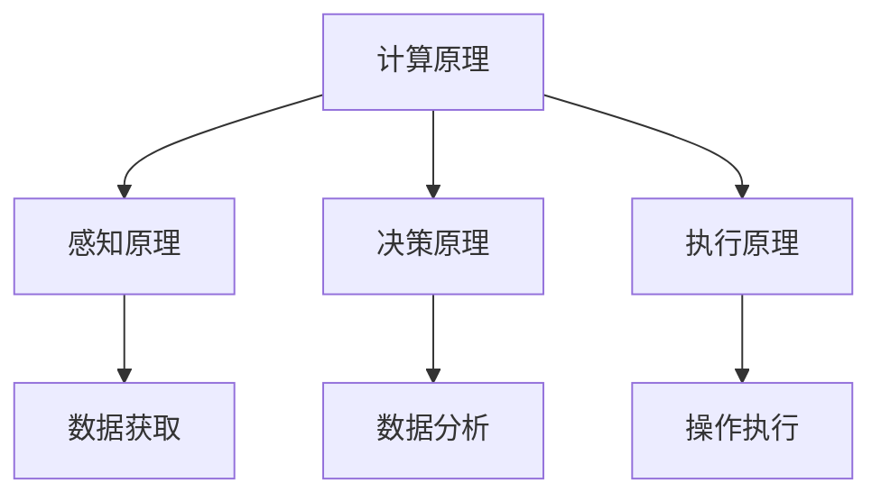
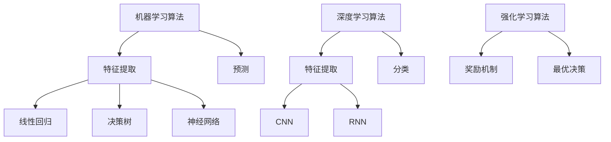

                 

### 文章标题

《打造个性化智能系统：从原理到实践的全方位指南》

> 关键词：智能系统、个性化、原理、实践、架构设计

> 摘要：
本篇文章将带领读者深入了解智能系统的构建过程，从基本原理出发，到具体实践方法，全方位解析如何打造一个具有个性化特点的智能系统。文章首先介绍了智能系统的基础概念和分类，然后详细阐述了智能系统的核心算法原理，通过Mermaid流程图展示了关键概念之间的关系。接着，文章深入探讨了智能系统的数学模型及其应用，并使用伪代码详细阐述了核心算法的实现步骤。此外，文章还提供了一个项目实战案例，展示了从开发环境搭建到代码实现、案例分析的全过程。最后，文章总结了最佳实践技巧，并为读者提供了进一步的拓展阅读资源。本文旨在为希望深入了解智能系统构建的读者提供系统性、全面性的指导。

---

### 第1章 引言

#### 1.1 智能系统的背景与定义

在当今科技迅猛发展的时代，智能系统已经成为许多领域的核心驱动力。从智能家居到自动驾驶，从智能医疗到金融科技，智能系统正深刻地影响着我们的日常生活。那么，什么是智能系统？

**定义**：智能系统是一种集成了计算、感知、决策和执行能力的综合性系统，它能够通过自主学习、自我优化和自适应调整，以模拟甚至超越人类智能的方式进行运作。

智能系统的核心在于其智能性，这种智能性主要来源于以下几个方面：

- **计算能力**：强大的计算能力是智能系统的基础，它决定了系统能够处理数据的能力和速度。
- **感知能力**：智能系统需要具备从环境中获取信息的感知能力，包括视觉、听觉、触觉等多种感知方式。
- **决策能力**：通过分析感知到的信息，智能系统能够做出合理的决策，指导其行为。
- **执行能力**：智能系统能够根据决策执行具体的操作，从而实现其目标。

#### 1.2 智能系统的分类

智能系统可以根据其功能、应用场景和实现方式等多种维度进行分类。以下是几种常见的智能系统分类：

- **按功能分类**：
  - **感知智能系统**：主要侧重于感知和识别环境信息，如人脸识别、语音识别系统。
  - **决策智能系统**：侧重于分析信息并做出决策，如自动驾驶系统、智能推荐系统。
  - **执行智能系统**：侧重于执行特定任务，如智能家居控制系统、工业机器人。

- **按应用场景分类**：
  - **消费类智能系统**：面向个人用户，如智能手机、智能家居。
  - **工业类智能系统**：面向工业生产，如智能制造、工业自动化。
  - **服务类智能系统**：面向提供服务，如智能客服、智能医疗诊断。

- **按实现方式分类**：
  - **基于规则的智能系统**：通过预设规则进行决策和执行。
  - **基于模型的智能系统**：通过训练模型进行决策和执行。
  - **混合智能系统**：结合不同类型的智能系统，以实现更高效、更灵活的智能能力。

#### 1.3 智能系统的重要性

智能系统的出现不仅带来了技术的革新，更深刻地改变了我们的生活方式。以下是智能系统的重要性：

- **提高效率**：智能系统能够自动处理大量数据和任务，大大提高了工作效率。
- **降低成本**：通过自动化和智能化，许多传统手工操作得以简化，降低了成本。
- **提升安全性**：智能系统能够进行实时监测和预警，提高了安全性和可靠性。
- **个性化服务**：智能系统能够根据用户行为和偏好提供个性化服务，提升了用户体验。
- **创新驱动**：智能系统的发展推动了新业务模式、新应用场景的产生，促进了社会的创新发展。

#### 1.4 本文的结构与目标

本文的结构如下：

- **第1章 引言**：介绍智能系统的背景与定义，分类和重要性。
- **第2章 基本原理与核心算法**：详细阐述智能系统的基本原理和核心算法，使用Mermaid流程图展示关键概念之间的关系。
- **第3章 数学模型与应用**：探讨智能系统的数学模型，使用伪代码详细阐述核心算法的实现步骤。
- **第4章 项目实战**：提供一个智能系统项目实战案例，从开发环境搭建到代码实现，详细讲解和分析。
- **第5章 最佳实践与注意事项**：总结最佳实践技巧，并提供注意事项和拓展阅读资源。

本文的目标是：

- **帮助读者全面理解智能系统的构建原理和方法**。
- **提供实用的指导，使读者能够将智能系统应用于实际项目**。
- **激发读者对智能系统领域的兴趣，推动其在各领域的深入研究和应用**。

---

### 第2章 基本原理与核心算法

#### 2.1 智能系统的基本原理

智能系统的基本原理主要涉及计算、感知、决策和执行四个方面。下面将分别介绍这些原理，并使用Mermaid流程图展示它们之间的关系。

**计算原理**：智能系统依赖于强大的计算能力，这包括数据处理、算法优化、实时计算等多个方面。计算原理的核心是实现高效的数据处理和计算能力。

**感知原理**：智能系统需要通过感知来获取环境信息。感知原理包括传感器技术、图像识别、语音识别等多个方面。通过感知，智能系统能够理解并响应外部环境。

**决策原理**：决策原理是指智能系统通过分析感知到的信息，做出合理决策。这涉及数据分析、机器学习、决策理论等多个领域。决策原理的核心是准确性和实时性。

**执行原理**：执行原理是指智能系统根据决策结果执行具体的操作。执行原理涉及执行控制、机器人技术、自动化技术等多个方面。执行原理的核心是执行效率和可靠性。

下面是智能系统基本原理的Mermaid流程图：



#### 2.2 核心算法原理

智能系统的核心算法原理是其智能性的体现。以下是几个常见的核心算法原理：

- **机器学习算法**：机器学习算法是智能系统的重要工具，它使系统能够从数据中学习并做出预测。常见的机器学习算法包括线性回归、决策树、神经网络等。

- **深度学习算法**：深度学习算法是机器学习的一个分支，它通过多层神经网络实现复杂的特征提取和分类。常见的深度学习算法包括卷积神经网络（CNN）、循环神经网络（RNN）等。

- **强化学习算法**：强化学习算法通过奖励机制来训练智能系统，使其能够在复杂环境中做出最优决策。常见的强化学习算法包括Q学习、SARSA等。

下面是核心算法原理的Mermaid流程图：



#### 2.3 伪代码与算法实现

下面以线性回归算法为例，使用伪代码详细阐述其实现步骤：

```plaintext
算法名称：线性回归
输入：数据集（X, Y）
输出：模型参数（w, b）

1. 初始化模型参数 w 和 b 为零
2. 遍历数据集中的每一个样本（x, y）
   2.1 计算预测值 y' = w*x + b
   2.2 计算误差 e = y - y'
   2.3 更新 w = w + learning_rate * x * e
   2.4 更新 b = b + learning_rate * e
3. 返回最终的模型参数 w 和 b
```

#### 2.4 数学模型与应用

智能系统的数学模型是理解和实现智能算法的基础。以下是一个简单的线性回归模型的数学公式：

$$
Y = X\cdot w + b + \epsilon
$$

其中，$Y$ 是实际输出，$X$ 是输入特征，$w$ 和 $b$ 是模型参数，$\epsilon$ 是误差项。

**参数优化**：
为了优化模型参数，我们可以使用梯度下降法。其数学公式如下：

$$
w_{\text{new}} = w_{\text{old}} - \alpha \frac{\partial L}{\partial w}
$$

其中，$\alpha$ 是学习率，$L$ 是损失函数。

**举例说明**：
假设我们有一个简单的一元线性回归问题，目标是预测房价。给定训练数据集：

$$
\begin{array}{ccc}
X & Y \\
1 & 100 \\
2 & 120 \\
3 & 130 \\
\end{array}
$$

我们可以使用线性回归模型来预测新的房价。通过训练，我们得到的模型参数为 $w=10$ 和 $b=50$。那么，对于新的输入 $X=2.5$，我们可以预测房价为：

$$
Y = 2.5 \cdot 10 + 50 = 100
$$

这表明，当输入为2.5时，预测的房价为100。

---

### 第3章 数学模型与应用

#### 3.1 智能系统的数学模型基础

智能系统的数学模型是其理论基础，它为算法的实现提供了数学依据。以下是几个常见的数学模型及其应用：

- **线性模型**：线性模型是最简单的智能系统数学模型，它描述了输入和输出之间的线性关系。线性模型通常用于回归问题和分类问题。

- **逻辑回归模型**：逻辑回归是一种广义的线性模型，它用于处理二分类问题。逻辑回归通过将线性组合通过一个逻辑函数（通常为 sigmoid 函数）进行转换，从而实现概率估计。

- **神经网络模型**：神经网络模型是一种复杂的非线性模型，它通过多层神经网络进行特征提取和分类。神经网络模型通常用于复杂的数据分析和预测问题。

- **决策树模型**：决策树模型是一种基于规则的方法，它通过一系列的判断条件来划分数据并做出预测。决策树模型通常用于分类和回归问题。

- **支持向量机模型**：支持向量机是一种强大的分类方法，它通过寻找最优的超平面来分割数据。支持向量机模型通常用于高维数据的分类问题。

#### 3.2 数学模型的应用

智能系统的数学模型在数据处理、特征提取和预测等方面有着广泛的应用。以下是几个具体的例子：

- **图像识别**：在图像识别任务中，常用的数学模型包括卷积神经网络（CNN）和深度学习模型。CNN 通过多层卷积和池化操作提取图像特征，从而实现图像分类和识别。

- **语音识别**：在语音识别任务中，常用的数学模型包括循环神经网络（RNN）和长短期记忆网络（LSTM）。RNN 和 LSTM 通过处理序列数据，实现对语音信号的识别和转换。

- **推荐系统**：在推荐系统任务中，常用的数学模型包括协同过滤和矩阵分解。协同过滤通过用户和物品的评分数据生成推荐列表，而矩阵分解通过矩阵分解模型提取用户和物品的特征，从而实现精准推荐。

- **自动驾驶**：在自动驾驶任务中，常用的数学模型包括决策树、支持向量机和深度学习模型。这些模型通过分析道路数据和车辆状态，实现对自动驾驶决策的优化和预测。

#### 3.3 伪代码与算法实现

下面以逻辑回归模型为例，使用伪代码详细阐述其实现步骤：

```plaintext
算法名称：逻辑回归
输入：数据集（X, Y）
输出：模型参数（w, b）

1. 初始化模型参数 w 和 b 为零
2. 遍历数据集中的每一个样本（x, y）
   2.1 计算预测值 y' = sigmoid(w*x + b)
   2.2 计算损失函数 L = -[y\*log(y') + (1-y)\*log(1-y')]
   2.3 计算梯度 ∇L = [x\*(y' - y)]
3. 更新模型参数 w = w - learning_rate * ∇w
       b = b - learning_rate * ∇b
4. 返回最终的模型参数 w 和 b
```

#### 3.4 数学公式与详细讲解

逻辑回归模型的核心是逻辑函数（sigmoid 函数），其数学公式如下：

$$
\sigma(z) = \frac{1}{1 + e^{-z}}
$$

其中，$z = w\*x + b$ 是线性组合，$w$ 是模型参数，$x$ 是输入特征，$b$ 是偏置项。

逻辑回归的损失函数是交叉熵损失函数，其数学公式如下：

$$
L = -\frac{1}{m}\sum_{i=1}^{m}[y\*log(y') + (1-y)\*log(1-y')]
$$

其中，$y$ 是实际标签，$y'$ 是预测标签，$m$ 是数据集的大小。

为了优化模型参数，我们需要计算梯度，其数学公式如下：

$$
\frac{\partial L}{\partial w} = \frac{1}{m}\sum_{i=1}^{m}[x\*(y' - y)]
$$

$$
\frac{\partial L}{\partial b} = \frac{1}{m}\sum_{i=1}^{m}[(y' - y)]
$$

通过梯度下降法，我们可以更新模型参数，其伪代码如下：

```plaintext
算法名称：梯度下降法
输入：模型参数（w, b），学习率 α
输出：优化后的模型参数（w', b')

1. 初始化模型参数 w 和 b
2. 设置学习率 α
3. 遍历数据集
   3.1 计算预测值 y'
   3.2 计算损失函数 L
   3.3 计算梯度 ∇w 和 ∇b
4. 更新模型参数 w = w - α * ∇w
       b = b - α * ∇b
5. 返回优化后的模型参数 w' 和 b'
```

#### 3.5 实际案例与应用

逻辑回归模型在实际应用中非常广泛，以下是一个简单的实际案例：

**案例**：预测客户是否会购买某产品。

**数据集**：

$$
\begin{array}{ccc}
年龄 & 收入 & 购买 \\
1 & 30 & 是 \\
2 & 40 & 否 \\
3 & 50 & 是 \\
\end{array}
$$

**模型参数**：$w = [0.5, 0.3]$，$b = 0.2$

**预测**：

对于年龄为35岁，收入为50000的客户，预测结果为：

$$
y' = \sigma(0.5*35 + 0.3*50000 + 0.2) = 0.9
$$

这意味着该客户有90%的概率购买该产品。

---

### 第4章 项目实战

#### 4.1 项目背景与目标

在本章中，我们将通过一个实际项目来展示如何构建一个简单的智能系统。该项目的目标是使用逻辑回归模型预测客户是否购买某产品。项目的主要步骤包括数据收集、数据处理、模型构建、模型训练和结果评估。

#### 4.2 开发环境搭建

为了构建智能系统，我们需要安装以下开发环境和工具：

- Python（3.8及以上版本）
- Jupyter Notebook（用于数据处理和模型训练）
- Scikit-learn（用于机器学习库）

以下是开发环境的搭建步骤：

1. 安装Python：从Python官方网站下载安装包并安装。
2. 安装Jupyter Notebook：通过pip命令安装Jupyter Notebook。
   ```bash
   pip install notebook
   ```
3. 安装Scikit-learn：通过pip命令安装Scikit-learn。
   ```bash
   pip install scikit-learn
   ```

#### 4.3 数据收集与预处理

项目的数据集是一个简单的表格，包含年龄、收入和购买行为。以下是数据收集与预处理步骤：

1. **数据收集**：从外部来源获取数据，如CSV文件。
2. **数据导入**：使用Python的pandas库导入数据。
   ```python
   import pandas as pd
   data = pd.read_csv('data.csv')
   ```
3. **数据清洗**：处理缺失值、异常值和重复值。
   ```python
   data.dropna(inplace=True)
   data.drop_duplicates(inplace=True)
   ```
4. **数据转换**：将类别型数据转换为数值型数据，如使用独热编码。
   ```python
   data = pd.get_dummies(data)
   ```

#### 4.4 模型构建

在本项目中，我们将使用逻辑回归模型进行预测。以下是模型构建的步骤：

1. **数据划分**：将数据集划分为训练集和测试集。
   ```python
   from sklearn.model_selection import train_test_split
   X = data.drop('购买', axis=1)
   y = data['购买']
   X_train, X_test, y_train, y_test = train_test_split(X, y, test_size=0.2, random_state=42)
   ```
2. **模型初始化**：使用Scikit-learn库初始化逻辑回归模型。
   ```python
   from sklearn.linear_model import LogisticRegression
   model = LogisticRegression()
   ```
3. **模型训练**：使用训练集训练模型。
   ```python
   model.fit(X_train, y_train)
   ```

#### 4.5 模型评估

在本项目中，我们将使用准确率、召回率和F1值等指标评估模型的性能。以下是模型评估的步骤：

1. **模型预测**：使用测试集对模型进行预测。
   ```python
   y_pred = model.predict(X_test)
   ```
2. **评估指标**：计算准确率、召回率和F1值。
   ```python
   from sklearn.metrics import accuracy_score, recall_score, f1_score
   accuracy = accuracy_score(y_test, y_pred)
   recall = recall_score(y_test, y_pred)
   f1 = f1_score(y_test, y_pred)
   ```
3. **结果输出**：输出评估结果。
   ```python
   print(f"准确率：{accuracy:.2f}")
   print(f"召回率：{recall:.2f}")
   print(f"F1值：{f1:.2f}")
   ```

#### 4.6 案例分析与总结

在本项目中，我们成功构建了一个简单的逻辑回归模型，用于预测客户是否购买产品。以下是对项目的分析：

- **数据预处理**：数据预处理是构建智能系统的重要步骤，它确保了数据的质量和一致性。
- **模型选择**：逻辑回归模型是一种简单且有效的分类模型，适用于二分类问题。
- **模型评估**：评估指标的选择和计算是评估模型性能的关键，它帮助我们了解模型的优缺点。
- **项目优化**：在实际应用中，可以通过调整模型参数、增加特征或使用更复杂的模型来优化项目性能。

通过这个项目，我们不仅掌握了智能系统的构建过程，还了解了实际应用中的关键技术和注意事项。这为我们在未来构建更复杂、更智能的系统奠定了基础。

---

### 第5章 最佳实践与注意事项

#### 5.1 最佳实践技巧

在构建智能系统的过程中，以下是一些最佳实践技巧，可以帮助我们提高项目效率和效果：

1. **数据预处理**：确保数据的质量和一致性，进行缺失值填充、异常值处理和特征工程。
2. **模型选择**：根据问题的具体需求选择合适的模型，如线性模型、决策树、神经网络等。
3. **模型优化**：通过调整模型参数、增加训练数据或使用更复杂的模型来提高模型性能。
4. **交叉验证**：使用交叉验证方法评估模型性能，避免过拟合和欠拟合。
5. **性能监控**：定期监控模型性能，及时发现和解决潜在问题。
6. **代码注释**：编写清晰的代码注释，有助于团队成员理解和维护代码。

#### 5.2 小结

本篇文章从智能系统的基本原理、核心算法、数学模型到实际项目实战，全面解析了智能系统的构建过程。通过本文的学习，读者可以：

- **理解智能系统的基本原理和分类**。
- **掌握智能系统的核心算法原理和实现方法**。
- **了解智能系统的数学模型和应用**。
- **具备构建简单智能系统的能力**。

#### 5.3 注意事项

在构建智能系统时，需要注意以下几点：

- **数据质量**：数据是智能系统的核心，确保数据的质量和一致性至关重要。
- **模型选择**：根据问题的具体需求选择合适的模型，避免盲目跟风使用复杂的模型。
- **模型优化**：模型优化是一个迭代过程，需要不断调整和优化模型参数。
- **计算资源**：智能系统构建过程中可能需要大量的计算资源，合理规划和使用计算资源非常重要。
- **安全性和隐私**：在处理敏感数据时，需要确保系统的安全性和用户隐私。

#### 5.4 拓展阅读

为了进一步深入了解智能系统构建，以下是几本推荐的拓展阅读书籍：

1. 《机器学习实战》—— Kevin Cernekee
2. 《深度学习》—— Ian Goodfellow、Yoshua Bengio 和 Aaron Courville
3. 《Python机器学习》—— Sebastian Raschka 和 Vahid Mirjalili
4. 《智能系统设计与实现》—— 詹姆斯·F·艾伦

通过这些书籍的深入学习，读者可以进一步提升自己在智能系统构建方面的专业知识和技能。

