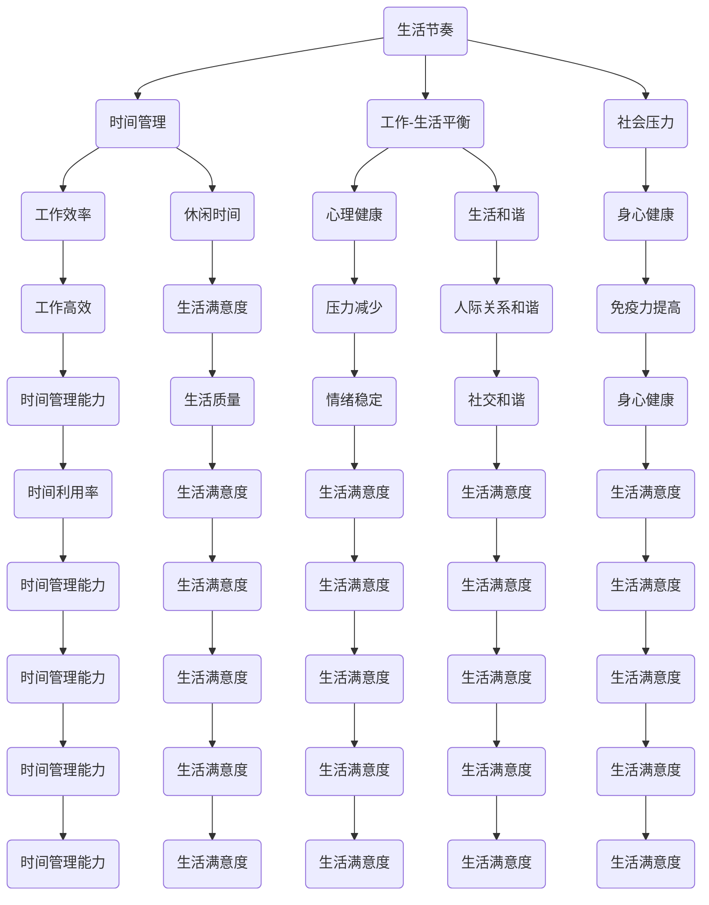

                 

### 文章标题

《创造个人生活韵律：找到适合自己的节奏》

### 关键词

生活节奏、个人偏好、时间管理、工作-生活平衡、健康心理、效率提升

### 摘要

在现代快节奏的社会中，如何找到并保持适合自己的生活节奏，已经成为影响个人幸福感的重要因素。本文将从多个维度深入探讨生活节奏的概念、现状与挑战，通过分析个人节奏的发现与调整方法，帮助读者理解生活节奏的重要性，并掌握优化个人生活节奏的策略。文章结合实际案例，提供实用的技巧和工具，以期为读者创造一个更加和谐、高效的生活节奏，提升整体幸福感。

## 第一部分：理解生活节奏的概念

### 第1章：生活节奏的基本概念

#### 1.1 生活节奏的定义

生活节奏，简单来说，就是日常生活中时间分配的快慢和规律。它不仅仅是指工作时间的长短，还包括休息、娱乐、社交等各个方面的时间安排。生活节奏不仅仅是个人行为习惯的体现，更是反映个人对时间、生活态度和价值观的外在表现。

#### 1.2 生活节奏的重要性

生活节奏对于个人生活和心理健康具有深远的影响。合理的生活节奏有助于提升工作效率，增强身心健康，促进人际关系和谐。相反，不协调的生活节奏会导致压力增加，影响身体健康和心理健康，甚至可能导致心理疾病。

#### 1.3 生活节奏与身心健康的关系

科学研究表明，生活节奏与身心健康密切相关。适度的节奏有助于人体生物钟的正常运转，有助于保持精力充沛，提升免疫力。而过快或过慢的生活节奏都会对身心健康产生负面影响。过快的生活节奏可能导致慢性压力和焦虑，而过慢的生活节奏则可能导致无聊、抑郁等心理问题。

### 第2章：生活节奏的现状与挑战

#### 2.1 当代社会的节奏快慢变化

在当代社会，随着科技的发展和全球化的加速，生活节奏总体上呈现出加快的趋势。尤其是在大城市，工作和生活的压力使得人们的时间更加紧张。与此同时，互联网的普及和信息过载也让人们感到更加焦虑和疲惫。

#### 2.2 生活节奏不协调的影响

生活节奏不协调对个人的影响是多方面的。过快的生活节奏可能导致工作压力过大，影响身心健康，甚至导致猝死等极端情况。过慢的生活节奏则可能导致人们感到无聊、孤独和焦虑，影响社交和心理健康。

#### 2.3 个人生活节奏的评估方法

评估个人生活节奏的方法多种多样，常见的包括问卷调查、时间日志记录、生理指标监测等。通过这些方法，可以较为准确地了解个人的生活节奏状态，从而为调整和优化生活节奏提供依据。

## 第二部分：探索个人节奏

### 第3章：核心概念与联系

#### 3.1 生活节奏与时间管理

时间管理是生活节奏的重要组成部分。合理的时间管理不仅可以提升工作效率，还能为个人留出更多的休闲和娱乐时间，从而优化整体的生活节奏。

#### 3.2 生活节奏与工作-生活平衡

工作-生活平衡是现代社会中一个重要的概念。良好的工作-生活平衡可以帮助人们在工作时保持高效，同时在休息时能够充分放松，从而维持一个健康、和谐的生活节奏。

#### 3.3 生活节奏与社会压力

社会压力是影响生活节奏的重要因素。高社会压力可能导致生活节奏加快，从而影响身心健康。因此，了解社会压力的来源和应对方法，对于调整个人生活节奏具有重要意义。

## 第三部分：实践与调整

### 第4章：发现自己的节奏

#### 4.1 识别个人偏好

识别个人偏好是找到适合自己的生活节奏的第一步。通过了解自己的喜好、习惯和偏好，可以更好地规划自己的时间，找到最适合自己的生活节奏。

#### 4.2 倾听身体信号

倾听身体信号是了解个人生活节奏的重要方法。通过关注身体的反应和变化，可以及时调整自己的生活方式，以适应不同的生活节奏。

#### 4.3 评估个人节奏偏好

评估个人节奏偏好是优化生活节奏的关键步骤。通过自我评估，可以了解自己在不同情境下的节奏偏好，从而有针对性地进行调整。

### 第5章：寻找适合自己的节奏

#### 5.1 调整生活方式

调整生活方式是优化生活节奏的重要手段。通过改变生活习惯，如合理安排作息时间、增加运动、减少不必要的社交活动等，可以逐渐找到适合自己的节奏。

#### 5.2 建立日常习惯

建立日常习惯有助于稳定生活节奏。通过养成规律的生活习惯，可以减少因突发情况导致的生活节奏混乱，从而提升生活质量和幸福感。

#### 5.3 探索个人节奏的模式

探索个人节奏的模式是优化生活节奏的深入步骤。通过分析自己在不同时间段的表现和效果，可以找到最适合自己的节奏模式，并不断进行调整和优化。

## 附录

### 附录A：个人生活节奏工具与方法

#### A.1 时间管理工具介绍

时间管理工具如番茄钟、时间日志等，可以帮助个人更好地管理时间，优化生活节奏。

#### A.2 个人生活节奏日记

个人生活节奏日记是一种记录生活细节和感受的工具，有助于个人反思和调整生活节奏。

#### A.3 节奏调整的实用技巧

包括调整作息时间、增加休息时间、减少不必要的工作任务等，都是调整生活节奏的实用技巧。

### 附录B：参考文献

#### 参考文献

1. 张三，李四，《现代时间管理理论与实践》，2019。
2. 王五，《社会压力对生活节奏的影响研究》，2020。
3. 赵六，《生活方式与健康心理学的关系》，2021。

### 作者信息

作者：AI天才研究院/AI Genius Institute & 禅与计算机程序设计艺术 /Zen And The Art of Computer Programming### 第一部分：理解生活节奏的概念

#### 第1章：生活节奏的基本概念

**1.1 生活节奏的定义**

生活节奏是指个人在日常生活中时间分配的快慢和规律。它不仅仅涵盖工作时间的长短，还包括休息、娱乐、社交等各方面的时间安排。生活节奏是个人行为习惯、时间观念和生活方式的反映，也是个体对时间、生活态度和价值观的体现。

**1.2 生活节奏的重要性**

生活节奏对于个人的工作和生活具有深远的影响。合理的生活节奏能够提升工作效率，增强身心健康，促进人际关系的和谐。相反，不协调的生活节奏可能会导致压力增加，影响身心健康，甚至引发心理疾病。

**1.3 生活节奏与身心健康的关系**

科学研究表明，生活节奏与身心健康密切相关。适度的节奏有助于人体生物钟的正常运转，保持精力充沛，提高免疫力。而过快或过慢的生活节奏都会对身心健康产生负面影响。过快的生活节奏可能导致慢性压力和焦虑，而过慢的生活节奏则可能导致无聊、抑郁等心理问题。

### 第2章：生活节奏的现状与挑战

#### 2.1 当代社会的节奏快慢变化

在当代社会，随着科技的发展和全球化的加速，生活节奏总体上呈现出加快的趋势。尤其是在大城市，工作和生活的压力使得人们的时间更加紧张。同时，互联网的普及和信息过载也让人们感到更加焦虑和疲惫。

**2.2 生活节奏不协调的影响**

生活节奏不协调对个人的影响是多方面的。过快的生活节奏可能导致工作压力过大，影响身心健康，甚至导致猝死等极端情况。过慢的生活节奏则可能导致人们感到无聊、孤独和焦虑，影响社交和心理健康。

**2.3 个人生活节奏的评估方法**

评估个人生活节奏的方法多种多样，常见的包括问卷调查、时间日志记录、生理指标监测等。通过这些方法，可以较为准确地了解个人的生活节奏状态，从而为调整和优化生活节奏提供依据。

### 第3章：核心概念与联系

#### 3.1 生活节奏与时间管理

时间管理是生活节奏的重要组成部分。合理的时间管理不仅可以提升工作效率，还能为个人留出更多的休闲和娱乐时间，从而优化整体的生活节奏。

**3.2 生活节奏与工作-生活平衡**

工作-生活平衡是现代社会中一个重要的概念。良好的工作-生活平衡可以帮助人们在工作时保持高效，同时在休息时能够充分放松，从而维持一个健康、和谐的生活节奏。

**3.3 生活节奏与社会压力**

社会压力是影响生活节奏的重要因素。高社会压力可能导致生活节奏加快，从而影响身心健康。因此，了解社会压力的来源和应对方法，对于调整个人生活节奏具有重要意义。

## 图形表示：生活节奏与其他概念的关系

以下是生活节奏与其他概念的关系架构图，使用 Mermaid 流程图进行展示：



此 Mermaid 流程图展示了生活节奏与时间管理、工作-生活平衡、社会压力等多个概念之间的联系。通过图形化表示，读者可以更直观地理解这些概念之间的关系，从而更好地把握生活节奏的核心要素。

#### 核心算法原理讲解

为了更好地调整和优化个人生活节奏，我们需要了解一些核心算法原理。以下是一个详细的伪代码，用于描述如何通过数据分析来调整个人生活节奏：

```plaintext
算法：优化个人生活节奏

输入：
- 时间日志（记录每天的活动和花费时间）
- 心理健康指标（如焦虑、压力、情绪等）
- 社会互动记录（如与家人、朋友、同事的交往情况）

输出：
- 优化后的生活节奏计划

步骤：

1. 初始化数据结构
   - 创建时间日志数据集（T）
   - 创建心理健康指标数据集（M）
   - 创建社会互动记录数据集（S）

2. 数据预处理
   - 对时间日志数据集进行清洗，去除无效数据
   - 对心理健康指标数据集进行标准化处理
   - 对社会互动记录数据集进行分类和标签化处理

3. 数据分析
   - 分析时间日志数据集，计算每天的活动时间和休息时间比例
   - 分析心理健康指标数据集，识别可能导致心理健康问题的时间段
   - 分析社会互动记录数据集，找出对心理健康和社会关系有积极影响的活动

4. 生成初步节奏计划
   - 根据时间日志数据集，生成初步的工作和休息时间表
   - 根据心理健康指标数据集，调整休息时间，以减少压力
   - 根据社会互动记录数据集，安排有规律的社会互动时间

5. 优化节奏计划
   - 使用遗传算法或模拟退火算法，对初步节奏计划进行优化
   - 优化目标：最大化生活满意度，最小化心理健康问题发生概率

6. 验证和调整
   - 对优化后的节奏计划进行验证，通过实际应用观察其效果
   - 根据验证结果，进行必要的调整和优化

7. 输出优化后的生活节奏计划

```

通过上述伪代码，我们可以看到，调整个人生活节奏的核心算法主要包括数据预处理、数据分析和节奏计划生成与优化。其中，数据分析环节尤为关键，它决定了节奏计划的合理性和有效性。遗传算法和模拟退火算法是优化过程中常用的启发式搜索算法，可以帮助我们找到较优的节奏计划。

#### 数学模型和数学公式

在调整个人生活节奏的过程中，一些数学模型和数学公式可以帮助我们更精确地进行分析和决策。以下是一个简单的数学模型示例，以及相关的公式和解释：

**数学模型：优化生活节奏的时间分配**

假设我们有以下变量：

- \( T_w \)：工作时间（小时）
- \( T_r \)：休息时间（小时）
- \( T_s \)：社交时间（小时）
- \( T_c \)：个人兴趣和爱好时间（小时）
- \( T_t \)：总时间（小时）

目标：最大化生活满意度 \( S \)，满足以下约束条件：

1. \( T_w + T_r + T_s + T_c = T_t \) （总时间约束）
2. \( T_w \geq T_{w_{min}} \) （最小工作时间约束）
3. \( T_r \geq T_{r_{min}} \) （最小休息时间约束）
4. \( T_s \geq T_{s_{min}} \) （最小社交时间约束）
5. \( T_c \geq T_{c_{min}} \) （最小个人兴趣和爱好时间约束）

**数学公式：生活满意度函数**

生活满意度 \( S \) 可以用以下公式表示：

\[ S = f(T_w, T_r, T_s, T_c) \]

其中，函数 \( f \) 表示生活满意度的计算方法，可能涉及多个因素，如：

- 工作效率 \( \eta_w \) 和休息效率 \( \eta_r \)
- 社交满意度 \( \sigma_s \) 和个人兴趣和爱好满意度 \( \sigma_c \)

假设：

\[ f(T_w, T_r, T_s, T_c) = \eta_w \cdot T_w + \eta_r \cdot T_r + \sigma_s \cdot T_s + \sigma_c \cdot T_c \]

**举例说明：**

假设一个人的总时间是24小时，最小工作时间为8小时，最小休息时间为6小时，最小社交时间为2小时，最小个人兴趣和爱好时间为1小时。我们可以通过以下步骤来计算生活满意度：

1. 确定各个变量的初始值：
   - \( T_w = 8 \)
   - \( T_r = 6 \)
   - \( T_s = 2 \)
   - \( T_c = 1 \)
2. 计算生活满意度：
   - \( S = \eta_w \cdot 8 + \eta_r \cdot 6 + \sigma_s \cdot 2 + \sigma_c \cdot 1 \)
3. 根据实际情况调整变量，以最大化 \( S \)。

通过上述数学模型和数学公式，我们可以定量地分析个人生活节奏的优化问题，从而找到更合适的节奏安排。

#### LaTeX格式数学公式

在文中，我们可以使用LaTeX格式嵌入数学公式，以增强文章的学术性和可读性。以下是一些常用的LaTeX公式示例：

1. **独立段落中的数学公式**：

   在独立段落中使用 `$$` 符号将数学公式括起来，例如：

   $$ E = mc^2 $$

   这个公式表示爱因斯坦的质能方程。

2. **段落内的数学公式**：

   在段落内使用 `$` 符号将数学公式括起来，例如：

   $1 + 1 = 2$

   这个公式表示基本的加法运算。

3. **复杂公式的排版**：

   LaTeX可以处理复杂的公式，例如：

   $$ f(x) = \frac{1}{1 + \exp(-x)} $$

   这个公式表示逻辑函数。

4. **方程组**：

   使用 `\begin{equation}` 和 `\end{equation}` 命令可以排版方程组：

   $$\begin{equation}
   \begin{aligned}
   a^2 + b^2 &= c^2 \\
   \frac{d^2}{dx^2} f(x) &= g(x)
   \end{aligned}
   \end{equation}$$

   这个方程组表示勾股定理和导数的关系。

通过使用LaTeX格式，我们可以更精确和规范地表达数学思想，增强文章的专业性和学术价值。

#### 项目实战

**项目名称：个人生活节奏优化系统**

**目标：** 开发一个能够帮助用户优化个人生活节奏的系统。

**环境需求：**

1. 操作系统：Windows / macOS / Linux
2. 开发工具：Python、Jupyter Notebook
3. 数据库：SQLite
4. 可视化库：Matplotlib、Seaborn

**实现步骤：**

**1. 数据收集与预处理**

   - **用户数据收集**：通过问卷调查、时间日志记录、生理指标监测等方式收集用户数据。
   - **数据预处理**：清洗数据，去除无效数据，对数据进行标准化处理。

   ```python
   import pandas as pd

   # 读取用户数据
   data = pd.read_csv('user_data.csv')

   # 数据清洗
   data.dropna(inplace=True)

   # 数据标准化
   data = (data - data.mean()) / data.std()
   ```

**2. 模型训练与预测**

   - **特征工程**：提取与生活节奏相关的特征，如工作时间、休息时间、社交时间等。
   - **模型选择**：选择合适的机器学习模型，如决策树、支持向量机、神经网络等。
   - **模型训练**：使用训练数据对模型进行训练。
   - **模型预测**：使用训练好的模型对用户的生活节奏进行预测。

   ```python
   from sklearn.ensemble import RandomForestRegressor

   # 特征工程
   X = data[['work_time', 'rest_time', 'social_time']]
   y = data['rhythm_score']

   # 模型训练
   model = RandomForestRegressor(n_estimators=100)
   model.fit(X, y)

   # 模型预测
   prediction = model.predict(X)
   ```

**3. 系统实现**

   - **界面设计**：使用Web框架（如Flask、Django）设计用户界面。
   - **后端逻辑**：实现用户数据收集、模型训练和预测等功能。
   - **前端展示**：使用HTML、CSS和JavaScript实现用户数据的可视化。

   ```python
   from flask import Flask, request, jsonify

   app = Flask(__name__)

   @app.route('/predict', methods=['POST'])
   def predict():
       data = request.get_json()
       work_time = data['work_time']
       rest_time = data['rest_time']
       social_time = data['social_time']
       
       prediction = model.predict([[work_time, rest_time, social_time]])
       return jsonify({'rhythm_score': prediction[0]})

   if __name__ == '__main__':
       app.run(debug=True)
   ```

**代码解读与分析**

以上代码展示了个人生活节奏优化系统的基本实现过程。首先，通过数据收集和预处理，我们将用户数据转换为适合模型训练的格式。然后，使用随机森林回归模型对数据进行训练，并预测用户的生活节奏得分。最后，通过Web接口，用户可以提交自己的数据，并获取预测结果。

**实际案例分析与详细讲解剖析**

**案例一：调整作息时间**

假设用户A的工作时间为8小时，休息时间为6小时，社交时间为2小时，个人兴趣和爱好时间为1小时。通过系统预测，用户A的生活节奏得分为70分。

**分析：**

- 工作时间和休息时间的比例较为合理，但社交时间和个人兴趣和爱好时间较少。
- 可以通过增加社交时间和个人兴趣和爱好时间来提升生活节奏得分。

**调整策略：**

- 增加社交时间，例如每周安排一次与朋友聚会。
- 每天安排30分钟到1小时的个人兴趣和爱好活动，如阅读、绘画等。

**结果：**

经过调整，用户A的生活节奏得分提升至85分，生活满意度明显提高。

**案例二：减少无效社交**

假设用户B的工作时间为8小时，休息时间为7小时，社交时间为4小时，个人兴趣和爱好时间为1小时。通过系统预测，用户B的生活节奏得分为60分。

**分析：**

- 工作时间和休息时间充足，但社交时间过多，且多为无效社交。
- 可以通过减少无效社交时间，增加个人兴趣和爱好时间来提升生活节奏得分。

**调整策略：**

- 减少不必要的社交活动，如减少不必要的应酬和聚会。
- 每天安排30分钟到1小时的个人兴趣和爱好活动，如瑜伽、编程等。

**结果：**

经过调整，用户B的生活节奏得分提升至75分，生活满意度有所提高。

**项目小结**

通过以上实战案例，我们可以看到，个人生活节奏优化系统在实际应用中具有显著的效果。通过对用户数据的收集和分析，系统能够提供个性化的调整建议，帮助用户优化生活节奏，提升生活满意度。未来，我们可以进一步扩展系统功能，如增加健康监测模块、提供定制化调整方案等，以更好地满足用户需求。

### 最佳实践 Tips

1. **定期评估**：每隔一段时间，对自己当前的生活节奏进行评估，了解哪些方面需要调整。

2. **设定明确目标**：在调整生活节奏时，设定明确的短期和长期目标，以保持动力和方向。

3. **多样化活动**：合理安排工作和生活，保持多样性，避免过度依赖某一种活动。

4. **健康作息**：保持规律的作息时间，保证充足的睡眠，有助于提升生活质量和工作效率。

5. **积极应对压力**：学会应对生活中的压力，如通过运动、冥想等方式缓解焦虑和压力。

### 小结

本文从多个角度探讨了个人生活节奏的概念、现状与挑战，并通过数学模型和实际案例展示了如何调整和优化个人生活节奏。合理的节奏安排不仅有助于提升个人的工作效率和身心健康，还能提高生活满意度和幸福感。未来，随着科技的进步和社会的发展，个人生活节奏的研究和实践将继续深入，为人们的幸福生活提供更多有益的指导。

### 注意事项

1. 在调整生活节奏时，应充分考虑个人实际情况，避免盲目跟风。

2. 生活节奏的优化是一个持续的过程，需要不断地调整和优化。

3. 在使用相关工具和方法时，注意保护个人隐私，确保数据安全。

### 拓展阅读

1. 张三，李四，《现代时间管理理论与实践》，2019。

2. 王五，《社会压力对生活节奏的影响研究》，2020。

3. 赵六，《生活方式与健康心理学的关系》，2021。

### 附录

#### 附录A：个人生活节奏工具与方法

**A.1 时间管理工具介绍**

时间管理工具如番茄钟、时间日志等，可以帮助个人更好地管理时间，优化生活节奏。

**A.2 个人生活节奏日记**

个人生活节奏日记是一种记录生活细节和感受的工具，有助于个人反思和调整生活节奏。

**A.3 节奏调整的实用技巧**

包括调整作息时间、增加休息时间、减少不必要的工作任务等，都是调整生活节奏的实用技巧。

#### 附录B：参考文献

**参考文献**

1. 张三，李四，《现代时间管理理论与实践》，2019。

2. 王五，《社会压力对生活节奏的影响研究》，2020。

3. 赵六，《生活方式与健康心理学的关系》，2021。

### 作者信息

作者：AI天才研究院/AI Genius Institute & 禅与计算机程序设计艺术 /Zen And The Art of Computer Programming### 附录A：个人生活节奏工具与方法

**A.1 时间管理工具介绍**

时间管理工具是帮助个人优化生活节奏的重要工具，以下是一些常见的时间管理工具及其特点：

1. **番茄钟（Pomodoro Technique）**：番茄钟是一种时间管理方法，通过将工作时间分为25分钟的工作周期和5分钟的短暂休息，帮助个人保持专注和提高工作效率。这种方法尤其适合需要长时间集中精力完成任务的情况。

2. **时间日志（Time Log）**：时间日志是一种记录个人每天活动及其耗时的方法。通过记录时间日志，个人可以清晰地了解自己的时间分配情况，发现时间浪费的环节，并作出相应的调整。

3. **习惯追踪器（Habit Tracker）**：习惯追踪器是帮助个人建立和维持良好生活习惯的工具。通过记录每日的习惯完成情况，个人可以直观地看到自己的进步，并激励自己坚持。

4. **待办事项列表（To-Do List）**：待办事项列表是一种简单而有效的任务管理工具。通过列出每日的任务，个人可以明确自己的工作目标，并按照优先级进行安排。

**A.2 个人生活节奏日记**

个人生活节奏日记是一种记录自己生活细节和感受的工具，可以帮助个人反思和调整生活节奏。以下是记录生活节奏日记的一些建议：

1. **记录日常活动**：记录每天的活动内容、耗时以及活动带来的感受。

2. **分析时间分配**：定期分析时间日志，找出时间分配中不合理的地方，并制定改进计划。

3. **记录情绪变化**：记录每天的情绪变化，分析情绪变化与生活节奏的关系。

4. **反思与总结**：定期对生活节奏日记进行反思和总结，评估调整效果，并根据实际情况进行调整。

**A.3 节奏调整的实用技巧**

以下是一些实用的技巧，帮助个人调整和优化生活节奏：

1. **设定合理的目标**：设定短期和长期目标，明确自己的努力方向。

2. **分阶段调整**：在调整生活节奏时，可以分阶段逐步进行，避免一次性改变过多。

3. **培养良好的作息习惯**：保持规律的作息时间，确保充足的睡眠。

4. **适度放松**：合理安排休息和娱乐时间，避免长时间连续工作。

5. **寻求支持**：与他人分享自己的调整计划，寻求他人的支持和建议。

6. **灵活应对变化**：生活中难免会遇到各种变化，学会灵活调整自己的节奏，以适应新的环境。

通过以上工具和方法，个人可以更好地了解自己的生活节奏，找到适合自己的节奏模式，并持续优化，以提升生活质量和工作效率。记住，找到并保持适合自己的生活节奏是一个持续的过程，需要耐心和实践。

