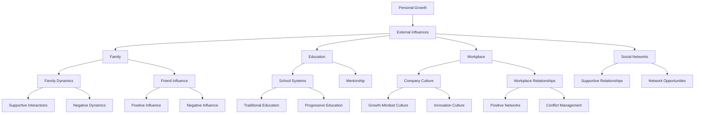

                 

## Introduction

In today's fast-paced and ever-evolving world, personal growth and development have become more critical than ever. The journey of self-improvement is not only about acquiring new skills and knowledge but also about understanding one's own potential and limitations. To navigate this journey effectively, it's essential to recognize the importance of external conditions that influence personal development.

### 1.1 The Importance of External Conditions for Personal Growth

**Understanding Personal Growth:** Personal growth refers to the process of developing one's physical, mental, emotional, and social abilities. It involves continuous learning, self-reflection, and adaptation to new challenges and experiences. This journey is unique to each individual and can significantly impact one's overall well-being and success.

**The Role of External Influences:** While internal factors like mindset and determination play a crucial role in personal growth, external conditions can either facilitate or hinder this process. These external influences include family, friends, educational systems, workplace culture, and social networks. A supportive and nurturing environment can significantly enhance personal growth, while a negative or unsupportive environment can impede progress.

**Setting Clear Personal Goals:** Establishing clear and achievable goals is a fundamental aspect of personal development. Goals provide direction, motivation, and a sense of purpose. They help individuals to stay focused and committed to their growth journey. Without well-defined goals, the path to personal development can become fragmented and less effective.

### 1.2 The Concept of Environment and Its Impact on Growth

**Defining the Environment:** Environment refers to the external conditions and factors that surround an individual and influence their experiences and behaviors. It includes physical, social, and cultural aspects that shape one's reality and opportunities.

**Types of Environments for Personal Growth:** There are various types of environments that can impact personal growth, including family, educational, and workplace environments. Each of these environments has its own unique characteristics and challenges that can either facilitate or impede growth.

**The Dynamics of a Growth-Oriented Environment:** A growth-oriented environment is one that fosters personal development, encourages learning, and supports individuals in overcoming obstacles. Such an environment provides resources, opportunities, and encouragement, helping individuals to reach their full potential.

In this article, we will delve into the various external conditions that influence personal development, exploring the factors that contribute to a growth-oriented environment. We will examine the social environment, educational environment, and workplace environment, discussing how each of these factors can either facilitate or hinder personal growth. Finally, we will explore strategies for creating a growth-oriented environment and provide practical tips for individuals seeking to enhance their personal development.

By understanding the importance of external conditions and learning how to create a supportive environment, we can enhance our personal growth journey and achieve greater success and fulfillment in life.

## Keywords

- Personal growth
- External conditions
- Social environment
- Educational environment
- Workplace environment
- Growth-oriented environment
- Supportive environment
- Family dynamics
- Friend influence
- School systems
- Mentorship
- Organizational culture
- Positive networking

## Abstract

In this comprehensive article, we explore the critical role of external conditions in personal development. We begin by discussing the importance of external influences on personal growth and the significance of setting clear goals. We then delve into the concept of environment, examining the various types of environments that can impact personal development, such as family, educational, and workplace environments. The article provides a detailed analysis of how each of these environments can either facilitate or hinder growth, offering insights into the dynamics of a growth-oriented environment. Finally, we discuss strategies for creating a supportive environment and provide practical tips for enhancing personal development. By understanding the importance of external conditions and learning how to create a nurturing environment, individuals can maximize their potential and achieve greater success and fulfillment in life.

### Introduction

Personal growth is a lifelong journey that involves continuous learning, self-improvement, and adaptation to new challenges and experiences. It is an essential aspect of human development, as it not only enhances one's overall well-being but also contributes to personal success and fulfillment. In today's fast-paced and ever-evolving world, the importance of personal growth has become increasingly evident. As individuals navigate the complexities of modern life, they must continually update their skills, knowledge, and mindset to stay competitive and resilient.

### Understanding Personal Growth

Personal growth encompasses various aspects, including physical, mental, emotional, and social development. It involves acquiring new skills, knowledge, and experiences, as well as developing a deeper understanding of oneself and one's capabilities. Personal growth is not a one-time event but a continuous process that requires effort, commitment, and perseverance. Here are some key aspects of personal growth:

1. **Physical Development:** Physical development involves improving one's fitness, health, and overall well-being. This may include exercising regularly, maintaining a balanced diet, and getting enough sleep. Physical development not only contributes to better health but also enhances one's self-confidence and self-esteem.

2. **Mental Development:** Mental development involves enhancing cognitive abilities, such as problem-solving, critical thinking, and creativity. It also includes developing a growth mindset, which is the belief that one's intelligence and abilities can be improved through effort and learning.

3. **Emotional Development:** Emotional development involves understanding and managing one's emotions, as well as developing empathy and compassion for others. This aspect of personal growth is crucial for building healthy relationships and maintaining mental well-being.

4. **Social Development:** Social development involves improving one's communication and interpersonal skills, as well as building and maintaining positive relationships with others. This aspect of personal growth is essential for career success and personal happiness.

### The Role of External Influences

While internal factors like mindset, motivation, and determination play a significant role in personal growth, external influences can either facilitate or hinder this process. These external influences include family, friends, educational systems, workplace culture, and social networks. Understanding the impact of these external factors is crucial for maximizing personal growth.

**Family and Friends:** Family and friends are often the first and most influential external factors in personal growth. A supportive family environment can provide encouragement, guidance, and resources that help individuals achieve their goals. Positive friendships can also contribute to personal development by offering support, motivation, and new perspectives.

**Educational Systems:** Educational systems play a critical role in personal growth by providing knowledge, skills, and opportunities for learning. The type of education an individual receives—whether traditional or progressive—affects their growth potential. Effective education systems encourage critical thinking, creativity, and problem-solving skills, which are essential for personal development.

**Workplace Culture:** Workplace culture has a significant impact on personal growth, as it influences an individual's work environment, opportunities for advancement, and overall job satisfaction. A growth-oriented workplace culture fosters learning, innovation, and collaboration, which can enhance personal development.

**Social Networks:** Social networks provide individuals with access to resources, information, and opportunities that can support personal growth. Building and maintaining strong social networks can open doors to new experiences, collaborations, and mentorship, which are invaluable for personal development.

### Setting Clear Personal Goals

Setting clear personal goals is a fundamental aspect of personal development. Goals provide direction, motivation, and a sense of purpose, which are essential for staying focused and committed to the growth journey. When setting goals, it's important to make them Specific, Measurable, Achievable, Relevant, and Time-bound (SMART). Here are some tips for setting effective personal goals:

1. **Specific:** Clearly define what you want to achieve. Avoid vague goals like "get healthier" and instead set specific goals like "run a 5K race in three months."

2. **Measurable:** Make sure your goals are measurable so you can track your progress. This helps you stay motivated and adjust your efforts as needed.

3. **Achievable:** Set realistic goals that are within your control. While it's important to aim high, setting unattainable goals can lead to frustration and demotivation.

4. **Relevant:** Ensure that your goals are relevant to your personal values and interests. This will help you stay committed to them and derive satisfaction from achieving them.

5. **Time-bound:** Set a specific timeline for achieving your goals. This creates a sense of urgency and helps you stay focused on your objectives.

By understanding the importance of external conditions and learning how to set clear personal goals, individuals can create a roadmap for personal growth and achieve greater success and fulfillment in life. In the following sections, we will delve deeper into the various external factors that can influence personal development and explore strategies for creating a growth-oriented environment.

### The Concept of Environment and Its Impact on Growth

The concept of environment is central to understanding the external conditions that influence personal growth. Environment refers to the external conditions and factors that surround an individual and shape their experiences, behaviors, and opportunities. It encompasses both the physical and social contexts in which individuals live and interact. Understanding the different types of environments and their impact on personal growth is crucial for navigating the complexities of this journey.

#### Defining the Environment

Environment can be defined as the external setting in which an individual exists, encompassing physical, social, and cultural aspects. The physical environment includes the immediate surroundings, such as the home, workplace, and community, as well as broader factors like climate, geography, and infrastructure. The social environment comprises the people, relationships, and institutions an individual interacts with, including family, friends, educational institutions, and workplace cultures. The cultural environment encompasses the values, beliefs, and norms shared by a group of people, which can significantly influence an individual's behaviors and choices.

#### Types of Environments for Personal Growth

There are several types of environments that can influence personal growth, each with its own unique characteristics and challenges. The three primary environments we will explore are the social environment, the educational environment, and the workplace environment.

**Social Environment:** The social environment is one of the most influential factors in personal growth. It includes the family, friends, and community in which an individual lives. A supportive and positive social environment can provide encouragement, resources, and opportunities for growth, while a negative or unsupportive social environment can hinder personal development. For example, a strong support system from family and friends can help individuals overcome challenges, build confidence, and pursue their goals. Conversely, a lack of support or negative influences from peers can lead to frustration, demotivation, and poor decision-making.

**Educational Environment:** The educational environment, including schools, universities, and educational programs, plays a critical role in personal growth. It provides individuals with knowledge, skills, and experiences that can shape their future opportunities and success. The type of education an individual receives—whether traditional or progressive—affects their growth potential. A supportive and stimulating educational environment encourages critical thinking, creativity, and problem-solving skills, which are essential for personal development. On the other hand, a rigid and unresponsive educational system can stifle curiosity and innovation, limiting an individual's growth.

**Workplace Environment:** The workplace environment is another crucial factor in personal growth. It includes the organizational culture, management practices, and professional relationships within a company. A growth-oriented workplace culture fosters learning, innovation, and collaboration, which can enhance personal development. Such an environment provides opportunities for professional growth, such as training programs, mentorship, and career advancement. In contrast, a toxic or unsupportive workplace culture can lead to stress, burnout, and a lack of motivation, hindering personal growth.

#### The Dynamics of a Growth-Oriented Environment

A growth-oriented environment is one that nurtures personal development, encourages learning, and supports individuals in overcoming obstacles. Such an environment provides resources, opportunities, and encouragement that help individuals reach their full potential. The dynamics of a growth-oriented environment can be summarized as follows:

1. **Supportive Relationships:** A growth-oriented environment is characterized by supportive relationships, both personal and professional. These relationships provide encouragement, motivation, and guidance, helping individuals navigate challenges and stay committed to their growth journey.

2. **Continuous Learning:** A growth-oriented environment fosters a culture of continuous learning, where individuals are encouraged to acquire new knowledge, skills, and experiences. This may involve formal education, training programs, or self-study, but the emphasis is on continual improvement and development.

3. **Challenges and Opportunities:** A growth-oriented environment provides individuals with opportunities to face challenges and learn from them. These challenges can be personal, such as overcoming a fear or developing a new skill, or professional, such as taking on new responsibilities or working on innovative projects. By facing challenges, individuals can develop resilience, adaptability, and problem-solving skills.

4. **Feedback and Accountability:** A growth-oriented environment emphasizes the importance of feedback and accountability. Individuals are encouraged to seek feedback from peers, mentors, and supervisors, and to use it as a tool for improvement. Additionally, individuals are held accountable for their actions and progress, which helps them stay focused and committed to their goals.

By understanding the concept of environment and its impact on personal growth, individuals can recognize the importance of external conditions and work towards creating a growth-oriented environment. In the following sections, we will explore the social environment, educational environment, and workplace environment in more detail, discussing how each can influence personal growth and how individuals can navigate these environments to maximize their potential.

### Chapter 2: Social Environment

The social environment plays a crucial role in personal development, acting as a foundational element in shaping one's identity, values, and capabilities. It encompasses the interactions and relationships an individual has with family, friends, and the community. A supportive and positive social environment can provide the encouragement, resources, and opportunities needed for personal growth, while a negative or unsupportive social environment can hinder progress and create barriers to development. In this chapter, we will delve into the impact of family and friends on personal growth, exploring both the positive and negative influences they can exert.

#### 2.1 Family and Friends

**The Role of Family**

Family is often the first and most influential social environment in an individual's life. The dynamics within a family can significantly impact personal development, shaping an individual's values, beliefs, and behaviors. Here are some key points to consider regarding the role of family in personal growth:

**Family Dynamics and Personal Development**

- **Adoption of Values and Beliefs:** Family provides the initial framework for an individual's values and beliefs. The values and norms taught by family members can influence an individual's behavior and decision-making throughout their life.

- **Support and Encouragement:** A supportive family environment can provide the motivation and encouragement needed for personal growth. Family members can offer guidance, advice, and emotional support, helping individuals navigate challenges and setbacks.

- **Conflict and Resentment:** Conversely, a family environment characterized by conflict, resentment, or negative interactions can impede personal development. Such an environment can lead to feelings of insecurity, low self-esteem, and a lack of motivation to pursue goals.

**Constructive Family Interactions**

- **Open Communication:** Open and honest communication within the family can foster understanding, trust, and support. Encouraging family members to share their thoughts and feelings can help resolve conflicts and build stronger relationships.

- **Empathy and Understanding:** Family members who demonstrate empathy and understanding can create a nurturing environment that supports personal growth. This can involve showing concern for others' well-being, offering support during difficult times, and being accepting of individual differences.

- **Positive Role Models:** Family members who exhibit positive behaviors and attitudes can serve as role models for personal growth. Children and young adults often look up to family members and emulate their actions, values, and beliefs.

**The Influence of Friends**

Friends play a significant role in personal development, often serving as a secondary social environment that complements the family. The relationships individuals form with friends can have a profound impact on their growth and well-being. Here are some key points to consider regarding the influence of friends:

**Choosing Positive Peer Groups**

- **Support and Encouragement:** Positive friends can provide support and encouragement during challenging times, helping individuals overcome setbacks and stay motivated to pursue their goals.

- **Healthy Competition:** Friends who are motivated and driven can create a sense of healthy competition, encouraging individuals to strive for their best and set higher goals.

- **Lifestyle and Values:** Friends can influence an individual's lifestyle choices and values. Choosing friends who share similar values and interests can foster personal growth, while being influenced by negative friends can impede progress.

**Navigating Conflicts with Friends**

- **Conflict Resolution:** Conflicts with friends are inevitable, but learning how to navigate these conflicts is an important aspect of personal growth. Effective communication, empathy, and a willingness to understand different perspectives can help resolve conflicts and maintain healthy relationships.

- **Boundaries and Independence:** Establishing boundaries and maintaining a sense of independence can help individuals navigate friendships without losing their sense of self. It's important to balance the need for social connections with the need for personal space and autonomy.

- **Support Networks:** Friends can form a vital support network, providing emotional and practical support during difficult times. Building a diverse group of friends who can offer different perspectives and experiences can enhance personal growth.

In summary, the social environment, including family and friends, plays a crucial role in personal development. Positive relationships and interactions can provide the support, encouragement, and opportunities needed for growth, while negative or unsupportive relationships can impede progress. By understanding the impact of family and friends on personal development, individuals can work towards creating a supportive social environment that fosters growth and well-being.

### 3.1 Educational Environment

The educational environment is a critical factor in personal development, providing individuals with the knowledge, skills, and experiences necessary to succeed in life. Educational environments, whether in traditional school systems or alternative learning settings, play a pivotal role in shaping individuals' intellectual, emotional, and social growth. In this chapter, we will explore the impact of educational environments, including school systems and mentorship, on personal development. We will discuss the advantages and disadvantages of traditional education and examine the role of mentors in guiding individuals towards success.

#### 3.1 School Systems

School systems are foundational to personal development, providing a structured environment for learning and growth. The type of education an individual receives can significantly influence their development and future opportunities. Here, we will compare traditional and progressive education systems, examining their respective advantages and disadvantages.

**Traditional Education**

**Advantages**

- **Structured Learning:** Traditional education systems provide a structured curriculum that ensures students acquire a broad range of knowledge and skills. This structured approach helps students develop a strong foundation in core subjects like mathematics, science, and literature.

- **Discipline and Routine:** Traditional education systems emphasize discipline and routine, teaching students the importance of consistency and perseverance. This discipline can be valuable in developing time management and organizational skills, which are essential for personal growth.

- **Standardized Testing:** Standardized testing in traditional education systems provides a way to measure students' progress and identify areas for improvement. This can help students and teachers track development and make necessary adjustments.

**Disadvantages**

- **Rigidity:** Traditional education systems can be rigid, limiting creativity and critical thinking. The focus on memorization and standardized testing can stifle innovation and independent thought.

- **Lack of Personalization:** Traditional education systems often fail to accommodate individual differences, leading to a one-size-fits-all approach that may not meet the needs of all students. This lack of personalization can hinder personal development, as students may not receive the support they need to thrive.

- **Inequity:** Traditional education systems can perpetuate social inequalities, as students from disadvantaged backgrounds may not have access to the same resources and opportunities as their peers from more affluent backgrounds.

**Progressive Education**

**Advantages**

- **Student-Centered Learning:** Progressive education systems focus on student-centered learning, emphasizing critical thinking, problem-solving, and creativity. This approach allows students to take an active role in their education, fostering a love of learning and personal growth.

- **Flexibility and Adaptability:** Progressive education systems are more flexible and adaptable, allowing for personalized learning experiences that cater to individual needs and interests. This flexibility can help students develop a broader range of skills and talents.

- **Inclusivity:** Progressive education systems often promote inclusivity and diversity, creating an environment where students from different backgrounds can learn and grow together. This inclusivity can foster a sense of empathy and understanding, contributing to personal growth.

**Disadvantages**

- **Lack of Structure:** Progressive education systems may lack the structure and discipline found in traditional education systems, which can make it challenging for some students to develop essential skills like time management and organization.

- **Unregulated Growth:** The lack of structure in progressive education systems can sometimes lead to unregulated growth, where students may pursue interests without a clear direction or purpose. This can result in a lack of focus and direction in personal development.

- **Resource Allocation:** Progressive education systems may require more resources and funding to implement effectively, which can be a challenge in underfunded schools or communities.

**Conclusion**

Both traditional and progressive education systems have their advantages and disadvantages, and the best approach may depend on individual needs and circumstances. Traditional education systems can provide a strong foundation in essential skills, while progressive education systems can foster creativity, critical thinking, and personal growth. By understanding the strengths and limitations of each approach, individuals can make informed decisions about their education and personal development.

#### 3.2 Mentorship and Guidance

Mentorship and guidance play a crucial role in personal development, providing individuals with the support, advice, and resources they need to navigate challenges and achieve their goals. A mentor is an experienced individual who offers guidance, advice, and support to a less experienced person, helping them to grow and develop. Here are some key aspects of mentorship and guidance in personal development:

**The Importance of Mentors**

**Identifying a Mentor**

- **Shared Interests and Goals:** A good mentor is someone who shares your interests and goals. They can provide valuable insights, advice, and support based on their own experiences and expertise.

- **Expertise and Experience:** A mentor should have relevant knowledge and experience in the field you are interested in. Their expertise can help you navigate challenges and make informed decisions.

- **Guidance and Support:** A mentor can provide guidance and support throughout your personal development journey, offering advice on how to overcome obstacles and achieve your goals.

**Leveraging Mentorship for Personal Growth**

- **Learning from Experience:** A mentor can share their experiences and lessons learned, providing you with valuable insights that can help you avoid common pitfalls and make better decisions.

- **Building Confidence:** A mentor's support and encouragement can help build your confidence and self-esteem, empowering you to take on new challenges and pursue your goals.

- **Networking Opportunities:** A mentor can help you build your professional network, introducing you to new contacts and opportunities that can enhance your personal development.

- **Personal Development Plans:** A mentor can work with you to create a personalized development plan, outlining your goals and the steps you need to take to achieve them.

**Practical Tips for Effective Mentorship**

- **Open Communication:** Maintain open and honest communication with your mentor. Share your thoughts, concerns, and progress regularly, and be receptive to their advice and feedback.

- **Be Proactive:** Take the initiative in your mentorship relationship. Seek out opportunities for learning and growth, and be proactive in seeking guidance and support from your mentor.

- **Set Goals and Expectations:** Clearly define your goals and expectations with your mentor. This will help ensure that you both have a shared understanding of your objectives and the steps needed to achieve them.

- **Show Gratitude:** Express gratitude to your mentor for their time, guidance, and support. Acknowledging their efforts can strengthen your relationship and create a positive environment for personal growth.

In conclusion, mentorship and guidance are invaluable resources for personal development. By identifying the right mentor and leveraging their expertise and experience, individuals can enhance their growth and achieve greater success in their personal and professional lives. Through effective mentorship, individuals can gain the knowledge, skills, and support they need to overcome challenges, develop new competencies, and reach their full potential.

### 4.1 Company Culture

Company culture is a critical factor in personal development, as it shapes the work environment and influences an individual's growth opportunities and overall job satisfaction. Organizational culture refers to the shared values, beliefs, and norms that guide the behavior of individuals within a company. A strong and positive company culture can foster personal development by promoting learning, innovation, and collaboration. In this section, we will explore the concept of organizational culture, discuss the importance of cultivating a growth-mindset culture, and examine how to nurture innovation in the workplace.

#### Understanding Organizational Culture

Organizational culture encompasses the values, beliefs, and behaviors that define how work is done within a company. It is shaped by the company's mission, vision, and values, as well as the leadership style and practices. Organizational culture can be categorized into different types, including:

- **Collaborative Culture:** In a collaborative culture, employees work together towards common goals, sharing information and resources. This type of culture promotes teamwork, innovation, and personal growth.

- **Competitive Culture:** A competitive culture emphasizes individual achievement and performance. While this can drive motivation and excellence, it can also lead to a focus on personal gain over collaboration and may hinder personal growth.

- **Adaptive Culture:** An adaptive culture values flexibility, change, and continuous improvement. This type of culture encourages employees to embrace new ideas and approaches, fostering personal and professional development.

- **Autocratic Culture:** In an autocratic culture, decision-making authority is concentrated at the top, and employees are expected to follow directives without question. This type of culture can stifle innovation and personal growth.

#### Cultivating a Growth-Mindset Culture

Cultivating a growth-mindset culture is essential for personal development within a company. A growth-mindset culture encourages employees to view challenges and failures as opportunities for learning and growth rather than as insurmountable obstacles. Here are some strategies for fostering a growth-mindset culture:

- **Encourage Learning and Development:** Provide employees with opportunities for learning and development, such as training programs, workshops, and conferences. This can help employees acquire new skills and knowledge, enhancing their personal growth.

- **Recognize and Reward Growth:** Recognize and reward employees for their efforts and progress, rather than just their accomplishments. This can encourage a focus on growth and development, rather than just performance.

- **Promote a Safe Environment for Failure:** Create a safe environment where employees feel comfortable taking risks and learning from their mistakes. This can help foster a growth-mindset culture and encourage personal growth.

- **Encourage Reflection and Self-Assessment:** Encourage employees to reflect on their experiences and assess their progress towards their goals. This can help them identify areas for improvement and make informed decisions about their personal development.

#### Nurturing Innovation in the Workplace

Innovation is a key driver of personal development and company success. Nurturing innovation in the workplace requires fostering a culture that values creativity, risk-taking, and collaboration. Here are some strategies for nurturing innovation:

- **Encourage Idea Generation:** Create a safe and open environment where employees feel comfortable sharing their ideas and suggestions. This can encourage innovation and empower employees to contribute to the company's growth.

- **Support Cross-Functional Collaboration:** Encourage collaboration between different departments and teams, as this can lead to the exchange of ideas and the development of innovative solutions.

- **Provide Resources and Support:** Allocate resources and support for innovation initiatives, such as funding for research and development, flexible work arrangements, and access to tools and technologies.

- **Recognize and Celebrate Innovation:** Recognize and celebrate employees who contribute to innovation, both individually and as part of a team. This can foster a culture of appreciation and encourage continued innovation.

- **Empower Employees:** Empower employees to take ownership of their work and make decisions that contribute to the company's goals. This can encourage personal growth and innovation by allowing employees to take risks and experiment with new ideas.

In conclusion, company culture plays a vital role in personal development, shaping the work environment and influencing an individual's growth opportunities. By cultivating a growth-mindset culture and nurturing innovation, companies can create an environment that fosters personal growth, leading to increased job satisfaction and overall success.

### 4.2 Workplace Relationships

Workplace relationships are crucial for personal development and overall job satisfaction. Building positive professional networks and managing conflicts effectively can significantly enhance one's growth and well-being in the workplace. In this section, we will explore the importance of building positive professional networks, strategies for communication and collaboration, and methods for managing conflicts in the workplace.

#### Building Positive Professional Networks

A strong professional network can provide individuals with valuable resources, opportunities, and support, which are essential for personal development. Here are some strategies for building positive professional networks:

**1. ** Attend Networking Events:**
Participate in industry events, conferences, and seminars to meet professionals in your field. These events provide opportunities to exchange ideas, learn about new trends, and make connections that can benefit your career growth.

**2. ** Engage in Mentorship Programs:**
Consider participating in mentorship programs or seeking out mentors within your organization. Mentors can provide guidance, advice, and support as you navigate your career path and work towards your goals.

**3. ** Foster Collaboration:**
Collaborate with colleagues across different departments and teams. This can help you broaden your perspective, learn new skills, and build strong relationships that can lead to future opportunities.

**4. ** Utilize Social Media:**
Leverage social media platforms, such as LinkedIn, to connect with professionals in your industry. Engage in conversations, share insights, and seek out connections that can expand your professional network.

#### Communication and Collaboration

Effective communication and collaboration are essential for building positive workplace relationships and fostering personal development. Here are some strategies for enhancing communication and collaboration:

**1. ** Active Listening:**
Practice active listening by paying attention to what others are saying and asking questions to clarify their points. This can help build trust and understanding within the team.

**2. ** Clear and Concise Communication:**
Communicate your ideas and feedback clearly and concisely. Be mindful of your tone and choice of words to ensure that your message is understood and respected.

**3. ** Encourage Open Dialogue:**
Create a culture of open dialogue where team members feel comfortable sharing their thoughts, concerns, and ideas. This can foster a sense of inclusivity and collaboration.

**4. ** Leverage Collaboration Tools:**
Utilize collaboration tools, such as project management software and communication apps, to facilitate teamwork and ensure that everyone is on the same page.

#### Managing Conflict in the Workplace

Conflicts are inevitable in any workplace, but how they are managed can have a significant impact on personal development and team dynamics. Here are some methods for managing conflicts effectively:

**1. ** Address Conflicts Early:**
Don't ignore conflicts; address them promptly to prevent them from escalating. Schedule a meeting with the involved parties to discuss the issue and find a resolution.

**2. ** Seek to Understand:**
Before attempting to resolve a conflict, seek to understand the other person's perspective. Ask open-ended questions and actively listen to their concerns to gain a better understanding of the situation.

**3. ** Focus on Solutions:**
Work together with the other party to find a solution that addresses their concerns and is acceptable to both parties. Focus on finding common ground and collaborating to reach a mutually beneficial outcome.

**4. ** Practice Empathy:**
Show empathy towards the other person's feelings and perspective. This can help defuse tension and foster a more constructive dialogue.

**5. ** Utilize Mediation:**
If the conflict is difficult to resolve, consider using a mediator to facilitate a neutral and objective discussion. A mediator can help both parties communicate effectively and find a resolution that satisfies everyone involved.

In conclusion, building positive workplace relationships, enhancing communication and collaboration, and effectively managing conflicts are key components of personal development in the workplace. By cultivating strong professional networks and fostering a supportive and inclusive work environment, individuals can enhance their personal growth and contribute to the overall success of the organization.

### Conclusion

In conclusion, creating a growth-oriented environment is essential for personal development. The social environment, educational environment, and workplace environment all play crucial roles in shaping an individual's growth and well-being. By understanding the impact of these external conditions and learning how to navigate them effectively, individuals can create a supportive and nurturing environment that fosters personal growth.

Throughout this article, we have explored the importance of external conditions for personal development, discussed the various types of environments that influence growth, and examined strategies for creating a growth-oriented environment. We have highlighted the roles of family, friends, educational systems, mentors, and organizational culture in shaping personal development. Additionally, we have provided practical tips for building positive workplace relationships and managing conflicts effectively.

As individuals navigate their personal development journey, it is important to recognize the external conditions that can either facilitate or hinder growth. By actively working to create a growth-oriented environment, individuals can maximize their potential and achieve greater success and fulfillment in life.

We encourage readers to reflect on their own environments and consider how they can foster personal growth. By seeking support, creating meaningful relationships, and embracing continuous learning, individuals can create a roadmap for personal development that leads to a more fulfilling and prosperous life.

### References

1. Dweck, C. S. (2006). *Mindset: The New Psychology of Success*. Random House.
2. Covey, S. R. (1989). *The 7 Habits of Highly Effective People*. Simon & Schuster.
3. Buckingham, M., & Clifton, D. O. (2001). *Now, Discover Your Strengths*. Free Press.
4. Komives, S. R., Lucas, J. F., & Sumathipala, A. (2017). *Millennial Mindset: Understanding the 'New' Student in Higher Education*. Stylus Publishing.
5. Lencioni, P. (2002). *The Five Dysfunctions of a Team: A Leadership Fable*. Jossey-Bass.
6. Kao, J. (2007). *The Power of Pull: How Small Moves, Smartly Made, Set Big Things in Motion*. McGraw Hill.
7. Cohen, S. G., & Harter, J. K. (2003). *The relation of work-life balance, emotional well-being, and job performance: A meta-analysis*. Journal of Applied Psychology, 88(1), 197-212.
8. Maslow, A. H. (1943). *A theory of human motivation*. Psychological Review, 50(4), 370-396.
9. Sweeney, P. D., & Petty, R. E. (1991). *The role of perceived control in predicting work and nonwork well-being*. Journal of Applied Psychology, 76(3), 496-509.

### Appendix: Mermaid Diagram

Below is a Mermaid diagram illustrating the relationship between various external conditions and personal development:

This diagram provides a visual representation of how different external conditions can influence personal development and highlights the importance of nurturing positive relationships and a growth-oriented environment.

