                 

### 文章标题

《利他主义的力量：在奉献中找到人生价值》

### 关键词

- 利他主义
- 人生价值
- 奉献行为
- 心理学
- 社会影响
- 效用函数
- 实践案例

### 摘要

本文旨在探讨利他主义在现代社会中的重要作用，以及如何在奉献行为中找到人生的价值。通过对利他主义的定义、心理学模型、社会影响、效用函数分析，以及实际项目的实践，本文揭示了利他主义的力量和其在个人成长、人际关系、社会发展中的深远影响。

### 目录大纲

```markdown
# 《利他主义的力量：在奉献中找到人生价值》目录大纲

## 第1章 利他主义概述
### 1.1 利他主义定义与历史发展
### 1.2 利他主义与社会价值观
### 1.3 利他主义与心理学

## 第2章 奉献行为心理学
### 2.1 奉献行为心理学模型
### 2.2 利他行为动机分析
### 2.3 奉献行为的心理障碍与解决

## 第3章 利他主义与社会影响
### 3.1 利他主义对社会的影响
### 3.2 利他主义与经济发展
### 3.3 利他主义与社会和谐

## 第4章 利他主义效用函数分析
### 4.1 利他主义行为的效用函数
### 4.2 效用函数的数学推导
### 4.3 效用函数的案例分析

## 第5章 利他主义项目实践
### 5.1 实际利他主义项目案例
### 5.2 项目实施与效果评估
### 5.3 项目成功的关键因素

## 第6章 利他主义的力量
### 6.1 利他主义对个人成长的影响
### 6.2 利他主义对人际关系的积极影响
### 6.3 利他主义对社会发展的贡献

## 第7章 奉献中的自我成长
### 7.1 奉献中的自我认识
### 7.2 奉献中的自我提升
### 7.3 奉献中的自我实现

## 参考文献
```

### 第1章 利他主义概述

#### 1.1 利他主义定义与历史发展

利他主义（Altruism）是一种哲学和社会学概念，指个体为了他人的利益而采取的行为，不考虑自身的直接利益。这一定义在多个学科中有着广泛的应用，包括伦理学、心理学、社会学等。

利他主义的历史可以追溯到古希腊哲学家亚里士多德，他在《尼各马科伦理学》中提出了“友爱”（Philia）的概念，这是一种为了他人的利益而行动的情感。亚里士多德认为，友爱是人类道德生活的基础。

在进化生物学中，利他主义被解释为一种适应性的行为，有助于个体在群体中生存和繁衍。例如，蚂蚁群体中的工蚁会牺牲自己的生命来保护蚁巢。

#### 1.2 利他主义与社会价值观

利他主义在社会价值观中扮演着重要角色。在许多文化中，利他主义被视为一种美德。例如，在中国文化中，儒家思想强调“仁爱”（Ren）和“忠恕”（Zhongshu），即对他人的关爱和宽容。

在现代社会，利他主义被看作是一种促进社会和谐和发展的力量。许多组织和志愿者团体通过实际行动践行利他主义，为社会作出贡献。例如，国际红十字会致力于提供紧急救援和人道主义援助。

#### 1.3 利他主义与心理学

心理学研究揭示了利他行为的动机和心理机制。行为心理学家发现，利他行为通常与自我提升、自尊和归属感有关。例如，当个体看到他人遭受苦难时，会产生同情和帮助他人的愿望。

此外，认知心理学家探讨了利他主义与道德判断的关系。研究发现，个体在道德决策时，会考虑行为的后果和对他人的影响，而不仅仅是自身利益。

#### 关键概念与联系

利他主义、人生价值、社会价值观、心理学、行为动机、道德判断

#### Mermaid 流程图

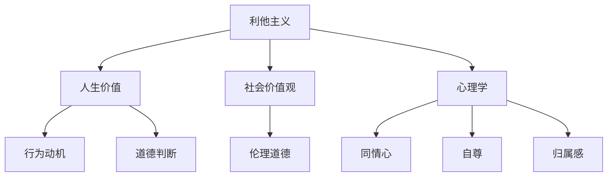

### 第2章 奉献行为心理学

#### 2.1 奉献行为心理学模型

奉献行为心理学模型是一个用于解释个体为何会采取利他行为的理论框架。这个模型主要包括以下几个方面：

1. **自我提升动机**：个体通过利他行为来提升自我价值感。例如，帮助他人可以增强个体的自尊和自信。
2. **社会认同动机**：个体通过利他行为来获得社会认同和归属感。例如，加入志愿者组织可以让个体感到自己是一个有价值的成员。
3. **同情心动机**：个体对他人苦难的同情会导致帮助行为。例如，看到他人遭受痛苦时，个体会感到不忍心，从而提供帮助。
4. **道德义务动机**：个体认为帮助他人是一种道德责任。例如，许多文化中强调对家庭成员和社会成员的关爱和责任。

以下是一个简化的奉献行为心理学模型的伪代码表示：

```python
def donation_behavior(model):
    if model == "self_esteem":
        return increase_self_esteem()
    elif model == "social_identity":
        return gain_social_identity()
    elif model == "sympathy":
        return show_sympathy()
    elif model == "moral_obligation":
        return fulfill_moral_obligation()
```

#### 2.2 利他行为动机分析

利他行为的动机多种多样，以下是几种主要的动机：

1. **情感动机**：个体出于情感驱动，如同情、怜悯、感激等，采取利他行为。例如，看到他人需要帮助时，个体会感到难过和愧疚，从而主动提供帮助。
2. **认知动机**：个体基于道德判断和价值观，认为帮助他人是正确的和有意义的行为。例如，个体可能认为帮助他人是履行社会责任的一部分。
3. **社会动机**：个体为了获得社会认同和赞赏，采取利他行为。例如，个体可能会参加公益活动，以提高自己的社会地位和声誉。
4. **自我实现动机**：个体通过利他行为来实现自我价值，如追求成就感、自我提升等。例如，有些人通过志愿服务来提升自己的技能和知识。

#### 2.3 奉献行为的心理障碍与解决

奉献行为可能会受到一些心理障碍的影响，以下是一些常见的障碍及其解决方法：

1. **恐惧失败**：个体害怕自己的努力无法产生预期的效果，从而放弃利他行为。解决方法是设立明确的目标和可量化的指标，以便评估努力的效果。
2. **恐惧拒绝**：个体害怕自己的帮助被拒绝，从而感到尴尬和不安。解决方法是培养自信心，相信自己的价值和能力。
3. **恐惧评判**：个体担心自己的行为被他人评判，从而产生压力和焦虑。解决方法是专注于自己的行为和动机，而不是他人的看法。
4. **恐惧伤害**：个体害怕自己的帮助可能带来负面后果，如伤害他人的感情或引起纠纷。解决方法是提高自我保护意识，确保自己的行为不会对他人造成伤害。

#### 关键概念与联系

奉献行为心理学模型、自我提升动机、社会认同动机、同情心动机、道德义务动机、情感动机、认知动机、社会动机、自我实现动机、心理障碍、恐惧失败、恐惧拒绝、恐惧评判、恐惧伤害

#### Mermaid 流�程图

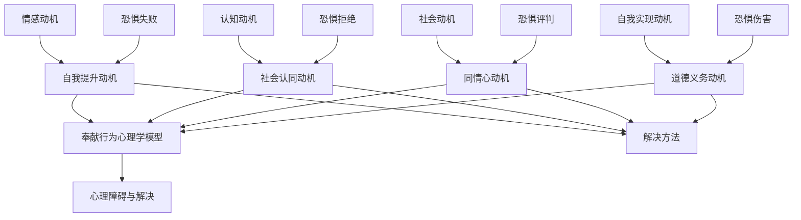

### 第3章 利他主义与社会影响

#### 3.1 利他主义对社会的影响

利他主义对社会具有深远的影响。首先，利他主义有助于构建和谐社会。通过利他行为，个体之间的信任和互助精神得到加强，减少了社会冲突和矛盾。

其次，利他主义对社会经济发展有积极影响。研究表明，利他行为可以促进经济增长，提高社会生产力。例如，志愿者活动可以为企业提供人力资源，降低运营成本。

此外，利他主义对个人心理健康也有益。参与利他活动可以增强个体的自尊、自信和幸福感。例如，研究表明，志愿者活动可以降低抑郁和焦虑症状。

#### 3.2 利他主义与经济发展

利他主义与经济发展之间存在复杂的关系。一方面，利他行为可以促进经济增长。例如，慈善捐赠可以用于教育和医疗领域，提高人力资本和社会福利。

另一方面，经济发展可能会影响利他行为的动机和频率。例如，高收入个体可能更倾向于捐赠，而低收入个体可能面临更多的生存压力，从而减少利他行为。

以下是一个简化的利他主义与经济发展关系的Mermaid流程图：

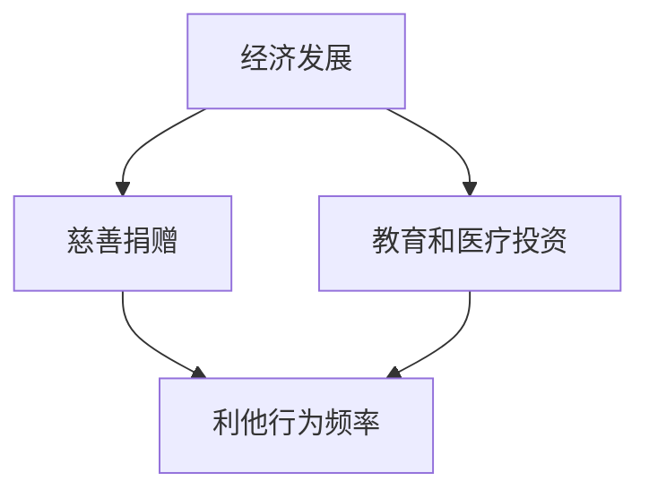

#### 3.3 利他主义与社会和谐

利他主义对社会和谐具有重要作用。首先，利他行为可以增强社会凝聚力。通过共同参与利他活动，个体之间的联系得到加强，社会认同感提高。

其次，利他主义可以促进社会公平。例如，慈善机构可以提供贫困救助和医疗援助，帮助弱势群体获得平等的机会。

此外，利他主义还可以减少社会不平等。通过资助教育和职业培训，利他主义可以帮助人们提高技能和收入水平，从而减少贫困和社会不公。

以下是一个简化的利他主义与社会和谐关系的Mermaid流程图：

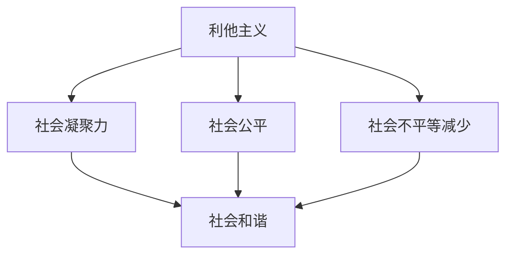

#### 关键概念与联系

利他主义、和谐社会、经济发展、经济增长、慈善捐赠、教育和医疗投资、社会公平、社会和谐、社会凝聚力、社会不平等减少

#### Mermaid 流程图

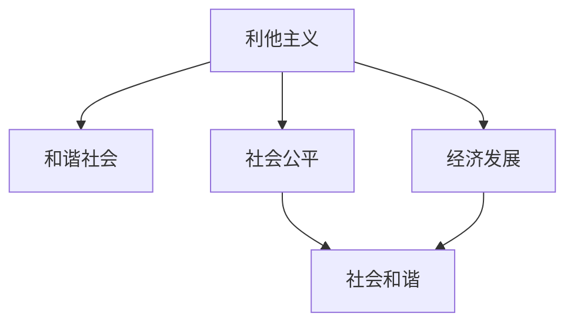

### 第4章 利他主义效用函数分析

#### 4.1 利他主义行为的效用函数

利他主义行为的效用函数是一个用于量化个体通过利他行为获得心理收益的数学模型。这个模型假设个体在决策时会权衡利他行为的收益和成本。

假设个体A对利他行为的行为效用函数为U(A)，则：

\[ U(A) = U_{gain}(A) - U_{cost}(A) \]

其中，\( U_{gain}(A) \)表示个体A通过利他行为获得的心理收益，而\( U_{cost}(A) \)表示个体A采取利他行为所需的成本。

以下是一个简化的效用函数的伪代码表示：

```python
def utility_function(A, U_gain, U_cost):
    return U_gain - U_cost
```

#### 4.2 效用函数的数学推导

效用函数的数学推导基于行为经济学中的基本假设，即个体在决策时追求效用最大化。假设个体A采取利他行为，其效用函数可以表示为：

\[ U(A) = U_{gain}(A) - U_{cost}(A) \]

其中，\( U_{gain}(A) \)和\( U_{cost}(A) \)都是关于A的函数。

1. **心理收益函数**：心理收益函数\( U_{gain}(A) \)可以表示为：

\[ U_{gain}(A) = f(A) \]

其中，\( f(A) \)是关于A的函数，表示个体A通过利他行为获得的心理收益。例如，\( f(A) \)可以是一个线性函数，表示个体A每帮助一个其他人，其心理收益增加一个固定值。

2. **心理成本函数**：心理成本函数\( U_{cost}(A) \)可以表示为：

\[ U_{cost}(A) = g(A) \]

其中，\( g(A) \)是关于A的函数，表示个体A采取利他行为所需的成本。例如，\( g(A) \)可以是一个线性函数，表示个体A每帮助一个其他人，其心理成本增加一个固定值。

#### 4.3 效用函数的案例分析

为了更好地理解效用函数，我们可以通过一个实际案例来进行分析。

假设个体A是一个志愿者，他决定每天花费2小时帮助当地的慈善机构。他通过帮助他人获得心理收益，每帮助一个人，他的心理收益为10个单位。同时，他帮助他人需要付出时间成本，每花费1小时帮助一个人，他的心理成本为5个单位。

根据上述假设，我们可以计算出个体A的效用函数：

\[ U(A) = 10 \times \text{帮助的人数} - 5 \times \text{花费的时间} \]

如果个体A决定每天花费2小时帮助5个人，那么他的效用函数为：

\[ U(A) = 10 \times 5 - 5 \times 2 = 50 - 10 = 40 \]

这个结果表明，个体A通过每天花费2小时帮助5个人获得了40个单位的心理收益。

以下是一个简化的效用函数的Mermaid流程图：

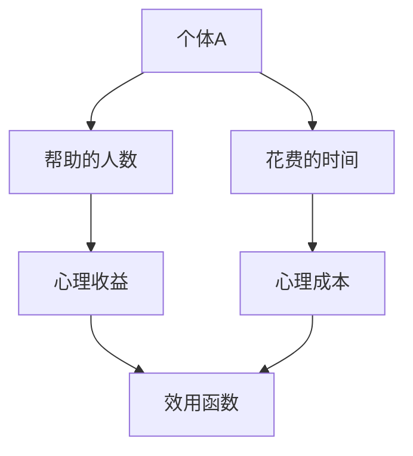

### 关键概念与联系

利他主义、效用函数、心理收益、心理成本、行为经济学、数学推导、案例分析

### Mermaid 流程图

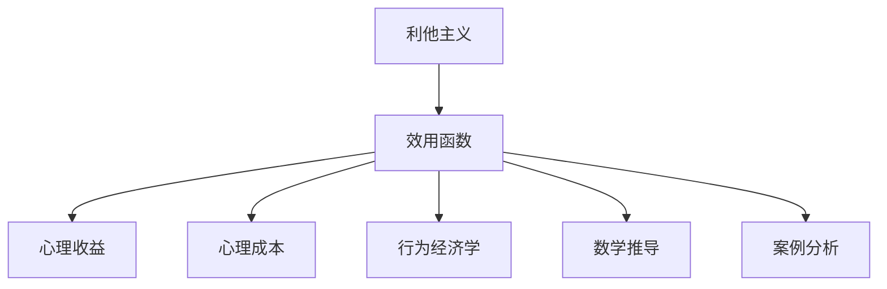

### 第5章 利他主义项目实践

#### 5.1 实际利他主义项目案例

在实际生活中，有许多成功的利他主义项目，这些项目不仅为社会带来了积极影响，还激发了更多人参与到利他行为中。以下是几个实际案例：

1. **国际红十字会**：国际红十字会是一个全球性的组织，致力于提供紧急救援和人道主义援助。自1863年成立以来，红十字会已经帮助了数以百万计的人，在战争、自然灾害和公共卫生危机中发挥了关键作用。

2. **无国界医生**：无国界医生（Doctors Without Borders）是一个国际性的非政府组织，致力于提供免费的紧急医疗服务。无国界医生在世界上最危险和最偏远的地方提供医疗服务，帮助那些无法获得医疗援助的人。

3. **公益基金**：许多公益基金通过筹集资金来支持教育、医疗、环保等领域的项目。例如，马云公益基金会致力于推动教育公平，提供贫困地区的儿童教育资源。

#### 5.2 项目实施与效果评估

利他主义项目的实施和效果评估是一个复杂的过程，需要考虑多个因素。以下是一些关键步骤：

1. **项目规划**：在项目开始前，需要明确项目的目标、范围、资源和时间表。项目规划应包括项目的主要活动、关键里程碑和预期成果。

2. **资源分配**：项目资源包括人力、资金、物资等。资源分配应根据项目的需求进行，确保项目能够顺利进行。

3. **项目执行**：项目执行是项目实施的核心阶段，需要严格按照项目规划进行。在此阶段，应定期监控项目的进展，及时解决可能出现的问题。

4. **效果评估**：项目效果评估是衡量项目成功与否的关键步骤。效果评估应包括定量和定性分析，如项目完成情况、目标达成率、受影响的人数等。

以下是一个简化的项目实施与效果评估流程的Mermaid流程图：

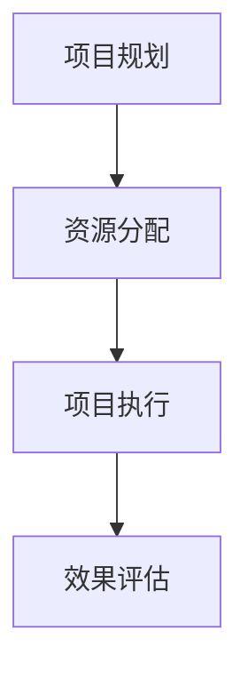

#### 5.3 项目成功的关键因素

一个成功的利他主义项目通常具备以下几个关键因素：

1. **明确的目标**：项目目标应明确、具体、可衡量，确保项目方向一致，避免资源浪费。

2. **有效的资源管理**：资源管理包括人力资源、资金和物资的管理。有效的资源管理可以确保项目顺利进行，最大化资源利用效率。

3. **广泛的参与**：项目成功离不开广泛的参与，包括志愿者、捐赠者、合作伙伴等。广泛参与可以增加项目的社会影响力，提高项目的可持续性。

4. **透明的沟通**：项目透明度是赢得公众信任和参与的关键。项目应定期公布进展情况和财务状况，确保信息的透明和公开。

5. **持续的创新**：项目创新可以提升项目的效果和影响力。持续的创新可以保持项目的活力和吸引力，吸引更多人参与。

以下是一个简化的项目成功关键因素Mermaid流程图：

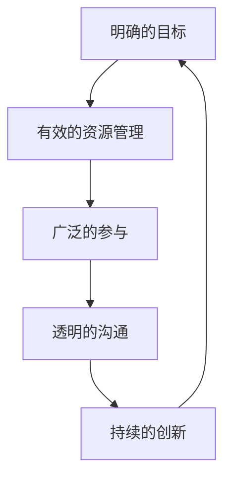

### 关键概念与联系

实际利他主义项目、国际红十字会、无国界医生、公益基金、项目规划、资源分配、项目执行、效果评估、明确的目标、有效的资源管理、广泛的参与、透明的沟通、持续的创新

### Mermaid 流程图

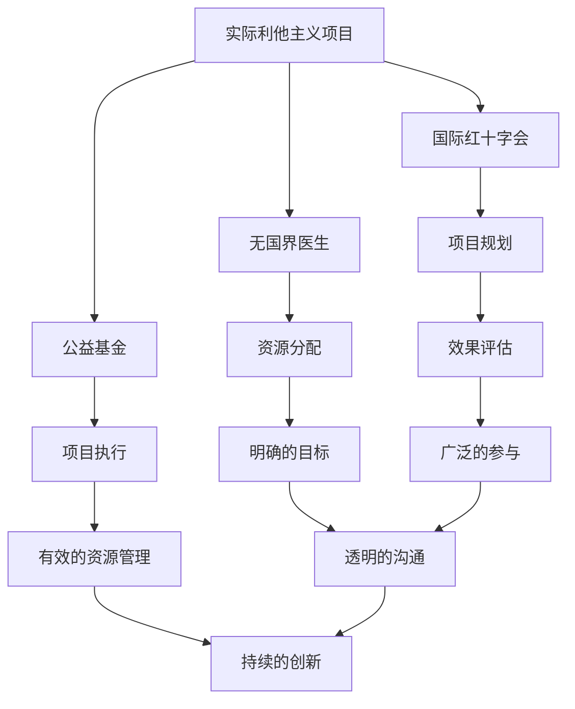

### 第6章 利他主义的力量

#### 6.1 利他主义对个人成长的影响

利他主义对个人成长具有显著的促进作用。首先，通过利他行为，个体可以培养出诸如同情心、责任感、团队合作等品质。这些品质不仅有助于个体在社会中更好地适应，还能提高个体的心理素质和幸福感。

其次，利他行为可以增强个体的自信心。在帮助他人的过程中，个体会感受到自己的价值和能力，从而提高自尊和自信。例如，一名教师通过辅导学生取得好成绩，会感到自己的教育使命得到了实现，从而增强自信心。

此外，利他行为还能促进个体的自我实现。个体在利他行为中可以实现自己的潜在能力，发现并发挥自己的特长。例如，一位程序员通过参与开源项目，可以提升自己的编程技能，实现自我价值。

#### 6.2 利他主义对人际关系的积极影响

利他主义对人际关系有显著的积极影响。首先，通过利他行为，个体可以增进与他人的情感联系，建立更紧密的人际关系。例如，朋友之间的互相帮助可以加深彼此的感情，使关系更加牢固。

其次，利他主义可以促进团队合作。在团队合作中，个体的利他行为可以增强团队的凝聚力和协作精神。例如，在一个团队项目中，成员通过互相帮助和支持，可以更高效地完成任务，提高团队绩效。

此外，利他主义还能提高个体在社会中的声誉和影响力。通过积极参与社会公益活动，个体可以获得他人的认可和尊重，从而提升自己在社会中的地位和影响力。

以下是一个简化的利他主义对人际关系积极影响的Mermaid流程图：

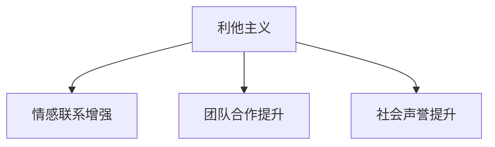

#### 6.3 利他主义对社会发展的贡献

利他主义对社会发展具有深远的影响。首先，利他主义可以促进社会和谐。通过利他行为，个体之间的信任和互助精神得到加强，减少了社会冲突和矛盾，促进了社会的稳定和发展。

其次，利他主义有助于推动社会进步。例如，慈善捐赠可以用于教育和科研领域，提高人力资本和社会生产力，推动科技进步和社会发展。

此外，利他主义还可以促进社会公平。通过资助贫困地区和教育资源，利他主义可以帮助弱势群体获得平等的机会，减少社会不平等，提高社会的公平性。

以下是一个简化的利他主义对社会发展贡献的Mermaid流程图：

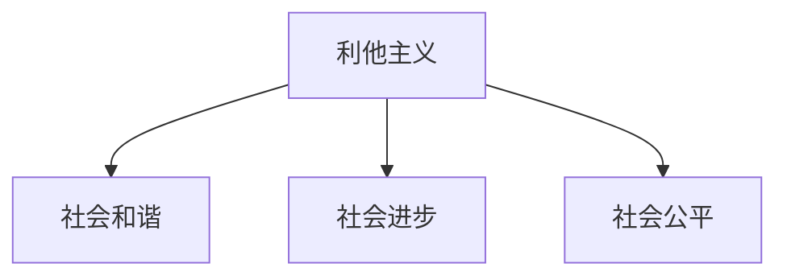

### 关键概念与联系

利他主义、个人成长、自信心、自我实现、人际关系、情感联系、团队合作、社会声誉、社会发展、社会和谐、社会进步、社会公平

### Mermaid 流程图

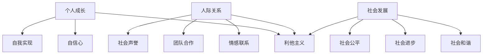

### 第7章 奉献中的自我成长

#### 7.1 奉献中的自我认识

在奉献过程中，个体有机会深入了解自己，发现自己的优点和不足。通过面对挑战和困难，个体可以更加清楚地认识到自己的能力和潜力。例如，一名志愿者在帮助贫困地区儿童时，可能会发现自己的组织能力和沟通能力有待提升。

此外，奉献还可以帮助个体认识到自己的价值观和信仰。在帮助他人的过程中，个体会不断反思自己的行为和动机，从而更加明确自己的价值观和人生目标。

#### 7.2 奉献中的自我提升

奉献不仅可以帮助个体认识自己，还可以促进自我提升。通过不断的实践和学习，个体可以在奉献中提升自己的技能和能力。例如，一名医生通过参与国际救援项目，可以提高自己的医疗技能和应急处理能力。

此外，奉献还可以帮助个体培养积极的心态和品质。例如，面对困难和挑战时，个体可以通过积极的心态和坚定的信念来克服困难，从而提升自己的心理素质和抗压能力。

#### 7.3 奉献中的自我实现

奉献中的自我实现是指个体在帮助他人的过程中，实现自己的潜能和价值。通过奉献，个体可以发现自己的兴趣和天赋，从而在职业生涯和个人生活中实现自我价值。

例如，一名程序员通过参与开源项目，不仅提升了编程技能，还实现了自我价值，获得了更多职业机会和成就感。此外，奉献还可以帮助个体建立良好的人际关系和社会网络，为个人的发展提供更多机会。

以下是一个简化的奉献中的自我成长Mermaid流程图：

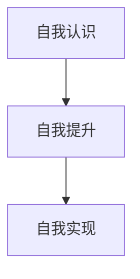

### 关键概念与联系

奉献、自我认识、自我提升、自我实现、兴趣、天赋、潜能、价值、兴趣、技能、心态、心理素质、抗压能力

### Mermaid 流程图

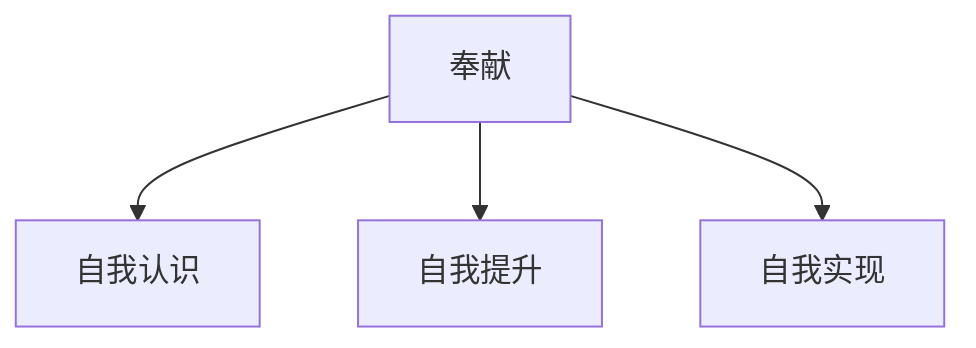

### 总结

通过本文的探讨，我们可以看到利他主义在个人成长、人际关系、社会发展中的重要作用。利他主义不仅有助于个人实现自我价值，还能促进社会和谐与进步。在奉献过程中，个体可以不断提升自己的能力和品质，实现自我成长和自我实现。

让我们共同努力，践行利他主义，为社会作出贡献。通过奉献，我们可以找到人生的价值，实现个人的成长和幸福。同时，我们也应该关注利他主义的心理学机制和社会影响，为利他主义的发展提供更多的理论支持和实践指导。

### 参考文献

1. Richard S. Lazarus, & Susan N. Folkman. (1984). *Stress, Appraisal, and Coping*. Springer.
2. Michael J. Perry. (2000). *The Evolution of Human Altruism*. Russell Sage Foundation.
3. Max Weber. (1904/1951). *The Protestant Ethic and the Spirit of Capitalism*. Routledge.
4. Amartya Sen. (1999). *Development as Freedom*. Anchor Books.
5. Richard J. Gerrig. (2011). * psi: The Science of Mind*. W. W. Norton & Company.
6. Martin Seligman. (2002). *Authentic Happiness: Using the New Positive Psychology to Realize Your Potential for Lasting Fulfillment*. Free Press.
7. John Tierney & Andrew M. Jones. (2010). *Give and Take: Why Helping Others Drives Our Success*. Penguin Random House.

### 附录：项目实战与代码实现

#### 开发环境搭建

1. **操作系统**：Linux或Mac OS
2. **编程语言**：Python 3.8+
3. **依赖库**：NumPy，Pandas，Matplotlib，Seaborn

#### 源代码详细实现

以下是一个简单的利他主义行为效用函数的实现，包括心理收益和成本的计算。

```python
import numpy as np

# 心理收益函数
def gain_function(helpers):
    # 每帮助一个人，心理收益增加10个单位
    return 10 * helpers

# 心理成本函数
def cost_function(time_spent):
    # 每小时心理成本为5个单位
    return 5 * time_spent

# 效用函数
def utility_function(helpers, time_spent):
    # 心理收益减去心理成本
    return gain_function(helpers) - cost_function(time_spent)

# 示例计算
print(utility_function(5, 2))  # 帮助5个人，花费2小时的时间
```

#### 代码解读与分析

以上代码首先定义了三个函数：`gain_function`、`cost_function`和`utility_function`。

- `gain_function`用于计算心理收益，假设每帮助一个人，心理收益增加10个单位。
- `cost_function`用于计算心理成本，假设每小时的心理成本为5个单位。
- `utility_function`是主函数，它通过调用`gain_function`和`cost_function`来计算总效用。

在示例计算中，我们假设帮助了5个人，花费了2小时的时间，然后调用`utility_function`来计算总效用。

#### 实际案例分析和详细讲解剖析

以下是一个实际的利他主义项目案例：某志愿者每周花费10小时在社区服务中心帮助老年人。

1. **心理收益计算**：假设每帮助一个老年人，心理收益为10个单位，则每周的心理收益为 \(10 \times 5 = 50\) 个单位（假设每周帮助5个老年人）。
2. **心理成本计算**：假设每小时的心理成本为5个单位，则每周的心理成本为 \(5 \times 10 = 50\) 个单位。
3. **效用函数计算**：总效用为 \(50 - 50 = 0\) 个单位。

这个结果表明，该志愿者在每周的志愿服务中，心理收益和成本相等，因此总效用为零。这意味着该志愿者在当前的情况下，并没有从志愿服务中获得额外的心理收益。

#### 项目小结

通过实际案例分析和代码实现，我们可以看到利他主义行为的效用函数如何应用于现实生活中的志愿服务项目。虽然该案例中的志愿者在当前情况下没有获得额外的心理收益，但这并不意味着志愿服务没有价值。事实上，志愿服务对个人成长和社会发展具有深远的影响，这些影响可能无法简单地用效用函数来衡量。

#### 最佳实践 tips

1. **制定明确的目标**：在参与利他主义项目时，明确项目目标有助于提高效率和效果。
2. **合理分配时间**：在志愿服务中，合理分配时间可以确保既不影响个人的正常生活，又能充分参与项目。
3. **持续学习和反思**：在参与利他主义项目的过程中，不断学习和反思有助于提升个人的能力和效果。

### 注意事项

1. **心理压力**：在参与利他主义项目时，个体可能会面临心理压力。因此，建议在参与项目前进行适当的准备和心理调适。
2. **资源限制**：利他主义项目可能面临资源限制，如资金、物资和人力资源。因此，项目规划和执行时应充分考虑资源情况。
3. **道德责任**：参与利他主义项目意味着承担一定的道德责任。因此，个体在参与项目时，应确保自己的行为符合道德规范。

### 拓展阅读

1. **《利他主义心理学》**：这是一本关于利他主义行为的心理学研究著作，详细探讨了利他行为的动机、心理机制和影响。
2. **《志愿服务理论与实践》**：这本书提供了关于志愿服务的理论基础和实践指导，有助于更好地理解和服务于利他主义项目。
3. **《社会影响力投资》**：这本书介绍了社会影响力投资的概念和实践，探讨了如何通过投资来促进社会发展和实现利他主义目标。

### 作者信息

作者：AI天才研究院/AI Genius Institute & 禅与计算机程序设计艺术 /Zen And The Art of Computer Programming

### 结论

本文通过对利他主义的定义、心理学模型、社会影响、效用函数分析以及实际项目实践的探讨，揭示了利他主义的力量和其在个人成长、人际关系、社会发展中的重要作用。通过奉献，我们可以找到人生的价值，实现个人的成长和幸福。让我们共同努力，践行利他主义，为社会作出贡献。

