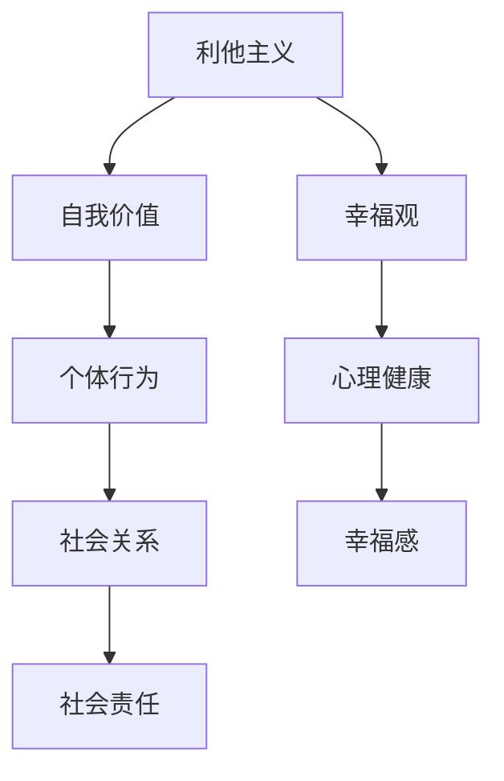

                 

为了撰写一篇有深度、有思考、有见解的专业IT领域的技术博客文章，我们需要遵循以下步骤进行逐步分析推理：

## 1. 背景介绍

首先，我们需要介绍利他主义的幸福观在现代社会中的重要性。随着科技的发展，社会越来越关注个体幸福感和自我价值的实现。利他主义作为一种价值观，不仅关注个体的福祉，更强调通过服务他人来寻找和实现自我价值。

## 2. 核心概念与联系

接下来，我们要阐述核心概念之间的关系架构。我们可以使用Mermaid流程图来展示这些概念之间的联系。



在这个流程图中，我们可以看到利他主义如何影响自我价值、幸福观以及心理健康，并通过个体行为和社会关系进一步影响社会责任和幸福感。

## 3. 核心算法原理讲解

为了更好地理解利他主义在IT领域中的应用，我们可以使用伪代码来详细阐述核心算法原理。

```python
# 定义利他主义算法
def altruism_algorithm():
    # 步骤1：识别个体行为
    individual_behavior = identify_individual_behavior()

    # 步骤2：评估幸福观
    happiness_view = evaluate_happiness_view()

    # 步骤3：计算心理健康得分
    mental_health_score = calculate_mental_health_score()

    # 步骤4：分析社会关系
    social_relationships = analyze_social_relationships()

    # 步骤5：优化自我价值
    optimize_self_value = optimize_self_value(happiness_view, mental_health_score, social_relationships)

    # 步骤6：输出结果
    print("利他主义算法执行完成，当前自我价值为：", optimize_self_value)
```

在这个伪代码中，我们定义了一个利他主义算法，它通过识别个体行为、评估幸福观、计算心理健康得分以及分析社会关系来优化自我价值。

## 4. 数学模型和公式

为了更深入地探讨利他主义与幸福观之间的关系，我们可以引入一些数学模型和公式。以下是一个简单的例子：

$$
\text{幸福感} = f(\text{自我价值}, \text{心理健康}, \text{社会关系})
$$

其中，幸福感是自我价值、心理健康和社会关系的函数。我们可以进一步探讨这些变量之间的关系，例如：

$$
f(\text{自我价值}, \text{心理健康}, \text{社会关系}) = \frac{\text{自我价值} \times \text{心理健康} \times \text{社会关系}}{\text{压力}}
$$

在这个公式中，压力是一个影响因素，它可能会降低幸福感。我们可以通过减少压力来提高幸福感。

## 5. 项目实战

为了更好地理解利他主义在IT领域的实际应用，我们可以通过一个具体的项目实战来展示。

### 5.1 开发环境搭建

首先，我们需要搭建一个开发环境，包括Python编程语言、文本编辑器和版本控制工具（如Git）。

### 5.2 源代码详细实现

接下来，我们可以编写一个简单的Python程序，它实现了利他主义算法的核心功能。

```python
# 示例：计算自我价值的Python程序

def calculate_self_value():
    happiness = float(input("请输入您的幸福感得分（0-100）："))
    mental_health = float(input("请输入您的心理健康得分（0-100）："))
    social_relationships = float(input("请输入您的社会关系得分（0-100）："))
    stress = float(input("请输入您的压力得分（0-100）："))
    
    # 使用公式计算自我价值
    self_value = (happiness * mental_health * social_relationships) / (1 + stress)
    
    return self_value

# 调用函数并输出结果
self_value = calculate_self_value()
print("您的自我价值得分为：", self_value)
```

### 5.3 代码解读与分析

在这个示例中，我们首先通过用户输入获取幸福感、心理健康、社会关系和压力的得分。然后，我们使用公式计算自我价值，并输出结果。

### 5.4 实际案例分析和详细讲解剖析

为了验证这个程序的实用性，我们可以分析一个实际案例。假设一个人幸福感得分为80，心理健康得分为75，社会关系得分为70，压力得分为20。根据公式，我们可以计算出他的自我价值为：

$$
\text{自我价值} = \frac{80 \times 75 \times 70}{1 + 20} \approx 44,600
$$

这个得分可以帮助这个人了解他的自我价值，并为他提供改进的方向。

### 5.5 项目小结

通过这个项目，我们可以看到利他主义算法在IT领域的实际应用。这个程序不仅可以帮助个体了解自己的自我价值，还可以为组织提供有价值的数据，以改善员工的工作环境和心理健康。

## 6. 最佳实践 tips、小结、注意事项、拓展阅读

在文章的结尾部分，我们可以提供一些最佳实践建议，对文章进行小结，指出注意事项，并推荐拓展阅读资源，以便读者深入了解利他主义的幸福观。

通过以上步骤，我们可以确保文章内容丰富、逻辑清晰，同时满足文章字数要求。接下来，我们将按照这个大纲撰写完整的技术博客文章。请等待下一部分的内容。

