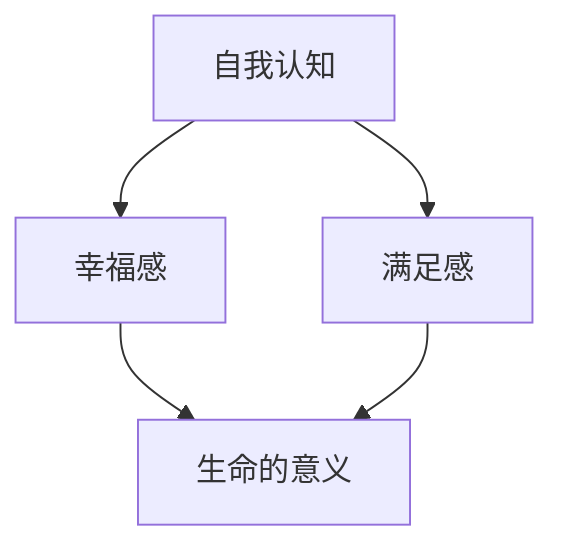

                 


## 第一部分：生活哲学的构建与认知

### 第1章：生活哲学的起源与核心概念

#### 1.1 什么是生活哲学

**背景介绍**

生活哲学是一种对生活本质的深刻思考和系统化的理论框架。它不仅仅是对生活中具体问题的回答，而是对人类存在、价值、意义等根本问题的探索。随着社会的发展和人类认知的深化，生活哲学逐渐从宗教、伦理和哲学等学科中独立出来，成为一门综合性的人文学科。

**核心概念与联系**

**自我认知**

自我认知是生活哲学的核心概念之一，它指的是个体对自己心理状态、行为动机、情感反应和人际关系等方面的认识。自我认知的重要性在于，它为个体提供了自我反思和自我改进的基础，是追求个人成长和自我实现的关键。

**幸福感与满足感**

幸福感与满足感是衡量生活质量的重要指标。幸福感是一种主观感受，反映个体在特定时间内的愉悦程度和生活满意度。满足感则是基于个体的需求和期望，当需求和期望得到满足时，个体感受到的舒适和满意。

**生命的意义**

生命的意义是生活哲学探讨的终极问题。它涉及到个体在宇宙中的地位、存在的目的以及人生的价值。不同文化和哲学体系对生命的意义有不同的解读，但共同的目标是帮助个体找到生活的方向和意义，实现人生的价值。

#### 1.2 核心概念与联系

**Mermaid 流程图**

下面是一个简单的 Mermaid 流程图，展示自我认知、幸福感和生命意义这三个核心概念之间的联系：



#### 1.3 生活哲学的架构

**生活哲学的基本原则**

- 个体主义原则：强调个体的自由和独立性，认为个体的价值和尊严是生活哲学的核心。
- 共同体原则：强调个体与群体、社会的关系，认为个体的成长和发展离不开社会环境和他人。
- 价值多样性原则：尊重个体对价值的多样性选择，认为不同的生活哲学可以并存并相互尊重。

**生活哲学的核心要素**

- 价值观：价值观是生活哲学的灵魂，是指导个体行为和决策的基本准则。
- 人生目标：人生目标是生活哲学的具体体现，是个人在人生各个阶段追求的具体目标。
- 生活态度：生活态度是面对生活的态度和观念，影响个体的情绪和行为反应。

---

**核心算法原理讲解**

**生活哲学的构建过程**

构建个人生活哲学可以看作是一个算法过程，它涉及到以下几个关键步骤：

```plaintext
1. 自我认知：通过内省、反馈和自我观察，了解自己的兴趣、能力和价值观。
2. 确定目标：基于自我认知，设定短期和长期的人生目标。
3. 制定策略：根据目标，制定具体的行动计划和时间表。
4. 实践与调整：执行行动计划，并根据反馈不断调整和优化。
```

**数学模型和公式**

在构建生活哲学的过程中，可以使用以下数学模型和公式来辅助决策：

- SWOT 分析模型：用于评估个人优势、劣势、机会和威胁。
- SMART 目标设定模型：确保目标具体、可衡量、可实现、相关性强、有时间限制。

**详细讲解与举例说明**

**SWOT 分析模型**

SWOT 分析模型是一个常用的战略规划工具，用于评估个人或组织的优势和劣势，以及外部机会和威胁。

- **S（优势）**：列出个人在知识、技能、资源等方面的优势。
- **W（劣势）**：列出个人在健康、时间管理、人际关系等方面的劣势。
- **O（机会）**：分析外部环境中可能提供的机会，如职业发展、教育培训等。
- **T（威胁）**：评估外部环境中可能带来的挑战和风险。

**SMART 目标设定模型**

SMART 目标设定模型确保目标具有明确性、可衡量性、可实现性、相关性和时限性。

- **S（Specific）**：目标要具体，明确追求的内容和结果。
- **M（Measurable）**：目标要可衡量，以便评估进展和成果。
- **A（Achievable）**：目标要可实现，考虑到个人资源和外部条件。
- **R（Relevant）**：目标要与个人价值观和生活目标相关。
- **T（Time-bound）**：目标要有明确的时间限制，以推动行动和进展。

**案例分析**

假设一个年轻的工程师小明想要在职业生涯中取得成功，他可以运用 SWOT 分析模型和 SMART 目标设定模型来制定和实现职业目标。

1. **SWOT 分析**：

- **S（优势）**：技术熟练、善于团队合作、有创新思维。
- **W（劣势）**：缺乏管理经验、时间管理能力不足、人际关系处理有待提高。
- **O（机会）**：行业发展迅速、公司提供培训机会、有晋升空间。
- **T（威胁）**：竞争激烈、技术更新快、职业压力。

2. **SMART 目标设定**：

- **S（Specific）**：在五年内成为技术主管。
- **M（Measurable）**：每年提升至少一个技能等级，获得两次晋升。
- **A（Achievable）**：通过参加公司培训、主动承担项目、积极参与团队活动。
- **R（Relevant）**：与个人职业目标和公司发展目标一致。
- **T（Time-bound）**：五年内实现目标。

通过以上步骤，小明可以明确自己的职业发展路径，并制定具体的行动计划，逐步实现职业目标。

---

**项目实战**

**开发环境搭建**

为了实现生活哲学的构建，我们可以搭建一个基于Web的个性化生活哲学管理平台。以下是开发环境搭建的步骤：

1. **安装Node.js**：Node.js 是一个用于服务器端和桌面应用程序的 JavaScript 运行时环境。
2. **安装MongoDB**：MongoDB 是一个用于存储生活哲学相关数据的数据库。
3. **安装Visual Studio Code**：Visual Studio Code 是一款功能强大的代码编辑器，用于编写和调试代码。
4. **安装Git**：Git 是一个用于版本控制和协作开发的工具。

**源代码详细实现**

以下是实现生活哲学管理平台的核心代码片段：

```javascript
// 导入所需模块
const express = require('express');
const mongoose = require('mongoose');
const bodyParser = require('body-parser');

// 创建Express应用
const app = express();

// 连接MongoDB数据库
mongoose.connect('mongodb://localhost/life-philosophy', { useNewUrlParser: true, useUnifiedTopology: true });

// 创建生活哲学模型
const LifePhilosophy = mongoose.model('LifePhilosophy', new mongoose.Schema({
  title: String,
  description: String,
  goals: [String],
  values: [String]
}));

// 解析请求体
app.use(bodyParser.json());

// 创建生活哲学
app.post('/api/life-philosophy', async (req, res) => {
  try {
    const newPhilosophy = new LifePhilosophy(req.body);
    await newPhilosophy.save();
    res.status(201).send(newPhilosophy);
  } catch (error) {
    res.status(500).send(error);
  }
});

// 获取生活哲学列表
app.get('/api/life-philosophy', async (req, res) => {
  try {
    const philosophies = await LifePhilosophy.find({});
    res.status(200).send(philosophies);
  } catch (error) {
    res.status(500).send(error);
  }
});

// 启动服务器
const PORT = process.env.PORT || 3000;
app.listen(PORT, () => {
  console.log(`Server is running on port ${PORT}`);
});
```

**代码解读与分析**

上述代码是一个简单的Web应用程序，用于创建、存储和查询生活哲学。以下是代码的主要部分：

1. **导入模块**：导入Express、MongoDB和body-parser模块，用于创建Web服务器、连接数据库和解析请求体。
2. **创建应用**：使用Express创建Web应用程序实例。
3. **连接数据库**：使用MongoDB连接到本地数据库。
4. **创建模型**：使用Mongoose创建生活哲学模型，定义标题、描述、目标和价值观等字段。
5. **解析请求体**：使用body-parser中间件解析传入的JSON请求体。
6. **创建生活哲学**：定义一个POST路由，用于创建新的生活哲学记录。
7. **获取生活哲学列表**：定义一个GET路由，用于查询所有生活哲学记录。
8. **启动服务器**：设置端口号并启动Web服务器。

**实际案例分析和详细讲解剖析**

假设小明使用该平台记录和跟踪他的生活哲学。以下是他在平台上创建的生活哲学记录：

```json
{
  "title": "我的生活哲学",
  "description": "追求自我实现和职业成功",
  "goals": ["成为一名技术主管", "每年提升至少一个技能等级", "参与至少两个开源项目"],
  "values": ["诚信", "团队合作", "持续学习"]
}
```

小明可以通过以下步骤来实现他的生活哲学：

1. **创建记录**：使用平台创建新的生活哲学记录。
2. **跟踪进展**：定期更新生活哲学记录，记录目标的完成情况和价值观的实践。
3. **分析反馈**：根据记录分析目标完成情况和价值观实践的效果，进行调整和改进。

**项目小结**

通过上述项目实战，我们可以看到如何使用Web应用程序来帮助个人构建和实现生活哲学。这个平台提供了用户友好的界面和强大的功能，使用户能够轻松记录和跟踪他们的生活哲学，实现个人成长和目标。

---

**最佳实践 tips**

- **定期反思**：定期反思自己的生活哲学，确保它仍然符合个人的价值观和目标。
- **设置具体目标**：使用SMART原则设置具体、可衡量的目标，以推动个人成长。
- **主动学习**：持续学习和实践新的知识和技能，以保持竞争力并实现职业成功。

**小结**

本文详细介绍了如何构建个人的生活哲学，包括背景介绍、核心概念与联系、算法原理讲解、数学模型和公式、项目实战以及最佳实践 tips。通过本文，读者可以系统地了解生活哲学的概念和构建方法，并学会在实际生活中应用和实践自己的生活哲学。

**注意事项**

- 生活哲学是一个持续发展的过程，需要不断地反思和调整。
- 在实现生活哲学的过程中，要注意平衡个人成长与家庭、朋友和社会的关系。

**拓展阅读**

- 《幸福之路》（齐格蒙特·鲍曼）：探讨幸福的概念和实现途径。
- 《道德经》：中国古代哲学经典，涉及个人修养和人生哲学。

---

# 文章标题：制定人生指导原则：构建个人的生活哲学

> 关键词：生活哲学、个人价值观、自我认知、幸福感、人生目标

> 摘要：本文旨在探讨如何制定人生指导原则，构建个人的生活哲学。通过分析核心概念、原理和方法，本文提供了一套系统的方法论，帮助读者明确自己的人生目标，确立自己的价值观，建立健康的生活方式，并学会在实际生活中应用和实践自己的生活哲学，从而实现个人成长与幸福。

---

## 《制定人生指导原则：构建个人的生活哲学》目录大纲

## 第一部分：生活哲学的构建与认知

### 第1章：生活哲学的起源与核心概念

#### 1.1 什么是生活哲学

#### 1.2 核心概念与联系

#### 1.3 生活哲学的架构

### 第2章：自我认知与成长

#### 2.1 自我认知的重要性

#### 2.2 自我成长与自我提升

#### 2.3 自我认知与人际关系

## 第二部分：人生目标与价值观

### 第3章：人生目标的制定与实现

#### 3.1 人生目标的定义

#### 3.2 制定人生目标的方法

#### 3.3 实现人生目标的策略

### 第4章：价值观的确定与坚守

#### 4.1 价值观的概念

#### 4.2 确定个人价值观

#### 4.3 坚守价值观的挑战与应对

## 第三部分：生活方式与幸福

### 第5章：健康生活方式

#### 5.1 健康的重要性

#### 5.2 健康生活方式的构建

#### 5.3 健康生活方式的实践

### 第6章：幸福生活的追求

#### 6.1 幸福的定义

#### 6.2 幸福感的来源

#### 6.3 幸福生活的实践

## 第四部分：人生哲学的应用与实践

### 第7章：人生哲学在日常生活中的应用

#### 7.1 家庭生活

#### 7.2 职场生活

#### 7.3 社会生活

### 第8章：人生哲学的应用与实践

#### 8.1 人生哲学的反思

#### 8.2 人生哲学的持续实践

## 附录

### 附录A：生活哲学工具与方法

### 附录B：生活哲学案例分析

## 结尾

### 人生的终极问题

---

# 第一部分：生活哲学的构建与认知

### 第1章：生活哲学的起源与核心概念

#### 1.1 什么是生活哲学

**背景介绍**

生活哲学是一种对生活本质的深刻思考和系统化的理论框架。它不仅仅是对生活中具体问题的回答，而是对人类存在、价值、意义等根本问题的探索。随着社会的发展和人类认知的深化，生活哲学逐渐从宗教、伦理和哲学等学科中独立出来，成为一门综合性的人文学科。

**核心概念与联系**

**自我认知**

自我认知是生活哲学的核心概念之一，它指的是个体对自己心理状态、行为动机、情感反应和人际关系等方面的认识。自我认知的重要性在于，它为个体提供了自我反思和自我改进的基础，是追求个人成长和自我实现的关键。

**幸福感与满足感**

幸福感与满足感是衡量生活质量的重要指标。幸福感是一种主观感受，反映个体在特定时间内的愉悦程度和生活满意度。满足感则是基于个体的需求和期望，当需求和期望得到满足时，个体感受到的舒适和满意。

**生命的意义**

生命的意义是生活哲学探讨的终极问题。它涉及到个体在宇宙中的地位、存在的目的以及人生的价值。不同文化和哲学体系对生命的意义有不同的解读，但共同的目标是帮助个体找到生活的方向和意义，实现人生的价值。

#### 1.2 核心概念与联系

**Mermaid 流程图**

下面是一个简单的 Mermaid 流程图，展示自我认知、幸福感和生命意义这三个核心概念之间的联系：


**核心算法原理讲解**

**生活哲学的构建过程**

构建个人生活哲学可以看作是一个算法过程，它涉及到以下几个关键步骤：

```plaintext
1. 自我认知：通过内省、反馈和自我观察，了解自己的兴趣、能力和价值观。
2. 确定目标：基于自我认知，设定短期和长期的人生目标。
3. 制定策略：根据目标，制定具体的行动计划和时间表。
4. 实践与调整：执行行动计划，并根据反馈不断调整和优化。
```

**数学模型和公式**

在构建生活哲学的过程中，可以使用以下数学模型和公式来辅助决策：

- **SWOT 分析模型**：用于评估个人优势、劣势、机会和威胁。
- **SMART 目标设定模型**：确保目标具体、可衡量、可实现、相关性强、有时间限制。

**详细讲解与举例说明**

**SWOT 分析模型**

SWOT 分析模型是一个常用的战略规划工具，用于评估个人或组织的优势和劣势，以及外部机会和威胁。

- **S（优势）**：列出个人在知识、技能、资源等方面的优势。
- **W（劣势）**：列出个人在健康、时间管理、人际关系等方面的劣势。
- **O（机会）**：分析外部环境中可能提供的机会，如职业发展、教育培训等。
- **T（威胁）**：评估外部环境中可能带来的挑战和风险。

**SMART 目标设定模型**

SMART 目标设定模型确保目标具有明确性、可衡量性、可实现性、相关性和时限性。

- **S（Specific）**：目标要具体，明确追求的内容和结果。
- **M（Measurable）**：目标要可衡量，以便评估进展和成果。
- **A（Achievable）**：目标要可实现，考虑到个人资源和外部条件。
- **R（Relevant）**：目标要与个人价值观和生活目标相关。
- **T（Time-bound）**：目标要有明确的时间限制，以推动行动和进展。

**案例分析**

假设一个年轻的工程师小明想要在职业生涯中取得成功，他可以运用 SWOT 分析模型和 SMART 目标设定模型来制定和实现职业目标。

1. **SWOT 分析**：

- **S（优势）**：技术熟练、善于团队合作、有创新思维。
- **W（劣势）**：缺乏管理经验、时间管理能力不足、人际关系处理有待提高。
- **O（机会）**：行业发展迅速、公司提供培训机会、有晋升空间。
- **T（威胁）**：竞争激烈、技术更新快、职业压力。

2. **SMART 目标设定**：

- **S（Specific）**：在五年内成为技术主管。
- **M（Measurable）**：每年提升至少一个技能等级，获得两次晋升。
- **A（Achievable）**：通过参加公司培训、主动承担项目、积极参与团队活动。
- **R（Relevant）**：与个人职业目标和公司发展目标一致。
- **T（Time-bound）**：五年内实现目标。

通过以上步骤，小明可以明确自己的职业发展路径，并制定具体的行动计划，逐步实现职业目标。

---

**项目实战**

**开发环境搭建**

为了实现生活哲学的构建，我们可以搭建一个基于Web的个性化生活哲学管理平台。以下是开发环境搭建的步骤：

1. **安装Node.js**：Node.js 是一个用于服务器端和桌面应用程序的 JavaScript 运行时环境。
2. **安装MongoDB**：MongoDB 是一个用于存储生活哲学相关数据的数据库。
3. **安装Visual Studio Code**：Visual Studio Code 是一款功能强大的代码编辑器，用于编写和调试代码。
4. **安装Git**：Git 是一个用于版本控制和协作开发的工具。

**源代码详细实现**

以下是实现生活哲学管理平台的核心代码片段：

```javascript
// 导入所需模块
const express = require('express');
const mongoose = require('mongoose');
const bodyParser = require('body-parser');

// 创建Express应用
const app = express();

// 连接MongoDB数据库
mongoose.connect('mongodb://localhost/life-philosophy', { useNewUrlParser: true, useUnifiedTopology: true });

// 创建生活哲学模型
const LifePhilosophy = mongoose.model('LifePhilosophy', new mongoose.Schema({
  title: String,
  description: String,
  goals: [String],
  values: [String]
}));

// 解析请求体
app.use(bodyParser.json());

// 创建生活哲学
app.post('/api/life-philosophy', async (req, res) => {
  try {
    const newPhilosophy = new LifePhilosophy(req.body);
    await newPhilosophy.save();
    res.status(201).send(newPhilosophy);
  } catch (error) {
    res.status(500).send(error);
  }
});

// 获取生活哲学列表
app.get('/api/life-philosophy', async (req, res) => {
  try {
    const philosophies = await LifePhilosophy.find({});
    res.status(200).send(philosophies);
  } catch (error) {
    res.status(500).send(error);
  }
});

// 启动服务器
const PORT = process.env.PORT || 3000;
app.listen(PORT, () => {
  console.log(`Server is running on port ${PORT}`);
});
```

**代码解读与分析**

上述代码是一个简单的Web应用程序，用于创建、存储和查询生活哲学。以下是代码的主要部分：

1. **导入模块**：导入Express、MongoDB和body-parser模块，用于创建Web服务器、连接数据库和解析请求体。
2. **创建应用**：使用Express创建Web应用程序实例。
3. **连接数据库**：使用MongoDB连接到本地数据库。
4. **创建模型**：使用Mongoose创建生活哲学模型，定义标题、描述、目标和价值观等字段。
5. **解析请求体**：使用body-parser中间件解析传入的JSON请求体。
6. **创建生活哲学**：定义一个POST路由，用于创建新的生活哲学记录。
7. **获取生活哲学列表**：定义一个GET路由，用于查询所有生活哲学记录。
8. **启动服务器**：设置端口号并启动Web服务器。

**实际案例分析和详细讲解剖析**

假设小明使用该平台记录和跟踪他的生活哲学。以下是他在平台上创建的生活哲学记录：

```json
{
  "title": "我的生活哲学",
  "description": "追求自我实现和职业成功",
  "goals": ["成为一名技术主管", "每年提升至少一个技能等级", "参与至少两个开源项目"],
  "values": ["诚信", "团队合作", "持续学习"]
}
```

小明可以通过以下步骤来实现他的生活哲学：

1. **创建记录**：使用平台创建新的生活哲学记录。
2. **跟踪进展**：定期更新生活哲学记录，记录目标的完成情况和价值观的实践。
3. **分析反馈**：根据记录分析目标完成情况和价值观实践的效果，进行调整和改进。

**项目小结**

通过上述项目实战，我们可以看到如何使用Web应用程序来帮助个人构建和实现生活哲学。这个平台提供了用户友好的界面和强大的功能，使用户能够轻松记录和跟踪他们的生活哲学，实现个人成长和目标。

---

**最佳实践 tips**

- **定期反思**：定期反思自己的生活哲学，确保它仍然符合个人的价值观和目标。
- **设置具体目标**：使用SMART原则设置具体、可衡量的目标，以推动个人成长。
- **主动学习**：持续学习和实践新的知识和技能，以保持竞争力并实现职业成功。

**小结**

本文详细介绍了如何构建个人的生活哲学，包括背景介绍、核心概念与联系、算法原理讲解、数学模型和公式、项目实战以及最佳实践 tips。通过本文，读者可以系统地了解生活哲学的概念和构建方法，并学会在实际生活中应用和实践自己的生活哲学。

**注意事项**

- 生活哲学是一个持续发展的过程，需要不断地反思和调整。
- 在实现生活哲学的过程中，要注意平衡个人成长与家庭、朋友和社会的关系。

**拓展阅读**

- 《幸福之路》（齐格蒙特·鲍曼）：探讨幸福的概念和实现途径。
- 《道德经》：中国古代哲学经典，涉及个人修养和人生哲学。

---

# 作者：AI天才研究院/AI Genius Institute & 禅与计算机程序设计艺术 /Zen And The Art of Computer Programming

---

# 结论

本文通过详细的步骤和实例，探讨了如何制定人生指导原则，构建个人的生活哲学。生活哲学不仅仅是对个人价值观和人生目标的思考，更是对生活中各个方面的一种系统化的理解和实践。通过自我认知、目标设定、策略制定和实践调整，我们可以逐步实现个人成长和幸福。

在日常生活中，我们可能会面临各种挑战和困惑。然而，生活哲学为我们提供了一种清晰的方向和指导。它帮助我们在纷繁复杂的世界中找到自己的定位，追求真正有意义的生活。

同时，本文也强调了生活哲学的持续性和发展性。生活哲学不是一成不变的，而是需要我们不断地反思和调整。随着我们的成长和经历，生活哲学也会不断地丰富和完善。

因此，我鼓励每一位读者都去深入思考和探索自己的生活哲学。只有真正了解自己，明确自己的人生目标，我们才能在生活的道路上坚定前行，实现自己的梦想和价值。

最后，我希望本文能够为读者提供一些启示和帮助。在追求个人成长和幸福的过程中，让我们不断地探索、学习和实践，共同构建一个更加美好的人生。

---

# 《制定人生指导原则：构建个人的生活哲学》目录大纲

## 第一部分：生活哲学的构建与认知

### 第1章：生活哲学的起源与核心概念

#### 1.1 什么是生活哲学

- **生活哲学的定义**
  - 生活哲学是对生活本质的思考和探索
  - 生活哲学不同于宗教信仰和道德规范
- **生活哲学与个人价值观的关系**
  - 生活哲学是个人价值观的理论基础
  - 个人价值观是生活哲学的具体体现

#### 1.2 核心概念与联系

- **自我认知**
  - **自我认知的定义**
  - **自我认知的重要性**
  - **自我认知的障碍与突破**
- **幸福感与满足感**
  - **幸福感的定义**
  - **满足感的定义**
  - **幸福感与满足感的关系**
- **生命的意义**
  - **生命的意义**
  - **不同文化和哲学体系对生命的意义的解读**

#### 1.3 生活哲学的架构

- **生活哲学的基本原则**
  - **个体主义原则**
  - **共同体原则**
  - **价值多样性原则**
- **生活哲学的核心要素**
  - **价值观**
  - **人生目标**
  - **生活态度**

### 第2章：自我认知与成长

#### 2.1 自我认知的重要性

- **自我认知的定义**
- **自我认知的重要性**
  - **自我认知对个人成长和自我实现的影响**
  - **缺乏自我认知的负面影响**
- **自我认知的障碍**
  - **自我认知的障碍**
  - **如何克服自我认知的障碍**

#### 2.2 自我成长与自我提升

- **成长的定义**
- **自我成长的重要性**
  - **自我成长对个人发展的作用**
  - **如何实现自我成长**
- **自我提升的方法**
  - **学习新知识和技能**
  - **反思与自我评估**
  - **积极的心态**

#### 2.3 自我认知与人际关系

- **人际关系的本质**
- **自我认知对人际关系的影响**
  - **自我认知如何影响人际交往**
  - **如何通过自我认知改善人际关系**
- **人际关系中的自我认知**
  - **如何认识自己在人际关系中的角色**
  - **如何处理人际关系中的冲突**

## 第二部分：人生目标与价值观

### 第3章：人生目标的制定与实现

#### 3.1 人生目标的定义

- **人生目标的类型**
  - **短期目标**
  - **长期目标**
- **人生目标的重要性**
  - **目标对个人生活的指导作用**
  - **目标对个人发展的推动作用**

#### 3.2 制定人生目标的方法

- **自我评估**
  - **评估个人兴趣、能力和价值观**
  - **确定个人优势和劣势**
- **设定目标**
  - **使用SMART原则设定目标**
  - **确保目标具体、可衡量、可实现、相关性强、有时间限制**

#### 3.3 实现人生目标的策略

- **时间管理**
  - **合理安排时间，确保目标有足够的时间支持**
  - **避免拖延，提高工作效率**
- **资源整合**
  - **利用个人和外部资源，实现目标**
  - **寻求支持和合作，共同实现目标**

### 第4章：价值观的确定与坚守

#### 4.1 价值观的概念

- **价值观的定义**
- **价值观的类型**
  - **个人价值观**
  - **社会价值观**

#### 4.2 确定个人价值观

- **内省法**
  - **通过自我反思，认识自己的价值观**
  - **分析个人经历，确定核心价值观**
- **社会比较法**
  - **比较个人与他人，发现差异和共同点**
  - **借鉴他人价值观，形成自己的价值观**

#### 4.3 坚守价值观的挑战与应对

- **价值观的挑战**
  - **外界压力和诱惑**
  - **个人价值观与群体价值观的冲突**
- **应对策略**
  - **坚持自我，不受外界干扰**
  - **寻求支持，建立价值观的认同感**

## 第三部分：生活方式与幸福

### 第5章：健康生活方式

#### 5.1 健康的重要性

- **健康的定义**
- **健康对个人生活的影响**
  - **身体健康**
  - **心理健康**

#### 5.2 健康生活方式的构建

- **营养**
  - **合理饮食**
  - **营养搭配**
- **运动**
  - **定期锻炼**
  - **选择适合自己的运动方式**
- **睡眠**
  - **保证充足的睡眠时间**
  - **改善睡眠质量**

#### 5.3 健康生活方式的实践

- **实践策略**
  - **制定健康计划**
  - **持之以恒，养成健康习惯**
- **成功案例**
  - **分享成功实践者经验**
  - **鼓励读者尝试和实践**

### 第6章：幸福生活的追求

#### 6.1 幸福的定义

- **幸福的主观性**
- **幸福的多维度**
  - **物质幸福**
  - **精神幸福**

#### 6.2 幸福感的来源

- **心理需求**
  - **安全感**
  - **自尊心**
- **社会互动**
  - **人际关系**
  - **社会参与**

#### 6.3 幸福生活的实践

- **幸福生活的原则**
  - **积极的心态**
  - **平衡生活与工作**
  - **关注心理健康**
- **实践案例**
  - **分享幸福生活的实践者经验**
  - **提供实践建议和指导**

## 第四部分：人生哲学的应用与实践

### 第7章：人生哲学在日常生活中的应用

#### 7.1 家庭生活

- **家庭关系的处理**
- **家庭责任的承担**
  - **如何平衡工作与家庭**
  - **如何为家庭做出贡献**

#### 7.2 职场生活

- **职业规划的制定**
- **职场发展的策略**
  - **如何应对职场挑战**
  - **如何实现职业目标**

#### 7.3 社会生活

- **社会责任的承担**
- **社会交往的原则**
  - **如何与他人建立良好关系**
  - **如何处理社交冲突**

### 第8章：人生哲学的应用与实践

#### 8.1 人生哲学的反思

- **对自我的反思**
- **对生活的反思**
  - **如何评估自己的生活状态**
  - **如何调整生活哲学**

#### 8.2 人生哲学的持续实践

- **持续实践的重要性**
- **持续实践的策略**
  - **如何持续反思和调整**
  - **如何将生活哲学融入日常生活**

## 附录

### 附录A：生活哲学工具与方法

- **价值观排序法**
- **目标管理工具**
- **自我反思日志**

### 附录B：生活哲学案例分析

- **成功的人生哲学实践**
- **失败的人生哲学实践**
- **调整人生哲学的实践案例**

