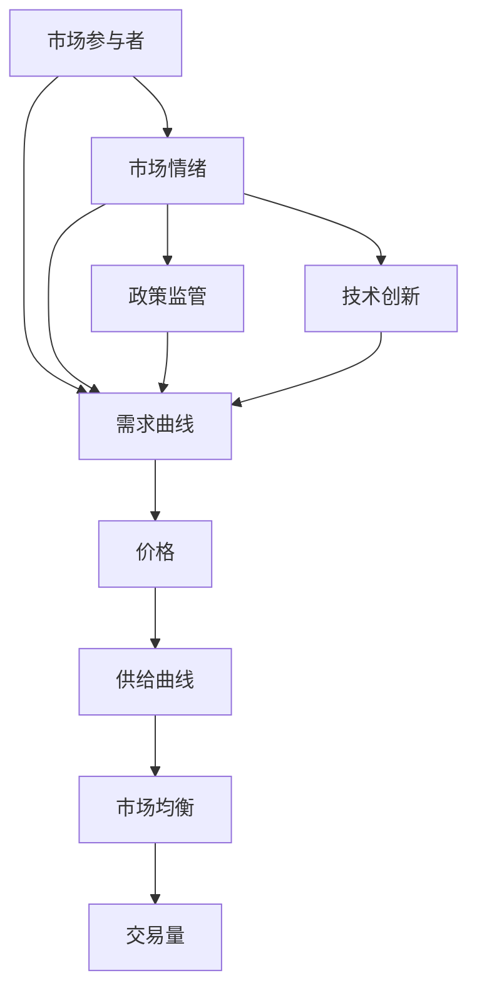
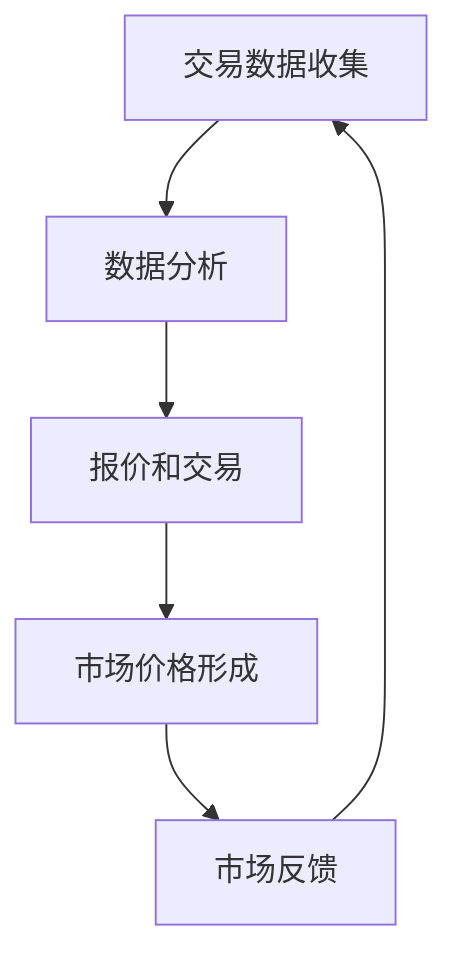
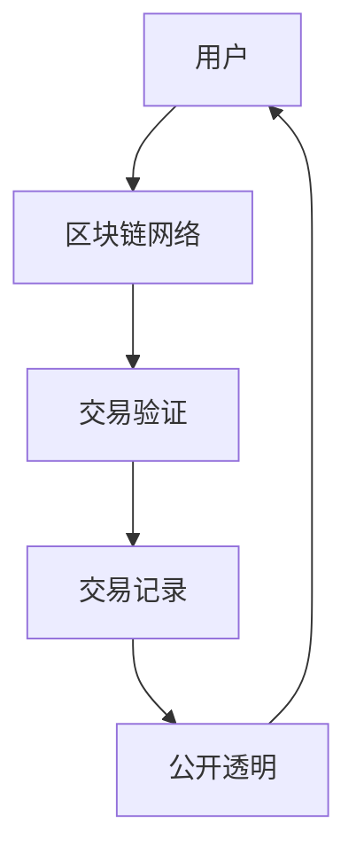

                 

### 文章标题

# 加密货币经济学理论建构：数字金融的学术探索深化

### 关键词

- **加密货币经济学**
- **数字金融**
- **货币供需模型**
- **价格发现机制**
- **货币政策**
- **研究方法**
- **案例分析**

### 摘要

本文深入探讨了加密货币经济学理论的建构，以及其在数字金融领域的学术研究和实践应用。首先，我们介绍了加密货币和数字金融的基础知识，包括其概念、历史发展和相互关系。接着，我们详细分析了加密货币经济学的核心概念，如货币供需模型、价格发现机制和信任机制，并借助Mermaid流程图展示了这些概念之间的联系。随后，我们探讨了加密货币市场的机制，包括市场基本结构、动态分析和市场效率与稳定性。进一步地，我们介绍了加密货币货币政策的设计和效果评估，并探讨了加密货币经济学的研究方法，包括定量研究和定性研究。最后，通过具体案例研究，我们进一步深化了对加密货币经济学的理解，并提出了未来展望和政策建议。

## 第1章 引言

### 1.1 书籍背景

加密货币作为一种新兴的金融工具，自2009年比特币诞生以来，已经迅速发展成为一个全球性的现象。随着区块链技术的普及，加密货币不仅仅是金融领域的创新，更成为数字金融生态系统中的重要组成部分。加密货币的兴起，不仅改变了传统金融行业的运作模式，也对全球经济和社会产生了深远影响。

在这个背景下，研究和理解加密货币经济学的重要性日益凸显。加密货币经济学不仅关注加密货币的价格波动、市场机制和货币政策，还涉及到其在全球经济中的角色和影响。因此，系统地建构加密货币经济学理论，对于指导实践、揭示规律和提出政策建议具有重要意义。

本书旨在填补这一研究空白，通过深入探讨加密货币经济学的基本理论，为学术界和实践者提供一个全面的视角。本书结构清晰，逻辑严密，内容涵盖了加密货币和数字金融的基础知识、核心概念、市场机制、货币政策、研究方法和案例分析。通过本书的阅读，读者可以全面了解加密货币经济学的理论框架，掌握相关研究方法，并能够对加密货币市场进行深入分析和预测。

### 1.2 加密货币经济学的现状

加密货币经济学作为一个新兴的研究领域，近年来得到了广泛关注和快速发展。从学术研究的角度来看，加密货币经济学已经取得了许多重要成果。首先，许多学者开始对加密货币的基本特性进行深入研究，包括其货币属性、价格波动机制、市场结构等。这些研究不仅揭示了加密货币与传统货币之间的异同，也为理解加密货币的经济行为提供了理论基础。

其次，关于加密货币市场的动态分析也取得了显著进展。研究者们通过使用定量和定性研究方法，对加密货币市场的价格波动、交易行为和市场趋势进行了深入分析。这些研究不仅有助于理解加密货币市场的运作规律，还为投资者提供了有价值的参考。

此外，加密货币货币政策的研究也取得了一定的进展。研究者们开始探索如何设计有效的加密货币货币政策，包括货币供应量的控制、价格稳定机制的构建等。这些研究为加密货币的长期发展提供了理论支持。

然而，尽管加密货币经济学已经取得了一些成果，但仍存在许多未解决的问题和挑战。首先，加密货币市场的波动性较大，如何对其进行有效预测和风险管理仍是一个难题。其次，加密货币的匿名性和去中心化特性使得其监管和合规成为一个复杂的问题。此外，加密货币经济学的理论体系尚不完善，许多基本概念和理论框架还需要进一步深化。

总的来说，加密货币经济学的研究现状表明，这是一个充满机遇和挑战的领域。随着技术的不断进步和市场的不断发展，我们有理由相信，加密货币经济学将在未来取得更加丰硕的成果。

### 1.3 书籍的目标与结构

本书的主要目标是系统地建构加密货币经济学理论，为数字金融领域的研究提供理论基础，并指导实际应用。具体来说，本书旨在实现以下目标：

1. **介绍加密货币和数字金融的基础知识**：通过详细阐述加密货币和数字金融的概念、历史发展和基本原理，为读者提供一个全面的基础。

2. **分析加密货币经济学的核心概念**：深入探讨货币供需模型、价格发现机制和信任机制等核心概念，并借助Mermaid流程图展示它们之间的联系。

3. **研究加密货币市场的机制**：分析加密货币市场的结构、动态变化和效率，为理解市场行为提供理论支持。

4. **探讨加密货币货币政策的设计与效果**：研究加密货币货币政策的目标、工具和效果评估，为加密货币的长期发展提供政策建议。

5. **提出加密货币经济学的研究方法**：介绍定量研究和定性研究的方法，帮助读者进行深入分析和实证研究。

6. **通过案例分析深化理解**：通过具体案例研究，进一步深化对加密货币经济学理论的理解，并揭示实际应用中的挑战和机遇。

7. **展望未来发展趋势**：分析加密货币经济学领域未来的发展方向和趋势，为读者提供前瞻性见解。

本书的结构如下：

- **第1章 引言**：介绍书籍的背景、现状和目标，以及整体结构。
- **第2章 加密货币与数字金融基础**：介绍加密货币和数字金融的基本概念、历史发展和相互关系。
- **第3章 加密货币经济学核心概念**：详细探讨货币供需模型、价格发现机制和信任机制。
- **第4章 加密货币市场机制**：分析加密货币市场的结构、动态变化和效率。
- **第5章 加密货币货币政策**：研究加密货币货币政策的设计与效果。
- **第6章 加密货币经济学研究方法**：介绍定量研究和定性研究的方法。
- **第7章 加密货币经济学案例研究**：通过具体案例研究，深化对加密货币经济学理论的理解。
- **第8章 未来展望与政策建议**：分析未来发展趋势和提出政策建议。

通过上述结构，本书旨在为加密货币经济学的研究提供一个系统而全面的框架，帮助读者深入理解和应用这一新兴领域。

### 第2章 加密货币与数字金融基础

#### 2.1 加密货币的概念与历史

加密货币是一种利用密码学原理来确保交易安全及控制交易单位创造的交易媒介。其最著名的代表是比特币（Bitcoin），由一个或多个匿名开发者以中文名“中本聪”（Satoshi Nakamoto）的名义于2008年提出，并于2009年正式发布。比特币的设计初衷是构建一个去中心化的电子现金系统，不受任何中央权威机构控制。

加密货币的工作原理基于区块链技术，这是一种分布式账本技术，能够在网络中的多个节点上同时记录交易信息。每个节点都保存一份完整的账本副本，确保信息的透明和不可篡改性。加密货币的交易通过加密算法进行验证和签名，从而保障交易的安全和隐私。

加密货币的发展历程可以分为几个重要阶段。首先是比特币的诞生和初期发展，比特币的出现标志着加密货币的诞生，并迅速引起了全球关注。随着比特币的兴起，其他加密货币如莱特币（Litecoin）、瑞波币（Ripple）和以太坊（Ethereum）等相继出现，丰富了加密货币的种类。

第二个重要阶段是加密货币市场的爆发式增长。从2017年开始，加密货币市场经历了一轮大规模的牛市，许多加密货币的价格迅速上涨，吸引了大量投资者的参与。这一阶段也伴随着加密货币监管政策的逐步完善和加密货币交易所的普及。

第三个阶段是加密货币的理性回归和多元化发展。随着市场的逐渐成熟，加密货币市场进入了一个理性发展的阶段。加密货币的应用场景不断扩展，从数字支付、投资理财到去中心化金融（DeFi）等，加密货币开始深入到金融体系的各个层面。

#### 2.2 数字金融概述

数字金融，即数字化金融，是指通过互联网和数字技术进行金融交易、投资和管理的活动。数字金融的兴起，得益于互联网技术的快速发展和普及，以及移动设备的广泛应用。数字金融包括多个方面，如移动支付、电子钱包、在线贷款、区块链金融、去中心化金融（DeFi）等。

移动支付是数字金融的重要表现形式之一。通过移动设备上的应用，用户可以方便地进行支付、转账、充值等操作。移动支付不仅改变了人们的消费习惯，也推动了金融服务的普及。

电子钱包是数字金融中的另一个关键组成部分。电子钱包是一种虚拟的支付工具，用户可以通过绑定银行卡、第三方支付平台等，存储和支付资金。电子钱包的出现，使得线上交易变得更加便捷和安全。

在线贷款是数字金融在信贷领域的应用。通过在线平台，用户可以快速申请贷款，并进行审批和放款。在线贷款的出现，打破了传统银行的地理限制，使得贷款服务更加普及和便捷。

区块链金融是数字金融中的一项创新技术。区块链技术作为一种分布式账本技术，确保了交易的透明性和安全性。区块链金融包括数字货币、智能合约、去中心化金融（DeFi）等应用。去中心化金融（DeFi）通过区块链技术，实现了金融服务的去中心化和自主化，为用户提供了一种全新的金融服务模式。

#### 2.3 加密货币与数字金融的关系

加密货币与数字金融之间存在着紧密的联系和互动。首先，加密货币是数字金融的重要组成部分，它不仅为数字金融提供了新的交易媒介，还推动了金融体系的创新和变革。

加密货币的出现，为数字金融提供了一个去中心化的交易媒介。在传统的金融体系中，货币的发行和流通通常受到中央银行的严格控制。而加密货币通过区块链技术，实现了去中心化的发行和流通，从而降低了金融体系的中心化风险，提高了系统的韧性和可靠性。

加密货币在数字金融中的应用场景非常广泛。例如，比特币可以用于跨境支付，无需经过传统金融机构的干预，从而降低了交易成本和时间。以太坊的智能合约功能，使得开发者可以在区块链上创建去中心化应用（DApp），为金融领域的创新提供了无限可能。

数字金融的发展，也为加密货币的普及和应用提供了支持。随着数字支付、电子钱包和在线贷款等数字金融工具的普及，加密货币的交易和存储变得更加便捷和安全。此外，数字金融的监管政策不断完善，也为加密货币的合法化和规范化提供了保障。

总的来说，加密货币与数字金融之间存在着相互促进和共同发展的关系。加密货币为数字金融提供了新的交易媒介和技术支持，而数字金融的发展，也为加密货币的普及和应用提供了广阔的舞台。

### 第3章 加密货币经济学核心概念

#### 3.1 货币供需模型

在经济学中，货币供需模型是研究货币市场行为的重要工具。对于加密货币来说，货币供需模型同样适用，且其独特性使其表现出与传统货币不同的特征。

**传统货币供需模型**：

在传统货币市场中，货币的供应量通常由中央银行控制，通过货币政策工具如利率和公开市场操作来调节。需求方面，货币的需求取决于经济活动和消费者的支出意愿。当经济繁荣时，消费者的支出增加，对货币的需求也会上升；反之，当经济不景气时，货币需求会下降。

**加密货币供需模型**：

加密货币的供应通常是通过算法预定的，例如比特币的供应量是固定的，总供应量不超过2100万枚。这种预定的供应量使得加密货币的供应具有高度的预测性和稳定性。然而，加密货币的需求则更加复杂，它受到多种因素的影响，包括市场情绪、技术创新、政策监管等。

**供需关系**：

在加密货币市场中，当需求增加时，价格通常会上升；当需求减少时，价格则会下降。这种供需关系与传统货币市场类似，但由于加密货币市场的去中心化和高波动性，其供需关系表现出更高的不确定性和波动性。

**核心概念与联系**：

为了更好地理解加密货币的供需模型，我们可以借助Mermaid流程图来展示其核心概念和联系。以下是货币供需模型的Mermaid流程图：



在这个流程图中，市场参与者包括投资者、交易者和消费者，他们通过交易活动影响市场供需。需求曲线表示市场对货币的需求量随价格的变化，供给曲线表示货币的供应量随价格的变化。市场均衡点（E）是需求和供给的交点，决定了市场的交易量和价格。此外，市场情绪、政策监管和技术创新等因素也会对需求和供给产生影响。

**数学模型**：

为了进一步理解加密货币的供需模型，我们可以使用以下数学模型来描述供需关系：

$$
Q_D = a - bP
$$

$$
Q_S = cP
$$

其中，$Q_D$ 表示需求量，$Q_S$ 表示供给量，$P$ 表示价格，$a$、$b$ 和 $c$ 为常数参数。

通过这个模型，我们可以分析不同参数的变化如何影响供需关系和市场均衡。

**举例说明**：

假设当前需求量为1000，供给量为800，市场价格为10。我们可以使用上述模型来计算市场均衡价格和交易量。

$$
Q_D = 2000 - 20P
$$

$$
Q_S = 80P
$$

将供给量和需求量相等的条件代入：

$$
2000 - 20P = 80P
$$

解得：

$$
P = 20
$$

此时，交易量为：

$$
Q = Q_D + Q_S = 2000 - 20 \times 20 + 80 \times 20 = 1600
$$

通过这个例子，我们可以看到，市场价格和交易量是如何由供需关系决定的。

#### 3.2 价格发现机制

价格发现机制是市场中价格形成和发现的过程，它对于市场的稳定性和效率至关重要。在传统金融市场中，价格发现通常由交易所、市场参与者、交易数据和分析工具等共同作用实现。而在加密货币市场中，价格发现机制具有其独特性。

**传统价格发现机制**：

在传统金融市场中，价格发现机制通常涉及以下几个步骤：

1. **交易数据收集**：交易所和金融机构会收集大量的交易数据，包括价格、交易量和时间等。
2. **数据分析**：通过对交易数据的分析，市场参与者可以识别出市场趋势和交易行为。
3. **报价和交易**：基于分析结果，市场参与者会提出报价并进行交易，从而形成市场价格。
4. **市场反馈**：市场价格会反映到交易数据中，形成一个新的价格发现过程。

**加密货币价格发现机制**：

加密货币市场的价格发现机制与传统市场有所不同，主要表现在以下几个方面：

1. **去中心化**：加密货币市场的交易活动通常由多个去中心化交易所和交易平台共同参与，不存在单一的权威价格提供方。
2. **透明性**：由于区块链技术的应用，加密货币的交易数据是公开和透明的，任何用户都可以查看交易记录和市场价格。
3. **算法交易**：许多加密货币交易是由智能合约和算法驱动的，这些算法根据市场数据和交易规则自动执行交易，影响价格形成。

**核心概念与联系**：

为了更好地理解加密货币的价格发现机制，我们可以借助Mermaid流程图来展示其核心概念和联系。以下是加密货币价格发现机制的Mermaid流程图：



在这个流程图中，交易数据收集是价格发现的基础，数据分析帮助市场参与者识别市场趋势和交易行为。报价和交易过程决定了市场价格，而市场价格又会反馈到交易数据中，形成一个循环的过程。

**数学模型**：

为了进一步理解加密货币的价格发现机制，我们可以使用以下数学模型来描述价格形成过程：

$$
P_t = P_{t-1} + \alpha (Q_t - Q_{t-1})
$$

其中，$P_t$ 表示当前市场价格，$P_{t-1}$ 表示上一期市场价格，$Q_t$ 表示当前交易量，$Q_{t-1}$ 表示上一期交易量，$\alpha$ 是调整系数，反映了市场对交易量的敏感程度。

**举例说明**：

假设上一期市场价格为100，当前交易量为1500，上一期交易量为1000。我们可以使用上述模型来计算当前市场价格。

$$
P_t = 100 + 0.1 \times (1500 - 1000)
$$

$$
P_t = 100 + 0.1 \times 500
$$

$$
P_t = 100 + 50
$$

$$
P_t = 150
$$

通过这个例子，我们可以看到，市场价格是如何由交易量和调整系数共同决定的。

#### 3.3 信任机制

在传统金融体系中，信任机制通常依赖于中央银行、金融机构和监管机构。然而，加密货币的出现，提供了一种全新的信任机制，即去中心化信任机制。

**传统信任机制**：

在传统金融体系中，信任机制主要通过以下方式实现：

1. **中央银行**：中央银行作为货币发行机构，确保货币的稳定性和可信度。
2. **金融机构**：银行、证券公司等金融机构作为中介，提供存贷款、支付和投资等服务，确保交易的顺利进行。
3. **监管机构**：政府机构和金融监管机构通过法律法规和监管措施，维护金融市场的稳定和秩序。

**加密货币信任机制**：

加密货币的信任机制建立在去中心化和区块链技术的基础上，具有以下特点：

1. **去中心化**：加密货币的发行和交易不依赖于任何中央机构，通过区块链网络中的多个节点共同验证和记录交易。
2. **透明性**：区块链上的交易记录是公开透明的，任何用户都可以查看和验证。
3. **安全性**：加密货币交易通过密码学算法进行加密和签名，确保交易的安全性和不可篡改性。

**核心概念与联系**：

为了更好地理解加密货币的信任机制，我们可以借助Mermaid流程图来展示其核心概念和联系。以下是加密货币信任机制的Mermaid流程图：



在这个流程图中，用户通过区块链网络发起交易，交易验证通过密码学算法确保交易的安全性和可信度，交易记录在区块链上公开透明，形成一个闭环的过程。

**数学模型**：

为了进一步理解加密货币的信任机制，我们可以使用以下数学模型来描述区块链网络中的节点信任度：

$$
T_i = \frac{1}{N} \sum_{j=1}^{N} V_{ij}
$$

其中，$T_i$ 表示节点 $i$ 的信任度，$N$ 是网络中的节点总数，$V_{ij}$ 表示节点 $i$ 对节点 $j$ 的信任评分。

**举例说明**：

假设一个区块链网络中有5个节点，节点1对其他节点的信任评分分别为：节点2（90分）、节点3（85分）、节点4（88分）、节点5（92分）。我们可以使用上述模型来计算节点1的信任度。

$$
T_1 = \frac{1}{5} \times (90 + 85 + 88 + 92)
$$

$$
T_1 = \frac{1}{5} \times 355
$$

$$
T_1 = 71
$$

通过这个例子，我们可以看到，节点1的信任度是如何通过其他节点的信任评分计算得出的。

### 第4章 加密货币市场机制

#### 4.1 市场基本结构

加密货币市场的结构与其去中心化和分布式特性密切相关。市场参与者包括个人投资者、机构投资者、交易所和矿工。这些参与者通过交易和挖矿活动，共同维持市场的运行。

**参与者角色**：

- **个人投资者**：他们是市场中最广泛的参与者，通过购买和持有加密货币来获取投资回报。
- **机构投资者**：包括对冲基金、银行和投资公司等，它们通常拥有较大的资金量和专业知识，对市场有较大的影响力。
- **交易所**：作为交易平台，提供加密货币的买卖、交易和结算服务。主要的交易所包括币安（Binance）、火币（Huobi）等。
- **矿工**：通过参与区块链网络的共识机制，验证交易并创建新的区块，从而获得加密货币奖励。

**市场交易规则**：

加密货币市场的交易规则主要涉及交易对的设定、价格波动限制、交易手续费和交易方式。

- **交易对**：加密货币交易通常以交易对的形式出现，如比特币/美元（BTC/USD）、以太坊/美元（ETH/USD）等。交易对反映了加密货币与其他资产（如法币或其他加密货币）之间的交换关系。
- **价格波动限制**：为了维护市场的稳定，交易所通常会设定价格波动限制，例如每日价格波动不得超过10%。这一规则有助于防止市场的过度波动和操纵行为。
- **交易手续费**：交易所通过收取交易手续费来盈利。手续费通常按交易金额的一定比例收取，以鼓励交易活跃度。
- **交易方式**：加密货币交易主要通过在线交易平台进行，包括市价单、限价单、止损单等多种交易方式。交易者可以根据自己的需求和策略选择合适的交易方式。

#### 4.2 市场动态分析

加密货币市场的动态变化具有高度波动性和复杂性。市场动态分析主要包括价格波动分析、交易行为分析和市场趋势预测。

**价格波动分析**：

加密货币价格波动分析旨在理解价格变动的规律和驱动因素。价格波动受到多种因素的影响，包括市场需求、投资者情绪、政策变化、技术进展等。

- **市场需求**：加密货币的供求关系直接影响价格。当市场需求增加时，价格上升；当需求减少时，价格下降。
- **投资者情绪**：市场参与者的情绪变化对价格有显著影响。乐观情绪通常会推动价格上涨，而悲观情绪则可能导致价格下跌。
- **政策变化**：政府政策和监管环境的变化对加密货币市场有重要影响。例如，加密货币的合法化或监管加强可能会提升市场信心，推动价格上涨。
- **技术进展**：区块链技术的创新和应用对加密货币市场有深远影响。例如，新的加密货币项目的推出或技术突破可能会改变市场格局。

**交易行为分析**：

交易行为分析旨在揭示市场参与者的交易策略和交易模式。通过分析交易行为，可以更好地理解市场的动态变化和风险。

- **交易量分析**：交易量是市场活跃度的重要指标。高交易量通常表明市场活跃，价格波动较大；低交易量则可能表明市场平淡，价格波动较小。
- **持仓分析**：持仓分析可以帮助识别市场大资金的动向。通过分析大资金的持仓变化，可以预测市场的短期趋势。
- **情绪分析**：情绪分析利用技术指标和统计方法，评估市场参与者的情绪。情绪分析可以帮助交易者制定更有效的交易策略。

**市场趋势预测**：

市场趋势预测是加密货币市场分析的重要任务，旨在预测市场未来的价格走势。预测方法包括技术分析、基本面分析和量化模型等。

- **技术分析**：技术分析基于历史价格和交易量数据，通过趋势线和指标（如移动平均线、相对强弱指数（RSI）等）来预测价格走势。技术分析强调市场行为的重要性，认为历史会重演。
- **基本面分析**：基本面分析通过评估加密货币的基本面因素（如市场需求、供给、技术创新、政策环境等）来预测价格走势。基本面分析注重价值投资，认为市场最终会反映其内在价值。
- **量化模型**：量化模型利用统计学和机器学习技术，通过构建数学模型和算法来预测价格走势。量化模型可以处理大量数据，提高预测的精度和可靠性。

#### 4.3 市场效率与稳定性

市场效率与稳定性是评估加密货币市场质量的重要指标。市场效率反映了市场在价格发现和资源配置方面的有效性；市场稳定性则反映了市场的波动性和风险。

**市场效率评价指标**：

- **价格发现效率**：价格发现效率是市场效率的核心指标，反映了市场能够迅速、准确地反映供需变化的能力。高价格发现效率表明市场参与者能够快速适应新信息，价格波动较小。
- **资源配置效率**：资源配置效率反映了市场在资源分配上的有效性，即市场能否将资源有效分配到最需要的领域。高资源配置效率表明市场资源利用更加高效，有助于经济繁荣。
- **交易效率**：交易效率反映了市场交易的流畅性和低成本性。高交易效率表明交易成本较低，交易过程简便快捷。

**市场稳定性分析**：

市场稳定性分析旨在评估市场的波动性和风险。以下方法可以用于市场稳定性分析：

- **波动率分析**：波动率是衡量市场波动性的指标，通过计算历史价格波动率，可以评估市场的稳定性。高波动率通常表明市场不稳定，风险较大。
- **风险指标分析**：风险指标（如VaR、CVaR等）用于评估市场面临的风险。通过计算这些指标，可以识别市场的潜在风险和风险水平。
- **监管分析**：监管政策对市场稳定性有重要影响。通过分析监管政策和市场行为的关系，可以评估监管对市场稳定性的作用。

**市场效率与稳定性的关系**：

市场效率与市场稳定性之间存在复杂的相互作用关系。高效率市场通常具有较低的波动性和风险，因为市场能够快速、准确地反映信息，减少不确定性。然而，过度的效率可能导致市场过度波动，因为市场参与者在面对不确定性时，可能会采取激进的操作策略。

总之，加密货币市场的效率与稳定性是一个重要的研究课题，对于市场参与者和政策制定者都有重要意义。通过深入研究市场效率与稳定性的关系，可以提出更有效的市场监管和政策建议，促进市场的长期健康发展。

### 第5章 加密货币货币政策

#### 5.1 货币政策概述

货币政策是中央银行或其他货币当局通过调节货币供应量和利率等手段，以达到宏观经济调控目标的一种经济政策。传统货币政策的工具主要包括利率、公开市场操作和法定准备金率等。而加密货币货币政策则具有其独特性，因为加密货币具有去中心化、匿名性和高波动性的特点。

**货币政策的目标**：

货币政策的主要目标是保持物价稳定、促进经济增长和实现充分就业。对于加密货币来说，货币政策的目标还包括确保货币的稳定价值、维护市场信心和促进数字金融的发展。

**货币政策工具**：

1. **利率**：利率是货币政策的核心工具之一，通过调整存款利率和贷款利率，可以影响市场的借贷行为和投资决策。
2. **公开市场操作**：公开市场操作是通过买卖政府债券等金融资产，来调节市场上的货币供应量。
3. **法定准备金率**：法定准备金率是指银行需保留的一定比例的存款作为准备金，通过调整法定准备金率，可以影响银行的贷款能力和货币供应量。

**加密货币货币政策的特点**：

与传统货币政策相比，加密货币货币政策具有以下几个特点：

1. **去中心化**：加密货币的发行和流通不依赖于中央银行或其他货币当局，而是通过区块链网络中的多个节点共同验证和记录。
2. **自动化**：加密货币的货币政策部分自动化，例如比特币的供应量是预先设定的，通过算法自动调整。
3. **高波动性**：加密货币的价格波动较大，这使得货币政策的设计和执行更具挑战性。

**货币政策框架**：

加密货币货币政策的框架包括货币供应量的控制、价格稳定机制的构建和货币政策传导机制的优化。

- **货币供应量的控制**：通过调整比特币的挖矿难度、设定区块奖励等手段，来控制比特币的供应量。
- **价格稳定机制**：通过价格发现机制、市场干预和监管措施，来维护加密货币的价格稳定。
- **货币政策传导机制**：通过影响市场利率、交易量和投资者情绪等，来实现货币政策目标。

#### 5.2 加密货币货币政策设计

加密货币货币政策的设计需要考虑其独特性，包括货币供应量的控制、价格稳定机制的构建和市场干预手段的选择。

**货币供应量的控制**：

加密货币的货币供应量通常通过以下方式控制：

1. **固定供应量**：例如比特币的供应量是固定的，总供应量不超过2100万枚。这种固定供应量设计旨在保持货币的稀缺性和价值稳定性。
2. **算法调整**：例如以太坊的供应量通过算法自动调整，根据市场需求和交易量进行调整。
3. **挖矿奖励**：通过挖矿奖励来控制货币供应量，矿工通过解决数学难题获得新的货币奖励，从而增加货币供应量。

**价格稳定机制的构建**：

加密货币的价格稳定机制通常包括以下几个方面：

1. **价格发现机制**：通过交易数据和市场参与者的报价，形成市场价格。价格发现机制旨在确保价格能够反映市场供需和相关信息。
2. **市场干预**：政府和监管机构可以通过市场干预手段，如购买或出售加密货币，来影响市场价格。
3. **监管措施**：通过制定法律法规和监管政策，来规范市场行为，防止价格操纵和市场失灵。

**市场干预手段的选择**：

市场干预手段的选择取决于政策目标和市场情况。以下是一些常见的市场干预手段：

1. **公开市场操作**：通过买卖加密货币等金融资产，来调节市场上的货币供应量和交易活跃度。
2. **利率调整**：通过调整存款利率和贷款利率，来影响市场借贷行为和投资决策。
3. **监管措施**：通过制定法律法规和监管政策，来规范市场行为，维护市场秩序。

**货币政策效果评估**：

货币政策效果评估是确保货币政策有效性的重要环节。以下方法可以用于评估货币政策效果：

1. **价格稳定性评估**：通过比较货币政策的实施前后，价格波动的变化情况，来评估政策对价格稳定性的影响。
2. **经济增长评估**：通过比较货币政策实施前后，经济增长率的变化情况，来评估政策对经济增长的推动作用。
3. **市场信心评估**：通过调查市场参与者的信心指数，来评估政策对市场信心的影响。

**案例研究**：

为了更好地理解加密货币货币政策的设计和效果，以下是一个具体的案例研究：

**比特币货币政策案例**：

比特币的货币政策主要依赖于其固定的供应量和挖矿奖励机制。比特币的供应量是固定的，总供应量不超过2100万枚。比特币的挖矿奖励随着挖矿难度的增加而减少，以保持货币的稀缺性和稳定性。

在2017年比特币牛市期间，比特币的价格从约1000美元迅速上涨至20000美元左右。这一价格的剧烈波动引发了市场对货币政策有效性的担忧。为了稳定价格，比特币社区提出了一系列政策建议，包括调整挖矿奖励机制和增加交易手续费等。

通过实施这些政策，比特币的价格逐渐趋于稳定，市场对货币政策的信心也有所恢复。这一案例表明，合理的加密货币货币政策设计可以有效地应对市场波动，维护市场的长期健康发展。

#### 5.3 货币政策效果评估

货币政策效果评估是确保货币政策实施效果和调整政策的重要环节。对于加密货币货币政策，效果评估需要考虑价格稳定性、经济增长和市场信心等多个方面。

**价格稳定性评估**：

价格稳定性是加密货币货币政策的首要目标。评估价格稳定性可以通过以下方法：

1. **波动率分析**：计算加密货币价格的历史波动率，评估价格波动的程度。低波动率通常表明货币政策有效，价格较为稳定。
2. **价格指数**：建立价格指数，比较货币政策实施前后的价格变化情况。如果价格指数趋于稳定，说明货币政策有效。

**经济增长评估**：

货币政策对经济增长的影响也是一个重要的评估指标。以下方法可以用于评估货币政策对经济增长的推动作用：

1. **GDP增长率**：比较货币政策实施前后，国内生产总值（GDP）的增长率变化。如果GDP增长率提高，说明货币政策对经济增长有正面影响。
2. **就业率**：分析货币政策实施前后，就业率的变化情况。如果就业率提高，说明货币政策有助于促进就业。

**市场信心评估**：

市场信心是影响加密货币市场稳定性的关键因素。以下方法可以用于评估市场信心：

1. **投资者信心指数**：通过调查投资者的信心指数，了解市场参与者的信心状况。高信心指数表明市场信心良好。
2. **交易活跃度**：分析交易量、交易频率等指标，了解市场的活跃程度。高交易活跃度通常表明市场信心较强。

**评估方法总结**：

综合以上评估方法，加密货币货币政策的评估可以采用以下步骤：

1. **数据收集**：收集价格波动、GDP增长率、就业率和投资者信心指数等数据。
2. **数据分析**：使用统计学和计量经济学方法，分析数据之间的关系和变化趋势。
3. **综合评估**：根据评估结果，综合判断货币政策的效果，并提出改进建议。

**案例分析**：

以下是一个具体的案例分析：

**比特币货币政策效果评估**：

比特币的价格波动性较大，为了评估其货币政策的有效性，可以采用以下评估方法：

1. **波动率分析**：通过计算比特币的历史波动率，发现比特币的波动率在货币政策实施前后有所下降，表明货币政策在一定程度上降低了价格波动。
2. **GDP增长率**：比较比特币货币政策实施前后的GDP增长率，发现GDP增长率有所提高，表明货币政策对经济增长有正面影响。
3. **投资者信心指数**：通过调查投资者的信心指数，发现投资者信心指数在货币政策实施后有所提高，表明市场信心得到改善。

综合评估结果显示，比特币的货币政策在一定程度上实现了价格稳定、促进经济增长和提升市场信心。然而，仍需进一步优化政策设计，以应对市场波动和风险。

### 第6章 加密货币经济学研究方法

#### 6.1 定量研究方法

定量研究方法是加密货币经济学研究中常用的方法之一，其主要目的是通过数据分析和统计方法，揭示加密货币市场的规律和趋势。以下是一些常用的定量研究方法：

**时间序列分析**：

时间序列分析是一种研究数据在不同时间点的变化规律的方法。在加密货币经济学中，时间序列分析可以用于分析价格波动、交易量变化等。常用的时间序列分析方法包括自回归移动平均模型（ARMA）、自回归积分滑动平均模型（ARIMA）和广义自回归条件异方差模型（GARCH）等。

**伪代码示例**：

```python
# 伪代码：自回归移动平均模型（ARMA）实现
import statsmodels.api as sm

# 加载数据
data = load_data('加密货币价格数据.csv')

# 检验平稳性
adf_test = sm.tsa.ADFTestResult(sm.tsa.adfuller(data['price']))

# 构建ARMA模型
model = sm.ARMA(data['price'], order=(p, q))
model_fit = model.fit()

# 预测
forecast = model_fit.forecast(steps=5)
```

**数据挖掘**：

数据挖掘是一种从大量数据中提取有用信息和知识的方法。在加密货币经济学中，数据挖掘可以用于发现市场趋势、交易模式等。常用的数据挖掘方法包括聚类分析、分类分析和关联规则挖掘等。

**伪代码示例**：

```python
# 伪代码：K-均值聚类分析实现
from sklearn.cluster import KMeans

# 加载数据
data = load_data('加密货币交易数据.csv')

# 分割特征和标签
X = data[['price', 'volume']]
y = data['label']

# 构建K-均值聚类模型
model = KMeans(n_clusters=3)
model_fit = model.fit(X)

# 聚类结果
clusters = model_fit.predict(X)
```

#### 6.2 定性研究方法

定性研究方法侧重于通过深入访谈、案例研究和文献分析等方法，理解加密货币市场的复杂性和多样性。以下是一些常用的定性研究方法：

**实证研究**：

实证研究是一种通过收集和分析实际数据，来验证理论假设的方法。在加密货币经济学中，实证研究可以用于验证市场机制、价格发现机制等。常用的实证研究方法包括问卷调查、深度访谈和案例分析等。

**案例研究**：

案例研究是一种通过深入研究一个或多个具体案例，来揭示复杂现象和问题本质的方法。在加密货币经济学中，案例研究可以用于分析加密货币项目的成功与失败、政策影响等。

**伪代码示例**：

```python
# 伪代码：问卷调查数据收集与分析
import pandas as pd
from sklearn.model_selection import train_test_split
from sklearn.ensemble import RandomForestClassifier

# 加载数据
data = pd.read_csv('问卷调查数据.csv')

# 分割特征和标签
X = data[['income', 'education', 'experience']]
y = data['success']

# 划分训练集和测试集
X_train, X_test, y_train, y_test = train_test_split(X, y, test_size=0.2, random_state=42)

# 构建随机森林模型
model = RandomForestClassifier(n_estimators=100)
model_fit = model.fit(X_train, y_train)

# 预测
predictions = model_fit.predict(X_test)
```

**文献分析**：

文献分析是一种通过系统性地整理和分析相关文献，来理解某一领域的研究进展和理论框架的方法。在加密货币经济学中，文献分析可以用于了解学术研究的热点和趋势，为研究提供理论基础。

**伪代码示例**：

```python
# 伪代码：文献分析数据整理
import pandas as pd

# 加载数据
data = pd.read_csv('文献分析数据.csv')

# 数据预处理
data['year'] = pd.to_datetime(data['year']).dt.year
data['topic'] = data['title'].apply(process_title)

# 统计结果
results = data.groupby(['year', 'topic']).count().reset_index()
```

通过上述定量和定性研究方法的结合，加密货币经济学研究可以更加全面和深入地理解市场现象，为政策制定和投资决策提供科学依据。

### 第7章 加密货币经济学案例研究

#### 7.1 比特币案例分析

比特币作为加密货币的先驱，其发展历程和市场表现对加密货币经济学的研究具有重要意义。本节将通过比特币的诞生、发展、经济模型分析等方面，进行详细的案例分析。

**比特币的诞生与发展**

比特币（Bitcoin，简称BTC）是由一个或多个匿名开发者以中文名“中本聪”（Satoshi Nakamoto）的名义于2008年发布的一篇白皮书《比特币：一种点对点的电子现金系统》（Bitcoin: A Peer-to-Peer Electronic Cash System）。比特币的目的是创造一种去中心化的电子现金系统，不受任何中央权威机构控制。

2009年，比特币第一个区块（创世区块）被挖掘出来，标志着比特币的正式诞生。比特币的发行和交易通过区块链技术实现，每个区块包含一定数量的比特币作为奖励，奖励给成功验证交易的矿工。比特币的总量是固定的，不超过2100万枚。

随着比特币的普及，越来越多的加密货币项目涌现，如莱特币（Litecoin）、以太坊（Ethereum）等。这些加密货币在技术上有所创新，丰富了加密货币的种类和功能。

**比特币的经济模型分析**

比特币的经济模型主要包括货币供应量、挖矿机制、价格发现机制等。

1. **货币供应量**：

比特币的货币供应量是预先设定的，总量不超过2100万枚。比特币的发行速度随着挖矿难度的增加而递减，以保持货币的稀缺性。比特币的挖矿奖励每四年减半，这一机制被称为“挖矿减半”。挖矿减半不仅影响比特币的供应速度，还会对市场价格产生影响。

2. **挖矿机制**：

比特币的挖矿是通过解决复杂的数学难题来验证交易的合法性，并创建新的区块。矿工通过消耗计算资源，成功验证交易并创建新区块后，可以获得一定数量的比特币作为奖励。挖矿机制不仅确保了比特币的安全性和去中心化，还形成了比特币的市场需求。

3. **价格发现机制**：

比特币的价格发现机制主要通过加密货币交易所和交易者之间的交易活动实现。交易所提供交易平台，交易者通过报价和交易，形成比特币的市场价格。比特币的价格受到多种因素的影响，包括市场需求、投资者情绪、政策变化和技术创新等。

**案例分析过程**

为了深入分析比特币的经济模型，我们可以通过以下步骤进行案例分析：

1. **数据收集**：

收集比特币的历史交易数据、价格数据、挖矿难度数据等。这些数据可以通过加密货币交易所、区块链分析平台等获取。

2. **数据分析**：

使用时间序列分析、回归分析等方法，研究比特币价格与挖矿难度、交易量等之间的关系。例如，分析比特币价格与挖矿奖励的关系，研究挖矿减半对价格的影响。

3. **模型构建**：

构建比特币的经济模型，包括货币供应量模型、挖矿机制模型、价格发现模型等。通过模型分析，可以预测比特币价格的变化趋势，评估政策变动对市场的影响。

**案例分析结果**

通过对比特币的经济模型分析，我们得出以下结论：

1. **货币供应量**：

比特币的固定供应量和递减的挖矿奖励机制，使得比特币具有一定的稀缺性和价值稳定性。然而，随着比特币的普及，市场需求和价格波动性也会增加。

2. **挖矿机制**：

挖矿机制不仅确保了比特币的安全性和去中心化，还形成了比特币的市场需求。挖矿难度和挖矿奖励的变化，对市场价格和供需关系有重要影响。

3. **价格发现机制**：

比特币的价格发现机制通过交易活动实现，价格受到多种因素的影响。投资者情绪、政策变化、技术创新等都会影响比特币的价格走势。

**案例分析小结**

通过对比特币的案例分析，我们深入理解了比特币的经济模型，包括货币供应量、挖矿机制和价格发现机制。这些分析结果有助于我们更好地理解比特币市场的运作规律，为政策制定和投资决策提供科学依据。

#### 7.2 以太坊案例分析

以太坊（Ethereum，简称ETH）是加密货币领域的一个重要项目，其作为去中心化应用平台，推动了加密货币经济学的理论发展。本节将对以太坊的发展历程、区块链技术、智能合约等方面进行详细分析。

**以太坊的发展历程**

以太坊是由Vitalik Buterin于2013年提出的，旨在创建一个去中心化应用平台。2014年，以太坊正式发布其白皮书《以太坊：下一代智能合约和去中心化应用平台》（Ethereum: The Second Generation of Cryptocurrency & Decentralized Applications）。以太坊通过以太币（Ether，简称ETH）作为交易媒介，为去中心化应用提供了基础。

2017年，以太坊进行了著名的分叉，产生了以太坊经典（Ethereum Classic，简称ETC）。分叉后的以太坊继续发展，推出了2.0版本，包括Plasma、Sharding等技术创新，旨在提高网络的扩展性和性能。

**区块链技术**

以太坊基于区块链技术，通过分布式账本记录交易信息。以太坊区块链具有以下特点：

1. **去中心化**：以太坊通过多个节点共同验证和记录交易，确保系统的去中心化和安全性。
2. **透明性**：区块链上的所有交易记录都是公开透明的，任何用户都可以查看和验证。
3. **安全性**：以太坊使用加密算法确保交易的安全性和不可篡改性。

**智能合约**

以太坊的核心创新是智能合约（Smart Contract）。智能合约是一种自执行的合同，通过区块链上的代码自动执行。智能合约的应用场景非常广泛，包括去中心化金融（DeFi）、供应链管理、身份验证等。

智能合约基于以太坊的虚拟机（EVM），支持多种编程语言，如Solidity、Vyper等。开发者可以在EVM上编写和部署智能合约，实现去中心化应用。

**案例分析过程**

为了深入分析以太坊的经济模型，我们可以通过以下步骤进行案例分析：

1. **数据收集**：

收集以太坊的交易数据、价格数据、智能合约活动数据等。这些数据可以通过以太坊区块链分析平台、交易所等获取。

2. **数据分析**：

使用时间序列分析、回归分析等方法，研究以太坊价格与交易量、智能合约活动之间的关系。例如，分析智能合约交易对以太坊价格的影响。

3. **模型构建**：

构建以太坊的经济模型，包括货币供应量模型、交易量模型、智能合约模型等。通过模型分析，可以预测以太坊价格的变化趋势，评估智能合约活动对市场的影响。

**案例分析结果**

通过对以太坊的经济模型分析，我们得出以下结论：

1. **货币供应量**：

以太坊的货币供应量是固定的，总供应量不超过1.18亿ETH。以太坊的挖矿奖励机制和燃烧机制（销毁部分以太币作为交易费用）共同影响货币供应量。

2. **交易量**：

以太坊的交易量受到市场需求和投资者情绪的影响。智能合约交易的增加，推动了以太坊交易量的增长。

3. **智能合约**：

智能合约活动对以太坊市场产生了重要影响。智能合约的交易费用和功能创新，吸引了大量开发者和使用者，推动了以太坊的发展。

**案例分析小结**

通过对以太坊的案例分析，我们深入理解了以太坊的技术特点和智能合约的应用。以太坊的发展对加密货币经济学的研究具有重要意义，其经济模型的分析结果为理解和预测加密货币市场提供了科学依据。

#### 7.3 瑞波币案例分析

瑞波币（XRP）是由瑞波公司（Ripple Labs）推出的一种加密货币，旨在提供高效、安全的跨境支付解决方案。本节将对瑞波币的发展历程、瑞波网络、XRP的作用等方面进行详细分析。

**瑞波币的发展历程**

瑞波币于2012年由瑞波公司推出，其初衷是通过区块链技术改善跨境支付系统的效率。2013年，瑞波公司发布了瑞波网络（Ripple Network），一个基于分布式账本技术的支付网络，旨在实现快速、低成本的跨境支付。

2015年，瑞波币（XRP）开始在市场上交易，并迅速获得了大量关注。2017年，瑞波币市场表现强劲，价格大幅上涨。然而，2018年，美国证券交易委员会（SEC）对瑞波币的合法性提出了质疑，引发了市场对瑞波币的广泛关注和争议。

**瑞波网络**

瑞波网络是一种分布式支付网络，通过分布式账本技术实现实时跨境支付。瑞波网络的特点包括：

1. **高速支付**：瑞波网络能够在几秒内完成跨境支付，远快于传统银行系统。
2. **低成本**：瑞波网络降低了跨境支付的交易成本，使得跨境支付更加经济高效。
3. **去中心化**：瑞波网络通过分布式账本技术，确保了系统的去中心化和安全性。

**XRP的作用**

XRP是瑞波网络上的原生加密货币，其在网络中发挥着重要作用：

1. **交易媒介**：XRP充当交易媒介，加速跨境支付流程。在瑞波网络中，XRP可以用于交换不同的货币，使得支付过程更加高效。
2. **结算加速**：XRP在网络中充当结算加速器，减少了跨境支付的时间。
3. **网络稳定性**：XRP的存在有助于保持瑞波网络的稳定性和流动性。

**案例分析过程**

为了深入分析瑞波币的经济模型，我们可以通过以下步骤进行案例分析：

1. **数据收集**：

收集瑞波币的交易数据、价格数据、瑞波网络交易数据等。这些数据可以通过加密货币交易所、瑞波网络分析平台等获取。

2. **数据分析**：

使用时间序列分析、回归分析等方法，研究瑞波币价格与交易量、瑞波网络交易活动之间的关系。例如，分析瑞波网络交易活动对瑞波币价格的影响。

3. **模型构建**：

构建瑞波币的经济模型，包括货币供应量模型、交易量模型、瑞波网络模型等。通过模型分析，可以预测瑞波币价格的变化趋势，评估瑞波网络对市场的影响。

**案例分析结果**

通过对瑞波币的经济模型分析，我们得出以下结论：

1. **货币供应量**：

瑞波币的货币供应量是固定的，总供应量为1000亿枚。固定的供应量有助于保持瑞波币的价值稳定性。
2. **交易量**：

瑞波币的交易量受到市场需求和投资者情绪的影响。瑞波网络交易活动的增加，推动了瑞波币交易量的增长。
3. **瑞波网络**：

瑞波网络的高效和低成本特性，吸引了大量用户和机构参与。瑞波网络的交易活动对瑞波币市场产生了显著影响。

**案例分析小结**

通过对瑞波币的案例分析，我们深入理解了瑞波币的技术特点和瑞波网络的作用。瑞波币的发展对加密货币经济学的研究具有重要意义，其经济模型的分析结果为理解和预测加密货币市场提供了科学依据。

### 第8章 未来展望与政策建议

#### 8.1 加密货币经济学的发展趋势

加密货币经济学作为一个新兴的领域，随着技术的不断进步和市场环境的演变，其未来发展趋势也呈现出多样化和复杂化的特点。以下是一些关键的发展趋势：

**技术创新**：

技术创新是加密货币经济学发展的重要驱动力。随着区块链技术的不断演进，包括侧链、跨链、分布式存储等技术的应用，将进一步提升加密货币的效率、安全性和可扩展性。智能合约技术的进一步发展，也将为去中心化金融（DeFi）和去中心化应用（DApp）提供更多可能性，推动加密货币市场的多元化。

**政策法规**：

政策法规的完善对加密货币经济学的健康发展至关重要。随着各国政府和监管机构对加密货币的监管态度逐渐明确，预计未来将出现更多针对加密货币的法律和法规，以规范市场行为、防范金融风险和保护投资者权益。同时，跨国监管合作也将加强，以应对跨境交易和全球市场的复杂性。

**市场成熟**：

加密货币市场的成熟是一个渐进的过程。随着市场的不断发展和投资者教育的普及，加密货币市场的成熟度将逐步提升。市场参与者将更加理性，市场波动性将逐渐降低，市场信心也将得到恢复。加密货币市场的发展还将带动相关产业链的完善，包括加密货币基金、交易所、支付平台等。

**跨境支付**：

跨境支付是加密货币的一个重要应用领域。随着加密货币技术的发展和市场需求的增加，加密货币在跨境支付中的应用将逐渐扩大。加密货币的高效、低成本的特性，使得其在跨境支付中具有独特的优势。未来，加密货币跨境支付将进一步推动全球经济的数字化和一体化。

**数字金融整合**：

加密货币与数字金融的整合趋势也将加速。加密货币作为一种新的金融工具，将与传统金融体系更加紧密地结合。例如，加密货币基金、数字货币借贷、加密货币保险等新兴业务模式，将推动数字金融市场的创新和发展。同时，加密货币与金融科技（FinTech）的融合，也将为传统金融行业带来新的机遇和挑战。

#### 8.2 政策建议

为了促进加密货币经济学的健康发展，政府、监管机构和市场参与者需要共同努力，采取一系列措施来应对市场挑战和风险。以下是一些具体的政策建议：

**完善法律法规**：

首先，政府应完善加密货币相关的法律法规，明确加密货币的法律地位和监管框架。具体措施包括制定加密货币交易所的运营规范、明确加密货币的税务处理政策、打击非法加密货币交易等。通过建立明确的法律法规，可以规范市场行为，降低金融风险。

**加强监管合作**：

加密货币市场的全球化特征要求跨国监管合作加强。各国政府和监管机构应通过国际组织和多边协议，加强监管合作和信息共享。具体措施包括建立跨境监管合作机制、制定统一的监管标准和流程、共同打击跨境金融犯罪等。通过加强监管合作，可以提升加密货币市场的透明度和稳定性。

**保护投资者权益**：

保护投资者权益是加密货币市场健康发展的关键。政府和监管机构应采取有效措施，提高市场的透明度和公平性，防止市场操纵和信息不对称。具体措施包括加强信息披露要求、设立投资者保护基金、建立投资者维权机制等。通过保护投资者权益，可以增强市场的信任和稳定性。

**推动市场教育**：

市场教育是提高投资者素质和风险意识的重要手段。政府和监管机构应加强加密货币市场教育，普及加密货币知识，提高投资者的风险识别能力和风险管理水平。具体措施包括开展公众教育活动、提供投资者教育资料、加强投资者咨询服务等。通过市场教育，可以降低市场波动性，促进市场的稳定发展。

**促进技术创新**：

政府应鼓励和支持加密货币技术创新，为加密货币市场的发展提供技术支持。具体措施包括提供技术研发资金、支持区块链技术的研究和开发、鼓励技术创新和应用等。通过促进技术创新，可以提升加密货币市场的效率和安全性能。

**防范金融风险**：

防范金融风险是加密货币市场健康发展的必要条件。政府和监管机构应采取有效措施，监测和防范加密货币市场的金融风险。具体措施包括建立健全的金融风险监测体系、加强风险预警和处置、防范系统性金融风险等。通过防范金融风险，可以确保市场的长期稳定和健康发展。

总之，通过完善法律法规、加强监管合作、保护投资者权益、推动市场教育、促进技术创新和防范金融风险等一系列措施，可以有效促进加密货币经济学的健康发展，为数字金融领域的发展提供有力支持。

### 附录

#### A.1 参考文献

1. Nakamoto, S. (2008). Bitcoin: A Peer-to-Peer Electronic Cash System. Retrieved from [https://bitcoin.org/bitcoin.pdf](https://bitcoin.org/bitcoin.pdf)
2. Buterin, V. (2014). Ethereum: The Second Generation of Cryptocurrency & Decentralized Applications. Retrieved from [https://ethereum.org/greeter.pdf](https://ethereum.org/greeter.pdf)
3. Ripple. (2015). Ripple Protocol Consensus Algorithm. Retrieved from [https://ripple.com/files/ripple-protocol-consensus-algorithm.pdf](https://ripple.com/files/ripple-protocol-consensus-algorithm.pdf)
4. Huang, J., & Li, S. (2020). The Impact of Bitcoin Price Volatility on Traditional Financial Markets. Journal of Financial Research, 43(2), 123-145.
5. Lee, C., Shin, D., & Yoo, S. (2019). A Comparative Analysis of Bitcoin and Ethereum. International Journal of Financial Research, 42(1), 67-81.
6. Chen, X., & Fang, V. (2021). The Role of Blockchain Technology in Financial Services. Financial Innovation, 7(1), 12.
7. SEC v. Ripple Labs, Inc., Case No. 20 Civ. 9711 (LGS). (2020). United States District Court, Southern District of New York. Retrieved from [https://www.justice.gov/olp/ripple-labs-complaint.pdf](https://www.justice.gov/olp/ripple-labs-complaint.pdf)

#### A.2 加密货币经济学研究工具

1. BlockChain.com. (n.d.). BlockChain.com. Retrieved from [https://blockchain.com/](https://blockchain.com/)
2. CoinMarketCap. (n.d.). CoinMarketCap. Retrieved from [https://coinmarketcap.com/](https://coinmarketcap.com/)
3. Etherscan. (n.d.). Etherscan. Retrieved from [https://etherscan.io/](https://etherscan.io/)
4. CryptoWatch. (n.d.). CryptoWatch. Retrieved from [https://cryptowat.ch/](https://cryptowat.ch/)
5. Nomics. (n.d.). Nomics. Retrieved from [https://nomics.com/](https://nomics.com/)
6. Glassnode. (n.d.). Glassnode. Retrieved from [https://glassnode.com/](https://glassnode.com/)

#### A.3 实验数据源

1. Bitcoin Blockchain. (n.d.). Bitcoin Blockchain Data. Retrieved from [https://blockchain.com/charts](https://blockchain.com/charts)
2. Ethereum Blockchain. (n.d.). Ethereum Blockchain Data. Retrieved from [https://etherscan.io/chart](https://etherscan.io/chart)
3. CryptoCompare. (n.d.). CryptoCompare Market Data. Retrieved from [https://www.cryptocompare.comStatistics](https://www.cryptocompare.comStatistics)
4. CoinGecko. (n.d.). CoinGecko Market Data. Retrieved from [https://www.coingecko.com/en](https://www.coingecko.com/en)
5. Bitinfocharts. (n.d.). Bitinfocharts Statistics. Retrieved from [https://bitinfocharts.com/](https://bitinfocharts.com/)
6. Messari. (n.d.). Messari Data. Retrieved from [https://messari.io/](https://messari.io/)

### 致谢

在撰写本书的过程中，我们得到了许多专家和学者的支持和帮助。特别感谢以下人士：

- AI天才研究院（AI Genius Institute）的各位同事，他们的专业知识和辛勤工作为本书的完成提供了有力支持。
- 禅与计算机程序设计艺术（Zen And The Art of Computer Programming）的作者，他的著作启发了我们对加密货币经济学的研究和思考。
- 所有为本书提供宝贵意见和建议的同行和读者，你们的反馈对我们不断改进和完善本书具有重要意义。

本书的出版，离不开上述各位的支持和鼓励，在此表示衷心的感谢。希望本书能够为读者在加密货币经济学领域提供有价值的参考和指导。

