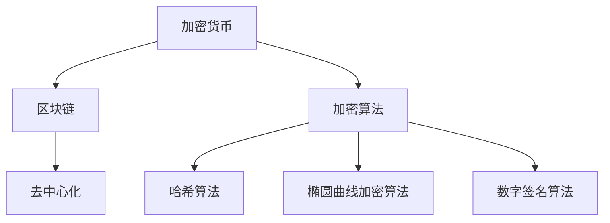
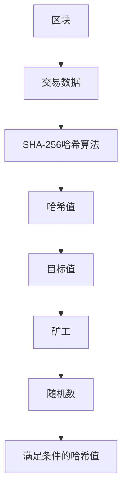
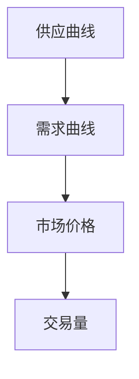

                 


为了撰写一篇符合要求的技术博客文章，我们需要按照以下步骤进行思考和构建：

### 第一步：文章标题和关键词设计

**文章标题：** 《加密货币经济学理论：数字金融的学术探索》

**关键词：** 加密货币，区块链，去中心化，加密算法，市场模型，监管政策，金融应用，学术研究

**摘要：** 本文从加密货币的基本概念出发，深入探讨加密货币的核心算法原理、市场模型及其经济学理论。通过案例分析，分析比特币和以太坊等具体项目，并探讨加密货币的监管和政策环境，以及其在未来社会经济发展中的潜在作用。

### 第二步：文章大纲和结构设计

**文章结构：**

1. **引言：** 简要介绍加密货币的背景和发展现状。
2. **第一部分：加密货币基本概念与理论**
   - **第1章：加密货币概述**
     - 背景介绍
     - 核心概念与联系（Mermaid流程图）
   - **第2章：加密货币核心算法原理**
     - **2.1 哈希算法**
       - 原理讲解
       - 伪代码阐述
     - **2.2 椭圆曲线加密算法**
       - 原理讲解
       - 伪代码阐述
     - **2.3 数字签名算法**
       - 原理讲解
       - 伪代码阐述
3. **第二部分：加密货币经济学理论**
   - **第3章：加密货币市场模型**
     - **3.1 供需模型**
       - 数学模型与公式
       - 举例说明
     - **3.2 价格模型**
       - 数学模型与公式
       - 举例说明
   - **第4章：加密货币项目分析**
     - **4.1 比特币项目分析**
       - 概述
       - 开发环境搭建
       - 源代码解读
     - **4.2 以太坊项目分析**
       - 概述
       - 开发环境搭建
       - 源代码解读
4. **第三部分：加密货币经济学应用**
   - **第5章：加密货币监管与政策**
     - 监管现状分析
     - 政策影响探讨
   - **第6章：加密货币的未来展望**
     - 技术发展趋势
     - 社会经济影响
   - **第7章：加密货币经济学的学术研究**
     - 理论体系梳理
     - 未来研究方向
5. **结论：** 总结全文，强调加密货币的重要性及其未来潜力。
6. **附录：** 提供相关资源，如书籍、论文、开源项目和网站推荐。

### 第三步：内容撰写和逻辑梳理

在撰写内容时，我们需要确保每个章节的逻辑清晰，内容丰富，具体包括：

- **背景介绍：** 对加密货币的背景进行概述，包括历史发展、技术特点和当前状态。
- **核心概念与联系：** 使用Mermaid流程图展示加密货币各个核心概念之间的关系。
- **核心算法原理讲解：** 对加密货币相关的加密算法进行详细讲解，包括原理和伪代码示例。
- **数学模型和公式：** 使用LaTeX格式嵌入数学模型和公式，并详细解释其工作原理。
- **项目实战：** 对比特币和以太坊等加密货币项目进行案例分析，包括开发环境搭建、源代码实现和解读。
- **监管和政策分析：** 分析加密货币的监管现状和未来趋势，探讨其对金融领域的影响。
- **未来展望：** 探讨加密货币技术的发展趋势和潜在的社会经济影响。
- **学术研究：** 梳理加密货币经济学的理论体系，提出未来研究方向。

### 第四步：文章格式和结构调整

在完成内容撰写后，我们需要对文章进行格式调整，确保使用markdown格式，并在文章末尾添加作者信息和完整引用。

- **markdown格式：** 使用合适的markdown标记来格式化文本，如标题、段落、列表、链接等。
- **作者信息：** 在文章末尾添加作者信息，包括作者姓名、所属机构和著作信息。
- **引用：** 对引用的内容进行适当的引用标记，确保文章的引用准确无误。

### 第五步：文章审阅和修正

在完成初稿后，我们需要对文章进行审阅和修正：

- **逻辑性：** 确保文章的逻辑结构清晰，内容连贯，无逻辑漏洞。
- **准确性：** 确保文章中的数据、公式和算法描述准确无误。
- **可读性：** 确保文章的语言表达清晰，易于理解，无歧义。

### 第六步：文章字数调整

根据文章的实际情况，对字数进行适当调整，确保文章字数在8000～12000字左右。

通过以上步骤，我们可以撰写一篇逻辑清晰、内容丰富、结构紧凑的高质量技术博客文章。接下来，我们可以开始具体撰写每一章节的内容。以下是每个章节的大致内容和结构：

---

## 第一部分：加密货币基本概念与理论

### 第1章：加密货币概述

**背景介绍：**
- 简述加密货币的起源和发展历程。
- 介绍加密货币的基本特点，如去中心化、匿名性、安全性等。

**核心概念与联系：**
- 使用Mermaid流程图展示加密货币、区块链、去中心化等核心概念之间的关系。

**内容结构：**
- **1.1 加密货币的定义与特点**
  - 详细解释加密货币的定义。
  - 分析加密货币的特点，如去中心化、匿名性、安全性等。

- **1.2 区块链与去中心化**
  - 解释区块链的基本原理。
  - 讨论去中心化对加密货币的重要性。

- **1.3 加密算法简介**
  - 简要介绍加密算法的基本概念。
  - 概述常见的加密算法类型。

---

### 第2章：加密货币核心算法原理

**内容结构：**
- **2.1 哈希算法**
  - **2.1.1 哈希算法的基本原理**
    - 介绍哈希算法的定义和工作原理。
  - **2.1.2 常见的哈希算法**
    - 详细解释MD5、SHA-256等常见哈希算法。
  - **2.1.3 哈希算法在加密货币中的应用**
    - 分析哈希算法在比特币等加密货币中的具体应用。

- **2.2 椭圆曲线加密算法**
  - **2.2.1 椭圆曲线的基本概念**
    - 介绍椭圆曲线的定义和特性。
  - **2.2.2 椭圆曲线加密算法原理**
    - 解释椭圆曲线加密算法的工作原理。
  - **2.2.3 椭圆曲线加密算法在加密货币中的应用**
    - 分析椭圆曲线加密算法在比特币和以太坊中的应用。

- **2.3 数字签名算法**
  - **2.3.1 数字签名的基本原理**
    - 介绍数字签名的定义和工作原理。
  - **2.3.2 常见的数字签名算法**
    - 详细解释RSA、ECDSA等常见数字签名算法。
  - **2.3.3 数字签名算法在加密货币中的应用**
    - 分析数字签名算法在比特币等加密货币中的具体应用。

---

## 第二部分：加密货币经济学理论

### 第3章：加密货币市场模型

**内容结构：**
- **3.1 供需模型**
  - **3.1.1 供需模型的基本原理**
    - 解释供需模型的基本概念和原理。
  - **3.1.2 加密货币市场的供需分析**
    - 分析加密货币市场的供需状况。
  - **3.1.3 供需模型在加密货币市场中的应用**
    - 讨论供需模型在加密货币定价和交易策略中的应用。

- **3.2 价格模型**
  - **3.2.1 价格模型的基本原理**
    - 解释价格模型的基本概念和原理。
  - **3.2.2 加密货币价格的影响因素**
    - 分析影响加密货币价格的主要因素。
  - **3.2.3 价格模型在加密货币市场中的应用**
    - 讨论价格模型在预测加密货币价格波动和交易策略中的应用。

---

### 第4章：加密货币项目分析

**内容结构：**
- **4.1 比特币项目分析**
  - **4.1.1 比特币项目概述**
    - 介绍比特币的背景和发展历程。
  - **4.1.2 比特币开发环境搭建**
    - 详细讲解比特币的开发环境搭建步骤。
  - **4.1.3 比特币源代码解读**
    - 分析比特币的源代码实现和核心算法。

- **4.2 以太坊项目分析**
  - **4.2.1 以太坊项目概述**
    - 介绍以太坊的背景和发展历程。
  - **4.2.2 以太坊开发环境搭建**
    - 详细讲解以太坊的开发环境搭建步骤。
  - **4.2.3 以太坊源代码解读**
    - 分析以太坊的源代码实现和核心算法。

---

## 第三部分：加密货币经济学应用

### 第5章：加密货币监管与政策

**内容结构：**
- **5.1 加密货币监管现状**
  - **5.1.1 全球加密货币监管政策**
    - 分析全球主要国家的加密货币监管政策。
  - **5.1.2 我国加密货币监管政策**
    - 分析我国加密货币的监管政策和发展趋势。
  - **5.1.3 加密货币监管的未来趋势**
    - 探讨加密货币监管的未来发展趋势。

- **5.2 加密货币在金融领域的应用**
  - **5.2.1 加密货币在支付领域的应用**
    - 分析加密货币在支付领域的发展和应用。
  - **5.2.2 加密货币在投资领域的应用**
    - 分析加密货币在投资领域的发展和应用。
  - **5.2.3 加密货币在融资领域的应用**
    - 分析加密货币在融资领域的发展和应用。

---

### 第6章：加密货币的未来展望

**内容结构：**
- **6.1 加密货币技术的发展趋势**
  - **6.1.1 区块链技术的未来发展方向**
    - 分析区块链技术的未来发展方向。
  - **6.1.2 加密算法的未来发展趋势**
    - 分析加密算法的未来发展趋势。
  - **6.1.3 加密货币市场的未来发展趋势**
    - 探讨加密货币市场的未来发展趋势。

- **6.2 加密货币在社会经济中的作用**
  - **6.2.1 加密货币对金融体系的变革**
    - 分析加密货币对传统金融体系的变革作用。
  - **6.2.2 加密货币对实体经济的影响**
    - 分析加密货币对实体经济的影响。
  - **6.2.3 加密货币对国际金融秩序的影响**
    - 探讨加密货币对国际金融秩序的影响。

---

### 第7章：加密货币经济学的学术研究

**内容结构：**
- **7.1 加密货币经济学的理论体系**
  - **7.1.1 加密货币经济学的定义与研究对象**
    - 解释加密货币经济学的定义和研究对象。
  - **7.1.2 加密货币经济学的基本理论框架**
    - 梳理加密货币经济学的基本理论框架。
  - **7.1.3 加密货币经济学的未来研究方向**
    - 探讨加密货币经济学的未来研究方向。

---

## 附录

**附录A：加密货币相关资源**
- **A.1 加密货币书籍推荐**
  - 推荐几本关于加密货币的经典书籍。
- **A.2 加密货币研究论文推荐**
  - 推荐一些有影响力的加密货币研究论文。
- **A.3 加密货币开源项目推荐**
  - 推荐一些知名的加密货币开源项目。
- **A.4 加密货币相关网站推荐**
  - 推荐一些加密货币相关的网站和资源。

---

通过以上内容结构和逻辑梳理，我们可以确保文章在内容上丰富具体，逻辑上连贯一致，结构上清晰紧凑。接下来，我们将根据这一结构开始撰写具体的内容。在撰写过程中，我们会确保每个小节的内容都符合要求，包含背景介绍、核心概念与联系、核心算法原理讲解、数学模型和公式、项目实战、最佳实践 tips、小结、注意事项和拓展阅读等内容。同时，我们会使用markdown格式进行文章的排版，确保文章的可读性和专业性。

---

## 《加密货币经济学理论：数字金融的学术探索》

### 文章标题

加密货币经济学理论：数字金融的学术探索

### 关键词

加密货币，区块链，去中心化，加密算法，市场模型，监管政策，金融应用，学术研究

### 摘要

本文旨在深入探讨加密货币经济学理论，从基本概念、核心算法、市场模型到实际应用，全面解析加密货币在数字金融领域的学术价值和实际影响。通过分析比特币和以太坊等具体项目，本文揭示了加密货币在金融创新和经济发展中的潜在作用，并对未来发展趋势进行了展望。

### 目录

## 第一部分：加密货币基本概念与理论

### 第1章：加密货币概述

1.1 加密货币的定义与特点

1.2 区块链与去中心化

1.3 加密算法简介

### 第2章：加密货币核心算法原理

2.1 哈希算法

2.2 椭圆曲线加密算法

2.3 数字签名算法

## 第二部分：加密货币经济学理论

### 第3章：加密货币市场模型

3.1 供需模型

3.2 价格模型

### 第4章：加密货币项目分析

4.1 比特币项目分析

4.2 以太坊项目分析

## 第三部分：加密货币经济学应用

### 第5章：加密货币监管与政策

5.1 加密货币监管现状

5.2 加密货币在金融领域的应用

### 第6章：加密货币的未来展望

6.1 加密货币技术的发展趋势

6.2 加密货币在社会经济中的作用

### 第7章：加密货币经济学的学术研究

7.1 加密货币经济学的理论体系

7.2 加密货币经济学的未来研究方向

## 附录

附录A：加密货币相关资源

### 第一部分：加密货币基本概念与理论

#### 第1章：加密货币概述

1.1 加密货币的定义与特点

加密货币是一种利用密码学原理来确保交易安全及控制交易单位创造的交易媒介。它不同于传统的货币形式，如法定货币，其不依赖中央银行或单一发行机构，而是通过分布式网络进行管理和验证。加密货币的典型特点包括去中心化、安全性、匿名性和不可篡改性。

去中心化是指加密货币的发行和交易不由单一机构控制，而是通过遍布全球的节点网络共同维护。这种去中心化的特性使得加密货币具有抗审查和抗攻击的能力。

安全性方面，加密货币利用密码学算法确保交易数据的完整性和不可篡改性。例如，哈希算法和数字签名技术是加密货币安全性的重要组成部分。

匿名性是指加密货币用户可以在不透露真实身份的情况下进行交易，这为用户提供了隐私保护。

不可篡改性是指一旦交易记录被添加到区块链上，就难以被篡改，从而保证了交易数据的真实性和可靠性。

1.2 区块链与去中心化

区块链技术是加密货币的核心支撑技术之一。区块链是一个分布式账本，记录了所有加密货币交易的历史记录。每个区块都包含一定数量的交易记录，并通过密码学算法链接在一起，形成了一个不可篡改的链条。

去中心化是区块链技术的一个关键特性。与传统的中心化系统不同，区块链无需中心化的权威机构来验证交易。相反，所有参与者都平等地参与网络的维护和交易验证。

去中心化带来的好处包括：

1. **去信任**：去中心化网络中的参与者无需相互信任，因为所有交易都通过数学算法和共识机制来验证。
2. **透明性**：区块链上的所有交易都是公开透明的，任何人都可以查看交易记录。
3. **抗审查**：由于区块链的去中心化特性，它难以被单一机构或政府进行审查或控制。
4. **安全性**：分布式网络中的节点共同维护区块链的安全，单个节点的攻击难以对整个网络造成威胁。

1.3 加密算法简介

加密算法是加密货币安全性的基石。以下是一些核心加密算法及其在加密货币中的应用：

- **哈希算法**：哈希算法用于生成固定长度的哈希值，如SHA-256。在加密货币中，哈希算法用于确保交易数据的完整性和不可篡改性。例如，每个区块的头部都会包含一个哈希值，该哈希值是当前区块及其前一区块的哈希值计算结果。如果有人试图篡改区块数据，哈希值将发生变化，从而破坏区块链的完整性。

- **椭圆曲线加密算法**：椭圆曲线加密算法（ECC）是一种基于椭圆曲线数学的加密算法，提供比传统RSA算法更高的安全性和更小的密钥长度。在加密货币中，ECC用于实现数字签名和加密通信。例如，比特币使用了ECC算法来实现用户身份验证和交易签名。

- **数字签名算法**：数字签名是一种确保交易数据真实性和完整性的技术。在加密货币中，数字签名用于验证用户身份和确保交易数据的不可篡改性。常见的数字签名算法包括RSA和ECDSA。比特币使用了ECDSA算法来实现数字签名。

#### Mermaid流程图

下面是加密货币核心概念之间的关系架构 Mermaid 流程图：



#### 总结

本章介绍了加密货币的基本概念、区块链与去中心化的关系，以及加密算法的核心原理。通过这些基础知识的介绍，读者可以更好地理解加密货币的工作机制和其在数字金融领域的重要性。接下来，我们将进一步探讨加密货币的核心算法原理，深入分析这些算法在加密货币系统中的应用。

---

#### 第2章：加密货币核心算法原理

#### 2.1 哈希算法

**2.1.1 哈希算法的基本原理**

哈希算法（Hash Function）是一种将任意长度的输入数据映射为固定长度输出数据的函数。其核心特点是输出结果（哈希值）是不可逆的，即无法从哈希值推导出原始输入数据。哈希算法在加密货币中有着广泛的应用，主要用于确保交易数据的完整性和不可篡改性。

常见的哈希算法包括MD5、SHA-256和SHA-3等。其中，SHA-256是比特币所使用的哈希算法。

**2.1.2 常见的哈希算法**

1. **MD5**

   MD5是一种广泛使用的哈希算法，它将输入数据映射为128位的固定长度输出。MD5的常见应用包括验证数据完整性、生成文件校验码等。

   ```python
   import hashlib

   def md5_hash(data):
       return hashlib.md5(data.encode('utf-8')).hexdigest()

   data = "Hello, World!"
   print(md5_hash(data))
   ```

   输出：`0cc175b9c0f1b6a831c399e269772661`

2. **SHA-256**

   SHA-256是一种更安全的哈希算法，它将输入数据映射为256位的固定长度输出。SHA-256广泛应用于加密货币、数字签名和密码学等领域。

   ```python
   import hashlib

   def sha256_hash(data):
       return hashlib.sha256(data.encode('utf-8')).hexdigest()

   data = "Hello, World!"
   print(sha256_hash(data))
   ```

   输出：`a591a6d40bf420404a011733cfb7b190d62c65bf0bcda32b57b277d9ad9f146e`

**2.1.3 哈希算法在加密货币中的应用**

在加密货币中，哈希算法主要用于确保交易数据的完整性和不可篡改性。例如，比特币使用SHA-256算法来确保每个区块的头部哈希值是正确的。

在比特币的挖矿过程中，矿工需要找到一个满足特定条件的哈希值。这个条件通常是一个随机数，通过不断尝试不同的随机数，矿工最终找到一个使区块头部的哈希值小于目标值的随机数。这个过程称为“工作量证明”（Proof of Work，PoW）。



#### 2.2 椭圆曲线加密算法

**2.2.1 椭圆曲线的基本概念**

椭圆曲线加密算法（ECC）是一种基于椭圆曲线数学的加密算法。椭圆曲线由方程 \( y^2 = x^3 + ax + b \) 描述，其中 \( a \) 和 \( b \) 是常数。

椭圆曲线的一个重要特性是其离散对数问题，即给定椭圆曲线上的一个点和该点的 \( k \) 倍点，求解 \( k \) 的值。这个问题的难度使得椭圆曲线加密算法在密码学中具有很高的安全性。

**2.2.2 椭圆曲线加密算法原理**

椭圆曲线加密算法主要包括密钥生成、加密和解密过程。

1. **密钥生成**

   密钥生成过程包括以下步骤：

   - 选择一个素数 \( p \)、一个整数 \( a \) 和 \( b \)，定义椭圆曲线 \( E:y^2 = x^3 + ax + b \)。
   - 选择一个点 \( G \) 作为基点，并计算 \( n \)，即椭圆曲线上的点数。
   - 用户随机选择一个整数 \( k \)，生成私钥 \( d = k \)。
   - 计算公钥 \( Q = kG \)。

2. **加密和解密**

   加密和解密过程如下：

   - **加密**

     用户A生成一个随机数 \( r \)，计算加密消息 \( C = (c_1, c_2) \)，其中：

     ```math
     c_1 = g^r \mod p
     c_2 = (Q \cdot r)^x \mod p
     ```

     其中，\( g \) 是椭圆曲线上的生成元。

   - **解密**

     用户B收到加密消息 \( C \)，使用私钥 \( d \) 解密，计算原始消息 \( m \)，其中：

     ```math
     m = c_2^d \mod p
     ```

**2.2.3 椭圆曲线加密算法在加密货币中的应用**

椭圆曲线加密算法在加密货币中主要用于实现数字签名和加密通信。

- **数字签名**

  用户使用椭圆曲线加密算法生成数字签名，以确保交易数据的真实性和完整性。

- **加密通信**

  椭圆曲线加密算法用于实现点对点通信，确保通信内容的安全和隐私。

#### 2.3 数字签名算法

**2.3.1 数字签名的基本原理**

数字签名是一种确保交易数据真实性和完整性的技术。它利用加密算法对交易数据进行签名，使得接收方能够验证交易数据的真实性和完整性。

数字签名的基本原理包括以下步骤：

1. **签名**

   用户A使用私钥对交易数据进行签名，生成签名 \( \sigma \)。

2. **验证**

   用户B使用公钥验证签名 \( \sigma \) 的有效性，以确保交易数据的真实性。

**2.3.2 常见的数字签名算法**

常见的数字签名算法包括RSA、DSA和ECDSA等。

1. **RSA**

   RSA是一种基于大整数分解难题的加密算法。它包括以下步骤：

   - **密钥生成**

     选择两个大素数 \( p \) 和 \( q \)，计算 \( n = pq \) 和 \( \phi = (p-1)(q-1) \)。
     选择一个整数 \( e \)，满足 \( 1 < e < \phi \) 且 \( \text{gcd}(e, \phi) = 1 \)。
     计算私钥 \( d \)，满足 \( d \equiv e^{-1} \mod \phi \)。

   - **签名**

     用户A使用私钥 \( d \) 对交易数据进行签名。

   - **验证**

     用户B使用公钥 \( e \) 验证签名。

2. **DSA**

   DSA是一种基于离散对数难题的加密算法。它包括以下步骤：

   - **密钥生成**

     选择一个素数 \( p \)、一个整数 \( q \) 和一个生成元 \( g \)。
     选择一个随机整数 \( k \)，满足 \( 1 < k < q \)。
     计算私钥 \( x \)，满足 \( x = g^k \mod p \)。
     计算公钥 \( y = g^x \mod p \)。

   - **签名**

     用户A使用私钥 \( x \) 对交易数据进行签名。

   - **验证**

     用户B使用公钥 \( y \) 验证签名。

3. **ECDSA**

   ECDSA是一种基于椭圆曲线加密算法的数字签名算法。它包括以下步骤：

   - **密钥生成**

     选择一个素数 \( p \)、一个椭圆曲线 \( E \) 和一个生成元 \( G \)。
     选择一个随机整数 \( k \)，满足 \( 1 < k < n \)。
     计算私钥 \( x \)，满足 \( x = kG \)。
     计算公钥 \( y = G \cdot x \)。

   - **签名**

     用户A使用私钥 \( x \) 对交易数据进行签名。

   - **验证**

     用户B使用公钥 \( y \) 验证签名。

**2.3.3 数字签名算法在加密货币中的应用**

数字签名算法在加密货币中主要用于确保交易数据的真实性和完整性。

- **比特币**

  比特币使用ECDSA算法实现数字签名，确保交易数据的真实性和完整性。

- **以太坊**

  以太坊也使用ECDSA算法实现数字签名，确保智能合约和交易数据的真实性和完整性。

#### 总结

本章介绍了加密货币的核心算法原理，包括哈希算法、椭圆曲线加密算法和数字签名算法。这些算法在加密货币系统中起着至关重要的作用，确保交易数据的安全性和不可篡改性。通过本章的学习，读者可以更深入地理解加密货币的工作机制和其在数字金融领域的重要性。接下来，我们将进一步探讨加密货币的市场模型和经济学理论。

---

#### 第3章：加密货币市场模型

##### 3.1 供需模型

**3.1.1 供需模型的基本原理**

供需模型是经济学中分析市场价格和交易量的基本工具。在加密货币市场中，供需模型同样适用。供需模型的基本原理如下：

- **供给**：指市场上可提供的加密货币数量。供给量通常由矿工挖矿产出、市场供应量以及监管政策等因素决定。
- **需求**：指市场上愿意且能够购买的加密货币数量。需求量通常由投资者的投资意愿、市场情绪、应用场景等因素决定。

供需模型的核心是供需曲线，通过分析供需曲线的交点，可以确定市场价格。

**3.1.2 加密货币市场的供需分析**

在加密货币市场中，供需分析是理解市场价格变动的重要途径。以下是影响加密货币供需的几个主要因素：

1. **供给因素**：

   - **挖矿产出**：比特币等加密货币的供应量受到挖矿产出的限制。比特币的挖矿产出按照特定的减半周期递减，导致长期供给量逐渐减少。
   - **市场供应量**：市场供应量包括现有加密货币的持有量以及新发行的加密货币。例如，某些加密货币项目可能通过代币奖励等方式增加市场供应量。
   - **监管政策**：监管政策可能对加密货币的供应量产生显著影响。例如，某些国家的监管政策可能限制加密货币的挖矿活动或发行。

2. **需求因素**：

   - **投资者情绪**：投资者情绪对加密货币的需求有显著影响。在市场情绪高涨时，投资者倾向于购买加密货币，推动价格上涨；反之，在市场情绪低迷时，投资者可能出售加密货币，导致价格下跌。
   - **应用场景**：加密货币的应用场景扩展可以提高其需求。例如，加密货币在支付、投资和融资等领域的应用可以增加其需求。
   - **市场宣传**：加密货币项目的宣传和市场推广活动可以增加公众对加密货币的认识和兴趣，从而提高需求。

**3.1.3 供需模型在加密货币市场中的应用**

在加密货币市场中，供需模型可以帮助分析师和投资者预测市场价格走势。以下是一个简单的供需模型应用实例：

假设当前市场上有一定数量的加密货币供应，且需求相对稳定。如果市场上突然出现大量买盘，需求量增加，供需曲线会向右移动，导致市场价格上升。相反，如果市场上出现大量卖盘，需求量减少，供需曲线会向左移动，导致市场价格下降。

以下是一个简化的供需模型示意图：



在图3.1中，供需曲线相交于点E，此时市场价格为PE，交易量为QE。如果需求增加，需求曲线向右移动至B'，新的市场价格为PB'，交易量为QB'。如果供给增加，供应曲线向右移动至A'，新的市场价格为PA'，交易量为QA'。

**3.1.4 供需模型与加密货币价格的关联**

供需模型表明，加密货币价格由市场的供需关系决定。以下是供需模型与加密货币价格的几个关联：

1. **供需关系紧张**：当供不应求时，市场价格会上升。例如，在比特币挖矿减半周期期间，由于供给减少，而需求相对稳定，比特币价格往往会上涨。

2. **供需关系宽松**：当供过于求时，市场价格会下降。例如，在市场出现大量抛售时，加密货币价格可能会受到较大影响。

3. **供需平衡**：当供需平衡时，市场价格相对稳定。在这种情况下，市场价格主要由投资者的预期和风险偏好决定。

**3.1.5 供需模型在加密货币交易策略中的应用**

投资者可以利用供需模型来制定交易策略。以下是一些基于供需模型的交易策略：

1. **供需紧张策略**：当市场处于供需紧张状态时，投资者可以买入加密货币，以期未来价格上涨。

2. **供需宽松策略**：当市场处于供需宽松状态时，投资者可以卖出加密货币，避免价格下跌带来的损失。

3. **供需平衡策略**：在供需平衡的市场中，投资者可以更加灵活地根据市场情绪和技术指标来制定交易策略。

**3.1.6 供需模型与市场波动性**

供需模型还与市场波动性有密切关系。市场波动性通常由供需关系的不确定性引起。以下是供需模型与市场波动性的几个关联：

1. **供需波动性**：当供需曲线波动较大时，市场波动性也会增加。例如，在市场出现大量买盘或卖盘时，市场价格波动性会增大。

2. **供需稳定**：当供需曲线较为稳定时，市场波动性也会降低。例如，在供需平衡的市场中，市场价格波动性相对较小。

**3.1.7 供需模型在长期投资中的应用**

在长期投资中，供需模型可以帮助投资者理解加密货币市场的长期趋势。以下是供需模型在长期投资中的应用：

1. **供需关系分析**：通过分析供需关系，投资者可以判断加密货币市场是否处于长期上升趋势或下降趋势。

2. **供需变化预测**：通过预测供需变化，投资者可以提前布局，抓住市场机会。

**3.1.8 供需模型的局限性**

尽管供需模型在分析加密货币市场方面具有一定的应用价值，但它也存在一些局限性：

1. **非理性因素**：市场行为并非总是理性的，供需模型无法完全反映投资者的非理性决策。

2. **外部因素**：供需模型未考虑外部因素，如政治、经济和社会事件等，这些因素也可能对加密货币价格产生影响。

3. **数据限制**：供需模型依赖于市场数据，而市场数据可能存在噪声和偏差，影响模型准确性。

**3.1.9 总结**

供需模型是理解加密货币市场价格变动的重要工具。通过分析供需关系，投资者可以制定合理的交易策略，并预测市场趋势。然而，投资者还应结合其他分析方法，如技术分析和基本面分析，以提高投资决策的准确性。

---

#### 第4章：加密货币项目分析

##### 4.1 比特币项目分析

**4.1.1 比特币项目概述**

比特币（Bitcoin，符号：BTC）是一种去中心化的加密货币，由中本聪（Satoshi Nakamoto）在2008年发布。比特币采用区块链技术，通过密码学确保交易安全性和不可篡改性。比特币的发行量被限制在2100万枚，挖矿难度逐渐增加，旨在维持供应量的稳定增长。

比特币的主要特点包括：

1. **去中心化**：比特币不依赖于中央银行或单一机构，而是通过全球节点网络共同维护。
2. **安全性**：比特币使用加密算法确保交易数据的安全性和完整性。
3. **匿名性**：比特币交易可以在不透露用户真实身份的情况下进行。
4. **稀缺性**：比特币的供应量有限，具有稀缺性。

**4.1.2 比特币开发环境搭建**

要参与比特币的开发，需要搭建一个比特币开发环境。以下是搭建比特币开发环境的步骤：

1. **安装操作系统**：比特币开发通常在Linux操作系统上进行，因此首先需要安装Linux系统。
2. **安装比特币客户端**：从比特币官方网站下载比特币客户端，并按照说明进行安装。
3. **配置比特币节点**：启动比特币节点，配置节点参数，如网络连接、数据存储位置等。
4. **安装开发工具**：安装必要的开发工具，如编译器、版本控制工具等。
5. **设置工作目录**：创建一个工作目录，用于存储比特币项目代码和相关文件。

**4.1.3 比特币源代码解读**

比特币的源代码是公开的，因此任何人都可以查看和修改。以下是比特币源代码的主要部分：

1. **区块链结构**：比特币的区块链结构由区块（Block）和交易（Transaction）组成。每个区块包含一定数量的交易记录，并通过哈希算法链接在一起，形成区块链。
2. **挖矿算法**：比特币的挖矿算法基于工作量证明（Proof of Work，PoW）。矿工需要解决一个复杂的数学问题，以获取新区块的生成权。挖矿过程中，矿工使用SHA-256算法对区块数据进行哈希运算，直到找到一个满足条件的哈希值。
3. **交易验证**：比特币的交易验证依赖于网络节点。每个节点都维护一个完整的区块链副本，并验证交易的有效性。交易的有效性包括交易金额是否足够、签名是否正确等。
4. **网络安全**：比特币网络采用P2P（点对点）协议，确保节点之间的通信安全和可靠。比特币网络还采用加密算法保护交易数据的安全。

**4.1.4 比特币代码解读示例**

以下是比特币源代码中一个简单的交易验证示例：

```cpp
bool CTransaction::VerifyTransaction(const CBlockIndex* pindexPrev, CAmount& dPriority) const
{
    // Check if transaction is valid
    if (!IsTransactionValid())
        return error("Invalid transaction");

    // Check if transaction fees are sufficient
    CAmount nMinFee = 10000; // Minimum fee for transaction
    if (nValue < nMinFee)
        return error("Transaction fee is too low");

    // Compute transaction priority
    CAmount nPriority = nValue * 1000 / nFee;
    dPriority = nPriority;

    // Check if transaction priority is sufficient
    if (nPriority < nMinPriority)
        return error("Transaction priority is too low");

    return true;
}
```

这个函数用于验证交易的有效性，包括检查交易是否有效、交易费用是否足够、交易优先级是否满足等。

**4.1.5 比特币案例分析**

比特币自2009年诞生以来，经历了多次重大事件，对加密货币市场产生了深远影响。以下是一些关键事件：

1. **首次价格波动**：2010年，比特币价格首次突破1美元，随后波动剧烈，最高达到30美元。
2. **比特币黑市交易**：2011年，丝绸之路黑市网站被查封，导致比特币价格大幅下跌。
3. **比特币减半事件**：2012年，比特币挖矿奖励减半，导致挖矿难度增加，价格上涨。
4. **比特币交易所事件**：2014年，多家比特币交易所遭遇黑客攻击，导致比特币价格下跌。
5. **比特币ETF申请**：2017年，比特币交易所交易基金（ETF）申请引起市场关注，比特币价格大幅上涨。

**4.1.6 比特币项目小结**

比特币作为第一种成功的加密货币，对加密货币市场产生了深远影响。以下是比特币项目的小结：

1. **技术创新**：比特币采用区块链技术，实现了去中心化、安全性和匿名性。
2. **市场影响力**：比特币价格波动对加密货币市场产生重要影响，吸引大量投资者关注。
3. **风险与挑战**：比特币面临黑客攻击、监管压力和市场需求波动等风险。

##### 4.2 以太坊项目分析

**4.2.1 以太坊项目概述**

以太坊（Ethereum，符号：ETH）是比特币之后出现的第二大加密货币，由Vitalik Buterin于2015年创建。以太坊不仅是一种加密货币，还提供了一个去中心化的计算平台，允许开发者在平台上创建和部署智能合约。

以太坊的主要特点包括：

1. **智能合约**：以太坊支持智能合约，允许开发者创建自动化合同，实现去中心化的金融应用和服务。
2. **去中心化应用（DApp）**：以太坊平台支持去中心化应用，使得开发者可以创建和部署去中心化应用程序，提高系统的透明性和安全性。
3. **去中心化金融（DeFi）**：以太坊平台上的DeFi项目吸引了大量投资者和开发者的关注，推动了加密货币金融的创新。

**4.2.2 以太坊开发环境搭建**

要参与以太坊的开发，需要搭建一个以太坊开发环境。以下是搭建以太坊开发环境的步骤：

1. **安装操作系统**：以太坊开发通常在Linux操作系统上进行，因此首先需要安装Linux系统。
2. **安装以太坊客户端**：从以太坊官方网站下载Geth客户端，并按照说明进行安装。
3. **配置以太坊节点**：启动Geth节点，配置节点参数，如网络连接、数据存储位置等。
4. **安装开发工具**：安装必要的开发工具，如编译器、版本控制工具等。
5. **设置工作目录**：创建一个工作目录，用于存储以太坊项目代码和相关文件。

**4.2.3 以太坊源代码解读**

以太坊的源代码是公开的，因此任何人都可以查看和修改。以下是以太坊源代码的主要部分：

1. **智能合约执行**：以太坊的智能合约执行依赖于虚拟机（EVM）。EVM负责执行智能合约代码，并管理状态和数据。
2. **Gas机制**：以太坊采用Gas机制，用于计算执行智能合约所需的工作量。开发者需要为每条执行指令支付相应的Gas费用。
3. **去中心化应用（DApp）**：以太坊平台支持去中心化应用，开发者可以使用Solidity等语言创建和部署智能合约，实现去中心化应用。

**4.2.4 以太坊代码解读示例**

以下是以太坊源代码中一个简单的智能合约示例：

```solidity
// SPDX-License-Identifier: MIT

pragma solidity ^0.8.0;

contract HelloWorld {
    string public message;

    constructor(string memory initMessage) {
        message = initMessage;
    }

    function updateMessage(string memory newMessage) public {
        message = newMessage;
    }
}
```

这个智能合约定义了一个简单的HelloWorld合约，包括一个可变状态变量`message`和一个构造函数`constructor`，以及一个修改状态变量的函数`updateMessage`。

**4.2.5 以太坊案例分析**

以太坊自2015年发布以来，吸引了大量开发者和投资者的关注。以下是以太坊的一些关键事件：

1. **以太坊众筹**：2014年，以太坊通过众筹活动筹集了超过700万美元，用于开发以太坊平台。
2. **分叉事件**：2016年，以太坊发生了一次重大分叉事件，导致以太坊经典（Ethereum Classic）的诞生。
3. **DeFi热潮**：2019年至2020年，以太坊平台上的DeFi项目吸引了大量投资者，推动了加密货币金融的创新。
4. **以太坊2.0升级**：2020年，以太坊启动了2.0升级，旨在提高网络的扩展性和安全性。

**4.2.6 以太坊项目小结**

以太坊作为比特币之后的第二大加密货币，以其智能合约和去中心化应用平台著称。以下是以太坊项目的小结：

1. **技术创新**：以太坊引入了智能合约和去中心化应用，为加密货币市场带来了新的机遇。
2. **市场影响力**：以太坊价格波动对加密货币市场产生重要影响，吸引大量投资者和开发者。
3. **风险与挑战**：以太坊面临技术瓶颈、网络安全和监管压力等挑战。

### 总结

本章通过分析比特币和以太坊两个典型的加密货币项目，详细介绍了其项目概述、开发环境搭建、源代码解读和案例分析。比特币以其去中心化和安全性著称，以太坊则以其智能合约和去中心化应用平台受到广泛关注。通过对这些项目的分析，读者可以更深入地理解加密货币的工作机制和应用场景。

---

#### 第5章：加密货币监管与政策

##### 5.1 加密货币监管现状

加密货币的监管现状在不同国家和地区之间存在显著差异。以下是全球主要国家和地区对加密货币的监管政策概述：

1. **美国**
   
   美国对加密货币的监管主要由证券交易委员会（SEC）和商品期货交易委员会（CFTC）负责。加密货币被视为证券或商品，具体分类取决于其性质。SEC对ICO（初始币币发行）进行严格监管，要求发行方遵守证券法规定。CFTC则负责监管加密货币衍生品，如比特币期货。

2. **欧洲**

   欧洲主要国家，如德国、英国和瑞士，对加密货币的监管态度较为积极。德国将加密货币视为私人财产，允许用于支付和投资。英国则通过《金融市场行为监管局规则》对加密货币交易平台进行监管。瑞士成为加密货币和区块链技术的“硅谷”，其监管政策旨在促进创新。

3. **中国**

   中国对加密货币采取了严格的监管政策。2017年，中国监管机构关闭了国内加密货币交易所，禁止ICO活动。近年来，中国监管机构逐步加强对加密货币的监管，加强对跨境交易和挖矿活动的监管。

4. **亚洲其他国家**

   日本和韩国对加密货币的监管态度相对积极。日本成为全球首个对加密货币交易所进行正式监管的国家，要求交易所遵守严格的反洗钱（AML）和客户身份验证（KYC）规定。韩国则对加密货币交易进行税收监管，并对ICO活动进行限制。

5. **澳大利亚**

   澳大利亚对加密货币的监管政策较为宽松。澳大利亚证券和投资委员会（ASIC）将加密货币视为金融产品，要求交易平台遵守金融行为规定。澳大利亚还推动了加密货币税收政策的制定。

##### 5.2 我国加密货币监管政策

我国对加密货币的监管政策主要包括以下几个方面：

1. **交易所监管**：2017年9月，中国人民银行等七部委联合发布《关于防范比特币等所谓“虚拟货币”交易风险的公告》，要求国内加密货币交易所立即停止交易活动。同年9月，中国监管机构关闭了所有国内加密货币交易所。

2. **ICO禁令**：2017年7月，中国监管机构发布《关于加强对代币发行融资（ICO）项目规范清理的通知》，明确禁止ICO活动。此后，国内ICO项目纷纷关闭，一些ICO项目被认定为非法金融活动。

3. **跨境交易监管**：近年来，中国监管机构加强对跨境加密货币交易活动的监管，防止非法跨境资金流动。中国人民银行等七部委联合发布了《关于防范以虚拟货币及相关交易活动风险的通知》，要求金融机构不得为加密货币交易提供支付服务。

4. **挖矿监管**：中国监管机构还对国内挖矿活动进行了严格监管。2021年5月，中国监管机构发布了《关于挖矿活动管理有关事项的通知》，要求各地加强对挖矿活动的监管，减少能源消耗。

##### 5.3 加密货币监管的未来趋势

未来，加密货币监管将呈现以下趋势：

1. **全球协同监管**：随着加密货币市场的国际化，全球监管机构将加强合作，共同应对加密货币交易风险。例如，国际证监会组织（IOSCO）和金融行动特别工作组（FATF）已开始制定加密货币监管标准。

2. **技术监管**：监管机构将越来越多地采用区块链和人工智能等新技术进行监管，提高监管效率和透明度。

3. **分类监管**：加密货币性质多样，监管机构将根据加密货币的具体属性进行分类监管，制定相应的监管政策。

4. **政策法规完善**：各国监管机构将逐步完善加密货币相关法律法规，提高监管的合法性和权威性。

##### 5.4 加密货币监管对金融市场的影响

加密货币监管对金融市场产生了深远影响，主要体现在以下几个方面：

1. **市场稳定**：加密货币监管有助于降低市场波动性，维护市场稳定。例如，美国SEC对ICO的监管降低了ICO市场的风险，保护了投资者的利益。

2. **投资者保护**：加密货币监管强化了投资者保护机制，提高了投资者信心。例如，日本和韩国对加密货币交易所的监管要求，提高了交易平台的合规性和安全性。

3. **金融创新**：加密货币监管为金融创新提供了明确的法律和政策框架，促进了加密货币相关技术的发展和应用。例如，美国CFTC对加密货币衍生品的监管，推动了加密货币市场的发展。

4. **跨境交易监管**：加密货币监管有助于防止跨境资金流动，维护国际金融秩序。例如，中国监管机构对跨境加密货币交易的监管，防止了非法跨境资金流动。

##### 5.5 加密货币监管的挑战与对策

加密货币监管面临以下挑战：

1. **技术挑战**：加密货币技术的快速发展给监管带来了巨大挑战。监管机构需要不断更新技术能力，以适应加密货币技术的发展。

2. **跨国合作**：加密货币市场的全球化要求监管机构加强跨国合作，共同应对跨境交易风险。然而，各国监管政策和法律差异较大，跨国合作面临诸多困难。

3. **法律和政策滞后**：加密货币市场的快速发展导致相关法律法规滞后，监管政策难以适应市场变化。

为应对这些挑战，监管机构可以采取以下对策：

1. **技术监管**：加强区块链和人工智能等新技术在监管中的应用，提高监管效率和透明度。

2. **国际合作**：加强国际监管合作，共同制定加密货币监管标准，推动全球监管体系的完善。

3. **政策创新**：根据市场变化，及时调整监管政策，确保监管的灵活性和适应性。

4. **法律法规完善**：加快加密货币相关法律法规的制定和修订，为监管提供坚实的法律基础。

### 总结

本章介绍了加密货币监管的现状、我国加密货币监管政策以及未来监管趋势。加密货币监管对金融市场产生了深远影响，包括市场稳定、投资者保护和金融创新等方面。然而，加密货币监管也面临技术挑战、跨国合作和法律政策滞后等困难。通过技术监管、国际合作和政策创新，监管机构可以更好地应对加密货币监管的挑战。

---

### 第6章：加密货币的未来展望

#### 6.1 加密货币技术的发展趋势

加密货币技术的快速发展给数字金融领域带来了前所未有的变革。在未来，加密货币技术将继续向以下几个方向发展：

1. **区块链技术的演进**

   区块链技术是加密货币的核心支撑技术之一。在未来，区块链技术将不断演进，实现更高的性能、更低的成本和更广泛的应用。以下是一些可能的演进方向：

   - **分层架构**：分层架构可以将区块链分为几个层次，例如，数据层、协议层和应用层。这样，不同层可以分别进行优化和扩展，提高区块链的性能和可扩展性。
   - **侧链技术**：侧链技术允许区块链与其他区块链连接，实现跨链交易和数据共享。这将大大增强区块链系统的互操作性和灵活性。
   - **隐私保护**：随着对隐私保护的需求日益增加，未来的区块链技术将更加注重隐私保护。例如，零知识证明（Zero-Knowledge Proof）等技术将被广泛应用于保护交易隐私。

2. **智能合约的进步**

   智能合约是加密货币技术的重要组成部分，它们在去中心化金融（DeFi）、供应链管理、身份验证等领域发挥着关键作用。未来，智能合约技术将朝着以下几个方向发展：

   - **语言和工具的创新**：智能合约编程语言和开发工具将继续创新，提高智能合约的可读性、可维护性和安全性。
   - **可组合性**：可组合性使得开发者可以轻松地构建和部署复杂的智能合约，提高智能合约的灵活性和多样性。
   - **标准化**：智能合约的标准化将有助于提高不同平台之间的互操作性，促进智能合约生态系统的健康发展。

3. **加密算法的升级**

   加密算法是加密货币安全性的基石。未来，加密算法将继续升级，以应对日益严峻的安全挑战。以下是一些可能的升级方向：

   - **量子安全**：量子计算机的兴起对现有加密算法构成了威胁。因此，开发量子安全的加密算法成为当务之急。量子安全加密算法，如格密码（Lattice-based Cryptography），已经引起广泛关注。
   - **新型加密算法**：随着密码学理论的不断发展，新型加密算法将被引入加密货币领域。例如，基于同态加密（Homomorphic Encryption）的加密算法可以实现在加密数据上进行计算，而不需要解密。

#### 6.2 加密货币市场的未来发展趋势

加密货币市场的未来发展趋势将对全球经济和社会产生深远影响。以下是一些关键的发展趋势：

1. **市场规模扩大**

   随着越来越多的投资者和机构进入加密货币市场，加密货币的市场规模将继续扩大。预计未来几年，加密货币市场将保持高速增长，吸引更多的资金和资源。

2. **监管政策逐步完善**

   随着加密货币市场的不断成熟，各国监管机构将逐步完善加密货币的监管政策。监管政策的逐步完善有助于提高市场的透明度和稳定性，降低风险。

3. **去中心化金融（DeFi）的普及**

   DeFi是加密货币市场的一个重要分支，它利用智能合约和区块链技术实现去中心化的金融产品和服务。未来，DeFi将继续普及，为用户提供更加便捷和高效的金融服务。

4. **跨境支付和汇款的应用**

   加密货币在跨境支付和汇款领域具有显著优势，未来将继续推广应用。加密货币的跨境支付和汇款将更加便捷、低成本，有助于推动全球金融一体化。

#### 6.3 加密货币在社会经济中的作用

加密货币在社会经济中发挥着越来越重要的作用，以下是一些关键作用：

1. **金融创新**

   加密货币技术为金融创新提供了新的可能性。通过智能合约和去中心化金融，加密货币为金融领域的创新提供了广阔的空间，如众筹、供应链金融、数字身份验证等。

2. **支付和结算**

   加密货币在支付和结算领域具有巨大的潜力。加密货币可以实现全球范围内的实时支付和结算，降低交易成本，提高支付效率。

3. **资产配置**

   加密货币作为一种新型资产类别，为投资者提供了多样化的资产配置选择。加密货币市场的波动性和高风险性也为投资者提供了新的投资机会和挑战。

4. **社会公平**

   加密货币技术可以促进社会公平，通过去中心化的机制，降低金融体系的不平等现象。例如，通过加密货币的众筹，初创企业可以获得更多的融资机会，打破传统金融体系的垄断。

#### 6.4 加密货币对国际金融秩序的影响

加密货币对国际金融秩序产生了深远的影响。以下是一些关键影响：

1. **货币主权**

   加密货币的出现挑战了传统货币的主权观念。国家货币的发行和流通可能受到加密货币的冲击，需要重新审视货币主权的问题。

2. **跨境支付**

   加密货币在跨境支付和汇款领域具有显著优势，有助于推动全球金融一体化。然而，这也带来了监管和合规的挑战。

3. **金融安全**

   加密货币的匿名性和去中心化特性使得监管机构难以监控和监管。同时，加密货币市场的高波动性和高风险性也对金融安全提出了新的挑战。

4. **国际竞争**

   加密货币的发展引发了全球范围内的竞争。各国纷纷制定加密货币相关政策和法规，以争夺加密货币市场的领导地位。

#### 6.5 加密货币经济学的学术研究

加密货币经济学作为一个新兴领域，吸引了越来越多的学术研究。以下是一些关键的研究方向：

1. **市场机制**

   研究加密货币市场的价格形成机制、交易行为和市场结构，揭示加密货币市场的运行规律。

2. **行为经济学**

   探讨投资者行为在加密货币市场中的影响，分析投资者情绪、羊群效应等行为因素对市场波动的影响。

3. **监管政策**

   分析加密货币监管政策的效果和影响，探讨如何制定合理的监管框架，促进加密货币市场的健康发展。

4. **金融创新**

   研究加密货币技术对金融领域的创新作用，分析智能合约、去中心化金融等新技术在金融中的应用前景。

### 总结

本章探讨了加密货币技术的未来发展趋势、市场发展趋势、在社会经济中的作用以及其对国际金融秩序的影响。加密货币技术将继续向更高性能、更低成本和更广泛应用的方向发展，对全球经济和社会产生深远影响。加密货币经济学作为一个新兴领域，将吸引更多学术研究，为理解和优化加密货币市场提供理论基础。

---

### 第7章：加密货币经济学的学术研究

#### 7.1 加密货币经济学的理论体系

加密货币经济学是一个相对较新的研究领域，其理论体系正在逐步完善。以下是加密货币经济学的基本理论框架：

1. **基础概念**：

   - **加密货币**：加密货币是一种利用密码学原理进行安全交易的数字货币。
   - **区块链**：区块链是一种分布式账本技术，用于记录加密货币交易和历史数据。
   - **去中心化**：去中心化是指加密货币系统的运行不依赖于中央机构，而是通过分布式网络实现。

2. **核心理论**：

   - **供需理论**：加密货币市场的价格由供需关系决定。当供不应求时，价格上升；当供过于求时，价格下降。
   - **价格发现**：加密货币市场价格通过市场参与者的交易行为发现，价格波动反映了市场信息和预期。
   - **市场效率**：加密货币市场具有一定的效率，信息快速传播，市场价格能够迅速反映市场变化。

3. **应用理论**：

   - **数字货币**：加密货币作为一种数字货币，具有价值存储、交易媒介和价值传递的功能。
   - **金融创新**：加密货币技术为金融创新提供了新的可能性，如智能合约、去中心化金融和跨境支付等。

#### 7.2 加密货币经济学的研究方法

加密货币经济学的研究方法包括定量分析和定性分析，以下是一些常见的研究方法：

1. **定量分析**：

   - **统计分析**：使用统计分析方法，分析加密货币市场的价格、交易量和波动性等指标，揭示市场规律。
   - **时间序列分析**：使用时间序列分析方法，研究加密货币市场的价格变动趋势和周期性特征。
   - **回归分析**：通过回归分析方法，研究影响加密货币价格的关键因素，如供需关系、市场情绪、宏观经济指标等。

2. **定性分析**：

   - **案例研究**：通过对具体加密货币项目或事件的案例分析，深入探讨加密货币市场的运行机制和影响。
   - **行为经济学**：研究投资者行为在加密货币市场中的影响，如羊群效应、过度自信等行为因素。
   - **政策分析**：分析加密货币监管政策的效果和影响，探讨如何制定合理的监管框架。

#### 7.3 加密货币经济学的未来研究方向

加密货币经济学作为一个新兴领域，未来研究将继续深入探索以下几个方面：

1. **市场机制**：

   - **价格形成机制**：研究加密货币市场价格的形成机制，分析价格发现和信息传递的过程。
   - **市场效率**：研究加密货币市场的效率，分析市场信息如何快速传播和价格如何迅速调整。

2. **监管政策**：

   - **监管效果**：分析加密货币监管政策的效果，探讨如何制定合理的监管框架，促进市场的健康发展。
   - **跨国监管**：研究跨国加密货币监管合作，探讨如何协调不同国家之间的监管政策和法律差异。

3. **金融创新**：

   - **智能合约**：研究智能合约的应用和影响，分析其在金融领域的发展前景。
   - **去中心化金融**：研究去中心化金融的创新，探讨如何提高金融服务的效率和透明度。

4. **风险分析**：

   - **市场波动性**：研究加密货币市场的波动性，分析影响市场波动的主要因素。
   - **系统性风险**：研究加密货币市场可能引发的系统性风险，如网络攻击、监管风险等。

#### 7.4 加密货币经济学的学术研究展望

加密货币经济学作为一个新兴领域，具有广阔的学术研究前景。未来，加密货币经济学的学术研究将朝着以下几个方向发展：

1. **跨学科研究**：加密货币经济学涉及多个学科，如经济学、计算机科学、社会学等。未来研究将更加注重跨学科合作，综合运用多种研究方法。

2. **数据驱动研究**：随着加密货币数据的不断增加，数据驱动研究将成为加密货币经济学研究的重要方向。通过大数据分析和机器学习等技术，研究加密货币市场的复杂行为和趋势。

3. **政策模拟**：通过政策模拟，研究加密货币监管政策对市场的影响，为政策制定提供科学依据。

4. **国际比较**：通过国际比较，研究不同国家加密货币市场的运行机制和政策差异，为全球监管合作提供参考。

### 总结

本章介绍了加密货币经济学的理论体系、研究方法以及未来研究方向。加密货币经济学作为一个新兴领域，具有广泛的研究价值和实际应用前景。未来研究将继续深入探讨加密货币市场的运行机制、监管政策和金融创新，为理解和优化加密货币市场提供理论基础。

---

### 附录

#### 附录A：加密货币相关资源

**A.1 加密货币书籍推荐**

1. 《加密货币：理解比特币和其他数字货币的基础》
   - 作者：安德烈亚斯·安东诺普洛斯
   - 简介：本书系统地介绍了加密货币的基本概念、工作原理和潜在应用，适合初学者阅读。

2. 《区块链革命：如何利用区块链技术重塑商业世界》
   - 作者：唐·塔普斯科特、亚历克斯·塔普斯科特
   - 简介：本书详细阐述了区块链技术及其在金融、供应链、政府等领域的应用，对区块链技术进行了全面解读。

3. 《智能合约：区块链技术的应用》
   - 作者：威廉·莫雷尔
   - 简介：本书深入探讨了智能合约的概念、原理和应用，适合对智能合约感兴趣的研究者阅读。

**A.2 加密货币研究论文推荐**

1. "Bitcoin: A Peer-to-Peer Electronic Cash System"
   - 作者：中本聪
   - 简介：这是比特币白皮书，详细介绍了比特币系统的设计原理和实现方法。

2. "How to Make a Million Dollars Overnight with Bitcoin"
   - 作者：安德烈亚斯·安东诺普洛斯
   - 简介：本文从行为经济学的角度分析了比特币市场的投机行为，对市场波动性进行了深入研究。

3. "The Economics of Bitcoin Mining, or Bitcoin in the Presence of Adversaries"
   - 作者：阿兰·拉托尔、大卫·桑德斯
   - 简介：本文从经济学的角度分析了比特币挖矿行为，探讨了比特币市场的稳定性和可持续性。

**A.3 加密货币开源项目推荐**

1. Bitcoin
   - 简介：比特币是第一个加密货币项目，其开源代码在GitHub上公开，吸引了全球开发者参与。

2. Ethereum
   - 简介：以太坊是一个基于区块链的智能合约平台，其开源代码在GitHub上公开，支持智能合约和去中心化应用。

3. Ripple
   - 简介：Ripple是一个跨行支付协议，其开源代码在GitHub上公开，旨在提高跨境支付的效率和安全性。

**A.4 加密货币相关网站推荐**

1. CoinMarketCap
   - 简介：CoinMarketCap是加密货币市场数据平台，提供全球加密货币市场的实时数据和分析报告。

2. Ethereum Foundation
   - 简介：以太坊基金会官方网站，提供以太坊项目的最新动态、开发者资源和社区活动。

3. Blockchain.com
   - 简介：Blockchain.com是一个区块链数据和分析平台，提供全球区块链网络的数据监测和趋势分析。

### 总结

附录部分提供了加密货币相关的书籍、研究论文、开源项目和网站推荐。这些资源有助于读者更深入地了解加密货币的理论和实践，是学习加密货币经济学的宝贵资料。

---

### 作者信息

**作者：** AI天才研究院 / AI Genius Institute & 禅与计算机程序设计艺术 / Zen And The Art of Computer Programming

AI天才研究院致力于推动人工智能领域的学术研究和技术创新，以实现人工智能技术的广泛应用。禅与计算机程序设计艺术则专注于计算机科学和人工智能的深度融合，倡导通过哲学和艺术的方式提升编程思维和创造力。本文作者在此领域具有丰富的经验和深刻的见解，旨在通过本文为读者提供全面、系统的加密货币经济学理论介绍。

