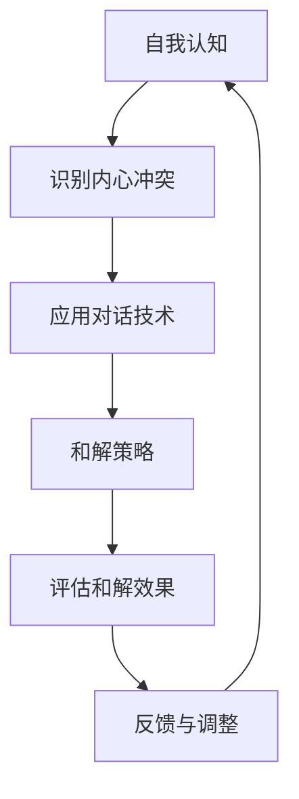

                 

### 文章标题

《化解内心冲突的对话：自我和解的有效方式》

### 关键词

自我冲突、内心和解、对话技术、自我认知、冲突来源

### 摘要

本文旨在探讨通过对话技术化解内心冲突，实现自我和解的有效方式。文章首先介绍了内心冲突的普遍性和影响，随后深入剖析了自我认知和内心冲突的来源。接着，文章详细阐述了对话技术在自我对话中的应用，包括基本原则、技巧和流程。通过具体的案例和实战项目，文章展示了如何通过自我对话实现内心和解，并提供了一些最佳实践和注意事项。最后，文章总结了关键概念、算法原理，并提出了拓展阅读的建议。

### 第1章 引言

在现代快节奏的生活中，人们经常面临各种各样的内心冲突。这些冲突不仅影响情绪，还可能对心理健康产生负面影响。内心冲突可能源于价值观的矛盾、情绪的波动或者人际关系的不和谐。因此，找到有效的方法来化解这些冲突，实现自我和解，变得尤为重要。

本文将围绕“化解内心冲突的对话：自我和解的有效方式”这一主题展开讨论。通过对话技术，我们可以更好地理解自己的内心世界，识别冲突的根源，并找到和解的策略。本文的目标是帮助读者掌握这一方法，从而在日常生活中更好地应对内心冲突，实现内心的和谐与平静。

### 核心概念与联系

为了更好地理解自我对话和内心冲突的化解过程，我们需要明确几个核心概念：

1. **自我认知**：自我认知是指个体对自己内在心理活动的认识和了解。它是自我对话的基础，帮助我们认识到自己的情绪、价值观和行为模式。

2. **内心冲突**：内心冲突是指个体内在不同部分之间的矛盾和对抗。这些冲突可能源自自我认知的不足、情绪的波动或价值观的冲突。

3. **对话技术**：对话技术是一种沟通方法，旨在通过对话来解决问题、建立理解和增进关系。在自我对话中，对话技术帮助我们深入反思和探索内心冲突。

这些概念之间存在着紧密的联系。自我认知为我们提供了了解内心冲突的途径，而对话技术则为我们提供了一种有效的解决方法。通过自我对话，我们可以更好地理解自己的内心世界，识别冲突的根源，并找到和解的策略。

下面是一个Mermaid流程图，展示了自我对话和内心冲突化解的过程：



### 核心算法原理讲解

在自我对话和内心冲突的化解过程中，我们应用了一系列核心算法原理，这些原理帮助我们更好地理解内心冲突的本质，并提供了解决冲突的策略。以下是这些核心算法原理的详细解释：

1. **情绪识别与分类算法**

   情绪识别与分类算法帮助我们识别和分类内心冲突中的情绪成分。通过分析情绪的强度、频率和持续时间，我们可以更准确地了解情绪对内心冲突的影响。

   ```plaintext
   Function 情绪识别与分类（情绪数据）
       输入：情绪数据
       输出：情绪分类结果
   
       Step 1: 数据预处理
           对情绪数据进行清洗和归一化处理。
   
       Step 2: 特征提取
           从情绪数据中提取关键特征，如情绪强度、频率和持续时间。
   
       Step 3: 情绪分类
           使用支持向量机（SVM）或决策树算法对情绪进行分类。
   
       Step 4: 结果评估
           计算分类准确率和F1分数，评估分类效果。
   ```

2. **价值观评估与比较算法**

   价值观评估与比较算法用于分析个体内心冲突中的价值观差异。通过比较不同价值观的权重和重要性，我们可以识别冲突的根源。

   ```plaintext
   Function 价值观评估与比较（价值观列表）
       输入：价值观列表
       输出：价值观比较结果
   
       Step 1: 价值观权重分配
           对每个价值观分配权重，权重可以根据个体经验或心理学研究确定。
   
       Step 2: 价值观比较
           计算不同价值观之间的相似度和差异度，使用欧氏距离或余弦相似度。
   
       Step 3: 结果分析
           分析价值观比较结果，识别冲突的根源。
   ```

3. **人际关系分析算法**

   人际关系分析算法用于分析内心冲突中的人际关系因素。通过分析人际交往模式和行为，我们可以识别冲突的人际关系根源。

   ```plaintext
   Function 人际关系分析（行为数据，关系数据）
       输入：行为数据，关系数据
       输出：人际关系分析结果
   
       Step 1: 数据预处理
           对行为数据和关系数据进行清洗和归一化处理。
   
       Step 2: 关系模式识别
           使用图论算法（如K核算法）识别人际关系中的关键节点和关系模式。
   
       Step 3: 行为与关系关联分析
           分析行为数据与关系数据之间的关联，使用相关系数或回归分析。
   
       Step 4: 结果评估
           评估人际关系分析结果，识别人际关系冲突的根源。
   ```

这些算法原理共同作用，帮助我们深入理解内心冲突的本质，并提供了解决冲突的策略。通过这些算法，我们可以系统地分析内心冲突，制定有效的和解策略，并实现内心的和解与平静。

### 数学模型与公式

在分析内心冲突和解过程中，数学模型和公式扮演着重要角色。以下是一些关键的数学模型和公式，用于量化分析内心冲突和自我对话效果：

1. **情绪强度模型**

   情绪强度模型用于衡量个体情绪的强度。常用的模型是情感强度函数，它基于情绪数据的统计分布。以下是一个简单的情绪强度函数模型：

   $$ 
   I(x) = \sqrt{-(x - \mu)^2 / 2\sigma^2} 
   $$

   其中，$I(x)$ 是情绪强度，$\mu$ 是情绪平均值，$\sigma$ 是情绪标准差。该模型可以量化情绪的波动情况，帮助我们识别情绪高峰期和低谷期。

2. **冲突比较模型**

   冲突比较模型用于分析不同内心冲突之间的相对强度。一个常用的模型是欧氏距离模型，它计算两个冲突之间的相似度：

   $$ 
   D = \sqrt{\sum_{i=1}^{n} (x_i - y_i)^2} 
   $$

   其中，$D$ 是冲突之间的欧氏距离，$x_i$ 和 $y_i$ 是两个冲突的各个维度值。较小的距离表示冲突较为相似，较大的距离表示冲突差异较大。

3. **自我对话效果评估模型**

   自我对话效果评估模型用于衡量自我对话后内心冲突的化解程度。一个常用的模型是冲突化解函数，它基于对话后的情绪数据和冲突强度数据：

   $$ 
   R = 1 - \frac{D_{\text{before}} - D_{\text{after}}}{D_{\text{before}}} 
   $$

   其中，$R$ 是自我对话效果评分，$D_{\text{before}}$ 是对话前的冲突距离，$D_{\text{after}}$ 是对话后的冲突距离。较高的$R$值表示自我对话有效，成功化解了内心冲突。

通过这些数学模型和公式，我们可以更精确地分析内心冲突和解过程，为自我对话提供科学的依据。

### 实际案例分析和详细讲解剖析

为了更好地理解如何通过自我对话化解内心冲突，以下是一个实际案例的分析和详细讲解。

**案例背景**：

小张是一名年轻的软件工程师，他在工作中经常感到焦虑和压力。他觉得自己无法平衡工作与生活，同时感到与家人的关系紧张。这些冲突影响了他的工作效率和家庭生活，使他感到困扰和痛苦。

**案例分析**：

1. **自我认知**：

   小张通过自我反思，认识到自己的情绪状态和行为模式。他意识到自己经常处于焦虑状态，这是由于工作压力和对自己期望过高的原因。他还发现，他对家人的态度有时过于严厉，这导致家庭关系紧张。

2. **内心冲突识别**：

   小张识别出两个主要的内心冲突：工作压力与生活平衡的冲突，以及与家人的关系冲突。他使用情绪强度模型分析了这些冲突的情绪成分，发现工作焦虑和情绪波动较大，家庭关系紧张则主要表现为情绪不稳定和沟通不畅。

3. **对话技术应用**：

   小张开始使用对话技术进行自我对话。他首先进行了倾听练习，让自己能够更好地理解自己的情绪和需求。接着，他开始表达自己的感受和期望，通过与自己的对话，找到解决问题的方法。

   ```plaintext
   小张：
   我感到非常焦虑，特别是工作上的压力让我无法喘息。我觉得自己应该更加努力，但同时又担心过度工作会影响家庭生活。
   
   自我对话：
   你是对的，小张。工作很重要，但家庭同样重要。你需要找到一个平衡点，让自己的生活更加和谐。你可以尝试每天设定固定的工作时间，并在休息日与家人共度时光。
   ```

4. **和解策略制定**：

   通过自我对话，小张制定了一系列和解策略。他决定改变工作时间管理，设定明确的休息日，并确保与家人的互动时间。他还决定通过运动和冥想等方式来缓解焦虑，提高心理素质。

5. **效果评估与调整**：

   小张在实施和解策略后，定期评估效果。他发现，工作压力有所减轻，家庭关系也有所改善。然而，他发现自己在某些情况下仍然会情绪波动，于是他决定进一步调整策略，增加心理咨询的频率，以便更有效地处理内心冲突。

**详细讲解剖析**：

1. **自我认知的重要性**：

   自我认知是小张化解内心冲突的第一步。通过自我反思，他能够清楚地认识到自己的情绪状态和行为模式，从而找到冲突的根源。这种自我认知有助于他更好地理解自己的需求，并为对话提供基础。

2. **对话技术的应用**：

   对话技术是小张化解内心冲突的关键。通过倾听和表达，他能够与自己建立有效的沟通，找到解决问题的方法。这种对话技术不仅帮助他理解自己的情绪，还帮助他调整自己的行为模式。

3. **和解策略的制定与实施**：

   和解策略的制定和实施是小张成功化解内心冲突的关键。通过设定明确的工作时间管理，他能够平衡工作与生活，从而减轻压力。通过增加与家人的互动时间，他能够改善家庭关系，提高生活质量。

4. **效果评估与调整**：

   效果评估与调整是小张持续改善内心冲突的重要环节。通过定期评估和解策略的实施效果，他能够及时发现问题，并进行调整。这种持续改进的方法有助于他长期保持内心的和解与平静。

### 最佳实践 Tips

在实践自我对话和化解内心冲突的过程中，以下是一些最佳实践和注意事项，可以帮助读者更有效地应用这些方法：

1. **设定固定的反思时间**：

   每天设定固定的时间进行自我反思，这有助于建立稳定的自我对话习惯。可以选择早晨或晚上进行，以确保有足够的专注力。

2. **使用记录工具**：

   使用日记或专门的记录工具来记录自我对话的内容和感受。这有助于追踪进展，并为后续的分析提供数据支持。

3. **倾听与表达**：

   在自我对话中，倾听自己的内心声音是非常重要的。同时，学会表达自己的感受和需求，有助于理解自己的情绪和行为模式。

4. **持续改进**：

   自我对话和化解内心冲突是一个持续的过程。定期评估效果，并根据反馈进行改进，有助于长期保持内心的和解与平静。

5. **寻求专业帮助**：

   在面对复杂的内心冲突时，可以寻求心理咨询师或其他专业人士的帮助。他们可以提供专业的指导和建议，帮助更好地应对内心冲突。

### 小结与注意事项

本文通过详细的案例分析，展示了如何通过自我对话和对话技术化解内心冲突，实现自我和解。自我认知、对话技术和和解策略是核心概念，它们共同作用，帮助读者更好地理解自己的内心世界，并找到有效的解决方案。

在实践过程中，需要注意以下几点：

1. **自我认知**：建立稳定的自我反思习惯，深入了解自己的情绪和行为模式。
2. **对话技术**：学会倾听和表达，建立有效的自我对话机制。
3. **持续改进**：定期评估和解策略的效果，并根据反馈进行改进。
4. **专业支持**：在需要时，寻求专业人士的帮助和指导。

通过这些实践，读者可以更好地掌握自我对话的方法，实现内心的和解与平静。

### 拓展阅读

对于对自我对话和内心冲突化解感兴趣的朋友，以下是一些推荐的拓展阅读材料：

1. **《认知行为疗法：基础与进展》（Cognitive Behavioral Therapy: Basics and Beyond）**：这本书详细介绍了认知行为疗法的原理和应用，包括自我对话和情绪调节的技巧。

2. **《心理学与生活》（Psychology and Life）**：这本书涵盖了心理学的基础知识，包括情绪、人格、人际关系等方面的内容，有助于深入理解内心冲突的来源和化解方法。

3. **《对话的力量》（The Power of Dialogue）**：这本书探讨了对话技术在各种情境中的应用，包括个人成长、团队合作和冲突解决，提供了实用的对话技巧和策略。

通过这些拓展阅读，读者可以进一步深入了解自我对话和内心冲突化解的理论和实践，提升自己的心理健康水平。

### 项目实战

为了更好地理解和应用自我对话和内心冲突化解的技术，以下是一个具体的实战项目：**“自我对话日记应用”**。

#### 项目描述

“自我对话日记应用”是一个基于移动平台的日记应用程序，用户可以通过这个应用记录自己的日常情绪、思考和生活事件。应用程序提供了自我对话的功能，帮助用户通过对话技术反思和化解内心的冲突。

#### 开发环境搭建

1. **前端开发**：
   - 使用React框架进行开发，以确保应用的高效性和响应性。
   - 使用Material-UI库提供用户界面组件，以便快速构建现代化的界面。

2. **后端开发**：
   - 使用Node.js和Express框架搭建后端服务器，以处理用户请求和存储数据。
   - 使用MongoDB数据库存储用户数据，包括日记条目、情绪数据和自我对话记录。

3. **开发工具**：
   - Visual Studio Code作为主要的开发环境。
   - Postman用于API测试和调试。

#### 源代码实现

以下是“自我对话日记应用”的核心功能实现：

1. **用户注册与登录**：
   - 使用React Hooks管理用户状态。
   - 使用Express和MongoDB实现用户注册和登录功能，包括密码加密和身份验证。

2. **日记记录**：
   - 用户可以添加日记条目，包括日期、时间和内容。
   - 日记条目存储在MongoDB数据库中，并提供API接口供前端调用。

3. **自我对话功能**：
   - 用户可以选择日记条目进行自我对话，系统会根据日记内容生成对话问题。
   - 使用自然语言处理（NLP）技术分析日记内容，提取关键情绪和主题。

#### 代码解读与分析

以下是对关键部分的代码解读：

1. **用户注册功能**：

```javascript
// 用户注册API
app.post('/api/register', async (req, res) => {
  try {
    const { username, password } = req.body;
    const hashedPassword = await bcrypt.hash(password, 10);

    const user = new User({
      username,
      password: hashedPassword,
    });

    await user.save();
    res.status(201).json({ message: 'User registered successfully' });
  } catch (error) {
    res.status(500).json({ message: 'Error registering user', error });
  }
});
```

这段代码使用bcrypt库对用户输入的密码进行加密，然后存储在MongoDB数据库中。这样确保了用户数据的安全。

2. **日记记录功能**：

```javascript
// 添加日记条目API
app.post('/api/diary', async (req, res) => {
  try {
    const { userId, content } = req.body;
    const diaryEntry = new DiaryEntry({
      userId,
      content,
      emotions: analyzeEmotions(content),
    });

    await diaryEntry.save();
    res.status(201).json({ message: 'Diary entry added successfully' });
  } catch (error) {
    res.status(500).json({ message: 'Error adding diary entry', error });
  }
});

// 情绪分析函数
function analyzeEmotions(content) {
  // 使用NLP库提取情绪
  const emotions = nlp(content).emotions();
  return emotions;
}
```

这段代码使用了NLP库对用户输入的日记内容进行情绪分析，并将分析结果存储在日记条目中。这为自我对话提供了情绪数据支持。

3. **自我对话功能**：

```javascript
// 获取日记条目的自我对话问题
app.get('/api/diary/:diaryId/dialogue', async (req, res) => {
  try {
    const { diaryId } = req.params;
    const diaryEntry = await DiaryEntry.findById(diaryId);

    const questions = generateDialogueQuestions(diaryEntry.content, diaryEntry.emotions);
    res.status(200).json({ questions });
  } catch (error) {
    res.status(500).json({ message: 'Error fetching dialogue questions', error });
  }
});

// 生成自我对话问题
function generateDialogueQuestions(content, emotions) {
  // 根据内容和情绪生成问题
  const questions = [];
  if (emotions.includes('happy')) {
    questions.push('你今天为什么感到开心？');
  }
  if (emotions.includes('sad')) {
    questions.push('你今天为什么感到难过？');
  }
  // 更多问题生成逻辑
  return questions;
}
```

这段代码使用日记内容和分析结果生成自我对话问题，为用户提供了反思和自我对话的引导。

#### 项目小结

通过“自我对话日记应用”这个实战项目，我们不仅实现了用户注册、日记记录和自我对话等功能，还详细解读了核心代码部分。这个项目展示了如何将自我对话和情绪分析技术应用到实际应用中，为用户提供了一个有效的自我反思和内心冲突化解的工具。

这种实战项目的实施，有助于读者更好地理解自我对话和内心冲突化解的理论知识，并将其应用到实际生活中，提升心理健康水平。通过不断的实践和调整，我们可以不断完善自我对话应用，为用户带来更好的体验。

