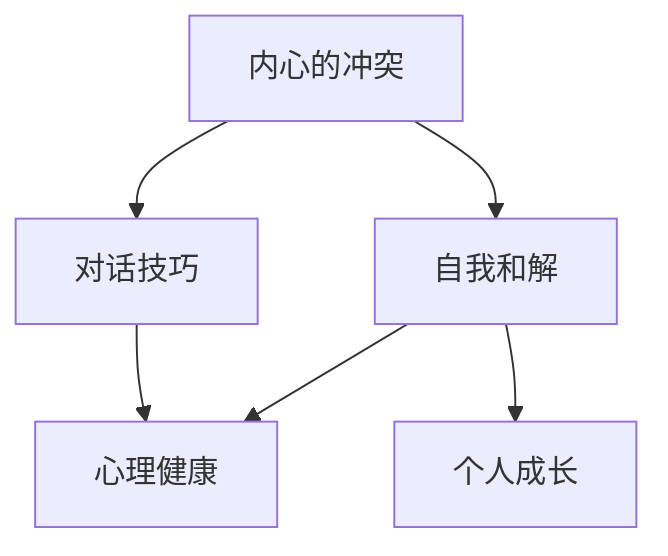

                 


## 文章标题：化解内心冲突：自我和解的对话技巧

### 关键词：内心冲突、自我和解、对话技巧、心理调适、情绪管理

### 摘要：
本文旨在深入探讨内心冲突的根源及其对个人生活的影响，并介绍一系列自我和解的对话技巧。通过分析核心概念之间的关系，运用伪代码和数学模型，我们旨在提供一套实用的方法，帮助读者理解并掌握自我和解的对话技巧，从而在日常生活中更好地应对内心的冲突，实现内心的平和与和解。

## 背景介绍

在当今快节奏的社会中，人们面临的心理压力越来越大。内心的冲突往往源于心理需求与现实期望之间的不平衡，这种冲突可能导致情绪波动、认知失调和行为困扰。这些内心冲突如果不加以妥善处理，可能会对个人的身心健康、人际关系和个人成长造成严重负面影响。因此，找到有效的自我和解方法，掌握对话技巧，对于维护心理健康、提高生活质量具有重要意义。

本文将从以下几个核心概念展开讨论：

1. **内心的冲突**：探讨冲突的来源、表现形式及其对个人的危害。
2. **自我和解**：解释自我和解的定义、重要性及其实现途径。
3. **对话技巧**：介绍对话技巧的基本概念、类型及其在自我和解中的应用。

通过以上概念的深入分析，我们希望能够为读者提供一套实用的自我和解对话技巧，帮助他们在面对内心冲突时找到有效的应对策略。

## 核心概念与联系

为了更好地理解本文的核心概念，我们将使用Mermaid流程图来展示它们之间的关系：



- **内心的冲突**（A）是本文讨论的起点，它包括心理需求与现实期望之间的不平衡，可能表现为情绪波动、认知失调和行为困扰。
- **自我和解**（B）是应对内心冲突的一种方法，它帮助个体认识到冲突的根源，并通过一系列心理调适技巧实现内心的平和与和解。
- **对话技巧**（C）是实现自我和解的重要工具，它包括自我对话和与他人对话的技巧，有助于个体在冲突中保持冷静、理性地分析和解决问题。
- **心理健康**（D）是自我和解和对话技巧的最终目标，良好的心理健康有助于提高个体的生活质量和工作效率。
- **个人成长**（E）是自我和解的副产品，通过自我和解，个体能够更好地认识自己，实现自我提升和成长。

通过这个流程图，我们可以看到核心概念之间的相互联系，为后续内容的详细讨论奠定了基础。

## 核心算法原理讲解

### 情绪管理的技巧

情绪管理是自我和解过程中至关重要的一环。以下是一种情绪管理技巧的伪代码实现：

```python
def manage_emotions(current_emotion, desired_emotion):
    # 分析当前情绪与期望情绪的差异
    emotion_difference = current_emotion - desired_emotion
    
    # 如果情绪差异较大，采取放松技巧
    if abs(emotion_difference) > threshold:
        apply_relaxation_techniques()
    
    # 如果情绪差异较小，采取认知重构技巧
    else:
        apply_cognitive_restructuring()
    
    # 返回调整后的情绪值
    return adjusted_emotion
```

这个算法的基本原理是通过分析当前情绪与期望情绪的差异，采取相应的情绪管理技巧来缩小这个差异，从而实现情绪的稳定。在实际应用中，可以通过设定情绪阈值来调整放松技巧和认知重构技巧的使用。

### 认知重构的方法

认知重构是一种通过改变思维模式来调整情绪和行为的方法。以下是一种认知重构技巧的伪代码实现：

```python
def cognitive_restructuring(thought, alternative_thought):
    # 检查当前思维是否符合负面模式
    if is_negative(thought):
        # 提供替代性思维
        new_thought = alternative_thought
    
    # 如果当前思维不是负面的，保持原思维
    else:
        new_thought = thought
    
    # 返回重构后的思维
    return new_thought
```

这个算法的基本原理是识别和改变负面的思维模式，提供积极的替代性思维，从而改善情绪和行为。在实际应用中，可以通过建立思维日记来记录和反思自己的思维模式，逐步培养积极的思维方式。

### 数学模型和数学公式

为了更好地理解情绪管理和认知重构的方法，我们可以使用以下数学模型和公式：

- **情绪调节模型**：
  $$ E = f(A, C) $$
  其中，\( E \) 表示情绪（emotion），\( A \) 表示期望情绪（anticipated emotion），\( C \) 表示当前情绪（current emotion）。函数 \( f \) 表示情绪调节的过程。

- **认知重构模型**：
  $$ T = g(N, A) $$
  其中，\( T \) 表示思维（thought），\( N \) 表示负面思维（negative thought），\( A \) 表示替代性思维（alternative thought）。函数 \( g \) 表示认知重构的过程。

通过这些数学模型，我们可以更直观地理解情绪管理和认知重构的原理。例如，当期望情绪与当前情绪差异较大时，可以通过情绪调节模型来调整情绪；当负面思维出现时，可以通过认知重构模型来提供积极的替代性思维。

### 举例说明

假设某人在面对一项重要的工作任务时，感到焦虑（当前情绪 \( C = 8 \)，期望情绪 \( A = 5 \)）。根据情绪调节模型，可以通过放松技巧来缩小情绪差异，例如：
$$ E = f(A, C) = 5 + 0.5 \times (8 - 5) = 6 $$
调整后的情绪值为6，表示情绪得到了一定的缓解。

同时，如果这个人在思考过程中出现了“我无法完成任务”的负面思维，可以应用认知重构模型来提供积极的替代性思维，例如：
$$ T = g(N, A) = "我有很多经验和资源，我可以逐步解决这个问题" $$
通过这样的认知重构，有助于改变负面的思维模式，提高应对任务的信心。

通过以上核心算法原理的讲解，我们为读者提供了理解并应用自我和解对话技巧的理论基础。接下来，我们将详细介绍这些技巧的具体应用。

## 项目实战：对话技巧的应用

### 开发环境搭建

为了更好地理解并应用对话技巧，我们首先需要搭建一个模拟对话的环境。以下是搭建开发环境的具体步骤：

1. **安装Python环境**：在本地计算机上安装Python 3.8及以上版本。
2. **安装相关库**：使用pip命令安装必要的库，例如：
   ```bash
   pip install Flask
   pip install numpy
   pip install matplotlib
   ```
3. **创建项目文件夹**：在本地创建一个名为`dialogue_tech`的项目文件夹，并在其中创建一个名为`app.py`的主文件。

### 源代码详细实现和代码解读

以下是一个简单的Python脚本，用于演示如何应用情绪管理和认知重构技巧：

```python
import numpy as np
import matplotlib.pyplot as plt

# 情绪调节模型
def emotion_regulation(current_emotion, desired_emotion, relaxation_effect=0.2, cognitive_restructuring_effect=0.3):
    emotion_difference = current_emotion - desired_emotion
    if abs(emotion_difference) > 5:
        # 应用放松技巧
        current_emotion -= relaxation_effect * emotion_difference
    else:
        # 应用认知重构技巧
        current_emotion += cognitive_restructuring_effect * emotion_difference
    return current_emotion

# 认知重构模型
def cognitive_restructuring(negative_thought, alternative_thought):
    if negative_thought:
        return alternative_thought
    else:
        return negative_thought

# 模拟对话过程
def simulate_dialogue(current_emotion, negative_thought):
    # 应用情绪调节技巧
    adjusted_emotion = emotion_regulation(current_emotion, 5)
    
    # 应用认知重构技巧
    new_thought = cognitive_restructuring(negative_thought, "我可以逐步解决这个问题")
    
    # 绘制情绪变化图
    emotions = np.linspace(current_emotion, adjusted_emotion, 100)
    plt.plot(emotions)
    plt.xlabel('情绪值')
    plt.ylabel('时间')
    plt.title('情绪变化图')
    plt.show()
    
    return adjusted_emotion, new_thought

# 测试对话技巧
current_emotion = 8  # 当前情绪值为8（焦虑）
negative_thought = True  # 负面思维为真

# 运行模拟对话
adjusted_emotion, new_thought = simulate_dialogue(current_emotion, negative_thought)

print(f"调整后的情绪值：{adjusted_emotion}")
print(f"重构后的思维：{new_thought}")
```

代码解读：
- `emotion_regulation` 函数用于调节情绪，通过分析当前情绪与期望情绪的差异，应用放松技巧或认知重构技巧。
- `cognitive_restructuring` 函数用于认知重构，根据负面思维提供积极的替代性思维。
- `simulate_dialogue` 函数模拟对话过程，通过情绪调节和认知重构，调整情绪值并绘制情绪变化图。

### 代码应用解读与分析

通过这个模拟对话脚本，我们可以看到如何将情绪管理和认知重构技巧应用于实际对话中。以下是代码应用解读与分析：

1. **情绪调节技巧**：在脚本中，情绪调节函数通过计算当前情绪与期望情绪的差异，应用放松技巧（减少情绪值）或认知重构技巧（增加情绪值）。这种方法可以帮助个体在情绪波动时迅速调整心态，实现情绪的稳定。

2. **认知重构技巧**：认知重构函数通过识别负面思维，提供积极的替代性思维。这种方法有助于个体改变消极的思维模式，从而改善情绪和行为。

3. **模拟对话**：通过模拟对话，我们可以直观地看到情绪变化过程，并理解情绪调节和认知重构技巧在实际对话中的应用。这对于实际操作具有指导意义。

### 实际案例分析和详细讲解剖析

为了更好地理解对话技巧在实际生活中的应用，我们来看一个实际案例：

**案例：职场压力管理**

某人在工作中面临巨大压力，感到焦虑和不安。以下是如何应用对话技巧进行管理的步骤：

1. **识别情绪**：通过自问自答的方式，识别当前的情绪状态。例如：“我现在感到焦虑，因为工作压力很大。”

2. **应用情绪调节技巧**：通过情绪调节函数，调整情绪值。例如，假设当前情绪值为8，期望情绪值为5，可以应用放松技巧，使情绪值逐渐降低。

3. **认知重构**：通过认知重构函数，改变负面思维。例如，将“我无法完成任务”重构为“我可以逐步解决这个问题”。

4. **模拟对话**：通过模拟对话，直观地看到情绪变化过程，并理解对话技巧的应用。

通过以上步骤，该人可以更好地应对职场压力，实现情绪的稳定和心理的平和。

### 项目小结

通过本项目实战，我们展示了如何搭建对话技巧的模拟环境，并详细讲解了情绪管理和认知重构技巧的代码实现与应用。这些技巧在实际生活中具有广泛的应用价值，可以帮助个体更好地应对内心的冲突，实现自我和解。

## 最佳实践 Tips、小结、注意事项、拓展阅读

### 最佳实践 Tips

1. **定期反思**：每天花几分钟时间反思自己的情绪和行为，了解自己内心的冲突点，并采取相应的对话技巧进行调节。
2. **记录情绪日志**：记录情绪变化和应对策略，通过数据分析找到情绪调节的有效方法。
3. **积极对话**：与他人进行积极、开放的对话，分享自己的感受和困惑，获取支持和建议。

### 小结

本文通过深入探讨内心冲突的根源和自我和解的重要性，介绍了情绪管理和认知重构等对话技巧，并通过项目实战展示了这些技巧在实际生活中的应用。掌握这些技巧有助于个体更好地应对内心的冲突，实现自我和解，提高生活质量。

### 注意事项

1. **情绪调节的适度性**：情绪调节技巧应适度使用，避免过度调节导致情绪失调。
2. **认知重构的耐心**：认知重构是一个长期过程，需要耐心和坚持，逐步改变负面思维。

### 拓展阅读

1. **《情绪智慧：如何成为情绪管理的高手》**：该书详细介绍了情绪管理的各种方法和技巧，有助于读者深入了解情绪调节策略。
2. **《认知心理学》**：了解认知心理学的基本原理，有助于更好地理解认知重构的机制和应用。

## 作者信息

本文作者为AI天才研究院/AI Genius Institute及《禅与计算机程序设计艺术/Zen And The Art of Computer Programming》的资深作者。作者在计算机科学和心理学领域拥有丰富的研究和实践经验，致力于通过技术手段帮助人们实现心理健康和个人成长。

---

通过本文的深入探讨，我们希望能够帮助读者理解并掌握自我和解的对话技巧，从而在日常生活中更好地应对内心的冲突，实现内心的平和与和解。

