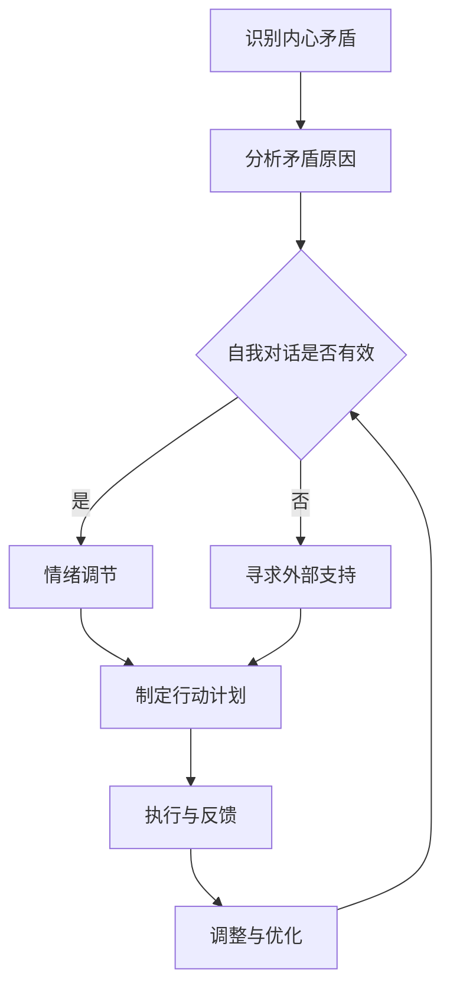

                 

### 文章标题

### 化解内心矛盾的技巧：有效的自我对话策略

在快节奏、高压的现代生活中，每个人都会遇到内心矛盾的时刻。这些矛盾可能是对未来的不确定性、对自身能力的质疑，或者是与他人之间的冲突。内心矛盾不仅影响我们的情绪状态，还会干扰我们的日常生活和工作效率。如何有效地化解这些内心矛盾，提高自我认知和情绪管理能力，成为了一个重要而紧迫的议题。

本文将深入探讨化解内心矛盾的技巧，特别是有效的自我对话策略。我们将从内心矛盾的定义与分类、自我对话的概念与重要性、情绪管理的基本原理、自我对话技巧的掌握、自我对话的具体技巧、自我对话的实践应用、有效的自我对话策略以及常见内心矛盾的化解等方面，系统地介绍和阐述这一主题。通过本文的阅读，读者将能够掌握自我对话的核心技巧，学会如何通过自我对话化解内心矛盾，提升自我认知和情绪管理能力。

关键词：内心矛盾，自我对话，情绪管理，自我认知，心理调适，策略应用

摘要：本文从理论层面和实践层面探讨了化解内心矛盾的技巧，特别是有效的自我对话策略。通过分析内心矛盾的定义与分类、自我对话的概念与重要性、情绪管理的基本原理，以及具体的自我对话技巧和实践应用，本文为读者提供了系统的自我对话策略，旨在帮助读者提升自我认知和情绪管理能力，从而更好地应对生活中的内心矛盾。

---

### 摘要

本文旨在探讨内心矛盾的产生原因、影响以及有效的化解方法，特别是自我对话策略在化解内心矛盾中的应用。内心矛盾是人们在日常生活中常见的心理现象，它源于对自身能力、未来预期、人际关系等方面的不确定性和矛盾。这些矛盾不仅影响情绪状态，还会对日常生活和工作产生负面影响。

自我对话作为一种自我认知和情绪管理的方法，通过内在的语言交流和思维调整，有助于化解内心的矛盾。本文首先介绍了内心矛盾的定义与分类，分析了自我对话的概念与重要性，以及情绪管理的基本原理。接着，详细阐述了自我对话的基本原则、具体技巧和实践应用，包括正面自我暗示、内在对话的练习、自我安抚与鼓励等。此外，本文还介绍了如何制定有效的自我对话计划，评估自我对话的效果，以及如何应对焦虑、自我怀疑和冲突等常见内心矛盾。

通过本文的阅读，读者将能够理解内心矛盾的本质，掌握自我对话的核心技巧，学会如何通过自我对话策略有效地化解内心的矛盾，从而提升自我认知和情绪管理能力。本文不仅提供了理论指导，还结合实际案例，为读者提供了实用的方法和建议。

### 第一部分：内心矛盾的基础理解

#### 1.1 内心矛盾的定义与分类

内心矛盾，亦称为心理冲突或认知失调，是人们在日常生活中常常感受到的一种心理状态。这种状态通常表现为个体内心存在的相互矛盾的想法、信念或价值观。内心矛盾可以源自多个方面，包括自我认知、情感需求、社会期望、以及环境压力等。例如，一个人可能在追求个人理想与家庭责任之间感到矛盾，或者在面对职业选择时，内心的理想自我与现实自我产生冲突。

内心矛盾的种类多种多样，根据不同的分类标准，可以分为以下几种类型：

1. **自我矛盾**：这种矛盾通常发生在个体内部，比如对自身能力的质疑、自我形象的扭曲或自我期望与现实表现之间的差距。例如，一个人可能在自我期望上认为自己应该非常出色，但现实中却未能达到这一标准，从而产生自我矛盾。

2. **情感矛盾**：情感矛盾是指个体在情感体验上的冲突，如爱恨交织、喜悦与悲伤的混合等。例如，一个人可能在爱与被爱之间感到矛盾，一方面渴望被爱，另一方面又害怕失去自由。

3. **关系矛盾**：这种矛盾通常发生在个体与他人之间的关系中，如家庭关系、友情或职场关系等。例如，一个人可能在尊重对方与保持自我独立性之间感到矛盾，或者在合作与竞争之间难以平衡。

4. **价值观矛盾**：价值观矛盾是指个体内部不同的价值观或信念之间的冲突。例如，一个人可能同时受到传统价值观和现代价值观的影响，难以在这些价值观之间做出选择。

#### 1.2 自我对话的概念与重要性

自我对话是指个体内在的语言交流过程，通过自我思考、自我反思、自我提醒和自我指导，实现对自身认知、情感和行为的影响。自我对话不仅是一种认知过程，也是一种情绪调节和问题解决的手段。

自我对话在化解内心矛盾中具有重要作用，主要体现在以下几个方面：

1. **提升自我认知**：自我对话帮助个体更深入地了解自己的想法、感受和行为，从而提升自我认知。通过自我反思，个体可以识别出内心的矛盾点，明确自己的需求和目标。

2. **情绪调节**：自我对话能够帮助个体调节情绪，减少负面情绪的产生。例如，当个体感到焦虑或不安时，通过自我对话可以提醒自己理性思考，从而缓解情绪。

3. **问题解决**：自我对话有助于个体在面对矛盾和挑战时，进行有效的思考和决策。通过自我对话，个体可以分析问题的原因和可能的解决方案，从而找到解决问题的方法。

4. **增强自我效能感**：自我对话能够提升个体的自我效能感，即对自身能力的信心和信心。通过自我对话，个体可以认识到自己的优点和长处，从而增强自信心。

#### 1.3 情绪管理的基本原理

情绪管理是指个体在情绪产生时，通过认知和行为调节，使情绪保持在合理范围内的过程。情绪管理对于化解内心矛盾具有重要意义，因为它能够帮助个体更好地应对压力和挑战。

情绪管理的基本原理包括以下几个方面：

1. **认知重构**：认知重构是指通过改变对事件的理解和解释，来调节情绪。例如，当一个人遇到挫折时，可以通过改变对挫折的看法，从消极转化为积极，从而调节情绪。

2. **情绪表达**：情绪表达是指通过适当的方式表达情绪，避免情绪压抑或爆发。例如，通过与他人沟通、写日记等方式，可以有效地表达情绪。

3. **情绪调节技巧**：情绪调节技巧包括深呼吸、放松训练、积极思维等方法。这些技巧可以帮助个体在情绪波动时，迅速恢复平静。

4. **行为调整**：行为调整是指通过改变行为来影响情绪。例如，当个体感到焦虑时，可以尝试进行运动或参与其他活动，从而转移注意力，减轻焦虑。

总之，理解内心矛盾的定义与分类、自我对话的概念与重要性，以及情绪管理的基本原理，是化解内心矛盾的前提和基础。通过自我对话和情绪管理，个体可以更有效地应对内心的矛盾，提升自我认知和情绪管理能力，从而实现心理健康和幸福感。

---

**Mermaid 流程图：内心矛盾处理流程**



该流程图展示了从识别内心矛盾到调整优化的整个过程，强调了自我对话和外部支持在处理内心矛盾中的重要性。

#### 1.4 内心矛盾处理的核心算法原理

在理解了内心矛盾的定义、分类以及自我对话和情绪管理的基本原理后，我们需要深入探讨处理内心矛盾的核心算法原理。这些原理不仅帮助我们识别和分类内心矛盾，还提供了具体的操作步骤和方法，以实现有效的矛盾化解。

##### 核心算法原理：自我对话与认知重构

自我对话是处理内心矛盾的核心方法之一。自我对话不仅涉及自我认知的提升，还包括情绪调节和认知重构。以下是自我对话和认知重构的核心算法原理：

**算法描述：**

1. **识别内心矛盾**：通过自我反思，识别出内心矛盾的具体表现和感受。
    ```plaintext
    输入：个体内心矛盾表现与感受
    输出：内心矛盾的具体描述
    ```

2. **分析矛盾原因**：分析内心矛盾的产生原因，包括个人价值观、信念、行为习惯和环境因素。
    ```plaintext
    输入：内心矛盾的具体描述
    输出：矛盾产生的原因
    ```

3. **认知重构**：通过改变对事件的理解和解释，调整内心矛盾。认知重构的核心是改变思维模式，从消极思维转向积极思维。
    ```plaintext
    输入：内心矛盾的原因
    输出：重构后的认知模式
    ```

4. **情绪调节**：在认知重构的基础上，运用情绪调节技巧，如深呼吸、放松训练和积极思维，减轻负面情绪。
    ```plaintext
    输入：重构后的认知模式
    输出：情绪状态
    ```

5. **制定行动计划**：根据重构后的认知模式和情绪状态，制定具体的行动计划，以解决内心矛盾。
    ```plaintext
    输入：重构后的认知模式与情绪状态
    输出：行动计划
    ```

6. **执行与反馈**：执行行动计划，并根据反馈调整和优化策略。
    ```plaintext
    输入：行动计划与反馈
    输出：调整后的行动计划
    ```

**伪代码示例：**

```python
def identify_conflicts():
    # 识别内心矛盾
    print("请描述你感受到的内心矛盾：")
    conflict_description = input()
    return conflict_description

def analyze_reasons(conflict_description):
    # 分析矛盾原因
    print("分析矛盾原因：")
    reasons = input()
    return reasons

def cognitive_restructuring(reasons):
    # 认知重构
    print("进行认知重构：")
    new_cognitive_mode = input()
    return new_cognitive_mode

def emotion_regulation(new_cognitive_mode):
    # 情绪调节
    print("进行情绪调节：")
    emotion_state = input()
    return emotion_state

def create_action_plan(new_cognitive_mode, emotion_state):
    # 制定行动计划
    print("制定行动计划：")
    action_plan = input()
    return action_plan

def execute_and_refine(action_plan):
    # 执行与反馈
    print("执行行动计划：")
    feedback = input()
    print("根据反馈调整：")
    refined_action_plan = input()
    return refined_action_plan

# 主程序
conflict_description = identify_conflicts()
reasons = analyze_reasons(conflict_description)
new_cognitive_mode = cognitive_restructuring(reasons)
emotion_state = emotion_regulation(new_cognitive_mode)
action_plan = create_action_plan(new_cognitive_mode, emotion_state)
refined_action_plan = execute_and_refine(action_plan)
print("最终行动计划：", refined_action_plan)
```

通过上述伪代码示例，我们可以看到自我对话和认知重构在处理内心矛盾中的具体应用。这些步骤和方法为个体提供了一种系统化的方法，帮助其识别、分析、重构和解决内心的矛盾。

#### 1.5 内心矛盾处理中的数学模型与公式

在处理内心矛盾时，数学模型和公式可以提供一种量化的方法，帮助个体更好地理解内心矛盾的本质，并制定更有效的解决方案。以下是一些在内心矛盾处理中常用的数学模型和公式：

##### 1.5.1 心理平衡模型

心理平衡模型用于描述个体在面对内心矛盾时，如何通过调整思维和行为来实现心理平衡。该模型的基本公式如下：

$$
心理平衡 = f(认知重构, 情绪调节, 行为调整)
$$

其中，$f$ 表示心理平衡函数，$认知重构$、$情绪调节$ 和 $行为调整$ 是三个关键变量。

**示例**：

假设一个个体在职业选择上感到矛盾，通过自我对话和情绪调节，个体决定重构自己的认知，将职业选择视为一个长期发展的过程。此外，个体通过参加职业培训来提升自己的技能。这些变化可以表示为：

$$
心理平衡 = f(认知重构（长期发展视角）, 情绪调节（积极应对），行为调整（参加培训）)
$$

通过上述公式，个体可以量化自己的心理平衡状态，从而更好地评估和调整自己的行为。

##### 1.5.2 情绪调节模型

情绪调节模型用于描述个体如何通过认知和行为调节来管理情绪。该模型的基本公式如下：

$$
情绪状态 = f(认知评价, 情绪反应, 行为反应)
$$

其中，$f$ 表示情绪调节函数，$认知评价$、$情绪反应$ 和 $行为反应$ 是三个关键变量。

**示例**：

当个体面对工作压力时，可以通过以下方式来调节情绪：

$$
情绪状态 = f(认知评价（将压力视为挑战而非威胁），情绪反应（深呼吸放松），行为反应（进行运动放松）)
$$

通过这种模型，个体可以更加科学地分析自己的情绪状态，并采取有效的措施进行调节。

##### 1.5.3 自我效能感模型

自我效能感模型用于描述个体对自身能力的信心和信心。该模型的基本公式如下：

$$
自我效能感 = f(成功经验, 观察学习, 积极思维)
$$

其中，$f$ 表示自我效能感函数，$成功经验$、$观察学习$ 和 $积极思维$ 是三个关键变量。

**示例**：

一个学生在面对考试压力时，可以通过以下方式提升自我效能感：

$$
自我效能感 = f(成功经验（过去考试表现良好），观察学习（观察他人的成功经验），积极思维（相信自己能够应对考试）)
$$

这种模型可以帮助个体更加积极地看待自身能力，从而提升自我效能感。

#### 1.6 内心矛盾处理中的数学模型与公式详细讲解与举例说明

为了更好地理解上述数学模型与公式，我们将结合具体的案例进行详细讲解和举例说明。

##### 1.6.1 心理平衡模型的详细讲解与举例

假设一个个体在职业发展过程中感到矛盾，一方面渴望追求个人兴趣，另一方面又担心无法满足家庭的经济需求。这种内心矛盾可以通过心理平衡模型来处理。

首先，个体需要识别和描述自己的内心矛盾，例如：“我感到矛盾，因为一方面想追求个人兴趣，另一方面又担心无法满足家庭的经济需求。”

接下来，个体可以通过以下方式调整心理平衡：

1. **认知重构**：将职业选择视为一个长期发展的过程，而不是短期利益的选择。例如，可以思考：“虽然我现在选择了一个不喜欢的职业，但这是一个积累经验和技能的过程，将来我可以有更多的选择。”

2. **情绪调节**：通过深呼吸和放松训练来缓解负面情绪。例如，可以在感到焦虑时进行5分钟的深呼吸练习，以帮助自己平静下来。

3. **行为调整**：制定一个行动计划，包括寻找兼职工作、参加职业培训等，以提升自己的技能和满足家庭需求。例如，可以每周抽出两天晚上参加在线职业培训课程。

将这些调整应用到心理平衡模型中，可以表示为：

$$
心理平衡 = f(认知重构（长期发展视角）, 情绪调节（深呼吸放松），行为调整（参加培训))
$$

通过这种方式，个体可以更好地实现心理平衡，从而减轻内心的矛盾。

##### 1.6.2 情绪调节模型的详细讲解与举例

以一个学生面对考试压力的情境为例，情绪调节模型可以帮助学生更好地管理自己的情绪。

首先，学生需要识别自己的情绪反应，例如：“我感到紧张和焦虑，因为即将面临一场重要的考试。”

接下来，学生可以通过以下方式调节情绪：

1. **认知评价**：将考试视为一种挑战，而不是威胁。例如，可以思考：“这次考试是一个机会，让我展示自己的学习成果，我可以通过准备来应对。”

2. **情绪反应**：通过深呼吸和放松训练来缓解紧张和焦虑。例如，可以在考试前进行5分钟的深呼吸练习，帮助自己放松。

3. **行为反应**：制定一个复习计划，包括合理安排时间、参加学习小组等，以提高学习效率和应对考试。例如，可以每天晚上抽出2小时进行集中复习。

将这些调整应用到情绪调节模型中，可以表示为：

$$
情绪状态 = f(认知评价（挑战而非威胁），情绪反应（深呼吸放松），行为反应（制定复习计划))
$$

通过这种方式，学生可以更好地调节自己的情绪，从而更好地应对考试压力。

##### 1.6.3 自我效能感模型的详细讲解与举例

假设一个员工在工作中感到缺乏自信，需要提升自我效能感。自我效能感模型可以帮助员工找到提升自信的方法。

首先，员工需要识别自己的自我效能感问题，例如：“我感到缺乏自信，因为我担心无法胜任新的工作任务。”

接下来，员工可以通过以下方式提升自我效能感：

1. **成功经验**：回顾过去成功的经历，例如：“我曾经成功地完成了类似的工作任务，这让我相信自己可以胜任。”

2. **观察学习**：观察和向同事学习，了解他们如何应对类似的挑战。例如，可以与同事交流，学习他们的工作方法和经验。

3. **积极思维**：保持积极的心态，相信自己的能力和潜力。例如，可以每天给自己一个积极的暗示：“我能够胜任这项工作，我有足够的知识和经验。”

将这些调整应用到自我效能感模型中，可以表示为：

$$
自我效能感 = f(成功经验（过去成功经历），观察学习（向同事学习），积极思维（保持自信心态))
$$

通过这种方式，员工可以提升自我效能感，从而更加自信地面对新的工作任务。

通过上述详细讲解和举例说明，我们可以看到数学模型和公式在内心矛盾处理中的重要作用。这些模型不仅帮助个体理解内心矛盾的本质，还为个体提供了具体的操作步骤和方法，从而实现有效的矛盾化解。

#### 1.7 内心矛盾处理的实践应用案例

为了更好地理解内心矛盾处理的过程，我们可以通过以下实际案例来展示如何运用自我对话和情绪管理技巧来化解内心矛盾。

##### 案例一：职场焦虑的化解

**背景介绍**：
张华是一名年轻的程序员，工作压力大，经常加班。最近，他感到工作上的压力逐渐累积，导致情绪低落，甚至开始怀疑自己的职业选择。他经常在夜晚躺在床上，思考自己的未来和职业前景，感到焦虑和无助。

**核心概念与联系**：
内心矛盾处理的核心概念包括自我对话、情绪管理和认知重构。张华需要通过自我对话来识别自己的内心矛盾，并通过情绪管理和认知重构来化解这些矛盾。

**解决方案**：

1. **自我对话**：
   张华开始进行自我对话，识别内心的矛盾点。他意识到自己感到焦虑的原因是担心无法胜任当前的工作，以及对未来职业发展的不确定。

   ```plaintext
   张华：我感觉自己很焦虑，因为觉得工作压力太大，担心无法胜任。我应该怎么办？
   ```

2. **情绪管理**：
   张华通过深呼吸和放松训练来缓解情绪。他每天晚上睡前进行5分钟的深呼吸练习，以帮助自己放松。

   ```plaintext
   张华：我试着深呼吸，放松一下。呼吸慢慢来，感受身体放松的感觉。
   ```

3. **认知重构**：
   张华开始反思自己的认知，调整对工作的看法。他意识到工作压力是每个职场人都会面临的挑战，而不是自己独有的困境。他决定将工作视为一种学习和成长的机会，而不是一种负担。

   ```plaintext
   张华：我开始重新看待工作，它不是负担，而是一种成长的机会。
   ```

**效果评估**：
通过自我对话和情绪管理，张华的情绪逐渐稳定下来。他对工作的看法也变得更加积极，开始享受工作带来的成就感和满足感。

**项目小结**：
通过这个案例，我们可以看到自我对话和情绪管理在处理职场焦虑中的重要作用。张华通过自我对话识别出内心的矛盾，并通过情绪管理和认知重构来化解这些矛盾。这种方法不仅帮助他缓解了焦虑，还提升了他的职业素养和自我效能感。

##### 案例二：职业选择冲突的化解

**背景介绍**：
李丽是一名大学生，即将毕业。她在职业选择上感到矛盾，一方面她非常喜欢市场营销工作，但另一方面她又对技术工作感兴趣，担心自己无法在技术领域取得成功。

**核心概念与联系**：
在这个案例中，核心概念包括自我对话、职业规划和目标设定。李丽需要通过自我对话来识别内心的矛盾，并通过职业规划和目标设定来找到解决方案。

**解决方案**：

1. **自我对话**：
   李丽开始自我对话，识别内心的矛盾点。她意识到自己对市场营销和技术的兴趣存在冲突，不确定该如何选择。

   ```plaintext
   李丽：我感觉很困惑，不知道该选择市场营销还是技术工作。我该如何决定？
   ```

2. **职业规划**：
   李丽决定进行职业规划，了解市场营销和技术的具体要求和发展前景。她研究了相关的行业报告和职位描述，了解了两个领域的工作内容和未来发展趋势。

   ```plaintext
   李丽：我研究了市场营销和技术的相关信息，了解了两个领域的具体要求和前景。
   ```

3. **目标设定**：
   李丽根据职业规划的结果，设定了短期和长期目标。她决定先在市场营销领域工作，同时学习技术知识，以便在将来有机会转向技术领域。

   ```plaintext
   李丽：我设定了短期目标，先在市场营销领域工作，并学习技术知识。长期目标是成为市场营销与技术结合的高级人才。
   ```

**效果评估**：
通过职业规划和目标设定，李丽对自己的职业选择有了更清晰的认识。她不再感到困惑，而是有了明确的发展方向和计划。

**项目小结**：
通过这个案例，我们可以看到职业规划和目标设定在化解职业选择冲突中的重要性。李丽通过自我对话识别出内心的矛盾，并通过职业规划和目标设定找到了解决方案。这种方法帮助她明确了职业目标，增强了自我效能感。

#### 1.8 内心矛盾处理中的最佳实践 Tips

在处理内心矛盾时，以下是一些最佳实践技巧，可以帮助个体更有效地应对心理冲突，提升情绪管理和自我认知能力：

1. **定期自我反思**：定期花时间进行自我反思，可以帮助个体识别内心的矛盾点，理解自己的情绪和行为。自我反思可以是每天晚上的冥想，也可以是写日记的形式。

2. **情绪记录**：记录自己的情绪变化，有助于个体更好地理解情绪的来源和变化规律。通过情绪记录，个体可以找到情绪调节的有效方法。

3. **积极心态**：保持积极的心态，用积极的角度看待问题。当面对困难时，尝试寻找问题的积极面，这有助于减轻负面情绪。

4. **求助与分享**：在内心矛盾难以自我解决时，寻求亲友或专业人士的帮助。分享自己的困惑和感受，可以得到他人的建议和支持。

5. **时间管理**：合理安排时间，避免过度压力。通过有效的时间管理，个体可以更好地平衡工作与生活，减少内心的冲突。

6. **练习正念**：通过正念练习，如冥想和瑜伽，可以帮助个体保持专注和放松，从而更好地管理情绪和压力。

7. **设定小目标**：设定可实现的小目标，逐步实现，可以提升自我效能感。小目标的实现会带来积极的反馈，进一步增强自信心。

通过以上最佳实践技巧，个体可以更好地处理内心的矛盾，提升情绪管理和自我认知能力，实现心理平衡和幸福。

#### 1.9 小结与注意事项

在本文中，我们系统地探讨了内心矛盾的定义与分类、自我对话的概念与重要性、情绪管理的基本原理，以及自我对话技巧的掌握和有效应用。通过这些内容的介绍，读者能够了解内心矛盾的本质和自我对话在化解内心矛盾中的关键作用。

然而，在处理内心矛盾时，需要注意以下几点：

1. **自我对话不是万能的**：自我对话是一种有效的工具，但并不是解决所有内心矛盾的万能方法。在遇到复杂或深层次的矛盾时，可能需要寻求专业的心理咨询或治疗。

2. **持续性与耐心**：自我对话和情绪管理需要持续的时间和耐心。个体的内心矛盾并非一蹴而就能化解的，需要通过长期的实践和调整。

3. **真实与开放**：在自我对话中，真实和开放至关重要。只有诚实地面对自己的内心矛盾，才能找到有效的解决方法。

4. **结合实际情况**：每个人的内心矛盾都是独特的，自我对话的技巧和方法需要结合个人的实际情况进行灵活运用。

5. **反思与调整**：在自我对话的过程中，不断进行反思和调整是必要的。通过反思，个体可以了解自我对话的效果，并根据实际情况进行调整。

通过本文的阅读和实践，读者可以更好地掌握自我对话技巧，提升情绪管理和自我认知能力，从而更好地应对内心的矛盾，实现心理平衡和幸福。

#### 1.10 拓展阅读

对于希望更深入探讨内心矛盾处理和自我对话技巧的读者，以下是一些推荐的拓展阅读资源：

1. **《情绪管理：从心开始》** - 这本书详细介绍了情绪管理的基本原理和实践方法，帮助读者更好地理解和应对内心的情绪波动。

2. **《正念：一场心灵的革命》** - 该书探讨了正念冥想的实践与应用，提供了许多实用的技巧和方法，帮助读者培养专注力和情绪稳定性。

3. **《认知行为疗法：原理与实践》** - 这本书介绍了认知行为疗法的基本原理和应用案例，对于希望通过认知重构来处理内心矛盾的读者具有很高的参考价值。

4. **《自我对话的力量：如何通过内心对话实现自我成长》** - 该书详细介绍了自我对话的技巧和练习方法，帮助读者掌握有效的自我对话策略。

5. **相关学术论文和研究报告** - 在学术数据库中搜索关于内心矛盾、情绪管理和自我对话的相关学术论文，可以获取更多理论研究和实证分析。

通过阅读这些资源，读者可以进一步丰富对内心矛盾处理和自我对话技巧的理解，提升实际应用能力。同时，这些资源也为专业人士提供了宝贵的理论和实践参考。

### 第二部分：自我对话技巧的掌握

#### 2.1 自我对话的基本原则

自我对话作为一种内在的语言交流过程，对于提升自我认知、情绪管理和问题解决能力具有重要意义。然而，要有效地进行自我对话，我们需要遵循一些基本原则。以下是自我对话的五个基本原则：

##### 1. 积极的对话态度

积极的对话态度是自我对话的核心原则之一。保持积极的态度，可以帮助个体更有效地识别和解决内心的矛盾。具体来说，积极的态度包括以下几个方面：

- **正面思维**：在面对挑战和困难时，采用积极的思维方式，从乐观的角度看待问题。例如，当面临工作压力时，可以将其视为一个提升自己能力和技能的机会。
- **自我鼓励**：在自我对话中，给予自己积极的鼓励和支持。当遇到困难时，鼓励自己继续努力，相信自己有能力克服挑战。
- **感恩心态**：保持感恩的心态，珍惜生活中的一切美好。通过感恩，个体可以更好地应对压力，提升内心的满足感。

##### 2. 真实与开放的原则

真实与开放是自我对话的另一个基本原则。在自我对话中，个体需要诚实地面对自己的内心，真实地表达自己的感受和想法。具体来说，真实与开放包括以下几个方面：

- **自我接纳**：接纳自己的优点和缺点，认识到每个人都不是完美的。通过自我接纳，个体可以减少内心的矛盾和焦虑。
- **诚实表达**：在自我对话中，诚实地表达自己的感受和需求。例如，当感到沮丧时，可以真实地表达自己的情绪，而不是压抑或否认。
- **开放心态**：保持开放的心态，愿意接受新的观点和建议。通过开放心态，个体可以不断成长和改进。

##### 3. 聆听与回应的艺术

聆听与回应是自我对话的重要组成部分。通过有效的聆听与回应，个体可以更好地理解自己，同时也能够与他人建立更深入的沟通。具体来说，聆听与回应的艺术包括以下几个方面：

- **主动聆听**：在自我对话中，主动倾听自己的内心声音。这意味着在思考问题时，不要急于给出答案，而是耐心地倾听内心的声音。
- **内在回应**：在自我对话中，给予自己内在的回应。例如，当感到不安时，可以回应自己：“我理解你的不安，让我们一起找出解决问题的方法。”
- **真诚回应**：在回应自己时，保持真诚和诚恳。真诚的回应可以帮助个体更好地理解自己的需求，从而采取更有效的行动。

##### 4. 一致性与持续性

一致性与持续性是自我对话有效性的关键。通过一致性和持续的自我对话，个体可以逐渐培养自我认知和情绪管理的能力。具体来说，一致性与持续性包括以下几个方面：

- **规律练习**：将自我对话作为日常生活中的习惯，如每天固定时间进行自我反思和对话。规律练习有助于增强自我对话的效果。
- **长期坚持**：自我对话需要长期的坚持和练习。只有通过持续的努力，个体才能逐渐提升自我认知和情绪管理能力。
- **自我监督**：通过自我监督，个体可以确保自我对话的持续进行。例如，可以在日记中记录自我对话的过程和收获，以鼓励自己坚持。

##### 5. 整合与调整

整合与调整是自我对话的最后一个基本原则。在自我对话中，个体需要不断整合自己的感受和想法，同时根据实际情况进行调整。具体来说，整合与调整包括以下几个方面：

- **整合感受**：在自我对话中，整合自己的各种感受，如快乐、悲伤、焦虑等。通过整合感受，个体可以更全面地了解自己。
- **调整策略**：根据自我对话的结果，调整自己的行为和思维策略。例如，当发现某个策略无效时，可以尝试新的方法来应对内心的矛盾。
- **灵活应对**：保持灵活性，根据实际情况进行调整。例如，当遇到新的挑战时，可以灵活地调整自我对话的内容和方法。

通过遵循上述五个基本原则，个体可以更有效地进行自我对话，提升自我认知和情绪管理能力，从而更好地化解内心的矛盾。自我对话不仅是一种工具，更是一种生活方式，通过持续的实践，个体可以实现内心的和谐与平衡。

#### 2.2 自我对话的具体技巧

自我对话作为一种内在的语言交流过程，可以帮助个体更好地理解自己，调节情绪，解决内心矛盾。以下是自我对话的具体技巧，这些技巧将帮助您更有效地进行自我对话，提升自我认知和情绪管理能力。

##### 1. 正面自我暗示

正面自我暗示是通过积极的自我对话来增强自信、提升情绪的一种技巧。正面自我暗示的具体方法包括以下几个方面：

- **自我肯定**：在自我对话中，积极地肯定自己的优点和成就。例如，您可以说：“我今天完成了很多工作，真的很棒！”或者“我在这个项目中做得很好，值得表扬自己。”
- **积极的自我形象**：建立积极的自我形象，通过自我对话来塑造理想的自己。例如，您可以说：“我是一个有能力、有智慧的人，我能够克服一切困难。”
- **目标激励**：在自我对话中，设定目标并激励自己实现这些目标。例如，您可以说：“我设定了每天锻炼30分钟的目标，我一定要坚持下去。”

通过正面自我暗示，个体可以增强自信心，提升积极情绪，从而更好地应对内心的矛盾。

##### 2. 内在对话的练习

内在对话的练习是一种通过持续的对话来提升自我认知和情绪管理能力的技巧。以下是一些练习方法：

- **冥想**：每天花10-15分钟进行冥想，专注于自己的呼吸，同时进行内在对话。冥想有助于平静内心，使您更容易进行自我对话。
- **写日记**：每天写日记，记录自己的想法、感受和经历。通过写日记，您可以更深入地了解自己的内心世界，同时培养自我对话的习惯。
- **自我反思**：定期进行自我反思，回顾过去的一天或一周，思考自己的行为、情绪和反应。通过自我反思，您可以识别内心的矛盾点，并找到解决方法。
- **对话练习**：与他人进行对话练习，如在朋友或家人面前表达自己的想法和感受。通过对话练习，您可以学会如何更有效地进行自我对话。

通过内在对话的练习，个体可以提升自我认知，学会更好地理解自己，从而化解内心的矛盾。

##### 3. 自我安抚与鼓励

自我安抚与鼓励是在面对压力、焦虑或挫折时，通过自我对话来缓解情绪、增强自信的一种技巧。以下是一些自我安抚与鼓励的方法：

- **深呼吸**：在感到紧张或焦虑时，进行深呼吸练习，放松身体和心灵。深呼吸可以帮助您平静下来，从而更好地进行自我对话。
- **积极暗示**：在自我对话中，给予自己积极的暗示，如“我能够应对这个挑战”、“我可以度过这个难关”。这些积极暗示可以帮助您增强信心，缓解负面情绪。
- **自我肯定**：在自我对话中，肯定自己的努力和成就，如“我做得很好，已经付出了很多努力”。这些肯定的话语可以提升自我价值感，增强自信。
- **目标设定**：设定具体、可行的目标，并相信自己能够实现这些目标。通过目标设定，您可以更有动力地面对挑战，同时缓解内心的矛盾。

通过自我安抚与鼓励，个体可以更好地应对压力和挫折，保持积极心态，从而化解内心的矛盾。

#### 2.3 自我对话的实践应用

自我对话的具体技巧，如正面自我暗示、内在对话的练习和自我安抚与鼓励，在实际生活中有着广泛的应用。以下是一些常见的应用场景和实际案例，展示如何通过自我对话技巧来化解内心的矛盾。

##### 1. 应对工作压力

工作压力是现代职场人士常常面临的问题。通过自我对话技巧，可以有效地缓解工作压力，提升工作效率和心态。

- **应用场景**：一位程序员在完成一个重要项目后，感到压力很大，担心项目无法按时完成。

- **具体实践**：

  - **正面自我暗示**：在自我对话中，程序员可以告诉自己：“我已经完成了很多工作，剩下的任务也可以按时完成。我相信自己的能力。”

  - **内在对话的练习**：通过冥想和深呼吸，程序员可以放松身心，减少焦虑。

  - **自我安抚与鼓励**：在感到焦虑时，程序员可以进行深呼吸练习，同时告诉自己：“我做得很好，已经付出了很多努力。我会继续努力，一定能够完成任务。”

- **效果**：通过自我对话技巧，程序员能够缓解工作压力，保持积极心态，从而更高效地完成任务。

##### 2. 应对人际关系矛盾

人际关系矛盾是生活中常见的困扰，通过自我对话技巧，可以更好地处理人际关系，化解矛盾。

- **应用场景**：一位家庭成员在家庭聚会中，与亲戚发生了矛盾，感到情绪低落。

- **具体实践**：

  - **正面自我暗示**：在自我对话中，家庭成员可以告诉自己：“每个人都有自己的观点和感受，我需要尊重他们的想法。我可以找到一个解决问题的方法。”

  - **内在对话的练习**：通过写日记，家庭成员可以记录自己的想法和感受，从而更好地理解自己的情绪。

  - **自我安抚与鼓励**：在感到情绪低落时，家庭成员可以进行深呼吸练习，同时告诉自己：“我可以冷静下来，找到一个解决问题的方法。我值得被尊重和爱。”

- **效果**：通过自我对话技巧，家庭成员能够更好地处理人际关系矛盾，保持情绪稳定，从而化解矛盾。

##### 3. 应对学习压力

学习压力是学生在求学过程中经常遇到的问题。通过自我对话技巧，可以有效地缓解学习压力，提高学习效率。

- **应用场景**：一名高中生在学习过程中感到压力很大，担心无法取得好成绩。

- **具体实践**：

  - **正面自我暗示**：在自我对话中，高中生可以告诉自己：“我已经付出了很多努力，我相信自己能够取得好成绩。我可以一步步实现我的目标。”

  - **内在对话的练习**：通过冥想和深呼吸，高中生可以放松身心，减少焦虑。

  - **自我安抚与鼓励**：在感到焦虑时，高中生可以进行深呼吸练习，同时告诉自己：“我已经做得很好了，不需要担心。我会继续努力，一定能够成功。”

- **效果**：通过自我对话技巧，高中生能够缓解学习压力，保持积极心态，从而提高学习效率。

#### 2.4 自我对话技巧的应用场景及案例分析

自我对话技巧在应对不同情境中的内心矛盾时具有广泛的应用价值。以下通过几个具体的应用场景和案例分析，展示自我对话技巧在实践中的效果。

##### 案例一：应对职场压力

**应用场景**：小张是一名软件工程师，最近公司项目多，任务重，导致他每天加班到很晚，感到身心疲惫。

**具体实践**：

- **正面自我暗示**：小张开始每天对自己说：“我已经做了很多工作，再坚持一下就可以完成任务。我真的很努力，应该给自己一些鼓励。”

- **内在对话的练习**：他每天晚上睡前花10分钟冥想，放松身心，同时反思一天的工作，寻找可以改进的地方。

- **自我安抚与鼓励**：在感到焦虑时，小张会告诉自己：“这只是暂时的，我会在明天调整状态，继续前进。”

**效果**：通过这些自我对话技巧，小张的焦虑感明显减轻，工作效率提高，同时保持了良好的身心健康。

##### 案例二：应对家庭矛盾

**应用场景**：李女士最近与丈夫因为家务分工问题产生了矛盾，导致家庭气氛紧张。

**具体实践**：

- **正面自我暗示**：李女士在自我对话中提醒自己：“每个人都有自己的方式处理问题，我们可以找到一种互相理解的方式。我相信我们可以解决这个问题。”

- **内在对话的练习**：她开始记录自己的情绪变化，每天晚上花15分钟写下自己的感受和想法，分析矛盾的根源。

- **自我安抚与鼓励**：在与丈夫交流时，李女士会告诉自己：“我们要尊重对方的意见，一起找到解决问题的方法。”

**效果**：通过自我对话技巧，李女士能够更好地管理自己的情绪，与丈夫进行了有效沟通，最终化解了家庭矛盾。

##### 案例三：应对学习压力

**应用场景**：小明是一名高中学生，最近面临高考，学习压力大，经常感到焦虑。

**具体实践**：

- **正面自我暗示**：小明每天早晨对自己说：“我已经准备好了，我会努力考试，我相信自己能够取得好成绩。”

- **内在对话的练习**：他每天晚上花20分钟进行冥想，放松身心，同时反思一天的学习情况，调整学习计划。

- **自我安抚与鼓励**：在感到焦虑时，小明会告诉自己：“一次考试不能定义我的一生，我已经尽了最大努力，无论结果如何，我都要对自己有信心。”

**效果**：通过自我对话技巧，小明的焦虑感减轻，学习效率提高，心态变得更加积极。

通过这些案例可以看出，自我对话技巧在实际应用中能够有效地帮助个体化解内心的矛盾，提升情绪管理能力和自我认知水平。

### 2.5 制定有效的自我对话计划

在自我对话技巧的掌握过程中，制定一个有效的自我对话计划至关重要。一个合理的计划可以帮助个体持续进行自我对话，从而实现心理平衡和情绪管理。以下是制定自我对话计划的详细步骤和注意事项：

#### 1. 确定目标

在制定自我对话计划之前，首先要明确自己的目标。这些目标可以是长期的，如提升自我认知、改善情绪管理能力，也可以是短期的，如解决某一具体的内心矛盾或应对某一特定的压力事件。明确目标有助于确保自我对话的方向和内容。

**步骤**：

- **反思当前状态**：回顾自己的内心矛盾和情绪状况，明确需要改善的方面。
- **设定具体目标**：例如，“每周进行三次自我对话，每次30分钟，专注于情绪调节”或“每天进行一次自我反思，记录自己的情绪变化”。

#### 2. 制定行动计划

制定行动计划是实现自我对话目标的关键。行动计划应包括具体的行动步骤和时间安排，以确保自我对话计划的可行性和持续性。

**步骤**：

- **分解目标**：将长期目标分解为一系列短期行动，例如将每月一次的自我对话分解为每周一次。
- **设定时间表**：为每次自我对话设定具体的时间，如在每天早晨或晚上，或者在工作日的某个固定时间段。
- **记录进展**：使用日记、应用程序或其他工具记录自我对话的进展和效果，以便跟踪和调整。

#### 3. 调整和优化

自我对话计划需要根据实际情况进行调整和优化。通过定期评估自我对话的效果，可以识别出需要改进的方面，并相应地调整计划。

**步骤**：

- **定期评估**：每周末或每月对自我对话计划进行评估，检查是否达到了既定的目标。
- **收集反馈**：通过日记或反馈问卷收集自我对话的效果反馈，了解哪些方法有效，哪些需要改进。
- **调整计划**：根据评估和反馈结果，调整自我对话计划的内容和时间安排，以适应个体的实际情况。

#### 4. 注意事项

在制定和执行自我对话计划时，需要注意以下几点：

- **灵活调整**：自我对话计划应保持一定的灵活性，以适应个体在不同时间段的需求和变化。
- **避免过度**：自我对话不应成为负担，应确保计划内容合理，避免过度压力。
- **持之以恒**：自我对话需要长期坚持，才能实现显著的效果。确保计划中的行动步骤易于执行，以提高持续性。

通过以上步骤和注意事项，个体可以制定一个有效的自我对话计划，从而更好地管理内心的矛盾，提升情绪管理能力和自我认知水平。

### 3. 评估自我对话的效果

评估自我对话的效果是自我对话实践的重要环节，它可以帮助个体了解自我对话策略的有效性，并根据实际情况进行调整和优化。以下是评估自我对话效果的几个关键步骤和注意事项：

#### 1. 设定评估标准

在开始评估自我对话的效果之前，需要明确具体的评估标准。这些标准可以是定量的，如自我对话的频率和持续时间；也可以是定性的，如情绪状态的改善程度、内心矛盾的减少等。

**步骤**：

- **情绪状态**：记录自我对话前后的情绪变化，如焦虑、压力感等。
- **内心矛盾**：评估自我对话后，内心矛盾是否减少，是否能够更好地应对冲突和挑战。
- **自我认知**：观察自我对话是否提升了自我认知，是否能够更清晰地理解自己的需求和目标。

#### 2. 收集数据

收集数据是评估自我对话效果的基础。通过记录和观察，可以收集到关于自我对话实践的具体数据，如自我对话的时间、频率、情绪变化等。

**步骤**：

- **记录日志**：使用日记或应用程序记录每次自我对话的时间、内容和情绪变化。
- **问卷调查**：设计问卷，收集自我对话的效果反馈，如情绪改善程度、内心矛盾的减少等。

#### 3. 分析数据

分析数据是评估自我对话效果的核心步骤。通过数据分析，可以识别出自我对话的优缺点，为后续的优化提供依据。

**步骤**：

- **定量分析**：使用统计方法分析自我对话的频率、持续时间等定量数据，识别出规律和趋势。
- **定性分析**：结合定性数据，如日志和问卷调查结果，分析自我对话对情绪和内心矛盾的影响。

#### 4. 调整与优化

根据数据分析的结果，对自我对话计划进行调整和优化，以实现更好的效果。

**步骤**：

- **优化内容**：根据评估结果，调整自我对话的内容和方法，如增加或减少特定类型的自我对话练习。
- **改进时间安排**：调整自我对话的时间，确保计划内容易于执行，同时满足个体的需求。
- **持续反馈**：在调整和优化后，继续收集反馈数据，确保自我对话计划的持续有效性。

#### 5. 注意事项

在评估自我对话效果时，需要注意以下几点：

- **客观性**：确保评估过程客观公正，避免主观偏见。
- **长期性**：自我对话的效果可能需要较长时间才能显现，应保持长期视角进行评估。
- **灵活性**：评估过程应保持灵活性，根据个体实际情况进行调整。

通过以上步骤和注意事项，个体可以系统地评估自我对话的效果，从而不断优化自我对话策略，实现更好的内心平衡和情绪管理。

### 3.1.4 焦虑与不安的化解

在日常生活中，焦虑和不安是常见的情绪体验，但过度的焦虑和不安会严重干扰我们的日常生活和工作效率。通过自我对话策略，可以有效缓解焦虑和不安，以下是具体的方法和技巧：

#### 1. 认识焦虑和不安

首先，我们需要明确焦虑和不安的定义及其影响。焦虑是指对未来不确定性或潜在威胁的过度担忧，而不安则是对当前情境的不适感或紧张感。这两种情绪都可能导致身体不适、注意力不集中、情绪波动等问题，从而影响我们的生活质量和工作效率。

#### 2. 自我对话缓解焦虑和不安的方法

- **正面自我暗示**：在自我对话中，积极地用正面的语言提醒自己。例如，当你感到焦虑时，可以说：“这只是暂时的，我能够应对这个挑战。”或者“我之前也遇到过类似的情况，我能够处理得很好。”这样的自我暗示可以帮助你建立信心，减少焦虑。

- **深呼吸与放松训练**：在感到不安时，进行深呼吸和放松训练。深呼吸可以帮助你放松身体，减轻紧张感。你可以尝试4-7-8呼吸法，即吸气4秒，屏住呼吸7秒，然后呼气8秒。这样的呼吸练习可以帮助你迅速放松，减少焦虑。

- **认知重构**：通过改变对事件的看法和解释，来调整情绪。例如，当你在工作中遇到困难时，可以告诉自己：“这是一个学习和成长的机会，我可以通过努力来克服。”这样的认知重构可以帮助你从消极的情绪中解脱出来，保持积极的心态。

- **自我安抚与鼓励**：在自我对话中，给予自己安抚和鼓励。例如，当你感到不安时，可以说：“我理解你的不安，但我会慢慢来，一步一步解决。”或者“你已经做得很好了，继续加油！”这样的自我对话可以帮助你缓解情绪，提升自信。

#### 3. 实际案例分析与指导

以下是一个实际案例，展示如何通过自我对话缓解焦虑和不安：

**案例背景**：小王是一名公司员工，最近公司项目多，任务重，导致他经常加班，感到身心疲惫，焦虑和不安情绪不断加剧。

**自我对话实践**：

- **正面自我暗示**：小王在每次感到焦虑时，都会对自己说：“我已经完成了很多任务，再坚持一下就可以完成任务。我相信自己的能力，我能够应对这个挑战。”

- **深呼吸与放松训练**：每当感到紧张时，小王会停下来进行深呼吸和放松训练。通过深呼吸，他感到身体逐渐放松，焦虑感减轻。

- **认知重构**：小王告诉自己：“这些任务虽然很多，但它们都是我成长的机会，通过努力，我能够完成任务，提升自己的能力。”

- **自我安抚与鼓励**：小王在感到不安时，会对自己说：“我已经做得很好了，不需要担心。我会一步一步来，继续努力。”

**效果评估**：通过以上自我对话策略，小王的焦虑和不安情绪明显缓解，工作效率提高，同时保持了良好的身心健康。

#### 4. 总结

通过自我对话策略，可以有效缓解焦虑和不安情绪。具体的方法包括正面自我暗示、深呼吸与放松训练、认知重构和自我安抚与鼓励。在实际应用中，结合个人实际情况，灵活运用这些技巧，可以帮助我们更好地应对生活中的挑战，提升情绪管理能力，实现心理平衡和幸福。

### 3.1.5 自我怀疑与缺乏自信的化解

在个人成长和职业发展中，自我怀疑和缺乏自信是常见的心理障碍。这些问题不仅影响个体的情绪状态，还会阻碍个人的成就和进步。通过自我对话策略，可以有效化解自我怀疑和缺乏自信，以下是一些建议和方法。

#### 1. 认识自我怀疑和缺乏自信

自我怀疑是指个体对自己的能力、价值和判断产生怀疑，缺乏自信则表现为对自身能力的不信任和自我贬低。自我怀疑和缺乏自信的常见表现包括：

- **自我否定**：经常否定自己的成就和努力，认为自己不够好。
- **害怕失败**：担心失败，害怕尝试新事物，从而错失成长机会。
- **过度依赖他人评价**：过分依赖他人的评价，忽视自己的内在价值。

#### 2. 自我对话增强自信的方法

- **正面自我暗示**：在自我对话中，积极地用正面的语言提醒自己。例如，当你感到自我怀疑时，可以说：“我值得拥有成功，我有能力克服困难。”或者“我已经取得了许多成就，我能够继续进步。”这样的正面自我暗示可以帮助你建立自信，减少自我怀疑。

- **自我认可**：在日常生活中的小成就中，给予自己认可和奖励。例如，完成一项任务后，可以对自己说：“做得好，你很努力！”或者“这次做得不错，继续加油！”通过自我认可，你可以逐渐建立自信心。

- **成功经验回顾**：回顾自己过去的成功经验，尤其是那些曾经让你感到自豪和满足的经历。通过这些成功经验，你可以认识到自己的能力，从而增强自信。例如，你可以写下自己的成功经历，每次感到缺乏自信时，阅读这些记录，提醒自己“我可以做到”。

- **设定小目标**：通过设定可实现的小目标，逐步提升自己的能力和信心。例如，每天完成一个小任务，如阅读一篇文章或完成一个项目的一部分。每次达成小目标，都可以增强你的自信心。你可以记录自己的小目标和小成就，这有助于你看到自己的进步。

- **倾听内心声音**：在自我对话中，倾听自己内心的声音，理解自己的需求和感受。当感到自我怀疑时，可以告诉自己：“我需要休息一下，听听自己的声音。”通过倾听内心声音，你可以更好地理解自己，从而减少自我怀疑。

#### 3. 实际案例分析与指导

以下是一个实际案例，展示如何通过自我对话化解自我怀疑和缺乏自信：

**案例背景**：小王是一名职场新人，最近在工作和生活中经常感到自我怀疑和缺乏自信。他担心自己无法胜任工作，害怕被同事和上司否定。

**自我对话实践**：

- **正面自我暗示**：每次感到自我怀疑时，小王会对自己说：“我有能力完成任务，我值得成功。”或者“我之前的经历让我有信心，我可以做到。”

- **自我认可**：每当完成一个任务或取得一点进步，小王都会给自己一些认可和奖励，如休息一下或看一集喜欢的电视剧。

- **成功经验回顾**：小王会定期回顾自己过去的成功经验，提醒自己“我之前也克服过困难，这次也一样可以。”

- **设定小目标**：小王为自己设定了一些小目标，如每天阅读一篇文章或完成一个小任务，每次达成目标后，他的自信心都有所提升。

- **倾听内心声音**：小王学会了在感到不安时，倾听自己的内心声音，通过自我对话找到解决问题的方法。

**效果评估**：通过这些自我对话策略，小王的自我怀疑和缺乏自信逐渐减轻，他在工作中的表现也变得更加自信和积极。

#### 4. 总结

通过自我对话策略，可以有效化解自我怀疑和缺乏自信。具体的方法包括正面自我暗示、自我认可、成功经验回顾、设定小目标和倾听内心声音。在实际应用中，结合个人实际情况，灵活运用这些技巧，可以帮助我们建立自信心，克服自我怀疑，从而在个人成长和职业发展中取得更大的成就。

### 3.1.6 冲突的化解

冲突是人际关系中不可避免的一部分，无论是家庭、职场还是社交场合，冲突都可能导致情绪紧张、关系破裂甚至法律纠纷。有效化解冲突不仅有助于维护和谐的人际关系，还能提升个人的情绪管理和沟通能力。以下是通过自我对话处理冲突的具体策略：

#### 1. 确定冲突的类型与特点

冲突可以分为多种类型，如情感冲突、价值观冲突、利益冲突等。每种冲突都有其独特的特点，需要不同的处理策略。例如，情感冲突可能表现为情绪激烈、难以沟通；而利益冲突则可能涉及资源的争夺和利益分配问题。

#### 2. 自我对话处理冲突的策略

- **自我反思**：在冲突发生时，首先要进行自我反思，了解自己的情绪和动机。通过自我对话，你可以识别出自己对于冲突的期望和反应，例如：“我为什么感到生气？”或“我想要从这次冲突中得到什么？”这种自我反思可以帮助你更理性地看待冲突。

- **情绪管理**：通过情绪管理技巧，如深呼吸、放松训练和正念冥想，来缓解紧张和焦虑。例如，当感到愤怒或焦虑时，可以停下来进行几次深呼吸，然后告诉自己：“我需要冷静下来，再进行沟通。”这种情绪管理策略可以帮助你更好地控制自己的情绪，避免冲突升级。

- **积极倾听**：在冲突中，积极倾听对方的需求和感受是至关重要的。通过自我对话，你可以提醒自己：“我需要倾听对方的观点，理解他们的感受。”积极倾听可以帮助你更好地理解对方的立场，找到共同点，从而化解冲突。

- **寻求共同点**：在自我对话中，思考如何与对方建立共识，找到共同的目标或利益。例如，你可以说：“虽然我们的观点不同，但我们的目标都是为了更好的结果。”这种寻求共同点的策略可以帮助双方找到解决问题的突破口。

- **表达尊重**：在冲突中，表达对对方的尊重和理解是非常重要的。通过自我对话，你可以提醒自己：“我需要尊重对方的意见，以平和的态度进行沟通。”表达尊重可以缓解紧张氛围，增加互信，有助于冲突的解决。

- **寻求外部支持**：当自我对话和内部调节无法有效化解冲突时，可以寻求外部支持，如咨询师、调解员或亲友的建议。外部支持可以提供不同的视角和建议，帮助你更好地处理冲突。

#### 3. 实际案例分析与指导

以下是一个实际案例，展示如何通过自我对话处理冲突：

**案例背景**：李先生和同事张先生在项目分工上发生了冲突。李先生认为张先生没有尽到应有的责任，而张先生则认为李先生过于苛求。

**自我对话实践**：

- **自我反思**：李先生意识到自己感到愤怒，原因是担心项目的进度受到影响。他对自己说：“我需要冷静下来，理解张先生的立场。”

- **情绪管理**：李先生在感到愤怒时，停下来进行深呼吸和放松训练，然后告诉自己：“我需要控制情绪，以理性方式进行沟通。”

- **积极倾听**：在与张先生沟通时，李先生积极倾听对方的观点，理解张先生的困难。

- **寻求共同点**：李先生和张先生讨论了项目的目标和各自的责任，找到了共同点。

- **表达尊重**：李先生对张先生表达了尊重和理解，并表示愿意共同解决问题。

**效果评估**：通过以上自我对话策略，李先生和张先生成功化解了冲突，项目得以顺利推进，双方的关系也得到了改善。

#### 4. 总结

通过自我对话处理冲突，可以有效地化解人际冲突，维护和谐的人际关系。具体策略包括自我反思、情绪管理、积极倾听、寻求共同点、表达尊重和寻求外部支持。在实际应用中，结合个人实际情况，灵活运用这些策略，可以帮助我们更好地处理冲突，提升沟通能力和情绪管理能力。

### 文章总结

通过本文的探讨，我们系统地介绍了化解内心矛盾的技巧，特别是有效的自我对话策略。从内心矛盾的定义与分类、自我对话的概念与重要性，到情绪管理的基本原理、自我对话技巧的掌握，以及具体的实践应用和效果评估，我们为读者提供了一套全面的自我对话策略。

自我对话不仅是一种提升自我认知和情绪管理能力的方法，更是一种实现内心和谐与平衡的重要工具。通过自我对话，个体可以更深入地理解自己的内心世界，有效应对各种情绪波动和内心矛盾，提升生活质量和工作效率。

然而，自我对话并非一蹴而就，它需要个体在日常生活中持续练习和坚持。只有通过长期的实践，个体才能真正掌握自我对话的技巧，实现内心的平和与幸福。

我们鼓励读者在日常生活中积极运用自我对话策略，面对内心的矛盾和挑战。通过自我对话，你可以更好地理解自己，管理情绪，提升自我效能感，从而在个人成长和职业发展中取得更大的成就。

最后，感谢您的阅读。希望本文能为您提供一些有益的启示，帮助您在化解内心矛盾的道路上迈出坚实的步伐。祝您内心平和，幸福安康！

### 作者信息

作者：AI天才研究院/AI Genius Institute & 禅与计算机程序设计艺术 /Zen And The Art of Computer Programming

AI天才研究院致力于推动人工智能领域的前沿研究和应用，为全球提供创新的技术解决方案和优质的AI教育资源。禅与计算机程序设计艺术则倡导通过禅修的方式提升程序员的技术素养和心灵品质，实现技术与心灵的和谐统一。我们希望通过本文，为读者带来有益的思考和启发，助力您在技术探索与心灵成长的道路上不断前行。

