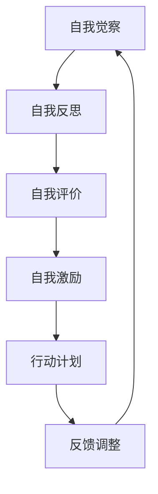

                 


## 《化解内心矛盾：自我对话的有效策略》

### 关键词：自我对话，内心矛盾，心理学，策略，情绪调节

> 摘要：本文旨在探讨自我对话作为一种有效的心理调节策略，帮助个体化解内心矛盾，提升心理健康。通过详细分析自我对话的原理、常见内心矛盾及其应对策略，结合心理学理论和数学模型，为读者提供一套实用的方法，以期在日常生活中实现自我提升和情绪管理。

### 引言

#### 1.1 心理学背景知识介绍

在心理学领域，内心矛盾（intrapsychic conflict）是指个体在心理活动中产生的对立情绪、动机或信仰之间的冲突。这种冲突往往源自于人的内心深处，是心理困扰和情绪问题的根源。例如，恐惧、焦虑、厌恶、挫败感等都是常见的内心矛盾表现形式。心理学研究指出，自我对话（self-talk）是一种有效的心理调节策略，可以帮助个体识别和化解内心矛盾，从而提升心理健康。

#### 1.2 自我对话的概念与重要性

自我对话是指个体内心中的自我沟通和思考过程。这种对话可以是积极的，如自我激励、自我肯定；也可以是消极的，如自我批评、自我怀疑。积极的自我对话有助于个体建立自信心、提高情绪调节能力，而消极的自我对话则可能加剧内心矛盾，导致心理问题。

自我对话在心理学中具有重要地位，因为它直接影响到个体的认知和行为。有效的自我对话策略可以帮助个体识别内心的冲突点，理解自己的情绪和行为，从而采取积极的方法进行调节。本文将围绕自我对话的原理、类型、作用以及常见内心矛盾的应对策略进行详细探讨。

### 第1章 自我对话原理

#### 2.1 自我对话的定义与类型

自我对话是指个体在内心中与自己进行对话的过程。根据对话的内容和性质，自我对话可以分为以下几种类型：

1. **积极的自我对话**：这种对话以鼓励、激励和自我肯定为主，有助于提升个体的自信心和情绪状态。例如，“我能够完成这个任务。”或“我很聪明，可以解决这个问题。”

2. **消极的自我对话**：这种对话以批评、怀疑和自我否定为主，可能导致个体的情绪低落和自我怀疑。例如，“我做不到这件事。”或“我真的很笨。”

3. **解决问题的自我对话**：这种对话专注于分析问题、制定解决方案，有助于个体有效应对挑战。例如，“这个问题是什么？我可以怎么解决它？”

4. **情感调节的自我对话**：这种对话通过自我安慰、情绪表达等方式，帮助个体调节情绪，减轻心理压力。例如，“我可以休息一会儿，放松一下。”

#### 2.2 自我对话的作用与效果

自我对话在心理调节中具有重要作用，其效果主要体现在以下几个方面：

1. **认知重构**：自我对话可以帮助个体重新审视自己的认知和行为，从而改变负面思维模式，建立积极的认知结构。

2. **情绪调节**：通过积极的自我对话，个体可以提升情绪状态，减轻焦虑、恐惧等负面情绪。

3. **目标设定与实现**：自我对话有助于个体设定明确的目标，并激励自己为实现目标而努力。

4. **自我效能感提升**：积极的自我对话可以增强个体的自我效能感，提升自信心和行动力。

#### 2.3 自我对话的心理学基础

自我对话的心理学基础主要涉及认知心理学和社会心理学的相关理论。以下是一些关键概念：

1. **认知理论**：认知理论认为，个体的情绪和行为受到其认知结构的影响。自我对话作为一种认知活动，可以通过改变个体的认知来调节情绪和行为。

2. **社会认知理论**：社会认知理论指出，个体的认知过程受到其社会经验和社交互动的影响。自我对话中的社会元素，如角色扮演和模拟社交情境，有助于个体理解自己的行为和情绪。

3. **情绪调节理论**：情绪调节理论关注个体如何管理和调节自己的情绪。自我对话作为情绪调节的一种方式，可以帮助个体识别和调节情绪。

#### 2.3.1 Mermaid流程图：自我对话的过程



**自我觉察**：个体识别和意识到自己的情绪、思维和行为。

**自我反思**：个体分析和理解自己的情绪、思维和行为。

**自我评价**：个体对自己的情绪、思维和行为进行评价，判断其积极或消极。

**自我激励**：个体通过自我对话激发积极情绪和行为。

**行动计划**：个体制定具体的行动计划来应对问题和挑战。

**反馈调整**：个体根据行动计划的效果进行反馈和调整。

### 第2章 常见内心矛盾与自我对话策略

#### 3.1 恐惧与焦虑

恐惧和焦虑是常见的内心矛盾，它们往往源于个体的威胁感知和应对能力的失衡。以下是一些自我对话策略，可以帮助个体化解恐惧和焦虑。

#### 3.1.1 恐惧与焦虑的数学模型和数学公式

1. **恐惧程度**：
   $$
   \text{恐惧程度} = \frac{\text{威胁感知} \times \text{威胁大小}}{\text{应对能力}}
   $$

2. **焦虑程度**：
   $$
   \text{焦虑程度} = \text{未解决的内心矛盾数量} \times \text{担忧程度}
   $$

#### 3.1.2 恐惧与焦虑的自我对话策略

1. **自我觉察**：
   - “我现在的恐惧程度是多少？”
   - “我在担心什么？”

2. **自我反思**：
   - “这个恐惧是否有根据？为什么？”
   - “我可以做些什么来减轻恐惧？”

3. **自我评价**：
   - “我是否过度担心了？”
   - “我是否有足够的应对能力？”

4. **自我激励**：
   - “我可以克服这个恐惧。”
   - “我有能力应对这个问题。”

5. **行动计划**：
   - “我需要制定一个行动计划来面对恐惧。”
   - “我将采取以下步骤来减轻恐惧：”

6. **反馈调整**：
   - “我的行动计划有效吗？”
   - “我需要调整我的行动计划吗？”

#### 3.1.3 伪代码：如何应对恐惧与焦虑

```python
def 处理恐惧与焦虑():
    # 自我觉察
    恐惧感知 = 检测威胁感知()
    应对能力 = 评估应对能力()
    
    # 自我反思
    威胁大小 = 评估威胁大小()
    恐惧程度 = 恐惧感知 * 威胁大小 / 应对能力
    
    # 自我评价
    if 恐惧程度 > 恐惧阈值:
        print("我的恐惧程度很高，需要调整。")
    else:
        print("我的恐惧程度在可控范围内。")
    
    # 自我激励
    if 应对能力 < 应对能力目标:
        print("我需要加强我的应对能力。")
    else:
        print("我的应对能力已经足够。")
        
    # 行动计划
    if 恐惧程度 > 恐惧阈值:
        print("我需要制定具体的行动计划来降低恐惧程度。")
    else:
        print("我的行动计划是维持现状。")
        
    # 反馈调整
    新的应对能力 = 重新评估应对能力()
    恐惧程度 = 更新恐惧程度()
```

#### 3.2 厌恶与挫败感

厌恶和挫败感是另一种常见的内心矛盾，它们往往源于对某些事物或经历的负面情绪和感受。

#### 3.2.1 厌恶与挫败感的数学模型和数学公式

1. **厌恶程度**：
   $$
   \text{厌恶程度} = \text{厌恶因子} \times \text{时间成本}
   $$

2. **挫败感程度**：
   $$
   \text{挫败感程度} = \text{挫败事件数量} \times \text{挫败事件影响}
   $$

#### 3.2.2 厌恶与挫败感的自我对话策略

1. **自我觉察**：
   - “我现在的厌恶程度是多少？”
   - “我在为什么感到挫败？”

2. **自我反思**：
   - “这个厌恶是否有根据？为什么？”
   - “我可以做些什么来减轻厌恶？”

3. **自我评价**：
   - “我是否过度厌恶了？”
   - “我是否有足够的应对挫败感的能力？”

4. **自我激励**：
   - “我可以克服这个厌恶。”
   - “我有能力从挫败中恢复。”

5. **行动计划**：
   - “我需要制定一个行动计划来面对厌恶和挫败感。”
   - “我将采取以下步骤来减轻厌恶和挫败感：”

6. **反馈调整**：
   - “我的行动计划有效吗？”
   - “我需要调整我的行动计划吗？”

#### 3.2.3 伪代码：如何应对厌恶与挫败感

```python
def 处理厌恶与挫败感():
    # 自我觉察
    厌恶因子 = 评估厌恶因子()
    时间成本 = 评估时间成本()
    
    # 自我反思
    厌恶程度 = 厌恶因子 * 时间成本
    挫败事件数量 = 计算挫败事件数量()
    挫败事件影响 = 评估挫败事件影响()
    
    # 自我评价
    if 厌恶程度 > 厌恶阈值:
        print("我感到很厌恶，需要调整。")
    else:
        print("我的厌恶程度在可控范围内。")
    
    if 挫败事件数量 > 挫败事件数量阈值:
        print("我遭受了很多挫败，需要重新评估。")
    else:
        print("我的挫败事件数量在可控范围内。")
        
    # 自我激励
    if 厌恶程度 > 厌恶阈值:
        print("我需要找出减少厌恶的方法。")
    else:
        print("我已经找到了减少厌恶的方法。")
        
    # 行动计划
    if 挫败事件数量 > 挫败事件数量阈值:
        print("我需要重新制定行动计划来应对挫败感。")
    else:
        print("我的行动计划已经足够。")
        
    # 反馈调整
    新的厌恶因子 = 重新评估厌恶因子()
    新的时间成本 = 重新评估时间成本()
```

### 总结

自我对话是一种强大的心理调节工具，可以帮助个体化解内心矛盾，提升心理健康。通过积极的自我对话策略，个体可以更好地识别和管理自己的情绪和行为，从而实现自我提升和情绪管理。本文介绍了自我对话的原理、常见内心矛盾的应对策略，并通过数学模型和伪代码进行了详细阐述，为读者提供了一套实用的方法。希望读者能够运用这些策略，改善自己的心理状态，过上更加积极、健康的生活。

### 作者信息

**作者：AI天才研究院/AI Genius Institute & 禅与计算机程序设计艺术 /Zen And The Art of Computer Programming**

