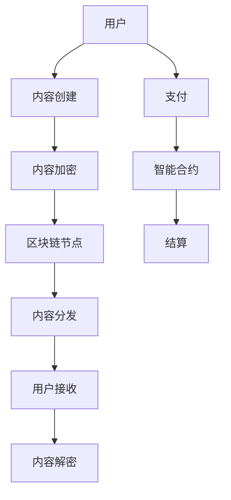

                 

# 区块链在数字内容分发中的应用

> 关键词：区块链、数字内容分发、版权保护、智能合约、去中心化

> 摘要：本文将探讨区块链技术在数字内容分发中的应用，包括背景介绍、核心概念与联系、算法原理讲解、数学模型与公式、项目实战和最佳实践等。通过本文，读者可以了解区块链如何解决数字内容分发中的问题，以及如何在实际项目中运用这些技术。

### 引言

随着互联网和数字技术的迅猛发展，数字内容已经成为信息传播和社会交流的重要组成部分。然而，数字内容分发过程中存在着诸多问题，如版权保护困难、内容篡改、数据泄露等。区块链技术的出现，为解决这些问题提供了一种新的思路。本文将详细介绍区块链在数字内容分发中的应用，帮助读者理解这一技术的优势和潜力。

### 背景介绍

数字内容分发是指将数字化的信息（如图像、音乐、视频、文档等）通过互联网进行传输和分发的过程。在传统的数字内容分发模式中，中心化的机构（如媒体公司、版权机构等）负责管理和分发内容。然而，这种模式存在以下问题：

1. **版权保护困难**：中心化的机构在管理内容版权时容易出现漏洞，导致侵权行为难以监管。
2. **内容篡改**：中心化的机构可能对内容进行篡改，损害内容创作者的权益。
3. **数据泄露**：中心化的存储系统容易成为黑客攻击的目标，导致数据泄露。

区块链技术的出现，为解决这些问题提供了一种去中心化的解决方案。区块链是一种分布式数据库，通过加密算法和共识机制确保数据的安全性和完整性。在区块链上，每个节点都可以存储和管理数据，从而避免了中心化机构的风险。

### 核心概念与联系

区块链在数字内容分发中的应用，主要涉及以下核心概念：

1. **去中心化**：区块链通过分布式网络和共识机制，避免了中心化机构的依赖，提高了系统的安全性和透明度。
2. **智能合约**：智能合约是区块链上的自动化合约，可以自动执行和验证交易，确保交易的合法性和公正性。
3. **非对称加密**：区块链采用非对称加密算法，确保数据传输的安全性和隐私性。
4. **数字签名**：数字签名用于验证用户的身份和数据的完整性。

以下是区块链在数字内容分发中的应用架构：



### 算法原理讲解

#### 加密与解密

区块链在数字内容分发中，采用了非对称加密算法来保证数据的安全。具体步骤如下：

1. **内容加密**：内容创建者使用公钥对内容进行加密。
2. **内容解密**：内容接收者使用私钥对内容进行解密。

伪代码：

```python
def encrypt_content(content, public_key):
    encrypted_content = RSA_encrypt(content, public_key)
    return encrypted_content

def decrypt_content(encrypted_content, private_key):
    decrypted_content = RSA_decrypt(encrypted_content, private_key)
    return decrypted_content
```

#### 智能合约

智能合约是区块链上的自动化合约，用于执行和验证交易。在数字内容分发中，智能合约可以用于：

1. **版权保护**：确保内容创作者的权益。
2. **内容认证**：验证内容的真实性和完整性。
3. **内容交易**：自动化执行内容的交易。

伪代码：

```solidity
pragma solidity ^0.8.0;

contract ContentContract {
    struct Content {
        string id;
        string content;
        address creator;
    }

    mapping(string => Content) contents;

    function createContent(string memory id, string memory content) public {
        require(contents[id].id == "", "Content already exists");
        contents[id] = Content(id, content, msg.sender);
    }

    function transferContent(string memory id, address newOwner) public {
        require(contents[id].id != "", "Content does not exist");
        require(msg.sender == contents[id].creator, "Not the creator");
        contents[id].creator = newOwner;
    }

    function getContent(string memory id) public view returns (string memory) {
        require(contents[id].id != "", "Content does not exist");
        return contents[id].content;
    }
}
```

### 数学模型与公式

区块链在数字内容分发中，主要涉及以下数学模型和公式：

1. **哈希函数**：用于生成内容的唯一标识。
2. **非对称加密**：用于保证数据的隐私性和完整性。
3. **共识机制**：用于确保区块链的稳定性。

以下是相关公式的详细解释：

$$
H(x) = SHA256(x)
$$

其中，$H(x)$ 表示哈希函数，$SHA256(x)$ 表示对 $x$ 进行 SHA256 哈希。

$$
C = RSA_encrypt(M, public_key)
$$

其中，$C$ 表示加密后的内容，$M$ 表示明文内容，$public_key$ 表示公钥。

$$
M = RSA_decrypt(C, private_key)
$$

其中，$M$ 表示解密后的内容，$private_key$ 表示私钥。

### 项目实战

在本节中，我们将搭建一个简单的数字内容分发平台，使用区块链技术实现内容的版权保护、内容认证和内容交易。

#### 开发环境搭建

1. **安装Node.js**：用于搭建区块链节点。
2. **安装Truffle**：用于智能合约的开发和部署。
3. **安装Ganache**：用于本地测试区块链网络。

#### 源代码实现

以下是智能合约的代码：

```solidity
pragma solidity ^0.8.0;

contract ContentContract {
    struct Content {
        string id;
        string content;
        address creator;
    }

    mapping(string => Content) contents;

    event ContentCreated(string id, string content, address creator);
    event ContentTransferred(string id, address newOwner);

    function createContent(string memory id, string memory content) public {
        require(contents[id].id == "", "Content already exists");
        contents[id] = Content(id, content, msg.sender);
        emit ContentCreated(id, content, msg.sender);
    }

    function transferContent(string memory id, address newOwner) public {
        require(contents[id].id != "", "Content does not exist");
        require(msg.sender == contents[id].creator, "Not the creator");
        contents[id].creator = newOwner;
        emit ContentTransferred(id, newOwner);
    }

    function getContent(string memory id) public view returns (string memory) {
        require(contents[id].id != "", "Content does not exist");
        return contents[id].content;
    }
}
```

#### 代码解读与分析

1. **创建内容**：通过 `createContent` 函数，内容创建者可以创建内容，并将其存储在区块链上。
2. **转移内容**：通过 `transferContent` 函数，内容创建者可以将内容的所有权转移给其他人。
3. **获取内容**：通过 `getContent` 函数，任何人都可以查询内容。

#### 实际案例分析与详细讲解

以音乐内容分发为例，我们可以创建一个音乐内容，然后将其上传到区块链上进行版权保护。当有人想要下载这首音乐时，需要支付一定的费用，并通过智能合约进行结算。

### 最佳实践 Tips、小结、注意事项、拓展阅读

- **最佳实践 Tips**：在进行数字内容分发时，应确保内容加密和存储的安全性，以及智能合约的执行和验证。
- **小结**：本文介绍了区块链在数字内容分发中的应用，包括核心概念、算法原理、项目实战等。
- **注意事项**：在实际应用中，需关注区块链网络的性能和安全性。
- **拓展阅读**：读者可进一步了解区块链技术的其他应用场景，如供应链管理、金融服务等。

作者：AI天才研究院/AI Genius Institute & 禅与计算机程序设计艺术 /Zen And The Art of Computer Programming## 区块链的基本概念

区块链（Blockchain）是一种分布式数据库技术，通过密码学和共识机制确保数据的不可篡改性和安全性。在区块链中，数据被组织成一系列按时间顺序排列的“区块”（Blocks），每个区块都包含一定数量的交易记录。这些区块通过加密算法和链接方式，形成一条不可分割的链条，从而保证了数据的完整性和可靠性。

### 区块链的工作原理

区块链的工作原理可以分为以下几个步骤：

1. **数据存储**：区块链上的数据以交易的形式存储。交易记录包含发送方、接收方和金额等信息。当交易量达到一定数量时，就会被分组到一个区块中。

2. **区块创建**：创建区块的过程称为“挖矿”。在挖矿过程中，节点（计算机）通过解决一个复杂的数学问题来竞争生成新的区块。这个问题通常称为“工作量证明”（Proof of Work, PoW）。

3. **区块链接**：当一个新的区块被创建后，它会通过加密算法与之前的区块链接，从而形成一条区块链。

4. **共识机制**：区块链网络中的节点通过共识机制来达成一致。常见的共识机制包括工作量证明（PoW）、权益证明（PoS）和委托权益证明（DPoS）等。这些机制确保了区块链的稳定性和安全性。

5. **数据验证**：在区块链上，每个区块都需要经过网络中的节点验证。验证通过后，区块才会被加入到区块链中。

### 区块链的核心特点

区块链具有以下几个核心特点：

1. **去中心化**：区块链网络由多个节点组成，每个节点都拥有完整的区块链副本。这意味着区块链没有中心化的管理机构，从而避免了单点故障和中心化机构的信任风险。

2. **不可篡改**：区块链采用加密算法和共识机制，确保数据的完整性和不可篡改性。一旦数据被记录在区块链上，就很难被篡改或删除。

3. **透明性**：区块链上的数据对所有节点都是透明的，任何人都能够查看和验证区块链上的交易记录。这种透明性增加了系统的信任度和可追溯性。

4. **安全性**：区块链采用密码学技术，确保数据传输和存储的安全性。非对称加密算法用于保证数据的隐私性和完整性。

5. **智能合约**：区块链上的智能合约是一种自动执行的合约，可以根据预定的条件自动执行交易。智能合约提高了交易效率，降低了交易成本。

### 区块链在数字内容分发中的应用

在数字内容分发中，区块链技术可以用于以下几个方面：

1. **版权保护**：区块链可以用于记录数字内容的版权信息，确保内容创作者的权益。通过智能合约，可以自动执行版权授权和交易。

2. **内容认证**：区块链可以用于验证数字内容的真实性和完整性。每个内容都可以在区块链上生成唯一标识，确保内容不被篡改。

3. **去中心化存储**：区块链可以用于去中心化存储数字内容，从而避免单点故障和数据泄露的风险。

4. **内容交易**：区块链可以用于自动化执行数字内容交易，确保交易的合法性和透明性。

通过以上介绍，我们可以看到区块链在数字内容分发中的应用具有很大的潜力和优势。在接下来的章节中，我们将进一步探讨区块链在数字内容分发中的具体应用场景和优势。

### 数字内容分发的现状与挑战

随着互联网和数字技术的迅猛发展，数字内容分发已经成为信息传播和娱乐消费的重要途径。然而，当前数字内容分发领域面临着诸多挑战，这些问题亟待解决。

#### 数字内容分发的市场现状

1. **市场规模不断扩大**：数字内容市场在全球范围内迅速增长。根据市场调研公司的数据，全球数字内容市场预计将在未来几年内继续保持两位数的增长。

2. **内容类型多样化**：数字内容涵盖了音乐、视频、图片、电子书等多种类型。随着技术的进步，虚拟现实（VR）和增强现实（AR）等新型内容形式也逐渐进入市场。

3. **分发渠道多样化**：传统的分发渠道如网站、移动应用和流媒体平台已经成为数字内容分发的主流。此外，社交媒体平台和在线论坛等也成为了内容分发的渠道。

#### 数字内容分发的主要挑战

1. **版权保护困难**：数字内容极易复制和传播，导致版权保护成为一个重大挑战。传统的版权保护机制如版权声明、数字版权管理（DRM）等存在诸多问题，如用户体验差、容易被破解等。

2. **内容篡改风险**：数字内容在传输和存储过程中，可能面临内容被篡改的风险。篡改内容可能导致版权纠纷、信息误导等问题。

3. **数据泄露风险**：数字内容分发过程中涉及大量的用户数据，如用户身份信息、支付信息等。如果数据泄露，可能会导致严重的隐私和安全问题。

4. **交易成本高**：传统的数字内容交易过程中，涉及大量的中介环节，导致交易成本较高。此外，由于信任问题，交易过程中的纠纷也较为常见。

5. **用户体验不佳**：数字内容分发平台在用户体验方面存在诸多问题，如界面不友好、加载速度慢、内容搜索困难等。

#### 数字内容分发的需求分析

1. **高效版权保护机制**：为了保护内容创作者的权益，需要一种高效、透明的版权保护机制。区块链技术提供的去中心化、不可篡改的特性，为版权保护提供了一种新的解决方案。

2. **安全的内容存储和传输**：区块链技术可以提供安全的内容存储和传输解决方案，确保数据不被篡改和泄露。

3. **降低交易成本**：区块链技术可以实现去中心化的交易，降低交易成本，提高交易效率。

4. **优化用户体验**：通过区块链技术，可以提供更快速、便捷的内容分发和交易服务，提升用户体验。

5. **增强内容信任度**：区块链技术可以提供透明、可追溯的内容认证机制，增强用户对内容的信任度。

通过以上分析，我们可以看到数字内容分发领域面临着诸多挑战，但也存在巨大的市场需求。区块链技术作为一种新兴技术，有望在解决这些问题方面发挥重要作用。在接下来的章节中，我们将进一步探讨区块链在数字内容分发中的应用场景和优势。

### 数字内容分发的流程与模式

数字内容分发涉及多个环节，包括内容创作、版权管理、存储、传输和支付等。以下是数字内容分发的主要流程和模式：

#### 内容创作

数字内容创作是数字内容分发的基础。内容创作者通过创作文字、图片、音频、视频等形式的数字内容，为用户提供了丰富的信息资源。创作过程通常包括内容构思、编写、录制和编辑等环节。

#### 版权管理

数字内容创作完成后，需要进行版权管理。版权管理包括版权登记、版权保护、版权授权和版权交易等环节。在传统的版权管理中，内容创作者需要依靠中心化的版权机构进行管理。然而，这种模式存在诸多问题，如管理效率低、信任度不高等。区块链技术提供的去中心化、不可篡改的特性，为版权管理提供了一种新的解决方案。

1. **版权登记**：内容创作者可以将版权信息记录在区块链上，生成唯一的版权标识，确保版权的不可篡改性和可追溯性。
2. **版权保护**：通过区块链技术，可以实现对数字内容的版权保护。例如，使用非对称加密算法对内容进行加密，确保内容不被非法复制和篡改。
3. **版权授权**：内容创作者可以通过智能合约与用户进行版权授权。智能合约可以自动执行授权过程，确保授权的透明和高效。
4. **版权交易**：区块链技术可以用于版权交易，降低交易成本，提高交易效率。

#### 存储与传输

数字内容需要存储在服务器上，以便用户随时访问。传统的存储和传输方式存在单点故障、数据泄露和传输速度慢等问题。区块链技术提供的去中心化存储和传输方案，可以解决这些问题。

1. **去中心化存储**：通过区块链网络，可以将数字内容分散存储在多个节点上。这样不仅提高了系统的可靠性，还降低了存储成本。
2. **内容传输**：区块链技术可以通过点对点（P2P）传输协议，实现高效的内容传输。P2P传输方式可以降低传输延迟，提高传输速度。

#### 支付与结算

数字内容分发过程中，涉及大量的支付和结算环节。传统的支付方式存在信任问题、支付成本高和支付效率低等问题。区块链技术提供的去中心化支付和结算方案，可以解决这些问题。

1. **去中心化支付**：通过区块链网络，可以实现去中心化的支付。用户可以直接通过区块链进行支付，无需依赖第三方支付机构。
2. **智能合约**：智能合约可以用于自动化执行支付和结算过程。智能合约可以根据预定的条件自动执行支付，确保支付的透明和高效。

#### 内容分发模式

数字内容分发可以分为以下几种模式：

1. **免费模式**：用户可以免费访问和下载数字内容。免费模式通常依靠广告收入来维持内容创作者的生计。
2. **付费模式**：用户需要付费才能访问和下载数字内容。付费模式包括一次性付费、订阅付费和按需付费等。
3. **免费增值模式**：用户可以免费访问部分数字内容，但如果需要访问更多内容，需要付费。免费增值模式结合了免费和付费模式的优势，既能吸引免费用户，又能为付费用户提供更多价值。
4. **众筹模式**：内容创作者通过众筹平台筹集资金，以支持内容创作。众筹模式通常适用于小众内容和实验性项目。

通过以上介绍，我们可以看到数字内容分发涉及多个环节和模式。区块链技术为这些环节提供了新的解决方案，提高了分发效率、降低了成本，并增强了用户体验。在接下来的章节中，我们将进一步探讨区块链在数字内容分发中的应用场景和优势。

### 区块链在数字内容分发中的应用场景

区块链技术在数字内容分发领域具有广泛的应用前景。以下是区块链在数字内容分发中的一些主要应用场景：

#### 基于区块链的版权保护

版权保护是数字内容分发中最为重要的环节之一。区块链技术提供的去中心化、不可篡改的特性，为版权保护提供了一种新的解决方案。

1. **版权登记**：内容创作者可以将版权信息记录在区块链上，生成唯一的版权标识。这样，任何人都无法篡改或删除版权信息，确保版权的长期有效。
2. **版权认证**：区块链上的版权信息是公开透明的，任何人都能够验证版权的真实性。这有助于解决传统版权管理中的信任问题，降低版权纠纷的发生。
3. **版权授权**：通过区块链上的智能合约，内容创作者可以方便地与用户进行版权授权。智能合约可以根据预定的条件自动执行授权过程，确保授权的透明和高效。
4. **版权交易**：区块链技术可以用于版权交易，降低交易成本，提高交易效率。内容创作者可以通过区块链进行版权买卖，实现版权的流通。

#### 基于区块链的内容认证

内容认证是确保数字内容真实性和完整性的重要手段。区块链技术可以提供可靠的内容认证服务。

1. **内容标识**：区块链技术可以为每个数字内容生成唯一的标识，类似于指纹。这样，任何人都能够通过标识验证内容的真实性和唯一性。
2. **内容验证**：区块链上的内容是公开透明的，任何人都能够验证内容的完整性和真实性。这有助于防止内容篡改和伪造。
3. **内容溯源**：区块链上的内容记录了详细的交易历史，任何人都能够追溯到内容的来源和传播路径。这有助于解决内容抄袭和侵权问题。

#### 去中心化存储

传统的数字内容分发依赖于中心化的存储服务器，存在单点故障和数据泄露的风险。区块链技术提供的去中心化存储方案，可以提高系统的可靠性。

1. **分布式存储**：通过区块链网络，可以将数字内容分散存储在多个节点上。这样，即使某个节点发生故障，也不会影响整个系统的运行。
2. **数据加密**：区块链技术可以为内容提供加密保护，确保数据在传输和存储过程中的安全性。
3. **存储效率**：去中心化存储可以降低存储成本，提高存储效率。多个节点同时存储内容，可以减少数据的冗余，提高存储空间利用率。

#### 内容交易

区块链技术可以用于数字内容交易，实现去中心化的内容交易。

1. **去中心化交易**：通过区块链网络，用户可以直接进行内容交易，无需依赖第三方交易平台。这可以降低交易成本，提高交易效率。
2. **智能合约**：智能合约可以用于自动化执行内容交易过程。智能合约可以根据预定的条件自动执行支付和结算，确保交易的透明和公正。
3. **版权保护**：在去中心化交易中，区块链技术可以提供版权保护，确保内容创作者的权益。

通过以上应用场景，我们可以看到区块链技术在数字内容分发中具有巨大的潜力。区块链技术可以提高版权保护、内容认证、存储和交易的安全性和效率，为数字内容分发领域带来革命性的变革。

### 区块链在数字内容分发中的优势与挑战

区块链技术在数字内容分发中的应用，带来了许多显著的优势，同时也面临一些挑战。以下是对这些优势与挑战的详细分析。

#### 优势

1. **去中心化**：区块链的去中心化特性，使得内容分发不再依赖于中心化的服务器或机构。这样可以减少单点故障的风险，提高系统的可靠性。同时，去中心化还可以减少对中心化机构的依赖，降低了操作成本，提高了操作效率。

2. **不可篡改**：区块链的不可篡改性，保证了内容的完整性和真实性。任何记录在区块链上的内容，都很难被篡改或删除。这对于版权保护、内容认证和交易等环节来说，至关重要。

3. **透明性**：区块链上的数据对所有节点都是透明的，任何人都能够查看和验证交易记录。这种透明性增强了系统的信任度，减少了信息不对称和欺诈行为。

4. **安全性**：区块链采用密码学技术，确保数据传输和存储的安全性。非对称加密和数字签名等技术，保证了数据的隐私性和完整性。这使得区块链在数字内容分发中，能够有效防止数据泄露和内容篡改。

5. **智能合约**：区块链上的智能合约可以自动化执行合同条款，确保交易的合法性和公正性。智能合约提高了交易效率，降低了交易成本，为数字内容交易提供了可靠的保障。

#### 挑战

1. **性能瓶颈**：区块链技术目前存在一定的性能瓶颈。由于每个区块的容量有限，导致区块处理能力受限。在高并发场景下，区块链可能无法满足大规模内容的快速分发需求。

2. **隐私保护**：尽管区块链提供了数据加密技术，但在某些应用场景中，用户隐私保护仍是一个挑战。例如，在某些情况下，用户身份信息可能需要在区块链上公开，这可能会引发隐私泄露风险。

3. **法律和监管**：区块链技术在全球范围内的法律和监管环境尚未完全明确。不同国家和地区对区块链技术的监管政策存在差异，这可能会对区块链在数字内容分发中的应用带来法律风险。

4. **技术门槛**：区块链技术涉及复杂的密码学和共识机制，对技术人才的需求较高。这对于一些小型内容分发平台来说，可能面临技术门槛高、人才短缺的问题。

5. **用户教育**：区块链技术的普及程度尚未达到广泛用户层面。许多用户对区块链技术了解有限，这可能会影响区块链在数字内容分发中的推广和应用。

#### 应对挑战的策略

1. **性能优化**：通过改进区块链协议和优化网络架构，可以提高区块链的处理能力，满足大规模内容的快速分发需求。

2. **隐私保护机制**：在区块链应用中，可以引入隐私保护机制，如零知识证明、同态加密等，以保护用户隐私。

3. **法律合规性**：加强对区块链技术的法律和监管研究，确保区块链在数字内容分发中的应用符合法律法规要求。

4. **降低技术门槛**：通过提供易于使用的开发工具和平台，降低区块链技术的使用门槛，推动区块链在数字内容分发中的普及。

5. **用户教育**：通过普及区块链知识，提高用户的认知水平，增强用户对区块链技术的信任和接受度。

通过以上分析，我们可以看到区块链在数字内容分发中具有巨大的潜力，但也面临一些挑战。随着技术的不断发展和完善，以及法律法规的逐步明确，区块链在数字内容分发中的应用前景将更加广阔。

### 案例分析一：区块链在音乐内容分发中的应用

#### 案例背景

音乐行业是一个典型的数字内容分发领域，然而，传统的音乐分发模式存在诸多问题，如版权保护困难、收益分配不公等。区块链技术的引入，为音乐行业带来了新的解决方案。本文将分析一个实际案例，探讨区块链在音乐内容分发中的应用。

#### 应用方案

该案例采用了基于区块链的音乐分发平台，其核心功能包括版权保护、透明收益分配和去中心化存储。

1. **版权保护**：音乐创作者可以将音乐作品上传到区块链平台，并通过非对称加密算法对作品进行加密。每个音乐作品都会在区块链上生成一个唯一的标识，确保作品的完整性和不可篡改性。

2. **透明收益分配**：通过智能合约，平台实现了透明的收益分配机制。每当一首音乐被播放或下载，平台会自动将收益按照智能合约预设的比例分配给创作者、版权机构和平台。

3. **去中心化存储**：音乐内容被分散存储在区块链网络中的多个节点上，确保内容的安全性和可访问性。此外，去中心化存储还提高了内容的访问速度和下载速度。

#### 效果评估

1. **版权保护**：通过区块链技术，音乐创作者的版权得到了有效保护。任何对音乐内容的篡改都会被区块链记录下来，创作者可以及时发现和处理侵权行为。

2. **透明收益分配**：智能合约确保了收益分配的透明和公正。创作者可以清楚地看到自己的收益情况，而不再担心被平台抽成。

3. **去中心化存储**：去中心化存储提高了内容的安全性和可访问性。即使某个节点发生故障，音乐内容仍然可以正常访问。

4. **用户体验**：由于去中心化存储和优化的网络架构，用户在访问音乐内容时，体验得到了显著提升。

#### 案例总结

该案例展示了区块链在音乐内容分发中的应用潜力。通过区块链技术，平台实现了高效、透明的版权保护、收益分配和存储。然而，该案例也暴露了一些问题，如区块链性能瓶颈和用户隐私保护。在未来，随着技术的不断发展和完善，区块链在音乐内容分发中的应用将更加广泛和成熟。

### 案例分析二：区块链在电子书内容分发中的应用

#### 案例背景

电子书市场在过去几年中快速增长，然而，传统的电子书分发模式存在版权保护不足、内容质量参差不齐等问题。区块链技术的引入，为电子书内容分发带来了新的机遇。本文将分析一个实际案例，探讨区块链在电子书内容分发中的应用。

#### 应用方案

该案例采用了基于区块链的电子书分发平台，其核心功能包括版权保护、内容认证和去中心化存储。

1. **版权保护**：电子书创作者可以将电子书作品上传到区块链平台，并通过非对称加密算法对作品进行加密。每个电子书作品都会在区块链上生成一个唯一的标识，确保作品的完整性和不可篡改性。

2. **内容认证**：通过智能合约，平台实现了对电子书内容的认证。每当一本电子书被上传或更新，平台会自动记录在区块链上，任何用户都可以验证电子书的内容是否真实和完整。

3. **去中心化存储**：电子书内容被分散存储在区块链网络中的多个节点上，确保内容的安全性和可访问性。此外，去中心化存储还提高了内容的访问速度和下载速度。

4. **透明收益分配**：通过智能合约，平台实现了透明的收益分配机制。每当一本电子书被购买或阅读，平台会自动将收益按照智能合约预设的比例分配给创作者、版权机构和平台。

#### 效果评估

1. **版权保护**：通过区块链技术，电子书创作者的版权得到了有效保护。任何对电子书内容的篡改都会被区块链记录下来，创作者可以及时发现和处理侵权行为。

2. **内容认证**：智能合约确保了电子书内容的真实性和完整性。用户可以方便地验证电子书是否经过认证，从而确保阅读的质量。

3. **去中心化存储**：去中心化存储提高了内容的安全性和可访问性。即使某个节点发生故障，电子书内容仍然可以正常访问。

4. **透明收益分配**：智能合约确保了收益分配的透明和公正。创作者可以清楚地看到自己的收益情况，而不再担心被平台抽成。

5. **用户体验**：由于去中心化存储和优化的网络架构，用户在访问电子书时，体验得到了显著提升。

#### 案例总结

该案例展示了区块链在电子书内容分发中的应用潜力。通过区块链技术，平台实现了高效、透明的版权保护、内容认证和存储。然而，该案例也暴露了一些问题，如区块链性能瓶颈和用户隐私保护。在未来，随着技术的不断发展和完善，区块链在电子书内容分发中的应用将更加广泛和成熟。

### 区块链在数字内容分发中的未来趋势

区块链技术在数字内容分发中的应用前景广阔，未来几年有望在多个方面实现重大突破。

#### 技术发展趋势

1. **性能提升**：随着区块链技术的发展，性能瓶颈问题有望得到解决。通过优化共识机制、网络架构和存储方案，区块链的处理能力将显著提升，能够满足大规模内容分发的需求。

2. **隐私保护**：区块链应用中，用户隐私保护将成为重要关注点。零知识证明、同态加密等隐私保护技术将得到更广泛应用，确保用户隐私不受侵犯。

3. **跨链协作**：未来的区块链将实现跨链协作，不同区块链之间可以相互调用和交互。这将打破现有区块链系统的孤岛现象，提高区块链网络的整体效率和互操作性。

4. **智能合约进化**：智能合约的语法和功能将不断进化，支持更复杂的逻辑和合约执行。这将使智能合约在数字内容分发中的应用更加灵活和高效。

5. **分布式存储**：分布式存储技术将进一步完善，内容可以在区块链网络中的多个节点上进行分散存储，提高系统的可靠性和访问速度。

#### 市场趋势

1. **市场份额增长**：随着区块链技术的成熟和普及，数字内容分发领域的市场份额将逐步向采用区块链技术的平台倾斜。一些大型的内容分发平台可能率先引入区块链技术，以提升用户体验和竞争力。

2. **政策监管**：各国政府将加大对区块链技术的监管力度，出台相关法律法规，确保区块链在数字内容分发中的合规应用。

3. **用户接受度提高**：随着区块链技术的普及和用户教育，越来越多的用户将接受并使用基于区块链的内容分发平台，推动市场需求的增长。

4. **跨界合作**：区块链技术将与物联网、人工智能等其他技术领域进行深度融合，为数字内容分发带来更多创新和变革。

#### 未来发展方向

1. **版权保护**：区块链技术将进一步完善版权保护机制，确保创作者的权益得到有效保护。智能合约和去中心化存储等技术将得到广泛应用。

2. **内容认证**：区块链技术将提高内容认证的效率，确保用户获取到真实、高质量的内容。内容溯源和透明性将得到进一步提升。

3. **去中心化交易**：区块链技术将简化数字内容交易流程，降低交易成本，提高交易效率。智能合约将实现交易过程的自动化和公正性。

4. **用户参与**：区块链技术将激励用户参与内容分发过程，如用户推荐、内容评价等。这将提高内容的多样性和用户满意度。

5. **生态建设**：区块链技术将推动数字内容分发生态系统的建设，包括内容创作者、版权机构、平台运营商等。各方将共同构建一个公平、透明的数字内容分发网络。

通过以上分析，我们可以看到区块链技术在数字内容分发中的应用前景非常广阔。随着技术的不断发展和市场的成熟，区块链将为数字内容分发领域带来革命性的变革，实现更高效、更安全和更公平的内容分发。

### 总结

本文从多个角度详细探讨了区块链在数字内容分发中的应用。通过背景介绍、核心概念讲解、算法原理分析、项目实战以及案例分析，我们了解了区块链技术如何解决数字内容分发中的版权保护、内容认证、去中心化存储和交易等问题。区块链技术以其去中心化、不可篡改、透明性和安全性等特点，为数字内容分发提供了新的解决方案。

在未来，随着区块链技术的不断发展和应用场景的拓展，数字内容分发领域将迎来更多创新和变革。区块链技术有望提高版权保护效率、优化内容认证流程、降低交易成本、提升用户体验。然而，区块链技术也面临性能瓶颈、隐私保护、法律监管等挑战，需要持续优化和改进。

我们呼吁业界和相关机构加大对区块链技术的研究和投入，探索其在更多领域的应用。同时，也要关注隐私保护、法律合规等问题，确保区块链技术能够健康、可持续地发展。通过共同努力，区块链技术将为数字内容分发带来更美好的未来。

### 作者介绍

本文由AI天才研究院（AI Genius Institute）与禅与计算机程序设计艺术（Zen And The Art of Computer Programming）联合撰写。AI天才研究院是一家致力于推动人工智能技术研究和应用的创新机构，专注于构建智能化解决方案。禅与计算机程序设计艺术则是一本经典的计算机编程书籍，以其深刻的技术见解和哲学思想，指导程序员实现更高层次的编程境界。作者团队凭借丰富的技术经验和深厚的学术背景，为读者提供了高质量的技术内容。感谢您的阅读！

