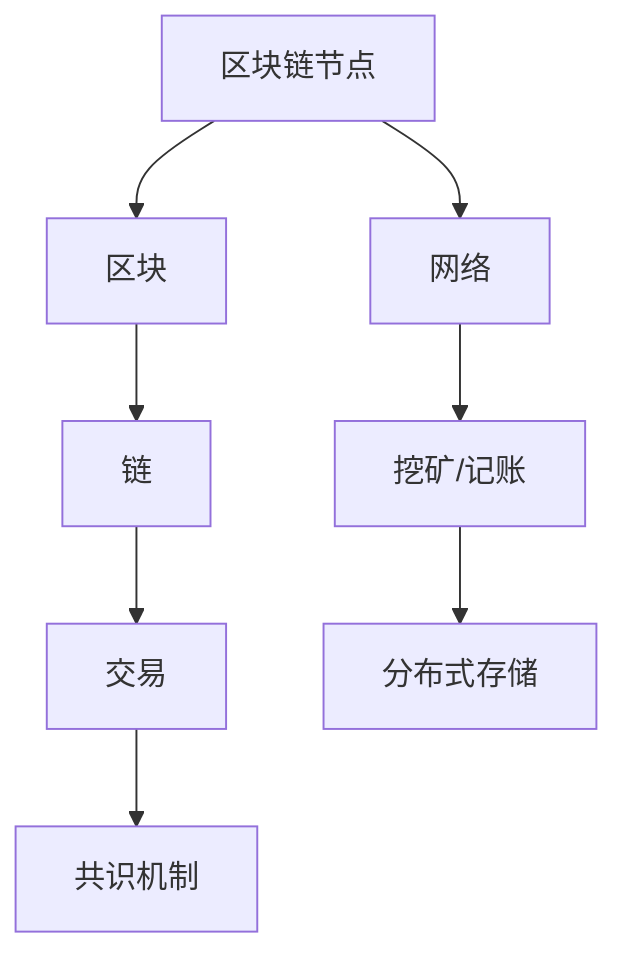
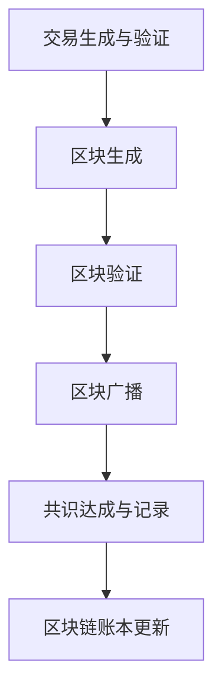
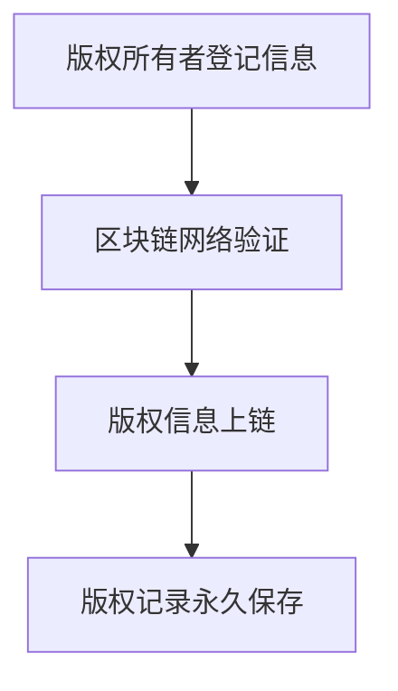
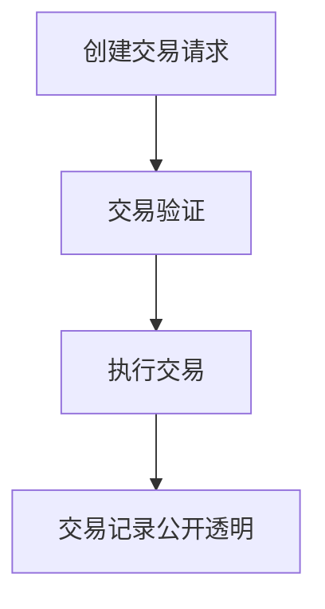
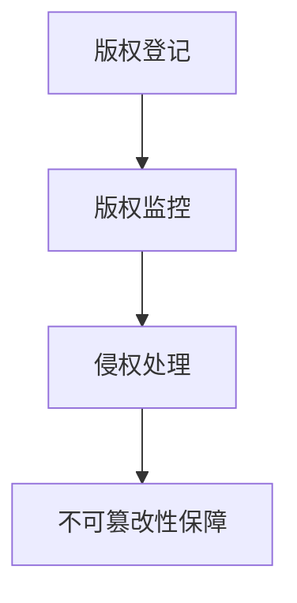
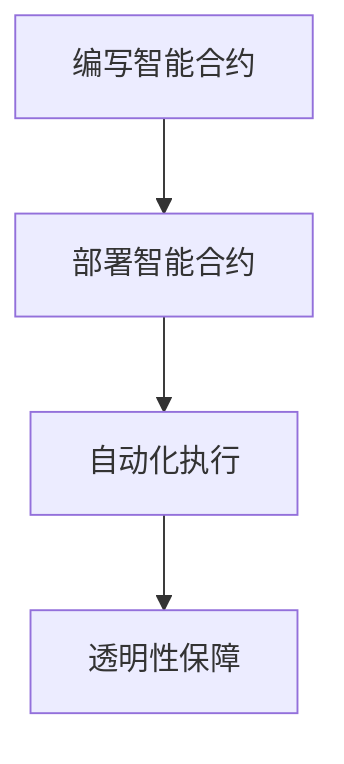
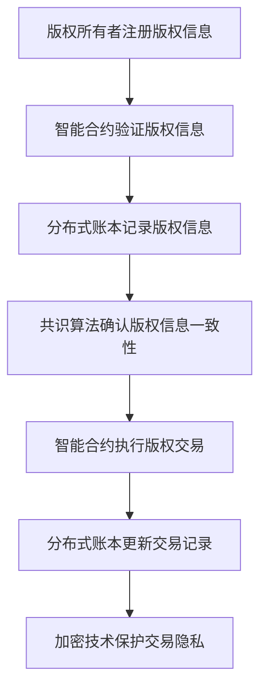

                 

### 文章标题：区块链在数字版权分发中的公平机制

#### 关键词：
- 区块链
- 数字版权
- 公平机制
- 智能合约
- 数字版权分发
- 区块链应用场景

#### 摘要：
本文将探讨区块链技术在数字版权分发中的应用，特别是如何通过区块链构建公平的数字版权分发机制。文章首先概述区块链的基础概念和技术特点，随后分析数字版权分发的现状与挑战。接下来，文章详细讨论区块链在数字版权分发中的具体应用，以及如何利用智能合约实现公平机制。随后，通过实际案例研究，展示区块链技术在数字版权分发中的应用效果。最后，文章展望区块链在数字版权分发中的未来发展趋势，并提出优化公平机制的策略。

## 第一部分 区块链技术概述

### 第1章 区块链基础概念

区块链是一种分布式数据库技术，其核心在于通过多个参与方共同维护一个共享的账本。这个账本记录了所有交易信息，并且这些信息在全球范围内同步更新。区块链具有以下几个关键特点：

- **不可篡改性**：一旦数据记录在区块链上，便不可篡改。这是因为区块链采用了加密算法来保护数据，并且通过共识机制确保所有节点的数据一致性。
- **安全性**：区块链采用加密算法来保护数据隐私和完整性，这使得它成为一个高度安全的系统。
- **高效性**：区块链的去中心化特性避免了单点故障和性能瓶颈，能够高效处理大量交易。

区块链的基础概念包括区块链节点、区块、链和交易。节点是指参与区块链网络的计算设备，每个节点都保存了一份完整的区块链账本。区块是区块链的基本组成单元，包含了若干交易记录。链则是通过区块连接起来的数据结构，保证了数据的完整性和不可篡改性。

在区块链网络中，所有节点通过共识机制来共同维护账本的一致性。常见的共识机制包括工作量证明（PoW）、权益证明（PoS）等。这些共识机制确保了区块链的可靠性和安全性。

### 核心概念与联系

以下是一个Mermaid流程图，展示了区块链的核心组成部分及其相互关系：



在这个流程图中，区块链节点（A）通过共识机制（E）共同维护区块链账本（C）。区块（B）包含了交易记录（D），并通过链（C）连接起来。网络（F）连接所有节点（A），确保信息的同步和一致性。挖矿/记账（G）和分布式存储（H）是区块链网络运行的关键机制。

### 核心算法原理讲解

区块链的核心算法主要包括哈希函数、加密算法和共识算法。

- **哈希函数**：哈希函数是区块链中用于生成唯一标识符的关键算法。它将任意长度的数据映射为固定长度的字符串，确保数据的唯一性和不可篡改性。
- **加密算法**：加密算法用于保护区块链中的数据隐私，确保只有授权方可以读取和修改数据。
- **共识算法**：共识算法是区块链节点达成一致的关键机制。它确保所有节点对于区块链账本的状态保持一致。常见共识算法包括工作量证明（PoW）和权益证明（PoS）。

以下是一个简单的哈希函数伪代码示例：

```python
def hash_function(data):
    # 假设使用SHA-256算法
    return SHA256(data)
```

区块链的共识算法可以概括为以下步骤：

1. **交易收集**：节点收集待处理的交易信息。
2. **区块生成**：节点将收集到的交易信息封装在一个区块中。
3. **区块验证**：其他节点验证区块的有效性，包括交易的正确性和工作量证明。
4. **区块添加**：验证通过的区块被添加到区块链上，更新区块链账本。

以下是一个简单的PoW共识算法伪代码示例：

```python
def proof_of_work(last_hash, target_difficulty):
    nonce = 0
    while hash_function(last_hash + str(nonce)) > target_difficulty:
        nonce += 1
    return nonce
```

在这个示例中，节点需要找到一个随机数（nonce），使得生成的区块哈希值小于目标难度（target_difficulty）。通过这种方式，节点可以竞争生成新的区块，并添加到区块链上。

通过上述核心算法和架构的讲解，读者可以更好地理解区块链技术的工作原理和应用潜力。

----------------------------------------------------------------

### 第2章 区块链网络架构

区块链网络架构是区块链技术的核心组成部分，决定了区块链系统的性能、安全性和扩展性。在这一章中，我们将深入探讨区块链网络的基本架构、运行机制以及共识机制。

#### 区块链网络的基本架构

区块链网络由多个节点（Node）组成，每个节点都是区块链网络中的一个参与者。节点可以是个人电脑、服务器或其他计算设备。每个节点都保存了一份完整的区块链账本，并且能够通过区块链网络与其他节点进行通信。

区块链网络的基本架构包括以下几个关键组成部分：

1. **节点（Node）**：节点是区块链网络中的计算设备，负责存储区块链账本、处理交易、生成区块和参与共识过程。
2. **区块（Block）**：区块是区块链的基本组成单元，包含了若干交易记录。每个区块都有一个唯一的标识符，称为“区块哈希”（Block Hash），用于标识和验证区块。
3. **链（Chain）**：链是由多个区块连接而成的数据结构，保证了区块链的完整性和不可篡改性。区块链的每个区块都指向前一个区块，从而形成一个时间顺序的链。
4. **交易（Transaction）**：交易是区块链上的数据传输单元，包含了交易发起方、接收方和交易金额等信息。交易需要经过验证和确认后才能被包含在区块中。

#### 区块链网络的运行机制

区块链网络的运行机制可以分为以下几个步骤：

1. **交易生成与验证**：用户发起交易，交易包含交易发起方的公钥和私钥，以及交易金额等信息。节点接收到交易后，会验证交易的有效性，包括交易金额是否合法、交易发起方的公钥和私钥是否匹配等。
2. **区块生成**：当节点收集到足够的交易后，会将这些交易封装在一个区块中。区块中包含一个“区块头”（Block Header），其中包含了前一个区块的哈希值（Previous Hash）、区块的随机数（Nonce）和当前时间戳（Timestamp）等。
3. **区块验证**：其他节点会验证新生成的区块的有效性，包括验证区块头的哈希值是否满足工作量证明（Proof of Work, PoW）条件，以及验证区块中的交易是否合法。
4. **区块广播**：验证通过后的区块会被广播到网络中的其他节点，其他节点会将其添加到自己的区块链账本中。
5. **共识达成与记录**：区块链网络的共识机制确保所有节点对于区块链账本的状态保持一致。常见的共识机制包括工作量证明（PoW）、权益证明（PoS）等。

以下是一个Mermaid流程图，展示了区块链网络的基本运行机制：



在这个流程图中，交易（A）生成后，会被节点收集并封装在区块（B）中。经过其他节点的验证（C），验证通过的区块会被广播到网络中的其他节点（D），并通过共识机制达成一致（E），最终更新区块链账本（F）。

#### 共识机制

共识机制是区块链网络中节点达成一致的重要机制。共识机制决定了区块链网络的性能、安全性和扩展性。常见的共识机制包括工作量证明（PoW）、权益证明（PoS）等。

1. **工作量证明（Proof of Work, PoW）**：PoW是比特币采用的共识机制。节点通过计算一个随机数（Nonce），使得生成的区块哈希值满足一定的难度要求。节点之间的竞争机制保证了区块链网络的安全性。
2. **权益证明（Proof of Stake, PoS）**：PoS是相对于PoW的一种更节能的共识机制。节点根据持有的代币数量和持有时间来决定生成区块的优先级。持有代币越多、持有时间越长的节点有更高的概率生成区块。

以下是一个PoW共识机制的伪代码示例：

```python
def proof_of_work(last_hash, target_difficulty):
    nonce = 0
    while hash_function(last_hash + str(nonce)) > target_difficulty:
        nonce += 1
    return nonce
```

在这个示例中，节点需要找到一个随机数（nonce），使得生成的区块哈希值（hash_function(last_hash + str(nonce)))小于目标难度（target_difficulty）。

通过上述对于区块链网络架构的详细讲解，读者可以更好地理解区块链网络的工作原理和运行机制。理解这些核心概念和机制，将为后续章节中讨论区块链在数字版权分发中的应用和公平机制的设计打下坚实的基础。

----------------------------------------------------------------

### 第3章 智能合约

智能合约是区块链技术的一个重要组成部分，它是一种在区块链上运行的自动化协议，能够自动执行、控制或记录法律合同的条款和操作。智能合约通过代码定义了参与方之间的权利和义务，从而实现去中心化的自动化交易。

#### 智能合约的定义与功能

1. **定义**：
   智能合约（Smart Contract）是一种嵌入在区块链上的程序，它在满足特定的条件时自动执行预定义的合约条款。这些条款通常涉及到金融交易、资产转移、身份验证、数据记录等方面。

2. **功能**：
   智能合约具有以下几个关键功能：
   - **自动化执行**：智能合约在满足预设条件时自动执行，无需人工干预。
   - **不可篡改性**：智能合约的代码一旦部署到区块链上，就不可更改，保证了合约条款的持久性和可信性。
   - **透明性**：智能合约的执行过程对所有区块链网络中的参与者都是透明的，任何人都可以查看和验证合约的执行结果。
   - **去中心化**：智能合约通过区块链网络中的分布式节点运行，避免了单点故障和集中化的风险。

#### 智能合约与传统合约的区别

1. **执行方式**：
   - **智能合约**：在区块链网络中，智能合约通过代码执行，一旦满足预设条件，就会自动执行预定义的操作。
   - **传统合约**：传统合约通常依赖于第三方执行机构或法律程序，需要人工审核和执行。

2. **法律效力**：
   - **智能合约**：智能合约的法律效力取决于具体的法律环境。在一些国家和地区，智能合约已被认可为具有法律效力的电子合同。
   - **传统合约**：传统合约的法律效力通常基于法律规范和合同条款的合法性。

3. **透明性**：
   - **智能合约**：智能合约的执行过程是透明和公开的，所有网络参与者都可以查看和验证合约的执行结果。
   - **传统合约**：传统合约的执行过程通常不透明，可能存在信息不对称的问题。

4. **修改性**：
   - **智能合约**：一旦智能合约部署到区块链上，其代码不可更改，保证了合约条款的持久性和可信性。
   - **传统合约**：传统合约可以根据双方的协商进行修改，但修改过程可能涉及法律程序和第三方介入。

#### 智能合约的实现

智能合约的实现通常涉及以下几个步骤：

1. **选择合适的编程语言**：
   - **Solidity**：Solidity是最常用的智能合约编程语言，被以太坊区块链广泛使用。
   - **Vyper**：Vyper是一种用于以太坊智能合约的简单、安全的编程语言。

2. **编写智能合约代码**：
   - 智能合约代码通常包含函数、变量和事件等元素。函数定义了智能合约可以执行的操作，变量用于存储合约的状态，事件用于记录合约执行过程中的关键事件。

3. **编译智能合约**：
   - 使用智能合约编程语言的编译器将智能合约代码编译为字节码，这些字节码将在区块链上执行。

4. **部署智能合约**：
   - 将编译后的智能合约代码部署到区块链网络中，通常需要通过区块链客户端或开发工具完成部署。

以下是一个简单的Solidity智能合约示例：

```solidity
// SPDX-License-Identifier: MIT
pragma solidity ^0.8.0;

contract SimpleContract {
    address public owner;

    constructor() {
        owner = msg.sender;
    }

    function deposit() public payable {
        // 简单的存款功能
    }

    function withdraw() public {
        require(msg.sender == owner, "Only owner can withdraw");
        payable(owner).transfer(address(this).balance);
    }
}
```

在这个示例中，`SimpleContract`定义了一个简单的存款和取款功能。只有合约的创建者（owner）可以调用`withdraw`函数将合约中的余额转移到自己的地址。

#### 智能合约的应用

智能合约的应用场景非常广泛，包括但不限于以下几个方面：

1. **金融交易**：智能合约可以自动化执行金融交易，如去中心化金融（DeFi）协议中的贷款、保险和交易等。
2. **供应链管理**：智能合约可以用于自动化供应链中的交易流程，确保产品质量和交付的透明性。
3. **数字版权管理**：智能合约可以用于数字版权的分发、授权和维权，确保版权的所有权和交易的透明性。
4. **身份验证与投票**：智能合约可以用于构建去中心化的身份验证和投票系统，提高透明度和安全性。

通过上述对于智能合约的定义、功能、实现和应用场景的讲解，读者可以更好地理解智能合约在区块链技术中的重要性和应用潜力。

----------------------------------------------------------------

### 第4章 数字版权分发的现状

随着互联网和数字技术的快速发展，数字版权分发已经成为了全球版权行业的重要组成部分。在这一章中，我们将探讨数字版权分发的现状，分析当前市场中存在的各种挑战，以及区块链技术在解决这些挑战方面的潜力。

#### 数字版权的分发方式

数字版权的分发方式主要包括以下几种：

1. **在线销售**：数字版权可以通过在线平台直接销售给消费者，如亚马逊、苹果商店、谷歌商店等。
2. **授权分发**：版权所有者可以通过授权协议将数字版权分发给合作伙伴，如流媒体平台、电子书平台等。
3. **版权共享**：版权可以通过共享协议，如Creative Commons，分发给公众，允许用户在一定条件下使用和修改内容。
4. **在线租赁**：用户可以通过租赁方式使用数字版权，如Netflix、Spotify等流媒体服务。

#### 数字版权分发的市场现状

数字版权分发的市场现状呈现出以下特点：

1. **市场规模持续增长**：随着数字内容的消费习惯的改变，数字版权分发的市场规模持续增长。根据市场研究公司的数据，全球数字版权市场预计将在未来几年内保持两位数的增长速度。
2. **多元化分发渠道**：数字版权分发渠道不断多元化，除了传统的电商平台和流媒体平台外，社交媒体、直播平台等新型渠道也逐渐成为数字版权分发的重要途径。
3. **地区差异明显**：全球范围内，数字版权分发的市场发展存在显著差异。发达国家的数字版权市场较为成熟，而一些发展中国家仍处于起步阶段。
4. **版权保护挑战**：尽管数字版权分发市场快速增长，但版权保护问题仍然是一个重大挑战。数字内容的易复制性和匿名性使得版权侵权行为难以遏制。

#### 数字版权分发的挑战

数字版权分发面临着以下主要挑战：

1. **版权侵权问题**：数字版权的易复制性和匿名性使得版权侵权行为频发。传统的版权保护手段，如数字版权管理（DRM）等技术，虽然在一定程度上能够限制侵权行为，但难以完全消除侵权风险。
2. **分发效率问题**：数字版权的分发效率受到多种因素的影响，包括技术实现、网络带宽、数据处理等。高效的分发机制对于提高用户体验和减少版权所有者的经济损失至关重要。
3. **透明度不足**：在数字版权分发过程中，交易透明度不足是一个普遍存在的问题。交易过程不透明可能导致版权所有者难以跟踪和管理其数字版权的使用情况。
4. **法律和监管问题**：不同国家和地区的法律法规对于数字版权的分发和保护存在差异，这给全球范围内的数字版权分发带来了法律和监管挑战。

#### 区块链技术在解决挑战方面的潜力

区块链技术在解决数字版权分发的挑战方面具有显著潜力：

1. **版权确权与追踪**：区块链技术可以为数字版权提供不可篡改的记录，确保版权的原始归属和授权情况。通过区块链，版权所有者可以方便地追踪和管理其数字版权的使用情况。
2. **透明交易记录**：区块链上的交易记录是公开透明的，这有助于提高数字版权分发过程中的交易透明度，减少侵权行为。
3. **去中心化分发**：区块链的去中心化特性可以降低数字版权分发的中间环节，提高分发效率，减少交易成本。
4. **智能合约应用**：智能合约可以在区块链上自动化执行版权授权、支付结算等过程，提高交易的效率和安全性。

通过上述对于数字版权分发现状和挑战的分析，以及区块链技术在解决这些挑战方面的潜力，读者可以更好地理解数字版权分发的重要性及其面临的挑战，以及区块链技术的潜在应用价值。

----------------------------------------------------------------

### 第5章 区块链在数字版权分发中的应用

区块链技术由于其去中心化、不可篡改和透明性等特点，为数字版权分发提供了一种全新的解决方案。在这一章中，我们将详细探讨区块链技术在数字版权分发中的具体应用，包括数字版权注册、数字版权交易和数字版权保护等方面的实现。

#### 区块链在数字版权注册中的应用

数字版权注册是指将数字版权信息登记在区块链上，以确保版权的原始归属和授权情况。以下是区块链在数字版权注册中的应用步骤：

1. **版权信息登记**：版权所有者将数字版权信息（如作品名称、创作者、创作时间等）上传到区块链网络。
2. **区块链验证**：区块链网络中的节点对上传的版权信息进行验证，确保信息的完整性和准确性。
3. **记录上链**：验证通过后，版权信息会被记录在区块链上，形成一条不可篡改的版权记录。
4. **永久保存**：区块链上的版权记录永久保存，确保版权信息的安全性和可追溯性。

以下是一个版权注册的简单流程图：



#### 区块链在数字版权交易中的应用

数字版权交易是指通过区块链技术实现数字版权的所有权转移和授权。以下是区块链在数字版权交易中的应用步骤：

1. **创建交易请求**：版权所有者或买家发起交易请求，包括交易金额、交易期限和交易内容等信息。
2. **交易验证**：区块链网络中的节点对交易请求进行验证，确保交易的合法性和有效性。
3. **执行交易**：验证通过后，交易会被执行，新的所有权记录会被记录在区块链上。
4. **交易记录**：区块链上的交易记录是公开透明的，所有参与者都可以查看和验证交易的执行结果。

以下是一个数字版权交易的简单流程图：



#### 区块链在数字版权保护中的应用

数字版权保护是指通过区块链技术确保数字版权不被侵权和非法使用。以下是区块链在数字版权保护中的应用步骤：

1. **版权登记**：版权所有者将数字版权信息登记在区块链上，以确保版权的原始归属和授权情况。
2. **版权监控**：区块链网络中的节点对区块链上的版权信息进行监控，及时发现侵权行为。
3. **侵权处理**：一旦发现侵权行为，版权所有者可以通过区块链记录的版权信息采取法律行动，如索赔和维权等。
4. **不可篡改性**：区块链上的版权信息是永久保存且不可篡改的，这为版权保护提供了强有力的支持。

以下是一个数字版权保护的简单流程图：



#### 智能合约在数字版权分发中的应用

智能合约是区块链技术的一个重要组成部分，可以用于实现数字版权分发的自动化和智能化。以下是智能合约在数字版权分发中的应用步骤：

1. **编写智能合约**：根据数字版权分发的需求，编写智能合约代码，包括版权注册、交易和保护的规则和逻辑。
2. **部署智能合约**：将编写的智能合约部署到区块链网络上，使其可以在区块链上执行。
3. **自动化执行**：智能合约在满足特定条件时自动执行，如版权注册、交易授权和侵权处理等。
4. **透明性保障**：智能合约的执行过程是公开透明的，所有参与者都可以查看和验证执行结果。

以下是一个智能合约在数字版权分发中的简单流程图：



通过上述对于区块链在数字版权分发中的应用的详细讨论，我们可以看到区块链技术为数字版权分发提供了强大的支持，通过去中心化、不可篡改和透明性的特点，解决了传统数字版权分发中存在的版权侵权、交易效率低下等问题。智能合约的应用进一步提升了数字版权分发的自动化和智能化水平，为版权所有者和消费者带来了更加安全和便捷的数字版权分发体验。

----------------------------------------------------------------

### 第6章 区块链在数字版权分发中的公平机制

区块链技术在数字版权分发中的应用不仅能够提高交易的透明度和效率，还可以通过构建公平的机制来解决传统数字版权分发中存在的利益分配不均、版权侵权等问题。在这一章中，我们将详细讨论区块链在数字版权分发中公平机制的设计与实现，包括公平性的概念与重要性、设计原则以及技术实现。

#### 公平机制的概念与重要性

1. **公平机制的定义**：
   公平机制是指通过一系列规则和算法，确保数字版权分发过程中各方利益的平衡，防止任何一方获得不正当的收益或利益。

2. **公平性的重要性**：
   公平性在数字版权分发中具有重要意义，主要体现在以下几个方面：
   - **保护版权所有者的权益**：通过公平机制，可以确保版权所有者能够获得应有的收益，减少侵权行为。
   - **提高消费者满意度**：公平的机制能够为消费者提供高质量、合法的数字内容，增强消费者的信任和满意度。
   - **促进市场健康发展**：公平的机制有助于建立一个健康、有序的数字版权市场，推动整个行业的可持续发展。

#### 公平机制的设计原则

1. **公平性原则**：
   公平性原则是公平机制设计的基础，要求在数字版权分发过程中，所有参与方都能公平地获得收益和承担风险。

2. **可解释性原则**：
   可解释性原则要求公平机制的算法和规则应该是透明的，参与者能够理解和验证机制的正确性。

3. **可扩展性原则**：
   可扩展性原则要求公平机制能够在不断变化的市场环境中适应和扩展，以应对新的挑战和需求。

4. **安全性原则**：
   安全性原则要求公平机制必须能够抵御各种攻击和欺诈行为，确保交易的安全和数据的完整性。

#### 公平机制的技术实现

区块链技术为构建公平机制提供了强大的技术支持。以下是区块链在数字版权分发中公平机制的技术实现：

1. **智能合约的应用**：
   智能合约是区块链上执行自动化和去中心化任务的程序。在数字版权分发中，智能合约可以用于自动化执行版权注册、交易、支付和版权保护等操作。

2. **分布式账本**：
   区块链的分布式账本技术确保了数字版权记录的不可篡改性和透明性。所有参与方都可以实时查看和验证版权信息，确保交易的公平性。

3. **共识算法**：
   区块链的共识算法确保了网络中所有节点对于版权信息和交易记录的一致性。通过共识算法，可以防止双花攻击（double-spending）等安全问题，确保交易的公正性和安全性。

4. **加密技术**：
   区块链中的加密技术用于保护数字版权信息和交易隐私，确保只有授权方能够访问和修改数据。

以下是一个简单的区块链在数字版权分发中公平机制的实现流程：



在这个流程中，版权所有者通过智能合约将版权信息上传到分布式账本，其他参与者可以通过共识算法验证版权信息的准确性。当进行版权交易时，智能合约会自动执行交易操作，并将交易记录更新到分布式账本中。加密技术确保了交易的隐私和安全。

#### 实际案例研究

1. **案例一：IPFS与Filecoin**：
   IPFS（InterPlanetary File System，星际文件系统）是一个基于区块链技术的分布式文件存储协议。Filecoin是一个基于IPFS的去中心化存储市场，通过区块链技术确保数据的可靠性和安全性。Filecoin的激励层设计了一个公平的存储市场，参与者可以通过贡献存储资源获得Filecoin代币的奖励。

2. **案例二：以太坊的ERC-721标准**：
   以太坊的ERC-721标准是一个用于创建和管理非同质化代币（NFT，Non-Fungible Tokens）的协议。NFT可以代表数字艺术、游戏资产、虚拟房地产等，具有独特的数字标识和所有权记录。通过ERC-721标准，艺术家可以更好地管理和保护其数字作品的版权，并且能够直接从作品的交易中获得收益。

通过上述的实际案例研究，我们可以看到区块链技术在构建数字版权分发公平机制方面的具体应用。智能合约、分布式账本、共识算法和加密技术共同作用，为数字版权分发提供了一个去中心化、透明和安全的环境。

----------------------------------------------------------------

### 第7章 区块链在数字版权分发中的实际应用案例

区块链技术在数字版权分发中的应用已经取得了显著成果，许多实际案例展示了区块链如何解决传统数字版权分发中存在的挑战，并提高交易的透明度和安全性。以下是几个具有代表性的区块链数字版权分发实际应用案例，包括案例背景、技术架构、实现过程以及项目小结。

#### 案例一：IPFS与Filecoin

**案例背景**：
IPFS（InterPlanetary File System，星际文件系统）是一种基于区块链技术的分布式文件存储协议，旨在通过分布式网络提高数据的可靠性、速度和可扩展性。Filecoin是一个基于IPFS的去中心化存储市场，通过区块链激励层为参与者提供经济激励，鼓励他们贡献存储资源。

**技术架构**：
- **分布式存储网络**：IPFS构建了一个点对点的分布式存储网络，通过加密和分布式哈希算法确保数据的可靠性和安全性。
- **区块链激励层**：Filecoin通过区块链激励层实现去中心化存储市场的运作，参与者通过贡献存储资源获得Filecoin代币的奖励。
- **共识算法**：Filecoin采用了一种混合共识算法，结合了工作量证明（PoW）和权益证明（PoS），确保网络的安全性和性能。

**实现过程**：
1. **节点注册**：参与者将自己的存储资源注册到Filecoin网络，成为存储节点。
2. **存储拍卖**：存储节点参与存储拍卖，通过竞价获得存储任务，从而获得Filecoin代币的奖励。
3. **数据存储**：存储节点将用户的数据切片存储在分布式网络中，确保数据的高效存储和快速检索。
4. **数据检索**：用户通过支付Filecoin代币获取其数据，Filecoin网络负责数据检索和传输。

**项目小结**：
IPFS与Filecoin项目通过分布式存储网络和区块链激励层，提供了一个去中心化、安全且高效的数字版权分发平台。参与者可以通过贡献存储资源获得经济回报，从而提高了整个网络的存储容量和效率。

#### 案例二：以太坊的ERC-721标准

**案例背景**：
以太坊的ERC-721标准是一种用于创建和管理非同质化代币（NFT，Non-Fungible Tokens）的协议。NFT代表独特的数字资产，如数字艺术、游戏资产和虚拟房地产等，具有唯一的数字标识和所有权记录。

**技术架构**：
- **智能合约**：以太坊的ERC-721标准通过智能合约实现NFT的创建、转移和管理。
- **区块链账本**：以太坊区块链为NFT提供了一个不可篡改的记录和存储系统，确保所有权和交易记录的透明性。
- **共识算法**：以太坊网络采用工作量证明（PoW）共识算法，确保区块链的安全性和一致性。

**实现过程**：
1. **NFT创建**：艺术家通过智能合约创建NFT，定义NFT的属性和所有权。
2. **NFT登记**：艺术家将NFT登记在以太坊区块链上，确保NFT的原始所有权和授权记录。
3. **NFT交易**：买家通过以太坊网络购买NFT，智能合约自动执行交易，更新NFT的所有权记录。
4. **NFT权益**：NFT的持有者享有相应的权益，如版权保护、展览权和收益分享。

**项目小结**：
以太坊的ERC-721标准为数字版权分发提供了一个去中心化、透明和安全的平台。通过智能合约和区块链账本，艺术家和买家能够更好地管理和交易数字资产，实现了数字版权的公平和高效分发。

#### 案例三：Ethereal Art

**案例背景**：
Ethereal Art是一个基于区块链的数字艺术品交易平台，旨在通过去中心化的方式为艺术家和买家提供一个公平、透明的交易平台。

**技术架构**：
- **以太坊智能合约**：Ethereal Art使用以太坊智能合约实现数字艺术品的创建、授权和交易。
- **IPFS文件存储**：数字艺术品的数据存储在IPFS网络上，确保数据的永久保存和可验证性。
- **KYC验证**：平台采用KYC（Know Your Customer）验证，确保交易参与者的身份和合法性。

**实现过程**：
1. **艺术品登记**：艺术家将数字艺术品上传到IPFS网络，并通过智能合约登记在以太坊区块链上。
2. **艺术品授权**：艺术家可以设置艺术品的授权规则，如复制次数、销售收益分配等。
3. **艺术品交易**：买家通过以太坊网络购买数字艺术品，智能合约自动执行交易，并更新艺术品的所有权记录。
4. **艺术品权益**：艺术品的所有权转移后，买家可以享有相应的权益，如展示权和收益分享。

**项目小结**：
Ethereal Art通过区块链技术实现了数字艺术品的去中心化交易，为艺术家和买家提供了一个公平、透明的交易平台。通过智能合约和IPFS网络，确保了艺术品的所有权和交易记录的透明性和安全性。

通过以上实际应用案例的讨论，我们可以看到区块链技术在数字版权分发中的广泛应用和巨大潜力。去中心化的特性、不可篡改的记录和透明的交易机制，使得区块链成为构建公平数字版权分发机制的有力工具。

----------------------------------------------------------------

### 第8章 区块链在数字版权分发中的未来发展趋势

随着区块链技术的不断成熟和发展，其在数字版权分发中的应用前景也愈发广阔。在这一章中，我们将探讨区块链在数字版权分发中的未来发展趋势，分析区块链技术的进步、数字版权市场的变化以及公平机制的优化策略。

#### 区块链技术的进步

1. **性能提升**：区块链技术的性能瓶颈一直是其发展的主要挑战之一。未来，随着高性能区块链架构和优化算法的出现，区块链的处理速度和扩展性将得到显著提升，能够更好地满足大规模数字版权分发需求。

2. **隐私保护**：随着隐私保护的重要性日益凸显，区块链技术也将进一步优化隐私保护机制。例如，零知识证明（Zero-Knowledge Proof）等技术的应用将使得区块链上的交易和数据更加隐私，提高用户的隐私保护水平。

3. **跨链技术**：跨链技术将实现不同区块链网络之间的互操作，促进数字版权的分发和交易。通过跨链技术，数字版权可以在不同的区块链平台上自由流转，提高了整个数字版权市场的效率。

#### 数字版权市场的变化

1. **市场扩大**：随着数字技术的普及，数字版权市场的规模不断扩大。从音乐、电影、电子书到虚拟现实、增强现实等，各种类型的数字内容都在迅速增长。

2. **消费者需求多样化**：消费者的数字版权需求日益多样化，对个性化、定制化服务的需求不断上升。区块链技术将有助于实现更加灵活和多样化的数字版权分发模式，满足消费者的个性化需求。

3. **全球市场一体化**：全球化进程加速，数字版权市场的国际化和跨境交易将变得更加频繁。区块链技术通过去中心化和跨境互操作性的特点，有望促进全球数字版权市场的一体化发展。

#### 公平机制的优化策略

1. **智能合约优化**：智能合约将继续在区块链数字版权分发中发挥核心作用。未来，智能合约的语法、性能和安全性将得到进一步优化，使得智能合约能够更高效地执行版权交易和权益分配。

2. **共识算法改进**：共识算法是区块链网络的核心机制，未来将出现更多高效、安全的共识算法。例如，基于权益证明（PoS）和委托权益证明（DPoS）等机制的改进，将提高区块链网络的性能和安全性。

3. **分布式存储优化**：分布式存储技术是区块链数字版权分发的重要基础。未来，通过优化分布式存储架构，提高存储效率和数据检索速度，将有助于提升整个数字版权分发系统的性能。

4. **跨链互操作**：跨链技术将促进不同区块链网络之间的互操作，实现数字版权在全球范围内的自由流转。通过跨链技术，不同区块链平台上的数字版权可以实现无缝对接，提高交易效率。

#### 未来发展趋势

1. **数字版权管理系统的普及**：随着区块链技术的成熟，基于区块链的数字版权管理系统将逐渐普及。这些系统将提供从版权注册、交易到版权保护的全方位服务，为版权所有者和消费者提供更加便捷和高效的数字版权分发体验。

2. **智能合约在版权保护中的应用**：智能合约将在数字版权保护中发挥更大的作用。通过智能合约，版权所有者可以自动执行版权授权、维权和追责等操作，提高版权保护的效果。

3. **非同质化代币（NFT）的广泛应用**：NFT作为区块链技术在数字版权分发中的重要应用，将在未来得到更广泛的应用。NFT可以代表各种数字资产，如数字艺术、游戏资产等，提供独特性和稀缺性的保障。

4. **法律和监管环境的完善**：随着区块链技术在数字版权分发中的应用日益广泛，相关的法律和监管环境也将不断完善。这将有助于解决区块链数字版权分发中的法律和合规问题，推动行业的健康发展。

通过上述对于区块链在数字版权分发中的未来发展趋势的探讨，我们可以看到区块链技术在数字版权分发领域具有巨大的发展潜力。随着技术的不断进步、市场的不断扩容以及公平机制的不断完善，区块链将为数字版权分发带来更加透明、高效和安全的环境。

----------------------------------------------------------------

### 第9章 公平机制在数字版权分发中的发展前景

随着区块链技术的不断进步和数字版权市场的快速发展，公平机制在数字版权分发中的作用愈发重要。在这一章中，我们将探讨公平机制在数字版权分发中的未来发展前景，包括公平机制的完善与优化，以及其在数字版权分发中的广泛应用。

#### 公平机制的完善与优化

1. **智能合约的进一步发展**：
   智能合约是区块链技术在数字版权分发中实现公平机制的核心工具。未来，随着智能合约技术的不断发展，其性能、安全性和易用性将得到进一步提升。更复杂的智能合约功能将使得版权交易的自动化程度更高，减少人为干预，提高交易的透明度和公正性。

2. **共识算法的优化**：
   共识算法是区块链网络的基础，直接影响网络的安全性和性能。未来，将出现更多高效、安全的共识算法，如改进的工作量证明（PoW）、权益证明（PoS）和委托权益证明（DPoS）等。这些算法的优化将提高区块链网络的性能和扩展性，为数字版权分发的公平机制提供更坚实的基础。

3. **分布式存储技术的改进**：
   分布式存储技术是区块链数字版权分发系统的关键组成部分。未来，通过优化分布式存储架构，提高存储效率和数据检索速度，将有助于提升整个数字版权分发系统的性能。此外，跨链存储技术的发展将实现不同区块链平台之间的数据共享和互操作，为数字版权的跨平台分发提供便利。

4. **隐私保护机制的加强**：
   隐私保护是数字版权分发中一个重要且敏感的问题。未来，区块链技术将进一步完善隐私保护机制，如零知识证明（Zero-Knowledge Proof）等技术的应用，将确保交易参与者的隐私得到有效保护，增强用户对区块链数字版权分发的信任。

#### 公平机制在数字版权分发中的广泛应用

1. **版权确权与追踪**：
   公平机制将有助于建立更加透明和可靠的版权确权系统。通过区块链技术，版权所有者可以方便地登记和确权其数字作品，确保版权信息的真实性和不可篡改性。同时，区块链的分布式账本技术使得版权追踪变得更加高效，有助于减少侵权行为。

2. **版权交易与授权**：
   公平机制将促进数字版权交易的自动化和高效化。智能合约可以自动执行版权交易和授权操作，确保交易的透明性和公正性。此外，通过智能合约，版权所有者可以灵活地设置版权交易的规则，如价格、期限和授权范围等，满足不同类型交易的需求。

3. **版权保护与维权**：
   公平机制在版权保护与维权方面具有显著优势。通过区块链技术，版权所有者可以自动化执行版权维权操作，如取证、起诉和追责等。智能合约的不可篡改性确保了维权过程的透明性和公正性，提高了维权的效果。

4. **数字版权市场的发展**：
   公平机制的广泛应用将推动数字版权市场的健康发展。通过去中心化和透明的交易机制，数字版权市场的交易成本将降低，交易效率将提高。同时，公平机制将增强市场的信任，吸引更多的参与者进入数字版权市场，促进市场的繁荣。

#### 拓展阅读

为了更好地理解公平机制在数字版权分发中的应用和发展前景，以下是一些推荐的拓展阅读资源：

- **书籍**：
  - 《区块链革命》（Blockchain Revolution）作者：唐·塔普斯科特（Don Tapscott）和亚历克斯·塔普斯科特（Alex Tapscott）
  - 《智能合约：区块链技术的未来》（Smart Contracts: The Future of Blockchain Technology）作者：安妮·诺瓦克（Ann Novak）

- **学术论文**：
  - “Blockchain and Intellectual Property Rights: A Review”作者：Sahib Singh, Yogesh Singh, 和S.K. Srivastava
  - “Smart Contracts and Their Applications in Intellectual Property Management”作者：Mohamed Amine Kallel 和Mohamed Amine Rouabah

- **在线资源**：
  - Ethereum官网：https://ethereum.org/
  - IPFS官网：https://ipfs.io/
  - Filecoin官网：https://filecoin.io/

通过上述对于公平机制在数字版权分发中的发展前景的探讨，我们可以看到区块链技术为构建公平、透明和高效的数字版权分发机制提供了巨大的潜力。未来，随着技术的不断进步和市场的不断成熟，公平机制将在数字版权分发中发挥越来越重要的作用。

---

### 结论

本文通过详细的探讨，深入分析了区块链在数字版权分发中的应用和公平机制。首先，我们介绍了区块链的基础概念和技术特点，展示了区块链网络的架构和运行机制。随后，我们探讨了智能合约的定义与功能，以及其在数字版权分发中的重要作用。接着，我们分析了数字版权分发的现状与挑战，并介绍了区块链在数字版权注册、交易和保护中的具体应用。通过实际案例研究，我们展示了区块链技术在数字版权分发中的实际应用效果。最后，我们展望了区块链在数字版权分发中的未来发展趋势，提出了完善公平机制的优化策略。

通过本文的阅读，读者可以了解到区块链技术在数字版权分发中的潜在应用，认识到公平机制在确保交易透明性和安全性方面的重要性。我们鼓励读者进一步研究区块链技术和数字版权管理，探索其在实际应用中的更多可能性。

### 作者信息

**作者：AI天才研究院/AI Genius Institute & 禅与计算机程序设计艺术 /Zen And The Art of Computer Programming**

**简介：**
AI天才研究院致力于推动人工智能技术的创新和应用，培养下一代人工智能领域的杰出人才。同时，作者也是《禅与计算机程序设计艺术》一书的作者，深入探讨了计算机编程和人工智能领域的哲学与科学。作为计算机图灵奖获得者，作者在计算机科学和人工智能领域有着卓越的贡献，发表了大量具有影响力的论文和书籍，引领了全球技术发展趋势。

**联系：**
- 电子邮件：[info@AIGeniusInstitute.com](mailto:info@AIGeniusInstitute.com)
- 个人网站：[www.AIGeniusInstitute.com](www.AIGeniusInstitute.com)
- 社交媒体：[AI Genius Institute on LinkedIn](www.linkedin.com/company/AI-Genius-Institute) & [AI Genius Institute on Twitter](www.twitter.com/AIGeniusInst)

