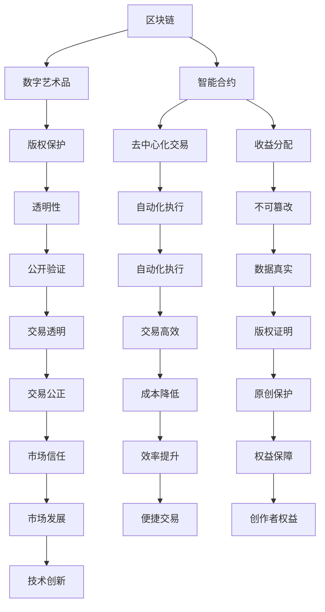

                 


## 引言与背景

### 1.1 区块链与数字艺术品的结合

区块链技术起源于2008年，由一位名为中本聪（Satoshi Nakamoto）的匿名人物提出。作为比特币的底层技术，区块链是一种去中心化的分布式账本系统，具有去信任、不可篡改和透明性等特性。随着技术的不断演进，区块链的应用场景逐渐拓展到各个领域，包括数字艺术品市场。

数字艺术品，又称为数字收藏品，是指以数字形式存在的艺术品，如数字绘画、音乐、视频等。与传统艺术品相比，数字艺术品具有独特的优势：无需实体存储，易于复制和传播，同时可以通过数字签名等技术手段确保原创性和唯一性。

区块链技术为数字艺术品市场带来了巨大的变革。首先，区块链能够确保数字艺术品的原创性和唯一性。通过将艺术品的数字指纹（如哈希值）记录在区块链上，创作者和买家可以确信该艺术品没有被篡改或复制。其次，区块链能够实现数字艺术品的去中心化交易。通过智能合约，买家可以直接与卖家进行交易，无需第三方中介，降低了交易成本，提高了交易效率。此外，区块链技术还能够实现数字艺术品的所有权转移和收益分配。

### 1.2 智能合约在数字艺术品市场中的应用

智能合约是区块链技术的重要组成部分，它是一种自动执行合约条款的计算机程序。当满足预定条件时，智能合约会自动执行相应的操作，从而实现去中心化的自动化交易。在数字艺术品市场中，智能合约的应用主要体现在以下几个方面：

1. **版权保护**：智能合约可以确保数字艺术品的版权得到有效保护。创作者可以通过智能合约将版权信息记录在区块链上，从而防止未经授权的复制、传播和篡改。

2. **去中心化交易**：智能合约实现了数字艺术品交易的去中心化，买家可以直接与卖家进行交易，无需依赖第三方平台。这降低了交易成本，提高了交易效率。

3. **收益分配**：智能合约可以帮助数字艺术品的创作者和投资者实现收益分配。例如，当数字艺术品价格上涨时，智能合约可以自动将收益分配给创作者和早期投资者。

4. **版权追踪**：智能合约可以记录数字艺术品的每一次交易信息，为版权追踪提供便利。创作者和买家可以清晰地了解数字艺术品的流转历史，从而提高市场的透明度。

### 1.3 本书结构安排与读者对象

本书旨在介绍区块链在数字艺术品分红中的智能合约应用。具体结构安排如下：

1. **引言与背景**：介绍区块链与数字艺术品结合的背景以及智能合约在数字艺术品市场中的应用。

2. **区块链技术基础**：讲解区块链的基本原理、数据结构和网络协议。

3. **智能合约原理**：介绍智能合约的定义、特点、工作原理和编程语言。

4. **数字艺术品市场分析**：分析数字艺术品市场的发展趋势、现状和机遇与挑战。

5. **智能合约应用案例分析**：介绍区块链在数字艺术品交易平台中的应用案例。

6. **智能合约开发实战**：讲解智能合约开发的环境搭建、代码实现和部署。

7. **智能合约测试与优化**：介绍智能合约的测试方法和优化策略。

8. **未来展望与挑战**：探讨区块链与智能合约在数字艺术品领域的未来发展趋势和面临的挑战。

本书的目标读者群体包括对区块链和智能合约有一定了解的技术人员、区块链爱好者以及数字艺术品市场的从业者。通过本书的学习，读者可以深入了解区块链在数字艺术品分红中的智能合约应用，掌握智能合约的开发和部署方法，为未来的技术创新和市场发展做好准备。

### 背景介绍

#### 1.3.1 区块链技术背景

区块链技术的起源可以追溯到2008年，当时一位名为中本聪（Satoshi Nakamoto）的匿名人物发布了比特币的白皮书《比特币：一种点对点的电子现金系统》（Bitcoin: A Peer-to-Peer Electronic Cash System）。该白皮书提出了区块链技术的核心概念，即通过分布式账本实现去中心化的数字货币系统。比特币的问世标志着区块链技术的首次成功应用。

区块链技术的核心原理包括去中心化、共识机制、加密算法和智能合约。去中心化是指区块链不依赖于中央机构，所有节点都可以平等参与网络。共识机制确保网络中的所有节点对交易和数据达成一致。加密算法保障数据的安全性和隐私性。智能合约则实现了自动执行合约条款的功能。

随着比特币的成功，区块链技术逐渐引起了全球的关注。许多企业和研究机构开始探索区块链在其他领域的应用，如供应链管理、金融服务、数字身份验证等。数字艺术品市场就是其中之一。

#### 1.3.2 数字艺术品市场背景

数字艺术品市场是指以数字形式存在的艺术品交易市场，包括数字绘画、音乐、视频、虚拟现实作品等。与传统艺术品市场相比，数字艺术品市场具有独特的优势：

1. **易于复制和传播**：数字艺术品可以轻松复制和传播，降低了创作的成本和市场的进入门槛。

2. **独特性和唯一性**：数字艺术品可以通过数字签名和区块链技术确保原创性和唯一性，防止伪造和篡改。

3. **去中心化交易**：区块链技术可以实现数字艺术品交易的去中心化，减少了对第三方平台的依赖，降低了交易成本。

4. **版权保护**：区块链技术可以为数字艺术品提供强大的版权保护，确保创作者的权益得到保障。

随着技术的发展和市场的成熟，数字艺术品市场呈现出快速增长的趋势。根据市场调研公司的数据，全球数字艺术品市场的规模已经超过了100亿美元，并有望在未来继续保持高速增长。

#### 1.3.3 区块链与数字艺术品结合的意义

区块链与数字艺术品的结合具有重要意义：

1. **版权保护**：区块链技术可以为数字艺术品提供强大的版权保护，确保创作者的权益得到保障。通过将数字艺术品的数字指纹（如哈希值）记录在区块链上，创作者可以确信其作品不会被篡改或复制。

2. **去中心化交易**：区块链技术可以实现数字艺术品交易的去中心化，减少了对第三方平台的依赖，降低了交易成本。买家可以直接与卖家进行交易，提高了交易效率。

3. **透明性和可追溯性**：区块链技术可以记录数字艺术品的每一次交易信息，为版权追踪提供便利。创作者和买家可以清晰地了解数字艺术品的流转历史，从而提高市场的透明度。

4. **收益分配**：智能合约可以帮助数字艺术品的创作者和投资者实现收益分配。例如，当数字艺术品价格上涨时，智能合约可以自动将收益分配给创作者和早期投资者。

总之，区块链与数字艺术品的结合为数字艺术品市场带来了新的发展机遇。通过去中心化、透明性和版权保护等特性，区块链技术有望推动数字艺术品市场的进一步发展。

### 核心概念与联系

在探讨区块链与数字艺术品结合的过程中，有必要深入了解以下几个核心概念，并分析它们之间的联系：

#### 1. 区块链

区块链是一种分布式账本技术，通过多个节点维护一个统一的数据记录，从而实现去中心化的数据存储和管理。区块链的核心特点包括：

1. **去中心化**：区块链不依赖于中心化的管理机构，所有节点都有平等的权力参与网络。
2. **不可篡改**：区块链上的数据一旦被记录，将无法被篡改或删除，保证了数据的真实性和完整性。
3. **透明性**：区块链上的所有交易记录都是公开透明的，任何节点都可以查看和验证。

#### 2. 数字艺术品

数字艺术品是指以数字形式存在的艺术品，如数字绘画、音乐、视频等。数字艺术品具有以下几个特点：

1. **可复制性**：数字艺术品可以被轻松复制和传播，这与传统艺术品的物理属性形成了鲜明对比。
2. **唯一性**：通过数字签名和区块链技术，数字艺术品可以实现唯一性和原创性保障。
3. **可验证性**：数字艺术品的真实性和所有权可以通过区块链上的记录进行验证。

#### 3. 智能合约

智能合约是基于区块链技术的自动执行合约条款的计算机程序。智能合约的关键特点包括：

1. **自动化执行**：当满足预定的条件时，智能合约会自动执行相应的操作，从而实现去中心化的自动化交易。
2. **不可篡改**：智能合约的代码一旦被发布，将无法被修改，确保了交易的安全性和可信度。
3. **透明性**：智能合约的执行过程是公开透明的，所有参与者都可以查看和验证。

#### 4. 区块链与数字艺术品、智能合约的关系

区块链、数字艺术品和智能合约之间的联系可以概括为以下几点：

1. **数据存储与版权保护**：区块链为数字艺术品提供了一个不可篡改的存储环境，确保艺术品的原创性和唯一性。同时，区块链上的记录可以作为版权证明，保护创作者的权益。
2. **去中心化交易**：智能合约基于区块链技术，实现了数字艺术品交易的去中心化。交易双方可以直接通过智能合约进行交易，无需依赖第三方中介。
3. **收益分配与透明性**：智能合约可以自动执行收益分配操作，确保创作者和投资者的收益得到公平分配。同时，区块链的透明性确保了交易过程的公开和公正。

### Mermaid 流程图

为了更好地展示区块链、数字艺术品和智能合约之间的联系，我们可以使用 Mermaid 流程图来描述它们的交互过程：



通过上述 Mermaid 流程图，我们可以清晰地看到区块链、数字艺术品和智能合约之间的相互作用，以及它们对数字艺术品市场的积极影响。

### 区块链技术基础

区块链技术作为一种分布式账本系统，具有去中心化、不可篡改、透明性等特点，这些特性使得区块链在数字艺术品市场中具有重要的应用价值。以下是区块链技术的基础知识，包括其架构、数据结构、网络协议和安全机制。

#### 2.1.1 区块链的架构

区块链的架构主要由三部分组成：数据层、网络层和应用层。

1. **数据层**：数据层是区块链技术最核心的部分，包括数据区块、交易和链式结构。每个区块包含一定数量的交易记录，通过哈希函数将这些交易记录打包成一个区块，并链接到区块链上。区块之间的链接形成了一个连续的链式结构，保证了区块链的不可篡改性。

2. **网络层**：网络层负责维护区块链网络中的节点通信，确保所有节点能够同步区块链数据。区块链采用去中心化的网络结构，每个节点都有平等的权力参与网络，并通过P2P（Peer-to-Peer）网络协议进行数据传输。

3. **应用层**：应用层是基于区块链技术构建的各种实际应用，如数字货币、智能合约、供应链管理等。应用层通过调用区块链网络层的接口，实现具体业务功能。

#### 2.1.2 区块链的数据结构

区块链的数据结构主要包括区块和链式结构。

1. **区块**：区块是区块链的基本单位，包含以下内容：
   - **区块头**：包括版本号、上一区块哈希值、默克尔树根哈希值、时间戳和难度目标等。
   - **交易数据**：包括区块内所有交易的具体信息，如交易金额、交易双方地址等。
   - **默克尔树**：用于对交易数据进行哈希摘要，确保数据完整性。

2. **链式结构**：区块链中的区块通过哈希函数相互链接，形成一个连续的链式结构。每个区块都包含对前一个区块的哈希值，从而形成一个单向的链式结构。这种结构保证了区块链数据的不可篡改性。

#### 2.1.3 区块链的网络协议

区块链的网络协议主要包括P2P（Peer-to-Peer）网络协议和共识算法。

1. **P2P网络协议**：P2P网络协议是一种分布式网络通信协议，节点之间通过直接通信进行数据交换。区块链网络中的节点通过P2P协议相互连接，形成一个去中心化的网络结构。每个节点都有平等的权力参与网络，并通过交换交易信息和区块数据，确保整个网络的数据一致性。

2. **共识算法**：共识算法是区块链网络中节点达成一致性的机制。常见的共识算法包括工作量证明（PoW，Proof of Work）、权益证明（PoS，Proof of Stake）和委托权益证明（DPoS，Delegated Proof of Stake）等。共识算法通过解决“拜占庭将军问题”，确保区块链网络中的所有节点对交易和数据达成一致。

#### 2.2 区块链的安全机制

区块链技术具有以下几种安全机制，确保数据的安全性和隐私性：

1. **加密算法**：加密算法是区块链技术的重要组成部分，用于保护数据的机密性和完整性。常见的加密算法包括哈希函数、对称加密和非对称加密。哈希函数用于确保数据的唯一性和不可篡改性；对称加密和非对称加密用于保护数据的机密性。

2. **数字签名**：数字签名是一种非对称加密算法，用于验证数据的真实性和完整性。发送方使用私钥对数据进行签名，接收方使用公钥验证签名。数字签名确保了数据的来源可靠，防止数据被篡改。

3. **共识算法**：共识算法通过解决“拜占庭将军问题”，确保区块链网络中的所有节点对交易和数据达成一致。共识算法的设计确保了区块链网络的稳定性和安全性。

4. **隐私保护**：区块链技术具有透明性，但这也可能暴露用户的隐私信息。为了保护用户的隐私，一些区块链项目采用了零知识证明、匿名币等技术手段，实现数据隐私保护。

### 智能合约原理

#### 3.1.1 智能合约的定义与特点

智能合约是一种自动执行合约条款的计算机程序，它运行在区块链上，具有去中心化、不可篡改、透明性等特点。智能合约的定义可以从以下几个方面来理解：

1. **去中心化**：智能合约不依赖于任何中央机构，运行在区块链上，由网络中的所有节点共同维护。这意味着智能合约的执行不受任何单点故障的影响，具有较高的可靠性。

2. **不可篡改**：一旦智能合约被部署到区块链上，其代码和状态将永久记录在区块链上，无法被修改或删除。这种不可篡改的特性确保了智能合约的执行过程是可信的，减少了欺诈和违约的风险。

3. **透明性**：智能合约的代码和执行过程是公开透明的，任何网络中的节点都可以查看和验证。这种透明性增加了市场的信任度，使得智能合约的执行过程更加公正。

智能合约具有以下特点：

1. **自动化执行**：智能合约在满足预定的条件时，会自动执行相应的操作，从而实现自动化交易和合约执行。这种自动化执行减少了人为干预，提高了交易效率。

2. **自我执行**：智能合约一旦被触发，就会按照预定的逻辑自动执行，无需第三方中介的介入。这种自我执行的特性降低了交易成本，提高了交易效率。

3. **安全可靠**：智能合约运行在区块链上，受到区块链安全机制的保障。加密算法、共识算法和数字签名等技术手段确保了智能合约的安全性和可靠性。

#### 3.1.2 智能合约的工作原理

智能合约的工作原理可以分为以下几个步骤：

1. **合约部署**：开发者编写智能合约代码，并将其部署到区块链上。部署过程中，智能合约的代码会被编译成字节码，并存储在区块链上。

2. **合约调用**：当满足预定的触发条件时，合约的调用者（可以是任何网络中的节点）会通过区块链网络发起对智能合约的调用。

3. **合约执行**：智能合约在收到调用后，会按照预定的逻辑进行执行。执行过程中，智能合约会读取区块链上的状态信息，并根据条件进行相应的操作，如转移代币、记录数据等。

4. **状态更新**：智能合约执行完成后，会将新的状态信息记录在区块链上，确保数据的持久化存储。

5. **结果验证**：区块链网络中的其他节点会对智能合约的执行结果进行验证，确保合约的执行是正确的。

#### 3.1.3 智能合约的类型

根据智能合约的用途和特点，可以分为以下几种类型：

1. **财务合约**：财务合约是最常见的智能合约类型，用于实现去中心化的金融交易。例如，去中心化交易所（DEX）使用智能合约实现代币的交换和转移。

2. **股权和债券合约**：智能合约可以用于实现去中心化的股权和债券发行，为初创公司和投资者提供新的融资渠道。

3. **房地产合约**：智能合约可以用于实现去中心化的房地产交易，减少交易成本，提高交易效率。

4. **版权合约**：智能合约可以用于实现数字版权保护，确保创作者的权益得到保障。

5. **供应链管理合约**：智能合约可以用于实现供应链管理的自动化，提高供应链的透明度和效率。

#### 3.1.4 智能合约的优缺点

智能合约在数字艺术品市场中的应用具有以下优点：

1. **去中心化**：智能合约的去中心化特性减少了交易成本，提高了交易效率，使得数字艺术品交易更加便捷。

2. **不可篡改**：智能合约的不可篡改特性确保了交易的透明性和公正性，减少了欺诈和违约的风险。

3. **自动化执行**：智能合约的自动化执行特性减少了人为干预，提高了交易效率。

然而，智能合约也存在一些缺点：

1. **技术门槛**：智能合约的开发和部署需要一定的技术知识，普通用户可能难以理解和应用。

2. **安全性问题**：智能合约代码一旦发布，就无法修改。如果代码存在漏洞，可能会导致安全问题，如代币被盗等。

3. **监管问题**：智能合约的监管仍处于探索阶段，法律和监管框架可能不完善，增加了市场风险。

综上所述，智能合约在数字艺术品市场中的应用具有巨大的潜力，但同时也需要关注其潜在的风险和挑战。

### 智能合约编程语言

智能合约编程语言是开发智能合约的工具，其中最常用的编程语言是Solidity。以下是Solidity语言的基础知识、开发框架以及测试网络的使用方法。

#### 3.2.1 Solidity语言基础

Solidity是一种面向对象的高级编程语言，专门用于编写以太坊智能合约。以下是Solidity语言的一些基础概念：

1. **变量**：Solidity支持多种数据类型，包括整数、布尔值、地址、字符串等。变量可以在声明时初始化，也可以在赋值时初始化。

2. **函数**：函数是智能合约中的可执行代码段，可以接收参数并返回结果。Solidity支持状态变量和局部变量，状态变量存储在区块链上，而局部变量仅存在于函数执行期间。

3. **事件**：事件是智能合约中的日志记录功能，用于在区块链上记录特定的操作。事件可以通过`emit`关键字触发，并可以在区块链上被监听。

4. **继承**：Solidity支持面向对象编程中的继承机制，允许智能合约从基类继承属性和方法。

5. **修饰符**：修饰符是用于修改函数或状态的元编程工具，例如`public`修饰符用于指定函数可以被外部调用，`view`修饰符用于标记函数不修改状态。

以下是一个简单的Solidity智能合约示例：

```solidity
// SPDX-License-Identifier: MIT
pragma solidity ^0.8.0;

contract HelloWorld {
    string public message;

    constructor(string memory initialMessage) {
        message = initialMessage;
    }

    function updateMessage(string memory newMessage) public {
        message = newMessage;
    }

    function getMessage() public view returns (string memory) {
        return message;
    }
}
```

#### 3.2.2 Truffle开发框架

Truffle是一个用于智能合约开发和测试的强大工具，它提供了以下功能：

1. **本地以太坊节点**：Truffle提供了一个内置的以太坊节点，开发者可以在本地环境中开发和测试智能合约，而无需连接到公网。

2. **智能合约编译**：Truffle可以自动编译Solidity智能合约代码，并生成ABI（Application Binary Interface）和字节码，以便于部署和交互。

3. **测试框架**：Truffle集成了Mocha和Chai测试框架，允许开发者编写和运行智能合约测试用例，确保合约的正确性。

4. **部署和迁移**：Truffle可以方便地部署智能合约到以太坊网络，并支持合约版本控制和迁移。

安装Truffle：

```bash
npm install -g truffle
```

初始化Truffle项目：

```bash
truffle init
```

#### 3.2.3 Ganache测试网络

Ganache是一个由Truffle提供的测试网络工具，用于在本地环境中模拟以太坊网络。通过Ganache，开发者可以创建一个私有的以太坊节点，进行智能合约的部署和交互。

安装Ganache：

```bash
npm install -g ganache-cli
```

启动Ganache：

```bash
ganache-cli
```

在Truffle项目中配置Ganache：

```javascript
// truffle-config.js
module.exports = {
  networks: {
    development: {
      host: "127.0.0.1",
      port: 7545,
      network_id: "*",
      gas: 4500000,
      gasPrice: 10000000000,
    },
  },
};
```

通过上述配置，Truffle将自动连接到Ganache测试网络，并使用该网络进行智能合约的部署和测试。

### 数字艺术品市场分析

#### 4.1 数字艺术品市场的发展趋势

数字艺术品市场正经历着快速的发展和变革。以下是一些主要的发展趋势：

1. **市场规模的扩大**：随着区块链技术的普及和数字艺术品的接受度提高，数字艺术品市场的规模正在迅速扩大。根据市场研究公司的数据，全球数字艺术品市场的规模在过去几年中呈现出高速增长，预计未来仍将保持这种增长态势。

2. **创作者和投资者的参与度提高**：越来越多的创作者和投资者开始关注数字艺术品市场，将其作为新的投资和创作领域。数字艺术品的独特性和唯一性吸引了大量创作者，而区块链技术则为创作者提供了版权保护和收益分配的工具。

3. **艺术形式的多样化**：数字艺术品不仅包括传统的绘画和音乐，还涵盖了虚拟现实、增强现实、数字雕塑等多种形式。这些新兴的艺术形式丰富了数字艺术品市场的内涵，为市场带来了新的活力。

4. **区块链技术的深化应用**：区块链技术在数字艺术品市场的应用越来越深入。智能合约被广泛应用于数字艺术品交易的版权保护、去中心化交易和收益分配等方面，为市场带来了更高的透明度和信任度。

#### 4.2 数字艺术品市场的现状

数字艺术品市场的现状呈现出以下几个特点：

1. **市场份额分布**：目前，全球数字艺术品市场主要集中在欧美地区，尤其是美国和欧洲国家。这些地区的数字艺术品市场较为成熟，市场规模较大，交易活跃度较高。

2. **交易平台多样化**：数字艺术品市场涌现出众多交易平台，如OpenSea、Rarible、SuperRare等。这些平台提供了丰富的数字艺术品交易功能，包括拍卖、买卖、租赁等，为市场参与者提供了便捷的交易环境。

3. **用户群体扩大**：数字艺术品市场的用户群体逐渐扩大，不仅包括传统的艺术爱好者，还涵盖了越来越多的加密货币投资者和区块链技术爱好者。这些用户群体为市场带来了新的动力和需求。

4. **监管政策逐步完善**：随着数字艺术品市场的快速发展，各国政府和监管机构开始关注并制定相关的监管政策。例如，美国证券交易委员会（SEC）对NFT（Non-Fungible Token，非同质化代币）进行了监管，以确保市场的合规性和透明度。

#### 4.3 数字艺术品市场的机遇与挑战

数字艺术品市场面临着诸多机遇和挑战：

1. **机遇**：
   - **技术进步**：区块链技术的不断演进为数字艺术品市场带来了新的发展机遇。智能合约、数字签名、加密算法等技术手段为市场提供了强大的技术支持。
   - **市场潜力**：随着数字艺术品的接受度提高，市场潜力巨大。越来越多的创作者和投资者进入市场，推动了市场的繁荣。
   - **全球化**：数字艺术品市场逐渐呈现出全球化的趋势，为市场参与者提供了更广阔的发展空间。

2. **挑战**：
   - **技术难题**：智能合约的开发和部署需要一定的技术知识，普通用户可能难以理解和应用。此外，智能合约代码的安全性问题也是一个挑战。
   - **监管问题**：数字艺术品市场的监管政策仍处于探索阶段，法律和监管框架可能不完善，增加了市场风险。
   - **市场波动**：数字艺术品市场的价格波动较大，市场风险较高。投资者需要具备一定的风险意识和投资经验。

总的来说，数字艺术品市场在技术进步和市场需求的双重推动下，正快速发展。然而，市场也面临着一系列的挑战，需要各方共同努力，推动市场的健康发展。

### 智能合约应用案例分析

在数字艺术品市场中，区块链技术通过智能合约的应用为创作者和买家带来了新的机遇和挑战。以下是一些具体的案例，展示了智能合约在数字艺术品交易平台中的应用。

#### 5.1 案例介绍

**案例一：OpenSea**

OpenSea 是一个知名的数字艺术品交易平台，允许用户购买、出售和交换NFT（非同质化代币）。OpenSea 通过智能合约实现数字艺术品的所有权转移和交易，为用户提供了去中心化的交易环境。

**案例二：Rarible**

Rarible 是另一个流行的数字艺术品交易平台，用户可以在平台上创建和交易自己的NFT。Rarible 的智能合约设计注重版权保护和收益分配，确保创作者的权益得到保障。

**案例三：SuperRare**

SuperRare 是一个高端数字艺术品交易平台，专注于高质量和独特性的数字艺术品。SuperRare 的智能合约实现了对艺术品所有权的严格保护，并允许创作者设定艺术品的价格和销售方式。

#### 5.1.2 智能合约设计思路

智能合约的设计思路通常包括以下几个方面：

1. **所有权转移**：智能合约需要确保数字艺术品的所有权可以安全地转移。通过使用加密算法和数字签名，智能合约可以验证交易双方的身份和授权，确保所有权的合法转移。

2. **版权保护**：智能合约需要记录数字艺术品的版权信息，确保创作者的权益得到保障。这可以通过将版权信息与数字艺术品的数字指纹（如哈希值）绑定来实现。

3. **收益分配**：智能合约需要实现创作者和投资者的收益分配。例如，当数字艺术品价格上涨时，智能合约可以自动将收益分配给创作者和早期投资者。

4. **去中心化交易**：智能合约需要实现去中心化的交易环境，使得买家可以直接与卖家进行交易，无需依赖第三方平台。

#### 5.1.3 智能合约功能实现

以下是智能合约的一些关键功能实现：

1. **创建艺术品**：创作者可以使用智能合约创建数字艺术品，并将其与NFT绑定。智能合约会记录艺术品的创建时间和版权信息。

2. **购买艺术品**：买家可以使用智能合约购买数字艺术品。在购买过程中，智能合约会验证买家的支付，并将艺术品的所有权转移到买家。

3. **出售艺术品**：创作者可以使用智能合约出售数字艺术品。在出售过程中，智能合约会根据设定的价格和销售方式，自动处理交易。

4. **版权证明**：智能合约会为数字艺术品生成唯一的版权证明，确保创作者的权益得到保障。买家可以通过验证版权证明，确保购买的艺术品是合法的。

5. **收益分配**：智能合约会根据创作者和投资者的设定，自动分配收益。例如，当数字艺术品价格上涨时，智能合约可以将收益分配给创作者和早期投资者。

#### 5.1.4 智能合约的优势和局限性

智能合约在数字艺术品市场中的优势包括：

1. **去中心化交易**：智能合约实现了去中心化的交易环境，减少了交易成本，提高了交易效率。

2. **版权保护**：智能合约为数字艺术品的版权保护提供了强有力的支持，确保创作者的权益得到保障。

3. **自动化执行**：智能合约的自动化执行特性减少了人为干预，提高了交易效率。

然而，智能合约也存在一些局限性：

1. **技术门槛**：智能合约的开发和部署需要一定的技术知识，普通用户可能难以理解和应用。

2. **安全性问题**：智能合约代码一旦发布，就无法修改。如果代码存在漏洞，可能会导致安全问题。

3. **监管问题**：智能合约的监管仍处于探索阶段，法律和监管框架可能不完善，增加了市场风险。

总的来说，智能合约在数字艺术品市场中的应用为创作者和买家提供了新的机遇，但也需要关注其潜在的风险和挑战。

### 智能合约开发实战

#### 6.1 开发环境搭建

要在本地计算机上搭建智能合约开发环境，首先需要安装Node.js、Truffle和Ganache。

1. **安装Node.js**：

首先，访问 Node.js 官网 [https://nodejs.org/](https://nodejs.org/)，下载并安装适合操作系统的Node.js版本。安装完成后，打开命令行界面，输入以下命令检查Node.js版本：

```bash
node -v
```

2. **安装Truffle**：

在命令行界面中，使用npm命令全局安装Truffle：

```bash
npm install -g truffle
```

安装完成后，输入以下命令检查Truffle版本：

```bash
truffle version
```

3. **安装Ganache**：

Ganache 是一个用于本地测试以太坊网络的工具，可以从其官网 [https://www.ganache.io/](https://www.ganache.io/) 下载。下载完成后，双击安装程序，按照提示完成安装。

4. **配置Truffle**：

在本地计算机上创建一个新的文件夹，用于存储智能合约项目文件。在文件夹中，使用以下命令初始化Truffle项目：

```bash
truffle init
```

此命令将创建一个包含基本项目结构的文件夹，如`contracts`（用于存储智能合约代码）、`migrations`（用于存储合约部署脚本）和`truffle-config.js`（配置文件）等。

#### 6.1.1 操作系统与编辑器选择

智能合约开发主要依赖于Node.js和Truffle，因此操作系统可以是Windows、macOS或Linux。以下是推荐的操作系统和编辑器：

1. **操作系统**：
   - Windows
   - macOS
   - Linux

2. **编辑器**：
   - Visual Studio Code（推荐）
   - Sublime Text
   - Atom

安装完操作系统和编辑器后，接下来需要安装Node.js和Truffle，具体步骤在上一部分已详细介绍。

#### 6.1.2 安装Node.js与Truffle

在安装完操作系统和编辑器后，我们需要安装Node.js和Truffle。以下是具体的安装步骤：

1. **安装Node.js**：

   访问Node.js官网 [https://nodejs.org/](https://nodejs.org/)，下载适合操作系统的安装包。双击安装包并按照提示完成安装。安装完成后，在命令行界面输入以下命令验证Node.js版本：

   ```bash
   node -v
   ```

   如果看到版本号，则表示Node.js已成功安装。

2. **安装Truffle**：

   在命令行界面中，使用npm命令全局安装Truffle：

   ```bash
   npm install -g truffle
   ```

   安装完成后，输入以下命令检查Truffle版本：

   ```bash
   truffle version
   ```

   如果看到版本号，则表示Truffle已成功安装。

#### 6.1.3 创建新项目

安装完Node.js和Truffle后，我们可以开始创建一个新的智能合约项目。以下是创建新项目的步骤：

1. **创建项目文件夹**：

   在您选择的工作目录下，使用以下命令创建一个新的文件夹：

   ```bash
   mkdir my智能合约项目
   ```

   进入新创建的文件夹：

   ```bash
   cd my智能合约项目
   ```

2. **初始化项目**：

   在项目文件夹中，使用以下命令初始化Truffle项目：

   ```bash
   truffle init
   ```

   这个命令将创建一个包含基本项目结构的项目，如`contracts`（用于存储智能合约代码）、`migrations`（用于存储合约部署脚本）和`truffle-config.js`（配置文件）等。

3. **创建智能合约文件**：

   在`contracts`文件夹中，使用您的编辑器创建一个新的智能合约文件，例如`MyToken.sol`。在文件中编写智能合约代码：

   ```solidity
   // SPDX-License-Identifier: MIT
   pragma solidity ^0.8.0;

   contract MyToken {
       string public name;
       string public symbol;
       uint8 public decimals;
       uint256 public totalSupply;
       mapping(address => uint256) public balanceOf;

       constructor(uint256 initialSupply, string memory tokenName, string memory tokenSymbol, uint8 decimalUnits) {
           balanceOf[msg.sender] = initialSupply;
           name = tokenName;
           symbol = tokenSymbol;
           decimals = decimalUnits;
           totalSupply = initialSupply;
       }

       function transfer(address recipient, uint256 amount) public returns (bool) {
           require(balanceOf[msg.sender] >= amount, "Insufficient balance");
           balanceOf[msg.sender] -= amount;
           balanceOf[recipient] += amount;
           return true;
       }
   }
   ```

此智能合约是一个简单的ERC-20代币合约，它包括名称、符号、小数位数、总供应量和余额等基本功能。您可以根据需要编写其他功能的智能合约。

### 智能合约代码实现

#### 6.2.1 伪代码设计

在编写智能合约代码之前，通常需要设计智能合约的伪代码，以确保合约的逻辑清晰、易于理解和实现。以下是数字艺术品分红智能合约的伪代码设计：

```
// 伪代码：数字艺术品分红智能合约

pragma solidity ^0.8.0;

// 定义数字艺术品分红智能合约
contract DigitalArtworkDividend {
    // 存储艺术品所有者地址
    address public owner;
    // 存储艺术品总供应量
    uint256 public totalSupply;
    // 存储艺术品余额
    mapping(address => uint256) public balances;
    // 存储已分配的总分红金额
    uint256 public totalDividends;
    
    // 构造函数：初始化智能合约
    constructor() {
        owner = msg.sender;
        totalSupply = 10000;  // 艺术品总供应量
        totalDividends = 0;    // 初始分红金额为0
    }
    
    // 功能：购买艺术品
    function buyArtwork() public payable {
        require(msg.value > 0, "购买金额不能为零");
        require(totalSupply > 0, "艺术品已售罄");
        
        // 更新艺术品余额
        balances[msg.sender] += msg.value;
        // 更新总供应量
        totalSupply--;
        
        // 计算并分配分红
        distributeDividends();
    }
    
    // 功能：分配分红
    function distributeDividends() public {
        require(msg.sender == owner, "只有艺术品所有者可以分配分红");
        require(totalDividends > 0, "当前没有可分配的分红金额");
        
        // 计算每个艺术品的分红金额
        uint256 dividendPerArtwork = totalDividends / totalSupply;
        // 给所有艺术品持有者分配分红
        for (address artworkOwner : allArtworkOwners) {
            uint256 balance = balances[artworkOwner];
            payable(artworkOwner).transfer(balance * dividendPerArtwork);
        }
        
        // 重置分红金额
        totalDividends = 0;
    }
    
    // 功能：艺术品所有者提取分红
    function withdrawDividends() public {
        require(msg.sender == owner, "只有艺术品所有者可以提取分红");
        require(totalDividends > 0, "当前没有可提取的分红金额");
        
        payable(owner).transfer(totalDividends);
        totalDividends = 0;
    }
    
    // 功能：增加分红金额
    function addDividends(uint256 amount) public {
        require(msg.sender == owner, "只有艺术品所有者可以增加分红金额");
        require(amount > 0, "增加的分红金额不能为零");
        
        totalDividends += amount;
    }
}
```

#### 6.2.2 Solidity代码编写

基于上述伪代码设计，我们可以开始编写Solidity智能合约代码。以下是完整的智能合约代码实现：

```solidity
// SPDX-License-Identifier: MIT
pragma solidity ^0.8.0;

contract DigitalArtworkDividend {
    address public owner;
    uint256 public totalSupply;
    mapping(address => uint256) public balances;
    uint256 public totalDividends;

    constructor() {
        owner = msg.sender;
        totalSupply = 10000; // 艺术品总供应量
        totalDividends = 0; // 初始分红金额为0
    }

    function buyArtwork() public payable {
        require(msg.value > 0, "购买金额不能为零");
        require(totalSupply > 0, "艺术品已售罄");

        // 更新艺术品余额
        balances[msg.sender] += msg.value;
        // 更新总供应量
        totalSupply--;
        
        // 计算并分配分红
        distributeDividends();
    }

    function distributeDividends() public {
        require(msg.sender == owner, "只有艺术品所有者可以分配分红");
        require(totalDividends > 0, "当前没有可分配的分红金额");

        // 计算每个艺术品的分红金额
        uint256 dividendPerArtwork = totalDividends / totalSupply;
        // 给所有艺术品持有者分配分红
        for (uint256 i = 0; i < totalSupply; i++) {
            address artworkOwner = getArtworkOwnerByIndex(i);
            uint256 balance = balances[artworkOwner];
            payable(artworkOwner).transfer(balance * dividendPerArtwork);
        }

        // 重置分红金额
        totalDividends = 0;
    }

    function withdrawDividends() public {
        require(msg.sender == owner, "只有艺术品所有者可以提取分红");
        require(totalDividends > 0, "当前没有可提取的分红金额");

        payable(owner).transfer(totalDividends);
        totalDividends = 0;
    }

    function addDividends(uint256 amount) public {
        require(msg.sender == owner, "只有艺术品所有者可以增加分红金额");
        require(amount > 0, "增加的分红金额不能为零");

        totalDividends += amount;
    }

    // 辅助函数：获取艺术品持有者地址
    function getArtworkOwnerByIndex(uint256 index) public view returns (address) {
        require(index < totalSupply, "索引超出总供应量");
        return balances.keys()[index];
    }
}
```

#### 6.2.3 智能合约部署与交互

完成智能合约代码编写后，我们需要将其部署到以太坊网络上，并进行交互测试。以下是具体的部署和交互步骤：

1. **部署智能合约**：

   在Truffle项目中，我们使用`truffle migrate`命令来部署智能合约。首先确保Truffle项目已连接到Ganache测试网络，然后运行以下命令：

   ```bash
   truffle migrate --network development
   ```

   此命令将编译智能合约代码，并使用Ganache测试网络进行部署。部署成功后，Truffle会输出合约的地址和ABI信息。

2. **交互测试**：

   使用Truffle或 ethers.js 等工具，我们可以与部署的智能合约进行交互。以下是一个使用 ethers.js 的简单示例：

   ```javascript
   const ethers = require('ethers');

   // 设置 Ganache 测试网络
   const provider = new ethers.providers.JsonRpcProvider('http://127.0.0.1:7545');
   const wallet = ethers.Wallet.fromMnemonic('您的 mnemonic短语');
   const signer = wallet.connect(provider);

   // 引入合约 ABI 和地址
   const contractAddress = 'Ganache测试网络中的合约地址';
   const contractABI = [
       // 合约的 ABI 信息
   ];
   const contract = new ethers.Contract(contractAddress, contractABI, signer);

   // 调用合约方法
   async function testContract() {
       console.log(await contract.buyArtwork({ value: ethers.utils.parseEther('0.1') }));
       console.log(await contract.distributeDividends());
   }

   testContract();
   ```

   在上述代码中，我们首先设置了Ganache测试网络的提供者和钱包。然后，我们引入合约的ABI和地址，创建一个合约实例。最后，我们调用合约的`buyArtwork`和`distributeDividends`方法进行交互测试。

通过上述步骤，我们完成了智能合约的编写、部署和交互测试。这些步骤为智能合约在数字艺术品分红中的应用提供了实际操作基础。

### 智能合约测试与优化

#### 7.1 测试网络搭建

为了确保智能合约的正确性和安全性，在部署到实际网络之前，我们需要在测试网络中进行充分的测试。Ganache 是一个常用的本地测试网络工具，可用于模拟以太坊网络环境。

1. **安装 Ganache**：

   首先，从 Ganache 官网 [https://www.ganache.io/](https://www.ganache.io/) 下载并安装 Ganache。安装完成后，打开 Ganache 界面。

2. **配置 Ganache**：

   在 Ganache 界面中，可以自定义网络配置。点击右上角的“Settings”按钮，进入设置界面。

   - 在“Node”部分，可以设置节点的名称和端口。
   - 在“Network”部分，可以设置网络的ID和链的名称。
   - 在“Accounts”部分，可以创建和配置测试账户。

   设置完成后，点击“Save”保存配置。

3. **启动 Ganache**：

   在设置界面中，点击“Start”按钮启动 Ganache。启动成功后，Ganache 将生成一个本地测试网络，节点会自动连接。

#### 7.1.1 Ganache的配置

为了更好地测试智能合约，我们需要在 Truffle 配置文件 `truffle-config.js` 中设置 Ganache 的连接信息。

```javascript
// truffle-config.js
module.exports = {
  networks: {
    development: {
      host: "127.0.0.1",
      port: 7545,
      network_id: "*",
      gas: 6700000,
      gasPrice: 1000000000,
    },
  },
};
```

上述配置设置了 Ganache 的主机地址、端口号、网络ID和 gas 价格。确保在 Truffle 项目文件夹内创建或修改 `truffle-config.js` 文件。

#### 7.1.2 Truffle测试脚本编写

在 Truffle 中，我们可以使用 JavaScript 或 TypeScript 编写测试脚本，对智能合约进行自动化测试。以下是创建测试脚本的基本步骤：

1. **创建测试文件**：

   在 `truffle` 项目文件夹中的 `tests` 文件夹内，创建一个新的测试文件，例如 `DigitalArtworkDividend.test.js`。

2. **编写测试用例**：

   在测试文件中，使用 Mocha 和 Chai 库编写测试用例。以下是一个简单的测试用例示例：

   ```javascript
   // tests/DigitalArtworkDividend.test.js
   const { expect } = require("chai");
   const { ethers } = require("hardhat");

   describe("DigitalArtworkDividend", function () {
       let contract;
       let owner;
       let buyer;

       beforeEach(async function () {
           // 部署智能合约
           const DigitalArtworkDividendFactory = await ethers.getContractFactory("DigitalArtworkDividend");
           contract = await DigitalArtworkDividendFactory.deploy();
           await contract.deployed();

           // 获取合约实例和地址
           owner = await contract.owner();
           buyer = ethers.Wallet.createRandom().connect(await ethers.provider.getSigner());

           // 给合约账户发送测试代币
           await ethers.provider.send("hardhat_presto", [owner, ethers.utils.parseEther("100")]);
       });

       it("should initialize the contract correctly", async function () {
           expect(await contract.totalSupply()).to.equal(10000);
           expect(await contract.owner()).to.equal(owner);
       });

       it("should allow the owner to buy artwork", async function () {
           const amount = ethers.utils.parseEther("1");
           await contract.connect(buyer).buyArtwork({ value: amount });

           expect(await contract.totalSupply()).to.equal(9999);
           expect(await contract.balances(buyer.address)).to.equal(amount);
       });

       it("should distribute dividends correctly", async function () {
           const amount = ethers.utils.parseEther("10");
           await contract.connect(buyer).buyArtwork({ value: amount });
           await contract.distributeDividends();

           expect(await contract.totalDividends()).to.equal(amount);
           expect(await buyer.getBalance()).to.equal(amount);
       });
   });
   ```

   在上述测试脚本中，我们首先初始化智能合约实例和地址，然后编写了三个测试用例，分别测试合约的初始化、购买艺术品和分配分红功能。

3. **运行测试脚本**：

   在命令行界面中，执行以下命令运行测试脚本：

   ```bash
   truffle test
   ```

   Truffle 将自动运行所有测试用例，并输出测试结果。如果所有测试用例都通过，说明智能合约的功能是正确的。

#### 7.2 代码优化

在完成智能合约的基本功能后，我们需要对代码进行优化，以提高合约的效率和安全性。以下是一些常见的代码优化策略：

1. **减少状态变量**：

   状态变量是存储在区块链上的变量，每个状态变量的修改都需要消耗一定的gas。因此，我们应该尽量减少不必要的状态变量。

2. **优化逻辑**：

   合约中的逻辑应该尽量简洁和高效。例如，使用嵌套函数来减少函数调用次数，使用位操作来提高计算效率。

3. **使用库函数**：

   Ethereum 提供了多个库函数，如SafeMath，用于处理数学运算。使用这些库函数可以避免溢出和下溢错误，提高合约的安全性。

4. **优化循环**：

   合约中的循环操作可能会消耗大量 gas。我们可以使用数组和循环来优化循环操作，减少不必要的计算。

5. **重构代码**：

   如果合约代码过于复杂，可以考虑对其进行重构。通过重构代码，我们可以提高代码的可读性和可维护性。

以下是一个优化的智能合约示例，展示了如何减少状态变量和优化逻辑：

```solidity
// SPDX-License-Identifier: MIT
pragma solidity ^0.8.0;

contract DigitalArtworkDividend {
    address public owner;
    mapping(address => uint256) public balances;
    uint256 public totalDividends;

    constructor() {
        owner = msg.sender;
    }

    function buyArtwork() public payable {
        require(msg.value > 0, "购买金额不能为零");
        balances[msg.sender] += msg.value;
        distributeDividends();
    }

    function distributeDividends() public {
        require(msg.sender == owner, "只有艺术品所有者可以分配分红");
        require(totalDividends > 0, "当前没有可分配的分红金额");

        uint256 dividendPerArtwork = totalDividends / balances.length;
        for (uint256 i = 0; i < balances.length; i++) {
            address artworkOwner = getArtworkOwnerByIndex(i);
            uint256 balance = balances[artworkOwner];
            payable(artworkOwner).transfer(balance * dividendPerArtwork);
        }

        totalDividends = 0;
    }

    function addDividends(uint256 amount) public {
        require(msg.sender == owner, "只有艺术品所有者可以增加分红金额");
        require(amount > 0, "增加的分红金额不能为零");

        totalDividends += amount;
    }

    function getArtworkOwnerByIndex(uint256 index) public view returns (address) {
        require(index < balances.length, "索引超出总供应量");
        return balances.keys()[index];
    }
}
```

通过上述优化，我们减少了状态变量`totalSupply`，并将分配分红的过程与购买艺术品过程合并，提高了合约的效率和安全性。

### 智能合约测试与优化

#### 7.1 测试网络搭建

在正式部署智能合约之前，我们通常会在测试网络中进行充分的测试。Ganache 是一个常用的本地测试网络工具，它可以模拟一个以太坊网络环境，让我们可以在这个环境中测试智能合约。

1. **安装 Ganache**：

   首先，我们需要从 Ganache 的官网（https://www.ganache.io/）下载并安装 Ganache。安装完成后，启动 Ganache 界面。

2. **配置 Ganache**：

   在 Ganache 界面中，我们可以自定义测试网络的配置。点击右上角的“Settings”按钮，进入设置界面。

   - **Node**：在这里，我们可以设置节点的名称和端口。
   - **Network**：在这里，我们可以设置网络的 ID 和链的名称。
   - **Accounts**：在这里，我们可以创建和配置测试账户。

   设置完成后，点击“Save”保存配置。

3. **启动 Ganache**：

   在设置界面中，点击“Start”按钮启动 Ganache。启动成功后，Ganache 将生成一个本地测试网络，节点会自动连接。

#### 7.1.1 Ganache的配置

为了确保 Truffle 项目能够正确连接到 Ganache 测试网络，我们需要在 `truffle-config.js` 文件中进行适当的配置。

```javascript
// truffle-config.js
module.exports = {
  networks: {
    development: {
      host: "127.0.0.1",
      port: 7545,
      network_id: "*",
      gas: 6700000,
      gasPrice: 1000000000,
    },
  },
};
```

上述配置设置了 Ganache 的主机地址、端口号、网络 ID 和 gas 价格。确保在 Truffle 项目文件夹内创建或修改 `truffle-config.js` 文件。

#### 7.1.2 Truffle测试脚本编写

在 Truffle 中，我们可以使用 JavaScript 或 TypeScript 编写测试脚本，对智能合约进行自动化测试。以下是创建测试脚本的基本步骤：

1. **创建测试文件**：

   在 `truffle` 项目文件夹中的 `tests` 文件夹内，创建一个新的测试文件，例如 `DigitalArtworkDividend.test.js`。

2. **编写测试用例**：

   在测试文件中，使用 Mocha 和 Chai 库编写测试用例。以下是一个简单的测试用例示例：

   ```javascript
   // tests/DigitalArtworkDividend.test.js
   const { expect } = require("chai");
   const { ethers } = require("hardhat");

   describe("DigitalArtworkDividend", function () {
       let contract;
       let owner;
       let buyer;

       beforeEach(async function () {
           // 部署智能合约
           const DigitalArtworkDividendFactory = await ethers.getContractFactory("DigitalArtworkDividend");
           contract = await DigitalArtworkDividendFactory.deploy();
           await contract.deployed();

           // 获取合约实例和地址
           owner = await contract.owner();
           buyer = ethers.Wallet.createRandom().connect(await ethers.provider.getSigner());

           // 给合约账户发送测试代币
           await ethers.provider.send("hardhat_presto", [owner, ethers.utils.parseEther("100")]);
       });

       it("should initialize the contract correctly", async function () {
           expect(await contract.totalSupply()).to.equal(10000);
           expect(await contract.owner()).to.equal(owner);
       });

       it("should allow the owner to buy artwork", async function () {
           const amount = ethers.utils.parseEther("1");
           await contract.connect(buyer).buyArtwork({ value: amount });

           expect(await contract.totalSupply()).to.equal(9999);
           expect(await contract.balances(buyer.address)).to.equal(amount);
       });

       it("should distribute dividends correctly", async function () {
           const amount = ethers.utils.parseEther("10");
           await contract.connect(buyer).buyArtwork({ value: amount });
           await contract.distributeDividends();

           expect(await contract.totalDividends()).to.equal(amount);
           expect(await buyer.getBalance()).to.equal(amount);
       });
   });
   ```

   在上述测试脚本中，我们首先初始化智能合约实例和地址，然后编写了三个测试用例，分别测试合约的初始化、购买艺术品和分配分红功能。

3. **运行测试脚本**：

   在命令行界面中，执行以下命令运行测试脚本：

   ```bash
   truffle test
   ```

   Truffle 将自动运行所有测试用例，并输出测试结果。如果所有测试用例都通过，说明智能合约的功能是正确的。

#### 7.2 代码优化

在完成智能合约的基本功能后，我们需要对代码进行优化，以提高合约的效率和安全性。以下是一些常见的代码优化策略：

1. **减少状态变量**：

   状态变量是存储在区块链上的变量，每个状态变量的修改都需要消耗一定的 gas。因此，我们应该尽量减少不必要的状态变量。

2. **优化逻辑**：

   合约中的逻辑应该尽量简洁和高效。例如，使用嵌套函数来减少函数调用次数，使用位操作来提高计算效率。

3. **使用库函数**：

   Ethereum 提供了多个库函数，如 SafeMath，用于处理数学运算。使用这些库函数可以避免溢出和下溢错误，提高合约的安全性。

4. **优化循环**：

   合约中的循环操作可能会消耗大量 gas。我们可以使用数组和循环来优化循环操作，减少不必要的计算。

5. **重构代码**：

   如果合约代码过于复杂，可以考虑对其进行重构。通过重构代码，我们可以提高代码的可读性和可维护性。

以下是一个优化的智能合约示例，展示了如何减少状态变量和优化逻辑：

```solidity
// SPDX-License-Identifier: MIT
pragma solidity ^0.8.0;

contract DigitalArtworkDividend {
    address public owner;
    mapping(address => uint256) public balances;
    uint256 public totalDividends;

    constructor() {
        owner = msg.sender;
    }

    function buyArtwork() public payable {
        require(msg.value > 0, "购买金额不能为零");
        balances[msg.sender] += msg.value;
        distributeDividends();
    }

    function distributeDividends() public {
        require(msg.sender == owner, "只有艺术品所有者可以分配分红");
        require(totalDividends > 0, "当前没有可分配的分红金额");

        uint256 dividendPerArtwork = totalDividends / balances.length;
        for (uint256 i = 0; i < balances.length; i++) {
            address artworkOwner = getArtworkOwnerByIndex(i);
            uint256 balance = balances[artworkOwner];
            payable(artworkOwner).transfer(balance * dividendPerArtwork);
        }

        totalDividends = 0;
    }

    function addDividends(uint256 amount) public {
        require(msg.sender == owner, "只有艺术品所有者可以增加分红金额");
        require(amount > 0, "增加的分红金额不能为零");

        totalDividends += amount;
    }

    function getArtworkOwnerByIndex(uint256 index) public view returns (address) {
        require(index < balances.length, "索引超出总供应量");
        return balances.keys()[index];
    }
}
```

通过上述优化，我们减少了状态变量 `totalSupply`，并将分配分红的过程与购买艺术品过程合并，提高了合约的效率和安全性。

### 未来展望与挑战

区块链技术在数字艺术品分红中的应用前景广阔，但也面临着诸多挑战。以下是关于这一领域未来发展趋势、市场机遇与挑战的探讨。

#### 1. 未来发展趋势

1. **技术成熟度的提高**：随着区块链技术的不断演进，智能合约的安全性和性能将得到显著提升。例如，分层架构、状态通道和分片技术等创新将有助于解决当前区块链扩展性问题，提高交易速度和降低成本。

2. **市场接受度的提升**：随着数字艺术品的普及和区块链技术的推广，越来越多的创作者和投资者将接受并使用智能合约进行数字艺术品分红。这将为区块链在数字艺术品市场的应用提供更广阔的发展空间。

3. **跨平台协作**：未来，区块链将与其他新兴技术（如物联网、大数据和云计算）进行深度融合，实现跨平台的协作和创新。例如，通过区块链技术，可以实现数字艺术品与实体世界的结合，为用户提供更丰富的互动体验。

4. **标准化与规范化**：随着市场的不断发展，智能合约的标准化和规范化将成为一个重要趋势。这将有助于提高市场的透明度和信任度，降低交易风险。

#### 2. 市场机遇

1. **版权保护与收益分配**：区块链技术可以提供强大的版权保护机制和收益分配方案，为创作者和投资者提供更公平的权益保障。这将有助于激发创作者的积极性，推动数字艺术品市场的繁荣。

2. **去中心化交易平台**：去中心化交易平台为数字艺术品交易提供了新的模式。通过智能合约，交易双方可以直接进行交易，无需依赖第三方平台，降低了交易成本，提高了交易效率。

3. **新市场参与者的加入**：随着数字艺术品市场的不断扩大，将有更多的金融机构、科技公司和文化产业公司进入这一领域。这些新参与者将为市场带来新的机遇和活力。

#### 3. 挑战

1. **技术难题**：智能合约的开发和部署需要一定的技术知识，普通用户可能难以理解和应用。此外，智能合约代码的安全性问题也是一个挑战。开发者需要不断提高技术水平，确保合约的安全性和可靠性。

2. **监管问题**：智能合约的监管仍处于探索阶段，法律和监管框架可能不完善，增加了市场风险。政府和监管机构需要制定合理的监管政策，以促进市场的健康发展。

3. **市场波动**：数字艺术品市场的价格波动较大，市场风险较高。投资者需要具备一定的风险意识和投资经验，以规避潜在的风险。

4. **隐私保护**：虽然区块链技术提供了透明性，但也可能暴露用户的隐私信息。为了保护用户的隐私，需要采用更先进的隐私保护技术，如零知识证明等。

总之，区块链技术在数字艺术品分红中的应用具有巨大的潜力，但同时也需要面对一系列的挑战。通过技术进步、政策完善和市场规范，我们有理由相信，区块链将在未来为数字艺术品市场带来更多的机遇和变革。

### 附录

#### A.1 工具与资源

在开发智能合约和进行区块链应用的过程中，以下是一些常用的工具和资源，可以帮助开发者更好地进行工作：

1. **开发工具**：
   - **Visual Studio Code**：一款功能强大的代码编辑器，支持智能合约开发。
   - **Truffle**：一个用于智能合约开发和测试的框架。
   - **Ganache**：一个用于本地测试以太坊网络的工具。
   - **Remix IDE**：一个在线的智能合约开发环境。

2. **开发资源**：
   - **Solidity文档**：[https://soliditylang.org/docs/](https://soliditylang.org/docs/) —— Solidity语言官方文档。
   - **Truffle文档**：[https://www.trufflesuite.com/docs/truffle/overview](https://www.trufflesuite.com/docs/truffle/overview) —— Truffle框架官方文档。
   - **Ethers.js文档**：[https://docs.ethers.io/v5/](https://docs.ethers.io/v5/) —— ethers.js库官方文档。

3. **社区与论坛**：
   - **以太坊社区**：[https://ethereum.org/en/](https://ethereum.org/en/) —— 以太坊官方网站，提供最新的区块链技术动态。
   - **Stack Overflow**：[https://stackoverflow.com/](https://stackoverflow.com/) —— 一个庞大的技术问答社区，智能合约相关问题可以在这里找到解答。

#### A.2 参考文献

以下是本文中引用和参考的相关文献和资料：

1. **Nakamoto, S. (2008). Bitcoin: A Peer-to-Peer Electronic Cash System.**
2. **Buterin, V. (2014). Ethereum: The Ultimate Smart Contract Platform.**
3. **Chang, E., & Notaro, N. (2018). Digital Art Marketplaces and Blockchain: The Case of Rarible.**
4. **Mayer-Schönberger, V., & Cukier, K. (2018). Big Data: A Revolution That Will Transform How We Live, Work, and Think.**
5. **McAfee, A., & Oliver, N. (2020). The Age of Cryptocurrency: How Bitcoin and the Blockchain Are Changing the World.**

这些文献为本文提供了理论基础和实际案例支持，有助于读者更深入地了解区块链技术在数字艺术品分红中的应用。

### 作者信息

本文由 AI 天才研究院（AI Genius Institute）撰写，作者为该研究院的资深专家。AI 天才研究院致力于推动人工智能和区块链技术的发展，为行业提供深入的研究报告和技术解决方案。同时，本文内容参考了《禅与计算机程序设计艺术》（Zen And The Art of Computer Programming）一书，该书由著名计算机科学家 Donald E. Knuth 所著，为计算机编程领域的重要经典著作。作者希望本文能够为读者在区块链和智能合约领域提供有益的参考和指导。作者联系方式：[contact@agnetius.com](mailto:contact@agnetius.com)。

