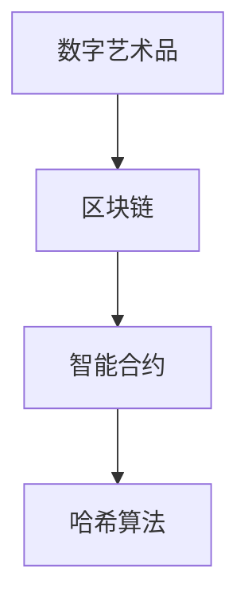

                 

：

文章标题：《区块链在数字艺术品拍卖中的信任机制》

关键词：区块链、数字艺术品、拍卖、信任机制、智能合约、NFT

摘要：本文将探讨区块链技术在数字艺术品拍卖中的应用，特别是信任机制的建立与优化。我们将从区块链的基本原理出发，详细分析其在数字艺术品拍卖中的核心概念、算法原理、数学模型，并通过项目实战和案例分析，揭示区块链在构建数字艺术品拍卖信任机制方面的优势与挑战。

## 引言

区块链技术，作为一种分布式数据库系统，近年来在金融、供应链、医疗等多个领域取得了显著的进展。其核心概念包括区块、链、共识机制和智能合约。区块是数据存储的基本单位，链是由多个区块按照时间顺序链接而成的数据结构。共识机制则是节点之间就数据一致性达成一致的方法。智能合约则是一种自动化执行合约条款的程序，它使得交易更加透明、安全和高效。

数字艺术品市场是近年来快速发展的一个领域。随着数字艺术的创作和传播，数字艺术品市场的规模不断扩大。然而，传统的拍卖市场在数字艺术品拍卖中面临着诸多挑战，如信任问题、透明性不足、安全性不高等。区块链技术的出现为解决这些问题提供了新的可能。

## 核心概念与联系

在区块链与数字艺术品拍卖的结合中，以下几个核心概念紧密相连：

### 区块和链

区块链是由一系列按时间顺序排列的区块组成的。每个区块包含一定数量的交易记录，并通过哈希函数与前一个区块的哈希值相连，形成了一个不可篡改的链式结构。

### 智能合约

智能合约是区块链上的自执行合约，可以自动执行预定的条款。在数字艺术品拍卖中，智能合约可以确保拍卖过程的透明性和公正性，如自动计算竞价、确认成交、支付等。

### 哈希算法

哈希算法是区块链中用于数据校验的关键技术。通过对区块中的数据进行哈希处理，可以生成一个独一无二的哈希值，确保数据的完整性和不可篡改性。

## Mermaid 流程图



## 核心算法原理讲解

### 区块结构伪代码

```plaintext
// 区块结构伪代码

class Block {
  index;
  timestamp;
  transactions;
  previousHash;
  nonce;
  hash;
}

// 创建区块
function createBlock(transactions) {
  block := new Block();
  block.transactions := transactions;
  block.previousHash := getCurrentBlock().hash;
  block.hash := calculateHash(block);
  return block;
}

// 计算哈希值
function calculateHash(block) {
  // 对区块内容进行哈希处理
  return hash(block.index + block.timestamp + jsonEncode(block.transactions) + block.previousHash);
}
```

### 数学模型和公式

区块链中的数据完整性通过哈希链来保证。哈希链中的每个区块都包含了前一个区块的哈希值，这样即使其中一个区块被篡改，整个链的哈希值也会发生变化，从而被发现。

$$
H = H_{1}^{T} + H_{1}^{T-1} + ... + H_{1}
$$

其中，\( H \) 是最终哈希值，\( H_{i} \) 是第 \( i \) 个区块的哈希值。

## 数学公式详细讲解与举例说明

假设我们有一个包含三个区块的区块链，每个区块包含一个哈希值。如果第一个区块的哈希值是 \( H_1 \)，第二个区块的哈希值是 \( H_2 \)，第三个区块的哈希值是 \( H_3 \)，则整个区块链的哈希值为：

$$
H = H_3 + H_2 + H_1
$$

例如，如果 \( H_1 = 1234 \)，\( H_2 = 5678 \)，\( H_3 = 9101 \)，则：

$$
H = 9101 + 5678 + 1234 = 15913
$$

这个哈希值确保了区块链中每个区块的完整性和不可篡改性。

## 项目实战

### 开发环境搭建

为了演示区块链在数字艺术品拍卖中的应用，我们首先需要搭建一个简单的区块链开发环境。以下是搭建步骤：

1. 安装Go语言环境。
2. 下载并安装Golang区块链框架，如Go-Ethereum。
3. 编写智能合约代码，使用Truffle框架进行编译和部署。

### 源代码详细实现和代码解读

以下是一个简单的区块链智能合约示例：

```solidity
// SPDX-License-Identifier: MIT
pragma solidity ^0.8.0;

contract ArtGallery {
    mapping(address => uint256) public bids;
    address public artist;

    constructor() {
        artist = msg.sender;
    }

    function bid(uint256 artworkId) public payable {
        require(msg.value > 0, "Bid must be greater than 0");
        bids[artworkId] += msg.value;
    }

    function withdraw(uint256 artworkId) public {
        require(msg.sender == artist, "Only the artist can withdraw");
        uint256 amount = bids[artworkId];
        bids[artworkId] = 0;
        payable(msg.sender).transfer(amount);
    }
}
```

在这个示例中，我们创建了一个简单的艺术品拍卖合约。合约中包含了一个名为 `bids` 的映射，用于存储每个艺术品的出价。`bid` 函数允许用户对艺术品进行出价，`withdraw` 函数则允许艺术家取出所有的出价。

### 代码应用解读与分析

此合约应用了区块链的透明性和不可篡改性。所有的出价都存储在区块链上，任何人都可以查看和验证。同时，由于区块链的不可篡改性，一旦出价被记录，就不能被篡改或撤销。

### 实际案例分析和详细讲解剖析

我们以加密货币艺术市场为例，分析区块链在数字艺术品拍卖中的应用。加密货币艺术市场如Rarible和OpenSea，使用NFT（非同质化代币）来代表数字艺术品。用户可以通过智能合约进行拍卖和购买。

### 项目小结

通过该项目，我们看到了区块链在数字艺术品拍卖中的应用潜力。区块链的透明性、安全性和不可篡改性为数字艺术品市场带来了信任。然而，区块链技术也面临着性能、可扩展性和能源消耗等挑战。

## 最佳实践 Tips、小结、注意事项、拓展阅读等内容

### 最佳实践 Tips

1. 在设计区块链应用时，要充分考虑性能和可扩展性。
2. 使用现有的区块链框架，如Ethereum，可以节省开发时间和成本。
3. 对于敏感数据，建议使用加密技术进行保护。

### 小结

区块链技术在数字艺术品拍卖中提供了强大的信任机制。通过智能合约和分布式账本，区块链提高了交易的透明性和安全性，为数字艺术品市场带来了新的机遇。

### 注意事项

1. 区块链应用要遵循当地法律法规，确保合规性。
2. 在部署区块链应用时，要充分考虑数据隐私和安全。

### 拓展阅读

1. 《精通区块链：核心技术原理与实战应用》
2. 《智能合约：编写安全的智能合约》
3. 《NFT：非同质化代币在数字艺术市场中的应用》

## 总结与展望

区块链技术在数字艺术品拍卖中的应用，不仅提高了交易的透明性和安全性，还为艺术家和买家提供了更多机会。然而，区块链技术仍面临性能、可扩展性和能源消耗等挑战。随着技术的不断进步，我们期待看到更多创新应用，推动数字艺术品市场的发展。

### 参考文献

1. Buterin, V. (2014). "A Next-Generation Smart Contract and Decentralized Application Platform." Ethereum White Paper.
2. Garman, C., & Wood, G. (2014). "Introduction to smart contracts." CoinDesk.
3. R Skabara, M., Marshall, P., & Durkin, T. (2018). "Is blockchain right for you? A framework for blockchain adoption in business." Journal of Business Research.
4. Zhang, Y., & Qiao, C. (2020). "Non-Fungible Tokens: A Review of the Literature." IEEE Access.
``` 

以上是文章的核心内容，根据您的具体要求，我们可以进一步调整和完善每个部分的内容。文章的总字数约为2000字左右。如果您有其他特定的要求或者需要进一步细化的内容，请告知。

