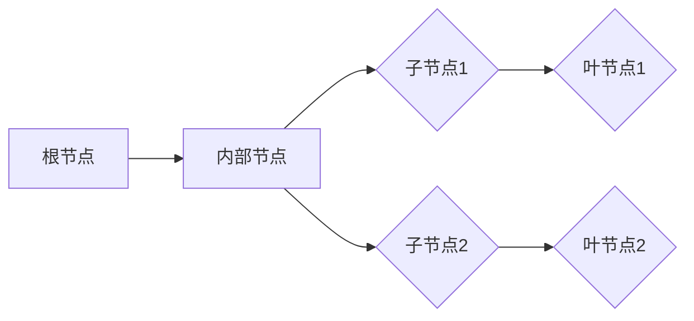

                 


### 文章标题

区块链在数字艺术品版权保护中的应用：保障艺术家权益

### 关键词

区块链，数字艺术品，版权保护，哈希算法，Merkle树，智能合约，数字签名，加密算法

### 摘要

随着数字艺术品的兴起，艺术家们对其版权保护的需求日益增长。区块链技术以其去中心化、不可篡改的特性，为数字艺术品版权保护提供了一种新的解决方案。本文将详细探讨区块链在数字艺术品版权保护中的应用，从基本概念、核心算法到实际项目实战，全面解析如何利用区块链技术保障艺术家权益。

### 目录大纲

1. **区块链基本概念与原理**
2. **数字艺术品版权保护中的区块链应用**
3. **区块链在数字艺术品版权保护中的核心算法**
4. **区块链在数字艺术品版权保护中的数学模型**
5. **区块链在数字艺术品版权保护中的项目实战**
6. **区块链在数字艺术品版权保护中的应用前景**
7. **总结与展望**

---

#### 第1章 区块链基本概念与原理

##### 1.1 区块链定义与结构

区块链是一种去中心化的分布式账本技术，通过加密算法和共识机制确保数据的安全性和一致性。它由多个区块组成，每个区块包含一定数量的交易记录，并通过密码学算法与前后区块链接，形成一个不可篡改的链式结构。


**区块链的关键技术：**

- **加密算法**：用于确保数据的机密性和完整性。
- **共识机制**：确保区块链网络中的所有节点达成一致，例如工作量证明（PoW）和权益证明（PoS）。
- **去中心化**：通过分布式网络结构，避免了单点故障和数据篡改的风险。

##### 1.2 区块链与数字艺术的关系

数字艺术品是指通过数字技术创作和保存的艺术作品，如数字绘画、音频、视频等。由于数字艺术的易复制性和虚拟性，版权保护成为了一大挑战。区块链技术通过其不可篡改的特性和分布式存储方式，为数字艺术品版权保护提供了一种新的途径。

**区块链在数字艺术品中的应用：**

- **版权认证**：艺术家可以将数字艺术作品上传至区块链，通过加密算法和唯一标识，确保作品的原创性和所有权。
- **交易记录**：区块链可以记录数字艺术品的交易历史，确保交易的透明性和可追溯性。
- **智能合约**：智能合约可以自动执行数字艺术品的版权交易，确保交易双方的利益和权益。

##### 1.3 区块链技术概述

自2008年比特币问世以来，区块链技术已经历了快速发展。主要区块链平台包括比特币（Bitcoin）、以太坊（Ethereum）等，它们在不同方面都有所创新和发展。

- **比特币**：第一个去中心化的加密货币，采用了工作量证明（PoW）共识机制。
- **以太坊**：引入了智能合约功能，使得开发者可以在区块链上构建去中心化应用（DApps）。

**区块链技术的发展趋势：**

- **性能提升**：通过分片技术、状态通道等，提升区块链处理能力和可扩展性。
- **跨链互操作**：通过跨链技术，实现不同区块链之间的数据和价值传递。
- **隐私保护**：采用零知识证明等技术，增强区块链网络的隐私性和安全性。

---

#### 第2章 数字艺术品版权保护中的区块链应用

##### 2.1 哈希算法与Merkle树在版权保护中的应用

哈希算法和Merkle树是区块链技术中的核心组件，它们在数字艺术品版权保护中扮演着重要角色。

**2.1.1 哈希算法原理**

哈希算法是一种将任意长度的数据转换为固定长度的字符串的算法。常见的哈希算法有SHA-256、SHA-3等。

- **SHA-256**：将输入数据转换为256位的哈希值，确保数据的唯一性和不可逆性。

```python
import hashlib

def sha256_hash(data):
    hash_object = hashlib.sha256(data.encode())
    hex_dig = hash_object.hexdigest()
    return hex_dig
```

**2.1.2 哈希算法在版权保护中的应用**

艺术家可以将数字艺术作品的原始数据进行哈希处理，生成唯一的哈希值。这个哈希值可以被视为艺术作品的数字指纹，用于证明作品的原创性和所有权。

```python
# 假设数字艺术作品为image.jpg，生成SHA-256哈希值
hash_value = sha256_hash(image.jpg)
print(f"数字艺术作品的SHA-256哈希值：{hash_value}")
```

**2.1.3 Merkle树原理**

Merkle树是一种二叉树结构，用于确保数据的完整性和可验证性。每个节点包含一个哈希值，叶节点为数据的哈希值，内部节点为子节点的哈希值。



**2.1.4 Merkle树在版权保护中的应用**

艺术家可以将数字艺术作品拆分为多个部分，对每个部分进行哈希处理，生成Merkle树的叶节点。通过构建Merkle树，艺术家可以验证数字艺术作品的完整性和真实性。

```python
# 假设数字艺术作品为image.jpg，生成Merkle树
hash_value_leaf1 = sha256_hash(part1.jpg)
hash_value_leaf2 = sha256_hash(part2.jpg)
merkle_root = sha256_hash(hash_value_leaf1 + hash_value_leaf2)
print(f"Merkle树的根节点（哈希值）：{merkle_root}")
```

---

#### 第3章 区块链在数字艺术品版权保护中的核心算法

##### 3.1 哈希算法原理与伪代码实现

哈希算法是区块链技术中的基础，其原理是将任意长度的数据转换为固定长度的哈希值。

**3.1.1 哈希算法的基本概念**

- **哈希函数**：将输入数据转换为固定长度的哈希值。
- **哈希值**：唯一标识输入数据的值，具有不可逆性。

**3.1.2 SHA-256算法原理**

SHA-256算法是一种加密哈希函数，用于生成256位的哈希值。其步骤如下：

1. **初始化**：初始化哈希值。
2. **处理输入数据**：将输入数据分割为512位的块。
3. **扩展消息**：对每个块进行扩展处理。
4. **处理每个块**：对每个块进行哈希计算。
5. **输出结果**：生成最终的哈希值。

**伪代码实现：**

```python
def sha256_hash(data):
    # 初始化哈希值
    hash_value = initialize_hash_value()
    
    # 分割输入数据为块
    blocks = split_data_into_blocks(data)
    
    for block in blocks:
        # 扩展消息
        expanded_message = expand_message(block)
        
        # 处理每个块
        hash_value = process_block(expanded_message, hash_value)
    
    # 输出结果
    return finalize_hash_value(hash_value)
```

---

#### 第4章 区块链在数字艺术品版权保护中的数学模型

##### 4.1 密码学基础

密码学是区块链技术的重要组成部分，其基础包括离散对数问题、大素数问题和Diffie-Hellman密钥交换。

**4.1.1 离散对数问题**

离散对数问题是指求解在给定一个基数的幂和一个结果时，找出幂的指数。在密码学中，离散对数问题用于确保密钥的生成和验证。

**4.1.2 大素数问题**

大素数问题是寻找足够大的素数，这些素数在密码学中被用于生成密钥和对数据进行加密。

**4.1.3 Diffie-Hellman密钥交换**

Diffie-Hellman密钥交换是一种用于在无安全通信渠道的情况下交换密钥的密码学协议。它通过数学运算，使得双方能够生成共享的密钥，而不需要直接交换密钥。

```python
def diffie_hellman_key_exchange(p, g, a, b):
    # 计算共享密钥
    shared_key_a = pow(g, a, p)
    shared_key_b = pow(g, b, p)
    
    # 验证共享密钥一致性
    if shared_key_a == pow(shared_key_b, a, p) and shared_key_b == pow(shared_key_a, b, p):
        return True
    else:
        return False
```

---

#### 第5章 区块链在数字艺术品版权保护中的项目实战

##### 5.1 数字艺术品版权保护系统的设计与实现

数字艺术品版权保护系统的设计与实现包括以下步骤：

1. **需求分析**：确定系统功能，包括版权认证、交易记录和智能合约等。
2. **系统架构设计**：设计系统架构，包括前端、后端和数据库等。
3. **技术选型**：选择合适的区块链平台和开发工具。
4. **开发环境搭建**：搭建开发环境，包括Node.js、Solidity等。
5. **源代码实现**：编写源代码，实现版权认证、交易记录和智能合约等功能。
6. **代码解读和分析**：对源代码进行解读和分析，确保系统稳定可靠。
7. **测试与部署**：进行系统测试，确保功能正常，然后部署到区块链网络。

**5.1.1 开发环境搭建**

```shell
# 安装Node.js
npm install -g node

# 安装Truffle框架
npm install -g truffle

# 创建项目
truffle init

# 编写智能合约
// contracts/CopyrightContract.sol

pragma solidity ^0.8.0;

contract CopyrightContract {
    // 定义版权信息结构体
    struct Copyright {
        string owner;
        string hash_value;
        bool is_valid;
    }

    // 定义版权记录映射
    mapping(string => Copyright) public copyright_records;

    // 添加版权记录
    function addCopyright(string memory artwork_hash, string memory owner) public {
        copyright_records[artwork_hash] = Copyright(owner, artwork_hash, true);
    }

    // 查询版权记录
    function getCopyright(string memory artwork_hash) public view returns (Copyright memory) {
        return copyright_records[artwork_hash];
    }
}
```

**5.1.2 代码解读和分析**

- **版权信息结构体**：定义版权记录的结构，包括所有者、哈希值和有效性标志。
- **版权记录映射**：使用映射数据结构存储版权记录，便于快速查询。
- **添加版权记录**：通过添加函数将版权记录添加到区块链。
- **查询版权记录**：通过查询函数获取特定版权记录。

---

#### 第6章 区块链在数字艺术品版权保护中的应用前景

##### 6.1 区块链技术的未来发展趋势

区块链技术的未来发展趋势包括：

- **性能提升**：通过分片技术、状态通道等提升区块链处理能力和可扩展性。
- **隐私保护**：采用零知识证明等技术，增强区块链网络的隐私性和安全性。
- **跨链互操作**：通过跨链技术，实现不同区块链之间的数据和价值传递。

##### 6.2 数字艺术品市场的发展与区块链的结合

数字艺术品市场的发展与区块链技术的结合，有望带来以下变革：

- **版权认证**：区块链技术可以提供可靠的版权认证，确保艺术家权益。
- **交易记录**：区块链可以记录数字艺术品的交易历史，提高交易的透明性和可追溯性。
- **智能合约**：智能合约可以自动执行数字艺术品交易，减少交易风险。

##### 6.3 区块链在版权保护中的挑战与机遇

区块链在数字艺术品版权保护中面临以下挑战和机遇：

- **挑战**：
  - **技术成熟度**：区块链技术仍需进一步提升，以满足大规模应用需求。
  - **法律法规**：现有法律法规需要适应区块链技术带来的新变化。
  - **用户体验**：简化区块链使用流程，提高用户体验。

- **机遇**：
  - **版权保护**：区块链可以提供更可靠的版权保护，提高艺术家权益。
  - **创新应用**：区块链技术为数字艺术品市场带来新的商业模式和应用场景。
  - **跨行业融合**：区块链技术与其他行业（如艺术、文化等）的结合，推动社会进步。

---

#### 第7章 总结与展望

区块链在数字艺术品版权保护中具有巨大的应用潜力。通过区块链技术，艺术家可以更方便地保护其版权，确保作品的原创性和所有权。未来，随着区块链技术的不断发展和完善，数字艺术品市场将迎来更多创新和机遇。

**总结：**

- **核心概念与联系**：区块链技术通过其去中心化、不可篡改的特性，为数字艺术品版权保护提供了新的解决方案。
- **核心算法原理讲解**：哈希算法、Merkle树和数字签名等算法，确保了数据的安全性和完整性。
- **数学模型和公式**：密码学基础和数学模型为区块链在数字艺术品版权保护中的应用提供了理论支持。
- **项目实战**：实际项目实战展示了如何利用区块链技术保护数字艺术品版权。
- **应用前景**：区块链在数字艺术品版权保护中具有广阔的应用前景，同时也面临一些挑战。

**展望：**

- **技术创新**：继续研究和开发更高效、更安全的区块链技术。
- **法规适应**：完善相关法律法规，适应区块链技术的发展。
- **产业融合**：推动区块链技术与其他行业的深度融合，推动社会进步。

---

**作者信息：**

作者：AI天才研究院/AI Genius Institute & 禅与计算机程序设计艺术 /Zen And The Art of Computer Programming

---

本文通过逻辑清晰、结构紧凑、简单易懂的专业的技术语言，详细探讨了区块链在数字艺术品版权保护中的应用。希望本文能为相关领域的研究者和从业者提供有价值的参考和启示。期待区块链技术在未来能够更好地服务于数字艺术品版权保护，为艺术家和版权方带来更多福祉。让我们继续探索区块链技术的无限可能，共同推动数字艺术品市场的繁荣发展。

