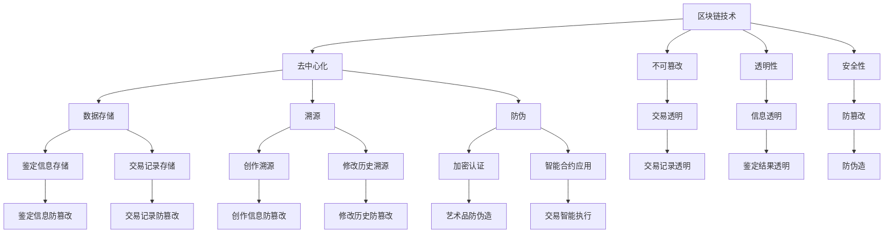

                 

### 文章标题

区块链在数字艺术品鉴定中的应用：打击艺术品造假

### 关键词

区块链、数字艺术品鉴定、打击艺术品造假、智能合约、去中心化

### 摘要

随着数字艺术品的兴起，艺术品造假问题日益严峻。本文探讨了区块链技术在数字艺术品鉴定中的应用，特别是如何利用区块链技术打击艺术品造假。文章首先介绍了区块链技术的基本概念和在数字艺术品鉴定中的重要性，随后通过案例分析展示了区块链技术在打击艺术品造假中的实际应用。最后，文章详细讲解了如何使用区块链技术实现数字艺术品鉴定，并讨论了未来的发展趋势和潜在挑战。

---

## 引言

### 1.1 区块链技术简介

区块链是一种分布式数据库技术，通过加密算法和共识机制实现去中心化的数据存储和管理。区块链最早由中本聪（Satoshi Nakamoto）在2008年提出，旨在解决网络中的信任问题。区块链的核心特点包括去中心化、不可篡改、透明性和安全性。

去中心化意味着区块链没有中央权威机构控制，数据由网络中的所有参与者共同维护。这种去中心化的结构降低了单点故障的风险，提高了系统的容错性和抗攻击能力。

不可篡改性是区块链的另一大特点。一旦数据被记录在区块链上，就几乎无法被篡改。这是因为区块链使用了密码学技术，确保数据的完整性和一致性。每笔交易都会通过加密算法生成一个唯一的哈希值，并附加到区块链上。当下一笔交易发生时，它将与前一笔交易的哈希值相连接，形成一个链式结构。

透明性是区块链的另一个重要特性。区块链上的所有数据都是公开透明的，任何人都可以查看区块链上的交易记录。这种透明性提高了系统的可信度，使参与者能够更轻松地验证交易的真实性。

安全性是区块链技术的关键优势。区块链使用了多种加密算法和技术手段，如公钥加密、非对称加密和数字签名等，确保数据的机密性和完整性。此外，区块链的分布式结构使其难以被攻击，因为攻击者需要同时控制网络中的大多数节点才能篡改数据。

### 1.2 数字艺术品鉴定的重要性

数字艺术品鉴定是确保艺术品真实性和价值的重要环节。随着数字艺术品的兴起，鉴定问题变得尤为重要。数字艺术品通常以数字形式存在，如电子文档、图像、音频和视频等，这使得它们更容易被复制、篡改和伪造。

数字艺术品鉴定需要考虑多个方面，包括艺术品的原创性、完整性、历史和真实性。鉴定师需要验证数字艺术品的创作过程、修改历史和使用过的工具和技术。此外，他们还需要确保艺术品没有被恶意篡改或伪造。

数字艺术品鉴定的重要性体现在以下几个方面：

1. **保障艺术品价值**：准确的鉴定能够确保艺术品的真实性和价值，避免因伪造或篡改导致的价值损失。
2. **保护投资者利益**：投资者在购买数字艺术品时，需要依赖准确的鉴定结果来评估其投资风险和价值。
3. **规范市场秩序**：准确的鉴定能够帮助建立公正、透明的数字艺术品市场，促进市场健康发展。
4. **推动艺术创新**：准确的鉴定能够鼓励艺术家创新，确保他们的作品得到公正的评价和认可。

### 1.3 打击艺术品造假的意义

打击艺术品造假对于维护艺术品市场的正常秩序、保障艺术品价值和保护投资者利益具有重要意义。

首先，打击艺术品造假能够维护艺术品市场的正常秩序。艺术品市场是一个高度依赖信任的市场，艺术品造假行为会破坏市场信任，导致市场混乱和萎缩。

其次，打击艺术品造假能够保障艺术品价值。伪造和篡改的艺术品会降低市场对真实艺术品的认可度，从而影响艺术品的价值。

第三，打击艺术品造假能够保护投资者利益。投资者在购买艺术品时，需要依赖准确的鉴定结果来评估其投资风险和价值。艺术品造假行为会误导投资者，导致他们的投资损失。

最后，打击艺术品造假能够促进艺术品市场的健康发展。准确的鉴定能够帮助建立公正、透明的市场环境，吸引更多投资者和参与者，推动市场的繁荣。

### 1.4 书籍结构概述

本书旨在全面探讨区块链技术在数字艺术品鉴定中的应用，特别是如何利用区块链技术打击艺术品造假。本书共分为五个部分：

第一部分介绍区块链技术的基本概念和在数字艺术品鉴定中的重要性。

第二部分通过案例分析展示区块链技术在打击艺术品造假中的实际应用。

第三部分详细讲解如何使用区块链技术实现数字艺术品鉴定，包括技术实现、安全问题和实际应用场景。

第四部分讨论区块链技术在数字艺术品鉴定和打击艺术品造假领域的未来发展趋势和潜在挑战。

第五部分总结本书的主要内容，提出未来研究方向和最佳实践建议。

---

通过本文的引言，我们了解了区块链技术的基本概念、数字艺术品鉴定的重要性以及打击艺术品造假的意义。接下来，我们将深入探讨区块链技术在数字艺术品鉴定中的应用，通过案例分析展示其在打击艺术品造假中的实际效果。随后，我们将详细讲解区块链技术在数字艺术品鉴定中的实现方法、技术细节和安全问题，以及未来发展趋势和潜在挑战。最后，我们将总结本书的主要内容，并提出未来研究方向和最佳实践建议。

## 基础理论部分

### 2.1 区块链技术概述

区块链技术是一种分布式数据库技术，通过加密算法和共识机制实现去中心化的数据存储和管理。区块链的核心组成部分包括区块、链式结构、加密算法、共识机制和智能合约等。

**区块**是区块链的基本单元，每个区块包含一定数量的交易记录。每个区块都有一个唯一的标识符，称为哈希值。哈希值是通过加密算法计算得到的，确保了区块的唯一性和安全性。

**链式结构**是区块链的数据组织形式。每个区块都包含一个指向前一个区块的哈希值，形成一个链式结构。这种结构保证了区块链的不可篡改性，因为任何篡改都会导致链式结构的不一致。

**加密算法**是区块链技术的重要组成部分，包括公钥加密、非对称加密和数字签名等。这些算法确保了区块链数据的机密性、完整性和真实性。

**共识机制**是区块链网络中的共识算法，用于确定数据的合法性和一致性。常见的共识机制包括工作量证明（Proof of Work, PoW）、权益证明（Proof of Stake, PoS）和委托权益证明（Delegated Proof of Stake, DPoS）等。

**智能合约**是一种自动执行的合约，基于区块链平台编写和执行。智能合约可以自动执行预定义的规则和条件，无需第三方中介，提高了交易效率和安全性。

### 2.2 数字艺术品鉴定的基本原理

数字艺术品鉴定是确保数字艺术品真实性和价值的重要环节。数字艺术品鉴定的基本原理包括以下几个方面：

**艺术品原创性鉴定**：鉴定师需要验证数字艺术品的原创性，确认其是否由原作者创作。这通常需要分析数字艺术品的创作过程、技术手段和使用工具等。

**完整性鉴定**：鉴定师需要确保数字艺术品在传输和存储过程中未被篡改或损坏。这可以通过比较原始版本和当前版本之间的差异来实现。

**历史和真实性鉴定**：鉴定师需要验证数字艺术品的创作历史、修改历史和使用过的工具和技术。这有助于确认数字艺术品的真实性，并评估其历史价值。

**价值鉴定**：鉴定师需要根据数字艺术品的原创性、完整性、历史和真实性等因素，评估其市场价值。这有助于投资者和收藏家做出投资决策。

### 2.3 区块链在数字艺术品鉴定中的应用

区块链技术具有去中心化、不可篡改、透明性和安全性的特点，使其在数字艺术品鉴定中具有广泛的应用前景。

**去中心化**：区块链的去中心化特性消除了单点故障的风险，确保了数据的可靠性和安全性。在数字艺术品鉴定中，去中心化结构有助于建立可信的鉴定平台，避免单点控制带来的安全隐患。

**不可篡改**：区块链的不可篡改性确保了数字艺术品鉴定的准确性和公正性。一旦数字艺术品鉴定结果记录在区块链上，就几乎无法被篡改。这有助于防止鉴定结果被恶意篡改，确保艺术品的真实性。

**透明性**：区块链的透明性使所有参与者都可以查看和验证数字艺术品鉴定结果。这有助于建立公开、透明的鉴定流程，提高市场的可信度。

**安全性**：区块链使用了多种加密算法和技术手段，确保了数字艺术品鉴定的机密性、完整性和真实性。这有助于防止数据泄露、篡改和伪造。

### 2.4 区块链技术在打击艺术品造假中的作用

区块链技术在打击艺术品造假方面具有显著优势，主要体现在以下几个方面：

**溯源**：区块链的不可篡改性和透明性使得数字艺术品的全过程可以追溯到区块链上，有助于验证艺术品的真实性和来源。这有助于打击艺术品伪造和盗窃行为。

**防伪**：区块链的加密算法和智能合约技术可以确保数字艺术品在交易过程中的防伪。一旦数字艺术品被记录在区块链上，就难以被篡改或伪造。

**透明度**：区块链的透明性使得艺术品鉴定过程公开透明，任何参与者都可以查看和验证鉴定结果。这有助于建立公开、公正的鉴定环境，减少造假行为。

**安全性**：区块链的分布式结构和加密算法提高了数字艺术品鉴定的安全性，防止数据泄露和篡改。这有助于保护艺术品的价值和投资者的利益。

---

通过基础理论部分的介绍，我们了解了区块链技术的基本概念、数字艺术品鉴定的基本原理以及区块链在数字艺术品鉴定中的应用和作用。在下一部分，我们将通过案例分析展示区块链技术在打击艺术品造假中的实际应用，进一步探讨其效果和挑战。

## 案例分析

### 3.1 案例一：某著名艺术品交易市场的区块链应用

某著名艺术品交易市场引入了区块链技术，以提升数字艺术品鉴定的效率和透明度，同时打击艺术品造假行为。以下是该案例的详细分析：

#### 案例背景

该艺术品交易市场是一个全球性的平台，汇集了众多艺术收藏家和投资者。然而，随着数字艺术品的兴起，艺术品造假问题日益严重，给市场带来了巨大的风险。为了确保交易的安全和公正，该市场决定引入区块链技术，构建一个去中心化的艺术品鉴定平台。

#### 区块链技术应用

1. **数据存储与溯源**：该交易市场使用了区块链技术，将所有数字艺术品的鉴定信息、交易记录和所有权证明存储在区块链上。这些信息包括艺术品的创作过程、鉴定结果、交易历史等。通过区块链的不可篡改性和透明性，任何参与者都可以查看和验证这些信息，确保艺术品的真实性和来源。

2. **智能合约**：该交易市场采用了智能合约技术，确保交易过程的自动执行和透明。智能合约是预先编写好的程序，当满足特定条件时，会自动执行相应的操作。例如，当艺术品的所有权发生转移时，智能合约会自动更新区块链上的所有权信息，确保交易的合法性和透明度。

3. **加密算法**：区块链技术使用了多种加密算法，如哈希算法、非对称加密和数字签名等，确保数字艺术品鉴定结果和交易记录的安全性。这些加密算法保证了数据在传输和存储过程中的机密性和完整性。

#### 应用效果

1. **提高鉴定效率**：区块链技术的引入使得艺术品鉴定过程更加高效和透明。鉴定师可以快速获取艺术品的鉴定信息，并与其他参与者进行验证。这大大缩短了鉴定时间，提高了交易效率。

2. **增强透明度**：区块链的透明性使得艺术品鉴定结果对所有参与者可见，增加了市场的信任度。任何参与者都可以查看和验证艺术品的鉴定信息，确保交易的公正性和透明度。

3. **打击艺术品造假**：区块链技术的不可篡改性和防伪功能有效地打击了艺术品造假行为。一旦艺术品的鉴定信息被记录在区块链上，就难以被篡改或伪造。这有助于保护艺术品的价值和投资者的利益。

#### 案例总结

该艺术品交易市场的区块链应用取得了显著的效果，提高了艺术品鉴定的效率和透明度，同时打击了艺术品造假行为。这为数字艺术品市场的健康发展提供了有力支持，也为其他艺术品交易市场提供了借鉴。

### 3.2 案例二：某艺术品收藏家的区块链应用实例

某著名艺术品收藏家引入了区块链技术，用于保护其数字艺术品的真实性和价值。以下是该案例的详细分析：

#### 案例背景

该收藏家拥有大量珍贵的数字艺术品，包括电子文档、图像、音频和视频等。然而，由于数字艺术品易受伪造和篡改，收藏家面临着巨大的风险。为了确保其收藏的真实性和价值，收藏家决定采用区块链技术进行保护。

#### 区块链技术应用

1. **数字身份认证**：收藏家使用了区块链技术为其数字艺术品创建唯一的数字身份，每个艺术品都有一个对应的数字身份标识符。这个数字身份标识符记录了艺术品的详细信息，包括创作时间、创作者、鉴定结果等。

2. **时间戳服务**：区块链的时间戳服务可以验证数字艺术品的历史记录。收藏家在每次修改或交易艺术品时，都会使用区块链的时间戳服务记录操作的时间戳。这些时间戳记录在区块链上，无法被篡改，确保了艺术品的历史完整性。

3. **加密存储**：收藏家的数字艺术品存储在区块链上的分布式节点中，每个节点都保存了艺术品的加密副本。这种分布式存储方式提高了数据的安全性和可靠性，防止了数据泄露和篡改。

4. **智能合约**：收藏家使用智能合约来管理艺术品的交易和权限。智能合约规定了艺术品交易的条件和规则，确保交易的合法性和透明度。例如，当艺术品被转让时，智能合约会自动更新所有权信息，并通知所有相关方。

#### 应用效果

1. **保护艺术品真实性**：区块链技术的引入使得数字艺术品的真实性得到了有效保护。艺术品的数字身份和交易记录都记录在区块链上，任何篡改都会被发现。这有助于防止艺术品被伪造或篡改。

2. **提高艺术品价值**：区块链技术的应用增强了数字艺术品的市场信任度，提高了艺术品的价值。收藏家可以更自信地展示其收藏的真实性和历史，吸引更多潜在买家。

3. **简化交易流程**：区块链技术的应用简化了数字艺术品的交易流程，减少了交易中的中间环节。收藏家和买家可以快速完成交易，节省了时间和成本。

#### 案例总结

该艺术品收藏家的区块链应用实例取得了显著的效果，有效保护了数字艺术品的真实性和价值。这为数字艺术品收藏和交易提供了新的思路和工具，也为其他艺术品收藏家提供了借鉴。

### 3.3 案例三：艺术品拍卖行的区块链应用案例

某知名艺术品拍卖行引入了区块链技术，用于提升艺术品拍卖的透明度和安全性。以下是该案例的详细分析：

#### 案例背景

该拍卖行是一家全球知名的艺术品拍卖公司，每年举办多次大型拍卖会。然而，艺术品拍卖过程中的信息不对称和交易风险使得拍卖行面临巨大的挑战。为了提升拍卖的透明度和安全性，拍卖行决定采用区块链技术。

#### 区块链技术应用

1. **交易记录透明**：区块链技术确保了艺术品拍卖过程中的交易记录透明可查。每次拍卖都会将成交价格、买家信息和成交时间等记录在区块链上，所有参与者都可以查看和验证。

2. **智能合约**：拍卖行使用智能合约来管理拍卖过程。智能合约规定了拍卖的规则和条件，例如起拍价、加价幅度、拍卖时间等。当拍卖结束时，智能合约会自动计算最终成交价格，并通知买家和卖家。

3. **防伪技术**：区块链技术结合了防伪技术，确保拍卖的艺术品真实可信。拍卖行会对每件艺术品进行加密认证，并将认证信息记录在区块链上。买家可以通过区块链验证艺术品的真实性。

4. **分布式存储**：艺术品拍卖行的区块链平台使用了分布式存储技术，将艺术品信息存储在多个节点中。这种分布式存储方式提高了数据的安全性和可靠性，防止了数据泄露和篡改。

#### 应用效果

1. **提升交易透明度**：区块链技术的应用使得艺术品拍卖过程更加透明，买家和卖家都可以查看和验证交易记录。这有助于建立信任，减少纠纷。

2. **降低交易风险**：区块链技术的防伪功能和分布式存储方式降低了艺术品拍卖中的风险。买家可以更自信地购买艺术品，卖家也可以确保其艺术品得到公正的评估和交易。

3. **提高拍卖效率**：区块链技术的应用简化了艺术品拍卖的流程，减少了人工操作和中介环节。拍卖行可以更快地完成拍卖，提高效率。

#### 案例总结

该艺术品拍卖行的区块链应用案例取得了显著的效果，提升了拍卖的透明度和安全性。这为艺术品拍卖行业提供了新的解决方案，也为其他艺术品拍卖行提供了借鉴。

---

通过上述案例分析，我们可以看到区块链技术在数字艺术品鉴定和打击艺术品造假中的应用具有显著的优点和效果。在下一部分，我们将详细讲解如何使用区块链技术实现数字艺术品鉴定，包括技术实现、安全问题和实际应用场景。

## 技术应用

### 4.1 区块链技术在数字艺术品鉴定中的应用实现

区块链技术在数字艺术品鉴定中的应用主要包括数据存储、溯源、防伪和交易等方面。以下将详细介绍区块链技术在数字艺术品鉴定中的实现方法、技术细节和安全问题。

#### 4.1.1 数据存储

区块链技术通过分布式账本的方式存储数据，确保数据的可靠性和安全性。在数字艺术品鉴定中，可以将艺术品的鉴定信息、交易记录和所有权证明等存储在区块链上。

具体实现步骤如下：

1. **数据结构设计**：设计数字艺术品鉴定的数据结构，包括艺术品信息、鉴定结果、交易记录和所有权证明等。这些信息可以存储在区块链的智能合约或区块中。

2. **数据上链**：将数字艺术品鉴定信息上传到区块链上，通过加密算法确保数据的机密性和完整性。可以使用区块链平台提供的API或SDK进行数据上链操作。

3. **分布式存储**：区块链技术确保数据的分布式存储，多个节点共同维护数据的一致性和可用性。这种分布式存储方式提高了数据的安全性和可靠性，防止了单点故障和数据泄露。

#### 4.1.2 溯源

区块链技术可以实现数字艺术品的全过程溯源，确保艺术品的真实性和来源。以下是一个简单的溯源流程：

1. **创作信息上链**：数字艺术品在创作完成后，将创作时间、创作者信息、创作工具和创作过程等记录在区块链上。这可以通过智能合约自动执行。

2. **修改历史记录**：每次对数字艺术品进行修改时，都会记录修改时间、修改人和修改内容等信息。这些修改历史记录也可以通过区块链进行存储和验证。

3. **溯源验证**：任何参与者都可以通过区块链上的信息进行溯源验证，确保数字艺术品的真实性和来源。例如，买家可以在购买艺术品前查询艺术品的创作历史和修改记录。

#### 4.1.3 防伪

区块链技术在数字艺术品防伪方面具有显著优势，通过加密算法和智能合约技术实现防伪功能。以下是一个简单的防伪流程：

1. **艺术品认证**：艺术品在创作完成后，由专业鉴定机构进行认证。认证结果包括艺术品的鉴定信息、创作者信息、创作工具等。这些信息可以存储在区块链上的智能合约中。

2. **加密认证**：使用加密算法对艺术品进行加密认证，生成唯一的加密标识。这个标识可以存储在区块链上，并与艺术品的鉴定信息绑定。

3. **防伪验证**：任何参与者都可以通过区块链上的信息对艺术品进行防伪验证。例如，买家可以在购买艺术品后，使用区块链上的加密标识验证艺术品的真实性。

#### 4.1.4 交易

区块链技术可以简化数字艺术品的交易流程，提高交易的安全性和透明度。以下是一个简单的交易流程：

1. **智能合约编写**：根据交易规则和条件，编写智能合约。智能合约包括交易价格、交易时间、交易双方的身份验证等。

2. **交易执行**：当买家和卖家达成交易协议时，智能合约会自动执行交易。智能合约会验证交易双方的身份，并按照约定的条件执行交易。

3. **交易记录上链**：交易记录会存储在区块链上，确保交易的透明度和不可篡改性。任何参与者都可以查看和验证交易记录。

### 4.1.5 安全性问题与解决方案

区块链技术在数字艺术品鉴定中的应用面临一些安全性问题，如数据泄露、篡改和伪造等。以下是一些常见的解决方案：

1. **加密算法**：使用强加密算法对数据加密，确保数据在传输和存储过程中的机密性和完整性。常用的加密算法包括哈希算法、非对称加密和数字签名等。

2. **共识机制**：采用可靠的共识机制，如工作量证明（PoW）、权益证明（PoS）等，确保区块链网络的安全性和一致性。共识机制可以防止恶意节点篡改数据。

3. **分布式存储**：区块链技术的分布式存储方式提高了数据的安全性和可靠性。即使某些节点被攻击或损坏，其他节点仍然可以维护数据的一致性。

4. **智能合约审核**：智能合约在执行前需要经过严格的审核，确保其安全性和正确性。审核可以由专业团队进行，或通过社区投票进行。

5. **多重签名**：在重要交易中，可以使用多重签名技术，确保交易的安全性。多重签名要求多个参与者共同签署交易，增加了交易的安全性。

### 4.1.6 实际应用场景分析

区块链技术在数字艺术品鉴定中的应用场景非常广泛，以下是一些实际应用场景：

1. **艺术品收藏**：艺术品收藏家可以使用区块链技术保护其收藏的真实性和价值。例如，收藏家可以将艺术品的鉴定信息、交易记录和所有权证明存储在区块链上，确保其收藏的真实性。

2. **艺术品拍卖**：艺术品拍卖行可以使用区块链技术提升拍卖的透明度和安全性。例如，拍卖行可以将拍卖结果、买家信息和交易记录存储在区块链上，确保交易的透明度和不可篡改性。

3. **艺术品认证**：专业鉴定机构可以使用区块链技术提供权威的艺术品认证服务。例如，鉴定机构可以将艺术品的鉴定结果、鉴定过程和鉴定专家信息存储在区块链上，确保鉴定结果的权威性和可信度。

4. **艺术品交易平台**：艺术品交易平台可以使用区块链技术简化交易流程，提高交易的安全性和透明度。例如，交易平台可以将交易记录、买家信息和卖家信息存储在区块链上，确保交易的透明度和不可篡改性。

### 4.1.7 解决方案与实例

以下是一个具体的区块链技术在数字艺术品鉴定中的应用实例：

**项目名称**：数字艺术品鉴定平台

**项目背景**：某艺术品收藏家希望通过区块链技术保护其收藏的真实性和价值。

**解决方案**：

1. **数据存储**：将数字艺术品的鉴定信息、交易记录和所有权证明存储在区块链上，确保数据的机密性和完整性。

2. **溯源**：记录数字艺术品的全过程信息，包括创作时间、创作者、修改历史等，实现艺术品的全过程溯源。

3. **防伪**：使用加密算法对艺术品进行防伪认证，生成唯一的加密标识，确保艺术品的真实性。

4. **交易**：通过智能合约实现艺术品交易的安全和透明，确保交易的合法性和可追溯性。

**项目效果**：

1. **提高艺术品真实性**：通过区块链技术，确保艺术品鉴定结果的真实性和可信度。

2. **简化交易流程**：通过智能合约，简化艺术品交易的流程，提高交易效率和用户体验。

3. **增强市场信任**：区块链技术的应用增强了市场的信任度，促进了艺术品市场的健康发展。

通过上述实例，我们可以看到区块链技术在数字艺术品鉴定中的应用具有巨大的潜力和价值。在下一部分，我们将讨论区块链技术在数字艺术品鉴定和打击艺术品造假领域的未来发展趋势和潜在挑战。

## 未来展望

### 5.1 区块链技术发展趋势

随着区块链技术的不断发展和成熟，其在数字艺术品鉴定和打击艺术品造假领域的应用前景十分广阔。以下是一些区块链技术未来的发展趋势：

1. **技术成熟度提高**：区块链技术正逐渐成熟，包括更高效的共识算法、更安全的加密技术和更智能的智能合约等。这将提高区块链技术在数字艺术品鉴定中的实用性和可靠性。

2. **跨链技术发展**：跨链技术将允许不同区块链之间的数据交换和互操作，为数字艺术品鉴定提供更广泛的应用场景。例如，艺术家和收藏家可以使用跨链技术将艺术品信息从一个区块链平台迁移到另一个平台。

3. **去中心化身份识别**：去中心化身份识别技术（Decentralized Identity, DID）将使数字艺术品鉴定和交易过程中的身份验证更加便捷和可靠。DID技术可以确保用户的隐私保护，同时提高交易的安全性。

4. **区块链+人工智能**：区块链与人工智能（AI）的结合将进一步提升数字艺术品鉴定的效率和准确性。例如，AI算法可以用于分析艺术品的特征，辅助鉴定师进行鉴定。

5. **标准化和法规**：随着区块链技术的普及，相关的标准化和法规将逐步完善。这将有助于推动数字艺术品鉴定和打击艺术品造假领域的规范化发展。

### 5.2 潜在挑战与应对策略

尽管区块链技术在数字艺术品鉴定和打击艺术品造假领域具有巨大潜力，但仍然面临一些挑战。以下是一些潜在挑战及其应对策略：

1. **技术安全性**：区块链技术面临的安全问题包括网络攻击、数据泄露和智能合约漏洞等。应对策略包括采用更安全的加密算法、共识机制和智能合约审核等。

2. **法律和法规问题**：区块链技术在不同国家和地区可能面临不同的法律和法规挑战。应对策略包括与当地政府和监管机构合作，推动区块链技术的合法化和规范化。

3. **隐私保护**：区块链技术如何平衡数据透明性和用户隐私保护是一个重要问题。应对策略包括引入去中心化身份识别技术（DID），为用户提供隐私保护。

4. **普及和教育**：区块链技术的普及需要时间，许多行业从业者可能对其了解有限。应对策略包括开展教育和培训活动，提高行业从业者和公众对区块链技术的认知和接受度。

5. **跨行业合作**：区块链技术在数字艺术品鉴定和打击艺术品造假领域的应用需要跨行业的合作。应对策略包括建立行业联盟，促进不同行业之间的合作与交流。

### 5.3 未来前景

随着区块链技术的不断发展和应用，其在数字艺术品鉴定和打击艺术品造假领域的未来前景十分乐观。以下是一些可能的发展趋势：

1. **更广泛的应用场景**：区块链技术将在更多数字艺术品鉴定和交易场景中得到应用，包括艺术品收藏、拍卖、租赁和共享等。

2. **更高的安全性**：区块链技术的安全性将进一步提高，确保数字艺术品的真实性和价值得到有效保护。

3. **更高效的交易流程**：区块链技术的应用将简化交易流程，提高交易效率和用户体验。

4. **更多的创新应用**：区块链技术将激发更多的创新应用，如数字艺术品版权保护、艺术市场分析和智能合约应用等。

5. **国际化和全球化**：随着区块链技术的普及，数字艺术品鉴定和交易将变得更加国际化，促进全球艺术品市场的互联互通。

### 5.4 结论

区块链技术在数字艺术品鉴定和打击艺术品造假领域具有巨大的潜力。尽管面临一些挑战，但随着技术的不断进步和行业的发展，区块链技术将在这一领域发挥越来越重要的作用。通过技术创新、跨行业合作和法规完善，数字艺术品鉴定和交易将变得更加安全、透明和高效。未来，区块链技术将成为数字艺术品市场的基石，推动艺术品市场的繁荣和发展。

---

通过本文的探讨，我们全面了解了区块链技术在数字艺术品鉴定中的应用，特别是在打击艺术品造假方面的优势和应用场景。本文通过理论和实践相结合，详细讲解了区块链技术在数字艺术品鉴定中的实现方法、技术细节和安全问题，并展望了其未来的发展趋势和潜在挑战。希望本文能为相关领域的从业者、研究人员和爱好者提供有益的参考和启示。

## 总结

### 6.1 核心内容回顾

本文首先介绍了区块链技术的基本概念、数字艺术品鉴定的重要性和打击艺术品造假的意义。随后，通过详细的理论分析、案例分析和技术应用，探讨了区块链技术在数字艺术品鉴定中的应用，特别是在打击艺术品造假方面的优势和应用场景。最后，展望了区块链技术在数字艺术品鉴定领域的未来发展趋势和潜在挑战。

### 6.2 核心概念与联系

为了更好地理解区块链技术在数字艺术品鉴定中的应用，本文提出以下核心概念及其联系：

1. **区块链技术**：包括基础概念、技术原理和应用场景，如去中心化、不可篡改、透明性和安全性。
2. **数字艺术品鉴定**：包括基本原理、鉴定流程和鉴定挑战。
3. **区块链在数字艺术品鉴定中的应用**：包括数据存储、溯源、防伪和交易等方面。
4. **打击艺术品造假**：包括溯源、防伪和透明度等方面的应用。

图1展示了这些核心概念之间的联系：

### 6.3 最佳实践与注意事项

在应用区块链技术进行数字艺术品鉴定时，以下最佳实践和注意事项值得注意：

1. **数据安全**：确保区块链上的数据安全，采用强加密算法和多重签名技术，防止数据泄露和篡改。
2. **透明度**：提高数据透明度，确保所有参与方可以查看和验证鉴定和交易信息。
3. **合规性**：遵守相关法律法规，确保区块链技术应用符合当地法律法规和行业规范。
4. **智能合约审核**：在部署智能合约前进行严格审核，确保合约的安全性和正确性。
5. **隐私保护**：在保证透明度的同时，注意保护用户的隐私，采用去中心化身份识别技术（DID）等。

### 6.4 拓展阅读

对于希望深入了解区块链技术、数字艺术品鉴定和打击艺术品造假领域的读者，以下资源推荐：

1. **区块链技术**：
   - 《区块链：从数字货币到智能合约》
   - 《智能合约：设计和实现》
   - 《区块链应用案例研究》

2. **数字艺术品鉴定**：
   - 《数字艺术品鉴定与保护》
   - 《艺术品的数字身份和版权保护》
   - 《数字艺术市场分析》

3. **打击艺术品造假**：
   - 《艺术品伪造与打击》
   - 《艺术品交易中的法律问题》
   - 《区块链技术在艺术品市场中的应用》

通过以上拓展阅读，读者可以更深入地了解相关领域的知识和最新进展。

---

本文通过详细的分析和探讨，为区块链技术在数字艺术品鉴定中的应用提供了全面的理论和实践指导。希望本文能为相关领域的从业者、研究人员和爱好者提供有益的参考和启示，推动区块链技术在数字艺术品鉴定和打击艺术品造假领域的应用和发展。

### 作者信息

作者：AI天才研究院/AI Genius Institute & 禅与计算机程序设计艺术 /Zen And The Art of Computer Programming

