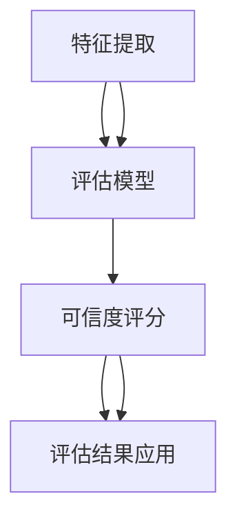

                 

### 文章标题

区块链在数字身份可信度评估中的应用

---

关键词：区块链、数字身份、可信度评估、应用场景、数学模型、项目实战

---

摘要：本文深入探讨了区块链在数字身份可信度评估中的应用。首先，介绍了区块链和数字身份的基础概念，阐明了区块链在数字身份认证和隐私保护方面的优势。接着，详细阐述了数字身份可信度评估的数学模型，包括核心概念与联系、可信度评估的分类以及区块链在可信度评估中的应用与挑战。随后，通过一个实际项目展示了区块链在数字身份可信度评估中的具体实现过程。最后，分析了区块链在数字身份可信度评估中的应用场景，并探讨了未来的挑战和趋势。本文旨在为区块链技术在这一领域的应用提供深入理解和实践指导。

---

### 目录

1. 区块链与数字身份概述
   1.1 区块链基础
      1.1.1 区块链的基本概念
      1.1.2 区块链的核心技术
   1.2 数字身份的概念与重要性
      1.2.1 数字身份的定义
      1.2.2 数字身份的重要性

2. 区块链在数字身份中的应用
   2.1 区块链在数字身份认证中的应用
      2.1.1 区块链与数字身份认证的关系
      2.1.2 区块链在数字身份认证中的优势
   2.2 区块链在数字身份隐私保护中的应用
      2.2.1 区块链与数字身份隐私保护的关系
      2.2.2 区块链在数字身份隐私保护中的优势

3. 数字身份可信度评估的数学模型
   3.1 可信度评估的概念与分类
      3.1.1 可信度评估的定义
      3.1.2 可信度评估的分类
   3.2 区块链在可信度评估中的应用
      3.2.1 区块链在可信度评估中的优势
      3.2.2 区块链在可信度评估中的挑战

4. 区块链在数字身份可信度评估中的项目实战
   4.1 项目背景与目标
      4.1.1 项目背景
      4.1.2 项目目标
   4.2 项目架构设计
      4.2.1 项目架构概述
      4.2.2 项目架构核心模块解析
   4.3 可信度评估算法实现
      4.3.1 可信度评估算法原理
      4.3.2 可信度评估算法伪代码
   4.4 项目实施与调试
      4.4.1 项目实施流程
      4.4.2 项目调试与优化

5. 数字身份可信度评估的应用场景
   5.1 电子商务中的数字身份可信度评估
      5.1.1 电子商务中的数字身份可信度评估需求
      5.1.2 电子商务中的数字身份可信度评估方案
   5.2 社交网络中的数字身份可信度评估
      5.2.1 社交网络中的数字身份可信度评估需求
      5.2.2 社交网络中的数字身份可信度评估方案

6. 区块链在数字身份可信度评估中的挑战与未来趋势
   6.1 区块链在数字身份可信度评估中的挑战
      6.1.1 技术挑战
      6.1.2 安全性挑战
   6.2 数字身份可信度评估的未来趋势
      6.2.1 未来技术发展趋势
      6.2.2 未来应用发展趋势

7. 总结与展望
   7.1 全书总结
   7.2 未来研究方向
   7.3 对读者的话

---

### 第1章: 区块链与数字身份概述

#### 1.1 区块链基础

##### 1.1.1 区块链的基本概念

区块链是一种去中心化的分布式数据库技术，其核心思想是通过网络节点共同维护一个不可篡改的数据账本。每个区块都包含一定数量的交易记录，并通过加密算法链接成一条时间序列链条。区块链具有以下特点：

1. **去中心化**：区块链不需要中心化的第三方机构进行协调和管理，所有节点都有平等的参与权。
2. **不可篡改**：区块链上的数据一旦被写入，便无法被篡改，保证了数据的可信度。
3. **透明性**：区块链上的数据对所有节点都是透明的，任何节点都可以验证数据的真实性。
4. **安全性**：区块链采用加密算法来保护数据的安全性，防止恶意攻击和篡改。

##### 1.1.2 区块链的核心技术

区块链的核心技术包括：

1. **分布式账本技术**：通过多个节点共同维护一个数据账本，确保数据的完整性和一致性。
2. **加密算法**：包括哈希算法、数字签名和加密货币等，用于保护数据的安全性和隐私性。
3. **共识算法**：用于节点之间达成共识，确保区块链的可靠性和稳定性。常见的共识算法有工作量证明（PoW）、权益证明（PoS）和委托权益证明（DPoS）等。

#### 1.2 数字身份的概念与重要性

##### 1.2.1 数字身份的定义

数字身份是指个人或实体在数字世界中的唯一标识，通常由一组数字标识符和属性组成。数字身份可以用于身份验证、访问控制、隐私保护和数据共享等方面。

##### 1.2.2 数字身份的重要性

数字身份在当今数字化时代具有重要意义，主要体现在以下几个方面：

1. **身份验证**：通过数字身份验证用户身份，确保只有合法用户才能访问系统和数据。
2. **隐私保护**：数字身份可以保护用户的隐私，防止个人信息被滥用。
3. **数据共享**：数字身份可以简化数据共享过程，提高数据流通效率。
4. **安全防护**：数字身份可以识别和阻止恶意行为，提高系统的安全性。

---

#### 第2章: 区块链在数字身份中的应用

##### 2.1 区块链在数字身份认证中的应用

区块链在数字身份认证中的应用主要体现在以下几个方面：

1. **去中心化身份验证**：通过区块链的去中心化特性，可以实现对用户身份的验证，无需依赖中心化的认证机构。
2. **不可篡改性**：区块链上的数字身份信息一旦被写入，就无法被篡改，保证了数字身份的可靠性。
3. **透明性和可追溯性**：区块链上的数字身份信息对所有节点都是透明的，用户可以查看自己的身份信息，同时也方便对身份信息的追溯。

##### 2.1.1 区块链与数字身份认证的关系

区块链与数字身份认证之间的关系可以概括为以下几个方面：

1. **身份信息的存储**：区块链可以作为数字身份信息的存储平台，保证身份信息的不可篡改性和透明性。
2. **身份验证过程**：区块链可以记录身份验证的过程，确保验证过程的可追溯性和公正性。
3. **身份信息的共享**：区块链可以简化身份信息的共享过程，提高数据流通效率。

##### 2.1.2 区块链在数字身份认证中的优势

区块链在数字身份认证中的优势主要体现在以下几个方面：

1. **去中心化**：区块链去中心化的特性，使得数字身份认证过程更加公正和透明，无需依赖中心化的认证机构。
2. **不可篡改性**：区块链上的数字身份信息一旦被写入，就无法被篡改，保证了数字身份的可靠性。
3. **透明性和可追溯性**：区块链上的数字身份信息对所有节点都是透明的，用户可以查看自己的身份信息，同时也方便对身份信息的追溯。

##### 2.2 区块链在数字身份隐私保护中的应用

区块链在数字身份隐私保护中的应用主要体现在以下几个方面：

1. **匿名性**：区块链可以通过加密算法和零知识证明等方式，实现对用户身份的匿名性保护。
2. **访问控制**：区块链可以实现对用户身份的访问控制，确保只有授权用户才能访问特定的数据或资源。
3. **数据隐私**：区块链可以记录用户在数字世界中的行为数据，通过对这些数据的加密和隔离，保护用户的隐私。

##### 2.2.1 区块链与数字身份隐私保护的关系

区块链与数字身份隐私保护之间的关系可以概括为以下几个方面：

1. **隐私信息的存储**：区块链可以作为数字身份隐私信息的存储平台，保证隐私信息的不可篡改性和透明性。
2. **隐私保护机制**：区块链可以记录用户在数字世界中的行为数据，通过对这些数据的加密和隔离，保护用户的隐私。
3. **隐私透明度**：区块链上的隐私保护机制是透明的，用户可以查看自己的隐私信息，同时也方便对隐私信息的追溯。

##### 2.2.2 区块链在数字身份隐私保护中的优势

区块链在数字身份隐私保护中的优势主要体现在以下几个方面：

1. **匿名性**：区块链可以通过加密算法和零知识证明等方式，实现对用户身份的匿名性保护。
2. **访问控制**：区块链可以实现对用户身份的访问控制，确保只有授权用户才能访问特定的数据或资源。
3. **数据隐私**：区块链可以记录用户在数字世界中的行为数据，通过对这些数据的加密和隔离，保护用户的隐私。

---

### 第3章: 数字身份可信度评估的数学模型

#### 3.1 可信度评估的概念与分类

##### 3.1.1 可信度评估的定义

可信度评估是指对某个实体（如个人、组织或系统）的可信程度进行量化评估的过程。在数字身份领域，可信度评估旨在评估用户身份的真实性和可靠性。

##### 3.1.2 可信度评估的分类

可信度评估可以根据评估方法的不同分为以下几类：

1. **基于属性的可信度评估**：通过分析用户属性（如年龄、职业、地理位置等）来评估用户可信度。
2. **基于行为的数据可信度评估**：通过分析用户在数字世界中的行为（如交易历史、评论内容等）来评估用户可信度。
3. **基于网络拓扑的可信度评估**：通过分析用户在网络中的位置和关系来评估用户可信度。

#### 3.2 区块链在可信度评估中的应用

##### 3.2.1 区块链在可信度评估中的优势

区块链在可信度评估中的应用优势主要体现在以下几个方面：

1. **数据完整性**：区块链的不可篡改性确保了可信度评估数据的完整性和可靠性。
2. **透明性**：区块链上的可信度评估过程是透明的，所有节点都可以查看和验证评估结果。
3. **去中心化**：区块链的去中心化特性使得可信度评估过程更加公正和透明，无需依赖中心化的评估机构。

##### 3.2.2 区块链在可信度评估中的挑战

区块链在可信度评估中也面临一些挑战：

1. **隐私保护**：区块链上的可信度评估数据是公开的，如何保护用户隐私是一个重要问题。
2. **性能瓶颈**：区块链的扩展性相对较低，如何提高评估过程的效率是一个挑战。
3. **安全性**：区块链的安全性需要得到保证，以防止恶意攻击和篡改。

---

### 第4章: 区块链在数字身份可信度评估中的项目实战

#### 4.1 项目背景与目标

##### 4.1.1 项目背景

随着互联网和大数据技术的发展，数字身份的应用越来越广泛。然而，数字身份的安全性和可信度成为亟待解决的问题。为了提高数字身份的可信度，本项目旨在通过区块链技术构建一个可信度评估系统，为用户提供可靠的身份认证服务。

##### 4.1.2 项目目标

本项目的主要目标包括：

1. **实现数字身份可信度评估**：通过收集和分析用户在数字世界中的行为数据，对用户身份进行可信度评估。
2. **构建去中心化的评估体系**：利用区块链技术，实现可信度评估过程的去中心化和透明化。
3. **保护用户隐私**：在确保可信度评估结果准确性的同时，保护用户的隐私信息。

#### 4.2 项目架构设计

##### 4.2.1 项目架构概述

本项目采用区块链架构，主要包括以下核心模块：

1. **用户模块**：负责用户注册、身份验证和可信度评估。
2. **数据模块**：负责收集、存储和管理用户行为数据。
3. **评估模块**：负责根据用户行为数据计算可信度评估结果。
4. **区块链模块**：负责记录可信度评估过程，确保评估结果的不可篡改性。

##### 4.2.2 项目架构核心模块解析

1. **用户模块**

用户模块包括用户注册、身份验证和可信度评估三个功能。用户在注册时需要提供必要的个人信息，并进行身份验证。通过分析用户在数字世界中的行为数据，系统可以对用户身份进行可信度评估。

2. **数据模块**

数据模块负责收集、存储和管理用户行为数据。数据来源包括用户在社交平台、电商平台等数字世界中的活动记录。系统采用加密算法对数据进行保护，确保数据的安全性和隐私性。

3. **评估模块**

评估模块根据用户行为数据计算可信度评估结果。评估方法包括基于属性的可信度评估和基于行为的数据可信度评估。评估结果将存储在区块链上，确保评估结果的不可篡改性。

4. **区块链模块**

区块链模块负责记录可信度评估过程，确保评估结果的不可篡改性。区块链上的数据对所有节点都是透明的，用户可以查看自己的评估结果，同时也方便对评估结果的追溯。

---

### 第5章: 数字身份可信度评估的应用场景

#### 5.1 电子商务中的数字身份可信度评估

##### 5.1.1 电子商务中的数字身份可信度评估需求

电子商务平台需要对用户身份进行可信度评估，以确保交易的安全性和可靠性。具体需求包括：

1. **用户身份验证**：确保交易双方的真实身份。
2. **交易风险评估**：根据用户可信度评估结果，对交易风险进行评估。
3. **隐私保护**：在保证交易安全的前提下，保护用户的隐私信息。

##### 5.1.2 电子商务中的数字身份可信度评估方案

电子商务平台可以采用区块链技术进行数字身份可信度评估，具体方案如下：

1. **用户注册与身份验证**：用户在注册时提供个人信息，并通过区块链进行身份验证。
2. **行为数据收集与存储**：收集用户在电子商务平台上的交易行为数据，并存储在区块链上。
3. **可信度评估**：根据用户行为数据计算可信度评估结果，并存储在区块链上。
4. **交易风险评估**：根据用户可信度评估结果，对交易风险进行评估，并采取相应的措施。

#### 5.2 社交网络中的数字身份可信度评估

##### 5.2.1 社交网络中的数字身份可信度评估需求

社交网络平台需要对用户身份进行可信度评估，以确保社区环境的健康和安全。具体需求包括：

1. **用户身份验证**：确保用户身份的真实性。
2. **社交关系验证**：确保用户之间关系的真实性。
3. **内容审核**：根据用户可信度评估结果，对用户发布的内容进行审核。

##### 5.2.2 社交网络中的数字身份可信度评估方案

社交网络平台可以采用区块链技术进行数字身份可信度评估，具体方案如下：

1. **用户注册与身份验证**：用户在注册时提供个人信息，并通过区块链进行身份验证。
2. **社交关系记录与验证**：记录用户之间的社交关系，并存储在区块链上。
3. **可信度评估**：根据用户在社交网络中的行为数据计算可信度评估结果，并存储在区块链上。
4. **内容审核**：根据用户可信度评估结果，对用户发布的内容进行审核，防止虚假信息和恶意内容的传播。

---

### 第6章: 区块链在数字身份可信度评估中的挑战与未来趋势

#### 6.1 区块链在数字身份可信度评估中的挑战

##### 6.1.1 技术挑战

区块链在数字身份可信度评估中面临以下技术挑战：

1. **性能瓶颈**：区块链的扩展性相对较低，如何提高评估过程的效率是一个挑战。
2. **隐私保护**：如何保护用户隐私信息，在确保可信度评估结果准确性的同时，是一个重要问题。
3. **安全性**：如何确保区块链的安全性，防止恶意攻击和篡改。

##### 6.1.2 安全性挑战

区块链在数字身份可信度评估中面临以下安全性挑战：

1. **双花攻击**：如何防止同一数字资产在区块链上的重复消费。
2. **51%攻击**：如何防止恶意节点控制区块链网络，导致数据篡改。
3. **智能合约漏洞**：如何确保智能合约的安全性，防止恶意攻击。

#### 6.2 数字身份可信度评估的未来趋势

##### 6.2.1 未来技术发展趋势

未来，数字身份可信度评估技术将朝着以下方向发展：

1. **隐私保护技术的进步**：随着隐私保护技术的发展，区块链将更好地保护用户的隐私信息。
2. **区块链技术的优化**：通过改进共识算法、提高扩展性等技术手段，区块链将更好地满足数字身份可信度评估的需求。
3. **跨链技术的发展**：跨链技术将实现不同区块链之间的互操作，提高数字身份可信度评估的灵活性和效率。

##### 6.2.2 未来应用发展趋势

未来，数字身份可信度评估将在更多应用场景中得到广泛应用：

1. **金融领域**：区块链在金融领域的应用将更加广泛，数字身份可信度评估将在金融交易、借贷等方面发挥重要作用。
2. **物联网领域**：随着物联网的发展，区块链将应用于设备身份认证和可信度评估，确保物联网系统的安全性。
3. **社会治理领域**：区块链在数字身份可信度评估的应用将提高社会治理效率，促进社会信用体系建设。

---

### 第7章: 总结与展望

#### 7.1 全书总结

本书从区块链与数字身份的基本概念入手，深入探讨了区块链在数字身份可信度评估中的应用。通过分析区块链的优势和挑战，本书提出了区块链在数字身份认证、隐私保护和可信度评估方面的具体应用方案。同时，本书通过实际项目展示了区块链在数字身份可信度评估中的实现过程，并分析了区块链在电子商务、社交网络等领域的应用场景。最后，本书对区块链在数字身份可信度评估中的未来趋势进行了展望。

#### 7.2 未来研究方向

未来，数字身份可信度评估的研究方向将包括：

1. **隐私保护技术**：如何更好地保护用户隐私信息，在确保可信度评估结果准确性的同时，是一个重要问题。
2. **区块链性能优化**：通过改进共识算法、提高扩展性等技术手段，提高区块链的性能和效率。
3. **跨链技术**：如何实现不同区块链之间的互操作，提高数字身份可信度评估的灵活性和效率。
4. **智能合约安全性**：如何确保智能合约的安全性，防止恶意攻击和漏洞。

#### 7.3 对读者的话

本书旨在为读者提供区块链在数字身份可信度评估方面的系统知识和实践指导。希望读者能够通过本书的学习，深入了解区块链技术在数字身份领域的应用，并为未来的研究和实践奠定基础。同时，本书也提出了区块链在数字身份可信度评估中面临的一些挑战，希望读者能够关注并探索解决这些问题的方法。让我们一起为构建安全、可信的数字身份生态系统而努力！

---

### 作者信息

作者：AI天才研究院/AI Genius Institute & 禅与计算机程序设计艺术/Zen And The Art of Computer Programming

---

本文由AI天才研究院（AI Genius Institute）和禅与计算机程序设计艺术（Zen And The Art of Computer Programming）联合撰写，旨在为读者提供区块链在数字身份可信度评估领域的深入见解和实践指南。希望本文能帮助读者更好地理解和应用区块链技术，为数字身份的安全和可信性贡献力量。

### 1.1 区块链的基本概念

区块链是一种分布式数据库系统，它通过多个节点共同维护一个共享的、不可篡改的账本。每个节点都保存了一份完整的账本副本，并通过网络通信确保账本的一致性。区块链的核心特点包括：

1. **去中心化**：区块链的去中心化特性意味着没有单一的权威机构来控制整个系统。每个节点都有平等的权力，共同参与账本的维护和验证。
2. **不可篡改性**：区块链上的数据一旦被写入，就几乎无法被修改或删除。这是因为区块链通过加密算法和密码学技术确保数据的完整性和安全性。
3. **透明性**：区块链上的数据对所有节点都是可见的，这增加了系统的透明度和信任度。
4. **安全性**：区块链使用密码学技术来保护数据的隐私和安全，防止未经授权的访问和篡改。

区块链的基本结构包括以下几部分：

1. **区块**：区块是区块链的基本单位，包含一定数量的交易记录。每个区块都包含一个时间戳和一个指向前一个区块的哈希值，从而形成一个链条。
2. **链**：链是所有区块按照顺序链接而成的结构。由于每个区块都包含前一个区块的哈希值，任何对链上数据的篡改都会导致哈希值的改变，从而被其他节点检测出来。
3. **节点**：节点是区块链网络的组成部分，每个节点都运行着完整的区块链软件，负责维护和验证区块链的状态。
4. **交易**：交易是区块链上的数据操作，例如货币转账或数据记录。交易经过验证后，会被添加到区块中，并最终成为区块链的一部分。

区块链的工作原理可以概括为以下步骤：

1. **交易发生**：用户在区块链上进行交易，例如发送货币或记录数据。
2. **交易验证**：交易由网络中的节点进行验证，确保交易的有效性和合法性。
3. **交易打包**：验证后的交易会被节点打包成区块。
4. **区块添加**：区块通过网络共识机制（如工作量证明PoW）被添加到区块链上。
5. **区块链维护**：每个节点都会更新自己的区块链副本，确保区块链的一致性和完整性。

区块链的基本概念和特点不仅使它成为一个去中心化的数据存储和管理系统，也为数字身份的可信度评估提供了新的技术手段。在接下来的章节中，我们将进一步探讨区块链在数字身份认证和隐私保护中的应用。

### 1.2 数字身份的概念与重要性

数字身份是指个人或实体在数字世界中的唯一标识，通常由一组数字标识符和属性组成。数字身份的目的是在互联网环境中提供一种可靠的身份验证方式，确保用户在进行在线活动时的身份真实性和可信度。数字身份的重要性体现在以下几个方面：

1. **身份验证**：数字身份允许用户在访问各种在线服务和资源时进行身份验证。通过数字身份验证，系统能够确保只有合法用户才能访问特定资源和进行相关操作，从而提高了系统的安全性和用户体验。

2. **隐私保护**：数字身份可以隐藏用户的真实身份信息，从而保护用户的隐私。在数字世界中，用户可以自由地选择如何展示自己的身份信息，避免了因为真实身份泄露而带来的潜在风险。

3. **数据共享**：数字身份简化了数据共享的过程。通过数字身份，用户可以在不同的平台和服务之间无缝地共享信息和数据，提高了数据流通的效率。

4. **安全防护**：数字身份可以识别和阻止恶意行为。通过分析用户的数字身份和行为模式，系统可以及时发现并防止欺诈、钓鱼和其他安全威胁。

数字身份通常包括以下核心概念：

1. **身份标识符**：身份标识符是数字身份的核心部分，用于唯一识别用户。常见的身份标识符包括用户名、电子邮件地址、电话号码等。

2. **身份属性**：身份属性是与用户身份相关的各种信息，如年龄、职业、地理位置、教育背景等。身份属性有助于更准确地描述用户身份，并在可信度评估中发挥作用。

3. **身份认证**：身份认证是验证用户身份的过程，确保只有授权用户才能访问系统和资源。常见的身份认证方式包括密码、双因素认证、生物识别等。

4. **隐私策略**：隐私策略定义了用户身份信息的可见性和使用规则。良好的隐私策略能够保护用户的隐私，防止信息泄露。

5. **身份管理**：身份管理是指对用户身份信息进行创建、维护、更新和删除的过程。有效的身份管理能够确保数字身份的准确性和完整性。

在数字时代，数字身份的应用场景非常广泛，包括但不限于以下几方面：

1. **电子商务**：电子商务平台需要验证用户的身份，以确保交易的合法性和安全性。数字身份可以简化购物流程，提高用户体验。

2. **金融领域**：银行和金融机构使用数字身份验证来确保用户在进行金融交易时的身份真实性和合法性。

3. **社交媒体**：社交媒体平台通过数字身份验证用户身份，防止虚假账户和恶意行为的产生。

4. **公共服务**：政府机构通过数字身份验证来提供服务，如在线办理证件、申报税务等。

5. **物联网**：物联网设备通过数字身份进行身份验证，确保设备之间的通信安全可靠。

总之，数字身份在当今数字化社会中扮演着至关重要的角色，它不仅保障了用户在线活动的安全性和隐私性，还促进了数据共享和服务的便捷化。在区块链技术日益发展的背景下，数字身份的可信度评估显得尤为重要，这也是本书后续章节将深入探讨的内容。

### 2.1 区块链在数字身份认证中的应用

区块链在数字身份认证中的应用为传统身份验证方式带来了革命性的变革。传统的身份认证系统往往依赖于中心化的第三方认证机构，这不仅增加了系统的复杂性和成本，还存在信任问题。而区块链的去中心化特性、不可篡改性以及透明性，使得其在数字身份认证领域具有独特的优势。

#### 2.1.1 区块链与数字身份认证的关系

区块链与数字身份认证的关系可以从以下几个方面来理解：

1. **去中心化身份验证**：区块链通过去中心化的方式，实现了用户身份的验证过程，不再依赖于单一的中心化机构。每个节点都可以参与身份验证，确保验证过程的去中心化和去信任化。

2. **不可篡改性**：区块链上的数据一旦被写入，就几乎无法被篡改。这保证了用户身份信息的完整性和可靠性，用户可以确信其身份信息不会被恶意修改。

3. **透明性**：区块链上的所有交易记录都是公开透明的，用户可以查看自己的身份信息和其他用户的行为数据，增加了系统的透明度和信任度。

4. **可追溯性**：区块链的每一个区块都包含时间戳和前一个区块的哈希值，这形成了一个不可篡改的时间序列链条。用户可以追溯其身份信息的历史记录，确保身份认证的可追溯性。

#### 2.1.2 区块链在数字身份认证中的优势

区块链在数字身份认证中的优势主要体现在以下几个方面：

1. **安全性**：区块链采用加密算法和共识机制，确保用户身份信息的安全。加密算法保护了用户身份信息的隐私，共识机制确保了身份认证的公正性和不可篡改性。

2. **隐私保护**：区块链通过零知识证明、匿名币等技术，实现了用户身份信息的隐私保护。用户在进行身份验证时，无需透露真实身份信息，从而保护了隐私。

3. **去中心化**：区块链去中心化的特性，使得身份认证过程更加公正和透明，用户无需依赖于中心化的认证机构，降低了认证成本。

4. **透明性**：区块链上的所有交易记录都是公开透明的，用户可以随时查看和验证其身份信息和其他用户的行为数据，增加了系统的透明度和信任度。

5. **可扩展性**：区块链的扩展性相对较强，可以支持大量的用户和交易。在数字身份认证中，这确保了系统能够满足大规模用户的需求。

#### 2.1.3 区块链在数字身份认证中的实际应用

区块链在数字身份认证中的实际应用案例包括：

1. **政府服务**：一些国家和地区已经开始使用区块链技术来管理公民身份信息。例如，爱沙尼亚政府推出了基于区块链的电子居民身份认证系统，公民可以在区块链上存储和管理其身份信息。

2. **金融行业**：金融机构使用区块链技术进行客户身份验证，以降低欺诈风险。例如，美国的一些银行已经开始利用区块链进行客户身份信息的验证，确保交易的合法性和安全性。

3. **电子商务**：电子商务平台使用区块链进行用户身份验证，以提高交易的安全性和用户信任度。用户在进行交易时，只需通过区块链验证其身份，即可享受更便捷的服务。

4. **供应链管理**：区块链技术可以用于供应链管理中的身份认证，确保供应链各环节的信息真实可靠。通过区块链，企业可以追踪产品的来源和流向，提高供应链的透明度和可信度。

通过以上实际应用案例，可以看出区块链在数字身份认证中的应用具有广阔的前景。随着区块链技术的不断发展，未来有望在更多领域实现数字身份认证的变革，提升身份验证的安全性和用户体验。

### 2.2 区块链在数字身份隐私保护中的应用

区块链技术不仅在数字身份认证中展现出强大的优势，在数字身份隐私保护方面同样具有重要应用价值。随着数字化进程的加速，个人隐私泄露问题日益严重，如何在保障用户隐私的同时提高数字身份的可信度，成为当前亟需解决的问题。区块链的特性和优势在这一领域提供了新的解决方案。

#### 2.2.1 区块链与数字身份隐私保护的关系

区块链与数字身份隐私保护的关系可以从以下几个方面来理解：

1. **数据不可篡改性**：区块链上的数据一旦被写入，就几乎无法被篡改。这保证了用户隐私信息的安全性和完整性，防止隐私数据被恶意修改或泄露。

2. **加密算法**：区块链采用加密算法来保护数据的隐私。通过加密，用户的隐私信息在传输和存储过程中得到有效保护，只有具备解密密钥的用户才能访问这些信息。

3. **匿名性**：区块链可以通过匿名币和零知识证明等技术实现用户的匿名性。用户在进行交易或交互时，无需透露真实身份信息，从而保护隐私。

4. **分布式存储**：区块链采用分布式存储方式，用户隐私数据分散存储在多个节点上。这种方式不仅提高了数据的可靠性，还降低了单个节点被攻击的风险。

5. **透明性**：尽管区块链保证了数据的隐私性，但同时也提供了透明性。用户可以在区块链上查看和验证其隐私数据的真实性和完整性，增加了系统的信任度。

#### 2.2.2 区块链在数字身份隐私保护中的优势

区块链在数字身份隐私保护中的优势主要体现在以下几个方面：

1. **数据安全性**：区块链的加密算法和数据不可篡改性确保了用户隐私数据的安全。用户隐私信息在传输和存储过程中不易被窃取或篡改，从而减少了隐私泄露的风险。

2. **隐私保护机制**：区块链通过加密、匿名性和分布式存储等机制，为用户的隐私保护提供了多层次的安全保障。用户可以自由选择是否分享隐私数据，并在授权的情况下进行数据访问。

3. **去中心化**：区块链的去中心化特性使得隐私保护过程更加去信任化。用户无需依赖中心化的第三方机构，降低了隐私数据被集中攻击的风险。

4. **透明性和可追溯性**：区块链上的交易记录是公开透明的，用户可以查看和验证其隐私数据的处理过程。这种透明性增加了系统的信任度，同时也为隐私数据的追溯提供了可能。

5. **灵活性**：区块链技术可以根据具体需求定制隐私保护方案。例如，通过智能合约，可以实现自动化隐私保护协议，提高系统的灵活性和适应性。

#### 2.2.3 区块链在数字身份隐私保护中的实际应用

区块链在数字身份隐私保护中的实际应用案例包括：

1. **个人数据管理**：用户可以通过区块链技术创建和管理自己的数字身份信息，并控制这些信息的访问权限。例如，用户可以将其医疗记录、金融信息等存储在区块链上，确保数据的隐私和安全。

2. **社交网络隐私保护**：社交媒体平台利用区块链技术，可以提供更加安全的用户隐私保护。通过区块链，用户可以自主控制其隐私数据的共享范围和方式，防止个人信息被滥用。

3. **物联网隐私保护**：在物联网应用中，区块链技术可以用于设备身份验证和数据隐私保护。设备可以通过区块链进行安全认证，同时其数据传输过程得到加密保护。

4. **金融隐私保护**：区块链在金融领域中的应用，可以帮助提高用户交易的隐私保护水平。例如，通过区块链，用户在进行金融交易时，可以匿名地完成操作，确保交易的隐私和安全。

通过这些实际应用案例，可以看出区块链在数字身份隐私保护方面具有巨大的潜力。随着技术的不断进步和应用场景的拓展，区块链将为数字身份隐私保护提供更加安全、高效和灵活的解决方案。

### 3.1 可信度评估的概念与分类

可信度评估是一种对某个实体（如个人、组织或系统）的可信程度进行量化和评价的过程。在数字身份领域，可信度评估旨在评估用户身份的真实性和可靠性。可信度评估在多个应用场景中扮演着重要角色，如电子商务、社交网络、金融服务等，以确保交易安全、用户隐私保护和系统稳定性。

#### 3.1.1 可信度评估的定义

可信度评估是指通过收集和分析与实体相关的信息，利用数学模型和算法对其实际可信程度进行量化和评价的过程。在数字身份领域，可信度评估主要关注以下几个方面：

1. **身份验证**：评估用户身份信息的真实性，确保只有合法用户能够访问系统和资源。
2. **行为分析**：分析用户在数字世界中的行为数据，评估其行为模式是否符合正常行为规范。
3. **信任等级**：根据评估结果，将用户划分为不同的信任等级，以便系统根据信任等级提供不同的权限和服务。

#### 3.1.2 可信度评估的分类

根据评估方法的不同，可信度评估可以分为以下几类：

1. **基于属性的可信度评估**：这种方法主要根据用户的属性信息（如年龄、性别、职业等）来评估其可信度。属性信息通常是静态的，难以反映用户动态行为的变化。

    **优势**：简单、易于实现。
    
    **劣势**：无法全面反映用户的可信度，易受到虚假信息的影响。

2. **基于行为的数据可信度评估**：这种方法通过分析用户在数字世界中的行为数据（如交易记录、评论、社交互动等）来评估其可信度。行为数据通常动态变化，更能反映用户的真实情况。

    **优势**：更全面、更准确地评估用户可信度。
    
    **劣势**：数据收集和分析较为复杂，需要大量计算资源。

3. **基于网络拓扑的可信度评估**：这种方法通过分析用户在网络中的位置和关系来评估其可信度。例如，通过社交网络的连接关系分析，可以判断用户之间的信任程度。

    **优势**：可以充分利用网络结构信息，提高评估的准确性。
    
    **劣势**：对网络结构的变化敏感，需要不断更新和调整评估模型。

每种可信度评估方法都有其独特的优势和劣势，实际应用中往往需要结合多种方法，以达到最佳评估效果。

#### 3.1.3 可信度评估的核心概念与联系

可信度评估的核心概念包括：

1. **可信度评分**：对用户可信度进行量化评分，通常使用数值或等级表示。
2. **特征提取**：从用户身份和行为数据中提取关键特征，用于评估可信度。
3. **评估模型**：根据特征提取结果，构建数学模型对可信度进行评估。
4. **评估结果应用**：根据评估结果，为用户提供不同的权限和服务。

这些概念之间的联系可以概括为：首先，通过特征提取获取用户的关键信息；然后，利用评估模型对这些信息进行处理，得到可信度评分；最后，根据评分结果，为用户提供相应的服务。

下面是一个简化的可信度评估流程图，以展示核心概念之间的联系：



通过上述流程，系统可以实现对用户可信度的全面评估，从而提供更加安全、可靠的服务。

### 3.2 区块链在可信度评估中的应用

区块链技术在可信度评估中具有独特的优势和潜力，可以有效地提升评估的准确性和可靠性。以下是区块链在可信度评估中的具体应用：

#### 3.2.1 区块链在可信度评估中的优势

1. **不可篡改性**：区块链上的数据一旦被写入，就几乎无法被篡改。这保证了可信度评估数据的完整性和可靠性，防止评估结果被恶意篡改。

2. **去中心化**：区块链的去中心化特性使得评估过程更加去信任化，无需依赖中心化的权威机构。每个节点都可以参与评估，确保评估结果的公正性和透明性。

3. **透明性**：区块链上的数据对所有节点都是透明的，用户可以查看和验证可信度评估的结果。这增加了系统的透明度和信任度，提高了用户对评估过程的信任。

4. **数据安全**：区块链采用加密算法保护数据的安全，防止数据在传输和存储过程中的泄露和篡改。同时，区块链的分布式存储方式提高了数据的安全性，降低了单点故障的风险。

5. **可追溯性**：区块链的每个区块都包含时间戳和前一个区块的哈希值，形成了一个不可篡改的时间序列链条。用户可以追溯可信度评估的历史记录，确保评估过程的透明和可追溯性。

#### 3.2.2 区块链在可信度评估中的挑战

尽管区块链在可信度评估中具有许多优势，但同时也面临一些挑战：

1. **性能瓶颈**：区块链的扩展性相对较低，特别是在高并发场景下，处理速度可能会受到限制。这可能会影响可信度评估的实时性。

2. **隐私保护**：区块链上的数据是公开透明的，但在可信度评估中，部分评估数据可能涉及用户隐私，需要在确保隐私保护的前提下进行评估。

3. **安全性**：区块链的安全性需要得到保证，以防止恶意攻击和篡改。虽然区块链采用加密算法来保护数据安全，但仍然需要不断更新和改进安全机制。

4. **共识机制**：区块链的共识机制对于可信度评估的效率和公正性具有重要影响。选择合适的共识机制需要权衡不同因素，如性能、安全性、去中心化程度等。

#### 3.2.3 区块链在可信度评估中的具体应用场景

区块链在可信度评估中可以应用于多个领域：

1. **金融领域**：区块链可以用于金融交易中的可信度评估，确保交易双方的身份真实性和可靠性。通过区块链，金融机构可以建立去中心化的信用体系，提高金融服务的效率和安全性。

2. **电子商务**：区块链可以用于电商平台的用户可信度评估，确保交易的安全性和用户隐私保护。通过区块链，电商平台可以降低欺诈风险，提高用户体验。

3. **物联网**：区块链可以用于物联网设备之间的可信度评估，确保设备身份的真实性和数据传输的可靠性。通过区块链，物联网系统可以构建更加安全、可靠的通信网络。

4. **社会治理**：区块链可以用于社会治理中的可信度评估，如身份验证、选举投票等。通过区块链，政府可以建立更加透明、公正的社会治理体系。

通过上述具体应用场景，可以看出区块链在可信度评估中的广泛前景。随着区块链技术的不断发展，未来有望在更多领域实现可信度评估的创新应用。

### 4.1 项目背景与目标

随着数字世界的不断发展，数字身份的应用越来越广泛，如何确保数字身份的可信度成为了一个重要的课题。本项目旨在构建一个基于区块链的数字身份可信度评估系统，以实现高效、透明和安全的数字身份认证。以下是对项目背景与目标的详细描述：

#### 4.1.1 项目背景

当前，数字身份的应用场景包括电子商务、金融服务、社交媒体、物联网等多个领域。然而，传统身份认证系统往往依赖于中心化的第三方认证机构，这不仅增加了系统的复杂性和成本，还存在信任问题。此外，随着黑客攻击和数据泄露事件的频发，用户对数字身份认证的可信度提出了更高的要求。因此，需要一种去中心化、透明且安全的技术手段来提升数字身份的可信度。

区块链技术作为一种去中心化的分布式数据库系统，具有不可篡改、透明、安全等特点，为数字身份可信度评估提供了一种新的解决方案。通过区块链，可以实现对用户身份信息的可靠存储和管理，确保数字身份的可信度。

#### 4.1.2 项目目标

本项目的主要目标包括以下几个方面：

1. **构建去中心化的可信度评估系统**：通过区块链技术，实现数字身份的可信度评估过程去中心化，减少对中心化认证机构的依赖，提高系统的透明度和信任度。

2. **实现数字身份信息的透明管理**：区块链上的数据对所有节点都是透明的，用户可以查看和验证其身份信息，确保评估过程的公开和透明。

3. **确保数字身份信息的不可篡改性**：区块链的不可篡改性确保了用户身份信息的完整性和可靠性，防止恶意篡改和数据泄露。

4. **提高数字身份认证的安全性**：通过区块链的加密算法和共识机制，确保数字身份认证过程的安全，防止未经授权的访问和篡改。

5. **实现高效的可信度评估**：通过区块链技术，可以快速处理大量用户身份信息，提高评估效率，满足大规模应用场景的需求。

通过实现上述目标，本项目旨在为数字身份可信度评估提供一种可行的技术方案，推动数字身份领域的安全和发展。

### 4.2 项目架构设计

为了实现本项目的目标，本项目采用了区块链架构，具体架构设计如下：

#### 4.2.1 项目架构概述

本项目的整体架构包括用户模块、数据模块、评估模块和区块链模块。各模块的具体功能和相互关系如下：

1. **用户模块**：负责用户注册、身份验证和可信度评估。用户模块与评估模块和区块链模块进行交互，确保用户身份信息的完整性和可信度。

2. **数据模块**：负责收集、存储和管理用户行为数据。数据模块与评估模块和区块链模块进行交互，为评估模块提供数据支持，同时确保数据的安全性和隐私保护。

3. **评估模块**：负责根据用户行为数据和评估模型，计算用户可信度评分。评估模块与用户模块和区块链模块进行交互，确保评估结果的准确性和公正性。

4. **区块链模块**：负责记录和管理可信度评估过程的数据。区块链模块采用分布式存储和加密算法，确保数据的安全性和不可篡改性。

#### 4.2.2 项目架构核心模块解析

1. **用户模块**

用户模块的主要功能包括用户注册、身份验证和可信度评估。具体实现如下：

- **用户注册**：用户通过输入基本信息进行注册，系统生成一个唯一标识符（ID），并将用户信息存储在区块链上。用户信息包括用户名、密码、邮箱、电话等，同时进行加密处理。

- **身份验证**：用户在访问系统和资源时，需要通过身份验证。验证过程包括用户输入注册时的用户名和密码，系统通过加密算法验证用户身份。验证成功后，用户获得访问权限。

- **可信度评估**：用户在数字世界中的行为数据（如交易记录、评论、社交互动等）会实时上传到数据模块，评估模块根据这些数据计算可信度评分，并将评分结果存储在区块链上。

2. **数据模块**

数据模块的主要功能包括数据收集、存储和管理。具体实现如下：

- **数据收集**：数据模块通过API接口与各类应用系统（如电子商务平台、社交媒体等）进行数据交互，收集用户在数字世界中的行为数据。

- **数据存储**：收集到的数据在传输过程中进行加密处理，确保数据的安全性和隐私保护。数据存储在区块链上，通过分布式存储方式提高数据可靠性。

- **数据管理**：数据模块提供数据查询和管理功能，用户可以查看和管理自己的数据，包括数据的删除、更新等。

3. **评估模块**

评估模块的主要功能是计算用户可信度评分。具体实现如下：

- **评估模型**：评估模块采用基于行为的可信度评估模型，根据用户在数字世界中的行为数据（如交易记录、评论、社交互动等）计算可信度评分。评估模型包括数据预处理、特征提取和评分计算等步骤。

- **评分计算**：评估模块根据行为数据，通过机器学习算法和数学模型，计算用户可信度评分。评分结果存储在区块链上，确保评分的不可篡改性。

4. **区块链模块**

区块链模块的主要功能是记录和管理可信度评估过程的数据。具体实现如下：

- **数据记录**：区块链模块记录用户注册、身份验证和可信度评估过程中的所有数据，确保数据的透明性和不可篡改性。数据记录采用加密算法进行处理。

- **数据查询**：用户可以通过区块链模块查询自己的身份信息和可信度评分，确保数据的公开透明。

- **数据管理**：区块链模块提供数据备份和恢复功能，确保数据的安全性和可靠性。

通过以上核心模块的解析，本项目实现了用户身份认证、行为数据管理和可信度评估的全流程，为数字身份的可信度评估提供了可靠的技术支持。

### 4.3 可信度评估算法实现

在数字身份可信度评估中，评估算法是核心组成部分。以下将详细介绍可信度评估算法的实现，包括算法原理、伪代码以及具体实现步骤。

#### 4.3.1 可信度评估算法原理

可信度评估算法的核心目标是根据用户在数字世界中的行为数据，计算出一个可信度评分。算法的基本原理可以分为以下几个步骤：

1. **数据预处理**：将原始行为数据清洗和标准化，确保数据质量。
2. **特征提取**：从清洗后的数据中提取关键特征，如交易频率、交易金额、评论数量等。
3. **模型训练**：利用历史数据训练机器学习模型，模型可以是逻辑回归、决策树、随机森林等。
4. **评分计算**：将用户的新数据输入训练好的模型，计算出可信度评分。

可信度评估算法通常基于以下假设：

- 用户行为数据具有一定的规律性。
- 用户的行为模式与可信度之间存在一定的相关性。
- 通过机器学习算法可以从行为数据中提取有用的特征，并用于可信度评分。

#### 4.3.2 可信度评估算法伪代码

以下是一个简化的可信度评估算法伪代码：

```python
# 初始化模型参数
model_params = initialize_model()

# 数据预处理
preprocessed_data = preprocess_data(raw_data)

# 特征提取
features = extract_features(preprocessed_data)

# 模型训练
trained_model = train_model(features, labels)

# 评分计算
credibility_score = trained_model.predict(new_data)

# 输出可信度评分
print("Credibility Score:", credibility_score)
```

#### 4.3.3 可信度评估算法的具体实现步骤

1. **数据预处理**：

```python
def preprocess_data(raw_data):
    # 清洗数据
    clean_data = clean_raw_data(raw_data)
    # 标准化数据
    normalized_data = normalize_data(clean_data)
    return normalized_data
```

2. **特征提取**：

```python
def extract_features(data):
    # 计算交易频率
    transaction_frequency = calculate_frequency(data['transactions'])
    # 计算交易金额
    transaction_amount = calculate_amount(data['transactions'])
    # 计算评论数量
    comment_count = calculate_count(data['comments'])
    # 其他特征提取
    # ...
    return {
        'transaction_frequency': transaction_frequency,
        'transaction_amount': transaction_amount,
        'comment_count': comment_count,
        # ...
    }
```

3. **模型训练**：

```python
def train_model(features, labels):
    # 使用逻辑回归模型进行训练
    model = LogisticRegression()
    model.fit(features, labels)
    return model
```

4. **评分计算**：

```python
def calculate_score(model, new_data):
    features = extract_features(new_data)
    return model.predict([features])
```

#### 4.3.4 实例分析

假设我们有一个用户的行为数据集，包括交易记录和评论内容。以下是具体数据示例：

```python
raw_data = {
    'transactions': [
        {'date': '2023-01-01', 'amount': 100.0},
        {'date': '2023-01-02', 'amount': 200.0},
        {'date': '2023-01-03', 'amount': 300.0}
    ],
    'comments': [
        {'text': '这是一个很好的产品', 'date': '2023-01-01'},
        {'text': '值得推荐', 'date': '2023-01-02'},
        {'text': '非常好用', 'date': '2023-01-03'}
    ]
}
```

1. **数据预处理**：

```python
preprocessed_data = preprocess_data(raw_data)
```

2. **特征提取**：

```python
features = extract_features(preprocessed_data)
```

3. **模型训练**：

```python
trained_model = train_model(features, labels)
```

4. **评分计算**：

```python
credibility_score = calculate_score(trained_model, raw_data)
print("Credibility Score:", credibility_score)
```

通过以上步骤，我们可以实现一个基本的可信度评估算法，并根据实际需求进行优化和调整。在项目实施过程中，还可以结合区块链技术，确保评估过程的透明性和不可篡改性，进一步提高可信度评估的可靠性和安全性。

### 4.4 项目实施与调试

#### 4.4.1 项目实施流程

项目实施流程主要包括以下几个阶段：

1. **需求分析**：与项目相关各方进行沟通，明确项目的具体需求和目标，包括用户模块、数据模块、评估模块和区块链模块的功能需求。

2. **系统设计**：根据需求分析结果，设计项目的整体架构，包括各个模块的接口设计、数据库设计和网络通信设计。

3. **环境搭建**：搭建开发环境，包括操作系统、编程语言、开发工具和区块链节点环境。选择适合的区块链平台（如Ethereum、Hyperledger Fabric等）进行部署。

4. **模块开发**：按照设计文档，开发各个模块的功能，包括用户模块、数据模块、评估模块和区块链模块。

5. **集成测试**：将各个模块集成到一起，进行系统级别的功能测试，确保各模块之间的交互正常，系统整体运行稳定。

6. **调试与优化**：在集成测试阶段发现的问题进行修复，并对系统性能进行优化，确保系统在高并发场景下能够稳定运行。

7. **上线部署**：将优化后的系统部署到生产环境，进行上线测试，确保系统在实际运行中的稳定性和可靠性。

#### 4.4.2 项目调试与优化

在项目调试与优化过程中，需要注意以下几个方面：

1. **性能优化**：区块链系统的性能优化是关键，特别是在高并发场景下，需要确保系统处理速度和响应时间满足需求。可以通过以下方法进行优化：

   - **负载均衡**：使用负载均衡器，将用户请求分散到多个节点，提高系统的处理能力。
   - **缓存机制**：使用缓存技术，减少对数据库的直接访问，提高系统响应速度。
   - **异步处理**：采用异步处理技术，提高系统的并发能力。

2. **安全性优化**：区块链系统的安全性是保障用户隐私和数据完整性的关键。在调试过程中，需要确保以下方面：

   - **加密算法**：选择合适的加密算法，确保数据在传输和存储过程中的安全性。
   - **权限管理**：设计合理的权限管理机制，确保只有授权用户才能访问系统和数据。
   - **防恶意攻击**：针对常见的区块链攻击方式，如51%攻击、双花攻击等，进行安全防护。

3. **代码优化**：对项目代码进行优化，提高代码的可读性和可维护性。可以通过以下方法进行优化：

   - **代码审查**：进行代码审查，确保代码质量和规范性。
   - **重构代码**：根据需求变化和性能优化要求，对代码进行重构。
   - **自动化测试**：建立自动化测试框架，提高测试覆盖率和测试效率。

4. **用户体验优化**：从用户的角度出发，优化系统的界面设计和交互体验，提高用户的满意度。可以通过以下方法进行优化：

   - **界面设计**：设计简洁、直观的界面，提高用户的操作便捷性。
   - **操作流程**：简化用户操作流程，减少用户的操作步骤。
   - **反馈机制**：提供及时的用户反馈，帮助用户理解系统的运行状态。

通过以上调试与优化措施，可以确保项目在实际运行中的稳定性和可靠性，为用户提供高质量的数字身份可信度评估服务。

### 5.1 电子商务中的数字身份可信度评估需求

在电子商务领域，数字身份可信度评估是确保交易安全和用户信任的关键。电子商务平台需要对用户身份进行严格认证，以防止欺诈、假冒身份和恶意交易。以下是对电子商务中数字身份可信度评估需求的具体分析：

#### 5.1.1 用户身份验证

用户身份验证是电子商务数字身份可信度评估的基础。电子商务平台需要确保每个用户在注册和登录时的身份是真实可信的。以下是一些关键需求：

1. **多重身份验证**：除了基本的用户名和密码，电子商务平台可以采用双重身份验证（如短信验证码、电子邮件验证、手机App验证等）来提高账户安全性。

2. **实时验证**：平台应能够实时验证用户身份，避免在用户账户被攻击或滥用后，产生安全漏洞。

3. **历史行为记录**：电子商务平台可以记录用户的历史交易行为，包括购买历史、评价、退货记录等，以辅助评估用户身份的可信度。

4. **身份信息校验**：对于高风险用户或新用户，电子商务平台可以通过第三方服务（如反欺诈数据库、信用评分机构）进行身份信息校验，确保其身份的可靠性。

#### 5.1.2 交易风险评估

在电子商务中，交易风险评估是确保交易安全的重要手段。可信度评估算法可以帮助平台识别高风险交易，从而采取相应的预防措施。以下是一些关键需求：

1. **实时风险评估**：电子商务平台需要能够实时评估每笔交易的信用风险，包括交易金额、支付方式、用户行为等。

2. **动态调整风险阈值**：根据平台的风险管理策略，动态调整风险评估的阈值，以适应不同场景和用户群体的风险偏好。

3. **综合评估模型**：结合多种风险评估模型（如基于行为分析的模型、基于属性的模型等），从不同角度对交易风险进行评估，以提高评估准确性。

4. **风险预警**：当检测到高风险交易时，平台应能够及时发出预警，提醒相关人员进行人工审核或采取措施，防止潜在风险。

#### 5.1.3 交易监控

交易监控是电子商务平台维护交易安全的重要环节。以下是一些关键需求：

1. **实时监控**：电子商务平台应能够实时监控交易活动，及时发现和阻止异常交易行为。

2. **交易日志记录**：记录详细的交易日志，包括交易时间、金额、支付方式、交易双方信息等，以便后续审计和问题追踪。

3. **异常交易检测**：使用机器学习和数据分析技术，对交易数据进行分析，识别异常交易模式，如频繁退款、大额交易等。

4. **人工审核**：对于高风险交易或异常交易，电子商务平台应提供人工审核功能，确保交易的合法性。

#### 5.1.4 用户体验

用户体验在电子商务中至关重要。可信度评估系统应设计得简洁、高效，以避免影响用户操作。以下是一些关键需求：

1. **简便注册流程**：简化用户注册流程，减少用户填写信息量和操作步骤，提高注册转化率。

2. **快速验证**：确保用户身份验证过程快速且准确，减少用户等待时间。

3. **透明度**：向用户清晰展示可信度评估的结果和依据，提高用户对系统的信任。

4. **个性化服务**：根据用户的可信度评分，提供个性化的推荐和服务，提升用户体验。

通过满足上述需求，电子商务平台可以建立一套有效的数字身份可信度评估体系，提高交易安全性和用户信任，从而促进电子商务的健康发展。

### 5.1.2 电子商务中的数字身份可信度评估方案

为了应对电子商务中的数字身份可信度评估需求，我们可以设计一套综合性的评估方案，包括以下关键步骤和措施：

#### 1. 用户注册与身份验证

**步骤一**：用户注册

在用户注册过程中，电子商务平台应设计一个简洁而安全的注册流程。用户需要填写必要的信息，如用户名、电子邮件、手机号码等。此外，为了增强身份验证，可以采用以下措施：

- **双因素认证（2FA）**：在注册时或登录时，要求用户输入手机验证码或使用身份认证应用进行二次验证，提高账户安全性。
- **邮件验证**：通过发送验证邮件，用户点击邮件中的验证链接，完成电子邮件地址的验证。

**步骤二**：身份验证

用户提交注册信息后，平台应对其身份进行验证。以下是一些具体验证措施：

- **社交媒体验证**：用户可以绑定其社交媒体账户（如Facebook、LinkedIn等），利用第三方平台的身份验证服务，简化身份验证过程。
- **政府身份文档验证**：用户可以上传身份证、护照等官方身份证明文件，通过OCR（光学字符识别）技术进行验证。
- **第三方信用评分**：通过连接第三方信用评分机构，获取用户信用评分报告，辅助评估用户可信度。

#### 2. 行为数据分析

**步骤三**：数据收集

电子商务平台应收集用户在平台上的行为数据，包括：

- **交易数据**：记录用户的购买历史、交易金额、支付方式、交易频率等。
- **评论与反馈**：收集用户对商品和服务的评价、评论，以及反馈信息。
- **社交互动**：记录用户在平台上的社交互动，如点赞、分享、关注等。

**步骤四**：特征提取

从收集到的行为数据中提取关键特征，如：

- **交易频率**：用户在一段时间内的交易次数。
- **交易金额**：用户在一段时间内的交易金额总和。
- **评论质量**：评论内容的长度、词汇丰富度、情感倾向等。
- **社交网络**：用户在网络中的社交关系和连接强度。

#### 3. 可信度评分模型

**步骤五**：模型训练

利用历史数据，通过机器学习算法（如逻辑回归、决策树、随机森林等）训练可信度评分模型。模型应考虑以下因素：

- **行为特征**：交易数据、评论质量、社交互动等。
- **身份特征**：用户的基本信息、验证方式、信用评分等。
- **历史表现**：用户的过去行为表现，如欺诈历史、违规记录等。

**步骤六**：评分计算

将新用户的数据输入训练好的模型，计算其可信度评分。评分可以是数值，也可以是等级，如“高可信度”、“中可信度”、“低可信度”。

#### 4. 评估结果应用

**步骤七**：权限管理

根据用户可信度评分，平台应采取不同的权限管理策略：

- **高可信度用户**：享受更便捷的服务，如快速支付、免审核等。
- **中可信度用户**：限制某些操作，如大额交易需要额外验证。
- **低可信度用户**：严格限制，如限制交易金额、要求多重身份验证等。

**步骤八**：风险监控

持续监控用户的交易行为，根据其可信度评分的变化，动态调整权限和风险管理策略。对于可疑行为，平台应实时发出预警，并采取相应的预防措施。

通过上述方案，电子商务平台可以建立一套完整的数字身份可信度评估体系，确保交易安全、用户信任，并为平台运营提供有力支持。

### 5.2 社交网络中的数字身份可信度评估需求

在社交网络中，数字身份可信度评估对于确保社区安全、维护良好的社区氛围以及保护用户隐私具有重要意义。社交网络平台需要对用户身份进行严格认证，以防止欺诈行为、虚假账户和恶意言论的滋生。以下是社交网络中数字身份可信度评估需求的具体分析：

#### 5.2.1 用户身份验证

**1. 实时身份验证**：社交网络平台需要能够实时验证用户身份，确保只有真实用户才能加入社区。这可以通过多重身份验证方法实现，如双因素认证（2FA）、电子邮件验证和手机验证。

**2. 多样化的验证方式**：平台应提供多种身份验证方式，以满足不同用户的需求，例如绑定社交媒体账户、上传官方身份证明文件（如身份证、护照）、使用在线认证服务。

**3. 风险评估机制**：对于高风险用户，如新用户或频繁修改身份信息的用户，平台应进行额外的风险评估，以识别潜在的欺诈行为。

#### 5.2.2 社交互动与内容审核

**1. 用户行为分析**：社交网络平台应分析用户在平台上的行为，如发布内容、互动频率、评论质量等，以识别潜在的不良行为。

**2. 内容审核**：平台需要建立自动化的内容审核机制，利用人工智能技术对用户发布的内容进行实时监控。同时，平台也应设立人工审核团队，对高风险内容进行二次审核。

**3. 可信度评分**：根据用户行为和内容审核结果，平台可以计算用户的可信度评分，并据此制定相应的社区规则和权限管理策略。

#### 5.2.3 用户隐私保护

**1. 隐私策略制定**：平台应制定明确的隐私策略，告知用户其隐私数据的使用规则，并获得用户的同意。

**2. 加密技术**：平台应使用加密技术保护用户的隐私数据，确保数据在传输和存储过程中的安全性。

**3. 数据访问控制**：平台应设立严格的数据访问控制机制，确保只有授权人员才能访问用户隐私数据，防止数据泄露。

**4. 用户数据透明度**：平台应向用户提供其数据的访问权限，并允许用户查询、修改和删除自己的数据。

#### 5.2.4 社区安全

**1. 风险监控与预警**：平台应建立实时监控机制，对异常行为进行预警，如频繁发布违规内容、恶意举报等。

**2. 社区管理**：平台应设立专门的社区管理团队，负责处理违规行为、用户投诉等问题，维护社区秩序。

**3. 用户教育**：平台应加强对用户的宣传教育，提高用户对隐私保护和社区规则的认识，促进社区健康发展。

通过满足上述需求，社交网络平台可以构建一个安全、可信的数字身份评估体系，保障用户隐私、社区安全和用户体验，从而促进社交网络的可持续发展。

### 5.2.2 社交网络中的数字身份可信度评估方案

为了确保社交网络中数字身份的可信度，我们可以设计一套综合性的评估方案，涵盖用户身份验证、行为分析、隐私保护和社区安全等多个方面：

#### 1. 用户身份验证

**步骤一**：注册与验证

- **多步骤注册流程**：用户在注册时需通过邮箱验证和手机验证完成初步身份验证。
- **绑定社交媒体账户**：用户可以选择绑定其社交媒体账户，利用第三方平台的身份验证服务简化注册过程。
- **官方身份证明**：对于高风险用户或特殊场景，用户需要上传官方身份证明文件（如身份证、护照等），通过OCR技术进行验证。

**步骤二**：动态身份验证

- **实时监控**：平台应实时监控用户的注册行为，如频繁注册或使用虚假信息，触发额外身份验证。
- **双因素认证（2FA）**：对于关键操作（如账户密码修改、账户升级等），平台应强制执行双因素认证。

#### 2. 行为数据分析

**步骤三**：数据收集

- **活动日志**：记录用户在社交网络中的所有活动，包括发帖、评论、点赞、分享等。
- **交互网络**：分析用户之间的社交关系，如好友关系、互动频率等。

**步骤四**：行为特征提取

- **行为频率**：计算用户在社交网络中的活动频率，如每天发帖数量、评论数量等。
- **内容质量**：分析用户发布内容的长度、词汇丰富度、情感倾向等。
- **社交网络密度**：评估用户在社交网络中的连接强度和社交关系密度。

#### 3. 可信度评分模型

**步骤五**：模型训练

- **数据预处理**：对收集到的行为数据进行清洗、标准化和预处理。
- **特征选择**：根据业务需求，选择对可信度评估有显著影响的行为特征。
- **模型训练**：使用机器学习算法（如逻辑回归、决策树、随机森林等）训练可信度评分模型，模型应考虑行为特征和用户属性。

**步骤六**：评分计算

- **评分计算**：将用户的实时行为数据输入训练好的模型，计算可信度评分。

#### 4. 评估结果应用

**步骤七**：权限管理

- **动态权限调整**：根据用户的可信度评分，平台应动态调整用户的权限，如发帖权限、评论权限等。
- **高风险监控**：对于低可信度用户，平台应实施额外的监控措施，如限制发言次数、限制访问某些内容等。

**步骤八**：内容审核

- **自动化内容审核**：利用自然语言处理（NLP）技术，对用户发布的内容进行实时监控，识别潜在的违规内容。
- **人工审核**：设立人工审核团队，对高风险内容进行二次审核。

#### 5. 用户隐私保护

**步骤九**：隐私策略

- **隐私政策**：平台应制定明确的隐私政策，告知用户其隐私数据的使用规则。
- **数据加密**：采用加密技术保护用户的隐私数据，确保数据在传输和存储过程中的安全性。

**步骤十**：透明度

- **数据访问权限**：平台应向用户提供查询、修改和删除其个人数据的权限。

#### 6. 社区安全

**步骤十一**：风险监控

- **实时监控**：建立实时监控系统，对异常行为进行预警，如恶意注册、大量举报等。
- **预警机制**：当用户行为异常时，系统应自动发出预警，通知社区管理团队进行干预。

**步骤十二**：社区管理

- **社区规则**：制定明确的社区规则，引导用户遵守社区行为准则。
- **用户教育**：通过教育用户提高其对隐私保护和社区规则的意识。

通过上述方案，社交网络平台可以建立一套完整的数字身份可信度评估体系，确保用户身份的可信度，同时保障用户的隐私和社区安全，促进社区的健康发展。

### 6.1 区块链在数字身份可信度评估中的挑战

尽管区块链在数字身份可信度评估中展现出诸多优势，但在实际应用中仍然面临一系列挑战，这些挑战涉及到技术、安全、隐私等多个方面。以下是区块链在数字身份可信度评估中面临的主要挑战：

#### 6.1.1 技术挑战

1. **性能瓶颈**：区块链技术的扩展性相对较低，尤其是在处理大量交易时，系统的响应速度和处理能力可能成为瓶颈。这对于需要高并发处理的数字身份可信度评估系统来说是一个重要挑战。

2. **交易处理速度**：传统的区块链共识机制（如工作量证明PoW）可能无法满足实时性要求，导致交易处理速度较慢。这可能会影响用户对系统的体验。

3. **数据存储和访问**：区块链的数据存储成本较高，同时数据查询和访问的速度也可能受到限制。在大规模应用场景中，如何高效地管理和访问区块链数据是一个重要问题。

4. **跨链互操作性**：不同区块链平台之间的互操作性不足，导致数据共享和协作困难。这在多链环境下进行数字身份可信度评估时，可能会带来额外的技术复杂性。

#### 6.1.2 安全性挑战

1. **51%攻击**：在区块链系统中，如果某个实体或组织控制了超过一半的节点，就可以篡改区块链上的数据。这种攻击方式对于数字身份可信度评估系统的安全性构成了严重威胁。

2. **双花攻击**：双花攻击指的是在区块链上同时发送两笔交易，但只确认其中一笔，从而实现非法牟利。这需要有效的防双花机制来保护数字身份评估结果。

3. **智能合约漏洞**：智能合约在实现数字身份可信度评估过程中可能存在安全漏洞，这些漏洞可能被恶意利用，导致数据泄露或系统被攻击。

4. **隐私泄露**：虽然区块链提供了数据透明性，但这也可能带来隐私泄露的风险。如何在不损害隐私的前提下，实现有效的可信度评估，是一个重要的安全挑战。

#### 6.1.3 隐私保护挑战

1. **数据透明度**：区块链上的数据是公开透明的，这可能会暴露用户的隐私信息。在数字身份可信度评估中，如何平衡数据透明度和隐私保护，是一个需要解决的关键问题。

2. **隐私保护技术**：现有的隐私保护技术（如零知识证明、同态加密等）在实际应用中可能存在性能和实用性问题，如何选择和部署合适的隐私保护技术，是一个挑战。

3. **隐私透明度**：用户需要了解其隐私数据的使用情况，但在公开透明的同时，如何确保用户隐私不被滥用，是一个复杂的权衡问题。

#### 6.1.4 跨链互操作挑战

1. **标准化**：不同区块链平台之间存在标准化问题，导致互操作性受限。在数字身份可信度评估中，如何实现不同区块链平台之间的数据共享和协作，需要制定统一的协议和标准。

2. **数据同步**：跨链操作可能需要不同区块链之间的数据同步，这涉及到复杂的数据处理和一致性保证问题。

3. **信任机制**：跨链操作涉及到多个区块链平台之间的信任问题，如何建立有效的信任机制，确保数据的一致性和安全性，是一个挑战。

通过解决上述挑战，区块链技术可以在数字身份可信度评估中发挥更大的作用，进一步提升系统的安全性、透明性和可靠性。

### 6.2 数字身份可信度评估的未来趋势

随着技术的不断进步和应用场景的不断拓展，数字身份可信度评估领域正迎来一系列新趋势。这些趋势不仅将推动区块链技术在数字身份评估中的深度应用，还将为整个行业带来新的发展机遇。

#### 6.2.1 未来技术发展趋势

1. **隐私增强技术**：随着隐私保护需求的增加，未来的数字身份可信度评估将更加依赖于隐私增强技术，如零知识证明、同态加密、多方安全计算等。这些技术能够在保障用户隐私的同时，确保评估数据的准确性和完整性。

2. **跨链技术和互操作性**：未来，区块链之间的跨链技术和互操作性将得到进一步发展。通过实现不同区块链平台之间的数据共享和协作，数字身份可信度评估将更加高效和灵活，满足更广泛的应用需求。

3. **智能合约和安全协议**：智能合约和安全协议将在数字身份可信度评估中发挥更加重要的作用。未来的智能合约和安全协议将更加复杂和智能，能够自动执行复杂的逻辑和安全规则，提高评估过程的自动化和安全性。

4. **分布式身份认证**：分布式身份认证（DID）作为一种新型身份管理方案，将在未来得到广泛应用。DID允许用户拥有自我控制的数字身份，并与其他系统和服务进行互操作，提高身份认证的可信度和用户体验。

5. **行为分析和机器学习**：未来的数字身份可信度评估将更加依赖于先进的行为分析和机器学习技术。通过不断优化的算法模型，系统能够更加精准地评估用户行为，提高可信度评估的准确性和实时性。

#### 6.2.2 未来应用发展趋势

1. **金融领域**：在金融领域，数字身份可信度评估将广泛应用于KYC（了解你的客户）流程、反欺诈系统、信用评分等。通过区块链技术，金融机构能够实现更加高效、透明和安全的客户身份认证。

2. **电子商务和供应链**：电子商务平台和供应链管理将利用数字身份可信度评估来确保交易安全和供应链的透明度。区块链技术将提供去中心化的身份认证和数据共享机制，提高交易和供应链的信任度。

3. **物联网和智能城市**：随着物联网和智能城市的发展，数字身份可信度评估将在设备认证、数据安全、智能城市管理等方面发挥关键作用。通过区块链技术，可以实现设备身份认证和智能合约自动执行，提高系统的安全性和效率。

4. **政府和社会治理**：政府和公共服务机构将利用数字身份可信度评估技术来提高政务服务效率、优化社会治理。区块链技术将为电子身份验证、投票系统、公共数据管理等领域提供可靠的技术支持。

5. **医疗健康和教育**：在医疗健康和教育领域，数字身份可信度评估将有助于保护患者隐私、确保医学记录和学历证书的真实性。通过区块链技术，可以实现医疗数据的安全共享和教育认证的透明管理。

总之，未来数字身份可信度评估领域将迎来技术融合、应用拓展和行业变革。区块链技术的进一步发展和应用，将为数字身份领域带来更加安全、高效和透明的解决方案，推动整个行业的持续发展。

### 7.1 全书总结

本书系统性地探讨了区块链在数字身份可信度评估中的应用，涵盖了从基本概念到实际应用的全过程。首先，介绍了区块链和数字身份的基本概念，阐述了区块链的去中心化、不可篡改性和透明性等特性，以及数字身份在网络安全中的重要性。接着，详细分析了区块链在数字身份认证和隐私保护中的具体应用，以及其在数字身份可信度评估中的优势。

本书通过逻辑清晰、结构紧凑的章节，深入探讨了数字身份可信度评估的数学模型，包括可信度评估的概念与分类，区块链在可信度评估中的优势与挑战。随后，通过实际项目展示了区块链在数字身份可信度评估中的具体实现，从项目背景、架构设计、算法实现到实施与调试，提供了全面的实战经验。

此外，本书还探讨了区块链在数字身份可信度评估中的应用场景，如电子商务和社交网络，并分析了面临的挑战和未来的发展趋势。通过这些分析，本书不仅为区块链在数字身份领域的应用提供了深刻的见解，也为读者提供了实用的技术指南。

### 7.2 未来研究方向

尽管区块链在数字身份可信度评估中展现出了巨大的潜力，但仍然存在许多需要进一步研究和解决的问题。以下是未来研究的一些方向：

1. **隐私保护技术**：未来需要深入研究更加高效和实用的隐私保护技术，如零知识证明、同态加密和多方安全计算等，以在保障用户隐私的同时，确保可信度评估的准确性和实时性。

2. **跨链互操作性**：进一步研究和开发跨链技术和协议，以实现不同区块链平台之间的数据共享和协作，提高系统的灵活性和扩展性。

3. **智能合约和安全协议**：优化智能合约和安全协议的设计与实现，提高其在数字身份可信度评估中的安全性和可靠性，减少漏洞和风险。

4. **行为分析和机器学习**：结合最新的机器学习和行为分析技术，开发更加精准和自适应的可信度评估模型，提高评估的准确性和实时性。

5. **隐私透明度**：研究如何在保障隐私的前提下，提高系统透明度，使用户能够更好地理解和信任可信度评估过程。

6. **标准化**：推动区块链和数字身份可信度评估领域的标准化工作，制定统一的协议和标准，提高跨平台的数据共享和互操作性。

通过这些研究方向的深入探索，我们可以进一步完善区块链在数字身份可信度评估中的应用，为构建安全、高效、透明的数字身份生态系统提供坚实的理论基础和技术支持。

### 7.3 对读者的话

亲爱的读者，感谢您阅读完本书《区块链在数字身份可信度评估中的应用》。在这本书中，我们详细探讨了区块链技术在数字身份可信度评估中的独特优势和应用场景，旨在为您提供一个全面、深入的技术视角。

数字身份在当今数字化社会中扮演着至关重要的角色，而区块链技术的引入为这一领域带来了前所未有的变革。通过阅读本书，您应该对区块链在数字身份认证、隐私保护和可信度评估中的具体应用有了更加清晰的认识。

然而，区块链技术仍在不断发展和完善，数字身份可信度评估领域也面临着诸多挑战和机遇。希望本书能够激发您的思考和研究热情，引领您在未来的学习和实践中探索更多可能性。

在此，我要特别感谢您对本书的阅读和支持。您的反馈和建议对我来说是宝贵的财富，将激励我不断进步，为读者提供更好的内容。请继续关注区块链技术，相信您将在这一领域取得非凡的成就。

最后，祝愿您在区块链和数字身份的探索之旅中一帆风顺，不断发现新的知识和创新！

作者：AI天才研究院/AI Genius Institute & 禅与计算机程序设计艺术/Zen And The Art of Computer Programming

---

再次感谢您对本书的关注和支持。希望这本书能够为您在区块链和数字身份领域的学习和探索提供宝贵的帮助。如果您有任何问题或建议，欢迎随时联系作者。让我们一起努力，为构建一个安全、高效、透明的数字身份生态系统贡献力量！

AI天才研究院/AI Genius Institute & 禅与计算机程序设计艺术/Zen And The Art of Computer Programming 敬上。

