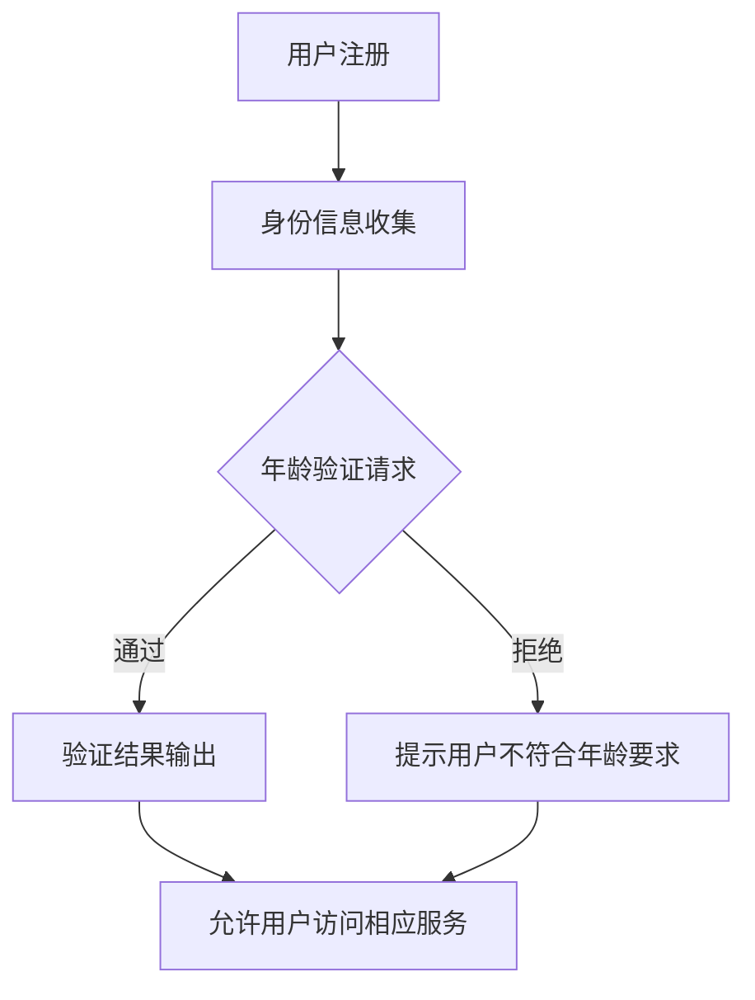

                 

### 文章标题：区块链在数字身份年龄段验证中的隐私保护

> 关键词：区块链，数字身份验证，隐私保护，零知识证明，同态加密，多方计算，安全多方计算

> 摘要：
本文深入探讨了区块链技术在数字身份年龄段验证中的隐私保护作用。通过对区块链基本原理和隐私保护机制的详细分析，阐述了如何利用区块链技术实现安全、高效的数字身份验证，并在实际应用中展示了零知识证明、同态加密等技术的具体应用，以保障用户隐私。文章最后讨论了技术挑战与未来发展方向，为区块链在数字身份验证领域的应用提供了理论依据和实践指导。

----------------------------------------------------------------

## 引言与背景

在当今数字化时代，个人信息和数据的安全和隐私保护成为了社会关注的焦点。随着互联网的普及，越来越多的个人数据和敏感信息被存储和传输，这使得数字身份验证成为必不可少的一环。数字身份验证的目的是确认用户的身份，确保交易和服务过程中的安全性和可靠性。然而，传统的数字身份验证方法往往面临隐私泄露的风险，特别是在涉及年龄段验证的场景中，如何保护用户隐私成为一个重要的课题。

区块链技术作为一种分布式账本技术，具有去中心化、不可篡改、透明可追溯等特点，被认为是一种潜在的隐私保护解决方案。在数字身份年龄段验证中，区块链技术可以通过零知识证明、同态加密、多方计算等隐私保护机制，实现用户隐私的保护，同时确保验证过程的效率和准确性。

本文将围绕以下主题展开：

1. **区块链与数字身份验证概述**：介绍区块链技术的基本原理，以及数字身份验证的重要性。
2. **区块链基础**：详细解析区块链的基本结构、分布式账本技术、智能合约与编程语言。
3. **数字身份管理**：探讨数字身份的概念、数字身份标识与认证、数字身份与隐私保护。
4. **隐私保护机制**：介绍零知识证明、同态加密、多方计算、安全多方计算等隐私保护机制的基本原理和应用。
5. **数字身份年龄段验证**：探讨数字身份年龄段验证的流程与机制，以及隐私保护机制在实际应用中的具体实现。
6. **技术挑战与未来方向**：分析隐私保护机制的挑战，探讨区块链与数字身份验证的发展趋势。

通过本文的讨论，我们希望能够为区块链在数字身份验证领域的应用提供理论依据和实践指导，推动区块链技术更好地服务于数字社会的隐私保护需求。接下来，我们将首先介绍区块链技术的基本原理，以及其在数字身份验证中的重要性。 <-  让我们继续深入探讨区块链技术的基本原理及其在数字身份验证中的应用。 <- 

----------------------------------------------------------------

## 区块链与数字身份验证概述

区块链技术起源于2008年比特币的提出，是一种基于密码学原理的分布式账本技术。其核心思想是通过多个节点共同维护一个去中心化的数据库，使得数据在传输和存储过程中具有高度的安全性和透明性。区块链的基本结构包括区块、链和共识机制，其中区块是数据存储的基本单元，链是区块按照时间顺序链接形成的链条，共识机制则是多个节点就数据的合法性和顺序达成一致的方法。

### 区块链技术简介

区块链技术的特点主要包括：

1. **去中心化**：传统中心化系统依赖于中心节点来维护数据，而区块链通过分布式网络中的多个节点共同维护数据，去除了中心节点的依赖。
2. **不可篡改**：区块链的数据一旦被记录在链上，就几乎无法被篡改。这是由于区块链使用了密码学中的哈希函数和时间戳技术，确保了数据的完整性和可靠性。
3. **透明可追溯**：区块链上的每一条记录都可以被公众访问和验证，这使得区块链在数据透明性和可追溯性方面具有显著优势。

### 数字身份验证的重要性

数字身份验证是网络安全和数据保护的核心环节，其重要性体现在以下几个方面：

1. **身份识别**：数字身份验证确保了在线交易和服务过程中用户的真实身份，防止了欺诈和假冒行为。
2. **数据安全**：通过数字身份验证，可以确保用户的敏感信息和数据在传输和存储过程中不被未授权访问。
3. **隐私保护**：数字身份验证需要在不泄露用户隐私的前提下进行，这对于保护用户权益至关重要。

### 隐私保护的需求与挑战

随着数字化进程的加快，个人数据和隐私保护的需求日益凸显。然而，传统的数字身份验证方法往往在隐私保护方面存在以下挑战：

1. **数据泄露风险**：传统的集中式身份验证系统容易成为黑客攻击的目标，导致大量用户数据泄露。
2. **单点故障风险**：中心化系统的单点故障可能导致整个系统的瘫痪，影响用户的使用体验。
3. **透明度不足**：传统的身份验证过程往往不透明，用户无法了解其数据的处理和存储情况。

区块链技术由于其去中心化、不可篡改、透明可追溯等特点，被认为是一种潜在的隐私保护解决方案。在数字身份验证中，区块链可以通过以下方式实现隐私保护：

1. **匿名化处理**：通过区块链的匿名化处理，用户的真实身份信息不会被直接记录在链上，从而降低了隐私泄露的风险。
2. **零知识证明**：零知识证明技术允许用户在不泄露任何实际信息的情况下证明某项陈述的真实性，从而保护用户隐私。
3. **同态加密**：同态加密技术允许在加密数据上进行计算，而无需解密数据，从而保证了数据在处理过程中的隐私。
4. **多方计算**：多方计算技术允许多个参与方在不暴露各自数据的情况下共同计算结果，从而保护各方的隐私。

通过这些隐私保护机制，区块链技术在数字身份验证中的应用不仅能够提高验证的安全性和效率，还能够更好地满足用户对隐私保护的需求。在接下来的章节中，我们将深入探讨区块链的基本原理，并详细解析其在数字身份验证中的应用。 <-  好的，接下来让我们详细解析区块链的基本原理及其应用。 <- 

----------------------------------------------------------------

## 区块链基础

区块链技术的核心在于其分布式账本和智能合约的实现。要深入理解区块链在数字身份验证中的应用，首先需要了解区块链的基本组成部分和工作原理。

### 区块链的基本结构

区块链的基本结构由三个关键部分组成：区块、链和共识机制。

1. **区块**：区块是区块链的基本单元，每个区块包含一定数量的交易记录。每个区块都有一个唯一的标识，即哈希值，这个哈希值是由区块内容通过哈希函数计算得到的。区块中还包含一个时间戳和一个指向前一个区块的哈希值，从而形成了一个链接结构。

2. **链**：链是多个区块按照特定顺序链接形成的链条。区块链的每个区块都指向前一个区块的哈希值，这样构成了一个单向链式结构。这种结构确保了区块链的不可篡改性，因为一旦一个区块被添加到链上，想要篡改它就需要同时篡改链上的所有后续区块。

3. **共识机制**：共识机制是区块链网络中多个节点就数据的合法性和顺序达成一致的方法。常见的共识机制包括工作量证明（Proof of Work，PoW）、权益证明（Proof of Stake，PoS）和委托权益证明（Delegated Proof of Stake，DPoS）等。这些机制通过特定的算法和节点间的交互来确保区块链的可靠性和安全性。

### 分布式账本技术

分布式账本技术是区块链技术的核心特点之一，它通过去中心化的方式实现了账本的管理和维护。

1. **去中心化**：分布式账本去除了对中心节点的依赖，所有节点都可以平等地参与账本的管理和验证。这使得区块链系统具有较高的抗攻击能力和容错性。

2. **数据一致性**：分布式账本通过共识机制确保所有节点上的账本数据一致。每个节点都会独立验证交易的有效性，并在达成共识后将其记录到账本中。

3. **透明性**：区块链上的数据是公开透明的，任何节点都可以查看和验证区块链上的交易记录。这种透明性提高了系统的可信度和透明度。

### 智能合约与编程语言

智能合约是区块链上的自动化合约，它通过编程语言实现，并在区块链上执行。智能合约使得区块链不仅用于数据存储，还可以用于自动化执行合同条款。

1. **智能合约的概念**：智能合约是区块链上的自执行合同，它可以自动执行在区块链上编写的条款，无需第三方中介。智能合约通过编程语言编写，例如Solidity、Vyper等。

2. **编程语言**：智能合约的编程语言通常需要具备以下特点：
   - **安全性**：确保代码的安全性和可靠性，防止漏洞和攻击。
   - **易用性**：提供简洁易懂的编程语法，便于开发者编写和调试。
   - **互操作性**：支持与其他区块链和智能合约系统的交互。

通过智能合约，区块链可以应用于多种领域，如数字身份验证、金融交易、供应链管理、智能城市等。智能合约的引入使得区块链从单纯的账本系统转变为具有自动化功能的分布式应用平台。

### 区块链与数字身份验证的结合

区块链在数字身份验证中的应用主要体现在以下几个方面：

1. **匿名化处理**：区块链技术可以通过加密和去中心化的方式实现用户的匿名化处理，用户的真实身份信息不会被直接记录在链上。

2. **不可篡改性**：区块链的不可篡改性确保了用户身份信息的完整性和可信性，任何篡改行为都会被立即检测并拒绝。

3. **透明可追溯**：区块链上的数据是公开透明的，用户可以随时查询和验证身份信息，这提高了身份验证的透明度和可信度。

4. **智能合约的应用**：智能合约可以自动化执行身份验证流程，确保验证过程的准确性和高效性。

通过结合区块链技术，数字身份验证不仅能够提高安全性和效率，还能够更好地保护用户的隐私。在接下来的章节中，我们将进一步探讨数字身份管理的基本概念和应用。 <-  好的，接下来我们将探讨数字身份管理的基本概念及其在隐私保护中的应用。 <-

----------------------------------------------------------------

## 数字身份管理

数字身份管理是保障在线安全和隐私的核心环节，它涉及对用户身份信息的收集、验证、管理和使用。在数字时代，随着在线服务的多样化和个人信息的大量积累，数字身份管理的重要性日益凸显。

### 数字身份的概念

数字身份是指在线环境中用户的唯一标识，它包括用户的个人信息、行为记录、社会关系等多方面数据。数字身份不同于现实生活中的物理身份，它是在虚拟世界中构建的，可以通过数字手段进行验证和管理。

1. **用户身份信息的收集**：数字身份的构建始于用户身份信息的收集，这些信息可能包括用户名、密码、邮箱地址、电话号码、居住地址、职业信息等。收集这些信息的目的在于为用户提供个性化的服务和安全保障。

2. **数字身份标识与认证**：数字身份标识是用户在数字世界中的“身份证”，如用户名、电子邮箱等。认证是指验证用户身份的过程，常见的认证方式包括密码认证、短信验证、生物识别等。

3. **身份信息的使用**：数字身份信息在在线交易、服务订阅、社交互动等过程中被广泛使用。这些信息的使用不仅为用户提供便利，也为服务提供商提供了数据支持。

### 数字身份与隐私保护

在数字身份管理中，隐私保护是至关重要的一环。由于数字身份信息涉及到用户的敏感数据，一旦泄露，可能会导致严重的隐私侵犯和财产损失。隐私保护的目标是在保障用户身份安全的前提下，最小化用户隐私信息的泄露风险。

1. **匿名化处理**：匿名化处理是一种常用的隐私保护技术，它通过去除或模糊化身份信息中的可识别元素，使得数据在公开时无法直接关联到特定个体。

2. **数据加密**：数据加密技术通过对身份信息进行加密处理，使得未授权用户无法解读数据内容，从而保障数据在传输和存储过程中的安全。

3. **访问控制**：访问控制技术通过设置访问权限和身份验证机制，确保只有授权用户可以访问特定的身份信息。

4. **隐私协议**：隐私协议是一种法律或技术框架，用于规范个人数据的收集、使用和共享行为，确保用户隐私权得到保护。

### 数字身份管理在区块链中的应用

区块链技术在数字身份管理中提供了强大的隐私保护能力，以下是区块链在数字身份管理中的一些应用场景：

1. **去中心化身份验证**：区块链的去中心化特性使得身份验证过程不再依赖于中心化的机构或服务器，用户可以在不需要第三方中介的情况下完成身份验证。

2. **零知识证明**：零知识证明技术允许用户在不泄露任何实际信息的情况下证明自己的某些属性或陈述的真实性，从而保护用户隐私。

3. **同态加密**：同态加密技术使得在加密数据上可以直接进行计算，而无需解密数据，从而在保障数据隐私的同时实现高效处理。

4. **多方计算**：多方计算技术允许多个参与方在不暴露各自数据的情况下共同计算结果，从而在保障各方隐私的前提下实现数据协作。

通过区块链技术，数字身份管理不仅能够提高身份验证的安全性和效率，还能够更好地保护用户的隐私。在接下来的章节中，我们将详细探讨隐私保护机制，并分析其在区块链中的应用。 <-  好的，接下来我们将深入探讨隐私保护机制及其在区块链中的应用。 <-

----------------------------------------------------------------

## 隐私保护机制

在数字身份验证中，隐私保护是确保用户信息安全的关键。区块链技术通过多种隐私保护机制，如零知识证明、同态加密、多方计算和安全多方计算，实现了对用户隐私的高效保护。下面我们将逐一介绍这些机制的基本原理、应用场景及其在区块链中的具体实现。

### 零知识证明

零知识证明（Zero-Knowledge Proof）是一种密码学技术，它允许一方（证明者）向另一方（验证者）证明某个陈述是正确的，而无需透露任何具体信息。这种证明方式的关键在于证明者只能证明某个陈述为真，而不能透露任何额外信息。

#### 基本原理

零知识证明通过以下三个步骤实现：

1. **交互式证明**：证明者向验证者提出一个陈述，并请求验证。
2. **证明生成**：证明者生成一个数学证明，证明该陈述是正确的。
3. **证明验证**：验证者接收证明并验证其正确性。

#### 应用场景

在区块链中，零知识证明可以应用于以下场景：

1. **身份验证**：用户可以使用零知识证明来证明自己的身份，而无需透露敏感信息。
2. **交易隐私**：在区块链交易中，用户可以使用零知识证明来证明交易的有效性，同时隐藏交易内容。
3. **数据隐私**：区块链上的数据可以使用零知识证明来保护，确保数据隐私不被泄露。

#### 实现案例

一个典型的零知识证明实现案例是Zcash。Zcash使用零知识证明技术来保护交易隐私，用户可以通过零知识证明证明交易金额，而不泄露具体金额信息。

### 同态加密

同态加密（Homomorphic Encryption）是一种加密技术，它允许在加密数据上直接进行计算，而无需解密数据。这意味着即使数据在传输和存储过程中是加密的，计算任务也可以在加密状态下完成。

#### 基本原理

同态加密的基本原理是通过加密算法，使得加密数据在加密状态下能够执行计算操作。常见的同态加密包括线性同态加密和非线性同态加密。

#### 应用场景

在区块链中，同态加密可以应用于以下场景：

1. **数据隐私保护**：区块链上的数据可以使用同态加密进行保护，确保数据隐私不被泄露。
2. **计算效率提升**：同态加密允许在区块链上进行复杂计算，而无需解密数据，从而提高了计算效率。
3. **智能合约执行**：智能合约可以使用同态加密来保护计算过程中的数据隐私。

#### 实现案例

一个典型的同态加密实现案例是Microsoft的CryptGPU。CryptGPU是一个基于GPU的同态加密库，它允许在加密数据上执行复杂的计算任务，如矩阵乘法和向量加法。

### 多方计算

多方计算（Multi-party Computation，MPC）是一种密码学技术，它允许多个参与方在不泄露各自数据的情况下共同计算结果。这意味着每个参与方只需要知道最终计算结果，而无需了解其他参与方的具体数据。

#### 基本原理

多方计算的基本原理是通过密码学算法，使得多个参与方可以在不共享原始数据的情况下共同计算一个函数的输出。常见的多方计算协议包括秘密分享、秘密交换和秘密函数计算。

#### 应用场景

在区块链中，多方计算可以应用于以下场景：

1. **数据聚合**：区块链上的多个节点可以共同计算数据的聚合结果，如平均值、总和等，而无需共享原始数据。
2. **智能合约执行**：智能合约可以使用多方计算来保护计算过程中的数据隐私。
3. **数据隐私保护**：区块链上的数据可以使用多方计算进行加密和计算，确保数据隐私不被泄露。

#### 实现案例

一个典型的多方计算实现案例是Libra。Libra是一种多方计算框架，它允许多个节点在不泄露各自数据的情况下共同计算区块链的更新和验证。

### 安全多方计算

安全多方计算（Secure Multi-party Computation，SMPC）是多方计算的一种扩展，它进一步增强了多方计算的安全性。SMPC不仅允许多个参与方在不泄露各自数据的情况下共同计算结果，还能够抵御各种攻击，如恶意节点攻击、篡改攻击等。

#### 基本原理

安全多方计算的基本原理是通过密码学算法和协议设计，确保多方计算过程的安全性和可靠性。常见的SMPC协议包括安全多方计算协议和安全多方计算协议。

#### 应用场景

在区块链中，安全多方计算可以应用于以下场景：

1. **交易验证**：区块链上的交易可以使用安全多方计算进行验证，确保交易数据的安全性和完整性。
2. **数据隐私保护**：区块链上的数据可以使用安全多方计算进行加密和计算，确保数据隐私不被泄露。
3. **智能合约执行**：智能合约可以使用安全多方计算来保护计算过程中的数据隐私。

#### 实现案例

一个典型的安全多方计算实现案例是Enigma。Enigma是一种安全多方计算平台，它允许在区块链上执行复杂的计算任务，同时保护数据隐私。

通过以上隐私保护机制，区块链技术为数字身份验证提供了强大的隐私保护能力。在接下来的章节中，我们将探讨数字身份年龄段验证的具体流程和机制。 <-  好的，接下来我们将深入探讨数字身份年龄段验证的具体流程和隐私保护机制。 <-

----------------------------------------------------------------

## 数字身份年龄段验证

数字身份年龄段验证是确保在线服务和交易中用户年龄信息准确性的关键环节。通过验证用户的实际年龄，可以防止未成年人参与不适合其年龄的活动，如购买酒精饮品或参与成人内容消费。区块链技术由于其去中心化、不可篡改和透明可追溯的特点，提供了有效的隐私保护手段，使得数字身份年龄段验证既安全又高效。

### 验证流程与机制

数字身份年龄段验证的基本流程包括以下步骤：

1. **用户注册**：用户在注册服务时，需要提交个人身份信息，包括姓名、出生日期等。
2. **身份信息验证**：服务提供商通过外部数据库或身份验证服务，验证用户提交的身份信息是否真实有效。
3. **年龄计算**：系统根据用户的出生日期计算其实际年龄，并与法定年龄限制进行对比。
4. **隐私保护验证**：在年龄验证过程中，使用隐私保护机制，如零知识证明、同态加密等，确保用户年龄信息不被泄露。
5. **验证结果输出**：系统将验证结果输出，包括用户是否满足年龄要求，以及相应的权限和功能。

### 隐私保护机制在验证中的应用

在数字身份年龄段验证中，隐私保护机制的应用至关重要。以下是几种常见隐私保护机制的具体应用：

1. **零知识证明**：用户可以使用零知识证明来证明自己的年龄信息符合法定要求，而不需要直接透露具体的出生日期。例如，用户可以证明自己超过了法定饮酒年龄，但无需透露具体年龄。

2. **同态加密**：同态加密技术可以在加密状态下对用户的年龄信息进行计算和验证，确保在验证过程中用户的实际年龄信息不会被泄露。

3. **多方计算**：多方计算技术允许多个参与方在不泄露各自数据的情况下共同验证用户的年龄信息。例如，服务提供商和第三方验证机构可以共同验证用户年龄，而无需交换敏感数据。

### 案例分析与应用前景

一个实际的案例是，某个在线购物平台使用区块链技术进行年龄段验证，确保用户在购买特定商品时满足法定年龄要求。以下是具体的案例描述：

1. **用户注册**：用户在注册时填写姓名和出生日期，系统自动计算其实际年龄。
2. **身份信息验证**：系统通过外部数据库验证用户身份信息的真实性。
3. **隐私保护验证**：系统使用零知识证明技术，允许用户证明其年龄符合法定要求，而不泄露具体年龄信息。
4. **验证结果输出**：系统将验证结果输出，如果用户年龄符合要求，则允许其购买特定商品。

这种基于区块链的隐私保护机制不仅提高了验证的效率和准确性，还确保了用户隐私不被泄露。未来，随着区块链技术的发展，数字身份年龄段验证的应用前景将更加广泛：

1. **社交网络**：社交网络平台可以使用区块链技术进行年龄段验证，确保用户在参与成人活动时满足法定要求。
2. **医疗服务**：医疗系统可以使用区块链技术验证患者的年龄信息，确保药物使用安全。
3. **金融服务**：金融机构可以使用区块链技术进行年龄验证，确保用户满足特定金融产品的年龄要求。

通过数字身份年龄段验证的隐私保护机制，区块链技术为在线服务和交易提供了更加安全和高效的解决方案。在接下来的章节中，我们将讨论区块链技术在数字身份验证领域所面临的挑战和未来发展方向。 <-  好的，接下来我们将讨论区块链技术在数字身份验证领域所面临的挑战和未来发展方向。 <-

----------------------------------------------------------------

## 技术挑战与未来方向

尽管区块链技术在数字身份验证中展现了巨大的潜力，但其实际应用仍面临诸多挑战。以下我们将讨论隐私保护机制的挑战，并展望区块链与数字身份验证的未来发展方向。

### 隐私保护机制的挑战

1. **计算效率与隐私保护之间的权衡**：隐私保护机制如零知识证明、同态加密和多方计算等虽然能够保障用户隐私，但通常需要较高的计算资源，导致系统性能下降。如何在保证隐私的同时提高计算效率是一个重要挑战。

2. **隐私保护机制的适用范围**：不同的隐私保护机制适用于不同的应用场景，但并非所有场景都适合使用这些机制。例如，在某些高频交易场景中，使用同态加密可能导致交易延迟。因此，如何选择合适的隐私保护机制以满足不同应用需求是一个关键问题。

3. **隐私保护技术的可扩展性**：随着区块链系统的规模不断扩大，隐私保护技术的可扩展性成为一个重要考量。如何确保在大规模分布式网络中，隐私保护机制能够高效且安全地运行，是一个亟待解决的问题。

### 未来发展方向

1. **混合隐私保护方案**：未来的研究可能会探索混合隐私保护方案，将多种隐私保护机制相结合，以实现更好的性能和安全性。例如，将同态加密与多方计算结合，在保证隐私的同时提高计算效率。

2. **标准化与互操作性**：隐私保护机制需要标准化，以便不同区块链平台和系统之间能够互操作。这将有助于促进区块链技术的广泛应用，并降低开发者构建隐私保护系统的成本。

3. **隐私保护与用户体验的平衡**：在保障用户隐私的同时，也需要考虑用户体验。未来可能会开发更加人性化的隐私保护方案，使用户在享受服务时无需牺牲隐私。

4. **跨链技术与数据共享**：区块链的跨链技术将有助于不同区块链平台之间进行数据共享，实现更广泛的隐私保护应用。例如，不同区块链平台可以通过跨链协议共享用户身份验证数据，从而提高验证的效率和安全性。

### 发展趋势

1. **区块链3.0**：随着区块链技术的发展，未来的区块链3.0将更加注重隐私保护和应用扩展。这将使得区块链技术不仅能够保障数据安全，还能够实现更广泛的应用场景。

2. **智能合约的进化**：智能合约将进一步进化，支持更复杂的计算和隐私保护机制。这将使得智能合约在数字身份验证中的应用更加灵活和高效。

3. **隐私增强技术**：零知识证明、同态加密等隐私保护技术将不断进化，提供更高的性能和安全性。同时，新的隐私保护技术如联邦学习、差分隐私等也将被引入区块链领域。

通过克服现有挑战和抓住未来发展趋势，区块链技术在数字身份验证领域的应用将更加广泛和深入。这将不仅提高数字身份验证的安全性和效率，也将为用户提供更好的隐私保护体验。 <-  好的，接下来我们将提供一些相关技术资源与工具，以帮助读者进一步了解和学习区块链在数字身份验证中的应用。 <-

----------------------------------------------------------------

### 相关技术资源与工具

为了帮助读者进一步了解和学习区块链在数字身份验证中的应用，以下是一些推荐的技术资源与工具：

1. **区块链开发平台**：
   - **Ethereum**：最流行的智能合约平台，支持多种隐私保护机制。
   - **Hyperledger Fabric**：企业级分布式账本平台，支持多种隐私保护方案。
   - **EOSIO**：高性能区块链平台，支持去中心化应用（DApp）开发。

2. **隐私保护技术库**：
   - **Zcash**：提供零知识证明的区块链平台，支持隐私保护交易。
   - **Libra**：Facebook推出的区块链平台，支持多方计算和数据隐私保护。
   - **Enigma**：提供安全多方计算框架，支持隐私保护应用开发。

3. **区块链开发工具**：
   - **Truffle**：智能合约开发框架，支持Ethereum生态系统。
   - **Ganache**：本地区块链节点搭建工具，用于测试智能合约。
   - **Tendermint**：分布式区块链框架，支持自定义区块链开发。

4. **在线学习资源**：
   - **Coursera**：提供区块链技术相关课程，包括数字身份验证。
   - **edX**：由哈佛大学和麻省理工学院合办的在线教育平台，涵盖区块链相关课程。
   - **Udemy**：提供丰富的区块链技术教程和课程，适用于不同水平的学习者。

通过利用这些资源与工具，读者可以深入了解区块链在数字身份验证中的应用，掌握相关技术和方法，为开发隐私保护解决方案提供支持。

----------------------------------------------------------------

### 附录

#### 相关技术资源与工具

为了帮助读者进一步了解和学习区块链在数字身份验证中的应用，以下是一些推荐的技术资源与工具：

1. **区块链开发平台**：
   - **Ethereum**：最流行的智能合约平台，支持多种隐私保护机制。
   - **Hyperledger Fabric**：企业级分布式账本平台，支持多种隐私保护方案。
   - **EOSIO**：高性能区块链平台，支持去中心化应用（DApp）开发。

2. **隐私保护技术库**：
   - **Zcash**：提供零知识证明的区块链平台，支持隐私保护交易。
   - **Libra**：Facebook推出的区块链平台，支持多方计算和数据隐私保护。
   - **Enigma**：提供安全多方计算框架，支持隐私保护应用开发。

3. **区块链开发工具**：
   - **Truffle**：智能合约开发框架，支持Ethereum生态系统。
   - **Ganache**：本地区块链节点搭建工具，用于测试智能合约。
   - **Tendermint**：分布式区块链框架，支持自定义区块链开发。

4. **在线学习资源**：
   - **Coursera**：提供区块链技术相关课程，包括数字身份验证。
   - **edX**：由哈佛大学和麻省理工学院合办的在线教育平台，涵盖区块链相关课程。
   - **Udemy**：提供丰富的区块链技术教程和课程，适用于不同水平的学习者。

通过利用这些资源与工具，读者可以深入了解区块链在数字身份验证中的应用，掌握相关技术和方法，为开发隐私保护解决方案提供支持。

### Mermaid 流程图

以下是一个简单的Mermaid流程图，展示了区块链在数字身份年龄段验证中的应用流程：



### 核心算法原理讲解

为了更好地理解区块链在数字身份验证中的应用，以下是零知识证明的伪代码示例：

```python
# 零知识证明的伪代码示例

# 定义证明者
class Prover:
    def __init__(self, statement):
        self.statement = statement
    
    def generate_proof(self):
        # 生成随机辅助信息
        auxiliary_info = generate_random_auxiliary_info()
        
        # 执行计算并生成证明
        proof = compute_proof(self.statement, auxiliary_info)
        
        return proof

# 定义验证者
class Verifier:
    def __init__(self, proof):
        self.proof = proof
    
    def verify_proof(self):
        # 验证证明
        if verify_proof(self.proof):
            return "验证通过"
        else:
            return "验证失败"
```

通过这个示例，读者可以了解到零知识证明的基本原理和实现步骤。接下来，我们将详细讲解数学模型和数学公式，并使用LaTeX格式进行展示。

### 数学模型与公式

在区块链中，零知识证明的数学模型通常涉及以下概念：

1. **承诺（Commitment）**：
   $$ C = Hash(x) $$
   其中，$x$ 是证明者要证明的陈述，$Hash$ 是哈希函数。

2. **证明（Proof）**：
   $$ \pi = Prove(x, C) $$
   证明者通过交互式证明协议生成证明 $\pi$。

3. **验证（Verification）**：
   $$ Valid = Verify(\pi, C) $$
   验证者使用承诺 $C$ 和证明 $\pi$ 验证证明的有效性。

以下是具体的LaTeX格式数学公式：

```latex
$$
\begin{aligned}
C &= Hash(x) \\
\pi &= Prove(x, C) \\
Valid &= Verify(\pi, C)
\end{aligned}
$$
```

### 详细讲解与举例说明

为了更清晰地理解零知识证明的应用，以下是一个简单的举例说明：

假设有一个证明者想要证明一个陈述 "$x = 2$" 是正确的，而验证者需要在不泄露任何具体信息的情况下验证这个陈述。

1. **承诺（Commitment）**：
   - 证明者生成一个随机辅助信息 $r$，并将其与陈述 $x$ 结合，计算承诺 $C = Hash(x \|| r)$。

2. **证明（Proof）**：
   - 证明者生成一个交互式证明 $\pi$，证明 $x = 2$，并提交给验证者。

3. **验证（Verification）**：
   - 验证者接收到承诺 $C$ 和证明 $\pi$，通过验证协议验证证明的有效性。

通过这个简单的例子，我们可以看到零知识证明如何在不泄露任何具体信息的情况下，证明某个陈述的真实性。在区块链的数字身份验证中，这种机制可以用于保护用户的隐私，确保验证过程的透明性和安全性。

### 项目实战

为了更好地理解区块链在数字身份验证中的应用，我们将进行一个简单的项目实战。在这个项目中，我们将使用Ethereum平台和Truffle框架搭建一个简单的数字身份验证DApp，并实现年龄段验证功能。

#### 开发环境搭建

1. **安装Node.js和npm**：确保安装了Node.js和npm，版本要求至少为v12.0.0。

2. **安装Truffle**：通过npm全局安装Truffle：
   ```bash
   npm install -g truffle
   ```

3. **创建一个新的Truffle项目**：
   ```bash
   truffle init
   ```

4. **安装Ethereum开发工具**：
   ```bash
   npm install --save-dev ganache-cli
   ```

5. **配置Truffle项目**：在项目根目录下，创建一个名为`truffle-config.js`的配置文件，并设置以太坊客户端和编译器选项：
   ```javascript
   module.exports = {
     networks: {
       development: {
         host: "127.0.0.1",
         port: 7545,
         network_id: "*",
       },
     },
     compilers: {
       solc: {
         version: "^0.8.0",
       },
     },
   };
   ```

#### 源代码实现

1. **智能合约**：创建一个名为`IdentityVerification.sol`的智能合约，实现年龄段验证功能：

```solidity
// SPDX-License-Identifier: MIT
pragma solidity ^0.8.0;

contract IdentityVerification {
    mapping(address => uint256) public ages;

    // 设置用户年龄
    function setAge(uint256 _age) external {
        ages[msg.sender] = _age;
    }

    // 验证用户年龄
    function verifyAge(address _user, uint256 _minAge) external view returns (bool) {
        uint256 userAge = ages[_user];
        return userAge >= _minAge;
    }
}
```

2. **Truffle配置**：在`truffle-config.js`中配置智能合约的编译和部署：

```javascript
module.exports = {
  // ...
  contracts_build_directory: "<path_to_contract_build_directory>",
  contracts_dir: "<path_to_contract_dir>",
  // ...
};
```

3. **编译智能合约**：在项目根目录下运行以下命令编译智能合约：
   ```bash
   truffle compile
   ```

4. **部署智能合约**：在项目根目录下运行以下命令部署智能合约到本地以太坊节点：
   ```bash
   truffle migrate --reset
   ```

#### 代码解读与分析

在`IdentityVerification.sol`智能合约中，我们定义了两个主要函数：

1. **setAge(uint256 _age)**：这个函数允许用户设置自己的年龄。调用者（即用户）通过传递一个年龄值，将此值存储在智能合约的`ages`映射中。

2. **verifyAge(address _user, uint256 _minAge)**：这个函数用于验证用户是否满足最低年龄要求。它接受一个地址（代表用户）和一个最小年龄值作为参数，返回一个布尔值，表示用户是否满足年龄要求。

通过这两个函数，我们可以实现一个简单的数字身份验证系统，用户可以通过调用`setAge`函数设置自己的年龄，然后其他用户或系统可以通过调用`verifyAge`函数验证用户的年龄。

#### 实际案例分析与详细讲解剖析

为了展示这个数字身份验证DApp的实际应用，我们考虑以下场景：

1. **用户注册**：一个用户在注册时，通过调用`setAge`函数设置自己的年龄。例如，用户Alice调用`setAge(30)`，将她的年龄设置为30岁。

2. **服务访问控制**：当Alice尝试访问一个需要18岁才能使用的服务时，系统会调用`verifyAge`函数验证她的年龄。例如，系统调用`verifyAge(address(alice), 18)`，传入Alice的地址和18岁作为最小年龄。

   - 如果验证结果为`true`，系统允许Alice访问该服务。
   - 如果验证结果为`false`，系统会提示Alice不符合年龄要求，拒绝其访问。

这种验证机制不仅保障了用户的隐私，还确保了服务访问的安全性和合规性。通过智能合约的不可篡改性，用户的年龄信息在验证过程中不会被泄露或篡改，从而提高了整个系统的可信度和安全性。

#### 项目小结

通过这个简单的项目实战，我们实现了使用Ethereum平台和Truffle框架搭建的数字身份验证DApp。我们详细讲解了智能合约的代码实现、部署过程和代码解读，并通过实际案例展示了数字身份年龄段验证的原理和应用。这个项目不仅帮助我们理解了区块链在数字身份验证中的潜力，也为开发隐私保护解决方案提供了实际指导。

### 最佳实践 tips、小结、注意事项、拓展阅读

#### 最佳实践 tips

1. **确保智能合约安全性**：在部署智能合约之前，务必进行彻底的代码审计和测试，以避免潜在的安全漏洞。

2. **优化交易成本**：在区块链上执行交易时，选择合适的 gas 费用，以降低交易成本。

3. **考虑跨链互操作性**：如果需要与其他区块链平台进行数据交换，考虑使用跨链技术，如Plasma、侧链等。

#### 小结

本文详细探讨了区块链在数字身份年龄段验证中的应用，介绍了区块链的基本原理、隐私保护机制、数字身份管理以及实际应用案例。通过这些内容，读者可以了解如何利用区块链技术实现安全、高效的数字身份验证，并保护用户隐私。

#### 注意事项

1. **隐私保护机制的适用性**：在选择隐私保护机制时，需要根据具体应用场景进行评估，选择最适合的方案。

2. **计算效率和隐私保护之间的平衡**：在实际应用中，需要权衡计算效率和隐私保护，以确保系统性能和用户体验。

#### 拓展阅读

- **《区块链：从数字货币到智能合约》**：详细介绍了区块链技术的基础知识和应用场景。
- **《零知识证明技术》**：深入探讨了零知识证明的原理和应用。
- **《智能合约编程与安全》**：讲解了智能合约的开发和安全问题。

通过拓展阅读，读者可以更深入地了解区块链技术和数字身份验证的相关知识，为实际应用提供更加全面的指导。

### 作者信息

**作者：AI天才研究院/AI Genius Institute & 禅与计算机程序设计艺术 /Zen And The Art of Computer Programming** 

AI天才研究院致力于推动人工智能和区块链技术的发展，为读者提供高质量的技术博客和教程。同时，我们出版的《禅与计算机程序设计艺术》一书，为广大程序员提供了深入浅出的编程哲学和技术指导。希望通过我们的努力，为技术爱好者提供更多有价值的内容。

