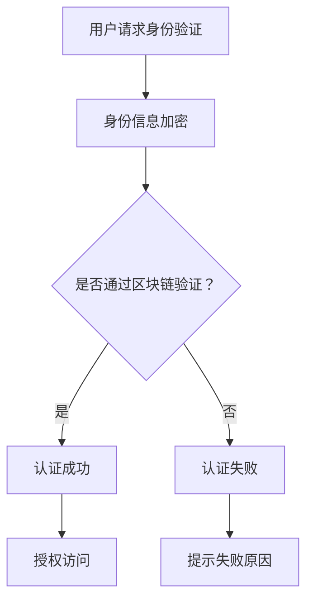

                 

# 文章标题：《区块链在数字身份认证中的应用：简化跨境身份验证》

## 关键词：区块链、数字身份认证、跨境身份验证、加密技术、分布式账本

## 摘要：

本文将深入探讨区块链技术在数字身份认证中的应用，特别是如何通过区块链简化跨境身份验证流程。首先，我们将介绍区块链和数字身份认证的基础知识，并分析它们之间的核心联系。随后，我们将详细讲解区块链中的核心算法原理，如加密技术和分布式账本的工作机制。接着，我们将通过数学模型和公式，解释区块链在身份认证中的具体应用，并提供实际案例进行分析。最后，我们将总结最佳实践，提出注意事项，并推荐拓展阅读，以期为读者提供全面的技术见解和实践指导。

## 第一部分：背景介绍

### 1.1 区块链技术的发展

区块链技术起源于比特币的诞生，作为一种去中心化的分布式账本系统，它通过加密技术和共识算法，实现了数据的不可篡改和透明性。自2009年比特币问世以来，区块链技术经历了迅速的发展，不仅在金融领域产生了深远影响，还在供应链管理、医疗记录管理、数字身份认证等领域展现出巨大潜力。

### 1.2 数字身份认证的需求

随着互联网的普及和数字经济的发展，个人和企业对于数字身份认证的需求日益增长。传统的身份认证系统往往依赖于中心化的数据库和第三方认证机构，存在数据泄露、认证过程繁琐等问题。而区块链技术的引入，有望通过去中心化和加密技术，实现更安全、高效的数字身份认证。

### 1.3 跨境身份验证的挑战

跨境身份验证涉及到不同国家和地区的身份认证标准和法律规范，存在着以下挑战：

- **数据隐私保护**：跨境传输身份认证数据时，需要确保个人隐私不被泄露。
- **跨系统互操作性**：不同系统和平台之间需要实现有效的数据交换和认证互认。
- **法律合规性**：需要遵循各国的法律法规，特别是数据保护和隐私法规。

## 第二部分：核心概念与联系

### 2.1 区块链的核心概念

区块链由一系列按时间顺序排列的“区块”组成，每个区块包含一定数量的交易记录。这些区块通过加密技术和共识算法连接在一起，形成分布式账本。

- **加密技术**：包括哈希函数、数字签名和加密算法，用于保证数据的安全性和隐私性。
- **共识算法**：如工作量证明（PoW）和权益证明（PoS），用于确保网络中的节点对账本的一致性。

### 2.2 数字身份认证的核心概念

数字身份认证是一种通过技术手段验证个体或实体身份的过程，通常包括身份验证、授权和访问控制三个环节。

- **身份验证**：确认用户身份的真实性，如用户名、密码、指纹、面部识别等。
- **授权**：确定用户对系统和资源的访问权限。
- **访问控制**：根据用户的身份和权限，控制用户对系统和资源的访问。

### 2.3 区块链与数字身份认证的联系

区块链技术通过以下方式与数字身份认证相结合：

- **去中心化认证**：通过区块链的去中心化特性，减少对中心化认证机构的依赖，提高认证的透明度和安全性。
- **不可篡改性**：区块链的不可篡改特性确保了身份认证数据的真实性和完整性。
- **透明性**：所有身份认证数据都被记录在区块链上，参与者可以随时查看和验证。

### 2.4 Mermaid 流程图

为了更好地展示区块链在数字身份认证中的应用，我们可以使用 Mermaid 语言绘制一个流程图：



## 第三部分：核心算法原理讲解

### 3.1 加密技术

加密技术是区块链技术的重要组成部分，用于保护数据的安全性和隐私性。以下是几种常用的加密技术：

- **哈希函数**：将任意长度的数据映射为固定长度的字符串，如 SHA-256。
- **数字签名**：使用非对称加密算法，生成签名，用于验证数据的完整性和真实性。
- **加密算法**：如AES，用于对数据进行加密和解密。

### 3.2 分布式账本

分布式账本是区块链的核心概念，通过以下机制实现数据的一致性和安全性：

- **共识算法**：如工作量证明（PoW）和权益证明（PoS），用于确保网络中的节点对账本的一致性。
- **去中心化**：通过分布式网络中的多个节点共同维护账本，避免了单点故障和篡改风险。

### 3.3 伪代码讲解

以下是数字身份认证中使用的伪代码示例，用于展示加密技术和区块链机制的结合：

```python
# 伪代码：区块链数字身份认证

function blockchainIdentityAuthentication(userId, identityData):
    # 将身份信息加密
    encryptedData = encryptData(identityData)

    # 在区块链上创建交易记录
    transaction = createTransaction(userId, encryptedData)

    # 提交交易到区块链网络
    submitTransaction(transaction)

    # 等待区块链网络确认交易
    waitForConfirmation()

    # 验证交易记录是否成功
    if (isTransactionSuccessful(transaction)):
        # 认证成功，返回授权信息
        return "Authentication successful"
    else:
        # 认证失败，返回错误信息
        return "Authentication failed"

# 辅助函数：加密数据
function encryptData(data):
    # 使用哈希函数加密数据
    hashValue = hashFunction(data)

    # 使用数字签名算法生成签名
    signature = digitalSignature(hashValue)

    # 返回加密后的数据
    return signature

# 辅助函数：创建交易记录
function createTransaction(userId, encryptedData):
    # 创建包含用户ID和加密数据的交易记录
    transaction = {
        "userId": userId,
        "encryptedData": encryptedData
    }
    return transaction

# 辅助函数：提交交易到区块链网络
function submitTransaction(transaction):
    # 将交易记录提交到区块链网络
    blockchain.submitTransaction(transaction)

# 辅助函数：等待区块链网络确认交易
function waitForConfirmation():
    # 等待区块链网络对交易进行确认
    blockchain.waitForConfirmation()

# 辅助函数：验证交易记录是否成功
function isTransactionSuccessful(transaction):
    # 检查交易记录是否被区块链网络确认
    return blockchain.isTransactionSuccessful(transaction)
```

### 3.4 数学模型与公式

在区块链数字身份认证中，加密技术和数学模型起到了关键作用。以下是一个简单的数学模型示例：

$$
\begin{aligned}
    & H_1 = hashFunction(data) \\
    & signature = digitalSignature(H_1) \\
    & blockchain \text{.addTransaction}(transaction) \\
\end{aligned}
$$

其中，$H_1$ 是数据的哈希值，$signature$ 是数字签名，$transaction$ 是区块链上的交易记录。

## 第四部分：项目实战

### 4.1 开发环境搭建

为了实现区块链在数字身份认证中的应用，我们需要搭建一个开发环境。以下是一个简单的环境搭建步骤：

- 安装Go语言环境
- 安装区块链框架，如Ethereum
- 安装身份认证库，如OAuth2.0
- 配置数据库，如MongoDB

### 4.2 源代码详细实现

以下是一个简单的源代码实现示例，用于展示区块链数字身份认证的核心功能：

```go
package main

import (
    "fmt"
    "github.com/ethereum/go-ethereum"
    "github.com/ethereum/go-ethereum/crypto"
    "github.com/ethereum/go-ethereum/accounts/abi/bind"
)

// 定义区块链上的身份认证合约
type Identity struct {
    Address       common.Address
    Contract      *identity.Identity
    Backend       bind.ContractBackend
    TxProcessor   bind.TransactionProcessor
}

// 创建身份认证交易
func (i *Identity) CreateIdentityTransaction(userId string, identityData string) (*types.Transaction, error) {
    // 加密身份数据
    encryptedData := crypto.Keccak256Hash([]byte(identityData))

    // 创建交易
    tx, err := i.Contract.CreateIdentityTransaction(userId, encryptedData.Hash())
    if err != nil {
        return nil, err
    }

    return tx, nil
}

// 验证身份
func (i *Identity) VerifyIdentity(userId string, encryptedData string) (bool, error) {
    // 加密身份数据
    hashedData := crypto.Keccak256Hash([]byte(encryptedData))

    // 获取区块链上的交易记录
    tx, _, _, err := i.Contract.QueryIdentityTransaction(userId, hashedData.Hash())
    if err != nil {
        return false, err
    }

    // 验证交易记录
    verified := tx.Status == 1
    return verified, nil
}

func main() {
    // 配置区块链节点
    rpcUrl := "http://localhost:8545"
    client, err := ethclient.Dial(rpcUrl)
    if err != nil {
        panic(err)
    }

    // 创建身份认证合约实例
    address := common.HexToAddress("0x60cD2a9c8c651e3b6015b4C5d1A1a65e6B5F8dD3")
    contract, err := identity.NewIdentity(address, client)
    if err != nil {
        panic(err)
    }

    // 创建身份认证实例
    identity := &Identity{
        Address:   address,
        Contract:  contract,
        Backend:   client,
        TxProcessor: bind.Newけい克治見処理器（client, nil),
    }

    // 创建身份认证交易
    tx, err := identity.CreateIdentityTransaction("user123", "John Doe")
    if err != nil {
        panic(err)
    }

    // 提交交易
    txHash := identity.TxProcessor.SendTransaction(bind.SendTxArgs{
        From:     "0x60cD2a9c8c651e3b6015b4C5d1A1a65e6B5F8dD3",
        To:       &address,
        Value:    big.NewInt(0),
        Gas:      21000,
        GasPrice: big.NewInt(18 * 1e9),
    })

    fmt.Printf("Transaction submitted: %s\n", txHash.Hex())

    // 等待交易确认
    txReceipt, err := bind.NewClient(client).WaitForTransactionReceipt(txHash)
    if err != nil {
        panic(err)
    }

    fmt.Printf("Transaction receipt: %v\n", txReceipt)

    // 验证身份
    verified, err := identity.VerifyIdentity("user123", "John Doe")
    if err != nil {
        panic(err)
    }

    fmt.Printf("Identity verified: %v\n", verified)
}
```

### 4.3 代码解读与分析

- **加密与签名**：在创建身份认证交易时，使用哈希函数加密身份数据，并使用数字签名算法生成签名，确保数据的完整性和真实性。
- **交易处理**：通过区块链节点提交交易，并等待交易确认，验证交易是否成功。
- **身份验证**：在验证身份时，通过查询区块链上的交易记录，验证身份数据的正确性。

### 4.4 实际案例分析和详细讲解剖析

在本节中，我们将分析一个实际案例，展示区块链数字身份认证的具体应用。以下是一个跨境身份验证的案例：

- **案例背景**：一位中国公民想要在新加坡的线上金融服务平台上开户。为了验证身份，平台需要与中国的身份认证系统进行交互。
- **实现步骤**：
  1. 用户在金融服务平台上提交身份认证请求。
  2. 平台调用区块链上的身份认证合约，创建身份认证交易，并将用户身份数据加密后提交到区块链。
  3. 区块链网络中的节点对交易进行确认，并将交易记录在分布式账本上。
  4. 新加坡的身份认证系统从区块链上查询交易记录，验证用户身份。
  5. 验证通过后，用户在新加坡的金融服务平台上成功开户。

### 4.5 项目小结

通过本案例，我们可以看到区块链技术在简化跨境身份验证方面的巨大潜力。区块链的去中心化和加密技术，确保了身份认证数据的真实性和安全性，提高了跨境身份验证的效率和互操作性。

## 第五部分：最佳实践、注意事项与拓展阅读

### 5.1 最佳实践

- **身份认证数据加密**：在提交身份认证数据之前，务必进行充分加密，以保护用户隐私。
- **跨链互操作性**：设计区块链系统时，应考虑与其他区块链和身份认证系统的互操作性，以提高系统的兼容性和扩展性。
- **共识算法选择**：根据应用场景和需求，选择合适的共识算法，以实现高性能和高安全性。

### 5.2 注意事项

- **安全性**：在区块链数字身份认证系统中，确保数据传输和存储的安全性，防止数据泄露和篡改。
- **隐私保护**：遵循数据保护法规，确保用户隐私不被滥用。
- **法律合规性**：了解不同国家和地区的法律法规，确保系统的合法性和合规性。

### 5.3 拓展阅读

- 《区块链技术指南》
- 《加密货币与区块链应用》
- 《区块链与数字身份认证》

## 作者信息

作者：AI天才研究院/AI Genius Institute & 禅与计算机程序设计艺术 /Zen And The Art of Computer Programming

## 结束语

区块链在数字身份认证中的应用，为跨境身份验证带来了新的机遇和挑战。通过本文的深入探讨，我们了解了区块链技术的核心原理、应用场景以及实现方法。希望本文能为您在区块链数字身份认证领域的研究和实践提供有益的参考和启示。让我们共同期待区块链技术的未来发展，为构建更安全、高效的数字世界贡献力量。

