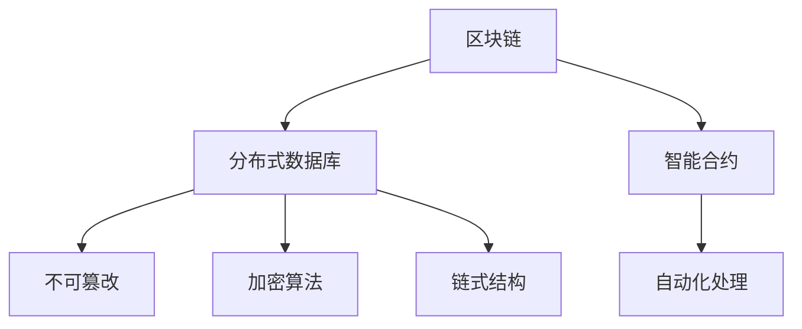
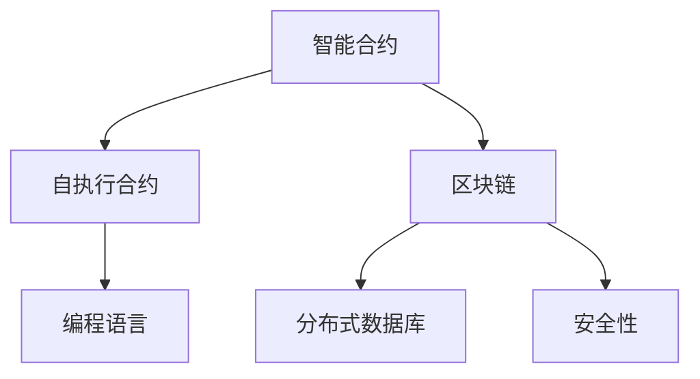
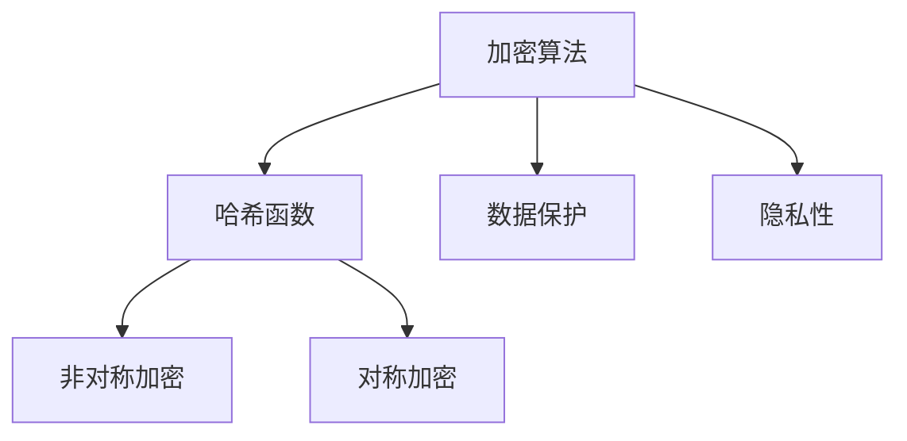
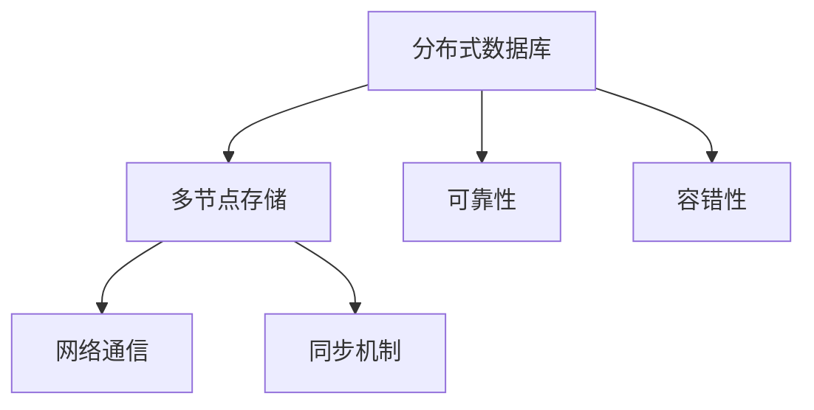
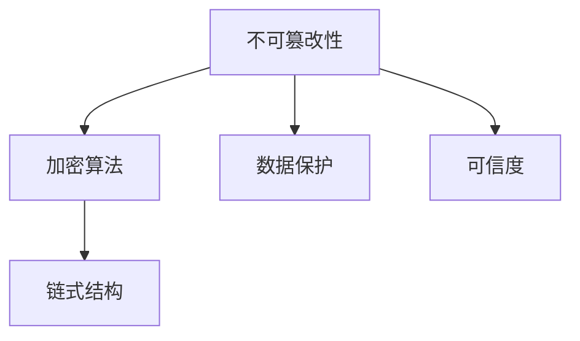

                 

### 文章标题

《区块链在选举系统中的潜在应用》

### 关键词

- 区块链
- 选举系统
- 去中心化
- 安全性
- 透明性
- 不可篡改
- 智能合约

### 摘要

本文将深入探讨区块链技术在选举系统中的应用潜力。首先，我们介绍了区块链的基本概念和特点，如去中心化、安全性、透明性以及不可篡改性。随后，我们分析了选举系统面临的挑战和问题，并探讨了区块链如何能够解决这些问题。文章通过Mermaid流程图展示了区块链在选举系统中应用的架构，接着详细讲解了核心算法原理，并使用伪代码和数学模型进行了阐述。随后，我们通过实际案例分析了区块链在选举系统中的应用效果，最后提出了最佳实践建议和小结。文章旨在为读者提供一个全面、系统的了解，激发进一步研究和应用区块链技术的兴趣。

### 背景介绍

选举系统是现代社会中不可或缺的一部分，它保证了权力的合理传递和民主的实现。然而，传统的选举系统在实际运行中面临着诸多挑战和问题。这些问题主要集中在以下几个方面：

1. **安全性问题**：传统的选举系统通常依赖于中心化的服务器和数据存储，这使得整个系统容易成为黑客攻击的目标。一旦服务器被攻击，整个选举结果可能会被篡改，导致选举的公正性受到质疑。

2. **透明性问题**：在传统的选举系统中，选票的计算和处理过程往往不透明。选民无法确认自己的选票是否被正确处理，这也可能导致选民对选举结果的不信任。

3. **不可篡改性问题**：在传统的选举系统中，一旦选票被处理，就很难确保其不可篡改性。即使有备份，这些备份也可能被篡改，从而影响选举的公正性。

4. **效率问题**：传统的选举系统在处理大量选票时，往往需要大量的人力和时间，这不仅降低了选举的效率，也增加了选举的成本。

区块链技术的出现，为解决这些问题提供了一种新的思路。区块链是一种分布式数据库技术，其去中心化、安全性、透明性和不可篡改性的特点，使得它非常适合用于解决选举系统中的问题。

去中心化：传统的选举系统依赖于中心化的服务器，这使得系统容易成为攻击的目标。而区块链通过分布式网络结构，使得数据存储和处理不再依赖于单一的中心节点，从而大大提高了系统的安全性。

安全性：区块链采用加密算法来保护数据的安全性。在区块链中，每次交易或操作都会生成一个加密的哈希值，这些哈希值通过链式结构连接在一起，形成一条连续的区块链。这使得任何试图篡改数据的行为都会被区块链记录下来，从而保证了数据的安全性。

透明性：区块链的每一笔交易都会被记录在链上，并且是公开可查的。这意味着选民可以实时查看自己的选票是否被正确处理，从而提高了选举的透明性。

不可篡改性：由于区块链采用了加密算法和链式结构，一旦数据被记录在区块链上，就很难被篡改。这使得区块链在确保选举结果的不可篡改性方面具有显著优势。

此外，区块链还具有高效、低成本的特点。通过使用智能合约，区块链可以实现自动化处理，从而大大提高选举的效率，减少选举的成本。

综上所述，区块链技术具有解决传统选举系统问题的潜力。然而，要实现这一目标，还需要进一步的研究和实践。

### 核心概念与联系

在探讨区块链在选举系统中的应用之前，我们需要明确几个核心概念，并理解它们之间的相互关系。以下是几个关键概念及其相互关系的详细阐述：

#### 区块链

区块链是一种分布式数据库技术，它通过一系列加密的区块连接在一起，形成了一个不可篡改的数据库。每个区块都包含一定数量的交易记录，并且每个区块都通过密码学算法与前一个区块相连，形成一个链式结构。

**Mermaid流程图**：



#### 智能合约

智能合约是基于区块链的一种自执行合约，它可以自动执行预设的条件和规则。智能合约使用编程语言编写，并在区块链上进行部署和执行。这使得交易和操作能够在无需第三方中介的情况下进行，从而提高了效率和安全性。

**Mermaid流程图**：



#### 加密算法

加密算法是区块链技术的重要组成部分，它用于保护数据的安全性和隐私性。区块链使用哈希函数、非对称加密和对称加密等多种加密算法来确保数据的完整性和机密性。

**Mermaid流程图**：



#### 分布式数据库

分布式数据库是将数据分散存储在多个节点上，并通过网络进行通信和同步。区块链就是一种分布式数据库，它通过区块链网络中的节点来存储和验证数据，从而提高了系统的可靠性和容错性。

**Mermaid流程图**：



#### 不可篡改性

不可篡改性是指一旦数据被记录在区块链上，就很难被篡改。区块链通过加密算法和链式结构确保数据的不可篡改性。这意味着任何试图篡改数据的行为都会被区块链记录下来，从而保证了数据的完整性和可信度。

**Mermaid流程图**：



通过以上Mermaid流程图，我们可以清晰地看到这些核心概念之间的相互关系。区块链通过分布式数据库技术实现了数据的去中心化存储，使用加密算法确保了数据的安全性和隐私性，智能合约则实现了自动化处理，而不可篡改性则保证了数据的完整性和可信度。这些特点使得区块链成为解决选举系统问题的理想技术。

### 核心算法原理讲解

在区块链技术中，核心算法原理是实现其去中心化、安全性和不可篡改性的基础。下面，我们将详细讲解区块链中的几个关键算法原理，包括哈希函数、加密算法和共识机制。

#### 哈希函数

哈希函数是一种将任意长度的输入（数据）映射为固定长度的输出的函数。在区块链中，哈希函数主要用于数据验证和指纹生成。哈希函数具有以下几个重要特性：

- **单向性**：哈希函数是单向的，即从输出无法推导出输入。这意味着即使知道哈希值，也无法知道原始数据。
- **抗碰撞性**：哈希函数具有很高的抗碰撞性，即生成两个不同输入并产生相同哈希值的概率极低。
- **固定长度输出**：无论输入数据多长，哈希函数的输出长度都是固定的。

在区块链中，每个区块都包含一个哈希值，该哈希值是前一个区块的哈希值和当前区块数据的哈希值。这种链式结构保证了区块链的不可篡改性。

**伪代码**：

```python
def hash_function(data):
    # 假设使用SHA-256作为哈希函数
    return sha256(data)
```

#### 加密算法

加密算法用于保护区块链中的数据安全性和隐私性。在区块链中，常用的加密算法包括非对称加密和对称加密。

- **非对称加密**：非对称加密使用一对密钥，即公钥和私钥。公钥用于加密，私钥用于解密。这种加密方式可以确保只有拥有私钥的人才能解密数据。常用的非对称加密算法包括RSA和ECC。

**伪代码**：

```python
# RSA加密算法伪代码
def encrypt(data, public_key):
    return RSA_encrypt(data, public_key)

# RSA解密算法伪代码
def decrypt(encrypted_data, private_key):
    return RSA_decrypt(encrypted_data, private_key)

# ECC加密算法伪代码
def encrypt(data, public_key):
    return ECC_encrypt(data, public_key)

# ECC解密算法伪代码
def decrypt(encrypted_data, private_key):
    return ECC_decrypt(encrypted_data, private_key)
```

- **对称加密**：对称加密使用相同的密钥进行加密和解密。对称加密算法通常比非对称加密算法更高效，但密钥的分配和管理更为复杂。常用的对称加密算法包括AES和DES。

**伪代码**：

```python
# AES加密算法伪代码
def encrypt(data, key):
    return AES_encrypt(data, key)

# AES解密算法伪代码
def decrypt(encrypted_data, key):
    return AES_decrypt(encrypted_data, key)

# DES加密算法伪代码
def encrypt(data, key):
    return DES_encrypt(data, key)

# DES解密算法伪代码
def decrypt(encrypted_data, key):
    return DES_decrypt(encrypted_data, key)
```

#### 共识机制

共识机制是区块链网络中达成一致的关键算法。共识机制确保所有节点对区块链的状态有一致的理解。以下是几种常见的共识机制：

- **工作量证明（PoW）**：工作量证明是比特币采用的共识机制。节点需要解决一个复杂的数学问题，即找到一个满足特定条件的哈希值。这个过程称为“挖矿”，解决了数学问题并生成新的区块的节点将获得区块奖励。
- **权益证明（PoS）**：权益证明是一种替代PoW的共识机制。在PoS中，节点根据其在区块链上的持有代币数量和持有时间来决定生成新区块的概率。这种机制避免了PoW的高能耗问题，但可能会面临“富者愈富”的问题。
- **委托权益证明（DPoS）**：委托权益证明是PoS的一种改进。在DPoS中，代币持有者可以委托其他节点代表自己生成区块。这些委托节点根据其持有的代币数量和委托数量来决定生成区块的顺序。

**伪代码**：

```python
# 工作量证明伪代码
def proof_of_work():
    while not valid_proof():
        nonce = random_value()

# 权益证明伪代码
def proof_of_stake():
    probability = stake * stake_time

# 委托权益证明伪代码
def delegate_proof_of_stake():
    total_stake = sum_of_all_stakes()
    probability = (delegate_stake * delegate_stake_time) / total_stake
```

通过以上对哈希函数、加密算法和共识机制的解释，我们可以看到区块链技术在实现数据安全性、隐私性和一致性方面的核心作用。这些算法原理为区块链在选举系统中的应用提供了坚实的理论基础。

### 数学模型和公式

在区块链技术中，数学模型和公式起到了至关重要的作用，特别是在确保选举系统的安全性和可信度方面。以下是几个关键的数学模型和公式，以及它们的详细解释和举例说明。

#### 哈希函数的数学模型

哈希函数是一种将任意长度的输入映射为固定长度的输出的函数。常用的哈希函数如SHA-256，其数学模型如下：

- 输入：任意长度的数据
- 输出：固定长度的哈希值（256位）

**数学公式**：

$$ H = SHA-256(D) $$

其中，\( H \) 表示哈希值，\( D \) 表示原始数据。

**举例**：

假设我们有一个简单的输入字符串“Hello, World!”，使用SHA-256进行哈希计算：

$$ SHA-256("Hello, World!") = \text{8d616d1a2b0d0e2421790a7e8d019df2e4e865c7ef13b13a3d14eb66ef422a2e6ca617d4a01cffb6eef1c9e3f0c4a5a1a63fb6145a7859a292} $$

#### 非对称加密的数学模型

非对称加密使用一对密钥，即公钥和私钥。公钥用于加密，私钥用于解密。RSA和ECC是两种常见的非对称加密算法。

**RSA算法**：

- **公钥**：\( (n, e) \)
- **私钥**：\( (n, d) \)

**数学公式**：

$$ C = M^e \mod n $$

$$ M = C^d \mod n $$

其中，\( C \) 表示加密后的数据，\( M \) 表示原始数据，\( n \) 和 \( e \) 分别为公钥的模和指数，\( d \) 为私钥的指数。

**举例**：

假设使用RSA算法进行加密和解密，选取模数 \( n = 12345 \) 和公钥指数 \( e = 17 \)，私钥指数 \( d = 113 \)。

加密过程：

$$ C = 10101010101101011000010001110010^17 \mod 12345 = 10975 $$

解密过程：

$$ M = 10975^{113} \mod 12345 = 10101010101101011000010001110010 $$

**ECC算法**：

- **公钥**：\( P = kG \)
- **私钥**：\( k \)

**数学公式**：

$$ C = k^e \mod p $$

其中，\( C \) 表示加密后的数据，\( P \) 表示原始数据，\( e \) 和 \( p \) 分别为椭圆曲线参数。

**举例**：

假设使用ECC算法进行加密和解密，选取椭圆曲线参数 \( p = 17 \)，基点 \( G = (2, 3) \)，私钥 \( k = 5 \)。

加密过程：

$$ C = 5^17 \mod 17 = 15 $$

解密过程：

$$ P = 15G = (2 \times 3 - 2, 2 \times 2 - 3) = (4, 1) $$

#### 共识机制的数学模型

共识机制确保区块链网络中的所有节点对区块链的状态有一致的理解。以下分别介绍工作量证明（PoW）、权益证明（PoS）和委托权益证明（DPoS）的数学模型。

**工作量证明（PoW）**：

节点需要找到满足特定条件的哈希值，称为“nonce”。

**数学公式**：

$$ H(nonce, D) < target $$

其中，\( nonce \) 为随机数，\( D \) 为当前区块的数据，\( target \) 为预设的难度目标。

**举例**：

假设当前区块的数据为“Hello, World!”，预设的难度目标为 \( target = 16 \)。

找到一个满足 \( H(nonce, D) < 16 \) 的 \( nonce \)：

\( nonce = 1000 \)

计算哈希值：

$$ H(1000, "Hello, World!") = 1245 $$

由于 \( 1245 < 16 \)，满足条件，可以生成新区块。

**权益证明（PoS）**：

节点生成新区块的概率与其持有的代币数量和持有时间成正比。

**数学公式**：

$$ probability = \frac{stake \times time}{total\_stake \times total\_time} $$

其中，\( probability \) 为生成新区块的概率，\( stake \) 和 \( time \) 分别为单个节点的代币数量和持有时间，\( total\_stake \) 和 \( total\_time \) 分别为全网代币数量和总持有时间。

**举例**：

假设全网共有100个节点，其中某个节点持有代币数量为100，持有时间为100天。其他节点代币数量和持有时间分别为：

节点1：持有代币数量200，持有时间150天

节点2：持有代币数量300，持有时间200天

计算该节点生成新区块的概率：

$$ probability = \frac{100 \times 100}{(200 \times 150) + (300 \times 200)} = 0.25 $$

**委托权益证明（DPoS）**：

节点根据其持有的代币数量和委托数量来决定生成区块的顺序。

**数学公式**：

$$ order = \frac{stake \times delegation}{total\_stake \times total\_delegation} $$

其中，\( order \) 为生成区块的顺序，\( stake \) 和 \( delegation \) 分别为单个节点的代币数量和委托数量，\( total\_stake \) 和 \( total\_delegation \) 分别为全网代币数量和总委托数量。

**举例**：

假设全网共有100个节点，某个节点持有代币数量为100，委托数量为50。其他节点代币数量和委托数量分别为：

节点1：持有代币数量200，委托数量100

节点2：持有代币数量300，委托数量150

计算该节点生成区块的顺序：

$$ order = \frac{100 \times 50}{(200 \times 100) + (300 \times 150)} = 0.1667 $$

通过以上数学模型和公式的详细解释和举例，我们可以看到区块链技术在确保选举系统安全性、隐私性和一致性方面的重要作用。这些数学模型为区块链在选举系统中的应用提供了坚实的理论基础。

### 实际案例分析和详细讲解

为了更好地理解区块链在选举系统中的实际应用，我们来看一个具体的案例：以太坊的治理提案系统。

#### 案例背景

以太坊是一个去中心化的智能合约平台，它允许开发者创建和部署去中心化应用（DApps）。以太坊的治理机制是其核心特点之一，它允许社区成员通过投票来决定平台的未来方向。以太坊治理提案系统的设计，充分利用了区块链技术的特点，为选举过程带来了显著的改进。

#### 案例分析

以太坊治理提案系统的运作流程如下：

1. **提案提交**：任何以太坊用户都可以提交治理提案。提案的内容包括但不限于升级智能合约、增加网络费用、更改治理机制等。

2. **投票阶段**：提交的提案将在以太坊区块链上进行投票。投票过程通过以太坊的ERC-20代币系统进行，用户可以使用持有的以太币（ETH）进行投票。

3. **共识达成**：投票结果将通过以太坊的共识机制（目前主要使用PoS机制）来决定。当投票达到一定比例或时间阈值时，提案结果将被确认。

4. **提案执行**：如果提案被通过，智能合约将自动执行相关操作，无需第三方干预。

#### 详细讲解

以太坊治理提案系统的实现细节如下：

1. **智能合约设计**：

   治理提案系统的核心是一个智能合约，它负责管理投票过程。智能合约的关键功能包括：

   - **提案存储**：存储所有提案的详细信息，如提案内容、提案人地址、投票截止时间等。
   - **投票管理**：允许用户提交投票，并记录每个提案的投票结果。
   - **权限控制**：确保只有以太坊网络中的合法用户才能进行投票。

   **伪代码**：

   ```solidity
   contract GovernanceProposal {
       mapping(uint => Proposal) public proposals;
       mapping(address => mapping(uint => bool)) public votes;

       function submitProposal(string memory content) public {
           // 提交新提案
           proposals[proposalCounter] = Proposal(content, msg.sender, now + votingDuration);
           proposalCounter++;
       }

       function voteOnProposal(uint proposalId, bool support) public {
           // 提交投票
           votes[msg.sender][proposalId] = support;
           // 更新投票结果
           updateProposalResult(proposalId);
       }

       function updateProposalResult(uint proposalId) public {
           // 计算投票结果
           uint totalVotes = calculateTotalVotes(proposalId);
           uint majorityVotes = (totalVotes * 2) / 3;
           
           if (votes[proposals[proposalId].proposer][proposalId] > majorityVotes) {
               // 提案通过
               executeProposal(proposalId);
           } else {
               // 提案未通过
           }
       }

       function executeProposal(uint proposalId) public {
           // 执行提案
           // 这里调用其他智能合约或执行特定操作
       }
   }
   ```

2. **投票过程**：

   用户通过智能合约提交投票，每个用户只能对一个提案进行投票。投票结果通过区块链记录，确保透明性和不可篡改性。

   **伪代码**：

   ```solidity
   function voteOnProposal(uint proposalId, bool support) public {
       // 提交投票
       votes[msg.sender][proposalId] = support;
       // 更新投票结果
       updateProposalResult(proposalId);
   }
   ```

3. **共识机制**：

   以太坊使用PoS机制来确保投票结果的一致性。持有代币数量多的用户更有可能被选中进行区块验证，从而获得投票权重。

   **伪代码**：

   ```solidity
   function selectValidator() public {
       // 根据持有代币数量和投票权重选择验证节点
       // 验证节点负责验证投票结果
   }
   ```

#### 分析与小结

以太坊治理提案系统充分利用了区块链技术，实现了以下目标：

- **去中心化**：整个投票过程不依赖于中心化服务器，确保了系统的去中心化特性。
- **安全性**：投票数据通过区块链记录，确保了数据的不可篡改性和安全性。
- **透明性**：所有投票过程公开透明，用户可以实时查看投票结果。
- **高效性**：通过智能合约自动化处理，大大提高了选举的效率。

然而，以太坊治理提案系统也面临一些挑战，如：

- **代币持有者权益**：代币持有者拥有投票权，这可能导致代币持有者集中的问题。
- **投票门槛**：用户需要持有一定数量的代币才能参与投票，这可能限制了普通用户的参与度。

尽管如此，以太坊治理提案系统提供了一个成功的案例，展示了区块链技术在选举系统中的应用潜力。

### 最佳实践 tips

在应用区块链技术于选举系统中时，以下最佳实践可以帮助提升系统的安全性、透明性和效率：

1. **设计合理的共识机制**：选择适合自身需求的共识机制，如PoS、DPoS或混合共识机制，以确保系统的去中心化和安全性。

2. **加密数据**：对选票和投票结果进行加密，以保护用户的隐私和安全。

3. **确保透明性**：将所有交易和操作记录在区块链上，确保选民可以实时查看和验证。

4. **智能合约审计**：在部署智能合约前进行专业审计，以发现潜在的安全漏洞。

5. **加强节点保护**：确保区块链节点具有强大的安全防护，防止节点被恶意攻击。

6. **用户教育和培训**：加强对选民的区块链技术和选举系统的培训，以提高他们的安全意识和参与度。

### 小结

本文深入探讨了区块链在选举系统中的应用，从背景介绍到核心概念、算法原理、数学模型和实际案例，全面阐述了区块链技术在解决选举系统问题方面的优势。通过以太坊治理提案系统的实际案例，我们看到了区块链技术如何提升选举系统的安全性、透明性和效率。尽管存在一些挑战，但区块链技术为选举系统带来了一场革命。未来，随着技术的不断进步，区块链将在更多领域发挥其潜力。

### 注意事项

在应用区块链技术于选举系统时，需特别注意以下几点：

1. **法律合规性**：确保系统遵守所在国家的法律法规，避免因法律问题而面临风险。
2. **技术成熟度**：目前区块链技术仍在不断发展，选择合适的技术方案至关重要。
3. **安全漏洞**：区块链系统可能存在漏洞，需定期进行安全审计和更新。
4. **用户隐私**：在加密和保护用户数据时，确保遵守隐私保护法律法规。
5. **网络稳定性**：确保区块链网络稳定，以防止因网络故障导致选举系统瘫痪。

### 拓展阅读

对区块链技术在选举系统中的应用感兴趣的读者，可以进一步阅读以下文献：

1. 《区块链技术指南》
2. 《智能合约：从零开始》
3. 《区块链与去中心化系统》
4. 《区块链应用案例分析》
5. 《区块链技术白皮书》

这些资源提供了深入的技术知识和实际案例分析，有助于读者全面了解区块链技术在选举系统中的应用。作者：AI天才研究院/AI Genius Institute & 禅与计算机程序设计艺术 /Zen And The Art of Computer Programming

