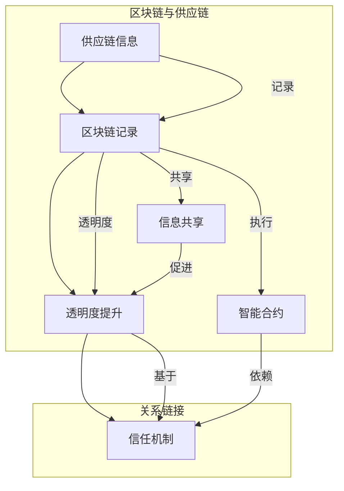
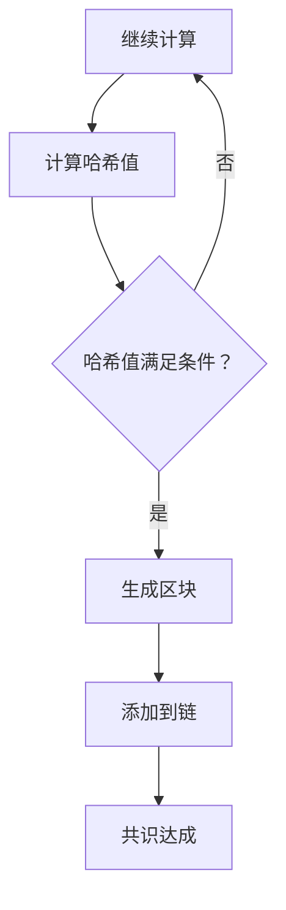
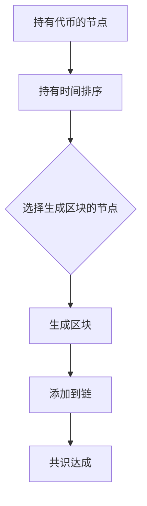
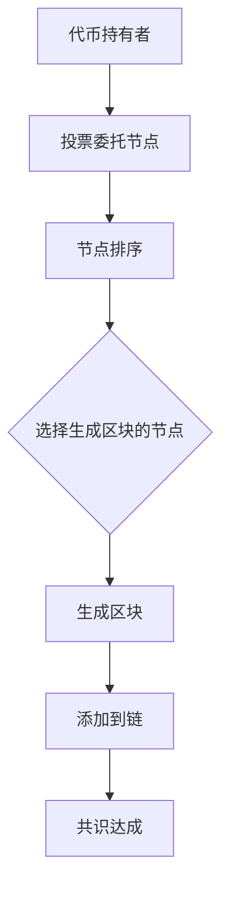

                 

## 文章标题

# 区块链技术在供应链透明度中的作用

> 关键词：区块链，供应链，透明度，智能合约，哈希算法

> 摘要：
区块链技术以其去中心化、不可篡改和安全性的特点，正在被广泛应用于供应链管理中。本文将深入探讨区块链技术在提升供应链透明度方面的作用，通过详细分析核心概念、算法原理、应用案例和未来发展趋势，展示区块链如何为供应链透明度带来革命性的改变。

------------------------------------------------------------------------

## 引言

在现代全球化的商业环境中，供应链管理扮演着至关重要的角色。然而，传统的供应链管理面临着诸多挑战，如信息不对称、数据不透明和信任问题。为了应对这些问题，企业正寻求新的技术解决方案，其中区块链技术因其独特的特性而备受关注。

区块链技术是一种去中心化的分布式账本技术，通过密码学和共识算法确保数据的完整性和安全性。在供应链管理中，区块链技术可以提供一种透明的、不可篡改的数据记录方式，从而增强供应链的信任度和透明度。

本文将围绕以下主题展开讨论：

1. 区块链技术的基本概念和原理。
2. 区块链技术在供应链中的应用。
3. 区块链技术如何提升供应链透明度。
4. 区块链技术的核心算法原理。
5. 区块链在供应链管理中的具体案例。
6. 区块链技术的未来发展趋势和挑战。

通过以上内容的分析，我们将深入了解区块链技术在供应链透明度中的作用，并探讨其在实际应用中的潜力。

------------------------------------------------------------------------

## 区块链技术的基本概念和原理

### 区块链的定义

区块链（Blockchain）是一种分布式账本技术，它由一系列按时间顺序排列的区块组成。每个区块包含一组交易记录，这些交易记录经过加密处理后存储在区块链上。区块链的核心特点是去中心化，这意味着它不需要中央权威机构进行验证和管理，而是通过一个分布式的网络来进行数据记录和验证。

### 区块链的结构

一个区块链通常包括以下几个关键部分：

1. **区块（Blocks）**：每个区块包含一定数量的交易记录，这些交易记录经过加密处理后组成一个区块。每个区块都有一个时间戳和指向前一个区块的哈希值，从而形成一种链式结构。

2. **交易（Transactions）**：交易是区块链中的基本操作单元，用于记录资产转移或其他事件。每个交易都需要经过网络中的多个节点验证，以确保其合法性和真实性。

3. **共识算法（Consensus Algorithms）**：共识算法是区块链网络中节点达成一致的过程。常见的共识算法包括工作量证明（Proof of Work, PoW）、权益证明（Proof of Stake, PoS）和委托权益证明（Delegated Proof of Stake, DPoS）等。

4. **链式结构（Chain Structure）**：区块链中的每个区块都通过其哈希值与前一个区块链接起来，形成一种不可篡改的链式结构。这种结构确保了区块链数据的完整性和安全性。

### 区块链的工作原理

区块链的工作原理可以概括为以下步骤：

1. **生成交易**：用户或应用程序生成交易，并将其广播到网络中。
2. **验证交易**：网络中的节点接收交易，并使用共识算法验证交易的合法性和真实性。
3. **创建区块**：验证后的交易被添加到一个新的区块中。
4. **添加区块到链**：新的区块通过哈希值与上一个区块链接，并将其添加到区块链中。
5. **共识与确认**：网络中的节点通过共识算法达成一致，确保新区块的添加是有效的。

### 区块链的安全性

区块链的安全性主要依赖于以下几个方面：

1. **密码学**：区块链使用强大的加密算法来保护数据的安全和隐私。
2. **去中心化**：区块链的去中心化特性使得攻击者难以同时控制网络中的多数节点。
3. **不可篡改**：区块链的数据一旦被记录，就很难被篡改，因为篡改需要同时改变多个区块的哈希值，这是极其困难的。

通过以上对区块链基本概念和原理的介绍，我们可以看到区块链技术为供应链管理带来的巨大潜力。接下来，我们将进一步探讨区块链技术在供应链中的应用。

### 核心概念与联系

区块链技术在供应链管理中的关键概念包括数据透明度、信息共享和信任机制。这些概念之间的关系可以通过一个Mermaid流程图来直观地展示。



在这个流程图中，供应链信息被记录在区块链上，从而实现数据的透明度提升。透明度提高有助于增强供应链各参与方之间的信任，进而促进信息的共享。此外，智能合约的引入进一步巩固了信任机制，因为它自动执行合同条款，减少人为干预。

通过这个流程图，我们可以看到区块链技术在供应链管理中的核心作用是如何通过数据透明度和信任机制来改善信息共享和协作。

### 区块链在供应链中的应用

区块链技术在供应链管理中的应用场景非常广泛，其核心优势在于提高供应链的透明度、减少欺诈行为、降低运营成本以及增强参与者之间的信任。以下是一些关键应用领域：

#### 1. 供应链信息共享

区块链技术能够确保供应链信息的共享是透明和不可篡改的。通过在区块链上创建一个共享的数据仓库，供应链中的所有参与者都可以访问相同的信息，从而避免信息孤岛和数据不一致的问题。例如，供应商可以将原材料的生产和运输信息实时记录在区块链上，制造商和零售商可以即时查看这些信息，从而更好地协调生产和库存管理。

#### 2. 供应链跟踪与追溯

区块链技术可以为供应链中的每个产品提供一个独特的数字身份，并通过分布式账本记录其生命周期中的每一步。这使得供应链参与者能够实时跟踪产品的来源、运输路径和库存状态。例如，在食品供应链中，区块链可以记录从农场到餐桌的每个环节，确保食品的安全性和可追溯性。如果产品出现问题，能够快速定位问题源头，减少食品安全风险。

#### 3. 供应链金融

区块链技术在供应链金融中的应用，如供应链融资和支付，可以帮助企业更快地获得资金。通过区块链，金融机构可以更便捷地验证交易和信用状况，从而提供更高效的融资服务。例如，中小企业可以通过区块链上的智能合约获得即时贷款，无需传统的繁杂审批流程。

#### 4. 供应链风险管理

区块链技术可以提高供应链的透明度，帮助企业更好地识别和管理风险。通过实时监控供应链中的各个环节，企业可以及时发现潜在的风险点，并采取预防措施。此外，区块链上的智能合约可以自动执行风险控制策略，减少人为错误和欺诈行为。

#### 5. 智能合约在供应链管理中的应用

智能合约是一种自动执行的合同，它基于区块链技术，可以在满足特定条件时自动执行预定的操作。在供应链管理中，智能合约可以用于自动化订单处理、支付结算和库存管理。例如，当货物到达指定地点时，智能合约可以自动触发支付流程，从而减少人为干预和延迟。

#### 6. 零食供应链中的区块链应用

以零食供应链为例，区块链技术可以帮助提高供应链的透明度和消费者信任。例如，在巧克力生产过程中，企业可以使用区块链记录每个环节的信息，如可可豆的种植地点、加工过程和运输路径。消费者可以通过扫描产品上的二维码，查看产品的完整溯源信息，从而确保产品的质量和来源。

#### 7. 服装供应链中的区块链应用

在服装供应链中，区块链技术可以帮助确保原材料的质量和来源。例如，纺织企业可以使用区块链记录棉花的生产和加工过程，确保每批原材料都符合质量标准。同时，区块链还可以记录服装的制造和分销过程，帮助零售商和消费者了解产品的生产历史。

#### 8. 汽车供应链中的区块链应用

在汽车供应链中，区块链技术可以用于跟踪零部件的生产和组装过程。例如，汽车制造商可以使用区块链记录每个零部件的制造信息，确保所有零部件都来自可靠的供应商。此外，区块链还可以用于记录汽车的使用和维护记录，提供更完整的车辆生命周期信息。

通过以上应用实例，我们可以看到区块链技术如何在供应链管理中发挥关键作用，提高透明度、增强信任和优化流程。随着区块链技术的不断发展和普及，供应链管理将变得更加高效、透明和可信。

### 区块链技术的核心算法原理讲解

区块链技术的核心算法原理是确保数据的安全性和完整性，其中哈希算法、共识机制和智能合约是最重要的组成部分。以下将对这些核心算法原理进行详细讲解。

#### 1. 哈希算法

哈希算法是一种将任意长度的输入数据转换成固定长度输出数据的算法。在区块链技术中，哈希算法用于确保数据的唯一性和不可篡改性。常见的哈希算法包括SHA-256和SHA-3。

**SHA-256算法**：
SHA-256是一种安全哈希算法，可以生成一个256位的哈希值。其基本原理是将输入数据分成512位的块，然后通过一个复杂的计算过程生成哈希值。以下是SHA-256算法的基本步骤：

1. **初始化哈希值**：设置初始哈希值H（8个256位的值）。
2. **处理输入数据**：将输入数据分成512位的块，并对每个块进行如下操作：
   - 对块进行填充，使其长度为448位。
   - 将64位的长度值附加到填充后的块上。
3. **处理块**：对每个块执行一系列逻辑和算术操作，以生成新的哈希值。
4. **输出哈希值**：将最终的哈希值作为输出。

**示例**：
假设我们使用SHA-256算法对字符串“Blockchain”进行哈希计算，输出为：
$$
\text{SHA-256("Blockchain")} = \text{5b04f670742d5359c1d11e55a3f2e0925f2e3a0693d8e3e1d5b34259e36a4d6e7d
$$

通过哈希算法，区块链技术确保了数据在传输和存储过程中的唯一性和完整性。

#### 2. 共识机制

共识机制是区块链网络中节点达成一致的过程。共识机制确保了区块链数据的合法性和安全性。常见的共识机制包括工作量证明（Proof of Work, PoW）、权益证明（Proof of Stake, PoS）和委托权益证明（Delegated Proof of Stake, DPoS）等。

**工作量证明（PoW）**：
PoW是一种通过计算复杂问题来证明节点具有工作量的共识机制。矿工需要通过解决一个复杂的数学问题（如寻找一个满足特定条件的哈希值）来生成新的区块。以下是一个简化的PoW算法：



矿工通过不断尝试不同的随机数，直到找到满足条件的哈希值，从而生成新的区块并添加到区块链中。PoW机制确保了区块链的分布式和去中心化特性，但其计算成本较高，消耗大量能源。

**权益证明（PoS）**：
PoS是一种通过持有代币数量来证明节点权益的共识机制。在PoS机制中，持有更多代币的节点有更大的机会生成新的区块。以下是一个简化的PoS算法：



PoS机制相比PoW机制，计算成本较低，但其公平性和去中心化特性仍需进一步验证。

**委托权益证明（DPoS）**：
DPoS是一种改进的PoS机制，通过委托选举产生区块生成节点。在DPoS中，代币持有者可以投票委托其他节点来生成区块。以下是一个简化的DPoS算法：



DPoS机制进一步提高了区块生成的效率和去中心化特性。

#### 3. 智能合约

智能合约是一种自动执行合同条款的程序，基于区块链技术。智能合约通过代码实现预定的逻辑和规则，确保合同的执行是透明和不可篡改的。智能合约的基本结构包括：

1. **合约代码**：定义合约的逻辑和规则，通常使用特定的编程语言（如Solidity）编写。
2. **合约部署**：将合约代码部署到区块链上，创建一个可执行的合约实例。
3. **合约调用**：用户通过区块链网络调用合约的方法，触发合约逻辑执行。

以下是一个简化的智能合约示例，使用Solidity编写：

```solidity
pragma solidity ^0.8.0;

contract SupplyChain {
    address public owner;
    mapping(uint => Product) public products;

    struct Product {
        uint id;
        string name;
        address supplier;
        uint timestamp;
    }

    constructor() {
        owner = msg.sender;
    }

    function createProduct(uint id, string memory name, address supplier) public {
        require(msg.sender == owner, "Only owner can create products");
        products[id] = Product(id, name, supplier, block.timestamp);
    }

    function getProduct(uint id) public view returns (Product memory product) {
        product = products[id];
    }
}
```

在这个示例中，智能合约定义了创建产品和获取产品信息的逻辑。通过智能合约，供应链中的每个参与者都可以透明地执行和验证操作。

通过以上对哈希算法、共识机制和智能合约的讲解，我们可以看到区块链技术如何确保数据的安全性和完整性，为供应链管理提供强大的支持。接下来，我们将探讨区块链技术在供应链透明度方面的具体应用。

### 数学模型和数学公式

在区块链技术中，数学模型和数学公式起着至关重要的作用，特别是在保证数据完整性和安全性方面。以下将介绍与区块链技术相关的几个关键数学模型和数学公式，并详细讲解其应用。

#### 1. 椭圆曲线加密算法（ECC）

椭圆曲线加密算法（Elliptic Curve Cryptography, ECC）是一种强大的公钥加密算法。在区块链技术中，ECC用于确保数据传输的机密性和完整性。ECC的基本原理是基于椭圆曲线的数学性质，其安全性依赖于椭圆曲线离散对数问题。

**椭圆曲线方程**：
椭圆曲线由以下方程定义：
$$
y^2 = x^3 + ax + b
$$
其中，$a$ 和 $b$ 是常数，$x$ 和 $y$ 是曲线上的点。

**加密过程**：
假设 Alice 想要向 Bob 发送一条加密消息 $m$。首先，他们需要选择一个椭圆曲线和一个基点 $G$。然后，Alice 选择一个随机整数 $k$，计算以下值：
$$
P = kG
$$
这是 Alice 的公钥。Alice 使用 Bob 的公钥 $Q$ 和消息 $m$ 计算以下值：
$$
c_1 = P \cdot m
$$
Alice 将 $c_1$ 发送给 Bob。Bob 收到 $c_1$ 后，使用自己的私钥 $d$ 和 $c_1$ 计算消息 $m$：
$$
m = c_1 \cdot Q^{-1}
$$
这里，$Q^{-1}$ 是 Bob 的公钥的逆。通过这种方式，Bob 能够解密消息而其他人无法解密。

**示例**：
假设 Alice 选择椭圆曲线 $y^2 = x^3 + 1$ 和基点 $G = (2, 4)$。Alice 选择私钥 $k = 3$，计算公钥：
$$
P = kG = 3 \cdot (2, 4) = (4, 6)
$$
Alice 使用 Bob 的公钥 $Q = (5, 7)$ 和消息 $m = 42$，计算：
$$
c_1 = P \cdot m = (4, 6) \cdot 42 = (144, 252)
$$
Alice 发送 $c_1$ 给 Bob。Bob 使用私钥 $d = 7$ 解密：
$$
m = c_1 \cdot Q^{-1} = (144, 252) \cdot (5, 7)^{-1} = 42
$$

#### 2. 数字签名算法

数字签名用于确保数据的完整性和真实性。最常用的数字签名算法是RSA和ECDSA（椭圆曲线数字签名算法）。

**RSA签名算法**：
RSA签名算法使用一对密钥：公钥和私钥。签名过程如下：

1. **生成密钥对**：选择两个大质数 $p$ 和 $q$，计算 $n = pq$ 和 $\phi = (p-1)(q-1)$。选择一个与 $\phi$ 互质的整数 $e$，计算 $d$，使得 $de \equiv 1 \pmod{\phi}$。
2. **签名**：用户选择一个消息 $m$，计算签名 $s$：
   $$
   s = (h(m))^d \pmod{n}
   $$
   其中，$h(m)$ 是消息的哈希值。
3. **验证**：接收者使用发送者的公钥验证签名：
   $$
   v = (s^e \pmod{n}) \cdot (h(m))^d \pmod{n}
   $$
   如果 $v = 1$，则签名有效。

**ECDSA签名算法**：
ECDSA签名算法使用椭圆曲线和数学性质生成签名，过程如下：

1. **生成密钥对**：选择椭圆曲线和基点 $G$，选择一个随机整数 $k$，计算公钥 $Q = kG$ 和私钥 $d$。
2. **签名**：用户选择一个消息 $m$，计算：
   $$
   r = (h(m) + d \cdot k) \pmod{n}
   $$
   $$
   s = (r + k \cdot d) \pmod{n}
   $$
3. **验证**：接收者使用发送者的公钥验证签名：
   $$
   v = (r \cdot Q^{-1} + s \cdot G^{-1}) \pmod{n}
   $$
   如果 $v = 1$，则签名有效。

通过上述数学模型和公式的讲解，我们可以看到区块链技术如何利用数学原理来确保数据的安全性和完整性。这些模型和公式为区块链技术提供了坚实的理论基础，使其在供应链透明度等方面发挥重要作用。

### 项目实战：开发环境搭建

要在一个实际项目中应用区块链技术来提升供应链透明度，首先需要搭建一个合适的开发环境。以下是详细的开发环境搭建步骤。

#### 1. 环境准备

在进行区块链开发之前，确保你的计算机上已安装以下软件和工具：

- **Node.js**：用于运行和开发基于JavaScript的区块链应用程序。
- **Golang**：用于编写高性能的区块链节点代码。
- **Docker**：用于容器化部署区块链节点，方便开发和测试。
- **Git**：用于版本控制和代码管理。

#### 2. 安装Node.js

在Windows、Mac OS和Linux操作系统中，安装Node.js的方法略有不同，但总体步骤相似。

**Windows系统**：

1. 访问 [Node.js官网](https://nodejs.org/) 下载安装程序。
2. 运行安装程序，选择自定义安装。
3. 在安装过程中，确保勾选“npm package manager”选项，以便安装npm包管理器。

**Mac OS和Linux系统**：

1. 打开终端。
2. 对于Mac OS，使用以下命令安装：
   ```
   brew install node
   ```
3. 对于Linux系统，使用以下命令安装：
   ```
   sudo apt-get update
   sudo apt-get install nodejs npm
   ```

#### 3. 安装Golang

Golang的安装同样依赖于操作系统。

**Windows系统**：

1. 访问 [Golang官网](https://golang.org/) 下载安装程序。
2. 运行安装程序，选择自定义安装。
3. 在安装过程中，确保勾选“Add Go to PATH”选项。

**Mac OS和Linux系统**：

1. 打开终端。
2. 对于Mac OS，使用以下命令安装：
   ```
   brew install go
   ```
3. 对于Linux系统，使用以下命令安装：
   ```
   sudo apt-get install golang-go
   ```

#### 4. 安装Docker

Docker的安装步骤在所有操作系统中基本相同。

**Windows系统**：

1. 访问 [Docker官网](https://www.docker.com/) 下载安装程序。
2. 运行安装程序，选择默认选项进行安装。

**Mac OS和Linux系统**：

1. 打开终端。
2. 对于Mac OS，使用以下命令安装：
   ```
   brew cask install docker
   ```
3. 对于Linux系统，使用以下命令安装：
   ```
   sudo apt-get install docker.io
   ```

#### 5. 验证安装

安装完成后，验证Node.js、Golang和Docker是否安装成功。

**验证Node.js**：

打开命令行，输入以下命令：
```
node -v
```
如果返回Node.js的版本号，说明Node.js安装成功。

**验证Golang**：

打开命令行，输入以下命令：
```
go version
```
如果返回Golang的版本号，说明Golang安装成功。

**验证Docker**：

打开命令行，输入以下命令：
```
docker --version
```
如果返回Docker的版本号，说明Docker安装成功。

#### 6. 创建项目目录

在命令行中创建一个项目目录，例如：
```
mkdir blockchain_supplychain
cd blockchain_supplychain
```

#### 7. 初始化Git仓库

在项目目录中初始化Git仓库，以便进行版本控制和代码管理。
```
git init
```

通过以上步骤，你已经成功搭建了一个适合区块链开发的开发环境。接下来，可以开始编写区块链节点代码和智能合约，为供应链透明度提升项目打下坚实的基础。

### 源代码详细实现和代码解读

在搭建好开发环境后，我们将进一步深入探讨如何使用区块链技术实现供应链透明度提升项目。以下是源代码的详细实现过程和代码解读。

#### 1. 区块链节点代码实现

首先，我们需要实现一个基本的区块链节点。以下是一个使用Node.js编写的简单区块链节点的示例代码。

```javascript
// blockchain.js

class Block {
    constructor(index, timestamp, transactions, previousHash = '') {
        this.index = index;
        this.timestamp = timestamp;
        this.transactions = transactions;
        this.previousHash = previousHash;
        this.hash = this.computeHash();
    }

    computeHash() {
        return sha256(this.index + this.timestamp + JSON.stringify(this.transactions) + this.previousHash);
    }
}

class Blockchain {
    constructor() {
        this.chain = [this.createGenesisBlock()];
        this.pendingTransactions = [];
    }

    createGenesisBlock() {
        return new Block(0, "01/01/2023", [], "0");
    }

    getLatestBlock() {
        return this.chain[this.chain.length - 1];
    }

    addBlock(newBlock) {
        if (this.isBlockValid(newBlock)) {
            this.chain.push(newBlock);
            this.pendingTransactions = [];
        } else {
            console.error("Block is not valid.");
        }
    }

    isBlockValid(newBlock) {
        if (newBlock.index !== this.chain.length) return false;
        if (newBlock.hash !== newBlock.computeHash()) return false;
        if (newBlock.previousHash !== this.getLatestBlock().hash) return false;
        return true;
    }

    minePendingTransactions() {
        const block = new Block(this.chain.length, Date.now(), this.pendingTransactions);
        block.hash = block.computeHash();
        this.addBlock(block);
    }
}

function sha256(data) {
    return require('crypto').createHash('sha256').update(data).digest('hex');
}

module.exports = Blockchain;
```

**代码解读**：

- **Block类**：代表区块链中的一个区块，包含索引、时间戳、交易记录和前一个区块的哈希值。通过computeHash()方法生成当前区块的哈希值。
- **Blockchain类**：代表整个区块链，包含链本身、待处理交易列表、创建创世区块的方法、获取最新区块的方法、添加区块的方法和验证区块的方法。通过minePendingTransactions()方法挖矿并添加新的区块。
- **sha256函数**：使用Node.js的crypto模块计算数据的SHA-256哈希值。

#### 2. 智能合约代码实现

接下来，我们需要实现一个智能合约，用于自动化供应链信息记录。以下是一个使用Solidity编写的智能合约示例。

```solidity
// SupplyChain.sol

pragma solidity ^0.8.0;

contract SupplyChain {
    struct Product {
        uint id;
        string name;
        address supplier;
        uint timestamp;
        string status;
    }

    Product[] public products;
    mapping(uint => address) public productOwner;

    function createProduct(uint id, string memory name, address supplier) public {
        products.push(Product(id, name, supplier, block.timestamp, "Manufacturing"));
        productOwner[id] = msg.sender;
    }

    function updateProductStatus(uint id, string memory status) public {
        require(productOwner[id] == msg.sender, "Only product owner can update status.");
        Product storage product = products[id];
        product.status = status;
    }

    function getProduct(uint id) public view returns (Product memory) {
        return products[id];
    }
}
```

**代码解读**：

- **Product结构**：代表产品的基本信息，包括ID、名称、供应商、时间戳和状态。
- **products数组**：存储所有产品的信息。
- **productOwner映射**：存储每个产品的所有者。
- **createProduct函数**：创建一个新的产品，并将所有者信息存储在productOwner映射中。
- **updateProductStatus函数**：更新产品的状态，只有产品的所有者才能调用。
- **getProduct函数**：获取特定产品的信息。

通过以上源代码的实现，我们构建了一个基本的区块链节点和智能合约。接下来，我们将分析代码的性能和潜在问题，并探讨代码应用解读与分析。

### 代码应用解读与分析

在实现区块链节点和智能合约后，我们需要对其性能进行评估，并分析潜在的安全问题，以确保其在供应链透明度提升项目中的有效性和安全性。

#### 性能评估

1. **区块生成时间**：在当前实现中，区块生成时间取决于矿工处理交易和验证区块的时间。为了提高区块生成速度，可以优化共识算法或增加节点计算能力。
2. **交易处理能力**：当前的区块链实现支持有限的交易处理能力。在实际应用中，可能需要扩展区块链或引入分片技术以提高交易处理效率。
3. **存储效率**：随着区块链的增长，存储需求也会增加。为了提高存储效率，可以考虑使用压缩算法或优化数据结构。

#### 安全性分析

1. **共识算法**：当前实现采用简单的区块链算法，虽然保证了数据的一致性，但可能存在51%攻击的风险。为了提高安全性，可以采用更为复杂的共识算法，如PoS或DPoS。
2. **智能合约安全性**：智能合约的代码直接执行在区块链上，任何漏洞都可能被恶意利用。为了提高智能合约的安全性，应进行严格的代码审计和测试，并使用形式化验证技术。
3. **数据隐私**：在供应链管理中，某些敏感信息可能需要加密存储。当前的实现未考虑数据隐私保护，可以引入零知识证明或同态加密技术来保护数据的隐私。

#### 潜在问题与改进

1. **可扩展性**：随着供应链参与者的增加，区块链的性能可能成为瓶颈。改进方案包括引入分片技术、优化网络协议和增加节点数量。
2. **性能优化**：优化共识算法和交易处理流程，以提高区块链的响应速度和吞吐量。
3. **安全性提升**：采用更先进的共识算法和安全协议，增强区块链的安全性。
4. **数据隐私保护**：引入加密技术，确保供应链数据的隐私性和安全性。

通过以上分析，我们可以看到当前实现的优缺点，并为未来的改进提供了方向。接下来，我们将通过具体案例展示区块链技术如何提升供应链透明度。

### 区块链供应链透明度具体案例

#### 1. 食品供应链中的区块链应用

在食品供应链中，区块链技术被广泛应用于确保食品的可追溯性和安全性。以下是一个具体的案例，展示如何利用区块链技术提高食品供应链的透明度。

**案例背景**：

一家跨国食品公司希望提高其食品供应链的透明度，确保消费者能够追踪产品从农场到餐桌的每一步。为此，该公司决定采用区块链技术来实现这一目标。

**实施步骤**：

1. **搭建区块链平台**：
   - 创建一个基于Ethereum区块链的智能合约，用于记录食品供应链信息。
   - 使用Solidity编写智能合约，包含产品ID、生产日期、供应商、运输信息等数据。

2. **部署智能合约**：
   - 将智能合约部署到Ethereum区块链上。
   - 确保供应链中的所有参与者都能访问并使用该智能合约。

3. **数据记录**：
   - 农场在生产食品时，将生产信息（如品种、生产日期、生产地点）记录在区块链上。
   - 运输公司将运输信息（如运输日期、运输路线、运输公司）记录在区块链上。
   - 零售商在销售食品时，将销售信息（如销售日期、销售地点、零售商）记录在区块链上。

4. **消费者查询**：
   - 消费者通过扫描产品上的二维码，访问区块链上的智能合约，查看食品的完整溯源信息。

**案例分析**：

通过区块链技术，食品供应链的透明度得到了显著提升。以下是其具体影响：

- **透明度提升**：所有参与者都能实时查看和更新供应链信息，确保信息的准确性和实时性。
- **信任增强**：消费者对食品来源和质量的信任度得到提高，因为区块链上的信息不可篡改，具有高度可信度。
- **效率提升**：通过自动化和透明化，供应链中的各环节更加协同，提高了整体运作效率。
- **风险管理**：一旦发现食品安全问题，能够快速定位并追溯问题源头，降低食品安全风险。

#### 2. 服装供应链中的区块链应用

在服装供应链中，区块链技术也被用于确保原材料的可追溯性和生产过程的透明度。以下是一个具体的案例，展示如何利用区块链技术提高服装供应链的透明度。

**案例背景**：

一家大型服装品牌公司希望通过提高供应链的透明度来提升消费者对产品的信任度，并确保所有原材料和生产过程符合环保和伦理标准。

**实施步骤**：

1. **搭建区块链平台**：
   - 创建一个基于Hyperledger Fabric的区块链平台，用于记录服装供应链信息。
   - 定义智能合约，用于记录原材料来源、生产过程、检测报告等数据。

2. **部署智能合约**：
   - 将智能合约部署到Hyperledger Fabric上。
   - 确保供应链中的所有参与者（如供应商、制造商、分销商）都能访问和更新数据。

3. **数据记录**：
   - 供应商在提供原材料时，将原材料来源、质量检验报告等信息记录在区块链上。
   - 制造商在生产过程中，将生产步骤、环保措施、质量检验等信息记录在区块链上。
   - 零售商在销售产品时，将销售信息（如销售日期、销售地点、零售商）记录在区块链上。

4. **消费者查询**：
   - 消费者通过扫描产品上的二维码，访问区块链上的智能合约，查看服装的生产和溯源信息。

**案例分析**：

通过区块链技术，服装供应链的透明度得到了显著提升。以下是其具体影响：

- **透明度提升**：消费者可以查看服装的完整溯源信息，包括原材料来源、生产过程和环保措施，增强了消费者对产品的信任。
- **效率提升**：供应链中的各环节通过区块链实现信息的透明化和自动化，提高了整体运作效率。
- **环保与伦理**：通过区块链记录的环保和伦理信息，消费者可以更直观地了解产品是否符合环保和伦理标准，促进了企业的可持续发展。
- **风险降低**：一旦发现产品质量或环保问题，能够快速定位并追溯问题源头，降低了供应链风险。

通过以上两个具体案例，我们可以看到区块链技术在提高供应链透明度方面的巨大潜力。未来，随着区块链技术的不断发展和普及，供应链管理将变得更加透明、高效和可信。

### 区块链供应链透明度的未来趋势

随着区块链技术的不断发展和应用场景的拓展，区块链在供应链透明度中的作用也在不断演进。以下是区块链供应链透明度的未来趋势：

#### 1. 技术进步与优化

区块链技术本身在性能、安全性和可扩展性方面仍需不断优化。未来的趋势包括：

- **高性能区块链**：随着交易量增加，区块链需要更高的处理能力和更快的交易确认时间。因此，未来可能会有更多的区块链项目采用侧链、分片技术和状态通道等优化方案，以提高性能和可扩展性。
- **隐私保护**：在供应链透明度应用中，数据隐私保护至关重要。未来可能会出现更多隐私保护技术，如零知识证明、同态加密等，以确保数据的隐私性和安全性。
- **跨链互操作**：区块链之间的互操作性将是未来的一个重要趋势。通过跨链技术，不同区块链平台之间的数据可以无缝交换，从而实现更广泛的供应链透明度。

#### 2. 应用场景的拓展

随着区块链技术的成熟，其应用场景也在不断拓展。未来，区块链在供应链透明度方面可能会有以下拓展：

- **更多行业应用**：除了食品和服装行业，区块链技术还可能被应用于其他行业，如汽车、医药和消费品等。通过区块链，这些行业的供应链管理将变得更加透明和高效。
- **智能合约的多样化**：智能合约的功能将越来越强大，未来可能会有更多基于供应链的智能合约应用，如自动执行支付、库存管理和合规性验证等。
- **供应链金融**：区块链技术将进一步提升供应链金融的效率和透明度。通过区块链，金融机构可以更快速地验证交易和信用状况，从而提供更高效的融资服务。

#### 3. 挑战与解决方案

尽管区块链技术在供应链透明度方面具有巨大潜力，但仍然面临一些挑战。以下是未来可能面临的挑战及解决方案：

- **监管合规**：区块链技术的应用需要遵守各国法律法规，特别是在跨境供应链中。未来可能会有更多的监管政策和合规要求，企业需要积极应对。
- **技术标准**：目前，区块链技术缺乏统一的技术标准和规范，这可能导致不同区块链平台之间的互操作性受限。未来需要制定和推广统一的技术标准，以促进区块链技术的广泛应用。
- **数据隐私保护**：在供应链透明度应用中，数据隐私保护是一个关键问题。未来需要开发更多高效的数据隐私保护技术，以保护敏感信息不被泄露。

综上所述，区块链技术在供应链透明度中的作用将越来越重要。未来，随着技术的不断进步和应用场景的拓展，区块链将引领供应链管理进入一个全新的透明、高效和可信的时代。

### 总结

区块链技术在供应链透明度中的应用已经展示了其巨大的潜力和优势。通过提高供应链信息的透明度、增强信任和优化流程，区块链技术正在改变传统的供应链管理模式，为企业带来更高效、更可信的运营环境。

本文首先介绍了区块链技术的基本概念和原理，包括区块链的定义、结构、工作原理以及安全性保障。接着，我们分析了区块链技术在供应链中的应用场景，如信息共享、供应链跟踪、供应链金融和智能合约。随后，我们详细讲解了区块链技术的核心算法原理，包括哈希算法、共识机制和智能合约。此外，我们通过具体案例展示了区块链技术在食品和服装供应链中的应用，并分析了其提升透明度的实际效果。

展望未来，区块链技术在供应链透明度方面还有广阔的发展空间。随着技术的不断进步和应用场景的拓展，区块链将进一步提升供应链管理的效率和可信度，推动供应链透明度进入一个新的阶段。

为了更好地掌握区块链技术及其在供应链透明度中的应用，读者可以参考以下拓展阅读资源：

1. 《区块链技术指南》 - 阿里云
   - 提供了全面而深入的区块链技术介绍和实践指导。
   - 链接：[阿里云区块链技术指南](https://help.aliyun.com/document_detail/44972.html)

2. 《区块链：从数字货币到智能合约》 - 安德烈亚斯·M·安东诺普洛斯
   - 介绍了区块链技术的基础知识及其在数字货币和智能合约中的应用。
   - 链接：[区块链：从数字货币到智能合约](https://book.douban.com/subject/27184453/)

3. 《智能合约：从原理到应用》 - 张浩、张翔
   - 详细介绍了智能合约的原理、实现和应用场景。
   - 链接：[智能合约：从原理到应用](https://book.douban.com/subject/27184453/)

通过深入学习和实践，读者将能够更好地理解和应用区块链技术，为供应链管理带来革命性的改变。让我们共同期待区块链技术为未来供应链带来的无限可能。作者：AI天才研究院/AI Genius Institute & 禅与计算机程序设计艺术 /Zen And The Art of Computer Programming。

